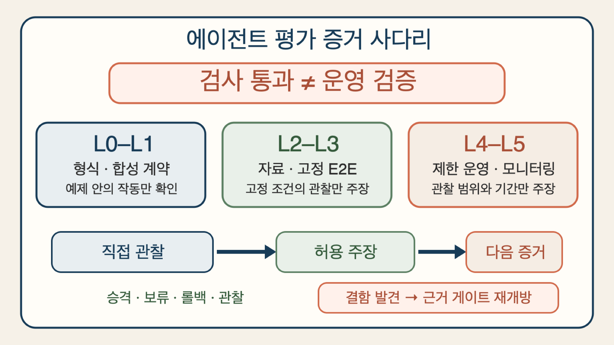
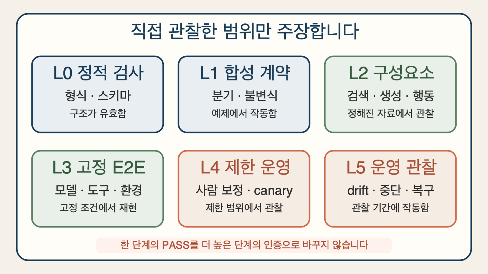
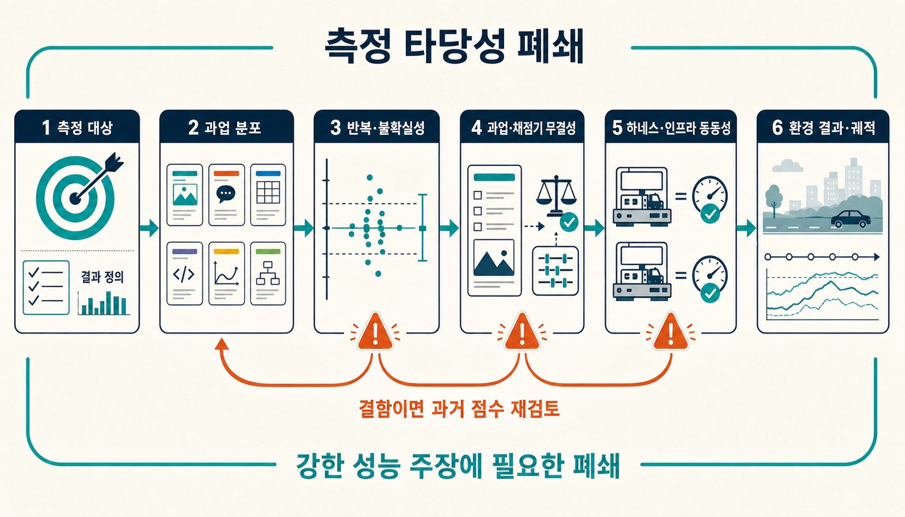
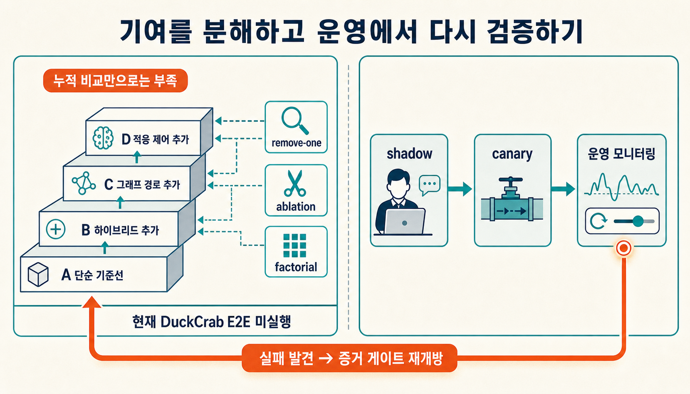

> [!summary] 핵심 결론
> 합성 검사를 모두 통과했다는 사실은 작성한 규칙의 분기와 불변식이 예제 안에서 작동했다는 뜻이지, 실제 과업 성능이나 운영 안전성을 입증했다는 뜻이 아닙니다. **평가 증거를 L0 정적 검사부터 L5 배포 후 관찰까지 나누고, 각 단계에서 허용되는 주장 상한을 고정해야 합니다.**

한 에이전트가 120개의 합성 시나리오를 모두 통과했다고 가정해 보겠습니다. 스키마 오류도 없고, 금지된 도구를 호출하는 분기도 막혔으며, 근거가 부족할 때 보류하는 상태 전이도 예상대로 작동했습니다. 대시보드에는 초록색 표시만 남았습니다.

이제 이 에이전트가 실제 고객 요청을 더 정확하게 처리하고, 운영 비용을 줄이며, 장애 상황에서도 안전하다고 말해도 될까요?

아직은 아닙니다. 합성 검사가 답한 질문은 “우리가 적은 예제에서 계약이 실행되는가?”입니다. 실제 고객 분포, 예상하지 못한 표현, 외부 서비스 지연, 평가자의 오류, 반복 실행의 변동, 배포 뒤의 복구까지는 다른 증거가 필요합니다.

[[notes/graphrag-retrieval-routing-stopping|23번 글]]의 최신 공개본에는 검색 제어를 점검하는 아홉 종류의 합성 스위트가 있습니다. 각 스위트는 누락된 분기와 상태 전이를 찾는 데 유용하지만, 그 글도 실제 동일 예산 검색 성능과 운영 준비도는 미검증이라고 선을 그었습니다. 이 글은 그 경계를 평가 전체로 확장합니다.

## 통과한 검사와 입증한 주장을 분리합니다

평가 결과를 읽을 때는 먼저 세 문장을 분리해야 합니다.

```text
검사를 실행했다
≠ 검사가 의도한 속성을 정확히 측정했다
≠ 실제 운영에서도 같은 속성이 유지된다
```

예를 들어 JSON Schema 통과는 출력 형식의 적합성을 보여 줍니다. 결정론적 상태 검사 통과는 작성한 입력에서 전이가 예상대로 일어났음을 보여 줍니다. 고정 데이터셋의 점수는 그 데이터와 실행 조건에서 관찰한 성능입니다. 제한된 실제 트래픽의 결과는 해당 기간과 사용자군에서의 운영 관찰입니다. 이 네 결과는 서로 유용하지만 같은 뜻은 아닙니다.

NIST의 자동 benchmark 지침은 benchmark 선택, 실행, 분석과 보고를 하나의 평가 과정으로 보며, 통계 모델을 다룬 별도 지침은 고정된 문제 모음의 정확도와 더 넓은 과업 분포에 대한 일반화를 구분합니다.[src_001](#src-001)[src_002](#src-002) Anthropic의 에이전트 평가 지침도 최종 답뿐 아니라 실제 환경 결과와 실행 궤적을 기록하고, 여러 trial로 변동을 확인할 것을 권합니다.[src_003](#src-003)

이 글에서는 각 증거가 허용하는 최대 주장 강도를 **주장 상한(claim ceiling)**이라고 부르겠습니다. 널리 합의된 표준 용어가 아니라, 검사 결과가 갑자기 성능·안전성·운영 준비도 주장으로 커지는 일을 막기 위한 프로젝트의 편집·승격 규칙입니다.



## L0과 L1은 계약의 모양과 분기를 검사합니다

### L0 — 정적·스키마·fixture 검사

L0는 가장 싸고 빠른 검사입니다.

- 필수 필드와 타입이 맞는가
- 링크·해시·revision이 존재하는가
- 금지된 값과 경로를 차단하는가
- 작은 fixture가 예상 결과를 내는가

이 단계의 주장 상한은 **“명시한 형식과 정적 조건에 맞는다”**입니다. 원자료가 사실인지, 평가 기준이 업무를 제대로 대표하는지, 에이전트가 실제 환경에서 성공하는지는 말할 수 없습니다.

### L1 — 합성 계약·변이 검사

L1은 분기, 불변식과 실패 처리를 의도적으로 만든 사례로 흔듭니다.

- 근거가 없으면 보류하는가
- 권한 revision이 바뀌면 결과를 차단하는가
- 후보 순서나 표현이 바뀌어도 핵심 판정이 유지되는가
- 한 계층을 제거하면 어떤 의무가 다시 열리는가

[[notes/ontology-agent-behavior-experiment|5번 글]]의 비교 실험에서는 JSON 규칙, 구조화 검색 카드와 SHACL이 같은 작성자 정의 Boolean 정책을 각각 10/10으로 재현했습니다. 그러나 독립 정답이 아니라 동일한 정책을 세 artifact에 옮긴 적합성 검사였으므로, 형식의 우월성이나 실제 업무 정확도를 주장하지 않았습니다.

L1의 주장 상한도 비슷합니다. **“작성한 합성 사례에서 계약 분기와 변이가 예상대로 작동했다”**까지입니다. 시나리오를 만든 사람이 놓친 실패, 실제 입력의 긴 꼬리와 모델의 확률적 변동은 아직 밖에 있습니다.

## L2와 L3에서 실제 자료와 전체 실행을 연결합니다

### L2 — 구성요소별 오프라인 평가

L2부터는 실제 또는 대표성이 검토된 자료를 사용합니다. 검색, 채점, 생성, 도구 선택처럼 구성요소를 따로 측정합니다.

RAG 평가에서는 검색 문맥의 관련성, 답의 근거 충실도와 답변 품질을 한 점수로 섞지 않는 편이 중요합니다. RAGVUE는 진단 가능한 평가 보기를 제안하고, ARES와 RAGAs는 검색 문맥과 생성 답변의 서로 다른 품질 축을 자동 평가합니다.[src_011](#src-011)[src_012](#src-012)[src_013](#src-013) 이 단계의 주장 상한은 **“정해진 데이터·구성요소·평가 절차에서 이 결과를 관찰했다”**입니다.

여기에도 함정이 있습니다. 일반 질문만 모은 데이터셋은 답할 수 없는 요청을 숨길 수 있고, 서로 매우 비슷한 문서가 많은 현실 corpus는 검색 중복 문제를 드러낼 수 있습니다. UAEval4RAG와 RARE는 각각 이런 빈칸을 겨냥합니다.[src_016](#src-016)[src_017](#src-017) 따라서 높은 평균 점수 하나보다 어떤 실패 유형을 포함했는지 먼저 봐야 합니다.

### L3 — 고정된 end-to-end 평가

L3는 모델, prompt, 도구, 자료 revision, 권한, 시간·token 예산과 실행 환경을 고정하고 처음부터 끝까지 돌립니다. 최종 답만 채점하지 않고 실제 환경 상태가 원하는 결과로 바뀌었는지, 필수 실행 궤적을 지켰는지, 같은 사례를 반복했을 때 얼마나 흔들리는지도 기록합니다.

OpenAI의 제3자 평가 지침과 GDPval은 모델 점수만 떼어 보기보다 도구·scaffold·prompt·환경 조건을 함께 공개하는 방향을 강조합니다.[src_005](#src-005)[src_006](#src-006) 에이전트 코딩 평가에서 infrastructure 차이가 성공률을 바꿀 수 있다는 실험도 평가 환경을 단순 배경이 아니라 측정 장치의 일부로 보게 합니다.[src_004](#src-004)

L3의 주장 상한은 **“고정한 end-to-end 계약과 반복 trial에서 이 성능·비용·실패율을 관찰했다”**입니다. 아직 전체 사용자, 장기 drift와 실제 운영 안전성으로 일반화할 수는 없습니다.

## 점수가 나왔다고 측정이 닫힌 것은 아닙니다

실제 benchmark를 돌리면 L1보다 강한 증거가 생깁니다. 하지만 실행했다는 사실만으로 점수가 타당해지는 것은 아닙니다.

이 글에서는 강한 성능 주장 전에 확인할 묶음을 **측정 타당성 폐쇄(Measurement-Validity Closure)**라고 부릅니다. 이것도 공식 표준이 아니라 다음 여섯 질문을 놓치지 않기 위한 프로젝트 프레임입니다.

1. **측정 대상:** 정확히 어떤 결과를 개선했다고 말하려는가
2. **과업 분포:** 고정 fixture가 아니라 어느 사용자·업무 범위로 일반화하려는가
3. **반복과 불확실성:** trial 수, 분산, 신뢰구간과 실패 꼬리를 기록했는가
4. **과업·채점기 무결성:** 문제, 정답, grader와 평가 기준에 결함이 없는가
5. **하네스·인프라 동등성:** 후보들이 같은 자원·도구·시간·실패 처리 조건에서 실행됐는가
6. **환경 결과와 궤적:** 그럴듯한 transcript가 아니라 실제 상태 변화와 필수 과정을 확인했는가



LLM judge도 이 폐쇄의 일부입니다. 20개 NLP 평가 과업을 비교한 대규모 연구는 LLM judge가 사람 평가를 일관되게 대체하지 못하며 과업별 차이가 크다는 결과를 보고했습니다.[src_014](#src-014) GDPval의 grading 절차처럼 과업별 rubric과 사람 평가를 함께 두고 보정해야 하는 이유입니다.[src_007](#src-007)

더 중요한 운영 규칙은 **결함이 발견되면 이미 닫은 증거 게이트를 다시 여는 것**입니다. OpenAI의 SWE-Bench Pro public split 감사는 잘못되거나 평가하기 어려운 task를 분리해 점수를 다시 해석한 사례입니다.[src_008](#src-008) 과업·채점기·하네스 결함을 고친 뒤에도 과거 점수를 그대로 유지하면, 숫자는 같아 보여도 더 이상 같은 측정을 뜻하지 않습니다.

## 누적 비교만으로는 어느 계층이 기여했는지 알기 어렵습니다

에이전트 시스템은 보통 한 번에 여러 기능을 더합니다.

```text
A. 단순 lexical·규칙 기준선
B. A + vector·hybrid retrieval
C. B + graph route
D. C + adaptive query·pruning·stopping
```

D가 A보다 좋더라도 graph route, query 변환, 후보 증가, reranker와 token 순서가 함께 바뀌었다면 무엇이 이득을 만들었는지 알 수 없습니다. 그래서 누적 A→D 비교 옆에 다음 실험이 필요합니다.

- **remove-one:** D에서 graph, adapter, pruning 또는 stopping을 하나씩 제거합니다.
- **ablation:** 특정 신호나 receipt만 꺼서 결과 차이를 봅니다.
- **factorial:** `route × query adapter`, `retriever × reranker`처럼 상호작용을 분리합니다.
- **sham/placebo:** 실행에는 영향 없는 변경으로 단순 event 효과를 확인합니다.
- **oracle arm:** 이상적인 후보·정답·중단 신호를 주어 병목의 최대 여지를 봅니다.

이 비교도 candidate 수, token, latency, 도구 권한과 실패 처리 예산을 맞춰야 합니다. 그렇지 않으면 “새 계층이 좋아서”가 아니라 “더 많은 자원을 써서” 생긴 차이를 기능의 고유 기여로 오인할 수 있습니다.

## L4와 L5는 실제 운영의 다른 질문에 답합니다

### L4 — 사람 보정과 제한 운영

L4는 고정 평가 밖으로 나가되 피해 범위를 제한합니다.

- 실제 언어·도메인 사례로 사람과 judge를 보정합니다.
- shadow mode에서 결과를 실행하지 않고 비교합니다.
- canary로 작은 트래픽과 낮은 위험 행동만 엽니다.
- 예상하지 못한 실패 유형과 사용자 이의를 수집합니다.

이 단계의 주장 상한은 **“제한한 사용자·기간·트래픽·위험 범위에서 이 운영 결과를 관찰했다”**입니다. Canary 성공을 전체 배포의 안전성 인증으로 바꾸면 안 됩니다.

### L5 — 배포 후 모니터링과 복구

배포 전 평가는 통제된 조건에서 비교하기 좋지만, 실제 운영의 drift, 새로운 악용, 외부 서비스 변화와 드문 실패를 모두 재현할 수 없습니다. NIST의 배포 AI 모니터링 지침은 출시 전 평가와 지속 모니터링이 맡는 역할을 구분합니다.[src_009](#src-009) NIST의 agentic AI probe 작업도 에이전트 평가를 실제 환경에 삽입해 지속적으로 관찰하는 방향을 다룹니다.[src_018](#src-018)

L5에서는 품질·비용·지연뿐 아니라 다음 항목이 필요합니다.

- 데이터·모델·도구·정책 revision별 drift
- 심각도별 거짓 통과와 거짓 차단
- 권한·근거·도구 실패의 부분 성공 처리
- canary 중단, rollback과 결과 회수
- 새 실패가 발견됐을 때 L1~L4 회귀 세트로 되돌리는 경로

L5의 주장 상한도 무제한은 아닙니다. **“관찰한 운영 범위와 기간에서 모니터링·중단·복구가 작동했다”**까지입니다. 미래의 모든 사용자와 공격에 안전하다는 보증은 아닙니다.



## 현재 GraphRAG 사례의 정확한 다음 단계

23번 글의 아홉 합성 스위트는 route, query contract, 근거 공백, 기여 폐쇄, 가역적 가지치기와 평가 사다리의 상태 규칙을 점검했습니다. 이는 L1 증거입니다. “작성한 계약 분기가 합성 사례에서 작동했다”는 말은 할 수 있습니다.

아직 닫히지 않은 것은 다음입니다.

- 실제 DuckCrab에서 lexical·vector·graph·RRF 경로를 같은 예산으로 비교
- route와 query adapter의 효과를 분리한 factorial 실험
- 한국어 alias·부정·시간 표현의 독립 gold label과 사람 평가
- 반복 trial의 분산, p50·p95 latency와 실제 비용
- 제한 트래픽의 shadow·canary와 rollback drill

따라서 지금 할 일은 합성 시나리오를 계속 늘려 초록색 칸을 채우는 것이 아닙니다. 동일한 질문·자료·모델·권한·revision·예산을 고정한 L2 구성요소 비교와 L3 end-to-end 실행 계약을 먼저 만드는 일입니다.

## 평가 사다리는 점수판이 아니라 주장 제한 장치입니다

L0부터 L5까지의 사다리를 성숙도 점수로 사용하면 또 다른 문제가 생깁니다. 모든 기능이 L5를 필요로 하지는 않습니다. 문서 포맷터처럼 부작용이 작고 결과를 쉽게 검토할 수 있는 기능은 L1~L2로도 충분할 수 있습니다. 반면 권한을 바꾸거나 돈을 이동하는 에이전트는 제한 운영, 사람 책임과 복구 증거 없이는 자동화 범위를 넓히기 어렵습니다. 필요한 단계는 시스템 이름이 아니라 **주장과 실패 비용**이 정합니다.

이 글의 평가 사다리와 측정 타당성 폐쇄는 업계 표준이 아니라, 확보한 증거와 공개할 문장의 강도를 맞추기 위한 프로젝트의 판단 틀입니다. 실제 자료로 점수를 냈더라도 무엇을 측정했는지, 어느 과업 범위에 적용할지, 반복 실행의 변동은 어느 정도인지 확인해야 합니다. 과업과 채점기, 하네스와 실행 자원이 비교 조건을 제대로 유지했는지, 에이전트의 자기보고가 아니라 실제 환경 결과와 실행 기록이 성공을 뒷받침하는지도 함께 봐야 합니다. 이 조건 가운데 닫히지 않은 부분이 있다면 주장 상한도 그만큼 낮아집니다.

현재 GraphRAG 사례에 적용하면 위치가 분명해집니다. 아홉 합성 스위트는 작성한 검색 제어 계약이 준비한 사례에서 작동했다는 L1 증거입니다. 다음 단계는 같은 질문·자료·모델·권한·revision·예산을 고정해 검색 구성요소를 비교하고, 전체 실행을 여러 번 반복하는 L2·L3 평가입니다. 실제 DuckCrab의 동일 예산 A-D 통합 benchmark와 한국어 사람 평가 보정, shadow·canary 운영 검증은 아직 실행하지 않았으므로 성능·안전성·운영 준비도를 입증했다고 말할 수 없습니다.

평가 결과를 읽고 승격할 때는 다음 순서를 지킵니다.

```text
어떤 검사를 통과했는가
→ 그 검사가 직접 관찰한 것은 무엇인가
→ 그래서 어디까지 말할 수 있는가
→ 다음 강한 주장을 위해 어떤 증거가 비어 있는가
→ 새 결함이 발견되면 어느 게이트를 다시 열 것인가
```

이 순서를 지키면 각 평가 단계의 역할도 선명해집니다. 합성 검사는 다음 비싼 평가로 넘어가기 전에 계약의 빈칸을 싸게 찾습니다. 오프라인 benchmark는 고정 조건에서 구성을 비교하고, shadow와 canary는 실제 실패를 제한된 범위에서 드러냅니다. 배포 후 모니터링은 새로운 분포와 장애를 발견했을 때 주장을 낮추고 이전 게이트를 다시 여는 평가 계층입니다.

좋은 평가 체계는 초록색 표시를 많이 만드는 체계가 아닙니다. **증거보다 강한 문장을 쓰지 못하게 하고, 결함이 드러났을 때 과거의 통과를 다시 검토할 수 있는 체계**입니다.

## 출처

- <a id="src-001"></a> NIST Center for AI Standards and Innovation. (2026). [Towards Best Practices for Automated Benchmark Evaluations](https://www.nist.gov/news-events/news/2026/01/towards-best-practices-automated-benchmark-evaluations)
- <a id="src-002"></a> Keller, A. et al. / NIST. (2026). [Expanding the AI Evaluation Toolbox with Statistical Models](https://www.nist.gov/publications/expanding-ai-evaluation-toolbox-statistical-models)
- <a id="src-003"></a> Anthropic. (2026). [Demystifying evals for AI agents](https://www.anthropic.com/engineering/demystifying-evals-for-ai-agents)
- <a id="src-004"></a> Anthropic. (2026). [Quantifying infrastructure noise in agentic coding evals](https://www.anthropic.com/engineering/infrastructure-noise)
- <a id="src-005"></a> OpenAI. (2026). [A shared playbook for trustworthy third party evaluations](https://openai.com/index/trustworthy-third-party-evaluations-foundations/)
- <a id="src-006"></a> OpenAI. (2025). [Measuring the performance of our models on real-world tasks (GDPval)](https://openai.com/index/gdpval/)
- <a id="src-007"></a> OpenAI Evals. (2026). [GDPval Grading](https://evals.openai.com/gdpval/grading)
- <a id="src-008"></a> OpenAI. (2026). [Separating signal from noise in coding evaluations](https://openai.com/index/separating-signal-from-noise-coding-evaluations/)
- <a id="src-009"></a> NIST. (2026). [Challenges to the Monitoring of Deployed AI Systems](https://doi.org/10.6028/NIST.AI.800-4)
- <a id="src-011"></a> Murugaraj, K., Lamsiyah, S., & Theobald, M. (2026). [RAGVUE: A Diagnostic View for Explainable and Automated Evaluation of Retrieval-Augmented Generation](https://doi.org/10.18653/v1/2026.eacl-demo.35)
- <a id="src-012"></a> Saad-Falcon, J., Khattab, O., Potts, C., & Zaharia, M. (2024). [ARES: An Automated Evaluation Framework for Retrieval-Augmented Generation Systems](https://doi.org/10.18653/v1/2024.naacl-long.20)
- <a id="src-013"></a> Es, S., James, J., Espinosa Anke, L., & Schockaert, S. (2024). [RAGAs: Automated Evaluation of Retrieval Augmented Generation](https://doi.org/10.18653/v1/2024.eacl-demo.16)
- <a id="src-014"></a> Bavaresco, A. et al. (2025). [LLMs instead of Human Judges? A Large Scale Empirical Study across 20 NLP Evaluation Tasks](https://doi.org/10.18653/v1/2025.acl-short.20)
- <a id="src-016"></a> Peng, X., Choubey, P. K., Xiong, C., & Wu, C.-S. (2025). [Unanswerability Evaluation for Retrieval Augmented Generation](https://doi.org/10.18653/v1/2025.acl-long.415)
- <a id="src-017"></a> Cho, H., & Lee, J.-Y. (2026). [RARE: Redundancy-Aware Retrieval Evaluation Framework for High-Similarity Corpora](https://doi.org/10.18653/v1/2026.acl-long.923)
- <a id="src-018"></a> NIST Information Technology Laboratory. (2026). [Building Evaluation Probes into Agentic AI](https://www.nist.gov/programs-projects/building-evaluation-probes-agentic-ai)
