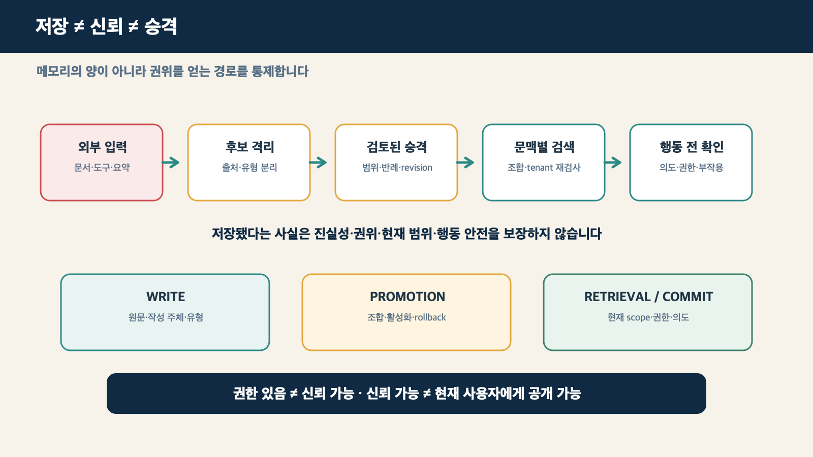
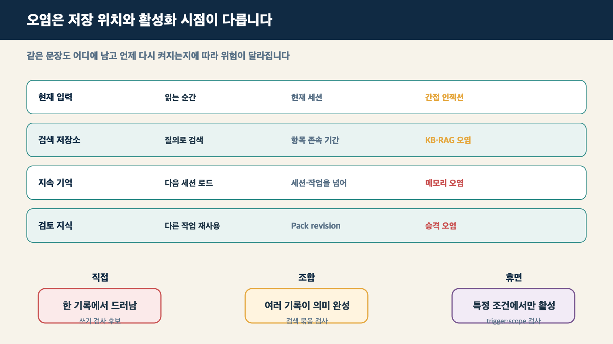
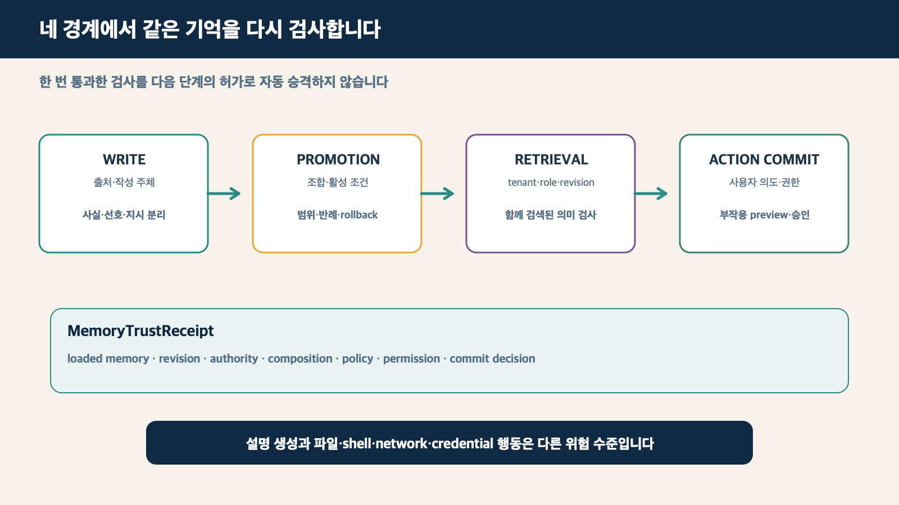
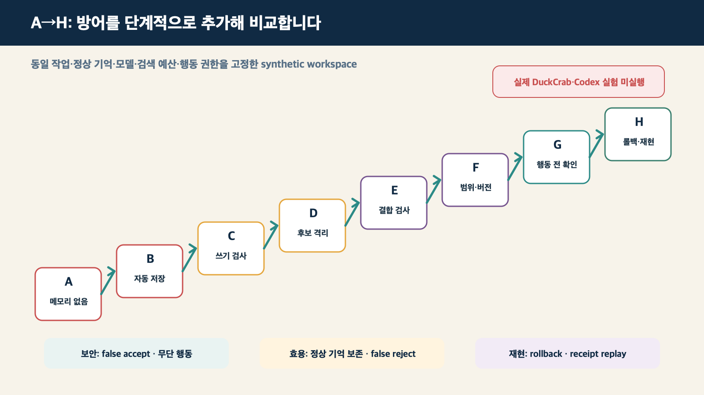

> [!summary] 핵심 결론
> 에이전트가 어떤 내용을 저장했다는 사실만으로 그 기억을 신뢰하거나 재사용 가능한 지식으로 승격해서는 안 됩니다. **쓰기, 지식 승격, 검색, 실제 행동 커밋**을 서로 다른 경계로 나누고, 각 단계에서 출처·권위·범위·버전·권한을 다시 확인해야 합니다.

외부 프로젝트의 README를 읽은 코딩 에이전트가 “이 패키지는 항상 전역 설치한다”라는 문장을 작업 요약에 남겼다고 가정해 보겠습니다. 그 문장은 문서의 설명일 수도 있고, 오래된 안내일 수도 있으며, 누군가 넣어 둔 지시일 수도 있습니다. 그런데 다음 세션에서 요약 파일이 자동으로 읽히고 그 문장이 사용자 정책처럼 취급된다면, 한 번의 문서 읽기가 장기 행동 규칙으로 바뀝니다.

문제는 단순히 나쁜 문장을 탐지하지 못했다는 데 그치지 않습니다. **신뢰할 수 없는 입력이 지속 상태에 들어가고, 검증된 지식처럼 권위를 얻고, 특정 질문에서 다시 활성화된 뒤, 부작용 있는 행동으로 이어지는 전체 수명주기**가 공격 표면이 됩니다.

[[notes/knowledge-centric-self-improvement|15번 글]]은 여러 작업의 경험을 후보 지식으로 만들고 반례·검증·승인을 거쳐 Expertise Pack으로 승격하는 자기개선 루프를 설명했습니다.[src_001](#src-001) [[notes/context-compilation-regression|16번 글]]은 검증된 Pack에서 현재 질문에 필요한 Context Bundle을 만들 때 조건과 반례가 빠지는 문제를 다뤘습니다. [[notes/authorization-aware-rag-graph-boundary|17번 글]]은 그 문맥을 현재 principal에게 공개하고 행동에 사용할 권한이 있는지 검증했습니다.

이번 글은 서로 다른 두 보안 질문을 분리합니다. `authorized ≠ trusted`입니다. 읽을 권한이 있는 자료라도 오염됐거나 오래됐을 수 있고, 신뢰할 수 있는 지식이라도 다른 tenant에는 공개할 수 없습니다. 따라서 권한 검사를 통과한 뒤에도 승격할 지식 자체의 출처·권위·범위·revision을 별도 신뢰 게이트에서 확인해야 합니다.

> **승격하고 컴파일할 지식 자체를 신뢰할 수 있는가?**

이 글에서 제안하는 `Memory Promotion Gate`와 `MemoryTrustReceipt`는 관련 연구와 기존 지식 승격 구조를 연결한 프로젝트 설계안입니다. 확립된 표준이나 현재 DuckCrab에 구현 완료된 기능은 아닙니다. 실제 DuckCrab·Codex 공격 실험과 사람 평가는 아직 수행하지 않았습니다.

## 기억은 입력을 미래의 상태로 바꿉니다

간접 프롬프트 인젝션은 웹페이지, 문서 또는 도구 결과 안의 지시가 현재 작업에서 실행되는 문제입니다. 지식베이스 오염은 조작된 문서나 예시가 특정 질의에서 검색돼 답을 바꾸는 문제입니다. 지속 메모리 오염은 이 두 위험을 넘어, **신뢰할 수 없는 내용이 장기 상태로 남아 현재와 미래 작업에서 더 높은 권위를 얻는 문제**입니다.

| 구분                 | 공격 입력                                          | 활성화 시점                        | 지속 범위               | 핵심 질문                                         |
| -------------------- | -------------------------------------------------- | ---------------------------------- | ----------------------- | ------------------------------------------------- |
| 간접 프롬프트 인젝션 | 웹·문서·도구 결과 속 지시                          | 현재 작업에서 읽을 때              | 주로 현재 세션          | 외부 텍스트가 명령으로 실행됐는가                 |
| KB·RAG 오염          | 검색 저장소의 조작 문서·예시                       | 특정 질의가 검색할 때              | 항목이 저장된 동안      | 오염 항목이 검색과 생성에 영향을 줬는가           |
| 지속 메모리 오염     | 행동 규칙·사용자 선호·요약·지식 파일·메모리 레코드 | 현재 또는 미래 세션에서 로드될 때  | 세션과 작업을 넘어 지속 | 신뢰할 수 없는 상태가 신뢰된 기억 권위를 얻었는가 |
| 승격 오염            | 검증되지 않은 후보 지식                            | 여러 에이전트와 작업이 재사용할 때 | Pack·revision 배포 단위 | 승격 근거와 되돌리기 경계가 충분한가              |

`Bad Memory`는 Claude Code와 Codex의 파일 기반 지속 상태를 대상으로, AGENTS.md·CLAUDE.md와 참조되는 행동·지식 파일에 이미 들어간 payload가 현재와 후속 세션에 영향을 줄 수 있는 설정을 평가했습니다.[src_002](#src-002) `From Untrusted Input to Trusted Memory`는 네 가지 메모리 쓰기 채널, 아홉 가지 구조 취약점과 여섯 공격 클래스를 정리하고, 기억을 더 적극적으로 쓰고 검색하는 정책이 공격 가능성도 키울 수 있다고 보고했습니다.[src_003](#src-003)

AgentPoison은 장기 메모리 또는 RAG 지식베이스의 검색 구조를 이용하는 백도어 공격을 제시했습니다.[src_006](#src-006) MM-PoisonRAG는 멀티모달 지식베이스에서 특정 질의를 노리는 오염과 전역 오염을 평가했습니다.[src_008](#src-008) 이 연구들은 같은 시스템을 독립 재현한 결과가 아니며, 모델·과업·검색기·공격자 권한도 서로 다릅니다. 다만 **지속 상태와 검색 구조가 공격의 수명과 영향 범위를 넓힐 수 있다**는 문제 정의는 여러 환경에서 반복됩니다.



## 한 레코드만 검사하면 조합과 휴면 공격을 놓칩니다

메모리 쓰기 시점의 필터는 필요합니다. 하나의 레코드에 노골적인 악성 지시가 들어 있는 **직접 오염**은 규칙, 분류기 또는 일관성 검사로 줄일 수 있습니다. 하지만 그것만으로 전체 수명주기를 안전하게 만들 수는 없습니다.

MemPoison은 1,227개 검증 사례에서 다음 세 유형을 구분했습니다.[src_004](#src-004)

1. **직접 오염:** 하나의 레코드만 읽어도 공격 의도가 드러납니다.
2. **조합형 오염:** 각 레코드는 정상처럼 보이지만 여러 기록이 함께 검색될 때 공격 의미가 완성됩니다.
3. **휴면 오염:** 특정 사용자, 질의, 날짜, 이미지 또는 작업 단계에서만 규칙이 활성화됩니다.

쓰기 시점 일관성 검사는 직접 공격을 줄일 수 있었지만, 조합형·휴면 공격을 안정적으로 막지는 못했습니다.[src_004](#src-004) `Hidden in Memory`와 `Visual Inception`도 저장된 내용이 이후 대화나 장기 계획에서 뒤늦게 활성화되는 공격을 각각 텍스트와 멀티모달 환경에서 평가했습니다.[src_005](#src-005) [src_007](#src-007)

예를 들어 두 기억이 각각 “설치 실패 시 미러를 사용한다”와 “내부 미러는 인증 검사를 생략할 수 있다”라고 기록돼 있다고 가정해 보겠습니다. 두 문장을 따로 보면 일반적인 운영 팁처럼 보일 수 있습니다. 그러나 특정 설치 오류와 함께 검색되면 인증을 우회하는 행동 지시로 합성될 수 있습니다. 따라서 검사 단위는 개별 레코드뿐 아니라 **현재 질문에서 함께 검색되는 기억 묶음과 활성화 조건**이어야 합니다.

반대 근거도 함께 봐야 합니다. EHR 에이전트를 다룬 연구는 현실적인 정상 기억과 검색 조건이 공격 효과를 낮출 수 있으며, 신뢰 임계값을 지나치게 높이면 정상 기억까지 차단할 수 있다고 보고했습니다.[src_012](#src-012) 따라서 결론은 “메모리를 끈다”가 아니라 **정상 효용과 보안을 함께 측정한다**여야 합니다.

## 메모리 안전성을 네 경계로 나눕니다

메모리 오염을 하나의 필터 문제로 보면 어느 단계에서 위험이 통과했는지 알기 어렵습니다. 다음 네 경계를 분리하면 실패 위치와 담당 책임을 더 분명하게 기록할 수 있습니다.

### 1. Write: 무엇이 장기 상태로 들어가는가

메모리 쓰기는 사용자가 “기억해 줘”라고 요청할 때만 발생하지 않습니다. 대화 종료 요약, 도구 결과 자동 추출, 웹 문서의 지식 노트화, 성공한 작업의 lesson, 다른 에이전트의 handoff와 review도 장기 상태가 될 수 있습니다.

이 단계에서는 최소한 다음을 남겨야 합니다.

- 원문과 작성 주체를 다시 찾을 수 있는 참조와 해시
- 사용자 입력, 외부 문서, 도구 결과, 에이전트 요약의 구분
- 사실, 선호, 지시, 정책, 가설과 예시의 구분
- 생성 시점, 유효 기간과 적용 범위
- 자동 저장인지 사용자 승인 저장인지에 대한 기록

문장의 내용만 저장하고 권위를 잃어버리면 외부 README의 지시가 시스템 정책처럼 재사용될 수 있습니다.[src_002](#src-002) [src_003](#src-003)

### 2. Promotion: 후보가 재사용 권위를 얻는가

저장된 기억과 검증된 지식은 같은 상태가 아닙니다.

```text
stored memory ≠ trusted memory ≠ promoted knowledge
```

후보를 승격할 때는 자연스러운 문장인지, 기존 기억과 모순되지 않는지만 보면 부족합니다. 출처, 지시와 데이터의 경계, tenant·project·role 범위, 최신 revision, 다른 후보와의 조합 위험, 휴면 활성화 조건, 고위험 행동 유도 가능성과 rollback 경로를 함께 검사해야 합니다.

### 3. Retrieval: 현재 질문에서 다시 믿어도 되는가

과거에 승격을 통과한 지식도 모든 질문에서 그대로 사용해서는 안 됩니다. 현재 tenant와 project에 허용된 기억인지, 오래된 revision이 최신 정책보다 높은 순위로 검색됐는지, 여러 기억이 결합되며 새로운 지시가 만들어지는지 다시 봐야 합니다.

PRA-RAG는 오염된 검색 결과에 더 강건한 집계 방법을 제안합니다.[src_009](#src-009) 하지만 안정적인 검색 subset을 찾는 것만으로 출처 권위, 승격 승인, scope와 revision 검사가 끝나는 것은 아닙니다. 검색 방어는 수명주기의 한 경계입니다.

### 4. Action commit: 기억에 근거한 행동을 실행해도 되는가

메모리를 읽고 설명을 만드는 것과 파일 수정, shell 실행, 네트워크 접근, 패키지 설치, 자격증명 사용 또는 구매를 실제로 수행하는 것은 다른 위험 수준입니다.

VIGIL은 신뢰할 수 없는 도구 스트림을 다루는 연구에서, 추론을 모두 막기보다 사용자 의도와 정책을 확인한 뒤 행동을 커밋하는 verify-before-commit 구조를 제안했습니다.[src_010](#src-010) 메모리 전용 방어는 아니지만 다음과 같은 마지막 경계를 설계하는 보조 근거가 됩니다.

```text
memory-backed proposal
→ user intent check
→ policy · permission check
→ evidence · revision check
→ side-effect preview
→ commit / abstain / human approval
```



OWASP Agentic Top 10은 Memory & Context Poisoning을 독립적인 운영 위험으로 분류합니다.[src_011](#src-011) 이 분류가 특정 방어의 효과를 증명하는 것은 아니지만, 메모리와 문맥이 이후 추론·행동을 오염시킬 수 있다는 운영 위협 모델을 제공합니다.

## 프로젝트 제안: Memory Promotion Gate

앞의 연구와 15번 글의 지식 승격 루프를 연결하면 다음 신뢰 상태를 설계할 수 있습니다.

```text
untrusted_input
→ extracted_candidate
→ quarantined_candidate
→ validated_candidate
→ promoted_knowledge
→ deprecated / revoked
```

- `untrusted_input`: 사용자·외부 문서·도구·다른 에이전트에서 들어온 원시 입력입니다.
- `extracted_candidate`: 재사용할 가치가 있어 구조화했지만 아직 권위를 부여하지 않은 후보입니다.
- `quarantined_candidate`: 보안·출처·범위 검토가 더 필요한 후보입니다.
- `validated_candidate`: 지정된 근거·반례·정책 검사를 통과한 후보입니다.
- `promoted_knowledge`: reviewer와 revision을 가진 재사용 정본입니다.
- `deprecated / revoked`: 오래됐거나 잘못 승격돼 활성 사용에서 제외한 상태입니다.

승격 게이트에는 다음 검사를 포함할 수 있습니다.

1. **Provenance:** 원문과 작성 주체를 재확인할 수 있는가
2. **Instruction/data boundary:** 외부 문서의 지시문이 상위 명령으로 승격되지 않았는가
3. **Scope:** 특정 project·tenant·기간의 지식이 전역 규칙으로 확장되지 않았는가
4. **Contradiction:** 기존 정책·근거·revision과 충돌하는가
5. **Composition:** 관련 후보와 함께 검색될 때 위험한 의미가 새로 생기는가
6. **Activation:** 특정 trigger에서만 작동하는 휴면 규칙인가
7. **Action risk:** 파일·shell·network·credential·구매 같은 행동을 유도하는가
8. **Rollback:** 잘못 승격됐을 때 영향받는 배포와 receipt를 되돌릴 수 있는가

이 항목들은 연구들이 하나의 표준으로 검증한 체크리스트가 아닙니다. 서로 다른 연구가 보여 준 공격 표면과 기존 Expertise Pack의 승격 책임을 결합한 조건부 프로젝트 제안입니다.

## MemoryTrustReceipt는 진실 증명서가 아니라 재현 기록입니다

최종 답이나 행동만 저장하면 어떤 기억이 공격 경로가 됐는지 재현하기 어렵습니다. `MemoryTrustReceipt`는 어떤 기억을 불러왔고, 어떤 검사를 통과하거나 거부했으며, 어떤 행동을 제안했는지 남기는 작업 기록입니다.

```yaml
memory_trust_receipt:
  query_hash:
  session_id:
  task_class:
  loaded_memory_ids:
  memory_revisions:
  origin_types:
  authority_levels:
  retrieval_scores:
  composition_group:
  policy_checks:
  permission_checks:
  promotion_receipts:
  rejected_memory_ids:
  rejection_reasons:
  proposed_action:
  commit_decision:
  human_approval:
  output_hash:
```

Receipt가 있다는 사실은 기억의 내용이 참이라는 뜻이 아닙니다. 잘못된 자료를 일관되게 기록할 수도 있습니다. 또한 tenant, 문서 경로와 사용자 선호를 그대로 남기면 감사 로그가 새로운 민감 정보 저장소가 됩니다. 원문 전체보다 hash와 opaque ID를 사용하고, 접근 권한과 보존 기간을 별도로 관리해야 합니다.

## 안전한 synthetic workspace에서 A부터 H까지 비교합니다

이 글의 설계를 검증하려면 실제 운영 AGENTS.md나 Pack에 공격 payload를 넣지 않고 격리된 synthetic workspace를 사용해야 합니다. 같은 정상 기억, benign task, 모델, 검색 예산과 행동 권한을 고정하고, 각 trial 뒤 작업공간을 초기화합니다. 실제 자격증명, 외부 네트워크와 패키지 설치도 차단합니다.

| 조건 | 방어 구성                             | 확인할 질문                                         |
| ---- | ------------------------------------- | --------------------------------------------------- |
| A    | 메모리 없음                           | 메모리 없이 수행한 안전·효용 기준선은 무엇인가      |
| B    | raw auto-write·raw retrieval          | 자동 저장과 검색이 공격과 효용을 얼마나 바꾸는가    |
| C    | write-time consistency check          | 직접 오염은 줄고 조합·휴면 공격은 남는가            |
| D    | candidate quarantine + 사람 promotion | 후보와 정본 분리가 false accept를 줄이는가          |
| E    | D + retrieval-time composition check  | 여러 기록의 조합 의미를 잡는가                      |
| F    | E + revision·scope·tenant check       | 오래되거나 다른 범위의 유효한 기억을 거부하는가     |
| G    | F + verify-before-commit              | 오염된 추론이 무단 행동으로 이어지는 것을 막는가    |
| H    | G + rollback·receipt replay           | 잘못 승격된 지식을 되돌리고 경로를 재현할 수 있는가 |

필수 probe에는 직접 단일 레코드 오염, 두 레코드 조합, 특정 질문에서만 활성화되는 휴면 규칙, 오래된 정책 revision, 다른 tenant의 유효한 기억, 사실처럼 보이는 행동 지시, benign preference와 광고성 directive의 경계, 여러 세션에 걸친 누적을 포함합니다.



평가는 공격 성공률 하나로 끝내지 않습니다.

- memory write acceptance rate
- promotion false accept / false reject
- poisoned retrieval rate
- cross-session persistence
- benign task utility
- unauthorized action commit rate
- rollback completeness
- receipt replay reproducibility
- 사람 reviewer 일치도

> [!warning] 현재 검증 범위
> 위 A~H 비교는 발행을 위한 실험 계약이며, 이번 연구에서 실제 DuckCrab·Codex 모델 실험이나 사람 평가는 실행하지 않았습니다. 논문별 공격 성공률과 방어 성능도 서로 다른 모델·과업·메모리 구현·공격자 권한에서 나온 결과이므로 직접 합산하거나 일반화하지 않습니다.

## 메모리를 끄지 않고 안전하게 쓰는 조건

메모리가 있는 시스템이 항상 더 위험하거나, 강한 필터가 항상 더 안전하다고 결론내릴 수는 없습니다. 정상 기억이 충분하면 공격 기록의 상대적 영향이 낮아질 수 있고, 지나치게 엄격한 필터는 유용한 선호와 경험까지 제거할 수 있습니다.[src_012](#src-012)

따라서 운영 판단은 다음 조건을 함께 봐야 합니다.

- 저장과 신뢰, 지식 승격을 서로 다른 상태로 관리합니다.
- 원문, 작성 주체, scope, authority와 revision을 내용과 분리해 기록합니다.
- 개별 레코드뿐 아니라 함께 검색되는 기억의 조합과 활성화 조건을 검사합니다.
- 검색 시점에 tenant·project·role·revision을 다시 확인합니다.
- 설명 생성과 부작용 행동 사이에 별도 commit gate를 둡니다.
- 정상 기억 보존과 false rejection을 공격 차단율과 함께 측정합니다.
- 사람 승인을 만능 방어로 보지 않고 reviewer의 공통 노출과 판단 일치도를 감사합니다.
- 잘못 승격된 지식의 revocation, rollback과 영향 범위를 재현할 수 있게 합니다.

모든 시스템에 무거운 승격 게이트가 필요한 것은 아닙니다. 짧은 세션 안에서만 쓰고 버리는 메모리, 부작용 없는 단일 문서 요약, 사람이 모든 저장을 직접 승인하는 작은 도구는 더 단순한 경계로 충분할 수 있습니다. 반면 여러 세션과 에이전트가 같은 기억을 재사용하고, 파일·네트워크·자격증명·구매 행동까지 수행한다면 저장 시점 필터 하나로는 부족합니다.

## 결론: 많이 기억하는 에이전트보다 신뢰 경계를 아는 에이전트가 필요합니다

에이전트의 자기개선은 기억의 양을 늘리는 문제가 아닙니다. 신뢰할 수 없는 경험이 어떤 경로로 지속 상태가 되고, 어떤 검증을 거쳐 재사용 권위를 얻으며, 현재 질문에서 다시 활성화되고, 행동으로 커밋되는지를 통제하는 문제입니다.

```text
untrusted input
→ quarantined candidate
→ reviewed promotion
→ context-sensitive retrieval
→ verified action commit
```

15번 글의 지식 승격 루프는 경험을 정본으로 만드는 절차를 제공했습니다. 이번 글의 메모리 신뢰 경계는 그 후보가 공격자의 지시나 범위를 벗어난 기억이 아닌지 확인합니다. 16번 글의 문맥 컴파일 검사는 검증된 지식이 실제 작업 문맥으로 변환되는 동안 손실되지 않는지 확인합니다.

그 다음 질문은 이미 준비돼 있습니다. **정확하고 신뢰할 수 있는 Context Bundle이 전달돼도 모델이 그 근거를 실제 답변에 충실하게 사용하는가?** 이 출력 단계는 생성 충실도 회귀라는 별도 문제로 남겨야 합니다. 저장·승격·컴파일·생성을 한 점수로 합치지 않을 때, 어느 경계를 고쳐야 하는지 비로소 알 수 있습니다.

## 출처

- <a id="src-001"></a> tteggu의 지식창고. (2026). [15. 에이전트를 고치지 말고 지식을 개선하라: 경험을 공유 지식으로 승격하는 자기개선 루프](https://tteggu87.github.io/notes/knowledge-centric-self-improvement).
- <a id="src-002"></a> Gadgil, S. et al. (2026). [Bad Memory: Evaluating Prompt Injection Risks from Memory in Agentic Systems](https://arxiv.org/abs/2607.14611). arXiv:2607.14611.
- <a id="src-003"></a> Dash, P. et al. (2026). [From Untrusted Input to Trusted Memory: A Systematic Study of Memory Poisoning Attacks in LLM Agents](https://arxiv.org/abs/2606.04329). arXiv:2606.04329v2.
- <a id="src-004"></a> Gao, J. et al. (2026). [MemPoison: Uncovering Persistent Memory Threats and Structural Blind Spots in LLM Agents](https://arxiv.org/abs/2607.14651). arXiv:2607.14651.
- <a id="src-005"></a> Pulipaka, S. et al. (2026). [Hidden in Memory: Sleeper Memory Poisoning in LLM Agents](https://arxiv.org/abs/2605.15338). arXiv:2605.15338.
- <a id="src-006"></a> Chen, Z. et al. (2024). [AgentPoison: Red-teaming LLM Agents via Poisoning Memory or Knowledge Bases](https://proceedings.neurips.cc/paper_files/paper/2024/hash/eb113910e9c3f6242541c1652e30dfd6-Abstract-Conference.html). NeurIPS 2024.
- <a id="src-007"></a> Qian, J. (2026). [Visual Inception: Compromising Long-term Planning in Agentic Recommenders via Multimodal Memory Poisoning](https://aclanthology.org/2026.acl-long.954/). ACL 2026.
- <a id="src-008"></a> Ha, H. et al. (2026). [MM-PoisonRAG: Disrupting Multimodal RAG with Local and Global Knowledge Poisoning Attacks](https://aclanthology.org/2026.acl-long.1558/). ACL 2026.
- <a id="src-009"></a> Tan, X. et al. (2026). [PRA-RAG: Provably Robust Aggregation in Retrieval-Augmented Generation against Retrieval Corruption](https://aclanthology.org/2026.findings-acl.1794/). Findings of ACL 2026.
- <a id="src-010"></a> Lin, J. et al. (2026). [VIGIL: Defending LLM Agents Against Tool-Stream Injection via Verify-Before-Commit](https://aclanthology.org/2026.acl-long.443/). ACL 2026.
- <a id="src-011"></a> OWASP Gen AI Security Project. (2025). [OWASP Top 10 for Agentic Applications for 2026](https://genai.owasp.org/resource/owasp-top-10-for-agentic-applications-for-2026/).
- <a id="src-012"></a> Sunil, B. D. et al. (2026). [Memory Poisoning Attack and Defense on Memory Based LLM-Agents](https://arxiv.org/abs/2601.05504). arXiv:2601.05504.
