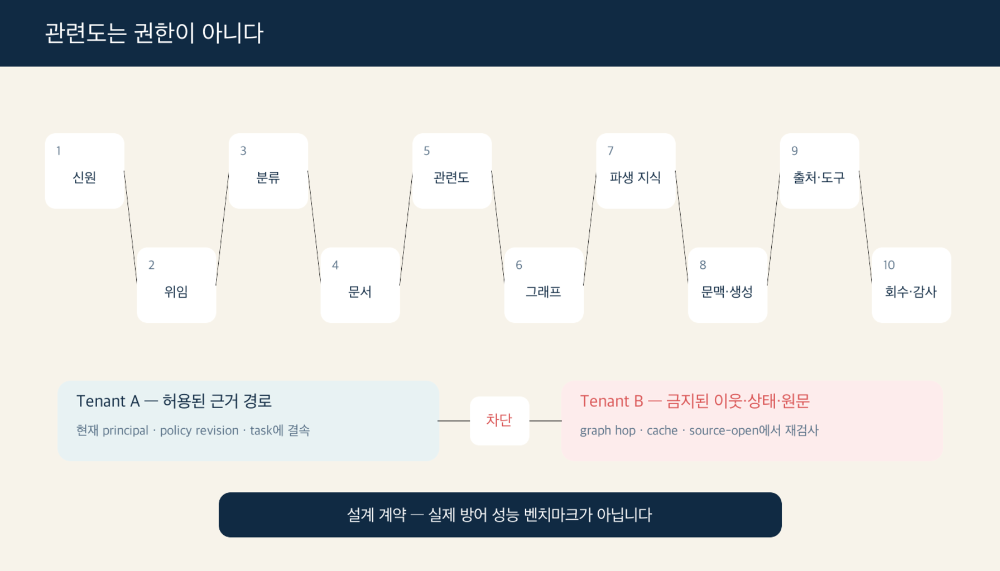
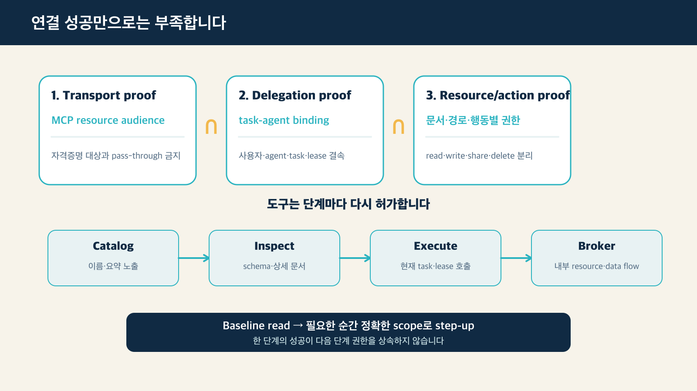
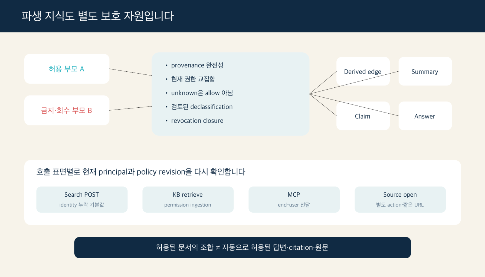
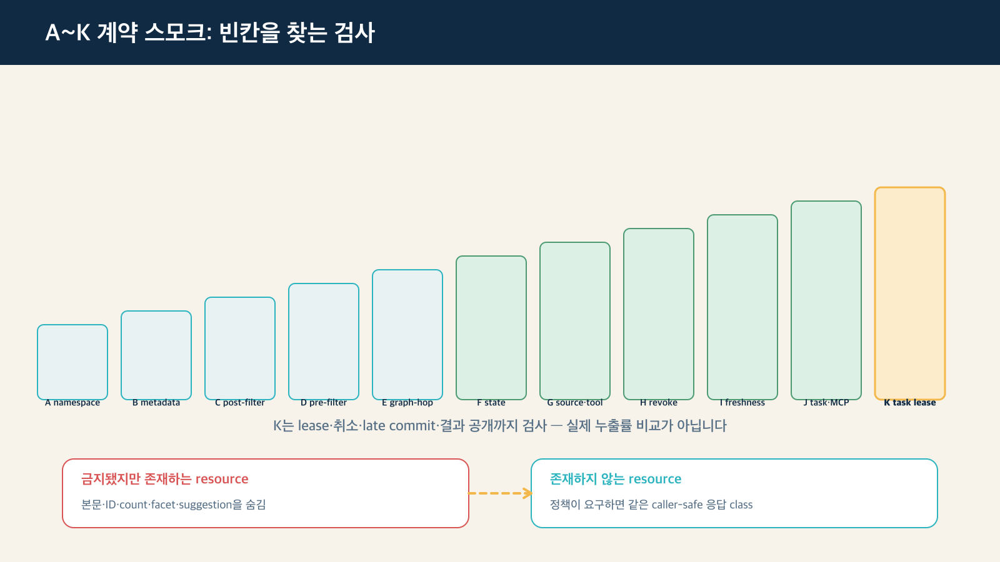

> [!summary] 핵심 결론
> 검색 결과가 질문에 잘 맞는다는 사실은 그 자료를 보여 줘도 된다는 뜻이 아닙니다. 멀티테넌트 RAG와 GraphRAG에서는 **연결 자격증명, 작업 위임, 문서·그래프 경로·파생 지식·출처 열기·도구 행동의 현재 권한**을 각각 확인해야 합니다. 이 글의 A~J와 파생 산출물 비교 결과는 설계 계약의 빈칸을 찾는 결정론적 장난감 검사이며, 실제 시스템의 누출률이나 방어 우월성을 입증한 벤치마크가 아닙니다.

한 회사가 여러 고객사의 규정 문서를 하나의 검색 시스템에 연결했다고 가정해 보겠습니다. 고객사 A의 사용자가 질문했고, 벡터 검색은 A가 볼 수 있는 문서를 정확히 찾았습니다. 그 문서에는 여러 회사가 함께 쓰는 제품명이 들어 있었습니다.

GraphRAG가 그 제품 노드를 따라 두 단계 확장하자 고객사 B의 내부 사고 보고서가 연결됐습니다. 최종 답변은 두 문서를 섞어 그럴듯한 요약을 만들었습니다. 첫 검색은 올바른 문서에서 시작했고 답도 질문과 관련이 높았습니다. 그런데 **그래프 경로와 결합 결과의 권한을 다시 확인하지 않았기 때문에 데이터 유출**이 됐습니다.

[[notes/context-compilation-regression|16번 글]]은 정본 지식에서 질문별 Context Bundle을 만들 때 조건·반례·버전이 사라지는 문제를 다뤘습니다. 이번 글은 그보다 먼저 확인해야 할 질문을 붙입니다.

> **정확하게 골라낸 이 근거를, 지금 이 사용자와 이 작업을 수행하는 에이전트가 볼 권한이 있는가?**

## 관련도·권한·신뢰·생성은 서로 다른 축입니다

이 차이는 학교 전자도서관에 비유하면 쉽습니다. 검색은 질문과 가까운 책을 찾고, 권한 확인은 그 학생이 그 책을 빌려도 되는지 봅니다. 지식 검증은 책의 내용과 출처를 믿을 수 있는지 살피고, 생성 검증은 AI가 허용된 책의 내용을 왜곡 없이 답에 옮겼는지 확인합니다. 여기서 사용자나 에이전트처럼 권한을 요청하는 주체를 **principal(권한 주체)**이라고 부릅니다.

```text
관련도가 높음 ≠ 공개 권한이 있음
공개 권한이 있음 ≠ 내용이 신뢰할 만함
신뢰할 만함 ≠ 현재 사용자에게 공개 가능함
허용된 문맥이 있음 ≠ 답변이 그 문맥에 충실함
```

이 구분은 두 개의 최근 연구 번들을 함께 볼 때 더 선명해집니다. 권한 인식 RAG 연구는 `relevant ≠ authorized`를 다룹니다. 지속 메모리 오염 연구는 `stored ≠ trusted`를 다룹니다. 허용된 문서라도 공격자에게 오염됐을 수 있고, 검증된 문서라도 다른 조직의 사용자에게는 공개할 수 없습니다.[src_009](#src-009) [src_013](#src-013) [src_014](#src-014)

따라서 운영 게이트를 하나의 점수로 합치기보다 실패 위치를 나눠야 합니다.

| 확인 단계                 | 묻는 질문                                                | 실패 예시                                                    |
| ------------------------- | -------------------------------------------------------- | ------------------------------------------------------------ |
| 신원(Identity)            | 요청자는 누구입니까                                      | 프로그램이 보낸 이메일·조직 이름을 검증 없이 믿음            |
| 위임(Delegation)          | 이 에이전트가 이 작업에서 사용자를 대신할 수 있습니까    | 다른 작업에서 받은 임시 허가(grant)를 재사용                  |
| 권한(Authorization)       | 이 자원·경로·행동을 지금 허용합니까                      | 허용된 시작점(seed)에서 금지된 그래프 이웃으로 확장          |
| 신뢰(Trust)               | 자료의 출처·권위·변경 버전을 믿을 수 있습니까            | 읽을 수 있는 문서 안에 공격자가 심은 지시가 들어 있음         |
| 관련도(Relevance)         | 허용되고 신뢰할 수 있는 후보 중 무엇이 질문에 유용합니까 | 관련도 상위 결과(top-k)를 공개 가능한 목록으로 착각           |
| 생성(Generation)          | 모델이 허용된 근거를 충실하게 사용했습니까               | 금지된 과거 상태나 모델이 외운 내용을 답에 섞음               |

## 권한을 계산하기 전에 자원을 먼저 식별하고 분류합니다

권한 엔진은 이름과 분류가 붙은 대상만 판단할 수 있습니다. 원문 문서에 ‘내부 전용’ 같은 표시가 있어도, 문서를 잘게 나눈 조각(chunk), 검색을 위한 숫자 표현(embedding), 그래프 근거, 요약, 출처 묶음(citation bundle), 도구의 입력 형식(tool schema)에는 그 표시가 빠질 수 있습니다. NIST의 2026년 데이터 분류 초안은 비정형 데이터를 발견하고 식별하며 계속 유지할 수 있는 레이블을 붙이는 일을 Zero Trust 데이터 보호의 준비 단계로 둡니다.[src_029](#src-029)

이 원칙을 RAG에 적용하면 최소한 다음 대상을 별도 자원으로 식별해야 합니다.

- 원문 문서와 첨부파일
- chunk·embedding record와 graph node·edge·evidence
- Context item, tool output과 conversation state
- derived edge·summary·Claim·citation bundle·최종 답변
- tool catalog entry·schema·resource와 action

```text
unclassified ≠ public
missing label → quarantine 또는 deny
```

이 기본값은 NIST가 직접 제시한 RAG 표준이 아니라, 데이터 분류 원칙을 이 프로젝트의 권한 계약에 적용한 제안입니다. 자료를 시스템에 넣는 수집 단계(ingest)나 검색·그래프용 형태로 바꾸는 단계(projection)에서 레이블이 빠졌다면 자동으로 공개하지 않아야 합니다. 레이블이 있더라도 원본·검색 색인(index)·문서 조각(chunk)·임시 저장소(cache)의 변경 버전(revision)이 서로 맞는지, 실제 API가 그 레이블대로 차단하는지도 따로 확인해야 합니다.[src_033](#src-033)

## 유효한 OAuth 연결 하나로는 부족합니다

MCP Authorization 명세는 HTTP MCP 서버를 OAuth로 보호하는 방법을 설명합니다. 쉽게 말해 출입증이 어느 서버용인지(resource audience) 분명히 하고, MCP 클라이언트가 받은 출입증을 다른 내부 API에 그대로 넘기는 방식(token passthrough)을 금지합니다.[src_017](#src-017) RFC 9728은 보호 자원 정보와 인증 서버를 찾는 방법을 표준화합니다.[src_021](#src-021)

하지만 서버 연결에 성공한 것만으로 문서를 읽거나 도구를 실행할 권한까지 생기지는 않습니다. 하나의 에이전트 요청에는 최소한 세 종류의 확인이 필요합니다.

1. **연결 증명(Transport proof):** 이 자격증명은 지금 연결한 MCP 서버용으로 발급됐습니까?
2. **위임 증명(Delegation proof):** 이 에이전트가 현재 작업(task)과 대화(session)에서 사용자를 대신하도록 허가받았습니까?
3. **자원·행동 증명(Resource/action proof):** 이 에이전트가 지금 이 문서와 그래프 경로, 도구의 읽기·쓰기·공유 같은 행동을 수행해도 됩니까?

```text
OAuth 연결 성공
→ resource audience 확인
→ task-agent binding 확인
→ 문서·경로·도구 행동별 현재 권한 확인
```

OpenFGA의 작업(task) 기반 패턴은 사용자의 원래 권한과, 에이전트가 이번 작업에서만 쓰는 제한된 임시 허가(grant)를 따로 검사합니다. 예를 들어 ‘이 문서를 10분 동안 읽기만 허용’처럼 필요한 도구와 자원, 만료 시간, 대화, 호출 범위와 에이전트를 한 묶음으로 제한할 수 있습니다.[src_019](#src-019) 이 경계가 없으면 사용자가 문서를 읽을 수 있다는 이유만으로 에이전트가 그 문서를 외부에 공유하거나 삭제하는 권한까지 얻을 수 있습니다.



### 도구 검색도 권한이 필요한 retrieval입니다

MCP의 최신 클라이언트 지침은 많은 도구를 모델에 한꺼번에 보여 주는 대신 `catalog → inspect → execute` 순서로 조금씩 공개하는 방법을 설명합니다. 즉 도구 이름과 요약을 찾고(catalog), 필요한 도구의 사용법과 입력 형식을 확인한 뒤(inspect), 마지막에 실제로 실행합니다(execute). 권한에 따라 목록을 걸러 내는 기능도 이런 맞춤형 탐색이 필요한 사례로 듭니다.[src_030](#src-030)

따라서 관련도 높은 도구를 찾았다는 사실과 현재 작업에서 사용할 수 있다는 사실을 분리해야 합니다.

```text
catalog 노출 허가
≠ schema 열람 허가
≠ execute 허가
≠ tool 내부 resource·action 허가
```

생성된 스크립트나 작업 흐름(workflow)을 승인했다고 해서, 그 안에서 일어나는 모든 도구 호출까지 한꺼번에 승인한 것은 아닙니다. 도구 호출을 중개하는 호스트 브로커(host broker)는 매번 대상 자원과 서버 사이의 데이터 이동을 현재 임시 허가와 비교해야 합니다. 처음부터 넓은 권한 범위(scope)를 주기보다, 도구 찾기와 읽기 같은 기본 권한으로 시작하고 쓰기·공유·삭제·외부 전송이 필요한 순간에만 정확한 자원과 행동을 짧게 추가 승인(step-up)하는 편이 기록을 남기고 권한을 회수하기 쉽습니다.[src_030](#src-030) [src_031](#src-031)

## 권한은 검색 입구에서 한 번만 검사하는 속성이 아닙니다

권한 검사는 RAG 수명주기의 여러 지점에서 반복됩니다.

### 문서와 ACL revision을 함께 추적합니다

문서 내용은 최신인데 접근 제어 목록(ACL)은 오래됐거나, 반대로 ACL은 최신인데 문서 조각(chunk)·검색 표현(embedding)·그래프용 변환본(projection)이 이전 문서를 가리킬 수 있습니다. 그래서 내용의 변경 버전인 `content_revision`과 권한의 변경 버전인 `permission_revision`을 따로 기록하면, 권한을 회수한 뒤에도 오래된 조각이 남아 있는지 찾기 쉬워집니다.

Azure AI Search와 Amazon Bedrock의 공식 문서는 principal 기반 결과 필터링과 query-time 권한 확인 패턴을 설명합니다.[src_004](#src-004) [src_005](#src-005) [src_006](#src-006) [src_007](#src-007) 다만 제품 문서는 구현 책임을 보여 주는 1차 자료이지, 특정 배포가 안전하다는 독립 보안 평가가 아닙니다.

### pre-filter와 post-filter는 조건부 선택입니다

OpenFGA는 두 가지 방식을 설명합니다. **검색 전 필터링(pre-filter)**은 먼저 읽어도 되는 문서 ID를 구한 뒤 그 안에서 검색합니다. **검색 후 필터링(post-filter)**은 넓게 후보를 찾은 다음 권한이 없는 결과를 제거합니다.[src_002](#src-002)

- **pre-filter**는 허용 집합 안에서 top-k를 구하기 쉽지만 권한 집합이 크거나 policy가 복잡하면 비용이 커질 수 있습니다.
- **post-filter**는 구현이 단순할 수 있지만 제거 후 결과가 부족해질 수 있고, 권한 검사 전 candidate ID·score가 로그나 cache에 남지 않도록 해야 합니다.

어느 쪽이 항상 더 안전하거나 빠르다고 단정할 수 없습니다. false allow, false deny, authorized recall, p95 지연과 정책 비용을 따로 측정해야 합니다.

### 권한 판정이 불가능하면 부분 결과를 반환하지 않습니다

권한 인식 검색에서는 다음 세 상태를 구분해야 합니다.

```text
authorized_empty          → 판정은 성공했지만 허용 결과가 없음
insufficient_evidence     → 허용 결과는 있으나 답변 근거가 부족함
authorization_unavailable → 정책·그룹·revision 판정 실패
```

마지막 상태에서 남아 있는 후보를 그대로 돌려주면, 권한 확인에 실패했는데도 통과시키는 **fail-open**이 됩니다. Azure AI Search의 query-time ACL 미리보기 기능은 권한 평가에 필요한 시스템이 실패하면 일부 결과를 반환하지 않고 오류로 멈추는 **fail-closed** 동작을 문서화합니다.[src_032](#src-032) 이는 모든 제품의 공통 표준은 아니지만, 권한 확인 실패와 단순한 검색 결과 없음은 다르게 다뤄야 한다는 운영 사례입니다.

전체 검색 색인(index)을 조사해야 하는 긴급 운영 작업도 평상시 자격증명의 권한을 넓히는 방식으로 만들지 않습니다. 비상시에만 여는 별도 통로인 **break-glass 경로**로 분리하고, 전용 역할과 사용 목적(intent), 짧은 만료 시간, 좁은 권한 범위(scope), 감사 기록을 요구합니다. 이 통로로 읽은 자료를 답변·파일 내보내기(export)·다른 도구로 넘길 때는 다시 승인해야 합니다.[src_032](#src-032) [src_033](#src-033)

### graph expansion은 hop마다 다시 검사합니다

허용된 문서 조각(chunk)이 공통 인물·제품 같은 개체(entity)와 연결됐다고 해서, 그 개체 주변의 모든 정보까지 볼 수 있는 것은 아닙니다. 그래프에서 연결 하나를 따라가는 단계를 hop이라고 합니다. 벡터 검색 결과에서 그래프로 넘어가는 지점을 공격 표면으로 다룬 연구와 공개 재현 저장소는, hop마다 별도 권한 검사가 필요하다는 설계 근거를 제공합니다.[src_008](#src-008) [src_009](#src-009)

이 결과는 단일 연구의 synthetic·Enron 설정에 제한되며 모든 GraphRAG에 일반화된 독립 재현 결과는 아닙니다. 그래도 evidence chunk와 graph neighborhood를 함께 쓰는 시스템에서는 다음 질문을 피할 수 없습니다.

```text
허용된 seed인가?
→ 이 node를 볼 수 있는가?
→ 이 edge를 따라갈 수 있는가?
→ 이 path의 모든 evidence를 사용할 수 있는가?
→ 이 path에서 만든 Claim을 공개할 수 있는가?
```

## 허용된 문서들의 조합도 새 보호 자원입니다

문서 ACL을 모두 검사해도 문제가 끝나지 않습니다. GraphRAG와 에이전트는 여러 근거를 합쳐 다음 산출물을 만듭니다.

- derived edge
- 여러 문서를 압축한 summary
- graph path에서 만든 Claim
- citation bundle
- 최종 답변과 후속 파일

W3C PROV-O는 결과물이 어떤 원본과 과정을 거쳐 만들어졌는지, 즉 **provenance(계보)**를 표현할 수 있습니다. 다만 원본의 권한을 요약이나 답변 같은 파생물에 어떻게 물려줄지는 정하지 않습니다.[src_022](#src-022) OpenFGA Conditions·Contextual Tuples와 SpiceDB Caveats는 시간, 현재 소속 조직, 요청 상황처럼 실행할 때 달라지는 조건과 판단에 필요한 정보가 부족한 상태를 표현할 수 있습니다.[src_023](#src-023) [src_024](#src-024) [src_025](#src-025)

이 프로젝트에서는 이 문제를 **파생 산출물 권한 닫힘(Derived Artifact Authorization Closure)**이라는 조건부 설계 제안으로 정리했습니다. 쉽게 말해 여러 문서를 섞어 만든 새 요약이나 답변도 독립된 보호 대상으로 보고, 그 결과를 뒷받침한 모든 근거의 현재 권한을 다시 확인하는 규칙입니다.

```text
artifact 허용
= 모든 supporting parent에 대한 현재 권한
  또는
  검토·비식별화·대상 audience·만료가 명시된 declassification
```

기본 원칙은 다음과 같습니다.

1. artifact가 사용한 모든 evidence·node·edge·tool output과 변환을 provenance로 연결합니다.
2. 명시적 공개 절차가 없다면 현재 principal이 모든 supporting parent를 같은 policy revision에서 사용할 수 있어야 합니다.
3. provenance 누락, 조건 context 부족, 오래된 permission revision을 `allow`로 처리하지 않습니다.
4. 부모보다 넓게 공개하려면 검토된 비식별화·집계와 만료를 포함한 declassification을 별도 승인합니다.
5. 부모 권한이 회수되면 derived edge·summary·cache·answer artifact도 무효화하거나 다시 검사합니다.
6. 답변 표시, citation 노출, 원문 열기와 외부 공유는 서로 다른 action으로 판단합니다.

> [!important] 교집합은 안전한 기본값이지 보편적 정답이 아닙니다
> 모든 부모 권한의 단순 교집합은 승인된 공개 통계나 비식별 aggregate까지 과도하게 거부할 수 있습니다. 더 넓은 공개가 필요한 경우에는 boolean ACL을 느슨하게 만드는 대신, 검토된 declassification을 별도 계약으로 둬야 합니다.



## 같은 제품도 호출 표면마다 안전 기본값이 다를 수 있습니다

권한 기능을 제품 이름 옆의 `지원/미지원` 체크박스 하나로 관리하면, 같은 제품 안에서도 API 호출 방식에 따라 달라지는 안전 기본값을 놓칠 수 있습니다. 이 글에서 **호출 표면**은 사용자가 기능에 접근하는 구체적인 API나 동작 경로를 뜻합니다. 공식 문서를 비교하면 같은 Azure AI Search 안에서도 일반 Search POST와 지식 베이스 검색(knowledge-base retrieve)의 최종 사용자 신원 누락 기본값이 다를 수 있습니다. 최근 Search POST 미리보기는 보호 문서를 제외하는 경로를 설명하지만, knowledge-base retrieve는 신원 토큰이나 권한 정보가 빠지면 필터링되지 않은 결과가 나올 수 있다고 명시합니다.[src_032](#src-032) [src_037](#src-037)

| 호출 표면                     | 확인할 현재 권한                                                             | 놓치기 쉬운 기본값·추가 행동                                                                |
| ----------------------------- | ---------------------------------------------------------------------------- | ------------------------------------------------------------------------------------------- |
| Azure Search POST             | end-user identity, index permission metadata, API revision                   | identity 누락 시 public-only 또는 오류인지 version별 확인; elevated read는 별도 역할·header |
| Azure knowledge-base retrieve | service credential와 end-user identity를 분리, source별 permission ingestion | identity·metadata 누락 시 unfiltered 가능; multi-source 부분 성공 정책 필요                 |
| MCP endpoint                  | server 인증, end-user identity 전달, catalog·inspect·execute 권한            | service 인증 성공을 문서 권한 성공으로 간주하지 않음                                        |
| Bedrock retrieve              | upstream에서 검증한 user context, connector ACL                              | ACL 평가 오류 시 영향을 받은 문서 제외 여부 확인                                            |
| Bedrock source open           | retrieval 권한과 원문 열기 권한을 별도 검사                                  | citation 허용이 다운로드 허용은 아님; 짧은 수명의 URL을 action 직전에 발급                  |

Azure knowledge-base retrieve의 multi-source 부분 성공도 별도 계약이 필요합니다. 권한·정책·반례에 필수인 source가 실패했는데 다른 source의 결과만으로 답변하면 부분 성공이 안전한 답변처럼 보일 수 있습니다. source별로 `required_for_answer`, `required_for_authorization`, `required_for_counterevidence`를 구분하고 필수 source가 빠지면 보류합니다.[src_037](#src-037)

Amazon Bedrock의 원문 열기 API는 retrieval과 별도의 권한을 요구하고 ACL을 다시 검사한 뒤 짧은 수명의 URL을 발급합니다.[src_038](#src-038) [src_039](#src-039) 이 제품 동작을 보편적 표준으로 일반화할 수는 없지만, citation을 답변에 표시하는 권한과 source file 전체를 여는 권한을 분리해야 한다는 경계를 구체적으로 보여 줍니다.

## 다중 턴 상태와 도구도 권한을 다시 증명합니다

첫 턴에서 허용된 문맥이 다음 턴에도 자동으로 허용되는 것은 아닙니다. 다음 상태는 `tenant`, `principal`, `task`, `delegation`, `expiry`와 함께 묶어야 합니다.

- conversation summary와 retrieved document IDs
- context cache와 tool output
- 생성된 파일과 임시 credential
- agent memory와 handoff

새 사용자나 새 task에 이전 상태를 재사용할 때는 다시 권한을 확인합니다. 권한 문제와 메모리 신뢰 문제도 구분합니다. 같은 tenant가 만든 허용된 summary라도 외부 지시가 지속 메모리로 승격됐다면 authorization은 통과해도 trust gate에서 격리해야 합니다.[src_013](#src-013) [src_014](#src-014)

MCP 도구는 목록과 실행 시점이 별도 enforcement point입니다. 연결할 때 호출 가능한 tool만 노출하고, 실제 `tool/call`에서는 현재 grant와 tool 내부 resource·action을 다시 검사합니다.[src_018](#src-018) [src_020](#src-020)

```text
tools/list 노출 검사
→ tool/call 현재 권한 검사
→ tool 내부 read·write·share·delete 검사
→ downstream credential 분리
```

목록 필터만 적용하면 grant 회수 뒤 이미 보인 tool을 호출할 수 있습니다. 실행 검사만 적용하면 호출할 수 없는 민감한 tool 이름과 schema를 불필요하게 노출할 수 있습니다.

## 본문을 숨겨도 존재·개수·분류가 샐 수 있습니다

내부 시스템은 `authorized_empty`, `authorization_denied`, `authorization_unavailable`, `stale_revision`을 정확히 구분해야 합니다. 그러나 그 이유와 거부된 문서 ID, count, facet, suggestion을 호출자에게 그대로 반환하면 보호 자료의 존재를 열거할 수 있습니다. RFC 9110은 금지된 resource의 존재를 숨기려는 서버가 403 대신 404를 사용할 수 있음을 설명하고, OWASP BOLA 지침은 object를 사용하는 모든 endpoint에서 object-level authorization을 검사하도록 요구합니다.[src_034](#src-034) [src_036](#src-036)

권한 필터를 통과한 결과에서만 호출자에게 보이는 표면을 계산합니다.

```text
Authorized Result Surface
= allowed documents·snippets·identifiers
+ allowed count·facet·suggestion
+ allowed citation·source link
+ caller-safe error detail
```

Azure의 facet 문서는 count와 bucket이 query result set에서 만들어진다고 설명합니다.[src_035](#src-035) 문서만 제거하고 전체 corpus의 count·facet·suggestion을 남기면 본문 없이도 기밀 프로젝트의 존재와 분류를 드러낼 수 있습니다. 내부 reason은 privileged receipt에 보존하되, 외부 status·body·metadata·cache class는 principal과 disclosure policy에 맞게 정규화합니다.

## AuthorizationReceipt는 허가를 재현하는 작업 일지입니다

최종 답변만 저장하면 어떤 권한 주체(principal)에게, 어떤 정책 버전(policy revision)과 그래프 경로, 도구 행동이 허용됐는지 나중에 재현하기 어렵습니다. `AuthorizationReceipt`는 이런 판단 과정을 남기는 **권한 영수증**입니다. 다음은 이 프로젝트가 제안하는 최소 기록 항목입니다.

```yaml
authorization_receipt:
  query_hash: sha256:...
  principal_id_hash: sha256:...
  agent_principal: agent_support_7
  task_id: task_20260729_17
  delegation_id: delegation_42
  policy_revision: policy_108
  provider_api_version: 2026-05-01-preview
  sdk_version: pinned-version
  resource_audience: mcp://knowledge-service
  candidate_resource_ids: [res_1, res_2]
  graph_hop_decisions: [allow, deny]
  derived_artifact_decisions: [conditional]
  state_ids: [state_8]
  source_open_checks: [allow]
  tool_list_checks: [allow]
  tool_call_checks: [deny]
  internal_decision: authorization_unavailable
  external_disclosure_class: service_unavailable
  metadata_suppressed: [count, facet, source_id]
  response_shape_hash: sha256:...
  denial_reasons: [stale_permission_revision]
  expires_at: 2026-07-29T08:00:00+09:00
```

Receipt가 있다고 권한 판단이 옳다는 뜻은 아닙니다. 잘못된 policy를 꼼꼼히 기록할 수도 있습니다. 또한 denied resource와 graph path를 그대로 남기면 receipt 자체가 민감정보가 됩니다. opaque ID, hash, 최소 보존기간과 receipt 전용 접근통제가 필요합니다.

## A~J 계약 스모크는 무엇을 확인했습니까

여기서 스모크 테스트(smoke test)는 모든 공격을 증명하는 정밀 시험이 아니라, 큰 구멍이 남아 있는지 빠르게 확인하는 검사입니다. 실제 고객 조직(tenant)의 데이터와 자격증명(credential)은 사용하지 않았고, 열 가지 실패 유형을 방어 조건에 하나씩 배치한 뒤 같은 입력에 항상 같은 결과가 나오는 결정론적 스크립트를 실행했습니다.

| 조건 | 추가한 경계                                                | 스크립트가 정의한 미보호 실패 클래스 |
| ---- | ---------------------------------------------------------- | -----------------------------------: |
| A    | namespace만 분리                                           |                                   10 |
| B    | document metadata filter                                   |                                    9 |
| C    | post-filter authorization                                  |                                    8 |
| D    | pre-filter authorization                                   |                                    8 |
| E    | graph-hop authorization                                    |                                    7 |
| F    | multi-turn state isolation                                 |                                    6 |
| G    | source·tool 재권한 검사                                    |                                    5 |
| H    | revocation replay·receipt                                  |                                    4 |
| I    | model·permission revision freshness                        |                                    3 |
| J    | MCP audience·task binding·catalog/inspect·per-call step-up |                                    0 |

J에서 0이 된 이유는 J가 스크립트에 정의한 필드를 모두 구현했기 때문입니다. 최신 통합 계약에서는 J를 resource audience, task-agent binding, access-filtered catalog·inspect, per-call broker 검사, 점진적 step-up과 권한 cache invalidation까지 포함하는 조건으로 해석합니다. 이는 실제 공격을 막았다는 뜻이 아니라 **하나의 ACL filter로는 서로 다른 실패 클래스를 덮을 수 없다는 계약 coverage 확인**입니다.

파생 산출물 toy 검사도 네 정책을 비교했습니다.

| 정책                                             | 무단 노출 | 잘못된 거부 |
| ------------------------------------------------ | --------: | ----------: |
| seed 권한만 상속                                 |         5 |           1 |
| 부모 하나라도 허용                               |         8 |           0 |
| 모든 부모 권한 교집합                            |         1 |           2 |
| provenance + freshness + 검토된 declassification |         0 |           0 |

마지막 정책의 0/0도 같은 이유로 벤치마크 성과가 아닙니다. 여섯 synthetic artifact에 대해 스크립트가 정의한 기대 계약과 일치했을 뿐입니다. 실제 효과를 주장하려면 DuckCrab·OpenFGA 또는 SpiceDB·MCP server를 연결하고 false allow·false deny·authorized recall·revocation latency·generated disclosure를 측정해야 합니다.



## 실제 시스템에서 먼저 측정할 지표

권한 회귀는 검색 정확도나 답변 품질과 별도로 봅니다.

- unauthorized candidate rate
- unauthorized context rate
- unauthorized answer disclosure rate
- graph pivot depth와 cross-tenant path count
- derived artifact leakage rate
- stale derivation rate
- false allow / false deny
- authorized recall@k
- revocation propagation latency
- state isolation failure rate
- unauthorized source-open·tool-call rate
- missing-identity fail-open rate
- permission-metadata-absent disclosure rate
- unauthorized count·facet·identifier disclosure rate
- forbidden-vs-absent response distinguishability
- required-source omission rate
- receipt replay reproducibility
- p50·p95 authorization latency

권한 실패와 검색 근거 부족도 다른 reason code로 기록해야 합니다. fail-closed 때문에 답이 부족한 경우와 관련 문서 자체가 없는 경우를 같은 “답변 불가”로 숨기면 운영자가 잘못된 계층을 고치게 됩니다.

## 기본 경로로 승격하기 전에 통과할 조건

권한 인식 Context Compiler를 기본값으로 바꾸려면 다음을 확인해야 합니다.

- 검증된 identity와 task-scoped delegation이 없으면 거부합니다.
- 문서·chunk·node·edge·path와 파생 artifact의 현재 권한을 재현할 수 있습니다.
- ACL grant·revoke와 permission revision 변경이 index·graph·cache에 반영됩니다.
- `tools/list`, `tool/call`과 tool 내부 action을 각각 검사합니다.
- unclassified resource를 자동 공개하지 않고 quarantine·deny로 처리합니다.
- catalog·inspect·execute와 programmatic runtime call을 별도 권한 지점으로 검사합니다.
- 권한 판정 장애와 stale revision에서 부분 결과를 반환하지 않습니다.
- count·facet·suggestion·citation·source link를 허용 결과 집합에서만 계산합니다.
- endpoint·operation·API revision별 missing-identity와 source-open 기본값을 회귀 검사합니다.
- 권한을 엄격히 적용해도 authorized recall과 latency가 수용 가능한 범위에 있습니다.
- 사람 검토와 자동 leakage probe가 크게 어긋나면 기본값 변경을 보류합니다.
- 실제 multi-tenant integration 실험을 통과하기 전에는 toy smoke 결과를 방어 효과로 표현하지 않습니다.

모든 RAG에 복잡한 graph·task 권한 모델이 필요한 것은 아닙니다. 단일 사용자와 단일 데이터 원본만 다루고 외부 도구 행동이 없는 시스템은 더 단순한 서버 측 문서 필터로 충분할 수 있습니다. 경계 수는 기능과 위험에 맞춰 늘려야 합니다.

## 결론: 권한은 문서의 태그가 아니라 수명주기입니다

RAG 보안을 `tenant_id` metadata 하나로 끝내면 다음 경계를 놓칩니다.

```text
identity
→ task delegation
→ candidate authorization
→ relevance ranking
→ graph-hop authorization
→ derived artifact closure
→ context assembly
→ generation
→ source·tool authorization
→ revocation·receipt
```

[[notes/knowledge-centric-self-improvement|15번 글]]은 경험을 공유 지식으로 승격하는 과정을 설명했습니다. 16번 글은 그 지식을 작업 문맥으로 손실 없이 옮기는 문제를 다뤘습니다. 이번 글은 **그 지식과 문맥을 지금 이 principal에게 공개해도 되는지**를 검증합니다.

세 글을 함께 보면 에이전트 지식 수명주기의 서로 다른 조건이 드러납니다.

```text
15번: 후보 지식을 검증해 승격했는가
16번: 승격된 지식을 문맥으로 정확히 컴파일했는가
17번: 그 문맥과 파생 결과를 현재 principal에게 허용할 수 있는가
```

다음 단계는 synthetic 계약을 실제 DuckCrab graph, 권한 엔진과 MCP server에 연결하는 것입니다. 그전까지 이 글의 구조는 완성된 보안 제품이 아니라, **관련도·권한·신뢰·생성의 실패를 서로 다른 위치에서 찾기 위한 검증 설계**로 읽어야 합니다.

## 출처

- <a id="src-002"></a> OpenFGA. [RAG Authorization](https://openfga.dev/docs/use-cases/rag-authorization). Updated 2026-07-22.
- <a id="src-004"></a> Microsoft. [Security filters for trimming results in Azure AI Search](https://learn.microsoft.com/en-us/azure/search/search-security-trimming-for-azure-search). Updated 2026-07-02.
- <a id="src-005"></a> Microsoft. [Query-Time ACL and RBAC Enforcement in Azure AI Search](https://learn.microsoft.com/en-us/azure/search/search-query-access-control-rbac-enforcement). Accessed 2026-07-29.
- <a id="src-006"></a> Amazon Web Services. [Access Control Lists awareness enablement](https://docs.aws.amazon.com/bedrock/latest/userguide/kb-managed-acl.html). Accessed 2026-07-29.
- <a id="src-007"></a> Amazon Web Services. [Document-level access controls for SharePoint data sources](https://docs.aws.amazon.com/bedrock/latest/userguide/kb-managed-ds-sharepoint-acl.html). Accessed 2026-07-29.
- <a id="src-008"></a> Arceo, F. J., & Narsing, V. P. [Securing the Agent: Vendor-Neutral, Multitenant Enterprise Retrieval and Tool Use](https://arxiv.org/abs/2605.05287). arXiv:2605.05287, 2026.
- <a id="src-009"></a> Thornton, S. [Retrieval Pivot Attacks in Hybrid RAG](https://github.com/scthornton/hybrid-rag-pivot-attacks). Research repository, 2026.
- <a id="src-013"></a> Gadgil, S. et al. [Bad Memory: Evaluating Prompt Injection Risks from Memory in Agentic Systems](https://arxiv.org/abs/2607.14611). arXiv:2607.14611, 2026.
- <a id="src-014"></a> Gao, J. et al. [MemPoison: Uncovering Persistent Memory Threats and Structural Blind Spots in LLM Agents](https://arxiv.org/abs/2607.14651). arXiv:2607.14651, 2026.
- <a id="src-017"></a> Model Context Protocol. [Authorization](https://modelcontextprotocol.io/specification/2025-11-25/basic/authorization). Specification 2025-11-25.
- <a id="src-018"></a> Model Context Protocol. [Security Best Practices](https://modelcontextprotocol.io/docs/tutorials/security/security_best_practices). Accessed 2026-07-29.
- <a id="src-019"></a> OpenFGA. [Modeling Task-Based Authorization for Agents](https://openfga.dev/docs/modeling/agents/task-based-authorization). Updated 2026-07-22.
- <a id="src-020"></a> OpenFGA. [Authorization for MCP Servers](https://openfga.dev/docs/modeling/agents/mcp-authorization). Updated 2026-07-24.
- <a id="src-021"></a> IETF. [OAuth 2.0 Protected Resource Metadata](https://datatracker.ietf.org/doc/rfc9728/). RFC 9728, 2026-05.
- <a id="src-022"></a> W3C. [PROV-O: The PROV Ontology](https://www.w3.org/TR/prov-o/). W3C Recommendation, 2013-04-30.
- <a id="src-023"></a> OpenFGA. [Conditions](https://openfga.dev/docs/modeling/conditions). Updated 2026-07-22.
- <a id="src-024"></a> OpenFGA. [Contextual Tuples](https://openfga.dev/docs/interacting/contextual-tuples). Updated 2026-07-22.
- <a id="src-025"></a> Authzed. [Caveats](https://authzed.com/docs/spicedb/concepts/caveats). Accessed 2026-07-29.
- <a id="src-028"></a> NIST NCCoE. [Accelerating the Adoption of Software and Artificial Intelligence Agent Identity and Authorization](https://csrc.nist.gov/pubs/other/2026/02/05/accelerating-the-adoption-of-software-and-ai-agent/ipd). Initial Public Draft, 2026-02-05.
- <a id="src-029"></a> NIST NCCoE. [Data Classification Practices](https://csrc.nist.gov/pubs/sp/1800/39/ipd). NIST SP 1800-39 Initial Public Draft, 2026-02-12.
- <a id="src-030"></a> Model Context Protocol. [Client Best Practices](https://modelcontextprotocol.io/docs/2026-07-28/develop/clients/client-best-practices). Dated documentation, 2026-07-28.
- <a id="src-031"></a> Model Context Protocol. [Security Best Practices](https://modelcontextprotocol.io/docs/2026-07-28/tutorials/security/security_best_practices). Dated documentation, 2026-07-28.
- <a id="src-032"></a> Microsoft. [Query-time ACL and RBAC enforcement in Azure AI Search](https://learn.microsoft.com/en-us/azure/search/search-query-access-control-rbac-enforcement). Updated 2026-07-01.
- <a id="src-033"></a> Microsoft. [Use an Azure AI Search indexer to ingest Microsoft Purview sensitivity labels and enforce document-level security](https://learn.microsoft.com/en-us/azure/search/search-indexer-sensitivity-labels). Updated 2026-07-08.
- <a id="src-034"></a> IETF. [HTTP Semantics](https://www.rfc-editor.org/rfc/rfc9110.html#name-403-forbidden). RFC 9110, Sections 15.5.4–15.5.5, 2022-06.
- <a id="src-035"></a> Microsoft. [Add facets to a query in Azure AI Search](https://learn.microsoft.com/en-us/azure/search/search-faceted-navigation). Accessed 2026-07-29.
- <a id="src-036"></a> OWASP Foundation. [API1:2023 Broken Object Level Authorization](https://owasp.org/API-Security/editions/2023/en/0xa1-broken-object-level-authorization/). 2023.
- <a id="src-037"></a> Microsoft. [Query a knowledge base using the retrieve action or MCP endpoint](https://learn.microsoft.com/en-us/azure/search/agentic-retrieval-how-to-retrieve). Updated 2026-07-22.
- <a id="src-038"></a> Amazon Web Services. [Access Control Lists awareness enablement](https://docs.aws.amazon.com/bedrock/latest/userguide/kb-managed-acl.html). Accessed 2026-07-29.
- <a id="src-039"></a> Amazon Web Services. [Retrieve the content of documents from knowledge base](https://docs.aws.amazon.com/bedrock/latest/userguide/kb-test-get-document-content.html). Accessed 2026-07-29.
