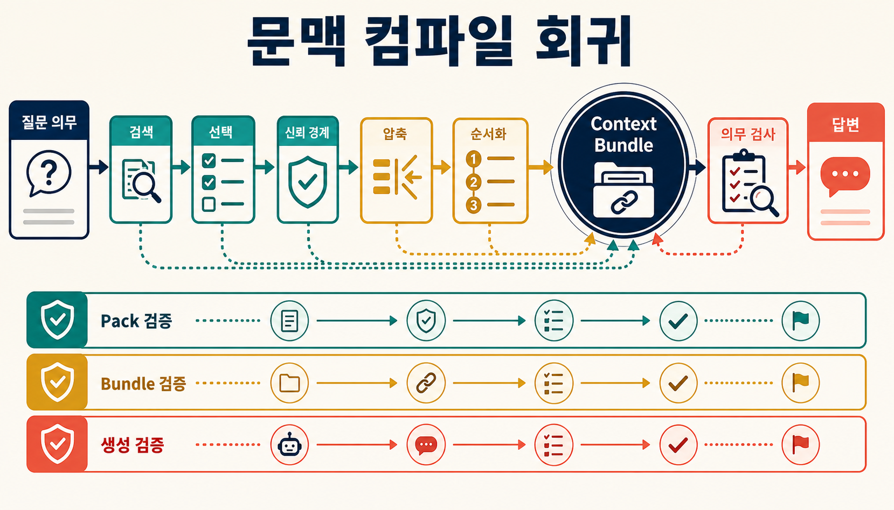
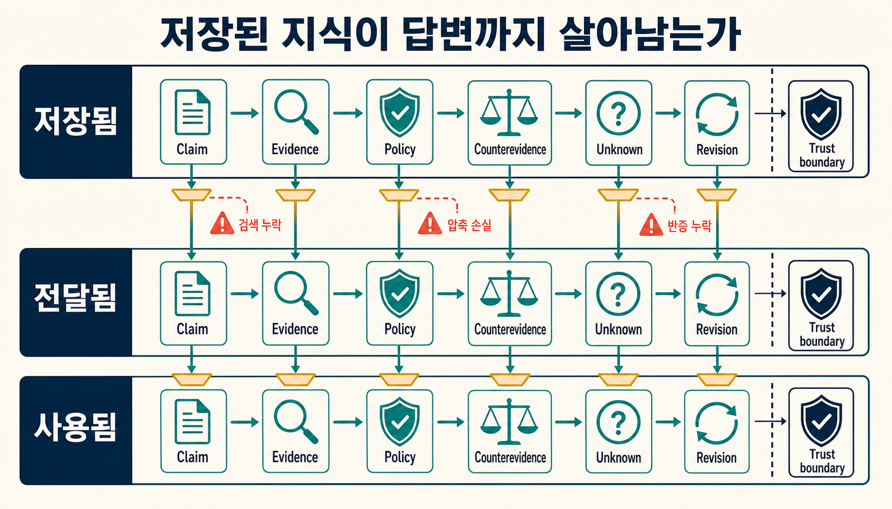
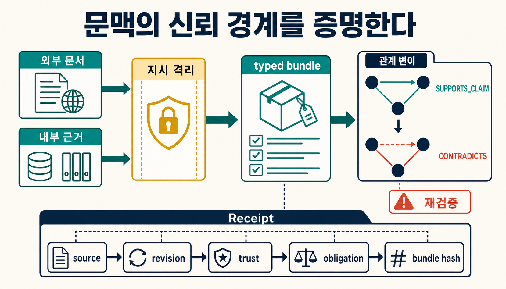
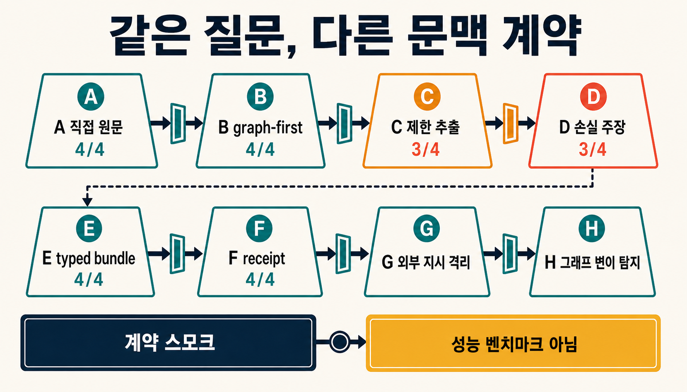

> [!summary] 핵심 결론
> 원문과 지식 묶음이 정확해도, 에이전트에게 전달할 짧은 문맥을 만드는 과정에서 중요한 조건이나 반례가 빠질 수 있습니다. 따라서 **저장된 지식이 맞는지**와 **실제로 전달된 문맥이 충분한지**를 따로 검사해야 합니다. 이 글의 DuckCrab 결과는 누락·외부 명령·그래프 관계 변경을 찾아내는 계약 검사의 가능성을 확인한 제한적 실험이며, 특정 모델이나 압축 방식이 더 우수하다는 성능 비교는 아닙니다.

어떤 기술 검토 시스템에 최신 정책, 승인 근거와 예외 조항이 모두 정확하게 저장되어 있다고 가정해 보겠습니다. 사용자가 “이 재료를 지금 현장에 적용해도 되는가?”라고 물었습니다. 검색 결과에는 허용 조건과 금지 조건이 모두 들어 있었습니다.

하지만 에이전트에게 보낼 내용을 짧게 줄이는 과정에서 **“현장별 별도 승인 필요”**라는 조건이 빠졌습니다. 최종 답은 “적용 가능”으로 정리됐습니다.

지식베이스도 맞았고 검색도 작동했습니다. 문제는 **정확한 지식을 짧은 작업 문맥으로 바꾸는 사이에 판단을 뒤집을 수 있는 조건이 사라진 것**입니다.

이 글에서는 이런 현상을 **문맥 컴파일 회귀**라고 부릅니다. 널리 확립된 표준 용어가 아니라, 이 프로젝트에서 다음과 같은 실패를 함께 추적하기 위해 사용하는 분석 이름입니다.

> 원문·지식 묶음·정책은 정확하지만, 질문 해석·검색·선택·압축·배열·버전 결합 방식이 바뀐 뒤 에이전트가 실제로 읽는 문맥에서 필수 근거·반례·정책·미확인 정보가 빠지거나, 외부 문서 속 문장이 상위 명령처럼 작동하는 현상.

[[notes/ontology-context-compiler-opencrab|9번 글]]은 온톨로지와 지식 Pack을 문맥 컴파일러로 보는 관점을 설명했습니다. [[notes/knowledge-centric-self-improvement|15번 글]]은 여러 작업에서 얻은 경험을 검증된 공유 지식으로 승격하는 과정을 다뤘습니다. 그 글에서 소개한 Knowledge-Centric Self-Improvement(KSI) 연구도 여러 작업의 경험을 공유 지식으로 정리하는 구조를 제안합니다.[src_001](#src-001) [src_002](#src-002)

이번 글은 그 다음 단계입니다. **좋은 지식을 만들었다는 사실과, 현재 질문에 좋은 문맥이 전달됐다는 사실을 분리해 확인합니다.**

> [!important] 이 글에서 자주 쓰는 말
>
> - **Pack(지식 묶음):** 원문, 근거, 정책, 반례와 출처를 함께 정리한 자료입니다.
> - **Context Bundle(작업 문맥):** Pack 전체가 아니라, 현재 질문에 답하도록 에이전트에게 실제로 전달하는 짧은 자료 묶음입니다.
> - **revision(버전):** 문서나 지식 묶음이 어느 시점의 내용인지 나타내는 번호입니다.
> - **Obligation Set(필수 정보 목록):** 답을 내리기 전에 문맥에 반드시 남아 있어야 할 근거·정책·반례·미확인 사항의 목록입니다.
> - **Receipt(재현 기록):** 어떤 자료를 어떻게 검색·선택·압축했는지 남기는 작업 일지입니다.
> - **probe(검사 조건):** 특정 실패가 드러나는지 확인하려고 순서, 길이, 문서 또는 관계를 일부러 바꿔 보는 시험입니다.

> [!important] 근거 범위
> 논문 수치와 외부 연구 결과는 각 연구가 보고한 범위 안에서만 인용합니다. DuckCrab 실험은 정해진 입력과 규칙으로 실행한 계약 스모크 테스트입니다. 실제 LLM 답변 품질, 학습된 압축기 성능, 보안 탐지기의 오탐·미탐을 종합적으로 비교한 벤치마크는 아닙니다.

## 저장된 지식과 전달된 문맥은 다릅니다

문맥 컴파일러는 질문을 해석한 뒤 필요한 역할을 정하고, 후보 근거를 검색·선택합니다. 그다음 제한된 입력 길이에 맞춰 내용을 줄이고 순서를 정해 Context Bundle을 만듭니다.

```text
질문에서 필요한 정보 정의
→ 검색(retrieval)
→ 선택과 재정렬(selection / reranking)
→ 외부 자료의 신뢰 경계 확인
→ 압축과 요약(compression / synthesis)
→ 순서와 형식 결정
→ Context Bundle 생성
→ 필수 조건 검사
→ 답변·행동
```

최종 답만 보면 어느 단계에서 정보가 사라졌는지 찾기 어렵습니다. 다음 실패를 나누어 기록하면 원인을 좁힐 수 있습니다.

1. **질문 계약 실패:** 정책, 반례, 미확인 사항을 처음부터 필수 정보로 요구하지 않았습니다.
2. **검색 실패:** 정본에는 있지만 검색 후보에 들어오지 않았습니다.
3. **선택 실패:** 검색된 후보 가운데 금지 조항이나 반례가 제거됐습니다.
4. **압축 실패:** 예외 조건, 단위, 출처 위치 또는 버전이 요약 과정에서 사라졌습니다.
5. **배열 실패:** 정보는 들어 있지만 위치와 순서 때문에 모델이 제대로 활용하지 못했습니다.
6. **버전·권한 실패:** 오래된 정책이나 사용 권한이 없는 자료가 섞였습니다.
7. **생성 실패:** Context Bundle이 충분해도 모델이 근거를 무시하거나 잘못 인용했습니다.
8. **명령 경계 실패:** 외부 문서의 문장이 분석할 데이터가 아니라 상위 명령처럼 작동했습니다.
9. **그래프 무결성 실패:** 문장 자체는 그대로지만 잘못된 관계(edge)와 경로가 추론 재료를 바꿨습니다.



RAGAs, ARES, RAGChecker와 RAGVUE 같은 평가 도구도 비슷한 이유로 검색 품질, 답변 관련성, 완전성, 근거 충실도와 생성 오류를 나누어 봅니다. 최종 답 하나만 검사하면 검색 단계와 답변 생성 단계 중 어디가 잘못됐는지 알기 어렵기 때문입니다.[src_004](#src-004) [src_005](#src-005) [src_006](#src-006) [src_010](#src-010)

## 정보가 들어 있어도 제대로 이용되지 않을 수 있습니다

`Lost in the Middle` 연구는 긴 입력에서 관련 정보의 위치가 바뀌면 과제 성능도 크게 달라질 수 있다고 보고했습니다. 특히 중요한 정보가 입력의 중간에 있을 때 놓치는 경우가 나타났습니다.[src_003](#src-003)

`Found in the Middle`은 모델이 입력의 시작과 끝에 상대적으로 더 주의를 주는 U자형 위치 편향을 분석하고 보정 방법을 제안했습니다.[src_011](#src-011) 다만 후속 연구에서는 모든 모델이 똑같은 U자형 패턴을 보이지 않았고, 정보 표현 방식과 위치 변화의 영향도 모델마다 달랐습니다.[src_012](#src-012)

따라서 “필수 조항이 Context Bundle 안에 들어 있다”는 사실만으로는 충분하지 않습니다. 실제로 이용되는지도 다음과 같이 시험해야 합니다.

- 같은 근거의 순서를 여러 번 섞습니다.
- 결정적인 정책을 시작·중간·끝으로 옮깁니다.
- 겉으로는 관련 있어 보이지만 답에는 필요 없는 **방해 문서(distractor)**를 추가합니다.
- 주장과 반례 사이의 거리를 바꿉니다.
- 여러 번 대화한 뒤에도 **주의 조건(caveat)**이 유지되는지 확인합니다.

예를 들어 “보호장비를 착용하면 사용 가능”이라는 규정과 “밀폐 공간에서는 사용 금지”라는 예외가 함께 있다면, 두 문장의 순서와 거리를 바꾸어도 금지 조건이 계속 답에 반영돼야 합니다.

## 압축은 입력을 줄이지만 근거도 잃게 할 수 있습니다

RAG는 관련 문서를 찾아 모델에 제공하지만, 문서가 너무 많으면 입력 비용과 처리 시간이 늘어납니다. 그래서 중복과 잡음을 줄이는 **문맥 압축**을 사용합니다.

RECOMP는 필요한 문장만 뽑거나 요약하는 방식을 연구했고, SARA는 일부 핵심 문장을 자연어로 남기면서 나머지 근거를 압축 표현으로 함께 활용하는 방법을 제안했습니다.[src_007](#src-007) [src_009](#src-009) 즉, 압축 자체가 문제인 것은 아닙니다. **무엇을 줄였고 무엇이 남았는지 따로 측정하지 않는 것**이 문제입니다.

2026년 evidence-aware RAG 연구는 Self-RAG, LLMLingua-2와 ASQA를 사용한 통제 실험에서 근거 보존 비율(retention)을 `1.00`에서 `0.20`으로 낮췄을 때 다음 변화를 보고했습니다.[src_008](#src-008)

| 지표                              | retention 1.00 | retention 0.20 |   변화 |
| --------------------------------- | -------------: | -------------: | -----: |
| 답변 요약 품질(RougeLsum)         |          35.34 |          33.15 |  -2.19 |
| 질문 답변 정확도(QA-F1)           |          23.35 |          19.08 |  -4.27 |
| 필요한 인용을 남긴 비율           |          50.10 |          10.95 | -39.15 |
| 남은 인용이 실제 근거와 맞는 비율 |          63.71 |          12.13 | -51.58 |

답변 점수는 비교적 조금 떨어졌지만, 인용 근거를 얼마나 잘 남겼는지는 훨씬 크게 나빠졌습니다. 겉보기 답이 그럴듯하더라도 “왜 그런 답을 했는가”를 추적하기 어려워질 수 있다는 뜻입니다.

이 숫자를 모든 RAG 시스템에 그대로 적용해서는 안 됩니다. 해당 연구는 한 가지 모델 기반 구조, 한 압축기와 ASQA 데이터셋을 사용했습니다. 인용을 고려한 개선 방식도 비교적 완만한 압축 조건에서 평가했습니다. 여기서 얻을 수 있는 안전한 운영 원칙은 다음과 같습니다.

> **답변 품질, 근거·반례·정책 보존, 데이터와 명령의 경계, 토큰·지연 비용을 각각 측정합니다.**

## 먼저 ‘꼭 남아야 하는 정보’를 정합니다

정책과 근거를 다루는 질문에서는 하나의 모범 답안을 먼저 만드는 것보다, **답을 내리기 전에 반드시 확인해야 할 정보 목록**을 정하는 편이 안전합니다. 이를 Obligation Set이라고 부르겠습니다.

학교 실험실에서 약품 사용을 허가한다고 생각해 보겠습니다. “사용 가능”이라는 결론만 맞히면 되는 것이 아닙니다. 현재 안전 규정, 담당자 승인, 알려진 예외, 아직 확인하지 못한 환기 조건까지 함께 남아야 합니다.

```yaml
question_id: material-applicability-001
required:
  claim: [current_applicability]
  evidence: [technical_review]
  policy: [current_policy]
  counterevidence: [known_exception]
  unknown: [site_specific_approval]
  revision: [pack_rev_42]
  trust_boundary: [external_content_is_data]
abstain_if:
  - current_policy_missing
  - target_scope_unknown
  - untrusted_instruction_detected
```

위 예시는 다음을 요구합니다.

- 현재 적용 가능 여부와 그 근거
- 최신 정책
- 알려진 예외나 반대 근거
- 현장별 승인처럼 아직 확인하지 못한 사항
- 사용한 Pack의 버전
- 외부 문서는 명령이 아니라 데이터로 다룬다는 신뢰 경계
- 필수 조건이 없을 때는 억지로 답하지 않고 보류한다는 규칙

평가할 때는 역할별 필수 정보 보존율, 근거와 반례의 보존, 출처 추적 가능성, 버전 일치 여부, 오래된 안내가 섞인 비율, 올바른 답변 보류 여부와 외부 명령 노출 여부를 따로 확인합니다. 최종 답이 우연히 맞더라도 `unknown`이나 보류 조건이 사라졌다면 통과시키지 않습니다.

Gold Obligation Set, 즉 사람이 만든 기준 목록도 완전한 정답은 아닙니다. 작성자의 관점과 누락이 평가에 들어갈 수 있습니다. 고위험 작업에서는 여러 검토자가 목록을 만들고, 의견이 달랐던 항목을 기록하며, 일정한 주기로 표본을 다시 확인해야 합니다.

## Receipt는 결과를 재현하기 위한 작업 일지입니다

최종 Context Bundle만 저장하면 어떤 단계가 바뀌었는지 알기 어렵습니다. 검색 색인, 선택기, 토큰 예산, 압축기, 문서 형식 또는 Pack 버전 가운데 무엇이 결과를 바꿨는지 추적하려면 작업 과정을 함께 기록해야 합니다.

`ContextCompilerReceipt`는 실험실의 실험 노트와 비슷합니다. 같은 조건을 다시 만들고, 이전 실행과 달라진 부분을 찾는 데 사용합니다.

```yaml
receipt_id: ccr_001
question_contract_hash: sha256:...
pack:
  id: expertise_pack_example
  expected_revision: rev_42
  actual_revision: rev_42
retrieval:
  mode: hybrid
  index_revision: idx_17
selection:
  selector_version: selector_3
  selected_refs: [ev_10, pol_4, ctr_2]
trust_boundary:
  detector_version: instruction_detector_2
  suspected_instruction_refs: [doc_19]
  action: quarantined
compression:
  mode: typed_abstractive
  compressor_version: compressor_5
  token_budget: 1800
graph:
  graph_revision: graph_11
  path_refs: [path_7]
  edge_evidence_verified: true
output:
  context_hash: sha256:...
  retained_obligations: [claim, evidence, policy, counterevidence]
  missing_obligations: [unknown]
validation:
  result: revise
```

이 기록에는 사용한 Pack과 검색 색인 버전, 선택한 근거, 의심스러운 외부 명령의 처리, 압축 방식, 그래프 버전, 최종 문맥의 해시와 빠진 필수 정보가 들어 있습니다. 결과가 달라졌을 때 비교할 기준이 생깁니다.

그러나 Receipt가 채워졌다고 내용이 참이라는 뜻은 아닙니다. 잘못된 자료를 꼼꼼히 기록할 수도 있습니다. 또한 질의, 후보 문서 목록과 사용자·조직 정보가 민감할 수 있으므로, 필요한 식별자와 해시만 남기고 접근 권한·로그·보존 기간을 별도로 관리해야 합니다.

## 외부 문서는 근거이면서 공격 통로입니다

RAG는 외부 문서를 모델의 입력으로 옮깁니다. 이때 문서 안의 “이전 지시를 무시하라” 같은 문장은 분석할 자료일 수도 있고, 모델의 행동을 바꾸려는 **간접 프롬프트 인젝션**일 수도 있습니다.

AIP 연구는 여러 사람이 공유하고 재사용하는 instructional prompt가 검색 동작을 바꾸는 공격 표면이 될 수 있다고 설명했습니다. 연구가 평가한 데이터셋과 설정에서는 공격 성공률이 최대 `95.23%`로 보고됐습니다.[src_013](#src-013) 이 수치는 해당 모델, 데이터, top-5 검색과 평가 조건에서 나온 결과이며 일반 서비스의 실제 공격률을 뜻하지 않습니다.

InstructDetector는 외부 콘텐츠 속 명령을 탐지하는 방법을 제안했습니다. 논문의 자체 평가에서는 높은 동일 분포·외부 분포 탐지 정확도와 낮은 BIPIA 공격 성공률을 보고했습니다.[src_014](#src-014) 다만 추가 계산 비용이 들고, 모델 내부 상태에 접근하기 어려운 상용 모델에는 그대로 적용하기 힘들 수 있습니다.

따라서 문맥 컴파일러는 내용을 줄이기 전에 다음 경계를 지켜야 합니다.

- 외부 콘텐츠는 기본적으로 **데이터**이며, 시스템·사용자 명령보다 낮은 신뢰 수준으로 표시합니다.
- 명령형 문장을 무조건 삭제하지 않습니다. 정상적인 정책과 매뉴얼에도 “반드시 착용한다” 같은 문장이 있기 때문입니다.
- 의심 문장은 격리하고, 인용할 텍스트로만 전달하거나 사람 검토로 보냅니다.
- 검색기와 문맥 컴파일러가 함께 사용하는 안내 프롬프트도 버전·해시·변경 검토 대상으로 관리합니다.
- 답이 맞았는지만 보지 않고, 외부 데이터가 제어 명령으로 승격됐는지도 검사합니다.

GraphRAG에서는 문장만 검사해도 충분하지 않습니다. GraphRAG는 문서 속 대상과 관계를 그래프로 연결해 검색과 추론에 사용합니다. LogicPoison은 문장 의미를 눈에 띄게 바꾸지 않고도 관계 구조를 교란해 추론 경로를 바꾸는 공격을 연구했습니다.[src_015](#src-015)

이 연구는 세 공개 데이터셋, 세 LLM과 세 GraphRAG 방식으로 평가했지만, 정적인 영어 자료와 특정 공격 조건에 한정됩니다. 그럼에도 **관계(edge), 경로(path), 근거, 버전과 관계 종류를 문장과 별도로 확인해야 한다**는 설계 근거를 제공합니다.



## A부터 H까지, 문맥만 바꾸어 실패 위치를 찾습니다

같은 질문, 같은 모델, 같은 Pack 버전과 같은 입력 길이를 유지하고 전달 문맥만 바꾸면 어느 단계에서 정보가 빠졌는지 더 쉽게 구분할 수 있습니다.

| 조건 | 전달 방식                                         | 확인할 것                         |
| ---- | ------------------------------------------------- | --------------------------------- |
| A    | 핵심 원문 문장을 직접 전달                       | 비교 기준이 되는 감사 가능한 상한 |
| B    | 상위 검색 결과를 그대로 전달                     | 일반 RAG 기준선                   |
| C    | 원문 문장만 골라 줄이는 추출형 압축              | 원문 문장 보존                    |
| D    | 여러 문장을 새 문장으로 합치는 생성형 압축       | 합성 과정의 조건 누락             |
| E    | Claim·Evidence·Policy·Counterevidence 역할별 묶음 | 정보 역할 보존                    |
| F    | E + Receipt + Obligation probe                   | 원인 추적과 재현                  |
| G    | F + 외부 명령 탐지·격리                          | 데이터가 명령으로 바뀌는지 확인   |
| H    | G + 관계 근거·그래프 변경 probe                  | GraphRAG 관계 무결성              |

필수 검사에는 근거 순서 섞기, 방해 문서 추가, 주의 조건 위치 바꾸기, 오래된 버전 섞기, 입력 길이 단계별 변경, 답할 수 없는 질문, 여러 대화 턴 뒤의 정보 변형, 문서 속 명령 삽입, 공통 프롬프트 변경과 그래프 관계 방향·종류·경로 변경이 포함됩니다. 평균 점수뿐 아니라 가장 나쁜 조건도 함께 봅니다.

### DuckCrab에서 실행한 제한적 계약 스모크

프로젝트의 `tteggu_ontology_agents_arxiv_v1` Pack에 저장된 AgentPoison 연구 요약을 사용했습니다. 고정 질문은 저자 보고 결과와 **위협 모델(threat model, 공격자가 무엇을 알고 어떤 행동을 할 수 있는지 정한 조건)**의 한계를 함께 묻습니다.

반드시 남아야 할 정보는 다음 네 가지였습니다.

1. 저자가 보고한 공격 성공 결과
2. 정상 질문에 미친 영향
3. 오염 문서 비율
4. 임베딩 모델에 접근할 수 있다는 공격 조건의 한계

| 조건                                      | 의무 보존 | 관찰                          |
| ----------------------------------------- | --------: | ----------------------------- |
| 직접 원문                                 |       4/4 | 모든 의무 보존                |
| DuckCrab graph-first top-k                |       4/4 | 모든 의무 보존                |
| 제한된 추출형 압축                        |       3/4 | 위협 모델 한계 누락           |
| 고의로 정보를 뺀 주장 묶음               |       3/4 | 위협 모델 한계 누락           |
| 역할별 Typed Bundle                       |       4/4 | 주장·한계·근거 참조 보존      |
| Typed Bundle + Receipt                    |       4/4 | Pack·출처 참조·문맥 해시 기록 |
| 합성 외부 명령 probe                      |      검출 | 최종 Bundle에서 격리          |
| `SUPPORTS_CLAIM` → `CONTRADICTS` mutation |      검출 | 예상 관계와 불일치 확인       |



> [!warning] 이 결과가 말해 주는 범위
> 이 결과는 정해진 입력과 규칙으로 실행한 **결정론적 계약 스모크**입니다. 실제 LLM 답변 생성, 인용과 근거의 일치도, 학습된 생성형 압축기, 탐지기의 오탐·미탐과 그래프의 의미 정확성은 측정하지 않았습니다. 사용한 Pack에는 활성 벡터 색인이 없어, 그래프 관계를 먼저 따라가는 `graph_first` 진단 경로를 사용했습니다.

이 실험이 “역할별 묶음은 언제나 더 좋다”는 사실을 증명하지는 않습니다. 확인한 것은 더 작고 구체적입니다. **같은 질문에서 반드시 남아야 할 정보를 미리 정하면, 문맥을 줄이는 과정에서 어느 조건이 빠졌는지 자동으로 찾을 수 있었습니다.**

## 기본 방식으로 바꾸기 전에 통과할 조건

새 문맥 컴파일러를 기본값으로 사용하려면 적어도 다음 조건을 만족해야 합니다.

- 필수 정책·반례·근거 보존율이 기존 기준보다 낮아지지 않습니다.
- 오래된 버전과 권한 위반 자료가 섞이지 않습니다.
- 외부 문서의 지시가 상위 명령으로 실행되지 않습니다.
- 그래프 관계와 경로의 근거·버전을 다시 확인할 수 있습니다.
- 답이 맞더라도 출처와의 연결이 크게 나빠지면 통과시키지 않습니다.
- 특정 문서 순서나 모델 하나에서만 좋아지는 결과가 아니어야 합니다.
- 사람의 표본 검토와 자동 평가 결과가 크게 다르면 기본값 변경을 보류합니다.

모든 시스템에 복잡한 게이트가 필요한 것은 아닙니다. 짧은 단일 출처 질문은 핵심 원문을 직접 전달하는 방식이 더 단순하고 감사하기 쉽습니다. 기존 RAG 평가에 출처, 버전, 정책과 보안 검사만 추가해도 충분한 시스템도 있습니다.

## 결론: 저장된 지식과 전달된 문맥을 모두 검사합니다

좋은 Pack은 출발점입니다. 에이전트가 실제로 판단할 때 읽는 것은 Pack 전체가 아니라, 현재 질문에 맞춰 선택하고 줄인 작은 문맥입니다. 그 사이에는 검색, 선택, 압축, 순서 결정, 신뢰 경계 확인과 그래프 관계 선택이 있습니다.

따라서 근거·정책·버전·권한을 감사해야 하는 시스템에서는 다음 세 문장을 운영 계약으로 남길 가치가 있습니다.

```text
Pack validation ≠ Context Bundle validation
정보가 포함됨 ≠ 정보가 실제 판단에 사용됨
Receipt ≠ 진실 증명
```

[[notes/kg-guided-llm-planning|11번 글]]은 지식그래프를 계획과 검증 신호에 연결했습니다. [[notes/pi-agent-duckcrab-dag-harness|14번 글]]은 조사 의무를 실행 가능한 작업 구조로 옮겼습니다. 문맥 컴파일 회귀 검사는 그 작업에 들어가는 **실제 판단 재료가 충분하고 안전한지 확인하는 게이트**입니다.

다음 단계는 활성 벡터 검색, 실제 압축기와 여러 모델을 포함한 end-to-end 비교입니다. 사람이 만든 Obligation Set의 품질과 검토 비용도 함께 측정해야 합니다. 그전까지 이번 결과는 성능 우월성 주장이 아니라 **누락, 외부 명령과 그래프 관계 변경을 찾기 위한 검증 설계와 제한적 스모크 테스트**로 읽어야 합니다.

## 출처

- <a id="src-001"></a> Wang et al. (2026). [Knowledge-Centric Self-Improvement — Official Project Page](https://recursive-knowledge.github.io/knowledge-centric-self-improvement/).
- <a id="src-002"></a> Wang, X. J. et al. (2026). [Knowledge-Centric Self-Improvement](https://arxiv.org/abs/2607.19592). arXiv:2607.19592.
- <a id="src-003"></a> Liu, N. F. et al. (2024). [Lost in the Middle: How Language Models Use Long Contexts](https://aclanthology.org/2024.tacl-1.9/). TACL 12.
- <a id="src-004"></a> Es, S. et al. (2024). [RAGAs: Automated Evaluation of Retrieval Augmented Generation](https://aclanthology.org/2024.eacl-demo.16/). EACL 2024.
- <a id="src-005"></a> Saad-Falcon, J. et al. (2024). [ARES: An Automated Evaluation Framework for Retrieval-Augmented Generation Systems](https://aclanthology.org/2024.naacl-long.20/). NAACL 2024.
- <a id="src-006"></a> Ru, D. et al. (2024). [RAGChecker: A Fine-grained Framework for Diagnosing Retrieval-Augmented Generation](https://arxiv.org/abs/2408.08067). arXiv:2408.08067.
- <a id="src-007"></a> Xu, F., Shi, W., & Choi, E. (2023). [RECOMP: Improving Retrieval-Augmented LMs with Compression and Selective Augmentation](https://arxiv.org/abs/2310.04408). arXiv:2310.04408.
- <a id="src-008"></a> Li, A., Peng, Q., & Chen, B. (2026). [Efficiency vs. Verifiability in Evidence-Aware RAG: Does Prompt Compression Preserve Citation Grounding?](https://aclanthology.org/2026.customnlp4u-1.19/). CustomNLP4U 2026.
- <a id="src-009"></a> Jin, Y. et al. (2026). [SARA: Selective and Adaptive Retrieval-augmented Generation with Context Compression](https://aclanthology.org/2026.acl-long.661/). ACL 2026.
- <a id="src-010"></a> Murugaraj, K. et al. (2026). [RAGVUE: A Diagnostic View for Explainable and Automated Evaluation of Retrieval-Augmented Generation](https://aclanthology.org/2026.eacl-demo.35/). EACL 2026.
- <a id="src-011"></a> Hsieh, C.-Y. et al. (2024). [Found in the Middle: Calibrating Positional Attention Bias Improves Long Context Utilization](https://aclanthology.org/2024.findings-acl.890/). Findings of ACL 2024.
- <a id="src-012"></a> Gupte, M. et al. (2025). [What Works for Lost-in-the-Middle in LLMs? A Study on GM-Extract and Mitigations](https://arxiv.org/abs/2511.13900). arXiv:2511.13900.
- <a id="src-013"></a> Chaturvedi, S. S. et al. (2025). [AIP: Subverting Retrieval-Augmented Generation via Adversarial Instructional Prompt](https://aclanthology.org/2025.emnlp-main.801/). EMNLP 2025.
- <a id="src-014"></a> Wen, T. et al. (2025). [Defending against Indirect Prompt Injection by Instruction Detection](https://aclanthology.org/2025.findings-emnlp.1060/). Findings of EMNLP 2025.
- <a id="src-015"></a> Xiao, Y. et al. (2026). [LogicPoison: Logical Attacks on Graph Retrieval-Augmented Generation](https://aclanthology.org/2026.acl-long.252/). ACL 2026.
