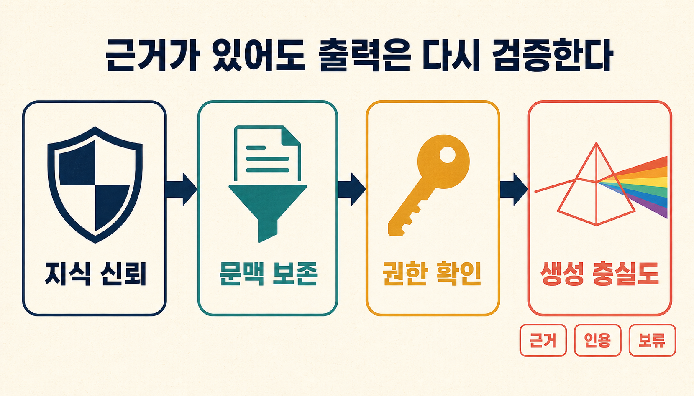
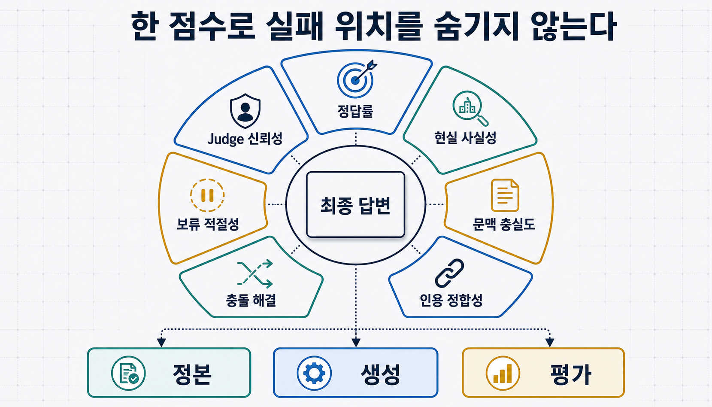
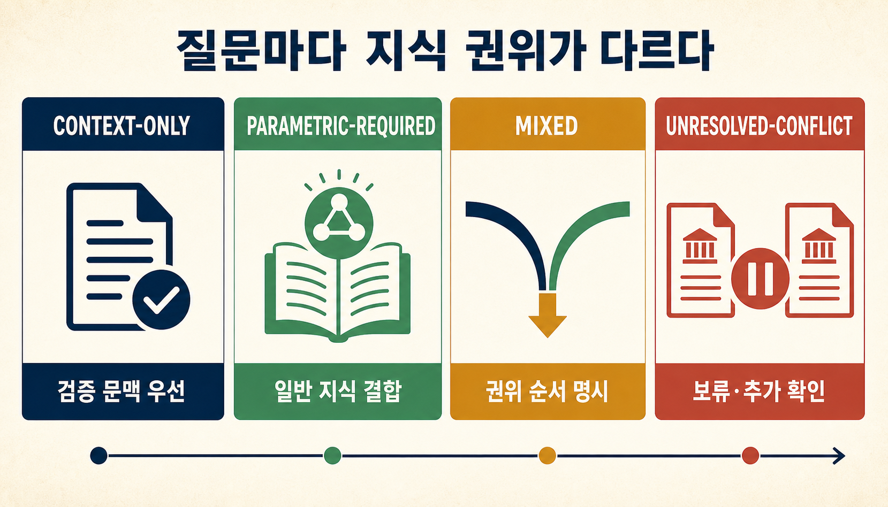
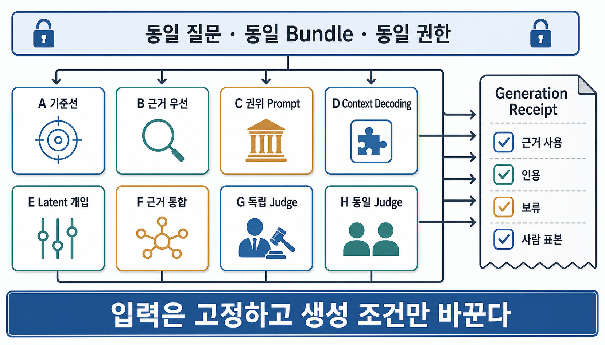

> [!summary] 핵심 결론
> 좋은 답을 만들려면 지식을 검증하고, 질문에 맞는 자료를 `Context Bundle`, 즉 작업용 문맥 묶음으로 만들고, 현재 사용자의 권한을 확인해야 합니다. 여기서 한 단계 더 나아가 **모델이 질문의 성격에 맞는 지식원을 골라 실제 근거를 사용했는지**도 검사해야 하며, 이 글의 `Task-Aware Authority Policy`는 질문별 지식 우선순위 규칙이고 `Generation Faithfulness Gate`는 답이 근거를 제대로 사용했는지 확인하는 검사입니다. 둘 다 프로젝트 설계안이며, 아직 DuckCrab에서 처음부터 끝까지 성능을 검증한 기능은 아닙니다.

최신 사내 정책에는 “기술 검토를 통과했더라도 현장 책임자의 승인을 받아야 적용할 수 있다”라고 적혀 있다고 가정해 보겠습니다. 검색기는 이 문서를 찾았고, 문맥 컴파일러도 승인 조건을 빠뜨리지 않았습니다. 현재 사용자에게 문서를 볼 권한도 있습니다.

그런데 모델은 예전에 학습한 일반 지식을 앞세워 “기술 검토를 통과했으므로 바로 적용할 수 있습니다”라고 답했습니다. 출처 링크는 최신 정책을 가리키지만, 정작 답은 그 정책이 요구하는 조건을 따르지 않았습니다.

이처럼 외부 자료를 검색해 답변에 활용하는 방식을 `RAG`, 즉 검색 증강 생성이라고 합니다. 이 경우 지식베이스, 검색, 문맥 조립과 권한 필터를 다시 고쳐도 문제가 해결되지 않을 수 있습니다. 실패는 **근거가 모델 입력에 들어간 뒤, 모델이 그 근거를 사용하는 단계**에서 발생했기 때문입니다.

이 글에서는 동일한 질문과 검증된 Context Bundle을 고정했는데도 model·prompt·decoding·권위 정책·judge 변경 뒤 근거 사용, 인용, 보류 또는 사실성이 나빠지는 현상을 **생성 충실도 회귀**라고 부릅니다. 여기서 model은 답을 만드는 LLM, prompt는 모델에 주는 지시문, decoding은 다음 단어를 고르는 방식, revision은 버전, 권위 정책은 어떤 지식원을 우선할지 정한 규칙, judge는 답을 채점하는 평가 모델을 뜻합니다. 생성 충실도 회귀는 이 프로젝트에서 쓰는 분석 용어이며, 학술적으로 확립된 표준 명칭은 아닙니다.

이제 답이 만들어지는 네 단계를 먼저 나누고, 실패를 측정하는 기준, 질문별 지식 우선순위, 재현 기록과 비교 실험 순서로 살펴보겠습니다.

## 답이 나오기 전에는 네 가지 경계를 통과합니다

최근 글들은 좋은 답이 만들어지기 전의 서로 다른 경계를 다뤘습니다.

- [[notes/agent-memory-poisoning-promotion-gate|18번 글]]은 저장된 경험이 신뢰할 수 있는 지식으로 승격됐는지 묻습니다.
- [[notes/context-compilation-regression|16번 글]]은 검증된 지식에서 질문별 Context Bundle을 만들 때 조건·반례·버전이 보존됐는지 묻습니다.[src_001](#src-001)
- [[notes/authorization-aware-rag-graph-boundary|17번 글]]은 관련 있는 자료를 현재 `principal`, 즉 자료를 요청하는 사용자·서비스·에이전트가 실제로 사용할 권한이 있는지 묻습니다.
- 이번 글은 그 문맥을 모델이 과업에 맞게 사용했는지 묻습니다.

```text
신뢰할 수 있는 지식인가
→ 필요한 근거가 문맥에 보존됐는가
→ 현재 principal에게 허용된 문맥인가
→ 모델이 과업에 맞는 권위로 그 근거를 사용했는가
```

이 네 질문을 한 점수로 합치면 원인을 찾기 어렵습니다. 오염된 지식을 충실하게 사용한 답, 완전한 문맥을 무시한 답, 권한 없는 문서를 정확하게 요약한 답은 모두 실패이지만 고쳐야 할 위치가 다릅니다.

## 정확한 문맥이 있어도 생성은 실패합니다

CoDA는 정확하고 충분한 검색 문맥이 있는데도 환각이 남을 수 있다고 보고합니다. 생성이 진행될수록 문맥의 영향은 약해지고, 학습 과정에서 모델 내부에 저장된 일반 지식인 **파라미터 지식**이 더 강해지는 현상을 분석합니다.[src_002](#src-002) Context-Fidelity Boosting은 비슷한 문제를 decoding 단계의 `logit shaping`, 즉 후보 단어의 점수를 조정하는 방식으로 다룹니다.[src_003](#src-003) ReDeEP도 정확하고 관련성 높은 문맥이 있어도 외부 근거를 충분히 끌어오지 못하고 내부 지식이 지나치게 작동하면 잘못된 답이 나올 수 있다고 봅니다.[src_008](#src-008)

세 연구가 같은 원인을 증명한 것은 아닙니다.

- CoDA는 `attention`, 즉 입력의 어느 부분을 더 중요하게 볼지 정하는 계산과, 층 사이로 정보가 흐르는 경로인 `residual routing`을 다룹니다.
- Context-Fidelity Boosting은 decoding 과정에서 후보 단어들의 출력 점수를 조정합니다.
- ReDeEP은 문맥 표현을 복사하는 데 관여하는 `copying head`와 파라미터 지식의 관계를 모델 내부 작동 방식에서 살펴봅니다.
- GuarantRAG는 추론과 근거 사용을 함께 조정하는 `joint decoding`을 제안합니다.[src_006](#src-006)
- ProbeRAG는 모델 내부에 압축된 표현인 `잠재 표현`에서 충돌을 찾고 attention을 조정합니다.[src_007](#src-007)

공통으로 지지되는 범위는 제한적입니다. **검색 성공과 문맥 보존이 곧 근거에 충실한 생성을 뜻하지는 않습니다.** 어느 내부 설명과 개입 방식이 더 나은지는 같은 모델·데이터·예산에서 따로 비교해야 합니다.

## 한 개의 환각 점수로는 실패 위치를 찾기 어렵습니다

최종 답을 정답과 오답으로만 나누면 다음 실패가 한 덩어리로 섞입니다.

1. **근거 무시:** Context Bundle에 직접 근거가 있지만 파라미터 지식으로 답합니다.
2. **근거 혼합:** 외부 근거와 내부 지식을 출처 구분 없이 합칩니다.
3. **문서 간 충돌 오판:** 검색된 자료끼리 충돌하지만 한쪽을 임의로 선택합니다.[src_009](#src-009)
4. **과업 권위 오판:** 문맥만 사용해야 하는지, 일반 지식도 필요한지 잘못 분류합니다.[src_011](#src-011)
5. **인용 불일치:** 인용한 구간이 실제 결론을 지지하지 않습니다.
6. **보류 실패:** 근거가 부족하거나 충돌이 풀리지 않았는데 확정 답을 냅니다.
7. **사실성·충실도 불일치:** 현실에서는 맞지만 제공 문맥에 없는 답과, 문맥에는 충실하지만 현실에서는 틀린 답을 같은 점수로 처리합니다.[src_005](#src-005)
8. **평가자 편향:** 생성 모델과 자동 judge가 비슷한 context-memory 편향을 공유합니다.[src_011](#src-011)



Facet-Level Tracing은 근거 부재, 검색 결과와 생성 답의 어긋남, 기존 지식이 근거를 덮어쓰는 현상을 더 작은 단위로 나누어 진단합니다.[src_010](#src-010) FRANQ도 현실 사실성과 검색된 근거에 대한 충실도를 구분합니다.[src_005](#src-005) 운영에서는 적어도 다음 축을 따로 기록하는 편이 낫습니다.

| 평가 축      | 묻는 질문                                   | 실패할 때 먼저 볼 곳        |
| ------------ | ------------------------------------------- | --------------------------- |
| 정답률       | 질문의 목표를 해결했는가                    | 전체 파이프라인             |
| 현실 사실성  | 기준 원문이나 현실에서 참인가               | 정본·최신성·모델 지식       |
| 문맥 충실도  | 제공된 Bundle이 답을 지지하는가             | 생성·권위 정책              |
| 인용 정합성  | 인용 구간이 해당 주장을 함의하는가          | 인용 선택·생성              |
| 충돌 해결    | 권위·최신성·적용 범위를 올바르게 판단했는가 | task class·authority policy |
| 보류 적절성  | 답할 수 없을 때 확정하지 않았는가           | 보류 계약·judge             |
| judge 신뢰성 | 사람 표본과 자동 판정이 일치하는가          | 평가 모델·gold set          |

## 질문마다 따라야 할 지식원이 다릅니다

문맥을 무시하는 실패를 보면 모델이 외부 자료를 더 강하게 따르도록 만들고 싶어집니다. 그러나 질문마다 필요한 지식원이 다릅니다.

FaithfulRAG은 파라미터 지식과 검색 문맥의 충돌을 개별 사실 단위로 다루면서, 문맥을 엄격하게 따르게 하면 필요한 내부 지식까지 억제할 수 있다고 지적합니다.[src_004](#src-004) Task Matters는 문맥과 모델 기억이 충돌할 때의 반응이 질문에 필요한 지식의 종류에 따라 달라진다고 보고합니다. 문맥을 다시 말하게 하거나 `rationale`, 즉 답을 낸 이유를 설명하게 하는 방법은 문맥만 써야 하는 과업에는 도움이 될 수 있습니다. 그러나 파라미터 지식이 필요한 과업에서는 오히려 성능이 나빠질 수 있었습니다. 모델 기반 평가도 이 차이를 편향되게 판단할 수 있습니다.[src_011](#src-011)

따라서 질문마다 먼저 **어떤 지식원을 어느 순서로 허용할지** 정해야 합니다.



| 과업 유형                              | 기본 권위                    | 예시                                       | 충돌 시 기본 행동                  |
| -------------------------------------- | ---------------------------- | ------------------------------------------ | ---------------------------------- |
| 문맥 전용 (`context-only`)             | 제공된 검증 문맥             | 현행 사내 정책 확인, 문서 요약             | 최신 허용 문맥을 따름              |
| 일반 지식 필요 (`parametric-required`) | 일반 지식 + 문맥             | 문맥 속 수학·언어·상식 추론                | 필요한 일반 지식을 명시적으로 결합 |
| 혼합형 (`mixed`)                       | 명시적 권위 순서             | 최신 정책과 안정적인 일반 원리를 함께 적용 | 출처 역할과 우선순위를 기록        |
| 충돌 미해결 (`unresolved-conflict`)    | 어느 쪽도 자동 우선하지 않음 | 동급 공식 문서가 충돌                      | 보류하고 추가 확인                 |

```yaml
task_knowledge_requirement:
  class: mixed
  allowed_sources:
    - current_authorized_policy
    - verified_domain_reference
    - stable_parametric_background
  prohibited_sources:
    - superseded_policy_memory
  authority_order:
    - current_authorized_policy
    - verified_domain_reference
    - stable_parametric_background
  unresolved_action: abstain
```

이 분류 자체도 오류를 낼 수 있습니다. `mixed`로 봐야 할 질문을 `context-only`로 분류하면 필요한 일반 지식을 억제할 수 있고, 반대의 경우에는 오래된 내부 지식이 최신 정책을 덮을 수 있습니다. 고위험 과업에서는 여러 검토자가 합의해 만든 기준 답안 모음인 `gold set`, 검토자 사이의 의견 차이 기록과 사람 표본 감사가 필요합니다.

## 사실성 개선과 문맥 충실도는 서로 상쇄할 수 없습니다

ICLR 2025 연구는 사실성 향상 개입이 파라미터 지식에 대한 자신감을 높여 입력 문맥을 덜 따르게 만들 수 있다고 보고했습니다. 그 연구의 평가 설정에서는 context-faithfulness가 최대 `69.7%` 감소했지만, 이 수치를 다른 모델이나 운영 환경의 일반적인 하락률로 사용해서는 안 됩니다.[src_012](#src-012)

이 수치에서 일반화할 수 있는 결론은 다음과 같습니다.

```text
사실성 향상
≠ 문맥 충실도 향상
≠ 최신 정책 준수
≠ 올바른 인용
```

반대 방향도 같습니다. 검색 문맥 자체가 오래됐거나 틀렸다면 모델은 그 문맥에 충실하면서 현실에서는 틀릴 수 있습니다. 지식 승격, 문맥 컴파일, 권한과 생성 평가를 각각 통과시켜야 하는 이유입니다.

## Generation Faithfulness Gate는 출력 단계만 책임집니다

`Generation Faithfulness Gate`는 근거·정책·revision·권한·보류를 감사하고, 같은 입력에서 모델 변경의 회귀를 재현해야 하는 시스템을 위한 프로젝트 제안입니다. 짧은 단일 문서 질의응답은 원문의 해당 구간을 직접 전달하고 가볍게 인용을 검사하는 방식으로 충분할 수 있습니다.

```text
Knowledge·Pack validation
  정본과 승격 상태를 검사
        ↓
Context Compilation Gate
  질문별 근거·반례·revision 보존을 검사
        ↓
Authorization Gate
  principal·task·resource·action 권한을 검사
        ↓
Generation Faithfulness Gate
  과업별 권위·근거 이용·인용·보류를 검사
```

각 게이트는 다른 게이트의 성공을 대신하지 않습니다.

| 게이트                       | 통과 조건                                         | 잡지 못하는 것                 |
| ---------------------------- | ------------------------------------------------- | ------------------------------ |
| Knowledge·Pack validation    | 정본, 출처, 승격 상태가 유효함                    | 질문별 선택과 생성 오류        |
| Context Compilation Gate     | 의무·반례·revision이 Bundle에 보존됨              | 모델의 근거 사용 오류          |
| Authorization Gate           | 현재 principal과 task에 자료·행동이 허용됨        | 허용된 자료의 진실성·이용 방식 |
| Generation Faithfulness Gate | task class, 권위, 근거 사용, 인용과 보류가 적절함 | 정본 자체의 오류               |

## Receipt(실행 영수증)는 회귀를 다시 만드는 작업 기록입니다

최종 답과 인용만 저장하면 model revision, prompt, decoding, authority policy와 judge 중 무엇이 바뀌었는지 재현하기 어렵습니다. `GenerationFaithfulnessReceipt`는 실행 조건과 검사 결과를 남기는 영수증 형식의 기록입니다. 답이 참이라고 보증하지 않으며, **같은 조건을 다시 만들고 차이를 찾기 위한 작업 일지**로 사용합니다.

```yaml
generation_receipt_id: gfr_001
question_id: policy-applicability-001
context:
  bundle_hash: sha256:...
  compiler_receipt_id: ccr_042
  pack_revision: rev_42
authorization:
  authorization_receipt_id: ar_117
  principal_scope_hash: sha256:...
task:
  knowledge_requirement: mixed
  authority_policy_version: authority_v3
model:
  model_id: model_x
  model_revision: 2026-07-20
prompt:
  system_prompt_hash: sha256:...
  template_version: answer_template_4
generation:
  temperature: 0
  decoding_mode: standard
output:
  answer_hash: sha256:...
  cited_refs: [pol_4, ev_10]
validation:
  answer_accuracy: pass
  factuality: pass
  context_faithfulness: pass
  citation_entailment: pass
  abstention: not_required
  judge_family: independent_model_y
  human_sampled: true
  result: accept
```

Receipt에는 민감한 prompt, 사용자 질문, `tenant`, 즉 조직·고객별 격리 단위와 문서 경로를 그대로 저장하지 않습니다. 내용이 같으면 같은 값을 내는 짧은 식별값인 해시와 변경되지 않는 ID를 사용하고, 접근 통제와 보존 기간을 적용합니다. 재현에 필요하지 않은 정보는 수집하지 않습니다.

## 같은 Bundle을 고정하고 생성 조건만 바꿉니다

회귀 실험에서는 같은 질문, Pack revision, Context Bundle hash와 권한 상태를 고정합니다. 그런 다음 생성 조건만 바꿔 실패 위치를 좁힙니다.



| 조건 | 생성 방식                         | 확인할 질문                                   |
| ---- | --------------------------------- | --------------------------------------------- |
| A    | 기본 prompt·기본 decoding         | 현재 기준선은 무엇인가                        |
| B    | 근거 우선 prompt                  | 문맥 전용 과업에서 개선되는가                 |
| C    | 과업 유형·권위 규칙을 적은 prompt | 혼합형 충돌을 더 잘 해결하는가                |
| D    | 문맥 인식 decoding                | 문맥 충실도와 사실성의 맞교환 관계는 무엇인가 |
| E    | attention·잠재 표현 개입          | 내부 정보 흐름 개입의 추가 이득이 있는가      |
| F    | 추론·근거 통합 분리               | 추론과 근거를 함께 보존하는가                 |
| G    | 독립 judge + 사람 표본            | 자동 판정이 사람과 일치하는가                 |
| H    | 동일 모델 계열 judge              | 상관된 편향이 얼마나 통과하는가               |

시험 질문인 `probe`도 한 종류로 끝내지 않습니다.

- 문맥만으로 답해야 하는 질문
- 일반 지식이 있어야 문맥을 해석할 수 있는 질문
- 최신 정책과 오래된 내부 지식이 충돌하는 질문
- 검색 문서끼리 충돌하는 질문
- 문맥 자체가 오래됐거나 틀린 질문
- 근거가 부족해 보류해야 하는 질문
- 여러 근거를 결합해야 하는 질문
- 인용 구간은 있지만 결론을 지지하지 않는 질문
- 여러 차례 대화하는 `multi-turn` 상황에서 권위·revision이 바뀌는 질문

평균 점수뿐 아니라 치명적 근거 무시율, 잘못된 확정 답, 지식 권위 오분류와 가장 나쁜 조건을 별도로 기록합니다.

> [!important] 현재 검증 범위
> 이 연구 번들은 공식 ACL·ICLR 자료와 일부 논문 표·한계를 교차 검토했고 근거 감사는 통과했습니다. 다만 DuckCrab의 동일 Context Bundle 기반 A~H 비교, 전체 논문 코드 재현과 한국어 사람 평가는 수행하지 않았습니다. 본문의 게이트·정책·Receipt는 구현이 끝났거나 실서비스에 바로 쓸 수 있다는 주장이 아닙니다.

## 내부 상태를 볼 수 없는 API에서도 얇은 검사는 가능합니다

attention이나 모델 내부 상태인 `latent state`에 접근할 수 없는 상용 API에서는 E 조건 같은 내부 개입을 적용하기 어렵습니다. 이런 내부를 볼 수 없는 방식을 `black-box` 환경이라고 부릅니다. 그래도 다음 검사는 가능합니다.

1. 질문·Bundle hash·authority policy와 모델 revision을 고정합니다.
2. 답변·인용·보류 결과를 재생성해 변동을 기록합니다.
3. 인용 구간이 각 주장을 실제로 지지하는지 별도 검사합니다.
4. context-only·mixed·unresolved-conflict 표본을 나누어 평가합니다.
5. 독립된 judge 계열과 사람 표본을 함께 사용합니다.
6. 모델·prompt·API revision 변경 전후의 최악 조건을 비교합니다.

black-box 환경에서는 모델 내부의 정확한 원인까지 모두 밝힐 수 없습니다. 대신 **관찰할 수 있는 입력과 출력의 계약을 고정해 회귀를 재현할 수 있는 범위**를 분명히 합니다.

## 결론: 근거의 존재와 근거의 이용을 분리합니다

검증된 지식을 만들고, 질문에 필요한 조건을 Context Bundle에 보존하며, 현재 사용자의 권한을 확인하는 일은 모두 필요합니다. 그러나 모델이 그 근거를 과업에 맞게 사용했는지는 별도의 질문입니다.

Pack이 정확해도 질문에 필요한 자료를 잘못 묶으면 Context Bundle이 틀어집니다. Bundle이 정확해도 현재 사용자에게 허용되지 않은 자료가 섞일 수 있습니다. 권한까지 맞더라도 모델이 잘못된 지식원을 우선하거나 근거를 제대로 사용하지 않으면 답은 다시 흔들립니다. 마지막으로 문맥에 충실한 답이 항상 현실에서도 참인 것은 아니므로, 현실 사실성도 따로 확인해야 합니다.

운영에서는 사실성, 문맥 충실도, 인용, 보류와 judge 신뢰성을 한 점수로 상쇄하지 않습니다. 같은 Bundle을 고정한 뒤 모델·prompt·decoding·권위 정책·judge 변경을 비교하고, 어느 단계가 달라졌는지 Receipt로 재현합니다.

정책·근거·권한·revision을 감사해야 하는 시스템이라면 이 구조를 검토할 가치가 있습니다. **좋은 자료가 입력에 있다는 사실과 모델이 그 자료를 올바르게 사용했다는 사실을 나누어 검증하는 일**이 다음 회귀를 찾는 가장 직접적인 출발점입니다.

## 출처

- <a id="src-001"></a> tteggu의 지식창고. (2026). [16. 올바른 지식이 잘못된 답이 되는 순간: 문맥 컴파일 회귀를 검증하는 법](https://tteggu87.github.io/notes/context-compilation-regression).
- <a id="src-002"></a> Shi, J. et al. (2026). [CoDA: Restoring Contextual Dominance via Copy-Encouraged Attention Intervention for Mitigating RAG Hallucinations](https://aclanthology.org/2026.findings-acl.576/). Findings of ACL 2026.
- <a id="src-003"></a> Zhang, W. et al. (2026). [Context-Fidelity Boosting: Enhancing Faithful Generation through Watermark-Inspired Decoding](https://aclanthology.org/2026.findings-acl.2121/). Findings of ACL 2026.
- <a id="src-004"></a> Zhang, Q. et al. (2025). [FaithfulRAG: Fact-Level Conflict Modeling for Context-Faithful Retrieval-Augmented Generation](https://aclanthology.org/2025.acl-long.1062/). ACL 2025.
- <a id="src-005"></a> Fadeeva, E. et al. (2026). [Faithfulness-Aware Uncertainty Quantification for Fact-Checking the Output of Retrieval-Augmented Generation](https://aclanthology.org/2026.findings-acl.338/). Findings of ACL 2026.
- <a id="src-006"></a> Zhao, Z. et al. (2026). [Guaranteeing Knowledge Integration with Joint Decoding for Retrieval-Augmented Generation](https://aclanthology.org/2026.acl-long.192/). ACL 2026.
- <a id="src-007"></a> Gao, L. et al. (2026). [Beyond Black-Box Interventions: Latent Probing for Faithful Retrieval-Augmented Generation](https://aclanthology.org/2026.findings-acl.1499/). Findings of ACL 2026.
- <a id="src-008"></a> Sun, Z. et al. (2024). [ReDeEP: Detecting Hallucination in Retrieval-Augmented Generation via Mechanistic Interpretability](https://arxiv.org/abs/2410.11414). arXiv:2410.11414.
- <a id="src-009"></a> Wang, C., Liu, Y., & Shu, Y. (2026). [ConflictRAG: Detecting and Resolving Knowledge Conflicts in Retrieval Augmented Generation](https://arxiv.org/abs/2605.17301). arXiv:2605.17301.
- <a id="src-010"></a> Elchafei, P. et al. (2026). [Facet-Level Tracing of Evidence Uncertainty and Hallucination in RAG](https://arxiv.org/abs/2604.09174). arXiv:2604.09174.
- <a id="src-011"></a> Sun, K., Bai, F., & Dredze, M. (2026). [Task Matters: Knowledge Requirements Shape LLM Responses to Context–Memory Conflict](https://aclanthology.org/2026.findings-acl.202/). Findings of ACL 2026.
- <a id="src-012"></a> Bi, B. et al. (2025). [Is Factuality Enhancement a Free Lunch For LLMs? Better Factuality Can Lead to Worse Context-Faithfulness](https://proceedings.iclr.cc/paper_files/paper/2025/hash/660d0ed5885662219244b6e44aba8fe3-Abstract-Conference.html). ICLR 2025.
