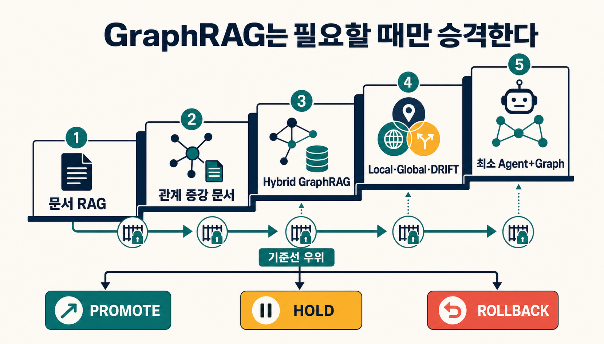
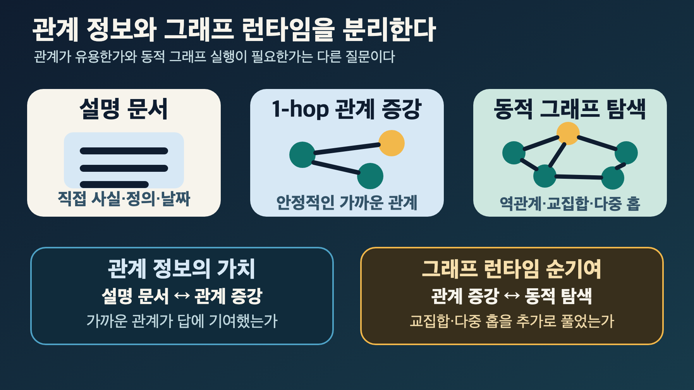
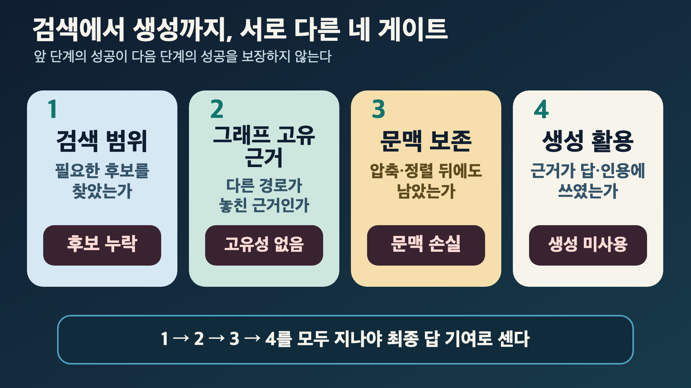
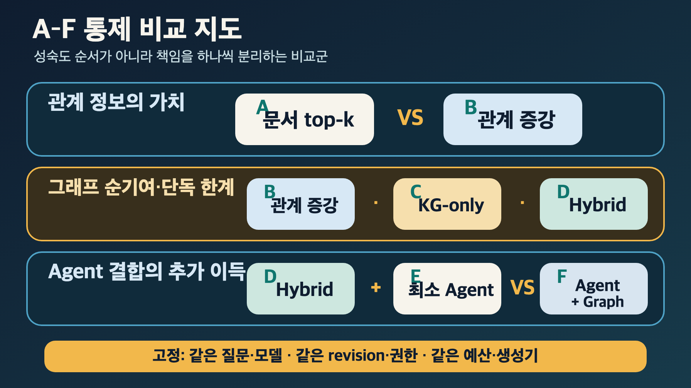

> [!summary] 핵심 결론
> 관계 정보가 필요하다고 해서 그래프 런타임까지 곧바로 필요한 것은 아닙니다. 설명 문서에 안정적인 1-hop 관계를 붙인 기준선부터 시작하고, 그래프만 찾을 수 있는 유효 근거가 최종 답과 인용에 실제로 기여하며 추가 비용까지 정당화할 때만 다음 단계로 승격해야 합니다.

고객 지원 검색에서 특정 노트북에 맞는 배터리를 찾는 상황을 떠올려 보겠습니다. 제품 설명에는 모델명과 사양이 있고, 별도 표에는 `이 부품은 이 모델과 호환된다`는 관계가 정리돼 있습니다. 이런 질문은 관계 표를 설명 문서에 함께 넣어 검색하는 것만으로도 풀릴 수 있습니다. 그래프 데이터베이스를 운영하지 않아도 관계 정보의 도움을 받을 수 있다는 뜻입니다.

질문이 `A와 B 두 모델에 모두 맞지만 C 규격은 쓰지 않는 부품`으로 바뀌면 얘기가 달라집니다. 여러 조건의 교집합을 계산해야 하기 때문입니다. 정책 변경의 영향을 두 단계 이상 거슬러 찾거나, 전체 문서에서 반복되는 위험 패턴을 묻는 질문도 마찬가지입니다. 이때는 관계의 방향과 경로, 전체 구조가 답을 뒷받침하는 근거가 됩니다.

두 질문 모두 관계를 다루지만 필요한 시스템은 같지 않습니다. 그런데 이를 곧바로 `GraphRAG가 필요한가`라는 찬반 문제로 바꾸면 관계 정보가 준 이득과 그래프 런타임이 준 이득이 뒤섞입니다. GraphRAG는 단일 검색기가 아니라 그래프 구축, 엔티티 연결, 경로 탐색, 커뮤니티 요약, 문맥 직렬화와 생성까지 아우르는 방법군이기 때문입니다.

이 글의 질문은 더 구체적입니다. **어떤 질문에서 그래프 경로가 바로 아래의 단순한 방법보다 실제로 나은가?** 이를 확인하려고 GraphRAG를 고급 RAG의 기본값으로 두지 않고, 더 얇은 기준선을 이길 때만 다음 단계로 올라가는 **단계적 도입 게이트**로 다룹니다. 이 구조는 연구 결과를 그대로 제품 규칙으로 옮긴 표준이 아닙니다. 기존 [[notes/ontology-context-compiler-opencrab|9번 문맥 컴파일러]], [[notes/context-compilation-regression|16번 문맥 컴파일 회귀]], [[notes/generation-faithfulness-regression|19번 생성 충실도]]의 경계를 하나의 아키텍처 선택 실험으로 연결한 프로젝트 제안입니다.

## `GraphRAG가 필요한가`라는 질문은 너무 큽니다

RAG는 질문에 필요한 외부 근거를 찾아 모델의 작업 문맥에 넣는 실행 방식입니다. 검색기는 vector DB일 수도 있지만 BM25, SQL, API, 웹 검색이나 graph query일 수도 있습니다. 핵심 책임은 `이번 질문에 어떤 근거를 어떤 순서와 형식으로 공급할 것인가`입니다.

GraphRAG는 entity, relation, path, community와 같은 그래프 구조를 검색·확장·요약·문맥 조립에 이용하는 RAG 방법군입니다. Microsoft GraphRAG만 보더라도 비교용 Basic search, 특정 entity 주변의 graph와 원문을 조립하는 Local search, community report를 map-reduce하는 Global search, community 정보에서 세부 후속 질문으로 좁혀 가는 DRIFT를 별도 경로로 구분합니다.[src_004](#src-004) 이 경로들은 목적과 비용이 다르므로 하나의 `GraphRAG 점수`로 합치면 어떤 연산이 실제로 기여했는지 알기 어렵습니다.

온톨로지는 또 다른 책임을 가집니다. 온톨로지는 공통 entity와 relation의 의미, 제약, provenance, revision과 승격 규칙을 공유하는 의미 계약입니다. GraphRAG가 검색·문맥 조립 방식이라면 온톨로지는 여러 검색기와 에이전트가 같은 의미를 사용하도록 만드는 지식 권위 계층에 가깝습니다.

```text
RAG
  질문별 근거 공급 방식

GraphRAG
  관계 구조를 사용하는 검색·문맥 조립 방식

온톨로지
  조직이 공유할 의미·제약·근거·승격 계약
```

따라서 선택은 `RAG 또는 GraphRAG 또는 온톨로지`의 세대 교체가 아닙니다. 대부분의 질문은 얇고 검증된 RAG로 처리하고, 관계 구조가 답의 의무일 때만 graph 경로를 켜며, 여러 서비스가 의미·정책·변경 영향을 공유해야 할 때 별도의 온톨로지 계층을 둬야 합니다.

이 책임을 나누고 나면 비교 대상도 선명해집니다. 먼저 관계를 문서에 펼친 방법으로 충분한지 확인하고, 그 방법이 놓치는 구조적 근거가 있을 때 그래프 런타임을 검토해야 합니다.

## 관계 정보와 그래프 런타임을 분리합니다

GraphRAG를 비교할 때 자주 빠지는 기준선이 있습니다. 엔티티 설명에 안정적인 1-hop 관계를 미리 합친 **관계 증강 문서 RAG**입니다.

`Is GraphRAG Needed?`는 반구조화 정밀의학 지식베이스에서 일반 RAG, GraphRAG, Modular RAG와 Agentic RAG를 아홉 시나리오로 비교했습니다. 저자 보고 결과에서 엔티티 설명에 relation type별 1-hop 관계를 합친 시나리오는 `Hit@1 0.6972`, `MRR 0.7531`을 기록했고, 사전 KG만 사용하거나 vector 검색과 KG를 결합한 여러 조건이 이 기준선을 일관되게 넘지는 못했습니다.[src_001](#src-001)

이 결과를 `GraphRAG는 필요 없다`로 읽으면 안 됩니다. STaRK-Prime 단일 데이터셋, Claude 3.7 Sonnet 단일 중심 설정과 저자 구현에 한정된 결과이며, 평가는 자연어 답 전체보다 entity retrieval 지표에 가깝습니다. 안전하게 가져올 수 있는 결론은 더 좁습니다.

```text
관계 정보가 필요함
≠
graph DB·traversal·serialization 전체가 항상 필요함
```

안정적인 관계를 문서에 펼칠 수 있다면, 이 기준선을 먼저 비교해야 합니다. 그래야 관계 데이터를 제공해서 생긴 이득과 graph runtime이 동적으로 경로를 계산해서 생긴 이득을 나눌 수 있습니다.

앞서 든 배터리 호환 사례에서 단일 모델과 부품의 관계는 이 기준선으로 처리할 수 있습니다. 반면 두 모델의 공통 부품을 찾고 특정 규격을 제외해야 한다면, 문서에 미리 펼쳐 둔 관계만으로는 질문마다 필요한 교집합을 만들기 어려울 수 있습니다. 그래프의 가치는 이 차이에서 시작합니다.



관계 증강 문서도 공짜는 아닙니다. 관계를 만들고 검증하고 문서 revision과 함께 갱신해야 합니다. 관계가 자주 바뀌거나, 질문마다 다른 방향과 깊이로 탐색해야 하거나, 문서에 관계를 펼치면서 중복과 폭증이 생긴다면 graph query의 동적 가치가 커집니다. 중요한 것은 이 비용까지 같은 비교표에 넣는 것입니다.

## 질문을 구조적 의무에 따라 나눕니다

질문의 길이나 전문 용어 수만 보고 graph 경로를 고르면 실패하기 쉽습니다. 짧은 질문도 역관계와 교집합을 요구할 수 있고, 긴 질문도 한 문서의 직접 인용으로 답할 수 있습니다. 먼저 답을 만들기 위해 어떤 **구조적 증명**이 필요한지 분류해야 합니다.

| 질문 유형               | 우선 기준선             | graph를 검토할 신호                   |
| ----------------------- | ----------------------- | ------------------------------------- |
| 직접 사실·정의·날짜·ID  | 설명 문서 RAG           | 필요한 근거가 한두 문서에 없음        |
| 안정적인 1-hop 관계     | 관계 증강 문서 RAG      | 역관계·교집합·동적 관계 계산 필요     |
| 다중 홉·경로·변경 영향  | Hybrid GraphRAG         | 경로 자체가 답과 설명의 일부          |
| 전체 corpus의 주제·패턴 | community·Global 경로   | vector top-k로 전체를 대표하기 어려움 |
| 모호한 질문의 반복 정제 | 최소 도구 agent         | 재검색이 고유 근거를 실제로 추가함    |
| 근거 부족·상충          | 가장 얇은 경로부터 확장 | 모든 대안이 닫히면 보류               |

GraphRAG-Bench와 관련 분석은 단순 사실 검색만으로 graph의 가치를 평가하면 다중 홉, 복합 추론, 맥락 요약과 생성에서의 차이를 놓칠 수 있다고 지적합니다.[src_002](#src-002)[src_003](#src-003) 반대로 graph 친화적으로 만든 benchmark의 질문 분포가 실제 운영 질문 분포와 같다고 가정해서도 안 됩니다. 실제 트래픽을 질문 유형별로 나누고 각 유형의 비중을 반영해야 합니다.

모든 질문에 graph를 고정 적용하는 대신 질문 복잡도에 따라 dense RAG, GraphRAG와 fusion을 선택하는 adaptive 접근도 연구되고 있습니다.[src_005](#src-005) 다만 특정 complexity scorer를 보편 규칙으로 승격할 수는 없습니다. router가 graph가 필요한 질문을 단순 질문으로 잘못 보내는 비율, fallback이 회복하는 비율과 잘못된 확정 답을 함께 측정해야 합니다.

경로를 알맞게 골랐다고 도입 판단이 끝나는 것은 아닙니다. 검색기가 구조적으로 필요한 근거를 찾아도, 그 근거가 최종 답에 쓰이지 않으면 독자가 얻는 것은 달라지지 않습니다.

## 더 많이 찾았다고 더 잘 답한 것은 아닙니다

GraphRAG의 도입 판단에서 가장 중요한 함정은 검색량과 답 품질을 같은 것으로 보는 것입니다. graph가 더 많은 entity와 path를 회수해도 모델이 그 근거를 최종 답에 사용하지 못하면 운영 이득은 아닙니다.

`Is GraphRAG Needed?`의 저자 보고 분석에서는 한 조건의 ground-truth entity retrieval coverage가 `83.5%`였지만 LLM answer extraction은 `47.9%`에 머물렀습니다. 추출된 entity는 놓친 entity보다 문맥 앞부분에 더 많이 놓였고, 검색 범위를 넓히면서 token을 더 사용한 조건이 최종 결과를 악화시키는 경우도 있었습니다.[src_001](#src-001) 이 수치는 해당 데이터셋과 모델의 관찰이며 다른 서비스의 예상 성능으로 사용할 수 없습니다.

이 간극을 다루려면 적어도 네 단계를 분리합니다.

```text
Retrieval coverage
  필요한 후보를 검색했는가

Graph-only unique contribution
  text 경로로는 못 찾고 graph만 찾은 유효 근거가 있는가

Context obligation retention
  그 근거가 압축·중복 제거·배열 뒤 최종 문맥에 남았는가

Generation utilization
  남은 근거가 답·인용·판단에 실제로 사용됐는가
```

`generation utilization`은 이 글에서 사용하는 프로젝트 운영 지표입니다. 확립된 학술 표준이 아닙니다. 최종 Context Bundle에 포함된 유효 근거 가운데 답, 인용 또는 판단에 추적 가능하게 사용된 근거의 비율로 관찰할 수 있습니다.



이 분리는 [[notes/context-compilation-regression|16번 글]]의 `검색 후보에 존재함 ≠ 최종 문맥에 보존됨`과 [[notes/generation-faithfulness-regression|19번 글]]의 `최종 문맥에 존재함 ≠ 모델이 안정적으로 이용함`을 GraphRAG 도입 판단으로 되돌립니다. 검색 recall 상승만 보고 graph를 채택하면 selection, serialization, ordering 또는 generation 실패를 graph의 성과로 잘못 계산할 수 있습니다.

따라서 그래프 검색의 성과를 판단하려면 검색기 바깥까지 봐야 합니다. 그래프가 찾은 근거가 중복 제거와 배열을 거쳐 살아남았는지, 답과 인용에 실제로 쓰였는지 확인해야 비로소 런타임의 순기여를 계산할 수 있습니다.

## 그래프를 더 찾기 전에 문맥을 먼저 정리합니다

GraphRAG는 graph traversal 자체보다 결과를 어떤 문맥으로 만드는지에 크게 영향을 받습니다. 같은 엔티티 쌍의 여러 relation을 반복해서 넣거나, 여러 경로가 같은 원문을 가리키거나, community report와 raw chunk가 같은 내용을 중복하면 token budget이 빠르게 소진됩니다.

먼저 적용할 수 있는 최적화는 다음과 같습니다.

1. 같은 엔티티 쌍의 여러 관계를 그룹화합니다.
2. 문서·chunk·entity·relation을 content hash와 canonical ID로 중복 제거합니다.
3. path, raw source와 community report를 답변 의무별로 묶습니다.
4. graph-only 고유 근거가 없는 결과는 최종 Bundle에서 제외합니다.
5. 중요한 근거를 앞에 두되, 순서 변화에 따른 회귀를 별도로 검사합니다.
6. Local·Global·DRIFT를 같은 평균 점수로 합치지 않습니다.

앞선 논문의 일부 조건에서는 이런 context optimization으로 token 사용이 19~53% 줄었다고 보고됐습니다.[src_001](#src-001) 그러나 token 감소가 모든 조건에서 답 품질 향상을 보장한 것은 아닙니다. 중복 제거가 caveat나 반례를 함께 지우지 않았는지, 중요한 관계의 방향과 provenance가 남았는지를 다시 검사해야 합니다.

문맥을 정리한 뒤에도 그래프만 제공하는 유효 근거가 남는다면, 그때부터 도입 단계를 비교할 이유가 생깁니다. 비교는 가장 단순한 방법과 한 번만 하는 것이 아니라, 복잡성을 한 단계씩 더하며 바로 아래 기준선을 이겼는지 확인해야 합니다.

## 바로 아래 기준선을 이길 때만 승격합니다

GraphRAG Adoption Gate는 다음과 같은 승격 사다리입니다.

| 단계 | 경로                           | 다음 단계로 올라갈 신호                  | 중단·롤백 신호                              |
| ---: | ------------------------------ | ---------------------------------------- | ------------------------------------------- |
|    1 | 설명 문서 RAG                  | 관계 누락이 반복됨                       | 직접 사실과 얕은 검색에 충분함              |
|    2 | 관계 증강 문서 RAG             | 역관계·교집합·동적 다중 홉 필요          | graph와 동등한 품질을 더 낮은 비용으로 제공 |
|    3 | Hybrid GraphRAG                | graph-only 근거가 최종 답에 기여         | 중복·잡음·stale relation만 증가             |
|    4 | 질문 유형별 Local·Global·DRIFT | 유형별 고유 이득이 반복됨                | 잘못된 경로 선택과 과도한 비용              |
|    5 | 최소 Agent+Graph               | 반복 정제가 다른 경로에 없는 근거를 회수 | tool history·변동성·문맥 팽창이 이득 초과   |

각 단계는 가장 단순한 1단계와만 비교하는 것이 아니라 **바로 아래 단계**와 비교해야 합니다. Hybrid GraphRAG가 기본 문서 RAG를 이겼더라도 관계 증강 문서 RAG와 차이가 없다면 graph runtime의 순기여는 입증되지 않은 것입니다.

비교할 때는 다음 조건을 고정합니다.

- 동일한 question set과 answer obligation
- 동일한 model, prompt family와 temperature
- 동일한 document, index와 graph revision
- 동일한 principal, tenant, authorization scope
- 동일한 최대 token과 latency budget
- 동일한 final generator와 가능한 경우 동일 reranker

권한과 revision을 고정해야 하는 이유는 [[notes/authorization-aware-rag-graph-boundary|17번 글]]과 [[notes/long-running-task-authorization-lease|20번 글]]에서 다룬 경계와 같습니다. graph path 하나가 여러 문서와 파생 요약을 연결하면 검색 범위뿐 아니라 권한, lineage와 stale 상태의 실패 표면도 넓어집니다. 품질 이득이 없는데 이 비용만 늘어난다면 채택 중단 신호입니다.

이 승격 사다리가 말로만 그럴듯한 규칙에 머물지 않으려면, 각 책임을 따로 추가하는 통제 비교가 필요합니다.

## A부터 F까지 통제 비교를 설계합니다

DuckCrab·OpenCrab에 적용할 수 있는 첫 비교는 거대한 production benchmark가 아니라 책임을 하나씩 추가하는 A~F 조건입니다.

| 조건 | 전달 구조                                 | 묻는 질문                                           |
| ---- | ----------------------------------------- | --------------------------------------------------- |
| A    | 설명 원문 top-k                           | 일반 RAG 기준선은 어디까지 해결하는가               |
| B    | 설명 + 1-hop 관계 증강 문서               | graph runtime 없이 관계 정보가 주는 가치는 무엇인가 |
| C    | 사전 KG만                                 | graph-only 경로의 고유 답과 한계는 무엇인가         |
| D    | vector + typed graph bundle               | hybrid graph의 순증가는 무엇인가                    |
| E    | 최소 문서 retriever agent                 | 동적 query refinement 자체의 가치는 무엇인가        |
| F    | 최소 agent + graph + context optimization | graph와 agent를 결합한 추가 이득이 비용을 넘는가    |

이번 비공개 연구 번들에서는 직접 사실, 안정적인 1-hop, 다중 홉, 집합 교집합, 전체 corpus 주제와 반복 정제라는 여섯 합성 질문을 예상 경로에 배치하고 여섯 route와 여섯 계약 assertion을 통과시켰습니다. 이것은 작성한 분기표에 빠진 경우가 없는지 확인한 **구조적 스모크 테스트**일 뿐, DuckCrab·OpenCrab·Microsoft GraphRAG의 정확도, 비용, 지연이나 production readiness를 증명하지 않습니다.



실제 비교에서는 평균 정답률 하나로 끝내지 않습니다.

- retrieval coverage와 graph-only unique evidence
- answer obligation retention과 evidence lineage
- generation utilization과 최종 answer correctness
- citation precision, faithfulness와 abstention
- token, latency, tool call과 context overflow
- stale relation, graph revision과 권한 회귀
- 구축, 수정, 재색인과 감사에 드는 운영 시간

결과는 `promote`, `hold`, `rollback`으로 기록합니다. graph가 더 많은 후보를 가져왔지만 최종 답 기여가 없으면 `hold`, 단순 기준선보다 오류와 비용을 늘리면 `rollback`, 고유 근거와 답 기여가 반복해서 확인될 때만 `promote`입니다.

```yaml
graphrag_adoption_receipt:
  question_set_revision: qset-v1
  document_revision: docs-v12
  graph_revision: graph-v8
  authorization_scope: tenant-a-read
  model: pinned-model
  prompt_family: context-compiler-v3
  baseline: relation_enriched_document_rag
  candidate: hybrid_graphrag
  graph_unique_evidence: []
  generation_utilization: null
  citation_precision: null
  p95_latency_ms: null
  decision: hold
```

이 receipt도 표준 스키마가 아니라 같은 조건을 다시 만들고 롤백 근거를 남기기 위한 프로젝트 제안입니다. 실제로 측정하지 않은 값은 `null`로 남겨야 합니다.

여기까지의 판정은 GraphRAG를 도입할 가치가 있는지를 다룹니다. 도입한 시스템이 질문마다 어디서 검색을 시작하고, 경로를 언제 바꾸며, 어느 시점에 멈출지는 그다음 문제입니다.

## 도입한 뒤의 라우팅과 중단은 별도 문제입니다

GraphRAG를 도입할 가치가 있다는 판단과, 도입한 GraphRAG를 질문마다 어떻게 실행할지는 같은 문제가 아닙니다. 후속 비공개 연구는 다음 세 결정을 분리합니다.

```text
initial route selection
≠ next retrieval action
≠ terminal decision

local neighborhood stall
≠ global search exhaustion
```

처음 text로 시작했다가 entity 후보를 찾은 뒤 graph neighborhood를 열고, 관계가 끊기면 다른 anchor나 원문 검색으로 돌아가는 과정은 실패가 아니라 정상적인 증거 획득일 수 있습니다. 반대로 한 neighborhood에서 새 근거가 나오지 않는다고 전체 검색 공간이 소진된 것은 아닙니다.

다만 이 중첩 controller, re-anchor, evidence-aware stopping과 route contribution receipt는 아직 프로젝트 설계 제안입니다. 후속 비공개 연구는 반증 검토와 근거 감사를 마쳤지만, 실제 vector·FTS·graph·RRF가 모두 활성화된 동일 조건 비교는 수행하지 않았습니다. 따라서 이 글에서는 `GraphRAG를 도입한 뒤에도 경로 선택과 중단을 별도로 검증해야 한다`는 경계만 가져오고, 세부 실행 계약은 후속편으로 남깁니다.

## 그래프의 가치는 고유 근거로 증명해야 합니다

GraphRAG 도입에서 먼저 풀어야 할 문제는 같은 관계 정보를 더 단순한 문서 검색으로 제공할 수 있는지입니다. 관계 증강 문서로도 답할 수 있는데 그래프 구축과 탐색, 문맥 직렬화, 권한·revision 관리까지 추가하면 운영 복잡성만 커질 수 있습니다. 반대로 다중 홉, 역관계, 집합 교집합이나 전체 corpus의 패턴처럼 문서 top-k가 구조적으로 놓치는 질문에서는 그래프가 다른 경로로 찾기 어려운 근거를 제공할 수 있습니다.

그래서 도입은 질문의 구조적 의무에서 시작해야 합니다. 직접 사실은 설명 문서 RAG로, 안정적인 1-hop 관계는 관계 증강 문서 RAG로 먼저 풀어 봅니다. 이 기준선이 역관계나 동적 경로를 만들지 못하고, 그래프만 찾은 유효 근거가 반복해서 확인될 때 Hybrid GraphRAG와 질문 유형별 graph 경로를 검토합니다. 반복 검색이 실제로 새로운 근거를 더할 때에만 Agent+Graph까지 올라갑니다.

검색량은 출발점일 뿐입니다. 그래프가 찾은 근거가 최종 Context Bundle에 남았는지, 답과 인용에 실제로 사용됐는지, 바로 아래 단계보다 정확성과 설명력을 높였는지를 따로 측정해야 합니다. 여기에 token과 지연, 구축·갱신 비용, 권한 범위, 문서와 graph revision까지 같은 비교표에 넣어야 `promote`, `hold`, `rollback`을 재현할 수 있습니다.

실무 적용 순서는 다음과 같이 정리할 수 있습니다.

```text
질문의 구조적 의무를 분류한다
→ 가장 얇은 문서 기준선으로 시작한다
→ 안정적인 관계는 relation-enriched document로 비교한다
→ graph-only 고유 근거가 반복되는 질문에만 graph 경로를 연다
→ 검색된 근거가 최종 문맥과 답에 남았는지 따로 측정한다
→ 품질·비용·권한·revision을 함께 보고 승격·보류·롤백한다
```

이 과정을 거치면 `그래프가 더 발전된 기술인가`라는 추상적인 논쟁을 `어떤 질문에서 어떤 경로가 바로 아래 기준선을 실제로 이겼는가`라는 검증 가능한 결정으로 바꿀 수 있습니다. GraphRAG의 가치는 그래프를 많이 검색했다는 사실이 아니라, **다른 경로가 놓친 구조적 근거를 찾아 최종 답에 쓰이게 하고 그 추가 비용을 설명할 수 있을 때** 증명됩니다.

이 글은 GraphRAG를 도입한 뒤의 세부 라우팅과 중단 규칙까지 확정하지 않습니다. 초기 경로 선택, 다음 검색 행동과 종료 판단은 별도의 통제 실험이 필요합니다. 지금 확보한 근거로 내릴 수 있는 결론은 분명합니다. 그래프는 관계가 있다는 이유만으로 켜는 기능이 아니라, 더 단순한 기준선이 놓친 근거를 최종 답으로 연결하고 그 비용과 위험까지 감당할 수 있을 때 선택하는 경로입니다.

> [!important] 현재 검증 범위
> 주 연구 번들은 출처 13개와 핵심 주장 8개의 근거 감사를 통과했지만 독립 리뷰어가 없어 반증 상태는 `passed_degraded`입니다. A~F 실제 통합 benchmark, 한국어 사내 문서 평가, 권한·revision 회귀와 사람 평가는 수행하지 않았습니다. 본문의 Adoption Gate, graph unique contribution, generation utilization과 receipt는 구현 완료 사실이나 보편 표준이 아니라 검증할 설계안입니다.

## 출처

- <a id="src-001"></a> Chen, L. et al. (2026). [Is GraphRAG Needed? From Basic RAG to Graph-/Agentic Solutions with Context Optimization](https://arxiv.org/abs/2606.25656). arXiv:2606.25656.
- <a id="src-002"></a> Xiang, Z. et al. (2025). [When to use Graphs in RAG: A Comprehensive Analysis for Graph Retrieval-Augmented Generation](https://arxiv.org/abs/2506.05690). arXiv:2506.05690.
- <a id="src-003"></a> Xiao, Y. et al. (2025). [GraphRAG-Bench: Challenging Domain-Specific Reasoning for Evaluating Graph Retrieval-Augmented Generation](https://arxiv.org/abs/2506.02404). arXiv:2506.02404.
- <a id="src-004"></a> Microsoft. (2026). [GraphRAG Query Engine Overview](https://github.com/microsoft/graphrag/blob/main/docs/query/overview.md). 확인일 2026-07-29.
- <a id="src-005"></a> Dong, S. et al. (2026). [Use Graph When It Needs: Efficiently and Adaptively Integrating Retrieval-Augmented Generation with Graphs](https://arxiv.org/abs/2602.03578). arXiv:2602.03578.
- <a id="src-006"></a> Microsoft. (2026). [GraphRAG Global Search](https://github.com/microsoft/graphrag/blob/main/docs/query/global_search.md). 확인일 2026-07-29.
- <a id="src-007"></a> Microsoft. (2026). [microsoft/graphrag](https://github.com/microsoft/graphrag). 공식 저장소, 확인일 2026-07-29.
- <a id="src-008"></a> GraphRAG-Bench authors. (2025–2026). [GraphRAG-Benchmark](https://github.com/GraphRAG-Bench/GraphRAG-Benchmark). 연구 저장소, 확인일 2026-07-29.
