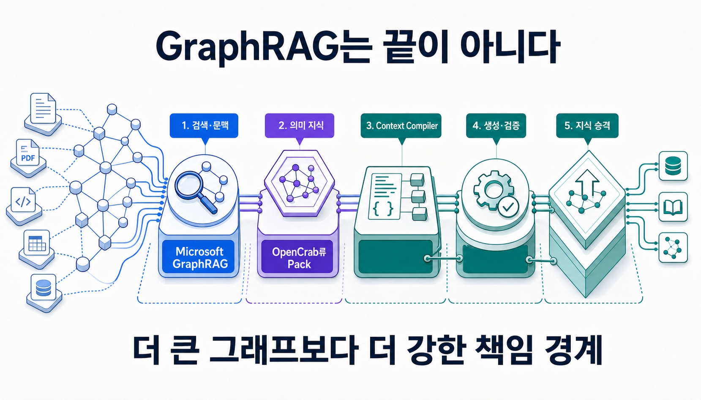
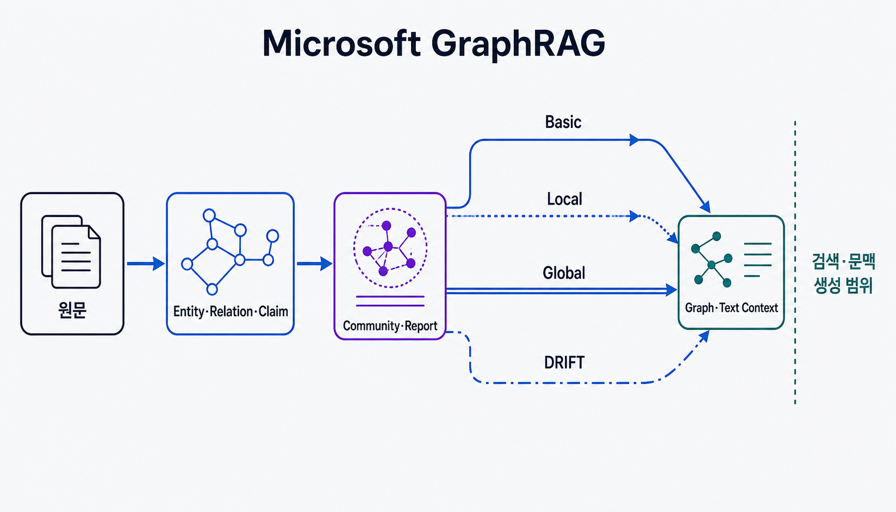
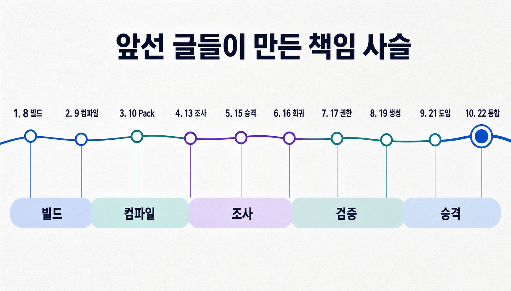
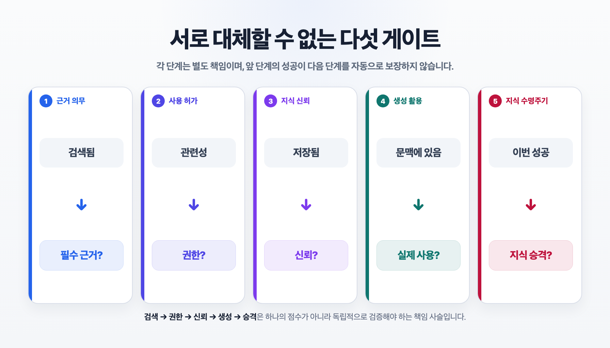
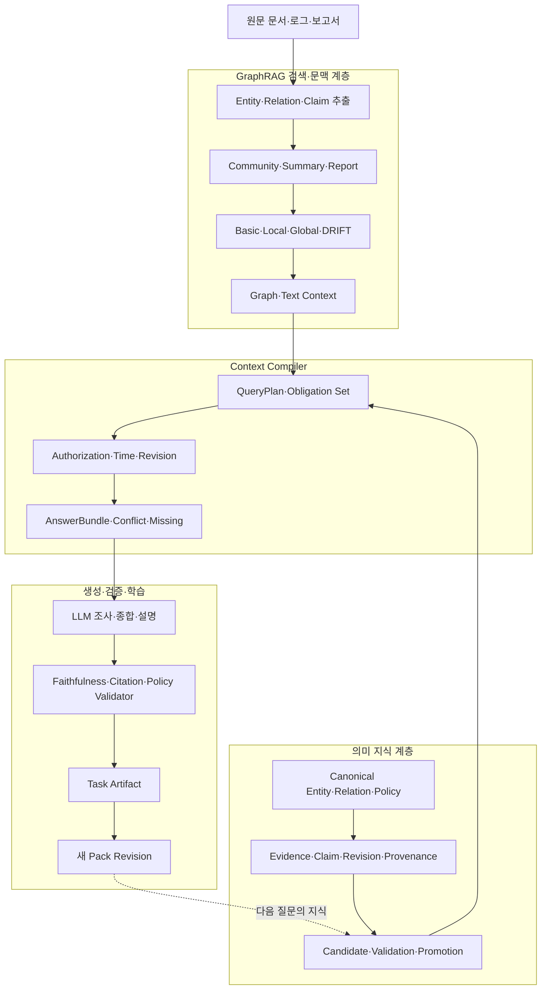

> [!summary] 핵심 결론
> Microsoft GraphRAG는 문서의 관계 구조를 이용해 더 좋은 검색 문맥을 만드는 중요한 기반입니다. 그러나 **관련 근거를 찾는 일, 답에 반드시 필요한 근거를 구성하는 일, 그 근거를 사용할 권한을 확인하는 일, 모델이 실제로 이용했는지 검증하는 일, 결과를 장기 지식으로 승격하는 일은 서로 다른 책임**입니다. 이 글에서 Context Compiler는 그 책임들을 질문별 작업공간으로 잇기 위한 프로젝트 개념입니다.

**GraphRAG 이후에는 무엇이 필요한가?**

**GraphRAG는 끝이 아니다.**

**왜 우리는 Context Compiler를 만들었는가.**

이 세 문장은 사실 하나의 질문을 서로 다른 방향에서 바라본 것입니다.

첫 번째 문장은 기술의 범위를 묻습니다. GraphRAG는 기존 RAG가 놓치던 관계와 문서 집합 전체의 구조를 복원했지만, 지식 시스템이 해결해야 할 모든 문제를 끝낸 것은 아닙니다.

두 번째 문장은 아키텍처를 묻습니다. 문서 사이의 관계를 찾아 더 풍부한 문맥을 만들었다면, 그다음에는 무엇을 확인해야 할까요.

세 번째 문장은 이 블로그가 1번부터 21번까지 쌓아 온 답을 되짚습니다. 우리는 더 많은 자료를 검색하는 데서 멈추지 않고, 질문에 필요한 근거와 반례, 정책과 권한, 버전과 미지를 하나의 작업공간으로 조립하려 했습니다. 그래서 **Context Compiler**라는 이름에 도달했습니다.

Microsoft GraphRAG와 OpenCrab을 나란히 놓는 일은 중요합니다. 다만 비교를 `어느 제품이 더 발전했는가`라는 기능표로 만들면 양쪽을 모두 오해하게 됩니다. 더 좋은 질문은 다음과 같습니다.

> **Microsoft GraphRAG는 지식 시스템의 책임 사슬에서 어디까지 해결하며, 앞선 글에서 다룬 OpenCrab류 온톨로지와 Context Compiler는 어디부터 다른 책임을 맡으려 하는가?**

## GraphRAG가 해결한 문제를 먼저 정확히 인정합니다

GraphRAG를 단순히 `벡터 DB 대신 그래프 DB를 사용하는 RAG`로 설명하면 핵심을 놓칩니다.

Microsoft GraphRAG의 공식 인덱싱 파이프라인은 비정형 원문에서 entity, relationship과 claim을 추출하고, entity community를 탐지하며, 여러 세분도의 community report와 summary를 생성합니다. 원문과 구조화 결과는 벡터 표현과 함께 질의에 사용됩니다.[src_001](#src-001)

질의 경로도 하나가 아닙니다. 공식 문서는 Query Engine을 완성된 index 위에서 동작하는 retrieval module로 설명하며 다음 경로를 구분합니다.[src_002](#src-002)

- **Basic Search:** 일반 vector RAG와 비교하기 위한 얇은 기준선
- **Local Search:** 특정 entity 주변의 graph 정보와 원문 chunk를 조립하는 경로
- **Global Search:** 전체 corpus의 community report를 map-reduce해 전역 질문에 답하는 경로
- **DRIFT Search:** community에서 넓게 시작해 후속 질문과 Local Search로 세부 근거를 좁혀 가는 경로

원 논문이 겨냥한 문제도 분명합니다. 기존 RAG는 질문과 직접 비슷한 문서 조각을 찾는 데는 강하지만, `이 자료 전체의 주요 주제는 무엇인가`처럼 corpus 전체를 이해해야 하는 질문에는 약합니다. GraphRAG는 entity graph와 community summary를 미리 구성해 이러한 global sensemaking 질문을 다루려 했습니다.[src_003](#src-003)

DRIFT는 여기서 다시 한 걸음 나아갑니다. 전역 community 정보로 첫 답과 후속 질문을 만든 뒤 Local Search를 반복해, 넓은 개요와 세부 탐색을 연결합니다.[src_004](#src-004)

따라서 GraphRAG를 `결국 검색일 뿐`이라고 낮춰 말해서는 안 됩니다. Microsoft GraphRAG는 **그래프 기반 인덱싱, 질의 라우팅과 문맥 생성 시스템**입니다. 공식 방법론 문서도 이 프로젝트를 언어모델에 적절한 context window content를 만드는 RAG indexing 연구 플랫폼으로 설명합니다.[src_005](#src-005)



여기까지가 GraphRAG의 약점이라는 뜻은 아닙니다. 오히려 해결하려는 문제의 경계가 명확하다는 뜻입니다.

좋은 문맥을 만드는 일과 좋은 판단을 보장하는 일은 다릅니다. 이 차이를 인정해야 GraphRAG 위에 무엇을 더 만들어야 하는지도 보입니다.

## 제품 대 제품 비교가 아니라 책임 대 책임으로 봐야 합니다

`Microsoft GraphRAG와 OpenCrab 중 무엇이 더 좋은가`라는 질문은 자연스럽지만 정확하지 않습니다. 두 시스템이 중심에 두는 산출물이 다르기 때문입니다.

Microsoft GraphRAG의 중심 산출물은 graph index, community report와 질문별 context입니다. 반면 [[notes/opencrab-ontology-build-architecture|8번 글]]에서 분석한 OpenCrab의 설계는 9-Space 의미 렌즈, Evidence와 Claim, Policy·Outcome·Lever, identity·promotion과 Pack 배포를 하나의 지식 제품 수명주기로 연결하려 합니다.

8번 글에서는 OpenCrab을 전통적인 RDF·OWL 편집기보다 **문서와 로그를 의미 구조로 해석하고, 후보 지식을 검사하며, 설치 가능한 Pack으로 내보내려는 온톨로지 공장**에 가깝다고 평가했습니다. 동시에 현재 구현은 렌즈·도메인 타입·저장 문법의 결합과 우회 가능한 검토·승격 경계가 남아 있으므로, 완성된 온톨로지 컴파일러보다 문법 검사가 붙은 동적 지식그래프 빌더에 가깝다고 범위를 제한했습니다.

[[notes/ontology-context-compiler-opencrab|9번 글]]에서는 이 경계를 더 좁혔습니다. OpenCrab의 vector·BM25·graph hybrid retrieval과 Pack은 좋은 기반이지만, 질문을 필요한 의미 역할과 수용 조건으로 바꾸고 Evidence·Claim·Policy·Conflict·Missing을 검증 가능한 AnswerBundle로 묶는 단계는 아직 목표 구조에 가깝습니다. 그래서 현행 기반을 완성된 Context Compiler가 아니라 **온톨로지 유도 Hybrid Retriever와 지식 Pack 공장**으로 위치시켰습니다.

이 차이를 표로 줄이면 다음과 같습니다.

| 계층                   | 중심 질문                                                  | 대표 산출물                                                     |
| ---------------------- | ---------------------------------------------------------- | --------------------------------------------------------------- |
| Microsoft GraphRAG     | 관계 구조를 이용해 어떤 문맥을 가져올 것인가               | graph index, community report, Local·Global·DRIFT context       |
| OpenCrab의 현행 기반   | 도메인 지식을 어떤 의미 렌즈와 Pack으로 보존·검색할 것인가 | 9-Space projection, Evidence·Claim, hybrid result, Pack         |
| Context Compiler 목표  | 이번 질문에 무엇이 반드시 있어야 답할 수 있는가            | QueryPlan, Obligation Set, AnswerBundle, Missing·Conflict       |
| 온톨로지 에이전트 목표 | 검증된 문맥으로 판단하고 무엇을 다시 지식으로 남길 것인가  | Investigation State, Validation Receipt, promoted Pack revision |

OpenCrab이 GraphRAG보다 `위`에 있다는 순위표가 아닙니다. Microsoft GraphRAG를 OpenCrab이 대체한다는 뜻도 아닙니다.

GraphRAG는 OpenCrab류 시스템이 사용할 수 있는 강력한 retrieval provider가 될 수 있습니다. 반대로 OpenCrab류 온톨로지는 GraphRAG의 결과에 의미, 근거 상태, 정책과 승격 수명주기를 제공할 수 있습니다.

## 앞선 글들은 하나의 책임 사슬을 만들고 있었습니다

지금까지의 연재는 각각 독립된 주제를 다루는 것처럼 보였습니다. GraphRAG를 기준점으로 다시 배열하면 하나의 아키텍처가 드러납니다.

| 앞선 글                                        | 당시의 질문                 | 이번 글에서 다시 보는 역할                         |
| ---------------------------------------------- | --------------------------- | -------------------------------------------------- | --------------------------- |
| [[notes/opencrab-ontology-build-architecture   | 8번 OpenCrab 빌드]]         | 어떤 지식 제품을 만드는가                          | Build Plane                 |
| [[notes/ontology-context-compiler-opencrab     | 9번 Context Compiler]]      | 질문에 어떤 구조로 지식을 공급하는가               | Compile Plane               |
| [[notes/ontology-expertise-pack                | 10번 Expertise Pack]]       | 전문가의 세계·근거·결정·실패를 어떻게 외부화하는가 | Knowledge Plane             |
| [[notes/ontology-senior-investigation-harness  | 13번 조사 하네스]]          | Pack·계획·반증·검증을 어떻게 잇는가                | Investigation Plane         |
| [[notes/knowledge-centric-self-improvement     | 15번 지식 중심 자기개선]]   | 작업 경험 중 무엇을 공유 지식으로 남기는가         | Promotion Plane             |
| [[notes/context-compilation-regression         | 16번 문맥 컴파일 회귀]]     | 정본 지식이 문맥 조립 중 훼손되지 않았는가         | Context Regression Plane    |
| [[notes/authorization-aware-rag-graph-boundary | 17번 권한 인식 RAG]]        | 관련 근거를 현재 principal이 사용할 수 있는가      | Authorization Plane         |
| [[notes/agent-memory-poisoning-promotion-gate  | 18번 메모리 승격]]          | 저장된 경험을 신뢰 가능한 지식으로 올려도 되는가   | Trust Plane                 |
| [[notes/generation-faithfulness-regression     | 19번 생성 충실도]]          | 모델이 주어진 근거를 실제로 사용했는가             | Generation Plane            |
| [[notes/long-running-task-authorization-lease  | 20번 장기 작업 권한]]       | 실행 중 권한이 바뀌면 어디서 다시 검사하는가       | Runtime Authorization Plane |
| [[notes/graphrag-adoption-gate                 | 21번 GraphRAG 도입 게이트]] | 어느 질문에서 graph 경로가 비용을 정당화하는가     | Retrieval Selection Plane   |



21번 글은 `언제 GraphRAG를 켤 것인가`를 다뤘습니다. 관계 증강 문서라는 강한 기준선을 두고, graph-only 유효 근거가 최종 답에 실제로 기여할 때만 Hybrid GraphRAG와 Agent+Graph로 승격하자고 제안했습니다.

이번 22번 글의 질문은 그다음입니다.

> **GraphRAG를 켜서 좋은 문맥을 만들었다면, 그 문맥이 판단과 장기 지식이 되기 전까지 어떤 책임이 더 필요한가?**

## 검색된 근거와 답에 필요한 근거는 다릅니다

GraphRAG의 Local Search는 관련 entity를 진입점으로 주변 관계, 원문 text unit과 community report를 조립합니다. Global Search는 community report를 전체적으로 종합하고, DRIFT는 전역 개요에서 후속 질문을 만들어 세부 탐색으로 내려갑니다.

이 경로들은 좋은 candidate context를 만듭니다. 그러나 `관련성이 높은 자료를 넣는다`와 `답변에 반드시 필요한 의무를 빠짐없이 넣는다`는 같은 계약이 아닙니다.

예를 들어 다음 질문을 가정해 보겠습니다.

> 배포 뒤 오래된 데이터가 노출되는 원인은 무엇이며, 지금 가장 안전한 다음 조치는 무엇인가?

GraphRAG는 `CacheTTL`, `InvalidationFailure`, `ReadReplicaLag`, 관련 배포 사건과 운영 보고서를 연결할 수 있습니다. 비슷한 장애 community를 찾고 반복되는 패턴도 요약할 수 있습니다.

하지만 안전한 판단에 필요한 것은 비슷한 자료의 목록보다 더 구체적입니다.

- 배포 전후의 정확한 시간 범위
- 캐시 경로와 비캐시 경로의 관측 차이
- 캐시 무효화 가설을 지지하거나 반박하는 Evidence
- 복제본 지연 가설을 구분할 Counterevidence
- 현재도 유효한 SLA와 변경 승인 Policy
- 사용 중인 설정과 정책의 revision
- 두 가설을 구분할 다음 검사
- 증거가 부족할 때 결론을 보류하는 조건

Context Compiler는 질문을 검색어로만 바꾸지 않습니다. 질문을 **답변이 만족해야 할 Obligation Set**으로 바꿉니다.

```text
질문
→ 필요한 Evidence와 Counterevidence
→ 비교할 Claim과 대안 가설
→ 확인할 Policy·Permission·Time·Revision
→ 표시할 Conflict와 Missing Evidence
→ 허용되는 답변 형식과 보류 조건
```

GraphRAG의 context builder가 검색된 graph·text 결과를 제한된 창에 맞추는 역할이라면, 이 글에서 Context Compiler는 한 단계 앞에서 **무엇이 있어야 답해도 되는가를 정의하고, 한 단계 뒤에서 그 의무가 보존됐는지 검사하는 계약**입니다.

이 명칭과 계약은 확립된 업계 표준이 아니라 앞선 글에서 발전시킨 프로젝트 개념입니다.

## 관련성·권한·신뢰·생성·승격은 서로 다른 축입니다

GraphRAG 이후를 이해하는 가장 빠른 방법은 다음 다섯 문장을 분리하는 것입니다.

```text
Retrieved ≠ Required
검색됨 ≠ 답에 반드시 필요함

Relevant ≠ Authorized
관련 있음 ≠ 현재 사용할 권한이 있음

Stored ≠ Trusted
저장됨 ≠ 검증된 지식임

Present ≠ Used
문맥에 있음 ≠ 모델이 실제로 사용함

Successful ≠ Promoted
이번에 성공함 ≠ 다음 작업의 정본 지식으로 승격해도 됨
```



### 관련성은 권한이 아닙니다

17번 글에서 다뤘듯이 graph가 허용된 seed에서 시작했다고 해서 주변 node와 edge까지 자동으로 허용되는 것은 아닙니다. 보호 문서에서 파생한 relationship, community report, summary와 answer artifact도 별도의 보호 대상이 될 수 있습니다.

검색 입구에서 ACL을 한 번 확인하는 것으로는 부족합니다. graph expansion, context compilation, generation, citation source 열기, tool execution과 결과 공개까지 현재 principal, tenant, purpose, resource와 action 조건을 다시 확인해야 합니다.

GraphRAG는 관련성을 찾습니다. 통행 허가를 내리는 책임은 별도의 authorization layer에 있습니다.

### 저장된 지식은 검증된 지식이 아닙니다

Microsoft GraphRAG의 인덱싱 파이프라인도 claim을 추출합니다. 그러므로 `GraphRAG에는 주장이 없고 OpenCrab에만 있다`고 비교하면 틀립니다.[src_001](#src-001)

차이는 claim 객체의 존재보다 **그 주장에 어떤 상태와 수명주기를 부여하는가**에 있습니다.

```text
원문 관찰
→ LLM이 만든 후보 Claim
→ 독립 Evidence와 반례 확인
→ 검토·검증
→ promoted 또는 rejected
→ superseded·rollback
```

18번 글이 강조했듯 외부 문서, 도구 결과와 에이전트 요약은 저장됐다는 이유만으로 장기 지식 권위를 얻어서는 안 됩니다. LLM이 만든 graph와 claim은 검색 후보로는 유용하지만, 검증 없이 ontology의 정본으로 쓰면 graph extraction 오류가 다음 세션의 행동 규칙으로 굳을 수 있습니다.

### 문맥에 있는 근거가 실제 답에 쓰인 것은 아닙니다

`Is GraphRAG Needed?`는 일반 RAG, GraphRAG, Modular RAG와 Agentic RAG를 아홉 시나리오로 비교하며 context optimization으로 token 사용을 19~53% 줄였다고 보고했습니다. 동시에 retrieval coverage가 늘어도 generation 결과가 비례해 좋아지지 않는 retrieval-generation gap을 관찰했습니다.[src_006](#src-006)

이 결과는 GraphRAG가 필요 없다는 증거가 아닙니다. STaRK-Prime 단일 데이터셋과 특정 중심 모델, entity retrieval 위주의 평가라는 범위가 있습니다. 안전하게 가져올 결론은 다음과 같습니다.

```text
Retrieval coverage
≠ Context obligation retention
≠ Generation utilization
≠ Final answer faithfulness
```

16번 글은 Pack에 있는 올바른 근거가 선택·압축·배열 과정에서 손실되는 문맥 컴파일 회귀를 다뤘습니다. 19번 글은 최종 Context Bundle을 고정해도 모델이 외부 근거를 무시하거나 충돌을 잘못 해소할 수 있음을 분리했습니다.

좋은 도서관이 좋은 판결문을 자동으로 쓰지는 않습니다. 좋은 Context도 좋은 Judgment를 자동으로 만들지는 않습니다.

### 성공한 답은 아직 공유 지식이 아닙니다

에이전트가 이번 질문에 좋은 답을 냈더라도, 그 결론을 다음 작업의 정본 지식으로 곧바로 넣어서는 안 됩니다.

15번 글의 지식 중심 자기개선은 모델의 숨은 메모리를 계속 키우는 대신, 작업 결과를 Task Artifact로 남기고 여러 작업의 성공·실패·반례를 비교한 뒤 검증된 후보만 새 Pack revision으로 승격하자고 제안했습니다.

```text
이번 작업에서 효과가 있었음
≠ 같은 조건에서 반복 검증됐음
≠ 조직의 표준 지식으로 사용해도 됨
```

GraphRAG 이후에 필요한 마지막 계층은 더 큰 graph가 아니라 **지식의 promotion과 rollback을 관리하는 거버넌스**입니다.

## 한 장의 구조로 보면 두 시스템의 위치가 보입니다

아래 탐색기는 제품의 절대적인 기능 경계를 선언하지 않습니다. 질문 유형과 실패 지점을 선택해, 어떤 책임 계층이 필요한지 살펴보는 설명 도구입니다. `Microsoft GraphRAG`, `OpenCrab 현행 기반`, `Context Compiler 목표`를 선택하면 각 구조의 주력 산출물과 아직 별도 계층이 필요한 지점이 표시됩니다.

<iframe
  id="graphrag-layer-explorer"
  class="interactive-visualization-frame"
  src="/attachments/graphrag-beyond-context-compiler/graphrag-layer-explorer.htm"
  title="GraphRAG 이후의 책임 계층 탐색기"
  loading="lazy"
  scrolling="no"
  sandbox="allow-scripts allow-same-origin"
  style="height:940px"
></iframe>

[책임 계층 탐색기를 새 화면에서 크게 열기](/attachments/graphrag-beyond-context-compiler/graphrag-layer-explorer.htm)

전체 아키텍처는 다음처럼 볼 수 있습니다.



GraphRAG는 이 구조에서 사라지지 않습니다. 오히려 중요한 기반으로 남습니다.

- 원문을 관계 구조로 변환합니다.
- 특정 entity 주변과 corpus 전체를 서로 다른 경로로 탐색합니다.
- vector top-k가 놓치는 graph-only Evidence를 공급합니다.
- 전역 개요에서 세부 후속 질문으로 내려가는 조사 출발점을 제공합니다.

온톨로지와 Pack은 그 결과에 canonical identity, relation 의미, Evidence·Claim 구분, provenance, revision과 promotion 상태를 더합니다.

Context Compiler는 이번 질문에 필요한 것만 선택하고, 빠진 의무와 충돌을 드러냅니다.

Validator는 모델이 권한 있는 근거를 왜곡 없이 사용했는지 검사합니다.

Promotion Gate는 이번 답의 경험 중 무엇을 다음 Pack에 남길지 결정합니다.

## OpenCrab은 GraphRAG의 경쟁자보다 의미 권위 계층에 가깝습니다

OpenCrab을 Microsoft GraphRAG의 대항마로 설명하면 두 시스템 모두를 좁게 보게 됩니다.

더 현실적인 결합은 다음과 같습니다.

```text
Microsoft GraphRAG
  Local·Global·DRIFT retrieval provider

OpenCrab류 Pack
  canonical entity·relation·Evidence·Claim·Policy·revision 저장

Context Compiler
  질문별 obligation과 허용 범위에 맞춘 AnswerBundle 조립

Investigation·Generation Layer
  가설·반례·답변·도구 실행

Validator·Promotion Gate
  충실도·권한·정책 검사와 새 Pack revision 결정
```

Microsoft GraphRAG는 검증할 가치가 높은 retrieval provider가 될 수 있습니다. 특정 entity 중심 질문에는 Local Search, corpus 전체 주제에는 Global Search, 넓은 개요에서 세부 탐색으로 내려가는 조사에는 DRIFT가 후보입니다.

OpenCrab류 온톨로지 계층은 그 결과에 다음 계약을 더할 수 있습니다.

- canonical entity ID와 도메인 type
- relation의 정확한 의미와 허용 범위
- Evidence와 Claim의 분리
- Policy·Outcome·Lever의 질문별 역할
- source·chunk·edge·claim lineage
- candidate·validated·promoted·rejected 상태
- Pack revision, approval와 rollback

다만 OpenCrab의 현행 구현을 이미 이 모든 책임이 닫힌 Ontology Runtime으로 표현해서는 안 됩니다. 앞선 분석대로 철학은 이 방향을 향하지만, QueryPlan, 강제된 Evidence lineage, AnswerBundle, 독립 Validator와 안전한 promotion 수명주기는 여전히 구현·비교해야 할 목표입니다.

공정한 결론은 다음과 같습니다.

> **Microsoft GraphRAG는 GraphRAG가 풀어야 할 검색·문맥 문제를 깊게 다룹니다. OpenCrab은 그 이후의 의미·근거·정책·지식 제품 문제를 향하지만, 그 철학을 완전한 런타임 계약으로 닫았다고 보기는 아직 이릅니다.**

## 다음 단계는 기능표가 아니라 통제 비교입니다

다음 구현은 `Microsoft GraphRAG 대 OpenCrab`의 기능 체크리스트로 끝내면 안 됩니다. 같은 질문과 같은 원문을 여러 책임 조합으로 처리해야 합니다.

| 조건 | 전달 구조                                        | 확인할 고유 기여                        |
| ---- | ------------------------------------------------ | --------------------------------------- |
| A    | Advanced document RAG                            | 직접 사실과 얕은 질문의 기준선          |
| B    | 관계 증강 문서 RAG                               | graph runtime 없는 1-hop 관계 가치      |
| C    | Microsoft GraphRAG Local·Global·DRIFT            | 질문 유형별 graph context의 고유 기여   |
| D    | GraphRAG + OpenCrab typed Pack                   | 의미 역할·provenance·revision 보존 효과 |
| E    | D + Context Compiler                             | Obligation·Conflict·Missing 보존 효과   |
| F    | E + Authorization·Generation Validator·Promotion | end-to-end 판단과 지식 수명주기 효과    |

모델, 질문, 원문, graph·Pack revision, token·latency 예산과 principal 권한을 고정하고 다음을 분리해 측정해야 합니다.

- retrieval coverage
- graph-only unique Evidence
- Context obligation retention
- generation utilization
- citation precision과 faithfulness
- authorization closure
- 적절한 abstention
- promotion 오류와 rollback 가능성
- token·latency·tool call·재색인·감사 비용

21번 글에서 설명했듯 관계 정보의 가치와 graph runtime의 가치는 별도입니다. 22번 글은 한 단계 더 나아가 graph context의 가치와 의미·권한·검증·승격 계층의 가치도 따로 측정하자고 제안합니다.

각 계층은 바로 아래 기준선을 이길 때만 채택해야 합니다.

## GraphRAG 다음에 필요한 것은 더 큰 그래프가 아닙니다

GraphRAG의 발전은 더 많은 entity, 더 깊은 hop, 더 정교한 community와 더 자율적인 traversal을 향할 수 있습니다. 이 발전은 중요합니다.

그러나 graph가 커질수록 자동으로 전문가에 가까워지는 것은 아닙니다.

좋은 전문가는 모든 자료를 한꺼번에 읽는 사람이 아닙니다. 현재 질문에 필요한 근거와 반례를 구분하고, 어떤 정책이 판단을 제한하는지 확인하며, 모르는 부분을 표시하고, 다음 검사를 설계하는 사람입니다.

이 능력을 시스템으로 옮기려면 다음 책임이 필요합니다.

- 무엇이 필요한지 정하는 QueryPlan
- 원문 관찰과 해석을 구분하는 Evidence·Claim 계약
- 현재도 유효한지 확인하는 time·revision
- 관련성과 사용 권한을 분리하는 authorization
- 문맥 조립의 손실을 찾는 compilation regression
- 모델이 근거를 실제 사용했는지 보는 generation validation
- 작업 경험을 검증된 지식으로 바꾸는 promotion
- 잘못된 승격을 되돌리는 rollback

그래서 우리는 Context Compiler라는 이름을 만들었습니다.

아직 하나의 완성된 제품을 만들었다는 뜻은 아닙니다. 필요한 책임의 이름과 경계를 먼저 만든 것입니다. 검색 시스템이 `무엇을 찾을 것인가`뿐 아니라 `어떤 조건이 갖춰져야 답해도 되는가`를 표현하기 위해서입니다.

GraphRAG는 좋은 지도를 만듭니다.

온톨로지는 그 지도의 범례와 의미, 허용된 관계를 정합니다.

Context Compiler는 현재 목적에 필요한 경로와 자료를 고릅니다.

Validator는 그 경로와 답이 근거·권한·정책을 지켰는지 확인합니다.

Promotion Gate는 이번 조사에서 얻은 것 중 무엇을 다음 지도에 반영할지 결정합니다.

어느 하나가 다른 하나를 대체하지 않습니다. 서로 다른 책임을 맡을 때 전체 시스템이 비로소 닫힙니다.

## 결론: GraphRAG는 종착점이 아니라 정확한 기준점입니다

GraphRAG는 끝이 아닙니다.

그렇다고 지나가는 중간 기술도 아닙니다.

GraphRAG는 기존 RAG가 놓치던 관계와 전체 구조를 복원하고, 문서 집합을 질문 가능한 의미 지도로 바꾸는 중요한 기반입니다. Microsoft GraphRAG의 Basic·Local·Global·DRIFT 구분은 graph 기반 context가 어떤 질문을 위해 존재하는지 분명하게 보여 줍니다.

하지만 좋은 의미 지도를 만들었다고 조직의 판단 체계까지 자동으로 완성되지는 않습니다.

지도에 표시된 관계가 검증된 사실인지, 현재도 유효한지, 누가 사용할 수 있는지, 모델이 실제로 활용했는지, 다음 세대의 지식으로 남겨도 되는지는 별도의 문제입니다.

이 지점에서 앞선 글들이 다시 하나로 연결됩니다.

OpenCrab의 9-Space와 Pack은 지식의 의미와 배포 단위를 만듭니다.

Context Compiler는 질문에 필요한 근거 구조를 조립합니다.

Investigation Harness는 가설과 반례, 다음 검사를 관리합니다.

Generation Validator는 좋은 Context가 좋은 답으로 이어졌는지 확인합니다.

Promotion Gate는 작업 경험이 검증 없이 장기 지식으로 굳는 것을 막습니다.

이제 질문은 `RAG인가, GraphRAG인가, 온톨로지인가`가 아닙니다.

> **어떤 질문에는 어느 검색 경로를 사용하고, 어떤 의미 계약으로 문맥을 조립하며, 어떤 검증을 통과한 결과만 답과 지식으로 남길 것인가?**

GraphRAG 이후에 필요한 것은 더 화려한 이름이나 더 큰 graph가 아닙니다.

**더 작은 문맥, 더 강한 근거 계약, 더 분명한 권한 경계, 그리고 되돌릴 수 있는 지식 수명주기입니다.**

그것이 우리가 Context Compiler를 만든 이유입니다.

> [!important] 범위와 주장 강도
> 이 글은 Microsoft GraphRAG와 OpenCrab의 실측 성능 우열을 주장하지 않습니다. Microsoft GraphRAG의 범위는 2026년 7월 29일 확인한 공식 문서와 원 논문을 기준으로 했고, OpenCrab 관련 평가는 앞선 블로그의 코드·설계 분석을 재사용했습니다. Context Compiler, Obligation Set, AnswerBundle과 Promotion Gate의 결합은 프로젝트 설계 제안이며, Microsoft GraphRAG·OpenCrab·DuckCrab을 같은 자료와 예산에서 비교한 통합 benchmark는 아직 수행하지 않았습니다.

## 출처

- <a id="src-001"></a> Microsoft. (2026). [GraphRAG Indexing Overview](https://microsoft.github.io/graphrag/index/overview/). 확인일 2026-07-29.
- <a id="src-002"></a> Microsoft. (2026). [GraphRAG Query Engine Overview](https://microsoft.github.io/graphrag/query/overview/). 확인일 2026-07-29.
- <a id="src-003"></a> Edge, D. et al. (2024). [From Local to Global: A Graph RAG Approach to Query-Focused Summarization](https://www.microsoft.com/en-us/research/publication/from-local-to-global-a-graph-rag-approach-to-query-focused-summarization/). Microsoft Research.
- <a id="src-004"></a> Microsoft. (2026). [DRIFT Search](https://microsoft.github.io/graphrag/query/drift_search/). 확인일 2026-07-29.
- <a id="src-005"></a> Microsoft. (2026). [GraphRAG Indexing Methods](https://microsoft.github.io/graphrag/index/methods/). 확인일 2026-07-29.
- <a id="src-006"></a> Chen, L. et al. (2026). [Is GraphRAG Needed? From Basic RAG to Graph-/Agentic Solutions with Context Optimization](https://arxiv.org/abs/2606.25656). arXiv:2606.25656.
