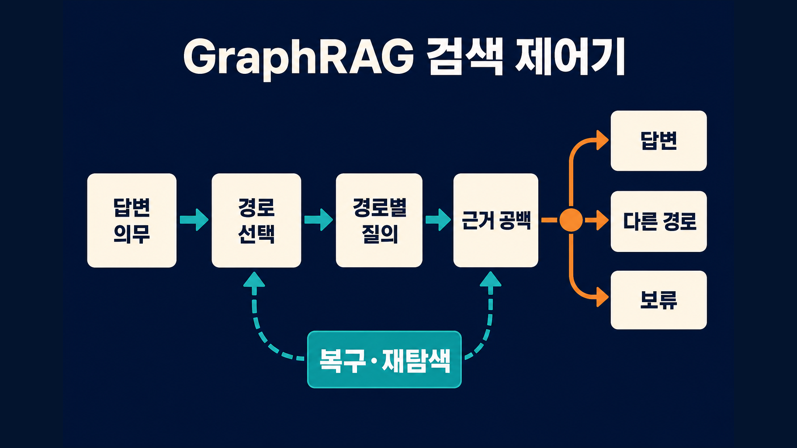
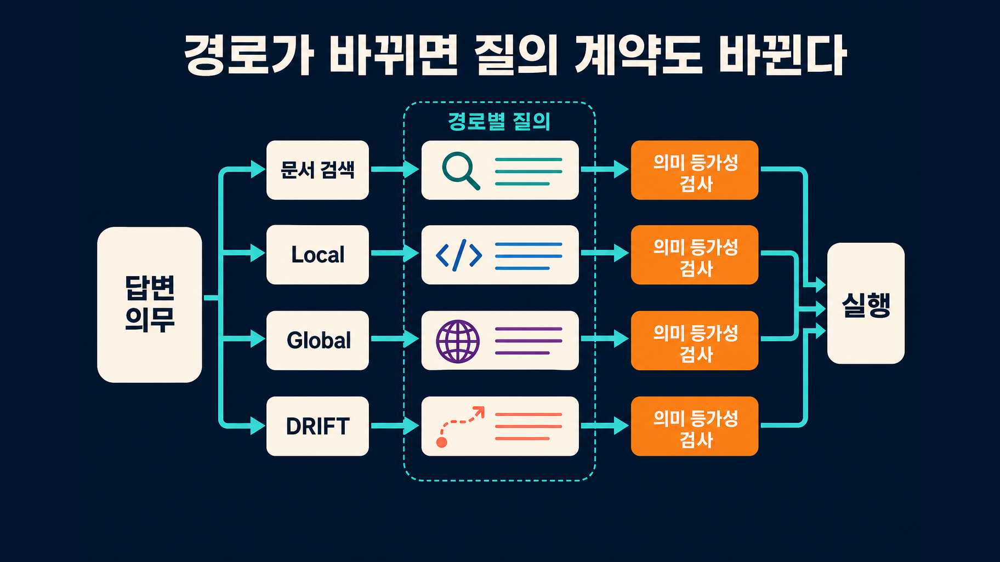
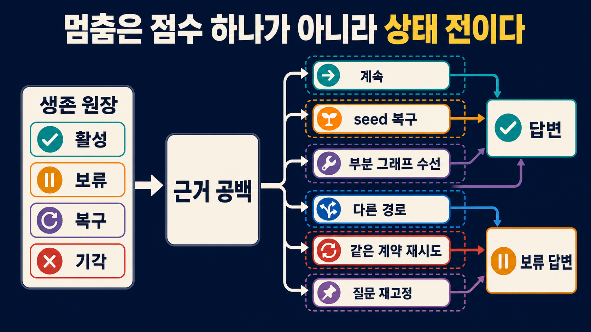
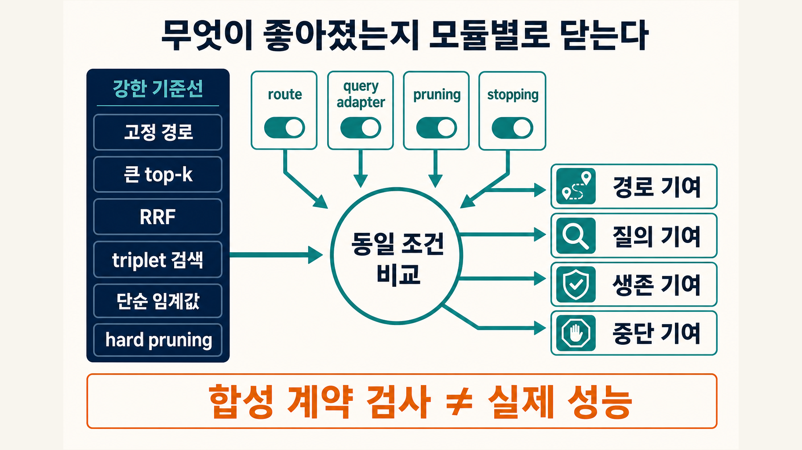

> [!summary] 핵심 결론
> GraphRAG의 검색 제어는 `local인가 global인가`를 한 번 고르는 분류 문제가 아닙니다. 질문의 답변 의무를 먼저 적고, 선택한 경로에 맞게 질의를 다시 표현하며, 서로 다른 근거 공백을 닫을 때만 확장해야 합니다. 버린 후보를 되살릴 수 있어야 하고, 모든 경로가 답을 뒷받침하지 못하면 fallback이나 보류로 끝내야 합니다.

사내 장애 조사에서 `지난 배포 뒤 결제 실패가 늘어난 이유와 영향을 받은 고객군`을 묻는다고 해보겠습니다. 첫 검색은 배포 기록을 찾지만, 그 기록에는 실패 코드가 없습니다. 그래프를 따라가면 배포와 연결된 서비스, 서비스가 내보낸 오류, 오류가 발생한 지역이 보입니다. 그런데 고객군을 특정할 원문 로그는 그래프에 없고 별도 문서 검색에만 잡힙니다.

이때 `그래프를 두 홉 더 탐색한다`는 규칙만으로는 부족합니다. 지금 부족한 것은 서비스 관계가 아니라 고객군을 입증할 원문입니다. 같은 질문을 그대로 반복해도 새 근거가 늘지 않을 수 있고, 초기에 점수가 낮아 버린 로그가 나중에 결정적 반례가 될 수도 있습니다.

문제는 검색기 개수가 아닙니다. 다음 결정을 빠짐없이 기록하는 작은 제어기가 필요합니다.

```text
무엇을 답해야 하는가
→ 어느 경로가 그 의무에 맞는가
→ 그 경로가 이해하는 질의로 바뀌었는가
→ 어떤 근거가 아직 비었는가
→ 다음 행동이 그 공백을 새롭게 줄이는가
→ 답할 것인가, 복구할 것인가, 다른 경로로 갈 것인가, 보류할 것인가
```

[[notes/graphrag-adoption-gate|21번 글]]은 관계 증강 문서부터 GraphRAG까지 언제 승격할지를 다뤘습니다. [[notes/graphrag-beyond-context-compiler|22번 글]]은 검색 결과를 안전한 문맥으로 만들고 생성·권한·승격 책임을 어디에 둘지 설명했습니다. 이번 글은 그 사이의 빈칸, 즉 **도입된 검색 경로를 질문마다 어떻게 실행하고 언제 멈출지**에 집중합니다.

## 경로 선택보다 먼저 답변 의무를 적습니다

질문 문자열만 보고 검색 경로를 고르면, 짧은 질문을 단순 질문으로 오해하기 쉽습니다. `A 정책의 영향을 받는 계약은?`이라는 한 문장에도 정책 문서, 계약의 적용 관계, 예외 조항과 현재 revision이라는 여러 의무가 숨어 있을 수 있습니다.

먼저 자연어 질문을 검증 가능한 **답변 의무(answer obligation)**로 나눕니다.

```yaml
answer_obligations:
  - id: cause
    need: 배포와 결제 실패 증가의 인과 연결
    acceptable_evidence: 변경 기록 + 오류 시계열 + 서비스 연결
  - id: affected_segment
    need: 영향을 받은 고객군
    acceptable_evidence: 원문 로그 또는 집계 근거
  - id: caveat
    need: 다른 원인과 데이터 공백
    acceptable_evidence: 반례 또는 미확인 범위
```

이 목록은 정답을 미리 쓰는 템플릿이 아닙니다. 검색이 무엇을 채웠고 무엇을 놓쳤는지 판정하는 체크리스트입니다. 답변 의무가 없으면 `관련 문서를 많이 찾았다`와 `질문에 답할 근거를 찾았다`를 구분할 수 없습니다.

Microsoft GraphRAG는 Basic, Local, Global, DRIFT를 서로 다른 query mode로 나눕니다. Local은 특정 entity 주변의 관계와 원문을, Global은 community report를 집계한 전체 데이터셋 수준의 주제를, DRIFT는 넓은 출발점에서 후속 질문으로 좁혀 가는 검색을 겨냥합니다.[src_006](#src-006)[src_007](#src-007)[src_008](#src-008)[src_009](#src-009) 이 구분은 경로마다 잘 푸는 의무가 다르다는 구현 근거이지, 경로 선택만으로 답 품질이 보장된다는 뜻은 아닙니다.

| 답변 의무                  | 우선 검토할 얇은 경로    | graph 경로를 켤 신호                        |
| -------------------------- | ------------------------ | ------------------------------------------- |
| 직접 인용·날짜·ID          | lexical·vector 문서 검색 | 엔티티 이름이 흩어졌거나 연결 문서가 누락됨 |
| 특정 entity 주변 사실      | Local·hybrid             | 관계 방향과 원문 provenance가 답의 일부     |
| 여러 조건의 교집합·다중 홉 | graph traversal·hybrid   | 경로 자체를 증명해야 함                     |
| 전체 corpus의 주제·패턴    | Global·community         | top-k 문서가 전체 분포를 대표하지 못함      |
| 모호한 조사 질문           | DRIFT·agentic retrieval  | 후속 질문이 서로 다른 근거 공백을 닫음      |

이 표는 고정 router가 아닙니다. 첫 경로를 고르는 가설입니다. `Use Graph When It Needs`와 RouteRAG는 text, graph, fusion을 질문에 따라 선택하는 adaptive routing의 가능성을 보여 줍니다.[src_005](#src-005)[src_013](#src-013) 다만 router가 틀릴 수 있으므로 분류 점수 하나가 아니라 후속 근거 공백과 복구 결과까지 기록해야 합니다.

## 같은 질문을 다른 검색기에 그대로 보내지 않습니다

경로를 골랐다면 그 경로가 이해하는 **query contract**로 질문을 바꿔야 합니다. 같은 자연어 문장을 vector, full-text, graph query와 community search에 그대로 던지고 결과만 합치면, 경로의 차이와 질의 표현의 차이가 섞입니다.

예를 들어 `지난 배포 뒤 결제 실패가 늘어난 이유`라는 질문은 경로마다 다른 형태가 됩니다.

```text
문서 검색
  "payment failure after deployment" + 배포 ID + 시간 범위

그래프 검색
  seed = 배포 ID
  allowed_relations = deployed_to, emits, affects
  direction = outgoing then incoming
  max_hops = 2

전체 패턴 검색
  시간대별 오류 community와 지역별 변화 요약
```

query contract에는 최소한 다음을 남깁니다.

- 원래 답변 의무와 이 경로가 맡은 의무
- entity·relation·시간·권한 범위
- 허용한 의미 확장과 금지한 확장
- 검색 예산과 중단 조건
- 원래 질문과 변환 질의의 의미 등가성 검사

여기서 놓치기 쉬운 항목이 의미 등가성입니다. 환경을 관찰해 질의를 바꾸는 retrieval은 유용하지만, 수정된 질의가 원래 의무를 잊으면 많이 찾아도 다른 질문에 답하게 됩니다. Environment-aware IR 연구는 retrieval 환경을 반영한 query formulation을 다루지만, 어떤 수정이든 원래 의무와의 일치 여부를 별도로 검증해야 합니다.[src_027](#src-027)

의미 등가성 검사는 문자열 유사도가 아닙니다. 예를 들어 `실패 원인`을 `실패와 함께 나타난 서비스`로 바꾸면 후보 탐색에는 도움이 되지만 인과 의무를 대체하지 못합니다. 따라서 변환 질의마다 `보존한 의무`, `완화한 제약`, `새로 넣은 가정`을 기록합니다.



## 홉 수가 아니라 근거 공백으로 확장합니다

고정된 `2-hop`이나 `top-k 20`은 실행 상한으로는 쓸 수 있지만, 충분성 판정은 아닙니다. 한 홉에서 필요한 원문까지 찾을 수도 있고, 세 홉을 돌아도 같은 종류의 근거만 반복될 수 있습니다.

확장 판단은 아직 비어 있는 의무를 **근거 공백(evidence gap)**으로 표현하는 편이 낫습니다.

```yaml
evidence_gaps:
  - obligation: cause
    missing: 배포와 오류 증가를 잇는 시간·서비스 근거
    diversity_needed: [change_record, time_series]
  - obligation: affected_segment
    missing: 고객군을 입증할 원문
    diversity_needed: [raw_log]
  - obligation: caveat
    missing: 배포 외 원인 후보
    diversity_needed: [counterevidence]
```

다음 검색은 `관련성 높은 것 하나 더`가 아니라 이 목록에서 아직 없는 종류를 채워야 합니다. DF-RAG는 query-aware diversity를 검색에 반영하고, S2G-RAG와 CIRAG는 구조화된 충분성·공백 판단을 반복 검색과 연결합니다.[src_028](#src-028)[src_023](#src-023)[src_024](#src-024) 이 연구들을 그대로 하나의 표준 제어기로 합칠 수는 없지만, **추가 검색의 가치는 새 근거 종류가 공백을 얼마나 줄였는지로 봐야 한다**는 방향은 함께 읽을 수 있습니다.

그래프에서는 하나의 hop 숫자 대신 여러 **hop view**를 비교합니다.

- `entity view`: 새 entity가 어떤 의무에 연결되는가
- `relation view`: 관계 방향과 유형이 증명에 필요한가
- `source view`: graph fact를 뒷받침하는 원문이 있는가
- `counterevidence view`: 현재 경로를 반박할 후보가 생겼는가
- `coverage view`: 아직 비어 있는 의무가 무엇인가

ARK는 breadth와 depth를 적응적으로 조절하고, CatRAG는 고정된 정적 그래프 대신 문맥에 맞춘 traversal을, ParallaxRAG는 다중 관점의 검색을 제안합니다.[src_014](#src-014)[src_016](#src-016)[src_017](#src-017) 여기서 가져올 운영 원칙은 특정 알고리즘의 우월성이 아니라, 확장을 단일 깊이 숫자나 단일 순위로 축소하지 않는 것입니다.

## 가지치기는 삭제가 아니라 보류여야 합니다

그래프 탐색은 후보가 빠르게 늘어나므로 가지치기가 필요합니다. 문제는 초기에 약해 보인 후보가 나중에 다른 근거와 연결되면서 중요해질 수 있다는 점입니다. 불완전한 지식그래프에서의 KG-RAG 실패 연구도 누락과 구조 손상이 reasoning을 깨뜨릴 수 있음을 보여 줍니다.[src_004](#src-004)

따라서 hard delete 대신 **가역적 가지치기(reversible pruning)**를 사용합니다.

```yaml
survival_ledger:
  - candidate: error-log-eu-west
    state: deferred
    reason: 초기 질문과 직접 연결 약함
    evidence_for: affected_segment
    revive_when:
      - region relation 발견
      - 같은 오류 코드가 다른 경로에서 재등장
    provenance: log-index@revision-42
```

후보 상태는 적어도 `active`, `deferred`, `revived`, `rejected`로 나눕니다. `rejected`에도 이유와 근거 revision을 남깁니다. 그래야 query contract나 권한 범위가 바뀌었을 때 이전 결정을 다시 계산할 수 있습니다.

NEST와 ReflectiveRAG는 nested evidence의 생존과 retrieval adaptivity를 다루지만 같은 연구진의 연속된 연구이므로 독립 근거 두 개로 세지 않는 편이 안전합니다.[src_030](#src-030)[src_031](#src-031) 또한 두 연구는 일반 text RAG를 중심으로 하므로 GraphRAG 전체에 직접 일반화하지 않습니다. 여기서는 중요한 근거가 중간 선택 단계에서 조용히 사라지지 않게 하는 설계 영감으로만 사용합니다.

가지치기에는 source gate도 필요합니다. graph edge나 community summary가 관련돼 보이더라도 다음 중 하나를 충족하지 못하면 최종 답의 확정 근거로 올리지 않습니다.

1. 원문 또는 검증 가능한 upstream record가 연결돼 있습니다.
2. source revision과 권한 범위를 재현할 수 있습니다.
3. 관계 방향과 변환 과정이 receipt에 남습니다.
4. 반례를 지우지 않고 답변 의무와 연결됩니다.

그래프 오염 공격을 다룬 HoG-GRAG는 특정 poisoning 위협 모델의 근거입니다.[src_032](#src-032) 모든 GraphRAG가 공격받았다는 일반론의 근거로 쓰면 안 됩니다. 다만 graph edge를 원문과 분리된 권위로 취급하면 안 된다는 source gate의 필요성은 더 분명해집니다.

## 멈춤은 신뢰도 하나가 아니라 상태 전이입니다

검색 제어에서 가장 위험한 규칙은 `confidence > 0.8이면 답한다`입니다. 이 숫자는 빠르지만 어떤 의무가 비었는지, 근거가 서로 독립적인지, 추가 검색이 가치가 있는지 보여 주지 않습니다.

RAG-on-a-Diet와 Active RAG 연구는 retrieval utility, calibration, budget과 cost를 함께 다룹니다.[src_025](#src-025)[src_026](#src-026) QuCo-RAG는 불확실성을 동적 retrieval과 연결합니다.[src_029](#src-029) 다만 이 연구들의 수치를 운영 임계값으로 복사하지 않습니다. 이 글의 중단 규칙은 측정 뒤 보정할 프로젝트 계약입니다.

권장 상태 전이는 다음과 같습니다.

```text
answer
  모든 핵심 의무가 source gate를 통과한 근거로 닫힘

continue
  새 행동이 아직 다른 종류의 근거 공백을 줄일 가능성이 있음

rescue
  현재 경로 안에서 seed·entity linking·query 표현을 복구

repair
  빠진 edge·원문·subgraph를 제한된 범위에서 다시 구성

fallback
  graph에서 문서·lexical·triplet 등 다른 검색 경로로 전환

retry
  일시적 timeout·rate limit·도구 실패를 같은 계약으로 재실행

re-anchor
  원래 답변 의무와 변환 질의의 의미가 어긋나 다시 고정

abstain
  핵심 의무가 비었고 남은 행동이 새 근거를 만들지 못함
```

이 용어들은 서로 바꿔 쓰면 안 됩니다. `rescue`는 현재 경로 안에서 잘못 잡힌 출발점을 고치는 일입니다. `repair`는 제한된 subgraph나 source 연결의 결손을 고칩니다. `fallback`은 경로 자체를 바꿉니다. `retry`는 의미 계약을 바꾸지 않고 일시적 실행 실패만 재시도합니다. `abstain`은 실패를 숨기지 않고 근거 부족으로 답을 보류하는 종결 상태입니다.



중단 판정은 세 층으로 나눌 수 있습니다.

```text
1. obligation gate
   핵심 의무가 모두 닫혔는가

2. evidence gate
   근거 종류·source·revision·권한이 충분한가

3. marginal utility gate
   다음 행동이 새로운 공백을 줄일 가능성이 비용보다 큰가
```

세 번째 층만 만족한다고 답하면 안 됩니다. 예산이 바닥났다는 사실은 근거 충분성을 만들지 않습니다. 이 경우 정답 상태는 `answer`가 아니라 `abstain` 또는 제한을 밝힌 부분 답변입니다.

## graph-free 기준선을 강하게 둡니다

GraphRAG 제어기의 가치를 입증하려면 약한 vector top-k만 상대해서는 안 됩니다. T²RAG는 graph database 없이 triplet-driven retrieval을 제안합니다.[src_018](#src-018) Reciprocal Rank Fusion은 여러 순위 결과를 단순하지만 강하게 합치는 오래된 기준선입니다.[src_012](#src-012)

최소 비교군은 다음과 같이 잡습니다.

| 비교군                    | 확인할 질문                                       |
| ------------------------- | ------------------------------------------------- |
| raw query + fixed route   | 경로별 query contract가 실제로 기여했는가         |
| 큰 top-k + 강한 reranker  | 반복 제어 없이도 같은 근거를 찾는가               |
| lexical + vector + RRF    | graph가 아닌 hybrid fusion으로 충분한가           |
| staged triplet retrieval  | graph DB 없이 구조적 근거를 회수할 수 있는가      |
| 단순 confidence threshold | gap-aware stopping이 더 안전한가                  |
| hard pruning              | survival ledger가 필요한 후보를 실제로 복구하는가 |

모든 조건에서 question set, model, prompt, source·graph revision, 권한, token·latency budget과 final generator를 고정합니다. 그렇지 않으면 graph의 기여와 더 큰 예산의 기여를 구분할 수 없습니다.

여기서 필요한 것은 평균 정확도 순위표 하나가 아닙니다. route, adapter, pruning, stopping이 각각 무엇을 보탰는지 닫아야 합니다.

```text
route contribution
  같은 query contract에서 경로만 바꿨을 때의 차이

adapter contribution
  같은 경로에서 raw query와 route-conditioned query의 차이

pruning contribution
  같은 후보 집합에서 hard pruning과 survival ledger의 차이

stopping contribution
  같은 근거 흐름에서 confidence와 gap-aware terminal state의 차이
```

이렇게 모듈을 하나씩 끄는 ablation이 있어야 `GraphRAG가 좋아졌다`가 아니라 `어느 책임이 어떤 질문에서 필요했다`고 말할 수 있습니다.

## 일곱 합성 스위트는 성능이 아니라 분기 누락만 확인했습니다

이 글을 준비한 연구 번들에서는 실행 제어 계약을 일곱 개의 결정론적 합성 스위트로 점검했습니다.

| 합성 스위트        | 검사한 내용                           |  결과 |
| ------------------ | ------------------------------------- | ----: |
| route·stopping     | 질문별 초기 경로와 종결 상태          | 12/12 |
| nested controller  | 의무·공백·행동의 중첩 제어            | 15/15 |
| hop view           | 홉별 entity·relation·source·반례 view | 14/14 |
| contribution       | route·adapter·pruning 기여 분리       | 14/14 |
| gap stopping       | 근거 공백 기반 중단                   | 15/15 |
| route-query        | 경로별 질의와 의미 등가성             | 14/14 |
| reversible pruning | 보류 후보의 생존·복구 원장            | 15/15 |

이 숫자는 작성한 분기표의 예시가 기대 상태로 이동했는지 확인한 assertion 개수입니다. 실제 질문에서의 정확도, latency, token, 비용이나 production threshold가 아닙니다. 동일 예산의 vector·full-text·graph·RRF·graph-free 비교도 아직 실행하지 않았습니다.

따라서 이번 결과로 말할 수 있는 범위는 좁습니다.

> 답변 의무, 경로별 질의, 근거 공백, 가역적 가지치기와 명시적 종결 상태를 하나의 receipt로 연결할 수 있고, 준비한 합성 시나리오에서 빠진 분기가 없었습니다.

반대로 말할 수 없는 것은 `이 제어기가 특정 서비스에서 더 정확하다`, `몇 홉이나 몇 점에서 멈춰야 한다`, `GraphRAG가 graph-free 기준선보다 싸다`입니다. 이런 결론은 live corpus와 동일 예산 benchmark가 있어야 합니다.



## 실행 receipt를 한 장으로 남깁니다

실제 시스템에서는 아래와 같은 receipt가 최소 단위가 됩니다.

```yaml
retrieval_control_receipt:
  question_id: incident-042
  source_revision: docs-128
  graph_revision: graph-77
  authorization_scope: tenant-a-read
  obligations:
    cause: closed
    affected_segment: closed
    caveat: open
  initial_route: local_graph
  route_query_hash: sha256:...
  semantic_equivalence:
    preserved: [cause, time_range]
    relaxed: []
    added_assumptions: []
  gap_history:
    - missing: affected_segment/raw_log
      action: fallback_to_lexical
      result: closed
    - missing: caveat/counterevidence
      action: search_alternative_causes
      result: open
  pruning:
    deferred: 8
    revived: 1
    rejected: 3
  terminal_state: partial_answer_with_caveat
  unclosed_gaps: [caveat]
```

이 스키마는 학술 표준이 아니라 재현과 비교를 위한 프로젝트 제안입니다. 비공개 연구 번들의 DuckCrab 커밋 고정 감사에서 확인된 것은 query로부터 명시적 retrieval plan을 만들고, route·bounded expansion 입력과 schema card, receipt, read-only bundle을 제공하는 범위까지입니다. 공개 재현 링크가 없는 저장소 감사이므로 외부 구현 근거로 세지 않습니다. 이 글에서 설명한 gap controller, semantic-equivalence gate와 survival ledger가 모두 구현돼 있다고 말할 수도 없습니다.

receipt의 목적은 로그를 많이 쌓는 데 있지 않습니다. 실패를 다음 네 질문으로 되돌릴 수 있게 하는 것입니다.

1. 처음부터 경로를 잘못 골랐는가?
2. 경로는 맞았지만 질의를 잘못 변환했는가?
3. 필요한 후보를 너무 일찍 버렸는가?
4. 근거가 비었는데도 너무 일찍 답했는가?

## 좋은 GraphRAG는 많이 걷는 검색기가 아닙니다

GraphRAG를 도입한 뒤의 핵심 문제는 `몇 홉을 돌 것인가`가 아닙니다. **어떤 의무가 아직 비었고, 다음 행동이 그 공백을 다른 종류의 근거로 줄일 수 있는가**입니다.

실무에서는 다음 순서를 지키면 됩니다.

1. 질문을 답변 의무로 나눕니다.
2. 가장 얇은 초기 경로를 가설로 고릅니다.
3. 경로에 맞는 query contract를 만들고 의미 등가성을 검사합니다.
4. 홉별로 entity·relation·source·반례 view를 기록합니다.
5. 후보를 지우지 말고 생존 원장에 보류합니다.
6. source gate를 통과한 근거로 공백을 닫습니다.
7. route·adapter·pruning·stopping의 순기여를 강한 graph-free 기준선과 비교합니다.
8. 공백이 닫히지 않으면 rescue, repair, fallback, retry 또는 abstain을 구분해 끝냅니다.

목표는 GraphRAG를 더 영리하게 보이게 만드는 것이 아닙니다. 그래프가 필요한 질문에서는 경로의 기여를 남기고, 필요하지 않은 질문에서는 얇은 검색으로 돌아가며, 끝내 근거가 없는 질문에는 답하지 않을 이유를 남기는 것입니다.

---

## 참고문헌

<a id="src-004"></a>

- [What Breaks Knowledge Graph based RAG? Benchmarking and Empirical Insights into Reasoning under Incomplete Knowledge](https://aclanthology.org/2026.eacl-long.114/)

<a id="src-005"></a>

- [Use Graph When It Needs: Efficiently and Adaptively Integrating Retrieval-Augmented Generation with Graphs](https://arxiv.org/abs/2602.03578)

<a id="src-006"></a>

- [GraphRAG Query Engine Overview](https://github.com/microsoft/graphrag/blob/main/docs/query/overview.md)

<a id="src-007"></a>

- [GraphRAG Local Search](https://github.com/microsoft/graphrag/blob/main/docs/query/local_search.md)

<a id="src-008"></a>

- [GraphRAG Global Search](https://github.com/microsoft/graphrag/blob/main/docs/query/global_search.md)

<a id="src-009"></a>

- [GraphRAG DRIFT Search](https://github.com/microsoft/graphrag/blob/main/docs/query/drift_search.md)

<a id="src-012"></a>

- [Reciprocal Rank Fusion Outperforms Condorcet and Individual Rank Learning Methods](https://cormack.uwaterloo.ca/cormacksigir09-rrf)

<a id="src-013"></a>

- [RouteRAG: Efficient Retrieval-Augmented Generation from Text and Graphs via Reinforcement Learning](https://aclanthology.org/2026.acl-long.820/)

<a id="src-014"></a>

- [Autonomous Knowledge Graph Exploration with Adaptive Breadth-Depth Retrieval](https://aclanthology.org/2026.acl-long.714/)

<a id="src-016"></a>

- [Breaking the Static Graph: Context-Aware Traversal for Graph-Based RAG](https://aclanthology.org/2026.findings-acl.290/)

<a id="src-017"></a>

- [Think Parallax: Solving Multi-Hop Problems via Multi-View Knowledge-Graph-Based Retrieval-Augmented Generation](https://aclanthology.org/2026.acl-long.1226/)

<a id="src-018"></a>

- [Beyond Chunks and Graphs: Retrieval-Augmented Generation through Triplet-Driven Thinking](https://aclanthology.org/2026.findings-acl.1310/)

<a id="src-023"></a>

- [S2G-RAG: Structured Sufficiency and Gap Judging for Iterative Retrieval-Augmented QA](https://aclanthology.org/2026.acl-long.1185/)

<a id="src-024"></a>

- [CIRAG: Construction–Integration Retrieval and Adaptive Generation for Multi-hop Question Answering](https://aclanthology.org/2026.acl-long.1203/)

<a id="src-025"></a>

- [RAG-on-a-Diet: A Reinforcement Learning-Based Dynamic Resource Optimization Framework for RAG](https://aclanthology.org/2026.acl-long.1562/)

<a id="src-026"></a>

- [When Should Active RAG Retrieve? A Budget-Aware Evaluation of Utility, Calibration, and Cost](https://arxiv.org/abs/2607.24010)

<a id="src-027"></a>

- [Understanding the Behaviors of Environment-aware Information Retrieval](https://aclanthology.org/2026.acl-long.2013/)

<a id="src-028"></a>

- [DF-RAG: Query-Aware Diversity for Retrieval-Augmented Generation](https://aclanthology.org/2026.findings-eacl.150/)

<a id="src-029"></a>

- [QuCo-RAG: Quantifying Uncertainty from the Pre-training Corpus for Dynamic Retrieval-Augmented Generation](https://aclanthology.org/2026.findings-acl.812/)

<a id="src-030"></a>

- [NEST: Nested Evidence Survival for Retrieval](https://aclanthology.org/2026.acl-industry.35/)

<a id="src-031"></a>

- [ReflectiveRAG: Rethinking Adaptivity in Retrieval-Augmented Generation](https://aclanthology.org/2026.eacl-industry.27/)

<a id="src-032"></a>

- [Defense Against Knowledge Poisoning Attack on GraphRAG](https://aclanthology.org/2026.acl-short.47/)
