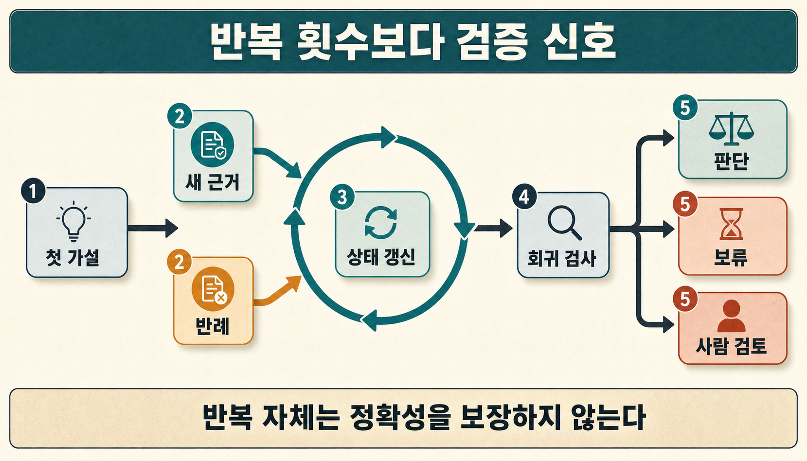
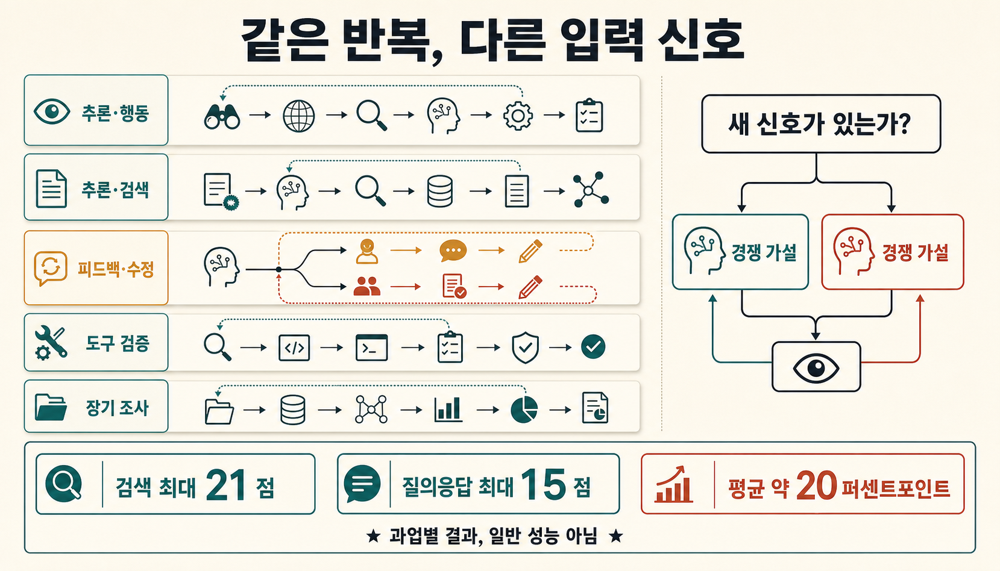
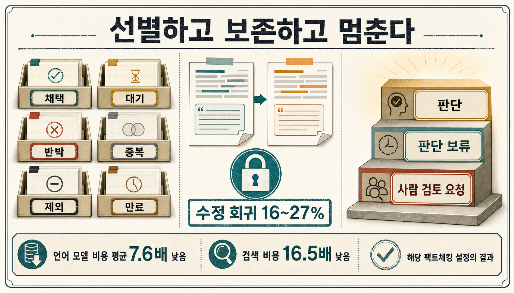
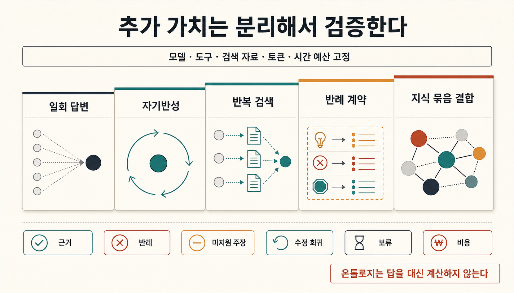

> [!summary] 한 문장 결론
> 여러 번 생각한다고 답이 저절로 좋아지지는 않습니다. 좋은 조사 루프는 새 근거와 반례가 들어올 때마다 가설을 고치고, 아직 모르는 것이 남았다면 결론을 보류합니다.

서비스 장애가 발생했고, 첫 가설은 “방금 한 배포가 원인이다”라고 해보겠습니다.

보통의 에이전트는 배포 문제를 뒷받침하는 로그를 더 찾습니다. 조사 루프는 여기서 한 걸음 더 나갑니다. 외부 API 장애라는 다른 설명도 세우고, 두 원인을 가를 관찰이 무엇인지 찾습니다.

## 반복한다고 자동으로 좋아지지는 않습니다

한 번 검색하고 곧바로 답하지 않는다고 해서 자동으로 더 믿을 만한 에이전트가 되는 것은 아닙니다. 같은 모델이 같은 답을 다시 생각하면 최초 오류를 되풀이할 수 있고, 검색 결과를 계속 쌓으면 관련 없는 문서가 판단을 방해할 수 있습니다. 보고서를 여러 번 고치는 과정에서 이미 맞았던 내용과 인용이 사라질 수도 있습니다.

연구에서 확인되는 범위는 여기까지입니다.

> 복합 조사에서는 현재 가설과 미지를 기록하고, 이를 구분할 새 근거·반례·도구 피드백을 받아 상태를 갱신하는 구조가 유용한 설계 후보가 될 수 있습니다. 다만 반복 자체가 정확성이나 안전성을 보장하지는 않습니다.

ReAct와 IRCoT는 추론 중 행동과 검색을 교차하는 접근이 특정 과업에서 효과를 낼 수 있음을 보여 줬습니다.[src_001](#src-001)[src_002](#src-002) Self-Refine과 Reflexion도 반복 피드백의 가능성을 보였지만,[src_003](#src-003)[src_004](#src-004) 외부 피드백 없는 추론 자기교정은 실패하거나 오히려 성능을 낮출 수 있다는 연구와 비판적 조사도 있습니다.[src_006](#src-006)[src_007](#src-007) CRITIC처럼 검색·코드·검증 도구가 주는 외부 피드백과 단순 자기반성을 구분해야 합니다.[src_005](#src-005)

앞선 [[notes/kg-guided-llm-planning|11번 글]]이 계획 전에 확인할 목표·상태·행동·제약과 근거를 다뤘다면, 이번 글은 그 첫 가설과 첫 계획을 어떻게 다시 검사하고 수정할지 살펴봅니다. [[notes/ontology-expertise-pack|전문성 Pack]]의 사례·실패·경쟁 가설·미지가 이 조사 루프의 작업 재료가 됩니다.

> [!important] 이 글에서 다루는 범위
> 아래 구조는 DuckCrab이나 OpenCrab에 이미 완성된 기능이 아닙니다. 후속 구현과 비교 실험으로 확인할 설계안입니다.

## 조사 범위와 반대 가설

범위는 ReAct 최초 공개일인 2022년 10월 6일부터 2026년 7월 23일까지입니다. 반복 추론·행동, 반복 검색, 자기수정, 장기 조사 작업공간과 다중 턴 보고서 수정 연구를 살펴봤습니다.

> [!note] 연구 수치를 읽을 때
> 아래 수치는 서로 다른 모델과 과업에서 나온 결과입니다. 반복 조사 전체의 성능으로 합치거나 서로 직접 비교하지 않습니다.

먼저 이런 가능성부터 의심했습니다.

1. 개선의 원인은 반복 구조가 아니라 더 많은 토큰·검색·도구 호출일 수 있습니다.
2. 같은 모델의 자기비판은 최초 오류와 편향을 공유해 확신만 강화할 수 있습니다.
3. 추가 검색은 새 근거보다 중복·잡음·오염을 더 많이 가져올 수 있습니다.
4. 수정은 요청받은 부분을 고치면서 이미 맞았던 내용과 인용을 망가뜨릴 수 있습니다.
5. 짧고 위험이 낮은 질문은 일회 검색으로 충분할 수 있습니다.

검색 기록과 반증 질의, 채택·제외 판단은 `research/iterative-investigation-refutation-loop-20260723/`에 보존했습니다. 별도 독립 리뷰어를 확보하지 못해 반증 검토는 저자가 직접 수행했으며, 이를 독립적인 외부 검증으로 보아서는 안 됩니다.

## 1. 같은 ‘반복’이라도 하는 일이 다릅니다

‘에이전트가 반복한다’는 표현 아래에는 서로 다른 구조가 섞여 있습니다.

| 계열        | 반복 단위                      | 새로 들어오는 신호      | 대표 연구              | 해석 경계                         |
| ----------- | ------------------------------ | ----------------------- | ---------------------- | --------------------------------- |
| 추론·행동   | 생각 → 행동 → 관찰             | 환경·도구 관찰          | ReAct                  | 장기 조사 전체의 증거는 아님      |
| 추론·검색   | 추론 단계 → 검색               | 새 문서                 | IRCoT, Self-RAG        | 검색 품질과 과업에 의존           |
| 피드백·수정 | 초안 → 비판 → 수정             | 자기 또는 외부 피드백   | Self-Refine, Reflexion | 피드백 출처를 구분해야 함         |
| 도구 검증   | 주장 → 도구 검사 → 수정        | 검색·코드·검증기 결과   | CRITIC, FIRE           | 도구가 검사할 수 있는 항목에 한정 |
| 장기 조사   | 질문 분해 → 자료 축적 → 보고서 | 지속 작업공간·여러 관점 | STORM, FS-Researcher   | 출처 편향과 수정 회귀가 남음      |

IRCoT는 한 번 검색하고 읽는 방식만으로는 다단계 질문을 풀기 어렵다고 봤습니다. 그래서 추론을 진행하다가 필요한 정보를 다시 검색하도록 만들었습니다. 네 데이터셋에서 검색 성능은 최대 21점, 최종 QA는 최대 15점 높아졌습니다.[src_002](#src-002)

Self-Refine은 같은 모델이 초안을 쓰고, 비판하고, 다시 고치는 방식을 사용했습니다. 7개 과업에서 평균 약 20%p 개선을 보고했습니다.[src_003](#src-003) 하지만 외부 피드백 없이 같은 모델이 자신의 추론을 다시 검사한 ICLR 2024 연구에서는 답이 나아지지 않거나 오히려 나빠졌습니다.[src_006](#src-006) TACL의 비판적 조사도 신뢰할 수 있는 외부 피드백이 있을 때 성공 근거가 가장 뚜렷하다고 정리합니다.[src_007](#src-007)

따라서 핵심 질문은 “몇 번 다시 생각했는가?”가 아닙니다.

> 이전 반복과 다른 어떤 검증 가능한 신호가 들어왔는가?



## 2. 조사 루프는 답안보다 상태를 갱신해야 합니다

매번 답 전체를 새로 쓰면 무엇이 바뀌었고 무엇을 남겨야 하는지 알기 어렵습니다. 그래서 조사 루프에는 다음 일곱 가지 기록이 필요합니다.

```text
hypothesis      현재 가장 가능성이 높은 설명
support         가설을 직접 지지하는 근거와 범위
counterevidence 가설을 약화하거나 뒤집는 근거
unknown         아직 확인하지 못한 사실과 모순
next_query      가설을 구분하기 위한 다음 검색·도구 호출
revision        이전 상태에서 무엇이 왜 바뀌었는지
stop_reason     종료·보류·사람 검토의 이유
```

반복할 때마다 적어도 이 일곱 가지는 남겨야 합니다. 여기서 `hypothesis`는 하나의 결론만 뜻하지 않습니다. 현재 주 가설과 이를 구분해야 할 경쟁 가설을 함께 연결합니다.

이 기록에는 출처 위치, 조회 시점, 문서 해시, 사용한 도구, 비용과 이전 상태 ID도 연결해야 합니다. FS-Researcher는 긴 조사 과정을 파일 시스템 작업공간에 남기고, 자료를 모으는 Context Builder와 보고서를 쓰는 Report Writer를 나눴습니다.[src_012](#src-012) 물론 이 연구가 여기서 제안한 일곱 항목을 모두 검증한 것은 아닙니다. 그래도 장기 조사에는 모델의 대화창 밖에 기록을 남길 공간이 필요하다는 점을 잘 보여 줍니다.

### 조사 상태를 직접 바꿔 보기

아래 탐색기에서 지지 근거, 반대 근거, 미지, 예산, 위험과 수정 회귀를 바꿔 보시면 같은 질문도 `재검색`, `조건부 판단`, `판단 보류(ABSTAIN)`, `사람 검토`로 달라지는 과정을 볼 수 있습니다.

<iframe
  class="interactive-visualization-frame"
  src="/attachments/iterative-investigation-refutation-loop/investigation-loop-explorer.htm"
  title="가설·근거·반례·미지와 종료 조건을 조절하는 반복 조사 루프 탐색기"
  loading="lazy"
  scrolling="no"
  sandbox="allow-scripts allow-same-origin"
  style="height:1180px"
></iframe>

[반복 조사 루프 탐색기를 새 화면에서 크게 열기](/attachments/iterative-investigation-refutation-loop/investigation-loop-explorer.htm)

탐색기의 상태와 문구는 개념 설명용입니다. 실제 성능 수치나 자동 승인 임계값이 아닙니다.

## 3. 반례 검색은 ‘반대 의견 찾기’보다 구체적이어야 합니다

다음 검색은 현재 가설을 다른 말로 되풀이해서는 안 됩니다. 적어도 다음 중 하나를 가를 수 있어야 합니다.

- 이 가설이 틀렸다면 어떤 관찰이 나와야 하는가
- 같은 현상을 설명하는 경쟁 가설은 무엇인가
- 지지 근거와 반대 근거가 갈리는 조건은 무엇인가
- 여러 출처가 같은 원자료를 반복 인용한 것은 아닌가
- 최신 버전·지역·표본·정의가 바뀌면 결론도 바뀌는가
- 지금 확보한 자료가 주장 범위보다 좁지는 않은가

STORM은 글을 쓰기 전에 여러 관점에서 질문을 만들고 자료를 모았습니다. 비교 기준보다 글의 조직성은 25%p, 범위는 10%p 높게 평가됐습니다.[src_009](#src-009) 하지만 출처의 편향이 그대로 옮겨가거나 관련이 약한 사실을 지나치게 연결하는 문제도 남았습니다. 관점을 늘리는 것만으로 출처 품질과 반증이 저절로 좋아지지는 않습니다.

## 4. 검색 결과는 누적보다 선별과 폐기가 필요합니다

Self-RAG는 검색이 필요하지 않은데도 정해진 개수의 문서를 넣으면 답을 해칠 수 있다고 지적했습니다. 그래서 필요할 때만 검색하도록 학습했습니다.[src_008](#src-008) 2026년 다중 턴 검색 연구는 긴 문맥에 섞인 무관한 문서가 모델을 방해하는 문맥 간섭(`context interference`)을 분석했습니다. 특히 가장 최근에 검색한 문서가 큰 간섭원이 될 수 있다고 보고했습니다.[src_014](#src-014)

자료를 계속 쌓기만 해서는 안 됩니다. 조사 작업공간은 각 자료를 어떻게 다룰지도 기록해야 합니다.

| 상태 | 의미                                    |
| ---- | --------------------------------------- |
| 채택 | 현재 주장에 직접 쓰는 근거              |
| 대기 | 관련성은 있지만 아직 평가하지 않은 자료 |
| 반박 | 현재 가설을 약화하는 자료               |
| 중복 | 같은 원자료나 같은 내용을 반복한 자료   |
| 제외 | 범위·시점·품질이 맞지 않는 자료         |
| 만료 | 최신성 조건을 넘긴 자료                 |

쓰지 않기로 한 자료도 지우지는 않습니다. 무엇을 왜 제외했는지가 남아 있어야 나중에 편향과 누락을 확인할 수 있습니다.

## 5. 수정할 때는 새 답보다 회귀를 먼저 검사해야 합니다

보고서를 여러 차례 고치는 일은 생각보다 위험합니다. Mr Dre의 다섯 Deep Research Agent는 사용자 피드백 대부분을 반영했습니다. 하지만 그 과정에서 이전 내용과 인용 품질의 16~27%가 나빠졌습니다.[src_013](#src-013) 프롬프트를 조정하거나 전용 수정 서브에이전트를 붙여도 쉽게 해결되지 않았습니다.

보고서를 고칠 때는 최소한 다섯 가지를 확인해야 합니다.

1. 변경 요청이 영향을 줄 수 있는 주장과 절을 먼저 표시합니다.
2. 새 근거가 뒤집지 않은 확정 주장은 보호 목록에 둡니다.
3. 수정 전후의 주장·인용·수치 차이를 계산합니다.
4. 요청 범위 밖의 삭제·약화·출처 교체를 회귀로 검사합니다.
5. 이전 오류를 다시 도입하지 않았는지 재검사합니다.

반복 조사는 매 턴 전체 보고서를 다시 만드는 채팅 루프보다, 판단 기록과 바뀐 부분을 남기는 작업공간에 가까워야 합니다.



## 6. 멈추는 능력도 조사 능력입니다

계속 검색한다고 빈틈이 모두 사라지는 것은 아닙니다. 비용과 잡음만 커질 수도 있습니다. FIRE는 장문 팩트체킹에서 현재 판단의 확신을 보고, 답을 낼지 다음 검색어를 만들지 선택했습니다. 성능은 비교 대상보다 조금 높았고, 평균 LLM 비용은 7.6배, 검색 비용은 16.5배 낮았습니다.[src_010](#src-010) 다만 팩트체킹 환경에서 나온 결과이므로 일반적인 종료 기준으로 그대로 쓸 수는 없습니다.

언제 멈출지는 확신 점수 하나로 정하기 어렵습니다. 다음 조건을 함께 봐야 합니다.

- 필수 근거가 충족됐습니다.
- 중대한 반례가 해소됐거나 결론에 명시적으로 남았습니다.
- 경쟁 가설을 구분할 추가 정보가 더 이상 없습니다.
- 새 검색의 예상 정보가치가 비용보다 낮습니다.
- 시간·토큰·도구 호출 예산에 도달했습니다.
- 위험이 높아 사람의 판단이나 승인 없이는 진행할 수 없습니다.

마지막 두 경우는 성공 종료가 아니라 판단 보류(`ABSTAIN`) 또는 사람 검토 요청(`ESCALATE`)입니다.

## 7. 반복 루프가 만드는 새로운 실패

여기서는 반복 조사에서 특히 자주 나타나는 위험 네 가지를 정리했습니다. 검색 오염과 평가 착시는 조사 과정뿐 아니라 평가 단계에서도 따로 확인해야 합니다.

| 실패                 | 징후                                  | 필요한 통제                            |
| -------------------- | ------------------------------------- | -------------------------------------- |
| 자기확신 증폭        | 같은 표현의 답이 반복됨               | 외부 근거 또는 독립 검증 신호 요구     |
| 중복·드리프트·완고함 | 새 정보 없이 반복하거나 주제가 이동함 | 갱신·종료·선택 상태, 루트 질문 고정    |
| 검색 오염            | 벤치마크 정답이나 복제 문서를 회수함  | 고정 코퍼스, 검색 로그, 오염 감사      |
| 평가 착시            | 유창한 글과 인용 모양이 오류를 숨김   | 사실·시점 검증이 가능한 도구 사용 평가 |

IoRT는 정적인 자기반성이 중복·드리프트·완고함을 만들 수 있다고 보고했습니다.[src_011](#src-011) 이 연구는 반복 중 갱신·종료·선택(`refresh·stop·select`) 지시를 나눠 이런 문제를 줄이려 했습니다. Search-Time Contamination 연구는 공개 벤치마크 정보가 검색 과정에 들어와 측정 성능을 최대 4% 부풀릴 수 있다고 보고했지만, 아직 프리프린트이며 실제 서비스 오류율로 해석해서는 안 됩니다.[src_015](#src-015) DREAM은 유창한 종합과 정렬돼 보이는 인용이 사실·추론 결함을 숨길 수 있으므로 평가자도 최신 정보와 원문을 확인할 도구를 가져야 한다고 제안합니다.[src_016](#src-016)

## 8. 온톨로지는 이 조사 루프에서 무엇을 맡는가

그럼 온톨로지는 이 과정에서 무엇을 할까요? 11번의 계획 계약은 목표·상태·행동·제약과 근거를 조립했습니다. 이번 조사 루프는 그 첫 계획을 확정하지 않고 다시 검사하는 단계입니다.

온톨로지나 그래프는 가설을 대신 계산하지 않습니다. 어떤 근거와 반례가 주장에 연결됐는지, 적용 조건은 무엇인지, 판단이 왜 바뀌었는지를 보존해 다음 검색과 검증에 넘기는 역할을 맡을 수 있습니다.

이를 Expertise Pack·문맥 컴파일러·Validator와 연결하는 전체 구조는 다음 13번 글에서 다룹니다. 여기서는 그 구조 안에서 첫 가설과 계획을 다시 검사하는 루프에만 집중합니다. 다만 이 연결은 아직 구현 결과가 아닙니다. 다음 단계에서 직접 만들고 비교해야 할 설계안입니다.

## 9. 효과를 주장하기 위한 최소 비교 실험

| 비교 팔                 | 추가되는 것              | 확인할 질문                              |
| ----------------------- | ------------------------ | ---------------------------------------- |
| 일회 답변(`C_single`)   | 일회 검색·일회 답변      | 기본 품질과 누락은 무엇인가              |
| 자기반성(`C_reflect`)   | 같은 모델의 자기반성만   | 새 근거 없이 오류가 실제로 줄어드는가    |
| 반복 검색(`C_retrieve`) | 반복 검색                | 근거 충족과 잡음이 어떻게 바뀌는가       |
| 반례 계약(`C_counter`)  | 가설·반례·종료 계약      | 반례 회수와 보류가 개선되는가            |
| Pack 결합(`T_bundle`)   | Pack·판단 기록·Validator | 이력·정책·회귀 검사가 추가 가치를 주는가 |

비교할 때는 모델, 도구, 검색 코퍼스, 토큰·시간 예산과 평가 질문을 고정해야 합니다. 정답률만 확인해서도 부족합니다. 근거를 충분히 모았는지, 반례를 실제로 찾았는지, 수정 과정에서 기존 내용이 손상되지 않았는지도 함께 봐야 합니다. 비용과 지연시간, 검색 궤적의 오염과 재현성도 기록해야 합니다. Mr Dre와 DREAM은 장문 조사 평가가 최종 문장만 보고 끝날 수 없음을 보여 줍니다.[src_013](#src-013)[src_016](#src-016)



## 결론

한 번 검색하고 답하지 않는다고 해서 자동으로 더 믿을 만한 에이전트가 되지는 않습니다. 반복의 핵심은 생각 횟수가 아니라 **새로 들어온 검증 가능한 신호, 상태의 명시적 변경, 반례를 찾는 다음 질문, 보존해야 할 이전 근거와 종료 이유**입니다.

따라서 반복 조사 루프는 다음과 같이 정의하는 편이 안전합니다.

> 현재 가설과 근거·반례·미지를 기록하고, 가설을 구분할 외부 증거를 선택적으로 검색하며, 변경 이력과 회귀를 검사한 뒤, 근거·정보가치·예산·위험 조건에 따라 판단·보류·사람 검토 중 하나로 종료하는 감사 가능한 조사 계약.

이 구조가 실제로 더 좋은 판단을 만드는지는 9절의 비교 실험으로 확인해야 합니다. 다음 13번 글에서는 계획 계약과 반복 조사 루프를 Expertise Pack·문맥 컴파일러·Validator와 연결해 전체 시니어 조사·판단 하네스로 정리합니다.

## 출처

1. <a id="src-001"></a>Yao, S. et al. (2023). [ReAct: Synergizing Reasoning and Acting in Language Models](https://arxiv.org/abs/2210.03629). ICLR 2023.
2. <a id="src-002"></a>Trivedi, H. et al. (2023). [Interleaving Retrieval with Chain-of-Thought Reasoning for Knowledge-Intensive Multi-Step Questions](https://aclanthology.org/2023.acl-long.557/). ACL 2023.
3. <a id="src-003"></a>Madaan, A. et al. (2023). [Self-Refine: Iterative Refinement with Self-Feedback](https://proceedings.neurips.cc/paper_files/paper/2023/hash/91edff07232fb1b55a505a9e9f6c0ff3-Abstract-Conference.html). NeurIPS 2023.
4. <a id="src-004"></a>Shinn, N. et al. (2023). [Reflexion: Language Agents with Verbal Reinforcement Learning](https://proceedings.neurips.cc/paper_files/paper/2023/hash/1b44b878bb782e6954cd888628510e90-Abstract-Conference.html). NeurIPS 2023.
5. <a id="src-005"></a>Gou, Z. et al. (2024). [CRITIC: Large Language Models Can Self-Correct with Tool-Interactive Critiquing](https://proceedings.iclr.cc/paper_files/paper/2024/hash/fef126561bbf9d4467dbb8d27334b8fe-Abstract-Conference.html). ICLR 2024.
6. <a id="src-006"></a>Huang, J. et al. (2024). [Large Language Models Cannot Self-Correct Reasoning Yet](https://proceedings.iclr.cc/paper_files/paper/2024/hash/8b4add8b0aa8749d80a34ca5d941c355-Abstract-Conference.html). ICLR 2024.
7. <a id="src-007"></a>Kamoi, R. et al. (2024). [When Can LLMs Actually Correct Their Own Mistakes?](https://aclanthology.org/2024.tacl-1.78/). TACL 2024.
8. <a id="src-008"></a>Asai, A. et al. (2024). [Self-RAG: Learning to Retrieve, Generate, and Critique through Self-Reflection](https://proceedings.iclr.cc/paper_files/paper/2024/hash/25f7be9694d7b32d5cc670927b8091e1-Abstract-Conference.html). ICLR 2024.
9. <a id="src-009"></a>Shao, Y. et al. (2024). [Assisting in Writing Wikipedia-like Articles From Scratch with Large Language Models](https://aclanthology.org/2024.naacl-long.347/). NAACL 2024.
10. <a id="src-010"></a>Xie, Z. et al. (2025). [FIRE: Fact-checking with Iterative Retrieval and Verification](https://aclanthology.org/2025.findings-naacl.158/). Findings of NAACL 2025.
11. <a id="src-011"></a>Liu, L. et al. (2025). [Instruct-of-Reflection](https://aclanthology.org/2025.naacl-long.502/). NAACL 2025.
12. <a id="src-012"></a>Zhu, C. et al. (2026). [FS-Researcher](https://aclanthology.org/2026.acl-long.288/). ACL 2026.
13. <a id="src-013"></a>Chen, B. et al. (2026). [Beyond Single-shot Writing: Deep Research Agents are Unreliable at Multi-turn Report Revision](https://aclanthology.org/2026.acl-long.609/). ACL 2026.
14. <a id="src-014"></a>Xue, B. et al. (2026). [Mitigating Context Interference for Reliable and Efficient Search Agents](https://aclanthology.org/2026.acl-long.160/). ACL 2026.
15. <a id="src-015"></a>Wang, Y. et al. (2026). [Search-Time Contamination in Deep Research Agents](https://arxiv.org/abs/2606.05241). arXiv preprint.
16. <a id="src-016"></a>Ben Avraham, E. et al. (2026). [DREAM: Deep Research Evaluation with Agentic Metrics](https://aclanthology.org/2026.acl-long.448/). ACL 2026.
