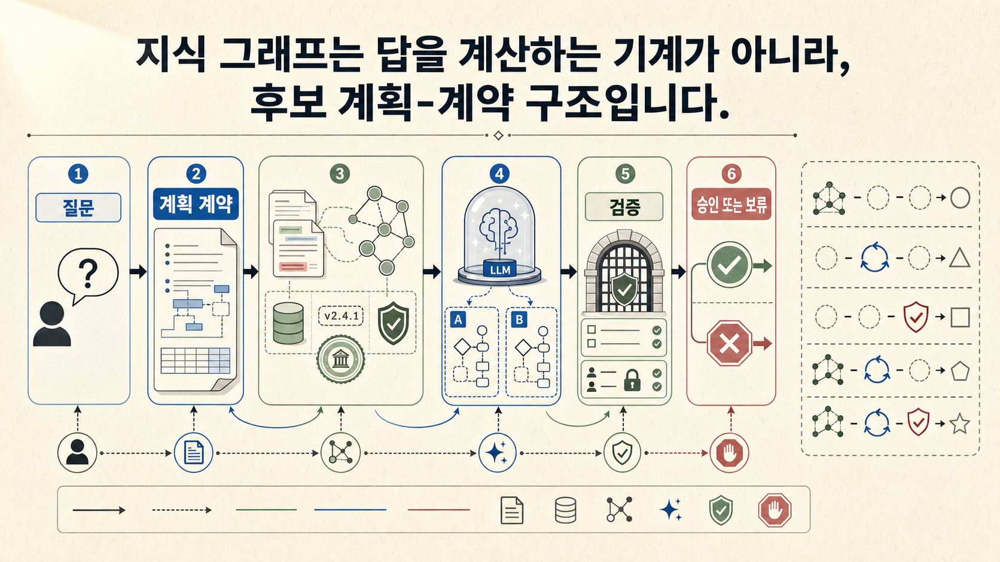
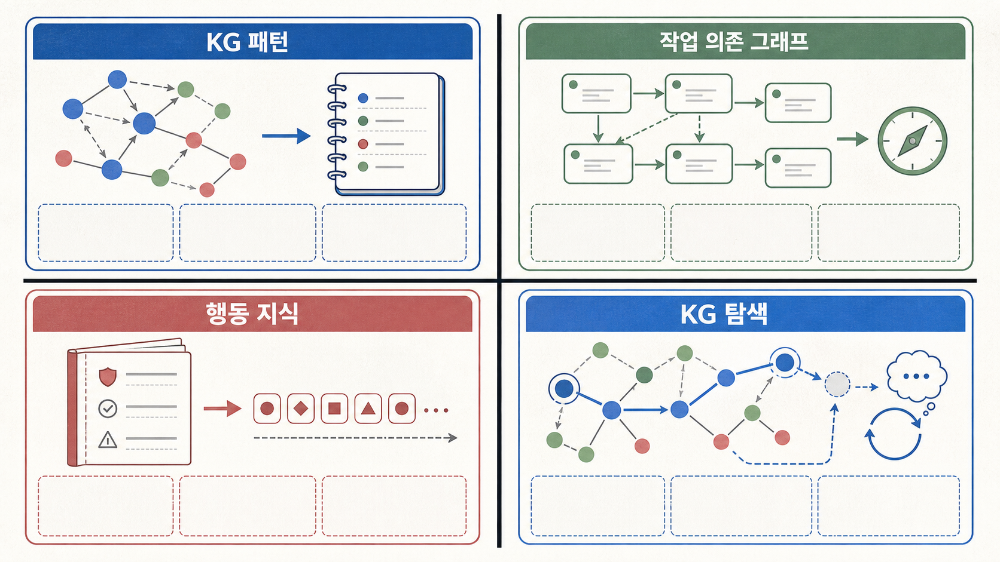
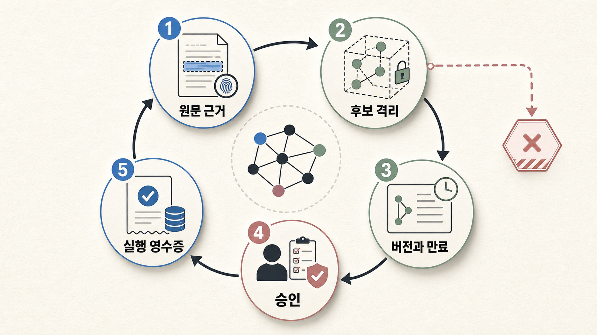
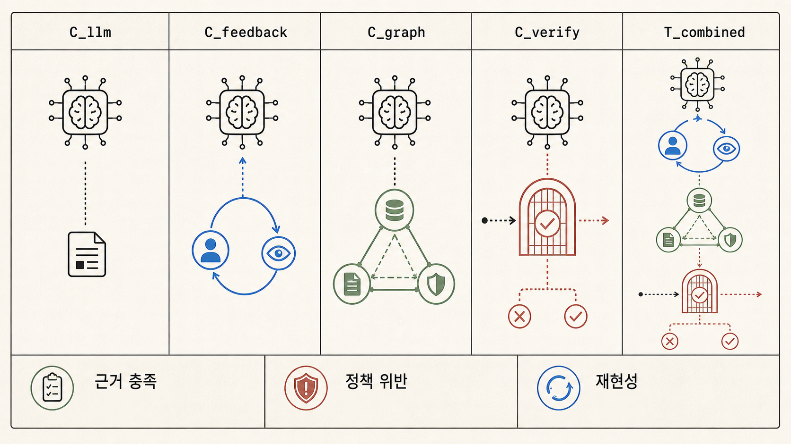

## 결론: 그래프의 효과는 아직 분리해 입증해야 합니다

지식그래프가 LLM보다 더 좋은 계획을 계산한다는 근거는 이 연구에 없습니다. 확인할 수 있는 것은 더 제한적입니다.

첫째, 장기·다중 제약 계획에서 LLM이 자연어로 바로 만든 계획은 실행 가능성을 보장하지 않으며, 형식화·외부 플래너·검증기를 결합하는 접근이 별도로 연구되고 있습니다.[src_001](#src-001)[src_006](#src-006)[src_007](#src-007) 둘째, KG 패턴, 하위 작업 의존 그래프, 행동 지식 같은 구조는 LLM의 검색 순서·도구 선택·행동 후보를 안내하는 방식으로 제안돼 왔습니다.[src_003](#src-003)[src_004](#src-004)[src_005](#src-005) 하지만 이 결과만으로 “지식그래프 자체가 일반적인 계획 성능이나 운영 안전성을 높인다”고 결론 낼 수는 없습니다.

따라서 이 글의 주장은 다음으로 한정합니다.

> 지식그래프는 목표, 상태, 행동, 제약과 근거를 표현하는 후보 구조가 될 수 있습니다. 효과는 그래프의 품질과 과업에 따라 달라지므로, LLM·재계획·형식 검증기와 분리해 비교해야 합니다.

이 문서는 DuckCrab이나 OpenCrab의 구현 성능을 검증하지 않았습니다. 아래 구조는 **실행 검증되지 않은 설계 가설**입니다.

앞선 [[notes/ontology-context-compiler-opencrab|문맥 컴파일러]] 글이 질문별 근거 묶음을 다뤘다면, 이 글은 그 묶음이 계획의 선행조건과 검증 의무를 어떻게 표현할지 살펴봅니다. [[notes/ontology-expertise-pack|전문성 Pack]]에서 제시한 가설·반례·다음 검사의 작업공간도 이 구조의 입력이 됩니다.

## 조사 범위와 반대 가설

문헌 범위는 PlanBench의 최초 공개일인 2022년 6월부터 2026년 7월 23일까지입니다. 다만 2026년 문헌은 그래프 불완전성의 한계를 다루는 한 편을 추가했으며, 계획 방법의 핵심 실증은 주로 2023~2025년 연구입니다. 오래된 모델의 결과는 그 시점·벤치마크에서의 증거로만 해석합니다.

반대 가설을 먼저 두었습니다.

1. 개선의 원인은 그래프가 아니라 실행 피드백, 재계획, 더 나은 도구 설명 또는 형식 검증기일 수 있습니다.
2. 그래프는 이미 정확하게 구조화된 상태·행동 모델이 주어질 때만 도움이 될 수 있습니다.
3. 그래프 제약은 유효한 새 경로를 배제하고, 오래되거나 누락된 지식은 계획을 더 나쁘게 만들 수 있습니다.
4. 짧고 저위험인 과업은 LLM과 실행 관찰만으로 충분할 수 있습니다.

검색 기록과 채택·제외 판단은 `artifacts/research_plan.json`에 보존했습니다. 동일 모델·도구·예산에서 KG만의 순증분 효과를 분리한 일반 운영 계획 연구는 이번 조사에서 확보하지 못했습니다. 그러므로 이 글은 그 효과를 실증 사실로 쓰지 않습니다.

## 1. 계획은 문장 생성보다 엄격한 문제입니다

계획에는 현재 상태, 목표, 허용 행동, 행동의 선행조건과 효과가 필요합니다. 한 단계가 가능해 보이는 것만으로 다음 단계도 가능한 것은 아닙니다. LLM+P는 자연어 문제를 PDDL 형식으로 옮긴 뒤 고전 플래너가 경로를 찾고 LLM이 다시 설명하게 하는 역할 분담을 제안했습니다.[src_002](#src-002)

PlanBench는 당시 모델의 계획 생성과 변화 추론 한계를 보여 줬고,[src_001](#src-001) 형식 검증 연구는 다중 제약 여행 계획에서 자연어 계획을 제약 충족 문제로 옮겨 검증하는 접근을 시험했습니다.[src_006](#src-006) 반면 자연어 설명이 더 현실적일수록 LLM이 완전한 형식 모델을 만드는 성능이 낮아진다는 연구도 있습니다.[src_007](#src-007)

여기서 얻을 수 있는 결론은 “모든 계획에 형식 플래너가 필요하다”가 아닙니다. 위험·비용·되돌릴 수 없음·제약 수가 커질수록, 자연어 답변과 실행 가능한 계획을 구분하고 외부 확인을 검토할 이유가 커진다는 것입니다.

## 2. 연구가 부르는 그래프는 같은 것이 아닙니다

‘그래프 기반 계획’이라는 표현 아래에는 서로 다른 구조가 섞여 있습니다. 이를 분리하지 않으면 한 연구의 개선을 다른 구조에 잘못 옮기게 됩니다.

| 연구             | 구조의 종류                 | 구조가 하는 일                            | 과업·비교 범위            | 이 글에 주는 제한적 시사점                                    |
| ---------------- | --------------------------- | ----------------------------------------- | ------------------------- | ------------------------------------------------------------- |
| Wang et al. 2024 | KG에서 얻은 패턴            | 검색 증강 QA의 단계 계획 학습 데이터 생성 | 복합 질의응답·학습된 모델 | KG가 계획 학습 재료가 될 수 있음                              |
| Wu et al. 2024   | 하위 작업 의존 그래프와 GNN | 작업 경로·하위그래프 선택                 | 언어 에이전트의 작업 계획 | 의존관계를 명시해 탐색할 수 있음. KG 증거는 아님              |
| Zhu et al. 2025  | 행동 지식 베이스를 텍스트화 | 가능한 행동과 순서 제약, 일부 미세조정    | HotpotQA·ALFWorld         | 행동 규칙이 잘못된 순서를 줄일 수 있음. KG의 독립 효과는 아님 |
| Chen et al. 2024 | KG 위 적응적 탐색           | 하위 목표, 경로 탐색, 메모리·반성         | KG 질의응답               | 재검색·반성의 기여를 그래프와 분리해야 함                     |

Wang 연구와 Zhu 연구는 일부 저자·연구 조직이 겹치며, Wu 연구는 지식그래프가 아닌 작업 그래프를 다룹니다. 따라서 이 표는 서로 독립된 재현 증거가 아니라 **서로 다른 구조적 접근의 지도**입니다.[src_003](#src-003)[src_004](#src-004)[src_005](#src-005)



## 3. 그래프를 쓴다면 ‘계획 계약’으로 좁혀야 합니다

운영·조사 에이전트에서 유용할 수 있는 질문은 “그래프를 넣을까?”보다 “계획에 필요한 어떤 사실을 어떤 책임으로 표현할까?”입니다. 다음은 검증할 설계 가설입니다.

```text
질문
  → QueryPlan: 목표·필수 근거·제약·금지 행동
  → Evidence / Graph / 문서에서 현재 상태와 후보 관계 수집
  → InvestigationBundle: 가설·반례·행동·선행조건·미지 조립
  → LLM: 조건부 계획과 다음 관찰 제안
  → Validator 또는 domain planner: 권한·근거·형식 제약 확인
  → 승인된 실행 또는 보류
```

이 구조에서 그래프가 맡을 수 있는 일은 세 가지입니다.

- 상태·행동·정책·근거 사이의 관계를 명시적으로 저장합니다.
- 계획 후보가 확인해야 할 선행조건과 반대 근거를 찾아오는 질의 표면을 제공합니다.
- 사용한 근거, 그래프 버전, 정책과 승인 정보를 실행 영수증에 연결합니다.

그래프는 원인·효과를 증명하지 않고, Validator도 입력 그래프가 사실·완전·최신임을 자동 보장하지 않습니다. 형식 검증기는 주어진 모델 안에서의 제약 충족을 검사할 뿐입니다.[src_006](#src-006)[src_007](#src-007)

## 4. 가장 큰 실패 표면은 그래프 자체입니다

그래프가 누락되거나 오래됐거나 잘못 추출됐다면, LLM은 더 정돈된 형태의 잘못된 전제를 받게 됩니다. 불완전한 KG에서 KG-RAG 방법의 성능 저하와 retrieval failure가 주요 병목으로 나타난다는 최근 벤치마크 분석도 이 위험과 맞닿아 있습니다.[src_009](#src-009) 이는 운영 계획의 직접 증거는 아니지만, “그래프가 있으면 필요한 근거가 자동으로 확보된다”는 가정을 지지하지 않습니다.

최소한 다음 통제가 필요합니다.

| 위험                | 필요한 통제                                          |
| ------------------- | ---------------------------------------------------- |
| 잘못된 추출·관계    | 원문 위치와 해시, 후보 격리, 사람 또는 결정론적 검사 |
| 오래된 상태·정책    | 버전, 유효 기간, 만료와 재검증 조건                  |
| 권한 없는 변경      | proposal·validation·promotion·승인 분리              |
| 과도한 제약         | 예외 경로, 보류, 사람 검토와 반례 탐색               |
| 실행 뒤 상태 불일치 | 관찰 기록, 계획 버전과 실행 영수증, 재계획           |

이 통제도 구현 완료나 안전 보증이 아닙니다. 그래프를 에이전트의 실행 전제로 쓰려면 별도로 검증해야 하는 위협 모델입니다.



## 5. 효과를 주장하기 위한 최소 비교 실험

그래프가 도움이 됐다고 말하려면 모델, 도구, 입력, 토큰·시간 예산, 평가 과업을 고정하고 최소한 다음을 비교해야 합니다.

| 비교 팔      | 바뀌는 것                         | 확인할 질문                           |
| ------------ | --------------------------------- | ------------------------------------- |
| `C_llm`      | LLM 단독                          | 기본 계획 품질과 실패 유형은 무엇인가 |
| `C_feedback` | 실행 관찰·재계획만 추가           | 피드백 자체가 만든 이득은 얼마인가    |
| `C_graph`    | 그래프 기반 상태·근거·제약만 추가 | 구조가 회수·선행조건 확인을 바꾸는가  |
| `C_verify`   | 형식 검증기·플래너만 추가         | 검증기가 막은 오류는 무엇인가         |
| `T_combined` | 그래프+피드백+검증기              | 조합의 이득과 비용이 분리 가능한가    |

측정값은 성공률만으로 부족합니다. 각 행동의 근거·선행조건·권한 충족률, 정책 위반, 보류의 적절성, 그래프 누락·오래됨으로 인한 오류, 재계획 뒤 재현성, 지연시간·도구 호출·사람 검토 비용을 함께 기록해야 합니다.



## 결론

지식그래프는 LLM 계획의 만능 해답이 아닙니다. 잘 관리된 그래프라면 목표·상태·행동·제약·근거를 연결하는 계획 계약을 표현할 수 있습니다. 하지만 개선이 그래프 때문인지 피드백·재계획·검증기 때문인지, 그래프가 최신·완전·권한 있는지, 제약이 좋은 경로를 막지 않는지는 별도로 확인해야 합니다.

따라서 11번 글은 “그래프가 계획을 계산한다”가 아니라, **LLM이 계획하기 전에 무엇을 알고 확인해야 하는지를 구조화하고 그 구조의 효과를 실험으로 분리하는 방법**을 설명하는 글이 되어야 합니다.

## 출처

1. <a id="src-001"></a>Valmeekam, K. et al. (2023). [PlanBench: An Extensible Benchmark for Evaluating Large Language Models on Planning and Reasoning about Change](https://arxiv.org/abs/2206.10498). NeurIPS 2023.
2. <a id="src-002"></a>Liu, B. et al. (2023). [LLM+P: Empowering Large Language Models with Optimal Planning Proficiency](https://arxiv.org/abs/2304.11477).
3. <a id="src-003"></a>Wang, J. et al. (2024). [Learning to Plan for Retrieval-Augmented Large Language Models from Knowledge Graphs](https://aclanthology.org/2024.findings-emnlp.459/). Findings of EMNLP 2024.
4. <a id="src-004"></a>Wu, X. et al. (2024). [Can Graph Learning Improve Planning in LLM-based Agents?](https://neurips.cc/virtual/2024/poster/94464). NeurIPS 2024.
5. <a id="src-005"></a>Zhu, Y. et al. (2025). [KnowAgent: Knowledge-Augmented Planning for LLM-Based Agents](https://aclanthology.org/2025.findings-naacl.205.pdf). Findings of NAACL 2025.
6. <a id="src-006"></a>Hao, Y. et al. (2025). [Large Language Models Can Solve Real-World Planning Rigorously with Formal Verification Tools](https://aclanthology.org/2025.naacl-long.176/). NAACL 2025.
7. <a id="src-007"></a>Huang, C., & Zhang, L. (2025). [On the Limit of Language Models as Planning Formalizers](https://aclanthology.org/2025.acl-long.242/). ACL 2025.
8. <a id="src-009"></a>[What Breaks Knowledge Graph based RAG? Benchmarking and Empirical Analysis](https://aclanthology.org/2026.eacl-long.114.pdf). EACL 2026.
