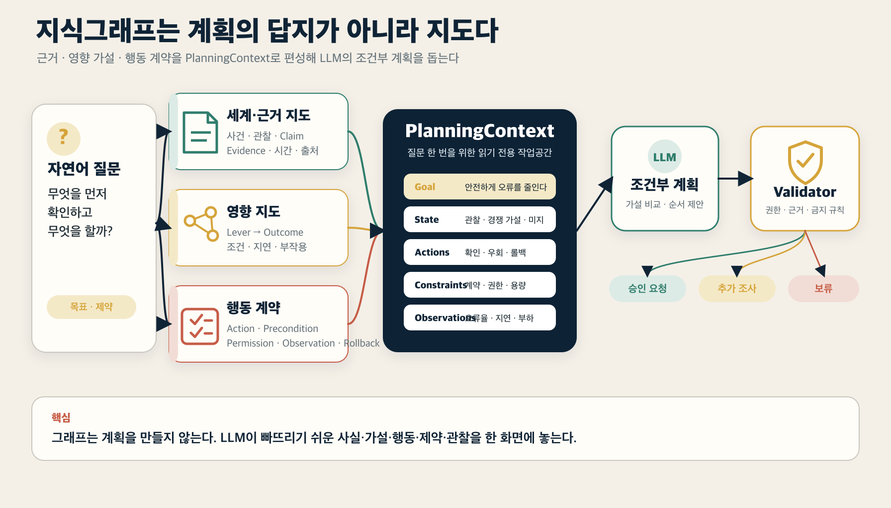
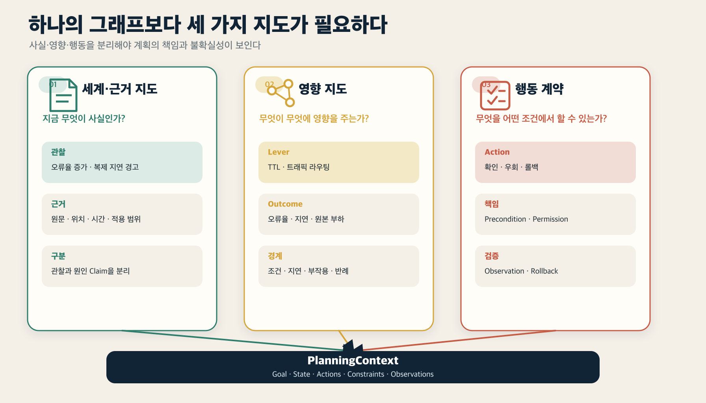
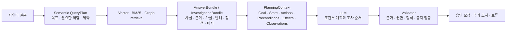
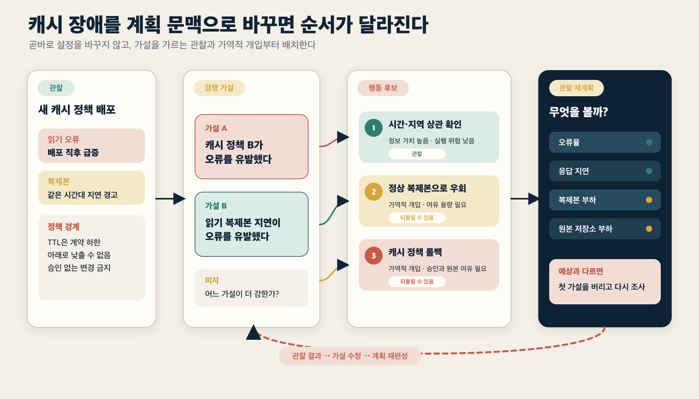
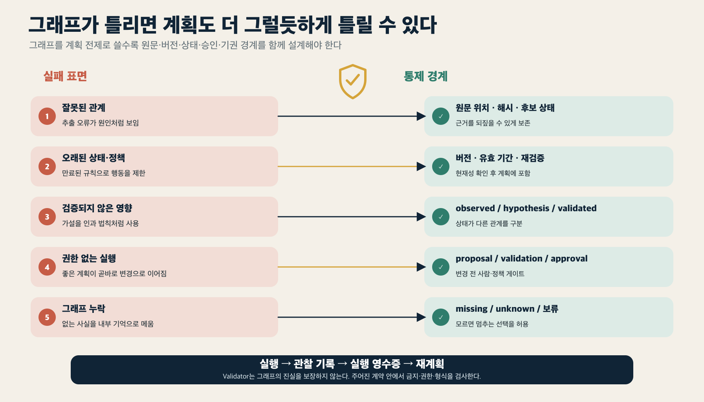

> [!summary] 한 문장 결론
> 지식그래프는 계획을 대신 계산하는 장치라기보다, LLM이 **현재 무엇이 사실인지, 무엇을 바꿀 수 있는지, 어떤 조건과 위험을 확인해야 하는지** 놓치지 않도록 계획 재료를 구조화하는 외부 지도에 가깝습니다.

캐시 정책을 바꾼 직후 읽기 오류가 급증했다고 해보겠습니다. LLM에게 로그와 장애 보고서를 건네고 “어떻게 대응해야 할까?”라고 물으면 그럴듯한 답은 금방 나옵니다.

> TTL을 낮추거나 이전 설정으로 롤백하고, 복제 지연을 확인하세요.

틀린 말은 아닙니다. 하지만 실제 계획으로 쓰기에는 빠진 것이 많습니다.

- TTL을 낮추는 조치가 고객 계약이나 데이터 최신성 정책에 어긋나지 않는가?
- 오류의 원인이 캐시 정책인지, 읽기 복제본의 지연인지 먼저 구분해야 하지 않는가?
- 롤백 전에 확인할 지표와 승인 권한은 무엇인가?
- 트래픽을 우회했을 때 비용과 부하가 어디로 이동하는가?
- 조치가 효과가 있었는지 어떤 관찰로 판단하고, 실패하면 어디까지 되돌릴 것인가?

관련 문서를 잘 찾는 것과 실행 가능한 계획을 만드는 것은 다른 문제입니다. 계획에는 문서 요약보다 더 엄격한 구조가 필요합니다.

앞선 [[notes/ontology-context-compiler-opencrab|9번 글]]에서는 자연어 질문을 `QueryPlan`으로 바꾸고, 검색 결과를 근거·정책·경로·누락이 포함된 `AnswerBundle`로 조립하는 문맥 컴파일러를 살펴봤습니다. [[notes/ontology-expertise-pack|10번 글]]에서는 시니어 엔지니어의 판단 재료를 가설·반례·결정·실패·다음 검사까지 포함한 전문성 Pack으로 확장했습니다.

이번 글은 그다음 단계입니다.

> 그렇게 모은 판단 재료를 LLM이 **무엇을 먼저 확인하고, 어떤 행동을 어떤 조건에서 시도하며, 무엇을 관찰할지** 정하는 계획 문맥으로 바꿀 수 있을까요?

## 1. 계획은 문장을 길게 쓰는 일이 아닙니다

계획에는 최소한 현재 상태, 목표, 허용된 행동, 행동의 선행조건, 예상 효과와 관찰 기준이 필요합니다. 한 단계가 가능해 보인다고 해서 다음 단계까지 가능한 것은 아닙니다.

PlanBench는 당시 LLM이 계획 생성과 상태 변화 추론에서 겪는 한계를 보여줬고,[src_001](#src-001) LLM+P는 자연어 문제를 PDDL로 옮긴 뒤 고전 플래너가 경로를 찾도록 역할을 나눴습니다.[src_002](#src-002) 이후 연구에서도 자연어 계획을 제약 만족 문제로 검증하거나 외부 검증 도구와 결합하는 접근이 이어졌습니다.[src_006](#src-006) 동시에 현실적인 자연어 문제를 완전한 형식 모델로 옮기는 일 자체가 어렵다는 한계도 보고됐습니다.[src_007](#src-007)

여기서 얻을 결론은 “모든 계획을 PDDL로 바꿔야 한다”가 아닙니다. 위험과 비용이 커질수록 **좋은 문장**과 **실행 가능한 계획**을 구분해야 한다는 뜻입니다.

```text
좋은 설명
= 무엇을 하면 좋을지 말한다

실행 가능한 계획
= 현재 상태와 제약을 확인하고
  가능한 행동을 고른 뒤
  예상 효과·부작용·관찰·롤백까지 연결한다
```

지식그래프가 도움을 줄 수 있는 지점도 바로 여기에 있습니다. 그래프가 최종 계획을 계산하는 것이 아니라, 계획에 필요한 관계를 LLM이 빠뜨리지 않도록 보여주는 것입니다.

## 2. 하나의 그래프보다 세 가지 지도가 필요합니다

‘그래프 기반 계획’이라는 말 아래에는 서로 다른 구조가 섞이기 쉽습니다. 이 글에서 필요한 구조는 세 층으로 나누는 편이 명확합니다.

| 지도           | 답하는 질문                        | 담는 정보                                                                | 주의할 점                                       |
| -------------- | ---------------------------------- | ------------------------------------------------------------------------ | ----------------------------------------------- |
| 세계·근거 지도 | 지금 무엇이 사실인가?              | 사건, 상태, 문서, 관찰, Claim, Evidence, 시간, 출처                      | 검색된 사실과 해석을 구분해야 함                |
| 영향 지도      | 무엇이 무엇에 영향을 줄 수 있는가? | Lever, Outcome, 영향 방향, 조건, 지연, 부작용, 반례                      | 영향 관계를 검증된 인과 법칙으로 과장하면 안 됨 |
| 행동 계약      | 무엇을 어떤 조건에서 할 수 있는가? | Action, precondition, permission, expected effect, observation, rollback | 그래프에 적혔다고 자동 실행 가능한 것은 아님    |



### 세계·근거 지도

첫 번째 지도는 도메인의 현재 상태를 읽습니다.

```text
배포 A
→ 캐시 정책 B를 적용함
→ 읽기 오류가 증가함
→ 특정 지역에서만 발생함
→ 같은 시점에 복제 지연 경고가 있었음
```

여기서 중요한 것은 `오류가 증가했다`는 관찰과 `캐시 정책이 원인이다`라는 주장을 다른 타입으로 두는 것입니다. 출처와 시점, 적용 범위도 함께 남겨야 합니다.

### 영향 지도

두 번째 지도는 조절 가능한 변수와 결과 사이의 가설을 표현합니다.

```text
TTL 감소
→ 오래된 데이터 노출 가능성은 낮출 수 있음
→ 원본 저장소 부하는 높일 수 있음

읽기 트래픽 우회
→ 오류율은 낮출 수 있음
→ 지연시간과 비용은 높일 수 있음
```

이 관계는 정답표가 아닙니다. 어떤 조건에서 관찰됐는지, 반례가 있었는지, 효과가 얼마나 늦게 나타나는지 붙은 **영향 가설**입니다.

### 행동 계약

세 번째 지도는 행동 가능성을 표현합니다.

```text
Action: 캐시 정책 롤백
Precondition: 이전 설정이 유효하고 복구 가능함
Permission: 운영 승인 필요
Expected effect: 배포 이후 증가한 오류 감소
Observation: 오류율·캐시 적중률·원본 부하
Rollback: 새 정책 재적용 또는 단계적 복원
```

행동 계약은 워크플로를 딱딱하게 고정하는 레일이 아닙니다. LLM이 계획할 때 확인해야 할 책임을 명시하는 구조입니다.

## 3. AnswerBundle은 PlanningContext로 다시 편성됩니다

9번 글의 문맥 컴파일러는 질문에 필요한 근거를 찾고 조립합니다. 계획 질문에서는 한 단계가 더 필요합니다. 같은 자료를 목표와 행동 중심으로 다시 편성해야 합니다.



각 단계의 책임은 다릅니다.

- `Semantic QueryPlan`은 무엇을 찾아야 하는지 정합니다.
- `AnswerBundle` 또는 `InvestigationBundle`은 판단에 필요한 사실과 근거를 묶습니다.
- `PlanningContext`는 그 재료를 목표·상태·행동·제약·관찰 구조로 재배열합니다.
- LLM은 여러 행동 후보를 비교하고 조사와 행동의 순서를 제안합니다.
- Validator는 권한, 필수 근거, 금지 규칙과 형식 제약을 확인합니다.

`PlanningContext`는 새로운 정본 저장소가 아닙니다. 질문 한 번을 위해 만들어지는 읽기 전용 작업공간입니다. 같은 Pack이라도 질문이 장애 진단인지, 변경 승인인지, 비용 최적화인지에 따라 다른 계획 문맥이 만들어질 수 있습니다.

KG 패턴을 이용해 복합 질의의 계획 데이터를 만드는 연구,[src_003](#src-003) 하위 작업 의존 그래프로 에이전트의 작업 경로를 고르는 연구,[src_004](#src-004) 행동 지식을 이용해 잘못된 실행 순서를 줄이려는 연구[src_005](#src-005)도 구조화된 관계가 LLM의 계획 후보와 순서를 안내할 수 있다는 가능성을 보여줍니다. 다만 이 연구들이 모두 같은 종류의 KG를 쓰거나, 그래프만의 독립 효과를 증명하는 것은 아닙니다.

## 4. 캐시 장애를 계획 문맥으로 바꿔봅시다

처음 사례로 돌아가겠습니다.

```text
관찰 1: 새 캐시 정책 배포 후 읽기 오류가 증가했다.
관찰 2: 같은 시간대에 일부 복제본의 지연 경고가 있었다.
과거 사례 1: TTL을 늘린 뒤 오래된 데이터가 노출된 적이 있다.
과거 사례 2: 비슷한 오류의 실제 원인은 복제 지연이었다.
정책: 고객 계약 때문에 TTL을 특정 값 아래로 낮출 수 없다.
미지: 현재 오류가 캐시 정책과 복제 지연 중 어느 쪽에 더 강하게 연결되는지 모른다.
```

단순 검색 결과라면 이 항목들이 관련도 순으로 나열될 수 있습니다. 계획 문맥은 이들을 다음처럼 묶습니다.

```yaml
goal:
  primary: 읽기 오류를 안전하게 줄인다
  guardrails:
    - 데이터 최신성 계약을 위반하지 않는다
    - 원본 저장소 과부하를 만들지 않는다

current_state:
  recent_change: 캐시 정책 B 배포
  observed_outcome: 읽기 오류 증가
  competing_hypotheses:
    - 캐시 정책 B가 오류를 유발했다
    - 읽기 복제본 지연이 오류를 유발했다
  unknowns:
    - 오류 요청과 복제 지연 구간의 상관
    - 롤백 시 원본 저장소 여유 용량

candidate_actions:
  - action: 복제 지연과 오류 요청의 시간·지역 상관 확인
    type: observe
    preconditions:
      - 요청 추적과 복제 지표 접근 가능
    expected_value:
      - 두 가설을 빠르게 구분

  - action: 영향 지역의 읽기 트래픽을 정상 복제본으로 우회
    type: reversible_intervention
    preconditions:
      - 우회 대상의 여유 용량 확인
      - 운영 권한 확보
    expected_effects:
      - 복제 지연이 원인일 경우 오류 감소
    side_effects:
      - 지연시간과 대상 복제본 부하 증가 가능
    observations:
      - 오류율
      - 응답 지연
      - 대상 복제본 부하
    rollback:
      - 기존 라우팅 복원

  - action: 캐시 정책 B 롤백
    type: reversible_intervention
    preconditions:
      - 이전 설정의 유효성 확인
      - 롤백 후 원본 부하 수용 가능
      - 변경 승인
    expected_effects:
      - 캐시 정책이 원인일 경우 오류 감소
    side_effects:
      - 적중률 저하와 원본 부하 증가 가능
    observations:
      - 오류율
      - 캐시 적중률
      - 원본 저장소 부하

forbidden_or_blocked:
  - action: TTL을 계약 하한 아래로 낮춤
    reason: 고객 데이터 최신성 정책 위반
```

이 구조를 받은 LLM은 곧바로 TTL부터 바꾸는 대신, 정보 가치가 높고 위험이 낮은 확인부터 제안할 수 있습니다.

```text
1. 오류 요청과 복제 지연의 시간·지역 상관을 확인한다.
2. 상관이 강하면 영향 지역의 트래픽을 가역적으로 우회한다.
3. 우회 뒤 오류율과 대상 복제본 부하를 관찰한다.
4. 상관이 약하고 배포 변경과 오류가 강하게 연결되면 캐시 정책 롤백을 검토한다.
5. 어느 조치든 계약 하한, 승인 권한, 원본 부하를 먼저 검사한다.
6. 관찰 결과가 예상과 다르면 첫 가설을 유지하지 않고 다음 조사로 넘어간다.
```

여기서 그래프가 계획을 만든 것은 아닙니다. 그래프와 Pack은 LLM이 비교할 상태, 가설, 행동, 제약과 관찰을 제공했습니다. 계획의 선택과 설명은 LLM이 맡고, 권한과 금지 규칙은 Validator가 확인합니다.



### 직접 계획 순서를 바꿔 보기

아래 탐색기에서 복제 지연과 캐시 정책의 근거 강도, 정상 복제본과 원본 저장소의 여유 용량, 계약과 승인 조건을 바꿔보세요. 같은 장애라도 어떤 근거와 제약이 주어지느냐에 따라 첫 행동과 차단되는 행동이 달라집니다.

<iframe
  id="kg-planning-scenario-lab"
  class="interactive-visualization-frame"
  src="/attachments/kg-guided-llm-planning/kg-planning-scenario-lab.htm"
  title="캐시 장애 KG Planning 시나리오 실험실"
  loading="lazy"
  scrolling="no"
  sandbox="allow-scripts allow-same-origin"
  style="height:920px"
></iframe>

[시나리오 실험실을 새 화면에서 크게 열기](/attachments/kg-guided-llm-planning/kg-planning-scenario-lab.htm)

> [!note] 설명용 상대값
> 탐색기의 수치와 우선순위는 계획 구조를 설명하기 위한 상대값입니다. 측정된 장애 대응 성능이나 실제 운영 임계값, 자동 실행 권고가 아닙니다.

## 5. LLM과 Validator의 역할을 섞지 않아야 합니다

현실적인 구조는 역할 분담입니다.

| LLM이 맡기 좋은 일              | 결정론적으로 확인할 일      |
| ------------------------------- | --------------------------- |
| 질문의 목표와 모호한 표현 해석  | 접근 권한과 승인 주체       |
| 경쟁 가설과 행동 후보 비교      | 필수 precondition 존재 여부 |
| 정보 가치가 높은 다음 관찰 제안 | 정책상 금지된 행동          |
| 부작용과 대안의 자연어 설명     | 수치·단위·형식 제약         |
| 결과에 따른 조건부 재계획       | Pack·정책·그래프 버전 일치  |

LLM에게 모든 것을 맡기면 계획이 자연스럽지만 검증하기 어렵습니다. 반대로 모든 것을 고전 플래너나 규칙 엔진으로 옮기면 실제 업무의 모호함과 예외를 표현하기 어렵습니다.

따라서 강한 보장이 필요한 작은 영역은 결정론적으로 검사하고, 가설 비교와 설명, 추가 조사 설계는 LLM에 맡기는 편이 현실적입니다.

## 6. 그래프가 틀리면 계획도 더 그럴듯하게 틀릴 수 있습니다

지식그래프를 계획의 전제로 쓰면 그래프 자체가 새로운 실패 표면이 됩니다.

- 관계가 잘못 추출됐을 수 있습니다.
- 현재 상태나 정책이 오래됐을 수 있습니다.
- 필요한 사실이 그래프에 없을 수 있습니다.
- 영향 가설을 검증된 인과 법칙으로 오해할 수 있습니다.
- 강한 제약이 새로운 유효 경로를 막을 수 있습니다.

불완전한 KG에서 KG-RAG의 성능 저하와 retrieval failure가 주요 병목으로 나타난다는 분석도 “그래프가 있으면 필요한 근거가 자동으로 확보된다”는 가정을 경계하게 합니다.[src_008](#src-008) 이는 운영 계획의 직접 실증은 아니지만, 그래프의 불완전성이 하류 판단에 영향을 준다는 점은 같습니다.



최소한 다음 경계가 필요합니다.

| 위험                | 통제                                            |
| ------------------- | ----------------------------------------------- |
| 잘못된 관계         | 원문 위치·해시·출처와 후보 상태 보존            |
| 오래된 상태·정책    | 버전·유효 기간·재검증 조건                      |
| 검증되지 않은 영향  | `observed`, `hypothesis`, `validated` 상태 구분 |
| 권한 없는 실행      | proposal·validation·approval·promotion 분리     |
| 실행 뒤 상태 불일치 | 관찰 기록·실행 영수증·재계획                    |
| 그래프 누락         | `missing`과 `unknown`을 명시하고 보류 허용      |

Validator도 입력 그래프가 참이고 완전하다는 사실까지 보장하지는 않습니다. 형식 검증기는 주어진 모델 안에서 제약이 충족되는지 확인할 뿐입니다.[src_006](#src-006)[src_007](#src-007)

## 7. KG의 효과는 다른 도움과 분리해 측정해야 합니다

지식그래프를 붙인 뒤 계획이 좋아졌다고 해서 원인이 반드시 그래프인 것은 아닙니다. 더 좋은 도구 설명, 실행 피드백, 재계획, Validator가 함께 들어갔다면 각각의 효과를 나눠봐야 합니다.

| 비교 조건       | 추가되는 것              | 확인할 질문                          |
| --------------- | ------------------------ | ------------------------------------ |
| LLM 단독        | 기본 모델과 도구         | 기본 계획의 실패 유형은 무엇인가?    |
| LLM + 피드백    | 실행 관찰과 재계획       | 관찰 자체가 만든 개선은 얼마인가?    |
| LLM + KG        | 상태·근거·영향·행동 관계 | 선행조건과 제약 회수가 좋아지는가?   |
| LLM + Validator | 형식·권한·정책 검사      | 어떤 오류를 결정론적으로 막는가?     |
| 전체 결합       | KG + 피드백 + 검증       | 품질 향상과 비용을 분리할 수 있는가? |

성공률만 보면 부족합니다. 근거가 있는 행동 비율, 선행조건 누락, 정책 위반, 적절한 보류, 그래프 누락으로 인한 오류, 재계획의 재현성, 지연시간과 사람 검토 비용을 함께 봐야 합니다.

이 글은 DuckCrab이나 OpenCrab의 계획 성능을 실증한 결과가 아닙니다. 제안한 구조는 구현하고 비교해야 할 설계 가설입니다. 다만 무엇을 구현하고 무엇을 따로 측정해야 하는지는 이전보다 선명해집니다.

## 결론: 그래프는 계획의 답지가 아니라 계획의 지도입니다

지식그래프가 LLM보다 더 좋은 계획을 자동으로 계산해 주는 것은 아닙니다. 잘 설계된 그래프와 Pack은 대신 다음 질문에 답할 재료를 제공합니다.

```text
현재 무엇이 사실인가?
무엇이 아직 가설인가?
무엇을 바꿀 수 있는가?
어떤 조건과 권한이 필요한가?
어떤 부작용이 가능한가?
무엇을 관찰해야 하는가?
실패하면 어떻게 되돌릴 것인가?
```

9번 글의 문맥 컴파일러가 질문에 필요한 근거를 조립하고, 10번 글의 전문성 Pack이 결정·실패·가설·반례를 보존했다면, KG 기반 Planning은 그 재료를 **목표·상태·행동·제약·관찰의 계획 문맥**으로 다시 편성합니다.

이 구조가 있어도 처음 만든 계획이 정답이라는 보장은 없습니다. 관찰이 예상과 다르거나 반대 근거가 나타나면 가설과 계획을 다시 고쳐야 합니다.

다음 글에서는 한 번 검색하고 답을 끝내는 대신, **가설 → 근거 → 반례 → 추가 검색 → 수정 → 종료 또는 보류**를 반복하는 조사 루프를 살펴보겠습니다.

## 출처

1. <a id="src-001"></a>Valmeekam, K. et al. (2023). [PlanBench: An Extensible Benchmark for Evaluating Large Language Models on Planning and Reasoning about Change](https://arxiv.org/abs/2206.10498). NeurIPS 2023.
2. <a id="src-002"></a>Liu, B. et al. (2023). [LLM+P: Empowering Large Language Models with Optimal Planning Proficiency](https://arxiv.org/abs/2304.11477).
3. <a id="src-003"></a>Wang, J. et al. (2024). [Learning to Plan for Retrieval-Augmented Large Language Models from Knowledge Graphs](https://aclanthology.org/2024.findings-emnlp.459/). Findings of EMNLP 2024.
4. <a id="src-004"></a>Wu, X. et al. (2024). [Can Graph Learning Improve Planning in LLM-based Agents?](https://neurips.cc/virtual/2024/poster/94464). NeurIPS 2024.
5. <a id="src-005"></a>Zhu, Y. et al. (2025). [KnowAgent: Knowledge-Augmented Planning for LLM-Based Agents](https://aclanthology.org/2025.findings-naacl.205.pdf). Findings of NAACL 2025.
6. <a id="src-006"></a>Hao, Y. et al. (2025). [Large Language Models Can Solve Real-World Planning Rigorously with Formal Verification Tools](https://aclanthology.org/2025.naacl-long.176/). NAACL 2025.
7. <a id="src-007"></a>Huang, C., & Zhang, L. (2025). [On the Limit of Language Models as Planning Formalizers](https://aclanthology.org/2025.acl-long.242/). ACL 2025.
8. <a id="src-008"></a>[What Breaks Knowledge Graph based RAG? Benchmarking and Empirical Analysis](https://aclanthology.org/2026.eacl-long.114.pdf). EACL 2026.
