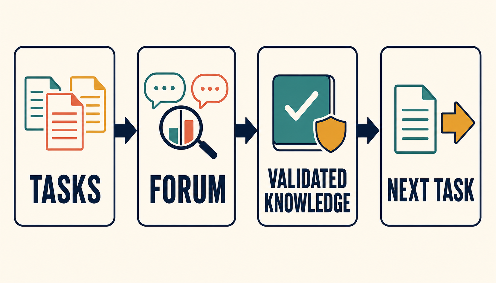
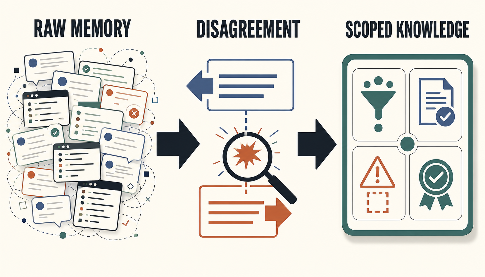
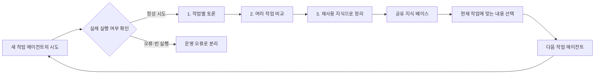
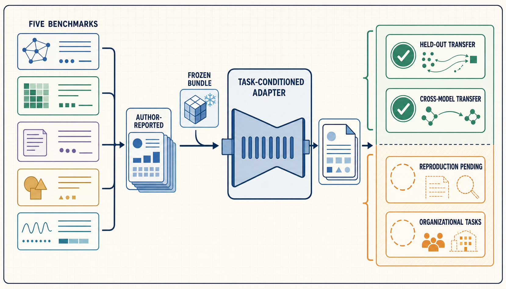
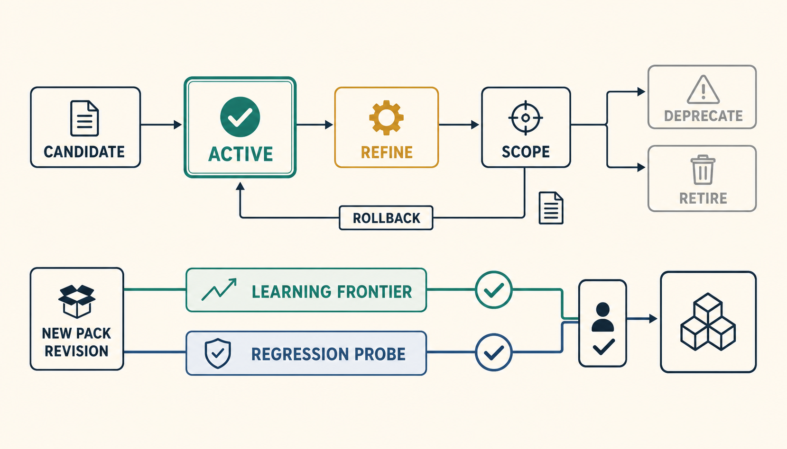
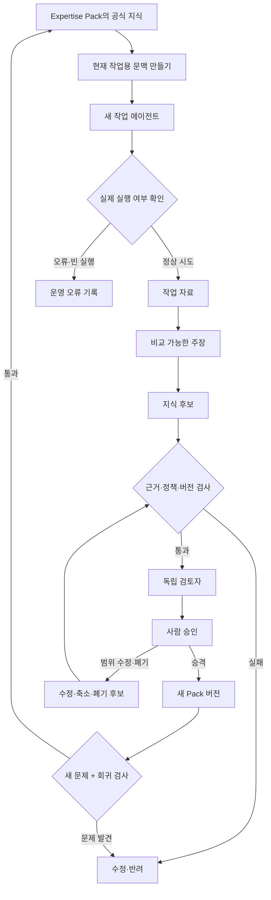

> [!summary] 핵심 결론
> 에이전트가 일을 마칠 때 대화 기록만 남기면 다음 에이전트가 같은 실수를 반복하기 쉽습니다. **어떤 조건에서 통했는지, 무엇이 실패했는지, 근거와 반례는 무엇인지, 다시 어떻게 확인할지를 함께 정리한 외부 지식**을 남겨야 경험이 재사용됩니다.

새로 온 학생에게 선배들의 단체 채팅방 전체를 보여준다고 생각해 보겠습니다. 정보는 많지만, 어떤 조언이 맞는지 판단하기 어렵습니다. 오래된 규칙과 최근 규칙이 섞이고, 농담이나 시행착오도 정답처럼 보일 수 있습니다.

AI 에이전트도 비슷합니다. 과거 대화와 실행 로그를 모두 저장하면 기억은 늘어나지만, 다음 문제가 생깁니다.

- 실제로 검증된 결과와 단순한 추측이 섞입니다.
- 서로 다른 상황에서 나온 조언이 충돌합니다.
- 프로그램 오류가 작업 전략의 실패처럼 기록될 수 있습니다.
- 오래된 정책이나 버전에서 얻은 경험이 다시 사용될 수 있습니다.
- 짧게 요약하는 과정에서 적용 조건과 반례가 빠질 수 있습니다.

그래서 중요한 질문은 “에이전트가 얼마나 많이 기억하는가”보다 **“한 번의 작업이 다음 작업에 어떤 지식을 남기는가”**입니다.

[[notes/pi-agent-duckcrab-dag-harness|14번 글]]에서는 한 요청을 여러 조사 작업으로 나누고, 실패한 부분만 다시 실행하는 구조를 살펴봤습니다. 이번 글에서는 한 작업이 끝난 뒤 남은 경험을 다음 작업에서도 쓸 수 있는 공유 지식으로 바꾸는 방법을 다룹니다.

2026년 7월 공개된 **Knowledge-Centric Self-Improvement(KSI)** 연구는 작업을 푸는 에이전트를 고정한 채, 여러 에이전트가 남긴 경험을 공유 지식 베이스에서 정리하는 방식을 제안했습니다.[src_001](#src-001) [src_002](#src-002)

> [!important] 이 글에서 자주 쓰는 말
>
> - **작업 에이전트(solver):** 실제 문제를 푸는 프로그램입니다.
> - **revision:** 문서나 지식 묶음의 버전입니다. 이 글에서는 이해하기 쉽게 “버전”이라고 함께 씁니다.
> - **promotion:** 검토를 마친 지식 후보를 공식 지식으로 올리는 과정입니다. 여기서는 “승격”이라고 부릅니다.
> - **context compilation:** 저장된 지식 가운데 현재 작업에 필요한 부분만 골라 짧게 정리하는 과정입니다. 여기서는 “작업 문맥 만들기”라고 설명합니다.

> [!important] 근거 범위
> 아래 성능 수치는 논문과 공식 프로젝트가 보고한 결과입니다. 공개 코드와 문서 구조는 확인했지만, 이 작업공간에서 벤치마크를 다시 실행해 같은 수치를 재현하지는 않았습니다. KSI를 DuckCrab Expertise Pack에 연결하는 부분은 구현과 비교 실험이 필요한 설계안입니다.

## 경험을 많이 저장하는 것과 지식을 만드는 것은 다릅니다



다음 기록은 과거에 있었던 일을 보여 줍니다.

```text
테스트 전체 실행이 오래 걸렸다.
```

하지만 다음 작업에서 바로 행동으로 옮기기에는 정보가 부족합니다. 왜 오래 걸렸는지, 일부 테스트만 먼저 실행해도 되는지, 예외는 무엇인지 알 수 없기 때문입니다.

아래처럼 조건과 확인 방법을 함께 적으면 재사용 가능한 지식 후보에 가까워집니다.

```text
변경 범위가 좁고 관련 테스트를 정확히 고를 수 있을 때는
관련 테스트를 먼저 실행해 빠르게 문제를 찾는다.

인증·권한·저장 계층처럼 여러 기능에 영향을 주는 공통 모듈은
최종 병합 전에 전체 통합 테스트를 실행한다.
```

두 번째 기록에는 다음 작업자가 판단할 재료가 들어 있습니다.

- 언제 이 방법을 쓸 수 있는가?
- 어떤 경우에는 쓰면 안 되는가?
- 결과가 맞는지 무엇으로 확인하는가?
- 어느 작업과 버전에서 얻은 교훈인가?

최소한의 지식 후보에는 다음 정보가 필요합니다.

```text
statement                 # 주장 또는 조언
applicability_conditions  # 적용 조건
supporting_evidence       # 지지 근거
counterevidence           # 반대 근거와 반례
rejected_hypotheses       # 확인했지만 틀렸던 가설
verification_method       # 다시 확인하는 방법
source_task_refs          # 이 지식이 나온 작업
base_revision             # 기준이 된 지식 버전
runtime_status            # 실제 실행이 정상적으로 이루어졌는지
status                    # 후보, 검토 중, 승인, 폐기 등의 상태
```

여기서 `runtime_status`는 작업 프로그램이 실제로 움직였는지 나타냅니다. 공식 KSI 런타임은 출력도 없고 도구 호출도 없는데 성공으로 표시된 응답을 `silent_failure`, 즉 **겉으로만 성공한 빈 실행**으로 다시 분류합니다.[src_008](#src-008) 이런 기록은 성공 경험으로 사용하지 않고 운영 오류로 따로 보관해야 합니다.

## KSI는 경험을 세 단계로 정리합니다

KSI의 중심 과정은 Task-Level Forum, Cross-Task Forum, Distillation입니다. 이름은 어렵지만 학교의 공동 연구 노트에 비유하면 이해하기 쉽습니다.[src_001](#src-001) [src_002](#src-002)



### 1단계: 한 작업에서 얻은 판단 재료를 남깁니다

**Task-Level Forum**은 한 문제를 풀면서 무엇이 통했고 무엇이 실패했는지 정리하는 작업별 토론 공간입니다.

여기에는 최종 답만 적지 않습니다.

- 도움이 된 행동과 그 결과
- 실패하거나 기각된 가설
- 작업에만 해당하는 조건
- 아직 확인하지 못한 대안
- 다음에 실행할 검사

이 단계의 기록은 공식 지식이 아닙니다. 여러 작업과 비교할 수 있도록 모아 둔 **작업 자료(Task Artifact)**입니다.

### 2단계: 여러 작업을 비교해 적용 범위를 찾습니다

**Cross-Task Forum**에서는 서로 다른 작업에서 나온 주장을 비교합니다.

같은 문장이 여러 번 등장했다고 곧바로 일반 규칙이 되는 것은 아닙니다. 같은 모델이 같은 자료를 보고 같은 실수를 반복했을 수도 있습니다. 따라서 다음 질문을 확인해야 합니다.

- 어떤 환경과 지식 버전에서 같은 결과가 나왔는가?
- 같은 결론을 뒷받침한 출처가 서로 독립적인가?
- 반대 사례와 실패 사례는 무엇인가?
- 결과 차이를 만든 조건이나 도구는 무엇인가?
- 기존 지식과 겹치거나 충돌하는가?

KSI는 주장의 관계를 다음처럼 구분합니다.[src_002](#src-002)

```text
SUPPORTS     지지한다
CONTRADICTS  반박한다
REFINES      더 정확한 조건으로 다듬는다
DUPLICATES   같은 내용을 반복한다
SCOPED_TO    특정 상황에만 적용된다
```

불일치가 보이면 억지로 하나의 결론으로 합치지 않습니다. 어떤 조건에서 결과가 달라졌는지 찾는 단서로 사용합니다.

### 3단계: 다음 작업자가 행동할 수 있는 형태로 정리합니다

**Distillation**은 긴 기록을 짧게 줄이는 요약 작업보다 범위가 넓습니다. 다음 작업자가 바로 행동할 수 있도록 다음 항목을 골라 구조화합니다.

```text
transferable_insight       다른 작업에도 옮길 수 있는 교훈
confirmed_constraint       확인된 제약
rejected_hypothesis        틀렸다고 확인된 가설
pitfall                    자주 빠지는 함정
verification_method        결과 확인 방법
recommended_next_step      권장하는 다음 행동
```

예를 들어 “항상 관련 테스트만 먼저 실행하라”는 조언은 위험합니다. 적용 조건과 예외를 넣으면 다음처럼 바뀝니다.

```text
변경 범위가 좁고 테스트 선택 규칙이 정확할 때 관련 테스트를 먼저 실행한다.
공통 모듈을 수정했거나 영향 범위를 확신할 수 없으면 전체 테스트로 다시 확인한다.
```

### 저장된 지식 전체를 매번 보여 주지 않습니다

공식 프로젝트는 마지막 정리 단계가 현재 작업에 따라 달라진다고 설명합니다.[src_002](#src-002) 도서관의 모든 책을 책상 위에 올리는 대신, 사서가 질문과 관련된 몇 쪽을 골라 주는 방식에 가깝습니다.

공유 지식 베이스가 정확해도 선택기가 엉뚱한 항목을 고르거나, 짧게 정리하면서 예외 조건을 빼면 작업 결과는 나빠질 수 있습니다. 따라서 공식 지식의 품질과 별도로 **현재 작업용 문맥이 제대로 만들어졌는지**도 검사해야 합니다.

## 연구 결과는 가능성과 적용 범위를 함께 보여 줍니다



KSI 연구진은 추상 추론, 코딩, 터미널 작업을 포함한 다섯 벤치마크에서 10세대 동안 고정된 문제 묶음을 사용했습니다. 공식 페이지가 공개한 Haiku 4.5 기반 결과는 다음과 같습니다.[src_002](#src-002)

| 벤치마크         |  KSI 해결률 | 읽을 때 주의할 점                              |
| ---------------- | ----------: | ---------------------------------------------- |
| ARC-AGI-1        | 86.7% ± 4.2 | 연구팀 프로토콜의 세 번 실행 평균              |
| ARC-AGI-2        | 82.7% ± 6.1 | 일부 비교 기준은 한 번만 다시 실행함           |
| Polyglot         | 68.0% ± 2.0 | 선택한 문제 묶음과 비용 계산 조건에 영향받음   |
| SWE-bench Pro    | 64.0% ± 2.0 | 평가 환경과 문제 하위 집합에 영향받음          |
| Terminal-Bench 2 | 43.8% ± 3.4 | 일부 비교 수치는 순위표와 관련 논문에서 가져옴 |

연구진은 완성된 지식 묶음을 새로운 문제와 다른 모델 계열에 전달하는 실험도 진행했습니다. 공식 페이지의 모든 donor-recipient 조합에서 지식이 없는 기준선보다 평균 해결률이 높았습니다. 다만 일부 조합은 실행마다 차이가 컸고, 지식 묶음을 그대로 넣은 것이 아니라 현재 문제에 맞게 짧은 메모로 바꾸는 어댑터를 함께 사용했습니다.[src_002](#src-002)

이 결과로 확인할 수 있는 범위는 다음과 같습니다.

> 고정된 작업 에이전트와 연구팀의 실험 조건에서, 외부 공유 지식을 개선해 해결률과 비용 효율을 높이고 새로운 문제와 다른 모델로 일부 지식을 전달한 사례가 있습니다.

다음 내용은 별도 실험이 필요합니다.

- 모든 업무에서 외부 지식 방식이 프롬프트나 도구 개선보다 더 좋은가?
- 벤치마크에서 얻은 이점이 조직의 장기 문서 관리에서도 반복되는가?
- 여러 에이전트의 합의가 사실 검증을 대신할 수 있는가?
- 공개 코드를 내려받기만 하면 같은 성능을 재현할 수 있는가?

공식 저장소는 과제 기록, 다섯 벤치마크 설정, 컨테이너 실행 환경, 토론·증류 코드와 테스트를 공개합니다.[src_003](#src-003) 다만 변경 기록은 정식 버전 출시보다 `Unreleased` 항목에 업데이트가 쌓이는 형태입니다.[src_009](#src-009) 재현 실험에서는 버전 이름만 적기보다 사용한 커밋 해시를 함께 기록하는 편이 안전합니다.

## `no-memory`와 완전한 초기화는 구분해야 합니다

게임에서 힌트 기능을 껐다고 저장 파일까지 사라지는 것은 아닙니다. 에이전트 실험도 같습니다.

공식 KSI 문서의 `--no-memory` 설정은 지식 도구, 토론, 증류와 다음 세대 지식 전달을 끕니다. 그러나 과제 배정, 시도 횟수와 중단된 작업 재개를 위한 데이터베이스 상태는 유지할 수 있습니다.[src_008](#src-008)

```text
과거 지식 힌트가 없음
≠ 시도 기록이 없음
≠ 재개 상태가 없음
≠ 평가 환경이 완전히 초기화됨
```

지식의 효과를 비교할 때는 다음 상태를 따로 기록해야 합니다.

- 과거 지식 메모를 작업 에이전트에게 제공했는가?
- 이전 시도와 재개 상태를 유지했는가?
- 이전 결과물이나 최고 점수가 다음 실행에 영향을 줬는가?
- 같은 세션을 다시 사용했는가?
- 평가기가 이전 실행의 결과를 볼 수 있었는가?

이 항목을 섞으면 실제로는 저장 상태 덕분에 좋아진 결과를 지식 덕분이라고 잘못 해석할 수 있습니다.

### 프로그램 오류와 작업 전략 실패를 따로 기록합니다

공식 런타임은 정상 실행, 세션에서 복구한 실행, 프로그램 오류와 빈 성공을 구분합니다.[src_008](#src-008)

| 상태                     | 지식 정리 단계에서의 처리                    |
| ------------------------ | -------------------------------------------- |
| `success`                | 실제로 실행하고 평가한 시도                  |
| `recovered_from_session` | 복구 과정과 진단 정보를 붙인 조건부 시도     |
| `error`                  | 전략 실패와 분리해 조사할 프로그램·도구 오류 |
| `silent_failure`         | 성공 경험으로 쓰지 않는 빈 실행              |

프로그램 오류를 전략 실패로 기록하면 “이 방법은 쓰면 안 된다”는 잘못된 규칙이 생길 수 있습니다. 반대로 빈 실행을 정상 성공으로 세면 해결률과 비용이 왜곡됩니다.

### 실행 환경의 안전과 지식의 정확성은 각각 검사합니다

KSI 컨테이너는 허용된 모델 제공자를 제외한 직접 외부 통신을 제한하는 구조를 설명합니다.[src_008](#src-008) 이는 임의 통신과 데이터 유출 위험을 줄이는 장치입니다. 그러나 토론에서 사용한 근거가 사실인지까지 자동으로 보장하지는 않습니다.

그래서 두 종류의 기록을 따로 남기는 편이 좋습니다.

- **ExecutionReceipt:** 프로그램이 어떤 권한과 환경에서 무엇을 실행했는지 기록
- **KnowledgeValidationReceipt:** 지식 후보의 출처, 반례, 적용 조건과 검토 결과 기록

## Expertise Pack에는 지식의 전체 수명주기가 필요합니다



KSI의 공유 지식 베이스와 [[notes/ontology-expertise-pack|Expertise Pack]]은 비슷한 목적을 가집니다. KSI는 여러 작업의 경험을 비교하고 정리하는 절차에 집중합니다. Expertise Pack은 근거, 관계, 정책, 버전과 승인 권한을 갖춘 장기 지식 묶음입니다.

둘을 연결하면 다음 흐름을 만들 수 있습니다.



### 한 번의 성공은 바로 공식 지식이 되지 않습니다

한 작업의 기록에는 관찰, 경쟁 가설, 지지·반대 근거, 실패한 접근, 기준 버전과 검사 결과가 들어갑니다. 한 번 성공한 방법은 다른 환경에서도 통하는지 확인한 뒤 지식 후보로 올립니다.

여러 작업 에이전트가 같은 말에 동의해도 출처가 하나라면 독립 근거가 아닙니다. 같은 모델과 같은 문서를 사용한 반복 동의는 같은 오류를 여러 번 복사할 수 있습니다.

### 지식 후보는 기준 버전과 선택 규칙을 기록합니다

지식 후보를 만든 뒤 공식 Pack이나 작업 문맥 선택기가 바뀌면 후보의 전제가 오래될 수 있습니다. 후보에는 다음 정보를 함께 남겨야 합니다.

```text
target_pack_id             대상 지식 Pack
expected_base_revision     후보를 만들 때 기준으로 삼은 버전
candidate_hash             후보 내용 식별값
source_task_refs           근거가 나온 작업
source_claim_refs          연결된 주장
supporting_evidence        지지 근거
counterevidence            반례와 반대 근거
applicability_conditions   적용 조건
verification_method        재검증 방법
compiler_version           작업 문맥 선택기 버전
reviewer_disposition       검토자의 승인·수정·반려 판단
```

### 새 근거가 나오면 범위를 줄이거나 폐기합니다

공식 KSI 프로젝트는 새 근거에 따라 주장을 더 구체적으로 다듬고, 적용 범위를 좁히거나 폐기할 수 있다고 설명합니다.[src_002](#src-002)

```text
candidate 후보
→ active 사용 중
→ refined 더 정확하게 수정
→ scoped 적용 범위 축소
→ deprecated 새 작업에서는 사용 중단
→ retired 완전히 퇴역
→ 필요하면 이전 버전으로 rollback
```

단순히 삭제하면 왜 쓰지 않게 되었는지 알 수 없습니다. `supersedes`, `refines`, `scoped_from`, `retired_because`, `last_validated_at` 같은 관계를 남기면 과거 판단을 확인하고 되돌리기 쉬워집니다.

### 새 문제를 푸는 검사와 예전 능력을 지키는 검사를 함께 실행합니다

새 지식은 아직 해결하지 못한 문제를 푸는 데 도움이 되어야 합니다. 동시에 이전 버전에서 잘 풀던 문제를 망가뜨리지 않아야 합니다.

- **learning frontier:** 아직 해결하지 못했거나 근거가 부족한 문제
- **regression probe set:** 이전 버전에서 해결했거나 안전·정책 규칙을 대표하는 문제

새 Pack 버전은 두 집합을 모두 통과한 뒤 공식 지식으로 사용합니다.

## 첫 구현은 작은 반복 작업에서 시작합니다

[[notes/ontology-senior-investigation-harness|13번 글]]과 14번 글의 구조를 한꺼번에 범용 자기개선 플랫폼으로 확장하면 검증할 항목이 너무 많아집니다. 먼저 반복해서 실패하는 한 종류의 작업을 고르고, 고정된 작업 흐름과 구조화된 기록이 실제로 도움이 되는지 확인하는 편이 안전합니다.

권장 순서는 다음과 같습니다.

```text
질문과 금지 행동을 고정한다
→ 새 작업 에이전트가 실행한다
→ 실행 상태를 정상화한다
→ 작업 자료를 남긴다
→ 같은 작업의 경험을 비교한다
→ 여러 작업의 공통점과 차이를 찾는다
→ 지식 후보를 만든다
→ 근거 검사와 사람 승인을 거친다
→ 현재 작업에 맞는 짧은 문맥을 만든다
→ 필요할 때만 더 복잡한 조사 DAG를 사용한다
```

첫 버전에는 다음 일곱 가지 계약이 있으면 됩니다.

1. 질문, 지식 범위, 금지 행동과 예산을 정하는 `QuestionContract`
2. 근거, 반례, 실패, 검증과 실행 상태를 남기는 `TaskArtifact`
3. 여러 작업의 주장을 관계로 연결하는 `ForumClaim`
4. 적용 조건과 반례를 가진 `DistilledKnowledgeCandidate`
5. 근거, 정책과 기준 버전을 확인하는 후보 검사
6. 사람이 승인하거나 수정·반려하는 승격 경계
7. 공식 Pack과 현재 작업용 메모의 차이를 기록하는 `ContextCompilerReceipt`

초기 버전에서는 다음 기능을 제외하는 편이 좋습니다.

- 제한 없는 개인 장기 메모리
- 모든 질문을 자동으로 복잡한 DAG로 바꾸는 기능
- 에이전트 합의만으로 공식 지식을 자동 승인하는 기능
- 프로그램 오류와 작업 실패를 섞어 학습하는 방식
- 원문과 검사 기록으로 돌아갈 수 없는 과도한 요약

Pi는 실행과 작업 자료 정리를 맡고, DuckCrab은 Pack, 근거, 정책, 버전, 후보와 승격 권한을 맡을 수 있습니다. 실행을 담당하는 계층과 지식의 의미를 관리하는 계층을 분리하면 실패 원인을 찾기 쉬워집니다.

## 비교 실험은 성공률 외의 변화도 측정합니다

같은 모델, 도구와 예산을 사용하고 다음 작업자에게 전달하는 과거 정보의 형태만 바꾸면 각 방식의 효과를 비교할 수 있습니다.

| 조건 | 다음 작업자에게 전달하는 정보                          |
| ---- | ------------------------------------------------------ |
| A    | 지식 메모 없음. 시도·재개 상태 유지 여부는 별도로 기록 |
| B    | 과거 작업 기록을 검색해 제공                           |
| C    | 전체 증류 지식을 그대로 제공                           |
| D    | 현재 작업과 관련된 증류 지식만 짧은 메모로 제공        |
| E    | D + 적용 조건·반례·검증 방법·기준 버전                 |
| F    | E + 검토와 승격을 거친 새 Pack 버전                    |
| G    | F + 실행 기록·문맥 선택 기록·검색 방식                 |
| H    | G + 새 문제 집합·회귀 검사·수정·폐기 기록              |

평가할 항목은 성공률만으로 충분하지 않습니다.

- 같은 실패와 기각 가설이 다시 나타나는 비율
- 중요한 주장에 근거와 반례가 붙어 있는 비율
- 너무 넓게 일반화한 지식과 오래된 조언의 사용률
- 작업 문맥을 만들 때 예외 조건이 빠지는 비율
- 프로그램 오류와 작업 실패를 잘못 분류한 비율
- 다른 모델과 새 세션에서도 지식이 도움이 되는지
- Pack 버전 변경 전후의 회귀 검사 통과율
- 폐기한 지식이 다시 노출되는 비율
- 사람 검토 시간, 토큰, 도구 사용량과 처리 시간

새 지식이 성공률을 높이면서 반복 실패, 근거 누락, 잘못된 일반화와 회귀도 줄일 때 지식 중심 접근의 효과를 확인할 수 있습니다.

## 인접 연구는 다른 저장 단위도 제안합니다

외부 지식만 개선하는 방식 외에도 경험을 남기는 여러 방법이 연구되고 있습니다.

- **Mem²Evolve**는 경험 메모리와 새 도구·전문 에이전트 같은 실행 자산을 함께 발전시키는 방향을 제안합니다.[src_004](#src-004)
- **XSkill**은 짧은 행동 경험과 전체 작업 계획에 쓰는 기술을 분리합니다.[src_005](#src-005)
- **Rethinking Continual Experience Internalization**은 잘못된 경험을 반복해서 내재화하면 능력이 무너질 수 있다고 보고, 원시 실행 기록보다 원칙 수준의 경험을 단계별로 넣는 방법을 검토합니다.[src_006](#src-006)
- **Steve-Evolving**은 성공 경험을 사용 조건과 확인 기준이 붙은 기술로 정리하고, 실패 경험은 위험을 피하는 규칙으로 남깁니다.[src_007](#src-007)

연구마다 모델과 벤치마크가 다르므로 숫자를 한 줄로 세워 순위를 매기기 어렵습니다. 공통된 질문은 **어떤 경험을 어느 정도로 추상화하고, 어떤 적용 조건과 함께 남길 것인가**입니다.

## 결론: 다음 작업자가 믿을 수 있는 유산을 만듭니다

KSI가 보여 주는 핵심 아이디어는 간단합니다. 작업 에이전트가 바뀌더라도, 검증 가능한 외부 지식은 남길 수 있습니다.

그 지식은 다음 과정을 거칩니다.

1. 한 작업에서 성공, 실패와 반례를 기록합니다.
2. 여러 작업을 비교해 적용 조건을 찾습니다.
3. 다음 작업자가 행동할 수 있는 지식 후보로 정리합니다.
4. 출처, 정책과 기준 버전을 검사합니다.
5. 사람이 승인한 뒤 새 Pack 버전으로 승격합니다.
6. 현재 작업에 필요한 부분만 골라 짧은 문맥으로 제공합니다.
7. 새 문제와 이전 문제를 함께 시험해 회귀를 막습니다.

[[notes/iterative-investigation-refutation-loop|12번 글]]은 한 질문 안에서 가설과 반례를 반복해 답을 개선하는 방법을 다뤘습니다. 14번 글은 그 조사 의무를 실행 가능한 작업 구조로 옮겼습니다. 이번 구조는 여러 작업이 남긴 자료를 비교해 **근거, 조건, 반례와 버전이 붙은 공유 지식**으로 유지합니다.

다만 승격된 지식이 다음 작업에 전달되는 과정에서도 조건과 반례가 빠질 수 있습니다. [[notes/context-compilation-regression|16번 글]]은 Pack 전체의 정확성과 실제 에이전트가 읽는 Context Bundle의 정확성을 나눠 검사하는 방법을 이어서 다룹니다.

모델과 실행 프로그램은 바뀔 수 있습니다. 그 변화 속에서도 조직의 판단을 다시 사용하려면, 지식은 많은 기억보다 정확한 출처와 적용 조건, 검증 방법을 갖춰야 합니다.

## 출처

- <a id="src-001"></a> Wang, X. J. et al. (2026). [Knowledge-Centric Self-Improvement](https://arxiv.org/abs/2607.19592). arXiv:2607.19592.
- <a id="src-002"></a> Wang et al. (2026). [Knowledge-Centric Self-Improvement — Official Project Page](https://recursive-knowledge.github.io/knowledge-centric-self-improvement/). 방법, 저자 보고 벤치마크 결과, 새로운 문제·다른 모델로의 지식 전달 결과.
- <a id="src-003"></a> recursive-knowledge. [KSI — Knowledge-centric Self-Improvement](https://github.com/recursive-knowledge/KSI). 공개 코드, 작업 기록, 벤치마크 설정, 빠른 시작 안내와 테스트 구조.
- <a id="src-004"></a> Cheng, Z. et al. (2026). [Mem²Evolve: Towards Self-Evolving Agents via Co-Evolutionary Capability Expansion and Experience Distillation](https://aclanthology.org/2026.acl-long.952/). ACL 2026.
- <a id="src-005"></a> Jiang, G. et al. (2026). [XSkill: Continual Learning from Experience and Skills in Multimodal Agents](https://openreview.net/forum?id=AjP1yvCyoG). ICML 2026.
- <a id="src-006"></a> Chen, J. et al. (2026). [Rethinking Continual Experience Internalization for Self-Evolving LLM Agents](https://arxiv.org/abs/2606.04703). arXiv:2606.04703.
- <a id="src-007"></a> Xie, Z. et al. (2026). [Steve-Evolving: Open-World Embodied Self-Evolution via Fine-Grained Diagnosis and Dual-Track Knowledge Distillation](https://arxiv.org/abs/2603.13131). arXiv:2603.13131.
- <a id="src-008"></a> recursive-knowledge. (2026). [KSI Knowledge-centric Runtime Architecture](https://recursive-knowledge.github.io/KSI/architecture/). 기준일 2026-07-28.
- <a id="src-009"></a> recursive-knowledge. (2026). [KSI Changelog](https://github.com/recursive-knowledge/KSI/blob/main/CHANGELOG.md). 기준일 2026-07-28.
- <a id="src-010"></a> recursive-knowledge. (2026). [KSI Frequently Asked Questions](https://recursive-knowledge.github.io/KSI/faq/). 기준일 2026-07-28.
