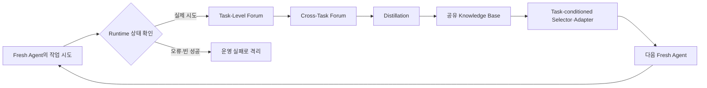
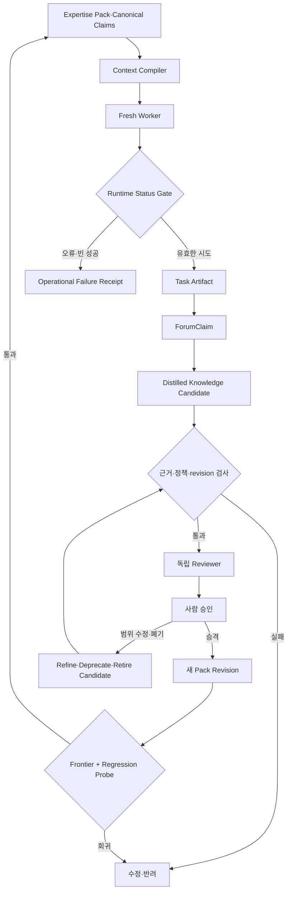

> [!summary] 핵심 결론
> 에이전트 자기개선의 안전한 기본 단위는 영속적인 에이전트 정체성이 아니라, **근거·적용 조건·반례·검증 방법·기준 revision이 붙은 외부 지식 후보**일 수 있습니다. 다만 작업 기록, 토론에서 나온 주장, 증류된 후보, 정본 승격과 현재 작업용 문맥을 서로 다른 상태로 관리해야 합니다.

새 에이전트가 이전 작업을 기억하지 못해 같은 실수를 반복한다고 가정해 보겠습니다. 가장 쉬운 해결책은 과거 대화와 실행 로그를 모두 저장해 다음 에이전트가 검색하게 하는 것입니다. 저장량은 빠르게 늘어나지만, 곧 다른 문제가 생깁니다.

- 어느 기록이 실제로 검증된 결과인지 알기 어렵습니다.
- 같은 조언이 서로 다른 조건에서 충돌합니다.
- 런타임 오류가 작업 전략의 실패처럼 남을 수 있습니다.
- 오래된 정책과 revision에서 얻은 경험이 현재 작업에 다시 노출됩니다.
- 요약 과정에서 반례와 적용 범위가 사라질 수 있습니다.

문제는 에이전트가 매번 새로 시작한다는 사실 자체가 아닙니다. **한 번의 작업이 다음 작업에 남길 유산을 제대로 만들지 못했다는 점**에 있습니다.

[[notes/pi-agent-duckcrab-dag-harness|14번 글]]에서는 한 요청 안에서 근거·반례·정책 조사를 작업 DAG로 나누고, 실패한 부분만 다시 실행하는 구조를 살펴봤습니다. 이번 글은 그다음 질문을 다룹니다.

> 한 작업에서 얻은 성공·실패·기각 가설과 검증 방법을, 다음 fresh worker가 다시 쓸 수 있는 공유 지식으로 어떻게 바꿀 수 있을까요?

2026년 7월 공개된 **Knowledge-Centric Self-Improvement(KSI)**는 solver를 generic·stateless·disposable하게 유지하고, 여러 에이전트가 남긴 작업 경험을 공유 지식 베이스에서 큐레이션하는 방식을 제안했습니다.[src_001](#src-001) [src_002](#src-002) 이 글은 KSI의 결과를 소개하는 데서 그치지 않고, 기존 [[notes/ontology-expertise-pack|Expertise Pack]]과 Pi 실행 호스트, DuckCrab의 근거·revision·promotion 경계에 연결해 어떤 구현 계약이 필요한지 살펴봅니다.

> [!important] 이 글의 근거 범위
> KSI 수치와 transfer 결과는 원 논문과 공식 프로젝트가 보고한 값입니다. 공개 구현과 문서 구조는 확인했지만, 이 작업공간에서 quickstart나 benchmark를 독립 재현하지 않았습니다. KSI 구조를 DuckCrab Expertise Pack에 연결한 부분은 구현·비교 실험이 필요한 설계 제안입니다.

## 자기개선은 무엇이 다음 작업까지 남는지를 선택하는 일입니다

AI 에이전트의 자기개선은 하나의 기술이 아닙니다. 모델 가중치, 프롬프트, 하네스, 개인 메모리, 외부 지식 중 **어느 기판을 지속적으로 바꿀 것인가**를 선택하는 설계 문제입니다.

| 개선 기판            | 다음 작업까지 남는 것                | 장점                          | 주요 위험                         |
| -------------------- | ------------------------------------ | ----------------------------- | --------------------------------- |
| 모델 가중치          | 파라미터에 내재화된 능력             | 넓은 범위에서 즉시 사용       | 학습 비용, 회귀, 원인 추적 어려움 |
| 프롬프트             | 지시문·예시·루브릭                   | 적용과 롤백이 쉬움            | 비대화, 지시 충돌, 과적합         |
| 하네스·워크플로      | 도구·단계·검증·스케줄링              | 실행 행동을 직접 통제         | 특정 환경 결합, 구조 복잡도       |
| 개인 에이전트 메모리 | 한 agent·session의 경험              | 연속성과 개인화               | 오염, 오래된 기억, 정체성 결합    |
| 외부 큐레이션 지식   | 여러 worker가 공유하는 타입화된 주장 | 버전 관리, 감사, 모델 간 이전 | 큐레이션 비용, 잘못된 승격·선택   |

KSI는 마지막 기판을 분리해 시험합니다. solver agent는 고정하고, 세대 사이에서 개선되는 것은 작업 기록, forum post와 distilled bundle로 구성된 외부 지식입니다.[src_001](#src-001) [src_002](#src-002)

이 선택은 단순한 성능 최적화가 아닙니다. 어디에 개선을 저장하느냐에 따라 변경 권위와 감사 방식도 달라집니다.

- 모델·프롬프트·코드를 개선하면 변경 권위가 실행기 가까이에 놓입니다.
- 외부 지식을 개선하면 candidate, validation, revision, approval과 rollback을 별도 계층으로 나눌 수 있습니다.
- 실행 호스트와 모델을 바꿔도 같은 지식 artifact를 비교하고 재검증할 수 있습니다.

즉, **자기개선 기판의 선택은 거버넌스 경계의 선택**이기도 합니다.

## 메모리와 재사용 가능한 지식은 다릅니다


메모리는 과거에 무엇이 있었는지를 보존합니다. 재사용 가능한 지식은 한 단계 더 나아가 **어떤 조건에서 무엇을 해야 하며, 왜 그런지, 무엇이 반례이고, 어떻게 다시 검증할지**를 설명합니다.

예를 들어 다음 기록은 메모리입니다.

```text
테스트 전체 실행이 오래 걸렸다.
```

반면 다음 문장은 지식 후보에 가깝습니다.

```text
변경 범위가 좁고 관련 테스트를 결정론적으로 선택할 수 있을 때는
관련 테스트를 빠른 피드백 게이트로 먼저 실행한다.

다만 인증·권한·저장 계층처럼 영향 반경이 큰 공통 모듈은
최종 병합 전에 전체 통합 게이트를 실행한다.
```

두 번째 문장에는 적용 조건, 반례가 될 수 있는 위험 영역과 재검증 시점이 있습니다. 여기에 어떤 작업과 출처에서 나온 판단인지, 어느 Pack revision을 기준으로 했는지까지 붙어야 장기적으로 감사할 수 있습니다.

최소 지식 후보는 다음 정보를 가져야 합니다.

```text
statement
applicability_conditions
supporting_evidence
counterevidence
rejected_hypotheses
verification_method
source_task_refs
base_revision
runtime_status
status
```

`runtime_status`도 중요합니다. 에이전트가 아무 출력이나 도구 호출을 남기지 않았는데 실행기가 성공으로 표시했다면, 그 기록을 성공 경험으로 증류해서는 안 됩니다. 공식 KSI 아키텍처는 출력·도구 호출·토큰 활동이 없는 성공형 응답을 `silent_failure`로 다시 분류합니다.[src_008](#src-008) 경험을 지식으로 바꾸기 전에 **실제 시도가 있었는지**부터 확인해야 한다는 뜻입니다.

## KSI는 경험을 세 단계로 큐레이션합니다

KSI의 핵심 흐름은 Task-Level Forum, Cross-Task Forum, Distillation입니다. 공식 프로젝트 설명을 함께 보면, 저장된 bundle을 현재 작업에 맞게 선택하고 짧은 memo로 바꾸는 단계까지 포함해야 전체 전달 구조가 보입니다.[src_002](#src-002) [src_008](#src-008)



### Task-Level Forum은 결론보다 판단 재료를 남깁니다

Task-Level Forum은 한 작업에서 무엇이 통했고 무엇이 실패했는지를 local evidence로 정리합니다. 원시 대화 전체를 그대로 보관하는 것과 다릅니다.

- 재사용 가능성이 있는 주장
- 효과가 있었던 행동과 검증 방법
- 실패하거나 기각된 가설
- 작업에만 해당하는 조건과 제약
- 아직 확인하지 못한 대안과 다음 검사

Task-Level Forum의 산출물은 정본 지식이 아니라, 여러 작업을 비교하기 위한 **Task Artifact와 ForumClaim 후보**입니다.

### Cross-Task Forum은 빈도보다 적용 범위를 찾습니다

여러 작업에서 같은 문장이 반복됐다고 일반 법칙이 되지는 않습니다. 동일한 모델이 같은 문서를 보고 같은 오류를 반복했을 수도 있고, 표면적으로 비슷하지만 실제 정책과 환경이 다른 작업일 수도 있습니다.

Cross-Task Forum은 다음을 비교해야 합니다.

- 어떤 task, 환경과 Pack revision에서 같은 주장이 반복됐는가?
- 같은 결론을 만든 출처가 실제로 독립적인가?
- 반대 사례와 실패 사례는 무엇인가?
- 차이를 만든 조건·정책·도구는 무엇인가?
- 기존 Pack 주장과 중복되는가, 충돌하는가, 범위를 좁히는가?

KSI 프로젝트는 disagreement를 noise가 아니라 evidence로 다룹니다. 한 작업의 과도한 결론을 다른 작업의 반례가 좁히고, distillation은 양쪽을 남겨 적용 범위를 더 구체적으로 만듭니다.[src_002](#src-002)

따라서 충돌은 평균 내거나 삭제하기보다 다음 관계로 보존하는 편이 낫습니다.

```text
SUPPORTS
CONTRADICTS
REFINES
DUPLICATES
SCOPED_TO
```

**불일치는 합의를 방해하는 장애물이 아니라 숨은 적용 조건을 찾는 센서**가 됩니다.

### Distillation은 요약이 아니라 선택·범위화·타입화입니다

Distillation은 여러 문장을 짧게 줄이는 작업이 아닙니다. 다음 작업이 행동에 옮길 수 있도록 통찰과 제약, 반례, 함정과 검증 방법을 타입화하는 과정입니다.

```text
transferable_insight
confirmed_constraint
rejected_hypothesis
pitfall
verification_method
recommended_next_step
```

“항상 X를 하라”보다 “조건 A와 정책 B가 충족되고 반례 C가 없을 때 X를 먼저 시도하며, 결과 Y로 재검증한다”가 더 길지만 안전합니다. 지식의 품질은 문장의 짧음보다 **재사용할 때 오해할 여지를 얼마나 줄였는가**로 평가해야 합니다.

### 저장된 지식과 이번 작업이 보는 문맥은 다릅니다

공식 프로젝트 페이지는 최종 distillation이 task-dependent라고 설명합니다. held-out transfer에서도 frozen bundle을 그대로 prompt에 붙이는 대신, task-conditioned adapter가 현재 작업용 짧은 memo로 바꿉니다.[src_002](#src-002)

```text
Knowledge Base
≠ 이번 agent가 보는 문맥

전체 Distilled Bundle
≠ 현재 task용 memo

지식의 존재
≠ 올바른 지식의 선택
```

정본 지식이 정확해도 selector가 무관한 항목을 고르거나 adapter가 caveat를 빼면 행동은 악화될 수 있습니다. 따라서 knowledge promotion과 별도로 **context compilation regression**을 측정해야 합니다.

## 저자 보고 결과는 가능성을 보여 주지만 보편 법칙은 아닙니다


KSI 저자들은 ARC-AGI-1, ARC-AGI-2, Polyglot, SWE-bench Pro, Terminal-Bench 2의 다섯 benchmark에서 10세대 동안 고정 task pool을 사용했습니다. 공식 프로젝트가 공개한 Haiku 4.5 기반 주 결과는 다음과 같습니다.[src_002](#src-002)

| Benchmark        | KSI solve rate | 해석 경계                                 |
| ---------------- | -------------: | ----------------------------------------- |
| ARC-AGI-1        |    86.7% ± 4.2 | 연구팀 프로토콜의 세 seed 평균            |
| ARC-AGI-2        |    82.7% ± 6.1 | 일부 비교 baseline은 단일 재실행          |
| Polyglot         |    68.0% ± 2.0 | 선택된 task pool과 비용 산정 조건에 의존  |
| SWE-bench Pro    |    64.0% ± 2.0 | 평가 환경과 subset에 의존                 |
| Terminal-Bench 2 |    43.8% ± 3.4 | 비교 행 일부는 leaderboard·관련 논문 수치 |

공식 프로젝트는 held-out task와 다른 LLM 계열로 frozen bundle을 전달한 결과도 보고합니다. 모든 donor-recipient 조합의 저자 보고 평균이 no-knowledge baseline보다 높았지만, 일부 조합은 seed 분산이 컸습니다. 그리고 이 transfer는 bundle 단독이 아니라 task-conditioned adapter와 결합된 결과입니다.[src_002](#src-002)

이 결과가 직접 지지하는 주장은 제한적입니다.

> 고정된 solver와 특정 연구 프로토콜에서 외부 큐레이션 지식만을 개선해 solve rate·비용·held-out transfer를 개선한 사례가 있습니다.

다음 주장은 아직 지지되지 않습니다.

- 외부 지식이 모든 프롬프트·하네스·메모리 개선보다 항상 낫다.
- benchmark에서 얻은 이득이 조직 정책과 장기 문서 유지보수에서도 반복된다.
- Forum의 합의가 사실 검증이나 독립 근거를 대신한다.
- 공개 코드가 있다는 사실이 이 프로젝트에서 같은 성능을 재현했다는 뜻이다.

공식 저장소에는 자체 JSON·JSONL task record, 다섯 benchmark preset, container runtime, forum·distillation·seeding 코드와 테스트가 공개되어 있습니다.[src_003](#src-003) 다만 changelog는 아직 정식 release 이력 없이 변경이 `Unreleased`에 누적되는 source-only research code라고 밝힙니다.[src_009](#src-009) 재현 실험에서는 버전 이름보다 정확한 commit hash를 고정하는 편이 안전합니다.

## `no-memory`와 `no-state`를 같은 조건으로 보면 안 됩니다

지식 중심 자기개선 실험에서 가장 쉽게 놓치는 부분은 숨은 상태 채널입니다. 공식 KSI 아키텍처의 `--no-memory`는 지식 도구, discussion, distillation과 다음 세대 seeding을 끄지만, task·attempt·resume 상태를 위한 Knowledge DB는 유지합니다.[src_008](#src-008)

```text
지식 안내 없음
≠ 실행 이력 없음
≠ 재개 상태 없음
≠ 평가기가 완전히 무상태임
```

“fresh worker + 지식 없음” 기준선을 만들 때는 다음 채널을 따로 기록해야 합니다.

- solver에게 과거 지식 memo가 주입됐는가?
- task assignment와 attempt 이력은 유지됐는가?
- 이전 artifact와 best-task state가 다음 실행에 영향을 줬는가?
- agent-scoped session이 재사용됐는가?
- evaluator가 이전 시도의 산출물을 볼 수 있었는가?

이를 분리하지 않으면 지식 효과로 보이는 개선이 실제로는 resume나 best-state 보존 효과일 수 있습니다. 자기개선 실험의 독립변수는 단순한 memory on/off가 아니라 **guidance, authoritative state, session reuse와 evaluator state의 조합**입니다.

### 런타임 실패와 작업 전략 실패도 분리해야 합니다

공식 runtime은 정상 시도, session에서 복구한 시도, 실행 오류와 빈 성공을 다른 상태로 구분합니다.[src_008](#src-008)

| 런타임 상태              | 지식 큐레이션에서의 처리                     |
| ------------------------ | -------------------------------------------- |
| `success`                | 평가기가 점수화한 실제 시도                  |
| `recovered_from_session` | 복구 경로와 진단을 포함한 조건부 시도        |
| `error`                  | 작업 전략 실패와 분리할 runtime·adapter 실패 |
| `silent_failure`         | 성공 경험으로 사용하지 않고 운영 실패로 격리 |

런타임 오류를 전략 실패로 오인하면 “이 접근은 틀렸다”는 가짜 guardrail이 만들어질 수 있습니다. 반대로 빈 성공을 정상 시도로 포함하면 성공률과 비용이 왜곡됩니다. `RuntimeReceipt`는 지식 후보의 선택 필드가 아니라 입력 품질 계약에 가깝습니다.

### 실행 격리와 지식 검증은 서로 다른 안전 축입니다

공식 KSI 컨테이너는 provider allowlist를 제외한 직접 외부 통신을 제한하는 구조를 설명합니다.[src_008](#src-008) 이는 데이터 유출과 임의 통신 위험을 줄이지만, forum 주장에 사용한 근거가 사실인지까지 보장하지는 않습니다.

- 안전한 컨테이너 안에서도 같은 원 출처를 독립 근거로 오인할 수 있습니다.
- 정확한 지식이라도 실행기가 과도한 권한을 가지면 위험합니다.
- task-conditioned memo가 반례를 빼면 정본이 맞아도 행동이 틀릴 수 있습니다.

따라서 `ExecutionReceipt`와 `KnowledgeValidationReceipt`를 별도로 보존해야 합니다.

## Expertise Pack 자기개선에는 승격뿐 아니라 수명주기가 필요합니다


KSI의 shared knowledge base와 [[notes/ontology-expertise-pack|Expertise Pack]]은 닮았지만 자동으로 같지는 않습니다. KSI의 forum과 distillation은 지식 생성 절차입니다. Expertise Pack은 근거, 관계, 정책, revision과 promotion 권위를 가진 장기 정본 후보입니다.

두 구조를 연결하면 다음 루프가 됩니다.



### Task Artifact는 정본이 아닙니다

한 요청의 작업 기록에는 관찰, 경쟁 가설, 지지·반대 근거, 기각 접근, Pack revision, 정책과 validation receipt가 들어갑니다. 한 번 성공했다고 장기 Pack에 바로 합치지 않습니다.

### ForumClaim은 합의가 아니라 비교 가능한 주장입니다

여러 worker가 동의했다는 사실은 독립 근거가 아닙니다. 같은 모델, 같은 문서와 비슷한 prompt에서 나온 반복 동의는 하나의 오류 근원을 여러 번 복제할 수 있습니다.

### Candidate는 기준 revision과 compiler 계약을 가져야 합니다

후보가 만들어진 뒤 Pack이나 context compiler가 바뀌면 후보의 전제가 오래됐을 수 있습니다. candidate에는 다음 정보가 필요합니다.

```text
target_pack_id
expected_base_revision
candidate_hash
source_task_refs
source_claim_refs
supporting_evidence
counterevidence
applicability_conditions
verification_method
compiler_version
reviewer_disposition
```

지식 자기개선의 위험은 환각만이 아닙니다. 좋은 후보도 오래된 revision 위에서 만들어졌거나 새 compiler가 caveat를 누락하면 현재 정본을 오염시킬 수 있습니다. **Promotion latency와 compilation drift**를 별도로 감시해야 합니다.

### 지식은 추가만 하지 않고 수정·범위화·폐기해야 합니다

공식 KSI 프로젝트는 큐레이션 과정에서 주장이 추가될 뿐 아니라, 새 근거에 따라 더 구체적으로 수정되고 적용 범위가 좁아지며 폐기될 수 있다고 설명합니다.[src_002](#src-002)

```text
candidate
→ active
→ refined 또는 scoped
→ deprecated
→ retired
→ 필요하면 rollback
```

각 변경에는 `supersedes`, `refines`, `scoped_from`, `retired_because`, `last_validated_at`과 대체 주장 관계가 필요합니다. 지식을 단순 삭제하면 왜 더 이상 쓰면 안 되는지 알 수 없고, 과거 판단을 감사하거나 되돌리기도 어렵습니다.

### 학습 대상과 회귀 대상은 별도 집합이어야 합니다

공식 아키텍처의 기본 설정은 해결되지 않은 과제를 다음 세대의 주된 대상으로 좁히는 흐름을 설명합니다.[src_008](#src-008) 새 문제에 집중하는 데는 유리하지만, 이전에 해결한 과제가 새 지식 revision에서도 계속 해결되는지는 다른 질문입니다.

```text
과거에 한 번 해결함
≠ 현재 Pack revision에서도 해결 가능함

미해결 과제의 진전
≠ 해결 과제의 회귀 없음
```

따라서 두 평가 집합을 분리해야 합니다.

- **learning frontier:** 아직 해결되지 않았거나 근거가 부족해 새 지식을 만드는 과제
- **regression probe set:** 이전 revision에서 해결됐거나 중요한 정책·안전 불변조건을 대표하는 과제

새 Pack revision은 frontier의 성능을 높이는 동시에 regression probe를 통과해야 합니다. 지식 중심 자기개선에는 **학습 대상 선택과 회귀 대상 선택이라는 두 개의 커리큘럼**이 필요합니다.

## 첫 구현은 범용 자기개선 플랫폼보다 작아야 합니다

14번 글의 DAG를 곧바로 범용 엔진으로 확대하기보다, 먼저 고정된 fresh-worker workflow와 구조화 artifact가 실제로 반복 실패를 줄이는지 확인하는 편이 낫습니다.

권장 순서는 다음과 같습니다.

```text
QuestionContract
→ fixed fresh-worker workflow
→ Runtime normalization
→ TaskArtifact
→ Task-Level Forum
→ Cross-Task Forum
→ DistilledKnowledgeCandidate
→ 검증·사람 승인·Pack Promotion
→ task-conditioned Context Compilation
→ 필요할 때만 Investigation DAG·부분 수리
```

첫 버전에서 구현할 계약은 일곱 개면 충분합니다.

1. 질문, Pack 범위, 금지 행동과 예산을 고정하는 `QuestionContract`
2. 근거·반례·실패·검증과 runtime 상태를 남기는 `TaskArtifact`
3. 여러 작업의 주장을 관계로 연결하는 `ForumClaim`
4. 적용 조건과 반례를 가진 `DistilledKnowledgeCandidate`
5. 근거·정책·revision을 검사하는 candidate validation
6. 사람이 승인하거나 수정·반려하는 promotion 경계
7. Pack과 현재 작업 memo의 차이를 기록하는 `ContextCompilerReceipt`

첫 구현에서 제외할 항목도 명확해야 합니다.

- 에이전트 개인의 무제한 장기 메모리
- 모든 질문의 동적 DAG화
- Forum 합의에 따른 자동 정본 승격
- runtime 오류와 작업 실패를 섞은 학습
- 원문·receipt로 돌아갈 수 없는 공격적 distillation

[[notes/ontology-senior-investigation-harness|13번 글]]의 시니어 조사 구조와 연결하면 Pi는 실행과 artifact 정규화를 맡고, DuckCrab은 Pack·근거·정책·revision·candidate·promotion 권위를 맡습니다. **실행 호스트와 의미 권위를 분리해야 실패 원인과 실험 효과를 구분할 수 있습니다.**

## 비교 실험은 solve rate 하나로 끝나면 안 됩니다

지식 중심 접근의 가치를 확인하려면 같은 모델, 도구와 예산에서 전달되는 과거 정보의 형태를 단계적으로 바꿔야 합니다.

| 조건 | 다음 worker에게 제공되는 과거 지식·상태                       |
| ---- | ------------------------------------------------------------- |
| A    | 지식 memo 없음, attempt·resume 상태 유지 여부 명시            |
| B    | raw task memory 검색                                          |
| C    | 전체 distilled bundle 직접 주입                               |
| D    | task-conditioned distilled memo                               |
| E    | D + 적용 조건·반례·검증 방법·base revision                    |
| F    | E + 검증·승격된 새 Pack revision                              |
| G    | F + RuntimeReceipt·ContextCompilerReceipt·retrieval mode 기록 |
| H    | G + learning frontier·regression probe·refine·retire receipt  |

A 조건도 다시 나눠야 합니다.

- session reuse on/off
- previous artifact exposure on/off
- evaluator state reset 여부
- attempt·resume state 유지 여부

평가 지표는 성공률뿐 아니라 다음을 포함해야 합니다.

- 같은 실패와 기각 가설의 재발률
- 핵심 주장 근거 충족률과 반례 회수율
- 잘못된 일반화와 stale guidance 사용률
- context compiler의 caveat 누락률
- runtime error와 task failure 오분류율
- 다른 model family와 fresh session으로의 전이
- Pack revision 전후 regression probe 통과율
- deprecated·retired 주장의 재노출률
- 사람 검토 시간과 토큰·도구·지연 비용

E~H 조건이 성공률만 높이는 것이 아니라 반복 실패, 근거 누락, 잘못된 일반화와 회귀까지 줄일 때 비로소 지식 중심 Expertise Pack 자기개선의 가치가 확인됩니다.

## 인접 연구가 보여 주는 다른 선택지도 있습니다

외부 큐레이션 지식이 유일한 답은 아닙니다.

- **Mem²Evolve**는 경험 메모리와 새 도구·전문 agent 같은 asset memory를 함께 진화시키는 방향을 제안합니다.[src_004](#src-004) 어떤 과업에서는 지식이 실제 실행 자산으로 materialize되어야 합니다.
- **XSkill**은 action-level experience와 task-level skill을 두 흐름으로 분리합니다.[src_005](#src-005) 즉시 행동에 필요한 짧은 경험과 전체 계획을 위한 skill은 검색 시점과 범위가 다릅니다.
- **Rethinking Continual Experience Internalization**은 잘못된 경험을 반복 내재화할 때 capability collapse가 생길 수 있으며, 원시 trajectory보다 principle-level experience와 단계별 주입을 검토합니다.[src_006](#src-006)
- **Steve-Evolving**은 성공을 precondition과 verification criteria가 있는 skill로, 실패를 guardrail로 증류합니다.[src_007](#src-007)

이 연구들은 서로 다른 모델과 benchmark를 사용하므로 하나의 순위표로 비교할 수 없습니다. 공통적으로 보여 주는 것은 “기억을 많이 저장하면 좋아진다”가 아니라, **어떤 경험을 어떤 추상화 수준과 적용 조건으로 남길 것인가**가 핵심이라는 점입니다.

## 결론: 더 똑똑한 에이전트보다 더 나은 유산을 설계합니다

KSI가 던진 가장 중요한 질문은 “에이전트를 어떻게 계속 고칠 것인가”가 아니라 **“작업이 끝난 뒤 무엇이 남아야 하는가”**입니다. fresh worker가 만든 경험을 Task Forum에서 비교하고, 충돌과 반례를 보존한 채 타입화된 지식으로 증류하며, 검증과 사람 승인을 거쳐 다음 worker가 사용할 문맥으로 다시 컴파일합니다.

안전한 경계는 다음 문장으로 요약할 수 있습니다.

```text
Task Artifact ≠ Pack 정본
Forum 합의 ≠ 사실 검증
Distillation ≠ Promotion
전체 Bundle ≠ 현재 작업 문맥
no-memory ≠ no-state
runtime failure ≠ 작업 전략 실패
실행 격리 ≠ 지식 검증
한 번의 성공 ≠ 일반화된 조직 지식
```

[[notes/iterative-investigation-refutation-loop|12번 글]]이 한 질문 안에서 가설과 반례를 반복해 답의 질을 높였다면, [[notes/pi-agent-duckcrab-dag-harness|14번 글]]은 그 조사 의무를 실행 가능한 작업 구조로 옮겼습니다. 이번 글의 다음 단계는 여러 요청의 Task Artifact를 비교해 **근거·조건·반례·revision이 붙은 공유 지식을 유지보수하는 일**입니다.

그 과정에서 가장 먼저 구현할 것은 거대한 자기개선 플랫폼이 아닙니다. 실제 시도를 구분하는 runtime receipt, 비교 가능한 Task Artifact, 충돌을 지우지 않는 ForumClaim, 사람이 검토할 Distilled Candidate, 그리고 새 지식이 이전 성공을 깨뜨리지 않았는지 확인하는 regression probe입니다.

에이전트는 바뀔 수 있습니다. 모델과 실행 호스트도 교체될 수 있습니다. 그 변화 속에서도 조직이 축적한 판단을 재사용하려면, 지식은 기억보다 더 엄격한 계약을 가져야 합니다.

## 출처

- <a id="src-001"></a> Wang, X. J. et al. (2026). [Knowledge-Centric Self-Improvement](https://arxiv.org/abs/2607.19592). arXiv:2607.19592.
- <a id="src-002"></a> Wang et al. (2026). [Knowledge-Centric Self-Improvement — Official Project Page](https://recursive-knowledge.github.io/knowledge-centric-self-improvement/). 방법, 저자 보고 benchmark 결과, held-out·cross-model transfer와 지식 지도.
- <a id="src-003"></a> recursive-knowledge. [KSI — Knowledge-centric Self-Improvement](https://github.com/recursive-knowledge/KSI). 공개 코드, task record, benchmark preset, quickstart와 테스트 구조.
- <a id="src-004"></a> Cheng, Z. et al. (2026). [Mem²Evolve: Towards Self-Evolving Agents via Co-Evolutionary Capability Expansion and Experience Distillation](https://aclanthology.org/2026.acl-long.952/). ACL 2026.
- <a id="src-005"></a> Jiang, G. et al. (2026). [XSkill: Continual Learning from Experience and Skills in Multimodal Agents](https://openreview.net/forum?id=AjP1yvCyoG). ICML 2026.
- <a id="src-006"></a> Chen, J. et al. (2026). [Rethinking Continual Experience Internalization for Self-Evolving LLM Agents](https://arxiv.org/abs/2606.04703). arXiv:2606.04703.
- <a id="src-007"></a> Xie, Z. et al. (2026). [Steve-Evolving: Open-World Embodied Self-Evolution via Fine-Grained Diagnosis and Dual-Track Knowledge Distillation](https://arxiv.org/abs/2603.13131). arXiv:2603.13131.
- <a id="src-008"></a> recursive-knowledge. (2026). [KSI Knowledge-centric Runtime Architecture](https://recursive-knowledge.github.io/KSI/architecture/). 기준일 2026-07-28.
- <a id="src-009"></a> recursive-knowledge. (2026). [KSI Changelog](https://github.com/recursive-knowledge/KSI/blob/main/CHANGELOG.md). 기준일 2026-07-28.
- <a id="src-010"></a> recursive-knowledge. (2026). [KSI Frequently Asked Questions](https://recursive-knowledge.github.io/KSI/faq/). 기준일 2026-07-28.
