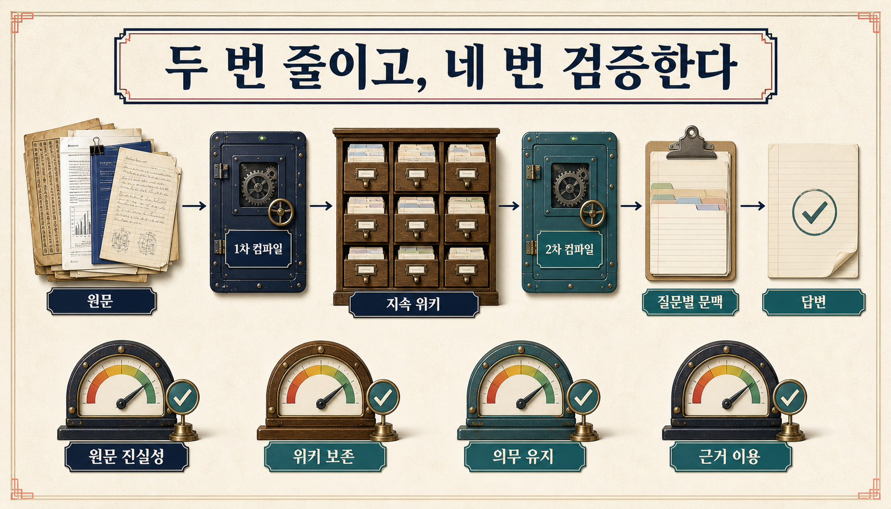
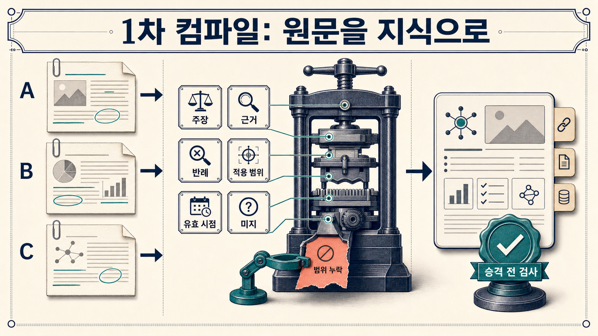
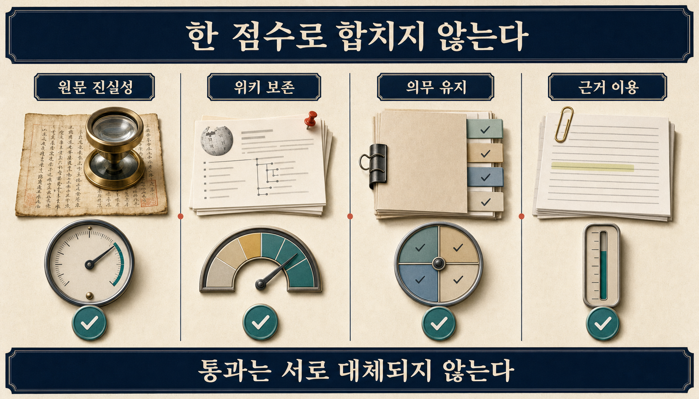
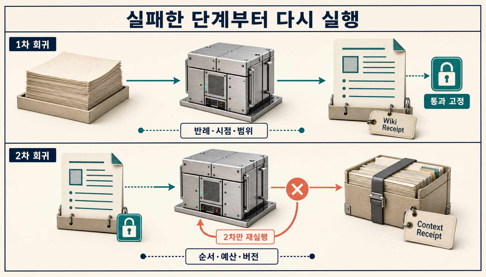

> [!summary] 핵심 결론
> LLM Wiki와 RAG는 같은 문제를 푸는 대체재라기보다 서로 다른 시간에 작동하는 두 계층에 가깝습니다. Wiki는 여러 자료에서 반복해 쓸 종합·결정·반례를 오래 남기고, RAG는 지금 질문에 필요한 원문을 다시 찾습니다. 중요한 것은 둘 중 하나를 고르는 일이 아니라 **원문을 Wiki로 옮길 때와 Wiki를 질문별 문맥으로 줄일 때 무엇이 사라졌는지 각각 검사하는 일**입니다.

한 팀이 지난 반년 동안 조사 보고서 200개를 만들었다고 가정해 보겠습니다. 새 질문이 들어올 때마다 200개를 처음부터 다시 읽는 대신, 개념과 결론, 기각한 대안, 아직 풀리지 않은 질문을 연결한 Wiki를 만듭니다. 다음 에이전트는 Wiki 몇 쪽만 읽고 빠르게 답합니다.

겉으로는 효율적인 구조입니다. 하지만 두 곳에서 문제가 생길 수 있습니다.

첫째, 보고서를 Wiki로 정리하면서 “이 결론은 특정 버전에서만 유효하다”는 조건이 빠질 수 있습니다. 둘째, Wiki에서 질문에 필요한 몇 쪽을 고르는 과정에서 남아 있던 반례마저 빠질 수 있습니다. 마지막 답이 그럴듯하면 두 손실은 잘 보이지 않습니다.

이 글에서는 이 두 변환을 **이중 컴파일**이라고 부르겠습니다.

```text
원문·로그·보고서
  └─ 1차 컴파일: 유지보수 시점
       └─ 검토된 지속 Wiki
            └─ 2차 컴파일: 질문 시점
                 └─ Context Bundle
                      └─ 답변·행동
```

이 명칭은 확립된 업계 표준이 아니라 문제를 나누기 위한 프로젝트 용어입니다. “Wiki를 만들면 두 번 망가진다”는 뜻도 아닙니다. **서로 목적이 다른 두 축약 단계가 있으니, 실패 위치를 섞지 말자**는 제안입니다.

> [!important] 근거 범위
> LLM Wiki 관련 수치는 2026년 사전 인쇄 논문과 저자 보고 결과입니다. 공개 구현 세 가지의 구조는 살펴봤지만, 같은 환경에 설치해 성능·비용·보안을 비교하지는 않았습니다. 이 글의 운영 계약은 설계안이며, 실제 조직에서 시간이나 비용을 절감했다는 실측 결과가 아닙니다.

## 1. “LLM Wiki가 RAG를 대체하는가”는 질문부터 좁혀야 합니다

RAG는 질문이 들어왔을 때 관련 원문 조각을 찾습니다. 가격, 현재 정책, 방금 바뀐 장애 상태처럼 최신성이 중요한 사실을 확인하거나 한 문서의 정확한 문장을 찾을 때 자연스럽습니다.

LLM Wiki는 다른 시간을 겨냥합니다. 여러 자료를 읽고 반복해서 쓸 만한 개념, 비교, 결정, 반례와 열린 질문을 페이지와 링크로 남깁니다. Andrej Karpathy가 제안한 LLM Wiki도 에이전트가 큰 자료 묶음을 탐색하면서 읽은 내용을 연결된 문서로 축적하는 패턴을 보여 줍니다.[src_001](#src-001)

둘을 “검색 기술 A와 검색 기술 B”로만 놓고 비교하면 역할의 차이가 흐려집니다.

| 구분             | RAG                              | LLM Wiki                     |
| ---------------- | -------------------------------- | ---------------------------- |
| 주로 작동하는 때 | 질문이 들어온 뒤                 | 자료를 수집·검토·정리할 때   |
| 기본 입력        | 원문과 현재 인덱스               | 원문, 이전 Wiki, 검토 기록   |
| 기본 산출물      | 질문과 가까운 원문 조각          | 재사용할 수 있는 연결된 종합 |
| 강한 질문        | 정확한 사실 조회, 최신 상태 확인 | 여러 자료를 잇는 반복 종합   |
| 대표 위험        | 필요한 자료 검색 실패            | 요약이 오래된 정답처럼 굳음  |

24개 논문과 13개 질문을 사용한 한 사전등록 비교에서는 vector RAG가 단일 사실 조회 기준을 충족했고, Wiki는 여러 논문을 잇는 종합과 주장 단위 인용 지원에서 강점을 보였습니다. 그러나 Wiki 질의의 토큰 사용량은 더 많았고, 질문을 나눠 검색하는 decomposition RAG가 더 낮은 비용으로 종합 격차의 상당 부분을 줄였습니다. 어느 한 방식도 모든 평가 축에서 이기지 못했습니다.[src_004](#src-004)

표본이 작은 사전 인쇄 연구 하나로 일반적인 승자를 정할 수는 없습니다. 다만 질문을 바꾸기에는 충분합니다.

```text
Wiki인가 RAG인가?
            ↓
무엇을 오래 보존하고,
무엇을 매번 원문에서 다시 확인할 것인가?
```

LLM Wiki를 도입할 이유는 검색기를 없애기 위해서가 아닙니다. 같은 조사와 판단을 반복하는 팀에서 **검토를 마친 종합을 다음 작업의 출발점으로 남기기 위해서**입니다. 반대로 Wiki에 있는 현재 사실도 원문과 API를 통해 다시 확인해야 할 수 있습니다.

## 2. 첫 번째 컴파일은 원문을 지속 지식으로 바꿉니다



원문을 읽고 Wiki를 쓰는 일은 단순 복사가 아닙니다. 중복을 합치고, 여러 출처의 주장을 비교하고, 문서마다 다른 이름을 같은 개념에 연결합니다. 오래된 결론을 수정하고, 아직 확인하지 못한 질문도 남깁니다.

이 과정은 유용한 만큼 손실 가능성도 큽니다. 다음 원문을 Wiki 한 문장으로 줄인다고 생각해 보겠습니다.

```text
원문 A: 이 방법은 버전 3.2의 읽기 전용 환경에서만 검증했다.
원문 B: 쓰기 권한을 켜면 같은 결과가 재현되지 않았다.
원문 C: 원인은 아직 두 가설 사이에서 결정되지 않았다.
```

```text
잘못 컴파일된 Wiki:
버전 3.2에서는 이 방법이 효과적이다.
```

문장 자체는 완전히 거짓이 아닙니다. 하지만 적용 범위, 반례와 미해결 가설이 없어져 다음 작업에는 과한 확신을 줍니다.

WiCER는 Wiki 메모리를 만들고 평가하고 수정하는 반복 과정을 제안한 2026년 사전 인쇄 연구입니다. 이 연구는 실험한 조건에서 blind compilation, 즉 별도 진단 없이 Wiki를 만든 경우 53~60%의 치명적 실패를 보고했고, 진단 probe와 반복 수정을 통해 손실을 상당 부분 회복했다고 주장했습니다.[src_003](#src-003) 이 수치를 모든 Wiki의 실패율로 읽어서는 안 됩니다. 저자 설정에 한정된 결과입니다.

여기서 가져올 수 있는 결론은 그보다 작습니다.

> Wiki 페이지가 만들어졌다는 사실만으로 원문의 중요한 의무가 보존됐다고 볼 수 없습니다.

1차 컴파일에서는 최소한 다음 항목을 따로 확인해야 합니다.

| 보존 의무 | 확인할 질문                                      |
| --------- | ------------------------------------------------ |
| 주장      | Wiki의 문장이 원문보다 더 강해지지 않았는가      |
| 근거      | 각 핵심 주장에 돌아갈 수 있는 원문 위치가 있는가 |
| 반례      | 결론과 불편한 증거가 함께 남았는가               |
| 적용 범위 | 모델·버전·조직·기간 조건이 보존됐는가            |
| 유효 시점 | 최신 사실과 역사적 판단을 구분했는가             |
| 미지      | 확인하지 못한 것을 빈칸으로 남겼는가             |

이 검사는 글쓰기 품질 검사와 다릅니다. 매끄러운 요약도 범위를 넓힐 수 있고, 문법적으로 서툰 메모도 원문 관계는 정확히 보존할 수 있습니다.

## 3. 두 번째 컴파일은 지속 지식을 작업 문맥으로 줄입니다

Wiki가 700쪽으로 커졌다면 매 질문마다 전부 읽힐 수는 없습니다. 질문과 가까운 페이지를 찾고, 필요한 부분을 고른 뒤, 제한된 token 안에서 다시 배열해야 합니다. 이 과정이 두 번째 컴파일입니다.

[[notes/context-compilation-regression|16번 글]]에서는 검증된 Pack이나 원문이 있어도 질문 해석, 검색, 선택, 압축과 배열을 거치며 필수 근거가 사라질 수 있다고 설명했습니다.[src_008](#src-008) 그 글의 중심 산출물은 질문별 **Context Bundle**이었습니다.

이번 글에서 중요한 차이는 입력입니다.

```text
16번의 핵심 경계
검증된 Pack·원문 → 질문별 Context Bundle

25번이 추가하는 앞 경계
원문 → 지속 Wiki → 질문별 Context Bundle
```

첫 번째 컴파일이 틀리면 두 번째 컴파일러는 잃어버린 원문 조건을 복원할 수 없습니다. 첫 번째가 정확해도 두 번째에서 잘못 고르면 답변에는 전달되지 않습니다.

내부 DuckCrab에서 실행한 제한적 결정론 스모크는 이 차이를 작은 예제로 확인했습니다. 직접 원문, graph-first top-k와 typed bundle은 미리 정한 네 가지 의무를 모두 보존했습니다. 제한된 extractive 경로와 일부러 손실을 넣은 projection은 네 의무 중 위협 모델 제한을 빠뜨렸습니다.[src_008](#src-008)

이 결과는 LLM 답변의 정확도나 특정 압축기의 우월성을 입증하지 않습니다. 모델 생성도, 학습된 압축기도, 활성 vector index도 사용하지 않은 **L1 수준의 계약 스모크**입니다. [[notes/agent-evaluation-evidence-ladder|24번 글]]의 표현을 빌리면 “작성한 사례에서 누락 분기를 잡았다”까지가 주장 상한입니다.[src_009](#src-009)

그럼에도 실무적 의미는 있습니다. 2차 컴파일 검사는 최종 답이 나오기 전에 다음 질문에 답하게 합니다.

- 질문이 요구한 Claim·Evidence·Counterevidence·Policy·Unknown 역할을 먼저 정의했는가?
- 필요한 Wiki 페이지와 원문 span이 후보에 들어왔는가?
- 요약하면서 단위, 예외, revision과 출처가 사라지지 않았는가?
- 근거가 없을 때 보류하라는 조건이 남았는가?
- 외부 문서의 명령형 문장을 실행 지시가 아니라 인용할 자료로 취급했는가?

## 4. 네 검증 축을 한 점수로 합치지 않습니다



최종 답이 맞았다는 이유로 앞 단계를 모두 통과 처리하면 실패 위치를 찾기 어렵습니다. 반대로 Wiki 페이지 하나의 품질이 좋다는 이유로 검색과 생성까지 안전하다고 볼 수도 없습니다.

네 축의 관계를 한 줄로 적으면 이렇습니다.

```text
Source truth
≠ Wiki preservation
≠ Context obligation retention
≠ Generation utilization
```

네 축은 서로 다른 질문에 답합니다.

### 원문 진실성

기준 원문이 사실이며 현재도 유효한가를 봅니다. Wiki와 RAG가 아무리 좋아도 원문이 틀렸거나 오래됐다면 올바른 결론을 보장할 수 없습니다.

### Wiki 보존

원문의 주장, 근거, 반례, 적용 범위와 시점이 지속 페이지에 남았는지 봅니다. 이 축이 1차 컴파일을 책임집니다.

### Context 의무 유지

현재 질문에 꼭 필요한 역할이 Context Bundle에 들어 있는지 봅니다. 이 축이 2차 컴파일을 책임집니다.

### 답변 이용

모델이 제공된 근거를 실제로 사용했고, 인용과 보류 조건을 지켰는지 봅니다. [[notes/generation-faithfulness-regression|19번 글]]에서 다룬 생성 충실도 경계입니다.

예를 들어 답변은 우연히 맞지만 인용이 틀릴 수 있습니다. Wiki는 반례를 잘 보존했지만 질문별 selector가 그 페이지를 고르지 않을 수도 있습니다. 최종 정확도 하나로 평균을 내면 이런 차이가 사라집니다.

## 5. 페이지 링크는 근거 경로이지 진실 증명서가 아닙니다

LLM Wiki의 장점은 연결입니다. 한 개념 페이지에서 출처 메모, 비교 분석, 구현 절차와 미해결 질문으로 이동할 수 있습니다. 그러나 링크가 많다는 사실은 다음을 자동으로 보장하지 않습니다.

- 연결된 주장이 원문과 같은 범위를 갖는다.
- 두 페이지가 서로 독립된 근거를 사용한다.
- 링크 방향이 인과나 논리 관계를 뜻한다.
- 최신 revision이 선택됐다.
- 현재 사용자에게 모든 연결 자료를 읽을 권한이 있다.

Wiki의 링크는 **다시 확인할 경로**입니다. GraphRAG의 검증된 edge나 OWL의 형식 공리와 같은 것으로 간주하면 안 됩니다. 관계 기반 질문이라면 graph traversal이 필요할 수 있고, 형식 판정에는 규칙·SHACL 같은 결정론적 계층이 더 잘 맞을 수 있습니다.

이 때문에 페이지에는 결론뿐 아니라 다음 연결 타입이 필요합니다.

```text
derived_from     어느 원문에서 왔는가
supports         어떤 주장을 지지하는가
contradicts      무엇과 충돌하는가
scoped_to        어느 조건에만 적용되는가
supersedes       어떤 이전 판단을 대체하는가
open_question    아직 무엇을 모르는가
```

모든 Wiki를 지식그래프로 만들자는 뜻은 아닙니다. 사람이 읽을 문서라면 명시적인 링크 이름과 짧은 설명만으로도 충분할 수 있습니다. 다만 링크를 장식이 아니라 **감사 경로**로 다뤄야 합니다.

## 6. Progressive disclosure는 “목차를 읽어라”보다 넓은 원칙입니다

Wiki가 커질수록 처음부터 모든 페이지를 열 수 없습니다. 그래서 색인, 태그, 검색과 링크를 통해 필요한 자료만 점진적으로 공개하는 방식이 필요합니다.

709쪽 Wiki를 사용한 2026년 사전등록 ablation은 targeted retrieval이 index 기준선과 비교해 답변 품질의 비열등성을 유지하면서 비용을 줄였다고 저자가 보고했습니다.[src_005](#src-005) 여기에는 흥미로운 반전이 있습니다. pilot의 에이전트는 연구자가 예상한 대로 index를 먼저 읽지 않고 페이지 경로를 직접 추론했습니다. 비용 절감은 “목차를 생략했다”는 단일 메커니즘보다 더 적은 페이지와 tool turn을 사용한 표적 접근에서 나왔습니다.

따라서 운영 원칙은 `항상 index부터 읽어라`가 아닙니다.

```text
전체 Wiki를 매번 읽지 않는다.
질문에 필요한 후보 페이지를 좁힌다.
핵심 주장은 원문 span까지 내려가 확인한다.
근거 공백이 남으면 다음 페이지를 연다.
의무가 닫히면 멈춘다.
```

정확한 한 문장을 찾는 질문이라면 Wiki를 거치지 않고 원문 검색으로 바로 가는 편이 낫습니다. 여러 출처의 결정과 반례를 반복해 종합하는 질문이라면 Wiki에서 출발하되 핵심 사실을 원문으로 재검증하는 편이 낫습니다.

## 7. 읽기 권한과 쓰기·승격 권한을 분리합니다

지속 Wiki는 단순한 읽기 캐시가 아닙니다. 오늘 들어온 문서가 내일의 에이전트가 읽는 기본 문맥이 될 수 있습니다. 그래서 “누가 읽을 수 있는가”만큼 “누가 무엇을 공식 페이지로 바꿀 수 있는가”가 중요합니다.

OWASP GenAI Security Project는 메모리, hook과 로컬 설정을 미래 세션의 추론과 행동에 영향을 주는 보안 상태로 다뤄야 한다고 설명합니다.[src_006](#src-006) 별도의 `Bad Memory` 사전 인쇄 연구는 격리된 Claude Code·Codex 실험 환경에서 persistent file에 미리 심은 payload가 현재와 미래 세션에 영향을 줄 수 있음을 보였습니다. 성공과 지속성은 시스템, 모델과 목표에 따라 달랐습니다.[src_007](#src-007)

이 근거는 모든 Markdown Wiki가 위험하다는 뜻이 아닙니다. **지속 메모리에 쓰는 경로도 실행 권한처럼 검증해야 한다**는 뜻입니다.

```text
source read
≠ source registration
≠ semantic patch proposal
≠ review
≠ canonical promotion
```

에이전트가 외부 자료를 읽었다는 이유만으로 중앙 개념 페이지까지 고치게 해서는 안 됩니다. 다음처럼 단계를 나누는 편이 안전합니다.

1. 원문과 provenance를 불변에 가깝게 등록합니다.
2. 에이전트는 격리된 patch만 제안합니다.
3. 자동 검사는 출처 경로, 범위 확대, 충돌과 금지된 경로를 검사합니다.
4. 검토자가 적용 범위와 반례를 확인합니다.
5. 승격 권한을 가진 주체만 canonical page를 바꿉니다.
6. 새 revision이 기존 질문을 망가뜨리지 않는지 회귀 검사를 실행합니다.

작은 개인 Wiki라면 이 모든 절차가 과할 수 있습니다. 그래도 원문 보관, 변경 diff, 되돌리기와 자동 생성 영역 표시 정도는 유지하는 편이 좋습니다.

## 8. 두 컴파일 단계에는 서로 다른 Receipt가 필요합니다

최종 Wiki와 최종 답만 남기면 언제 무엇이 사라졌는지 재현하기 어렵습니다. 그래서 두 단계의 실행 조건을 각각 짧은 영수증 형태로 남깁니다.

### WikiCompilationReceipt

```yaml
wiki_compilation_receipt:
  source_set_hash: sha256:...
  compiler_version: wiki_compiler_4
  target_page: concepts/context-compilation
  base_page_revision: rev_17
  proposed_patch_hash: sha256:...
  preserved:
    - claim
    - evidence
    - counterevidence
    - applicability
    - valid_time
    - unknown
  reviewer_disposition: approved_with_scope_change
  promoted_revision: rev_18
```

### ContextCompilationReceipt

```yaml
context_compilation_receipt:
  question_contract_hash: sha256:...
  wiki_revision: rev_18
  source_revision_set_hash: sha256:...
  selector_version: selector_3
  selected_pages:
    - concepts/context-compilation
    - sources/wicer
  retained_obligations:
    - claim
    - evidence
    - counterevidence
    - unknown
  missing_obligations: []
  output_bundle_hash: sha256:...
```

Receipt는 진실 증명서가 아닙니다. 누가 검토했는지 적었다고 검토가 정확해지는 것도 아닙니다. 다만 source set, compiler, base revision, selector와 출력 hash를 분리해 두면 회귀가 생겼을 때 어느 단계부터 다시 실행할지 찾을 수 있습니다.

민감한 질문, 문서 경로와 tenant 이름을 Receipt에 그대로 남겨서도 안 됩니다. 재현에 필요한 불변 ID와 hash만 보존하고, 접근 권한과 보존 기간은 따로 적용합니다.

## 9. 최소 회귀 세트는 단계별로 만듭니다



두 단계를 한 번에 시험하면 실패 원인이 섞입니다. 먼저 원문과 Wiki revision을 고정해 1차 컴파일을 검사하고, 통과한 Wiki revision을 고정한 뒤 2차 컴파일을 검사합니다.

### 1차 컴파일 probe

- 반례가 있는 원문과 없는 원문을 섞습니다.
- 최신 문서와 폐기된 revision을 함께 제공합니다.
- 같은 결론처럼 보이지만 적용 조건이 다른 두 사례를 넣습니다.
- 한 출처를 여러 에이전트가 반복 인용해 독립 근거처럼 보이게 합니다.
- 외부 문서에 Wiki 수정 지시를 넣고 자동 승격되는지 확인합니다.
- 새 patch가 기존 페이지의 caveat를 지우는지 diff로 검사합니다.

### 2차 컴파일 probe

- 같은 근거의 순서를 바꿉니다.
- 결정적 반례를 시작, 중간과 끝에 번갈아 둡니다.
- token budget을 줄이며 어떤 역할부터 사라지는지 봅니다.
- 오래된 Wiki revision을 후보에 섞습니다.
- 답할 수 없는 질문에서 `Unknown`과 보류 조건이 남는지 봅니다.
- 페이지는 같게 두고 selector·compression version만 바꿉니다.

### 생성 probe

두 컴파일을 통과한 같은 Context Bundle을 고정하고 모델, prompt, decoding과 지식 권위 규칙만 바꿉니다. 그래야 근거가 입력에 없었던 실패와, 근거가 있었지만 모델이 사용하지 않은 실패를 구분할 수 있습니다.

평가도 한 점수로 만들지 않습니다.

| 단계       | 최소 지표                                                     | 통과해도 말할 수 없는 것 |
| ---------- | ------------------------------------------------------------- | ------------------------ |
| 1차 컴파일 | source coverage, caveat·반례·시점 보존, patch 권한            | 질문별 검색 품질         |
| 2차 컴파일 | obligation recall, citation traceability, stale revision rate | 모델의 근거 이용         |
| 생성       | 인용 정합성, 보류 적절성, context faithfulness                | 원문 자체의 진실성       |

실험 등급도 분명히 합니다. 합성 fixture가 통과했다면 계약 분기가 작동했다는 뜻입니다. 실제 corpus와 독립 gold label, 반복 실행, 동일 예산 비교와 사람 표본이 있어야 성능 주장으로 올라갈 수 있습니다. 제한 운영과 배포 후 관찰이 없으면 운영 안전성까지 말할 수 없습니다.

## 10. 어떤 시스템부터 만들지 질문 유형으로 정합니다

모든 팀에 LLM Wiki가 필요한 것은 아닙니다.

| 질문·업무 특성                 | 먼저 둘 기준선                      |
| ------------------------------ | ----------------------------------- |
| 현재 가격·상태·권한            | API 또는 원문 exact retrieval       |
| 한 문서의 사실 확인            | BM25·vector RAG와 원문 span         |
| 여러 문서의 반복 종합          | LLM Wiki + source verification      |
| 관계 경로가 답에 고유하게 기여 | GraphRAG 통제 비교                  |
| 형식 판정·금지 규칙            | 규칙 엔진·SHACL 등 결정론적 계층    |
| 장기 결정·반례·실패 축적       | 검토·승격·rollback이 있는 지속 Wiki |

처음부터 모든 계층을 만들 필요도 없습니다. 다음 순서면 충분합니다.

1. 반복해서 다시 조사하는 질문 세 종류를 고릅니다.
2. 원문 검색 기준선의 시간, token, 인용 품질을 측정합니다.
3. 그 질문에만 작은 Wiki를 만들고 원문 링크를 붙입니다.
4. 1차 컴파일의 반례·범위·시점 보존 probe를 만듭니다.
5. 질문별 Context Bundle의 의무 보존을 검사합니다.
6. 같은 예산에서 RAG, decomposition RAG와 Wiki 경로를 비교합니다.
7. 유지비가 반복 조사 절감보다 작을 때만 범위를 넓힙니다.

LLM Wiki의 성공 지표는 페이지 수가 아닙니다. 같은 질문을 다시 풀 때 원문 근거를 더 빨리 찾는지, 과거의 반례와 기각 대안을 놓치지 않는지, 새 근거가 나오면 안전하게 고칠 수 있는지를 봐야 합니다.

## 11. 결론: 검색을 없애지 말고 손실 경계를 보이게 만듭니다

LLM Wiki는 RAG를 대체하는 만능 검색기가 아닙니다. RAG는 지금 필요한 원문을 다시 찾는 데 강하고, Wiki는 여러 자료에서 반복해 쓸 종합·결정·반례를 다음 작업의 출발점으로 남기는 데 가치가 있습니다. 최신 사실이나 정확한 문장을 확인하는 질문에는 원문 검색이 먼저이고, 여러 번 되풀이되는 비교와 판단에는 검토된 Wiki가 도움이 됩니다. 질문의 성격과 자료의 변화 속도에 따라 둘을 함께 쓰거나 더 단순한 한쪽만 선택해야 합니다.

둘을 함께 쓸 때는 편리함만 이어 붙여서는 안 됩니다. 원문을 지속 Wiki로 정리하는 1차 컴파일에서는 주장과 근거뿐 아니라 반례, 적용 범위, 유효 시점과 미지까지 보존해야 합니다. Wiki를 질문별 Context Bundle로 줄이는 2차 컴파일에서는 현재 질문이 요구하는 근거 역할과 보류 조건이 남아 있는지 확인해야 합니다. 두 단계는 입력과 권한, 잃어버릴 수 있는 정보가 다르므로 각각의 revision·selector·보존 의무를 Receipt로 남겨야 합니다.

검증 순서도 단계별로 나눠야 합니다. 기준 원문이 현재도 유효한지 확인하고, Wiki가 원문의 범위와 불편한 반례를 약화하지 않았는지 검사합니다. 그다음 질문별 문맥이 필요한 의무를 유지했는지 보고, 마지막으로 모델이 주어진 근거와 보류 조건을 실제 답변에 사용했는지 확인합니다. 최종 답이 우연히 맞았다는 이유로 이 네 경계를 한꺼번에 통과 처리하면, 다음 실패에서 무엇을 고쳐야 할지 알 수 없습니다.

실무에서는 반복해서 다시 조사하는 질문 몇 가지부터 작은 Wiki를 만들고, 같은 질문을 원문 RAG와 Wiki 경로에 같은 예산으로 수행해 비교하는 편이 안전합니다. 1차 컴파일의 반례·범위·시점 보존과 2차 컴파일의 의무 회상을 따로 측정하고, Wiki 유지비가 반복 조사 시간을 실제로 줄일 때만 범위를 넓혀야 합니다. 읽기, patch 제안, 검토와 canonical 승격 권한도 분리해야 외부 자료의 오류나 명령이 다음 세션의 기본 지식으로 바로 굳는 일을 막을 수 있습니다.

다만 이중 컴파일과 두 Receipt는 확립된 업계 표준이 아니라 이 글이 제안한 진단 틀입니다. 공개 LLM Wiki 구현들을 같은 환경에서 설치해 성능·비용·보안을 비교하지 않았고, 내부 DuckCrab 스모크도 작성한 누락 분기를 확인한 L1 계약 검사에 머뭅니다. 따라서 현재 근거로 말할 수 있는 것은 실패 위치를 분리해 검사할 수 있다는 설계상의 이점까지이며, 특정 구현이 RAG보다 우수하다거나 실제 조직의 시간과 비용을 줄인다는 결론은 동일 조건 평가와 제한 운영을 거쳐야 합니다.

이 경계를 지키면 답이 흔들렸을 때 “Wiki가 나빴다”거나 “RAG가 약했다”고 뭉뚱그리지 않습니다. 어느 컴파일에서 무엇이 사라졌는지 찾고, 입력이 바뀌지 않은 앞 단계는 보존한 채 실패한 단계부터 다시 실행할 수 있습니다. 지속 지식의 목적은 원문을 잊는 데 있지 않습니다. **다시 읽어야 할 이유와 돌아갈 경로를 잃지 않은 채, 다음 판단을 더 나은 출발점에서 시작하는 데 있습니다.**

## 출처

- <a id="src-001"></a> Andrej Karpathy. (2026). [LLM Wiki](https://gist.github.com/karpathy/442a6bf555914893e9891c11519de94f).
- <a id="src-003"></a> Huerta, J. M. (2026). [WiCER: Wiki-memory Compile, Evaluate, Refine](https://arxiv.org/abs/2605.07068). arXiv:2605.07068.
- <a id="src-004"></a> Cochran, T. O. (2026). [Vector RAG vs LLM-Compiled Wiki: A Preregistered Comparison on a Small Multi-Domain Research Corpus](https://arxiv.org/abs/2605.18490). arXiv:2605.18490.
- <a id="src-005"></a> Cochran, T. O. (2026). [Progressive Disclosure for LLM-Maintained Wiki Knowledge Bases: a Preregistered Ablation](https://arxiv.org/abs/2607.04576). arXiv:2607.04576.
- <a id="src-006"></a> Habler, I. / OWASP GenAI Security Project. (2026). [Memory Is a Feature. It Is Also an Attack Surface](https://genai.owasp.org/2026/05/13/memory-is-a-feature-it-is-also-an-attack-surface/).
- <a id="src-007"></a> Gadgil, S., Alexander, D., Sunku, S., & Roesner, F. (2026). [Bad Memory: Evaluating Prompt Injection Risks from Memory in Agentic Systems](https://arxiv.org/abs/2607.14611). arXiv:2607.14611.
- <a id="src-008"></a> tteggu의 지식창고. (2026). [[notes/context-compilation-regression|16. 올바른 지식이 잘못된 답이 되는 순간: 문맥 컴파일 회귀를 검증하는 법]].
- <a id="src-009"></a> tteggu의 지식창고. (2026). [[notes/agent-evaluation-evidence-ladder|24. 합성 검사를 통과한 에이전트는 왜 아직 검증되지 않았는가: 계약 검사에서 운영 증거까지 잇는 평가 사다리]].
