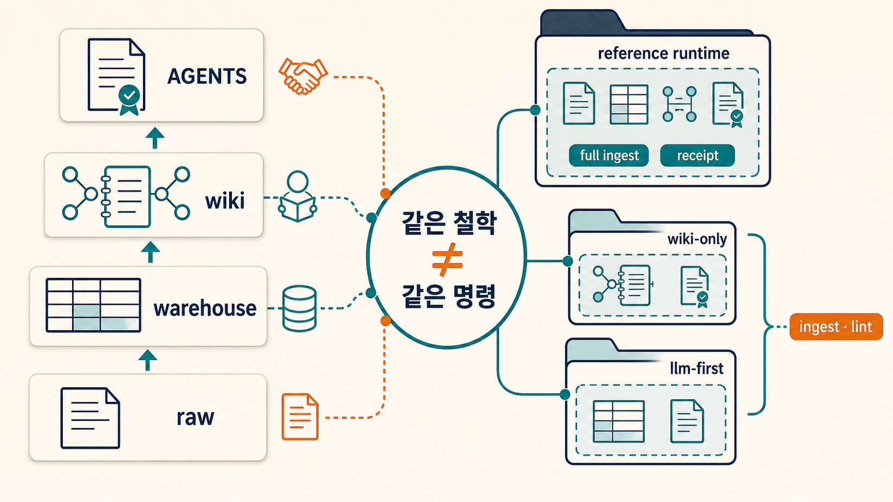
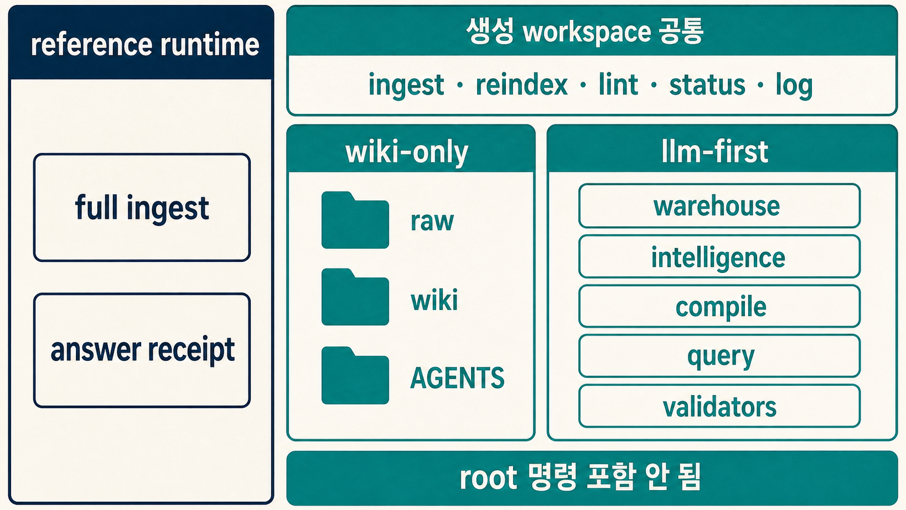
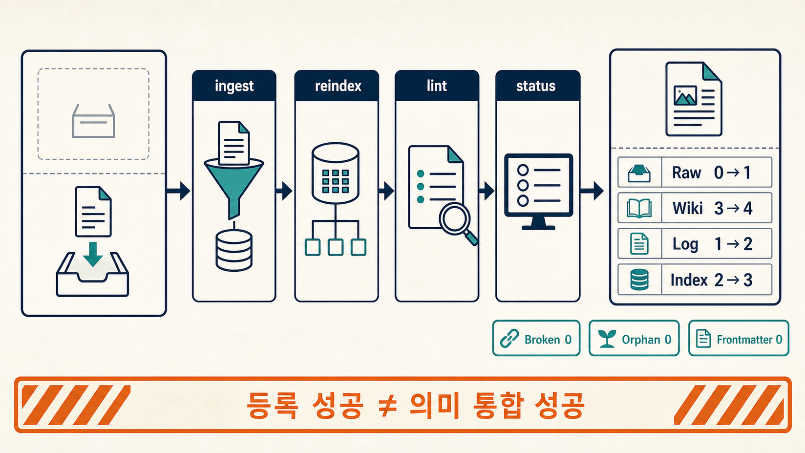
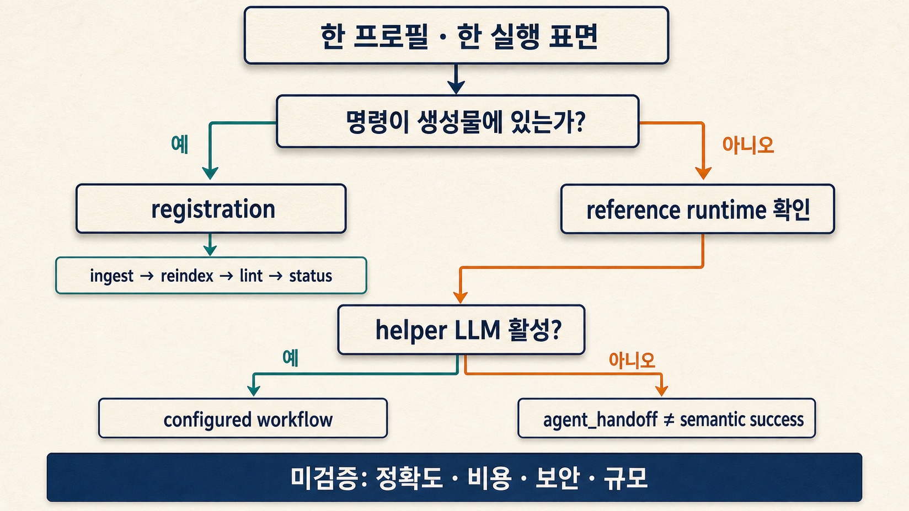

[1번 글](../../notes/llm-wiki/llm-wiki-origin-and-implementations)에서 카파시의 원형 구상은 세 층으로 정리됐습니다. 원문을 보존하는 Raw Sources, LLM이 유지하는 Markdown Wiki, 작업 규칙을 담은 Schema. 그런데 이 청사진은 "무엇을 보존하고 무엇을 종합할지"를 말할 뿐, **파일을 어떻게 두고 누가 쓰는지**는 정하지 않습니다. 구현체마다 이 지침을 자기 방식으로 번역해야 합니다.

DocTology가 고른 번역은 저장소 안의 운영 규칙입니다. Schema는 `AGENTS.md`가 되고, Raw Sources는 `raw/`, Markdown Wiki는 `wiki/`가 됩니다. 이 글이 다루는 것은 그 번역의 이유와, 번역된 구조가 실제로 작동하는 순서입니다.

> [!summary] 핵심 결론
> DocTology는 카파시의 세 층을 저장소 구조로 그대로 옮겼습니다. 지침이 지식과 같은 저장소 안에 있어 함께 버전 관리되고, AGENTS.md를 인식하는 에이전트는 작업 시작 시 이 계약을 발견·적용하며, 사람은 `git diff`로 규칙과 지식의 변경을 함께 검토할 수 있습니다. 자동화 범위는 프로필 선택으로 조절하며, 처음에는 인간 검토 중심의 `wiki-only`로 시작해 충돌·승인 추적이 필요해지면 `llm-first-ontology`로 확장합니다.

## 1. 원문 청사진이 구현마다 달라지는 지점

카파시 원문이 남긴 것은 방향이지 파일 배치가 아닙니다. 원문이 명시한 최소 핵심은 세 층(Raw Sources / Wiki / Schema)과 세 작업(Ingest / Query / Lint)인데, 이 요구를 만족하는 구조는 얼마든지 다릅니다. Agent Skill은 지침을 스킬 파일로, CLI 구현은 명령어로, Obsidian 플러그인은 UI로 번역합니다.

DocTology는 같은 요구를 저장소 레벨의 계약으로 번역했습니다. 지침을 별도 문서나 외부 설정에 두지 않고 `AGENTS.md`라는 파일로 저장소 안에 둔 이유는, 계약이 지식과 같은 저장소에서 함께 버전 관리되고 AGENTS.md를 인식하는 에이전트(Codex 등)가 작업 시작 시 이 파일을 발견해 적용하기 때문입니다. 지침과 지식이 같은 커밋에 있으므로, 규칙이 바뀌면 그 이유와 시점이 git 기록에 남습니다.

## 2. Schema가 AGENTS.md가 된 이유

카파시의 Schema는 파일 명명 규칙, 링크 체계, Ingest·Query·Lint 절차와 도메인 제약을 규정하는 작업 지침서입니다. DocTology는 이를 `AGENTS.md`라는 한 파일로 구현하는데, 이 파일의 첫 줄이 번역의 방향을 보여 줍니다.

```text
This repository is an Obsidian-first LLM Wiki.
The human curates sources and asks questions.
The agent maintains the wiki.
```

사람은 원자료를 선별하고 질문을 던지고, 에이전트는 위키를 유지합니다. 이 역할 분담은 1번 글에서 본 카파시 원문의 역할 분리와 동일합니다. 차이는 이 규칙이 외부 문서나 스킬 설명이 아니라 **지식과 같은 저장소 안의 파일**이라는 점입니다. 그래서 세 가지 특징이 생깁니다.

- **작업 시작 시 발견됩니다.** AGENTS.md를 인식하는 에이전트 런타임은 작업 전에 이 파일을 읽습니다. 호환되지 않는 환경에서도 파일을 직접 가리키면 되므로, 규칙을 매 대화에 다시 적을 필요는 없습니다.
- **git으로 버전 관리됩니다.** 규칙 변경도 지식 변경과 같은 diff·검토·커밋 흐름을 탑니다. 지침이 조용히 바뀌지 않습니다.
- **사람이 직접 고칠 수 있습니다.** 규칙이 코드가 아니라 Markdown이므로, 에이전트 동작이 마음에 들지 않으면 문장을 수정하는 것만으로 조정할 수 있습니다.

이 파일이 정한 핵심 규칙은 여섯 가지입니다. `raw/`는 수정하지 않는다. 작은 연결된 페이지를 선호한다. 안정적인 개념에는 위키링크를 건다. 불확실한 주장은 명시적으로 보존한다. 주장이 많은 페이지는 출처 페이지를 인용한다. 의미 있는 답변은 대화에 그치지 않고 `wiki/analyses/`에 저장한다.

## 3. 세 층이 폴더로 번역되는 법

카파시의 세 층은 DocTology에서 세 개의 위치로 옮겨집니다.

```text
Raw Sources  → raw/           원문 보관. 불변. "Never modify source contents."
Markdown Wiki → wiki/          에이전트가 만들고 갱신하는 페이지.
Schema       → AGENTS.md      운영 규칙 + scripts/llm_wiki.py 실행 도구
```

`wiki/` 안은 페이지 역할로 다시 나뉩니다. `sources/`는 원문 하나를 추적하는 Source 페이지, `concepts/`·`entities/`·`people/`·`projects/`·`timelines/`는 재사용되는 안정적 지식, `analyses/`는 비교·결정·종합 답변, `_meta/`는 인덱스와 로그입니다. 1번 글에서 본 "여러 원자료 간의 관계를 교차 편집한 지속적 지식 산출물"이 이 폴더 구분으로 실현됩니다.

세 가지 작업도 명령으로 번역됩니다.

- **Ingest** → `ingest` 명령이 원문을 Source 페이지로 등록하고 `reindex`가 인덱스를 갱신합니다. 원문을 이해해 개념을 연결하는 의미 통합은 에이전트의 몫입니다.
- **Query** → 전용 명령이 없습니다. 질문은 에이전트 대화에서 처리하고, 재사용 가치가 있는 답변은 규칙에 따라 `wiki/analyses/`에 저장됩니다.
- **Lint** → `lint` 명령이 깨진 링크·고아 페이지·frontmatter 누락을 검사합니다.

1번 글에서 "정확도는 하네스가 얼마나 정교한지에 좌우된다"고 했는데, 여기서 하네스는 `AGENTS.md`와 `lint`를 합친 것입니다. 규칙이 구조를 만들고, 검사가 구조의 무결성을 지킵니다.

## 4. 자동화 경계를 고르는 두 프로필

bootstrap은 두 가지 프로필을 제공합니다. 둘의 차이는 기능 개수가 아니라 **의미 판단을 누가·어떻게 처리하는가**입니다.

`wiki-only`는 위에서 본 규칙과 다섯 개 명령만 가집니다. 사람이 `git diff`로 에이전트의 변경을 검토하는 것이 기본 흐름입니다.

`llm-first-ontology`는 여기에 "strict LLM-first ontology contract layer"를 추가합니다. 의미 판단의 기본 경로를 LLM compile/query로 고정하고, 결정적 코드(스크립트)는 의미 주장을 만들 수 없습니다. compile 산출물은 인간 검토가 필요한 제안 상태로 남고, helper LLM이 설정되지 않으면 스크립트는 성공을 가장하지 않고 `agent_handoff` 번들을 만들어 현재 대화의 에이전트에게 넘깁니다. `warehouse/jsonl/`의 구조화된 근거와 `intelligence/`의 정책·계약이 따라옵니다.

첫날에는 `wiki-only`가 맞습니다. 확인할 지점이 적고, 원문 → Source 페이지 → Wiki 링크 → 인덱스 → 로그 → git 검토의 기본 루프에 집중할 수 있습니다. 같은 주장에 서로 다른 출처가 붙어 충돌을 추적해야 하거나, 제안된 지식과 승인된 지식을 명확히 나눠야 하는 요구가 반복되면 그때 `llm-first-ontology`를 검토합니다. 더 많은 폴더가 더 좋은 Wiki를 뜻하지는 않습니다.

## 5. 도구와 운영 공간을 분리하는 이유

실제 사용으로 들어가기 전에, 위치 하나를 정리합니다. DocTology 원본 저장소는 Wiki를 **만드는** 도구이고, 생성된 작업 공간은 Wiki를 **운영하는** 곳입니다.

```text
~/doctology      DocTology 원본 저장소 — bootstrap 스크립트가 있는 곳
~/my-llm-wiki    내가 실제로 운영할 Wiki — ingest·reindex·lint·status·log 실행
```

이 분리는 앞서 본 `raw/`와 `wiki/`의 관계가 저장소 차원에서 반복된 것입니다. 원본은 불변, 생성물은 가변. 이 둘을 섞으면 "스크립트를 찾을 수 없다"는 오류부터 시작해 원본 저장소를 오염시키는 실수까지 이어집니다. 이후 모든 명령은 `~/my-llm-wiki` 안에서 실행합니다.

## 6. 첫날의 성공 기준과 다음 단계

여기까지의 구조가 실제로 가치가 있는지 판단하는 기준은 간단합니다. 첫날의 성공은 "AI가 모든 문서를 이해했다"가 아닙니다. 아래 여섯 가지가 되면 LLM Wiki의 가장 중요한 수명주기를 이미 경험한 것입니다.

- 새 Wiki 작업 공간을 만들었다.
- 원문 하나를 `raw/inbox/`에 저장했다.
- Source 페이지가 생겼다.
- index와 log가 갱신됐다.
- 에이전트가 `AGENTS.md`를 읽고 변경했다.
- `git diff`와 `lint`로 결과를 검토했다.

이 여섯 가지는 2절에서 본 하네스가 실제로 작동했는지의 증거입니다. 규칙이 전달되고(`AGENTS.md`), 구조가 만들어지고(`raw/` → `wiki/`), 검사가 통과했습니다(`lint`). 이 여섯 가지를 확인하는 실제 순서는 다음 절의 실습에서 이어집니다.

## 7. 두 줄로 Wiki가 생기는 순간

준비물은 `git`과 `python3`뿐입니다. 별도 데이터베이스나 그래프 서버는 필요하지 않습니다.



```bash
cd ~
git clone https://github.com/tteggu87/DocTology.git doctology
cd doctology
python3 .agents/skills/llm-wiki-bootstrap/scripts/bootstrap_llm_wiki.py \
  ../my-llm-wiki \
  --profile wiki-only
```

bootstrap은 DocTology 원본 저장소 루트에서 실행합니다. 생성된 작업 공간으로 이동한 뒤 `status`와 `lint`가 정상 실행되면 준비가 끝납니다.

```bash
cd ../my-llm-wiki
python3 scripts/llm_wiki.py status
python3 scripts/llm_wiki.py lint
```

이 시점의 Wiki는 아직 비어 있습니다. 여기서부터가 본격적인 사용입니다.

## 8. 첫 문서가 Source 페이지가 되는 순간

`raw/inbox/first-note.md`를 만들고 간단한 메모를 저장합니다.

```text
첫 번째 자료

LLM Wiki는 원문을 보존하고, 에이전트가 여러 자료를 연결한 결과를 Wiki에 남긴다.

처음에는 자동화 범위를 작게 유지하고 Git diff로 변경을 확인한다.
```

이 문서를 등록하면 원문은 그대로 남고, `wiki/sources/` 아래에 Source 페이지가 생기며, `wiki/_meta/index.md`와 `log.md`가 갱신됩니다.



```bash
python3 scripts/llm_wiki.py ingest raw/inbox/first-note.md
python3 scripts/llm_wiki.py reindex
python3 scripts/llm_wiki.py lint
python3 scripts/llm_wiki.py status
```

여기서 `ingest`는 **원문 등록**입니다. 여러 문서를 이해해서 개념 문서를 자동 완성하거나, 사실을 승인된 지식으로 확정하는 단계는 아닙니다. 원문 등록 성공은 의미 통합 완료와 답변 정확도 검증과 다른 일입니다. 이 구분만 기억해도 자동화 결과를 과신하는 실수를 크게 줄일 수 있습니다.

## 9. 에이전트에게 맡기는 법: AGENTS.md

생성된 폴더를 Codex처럼 로컬 저장소를 읽고 수정할 수 있는 에이전트에서 열고, 짧은 요청 하나를 보냅니다.

```text
AGENTS.md를 먼저 읽고 지침을 따라줘.
wiki/_meta/index.md와 최근 wiki/_meta/log.md를 확인해줘.
raw/inbox/first-note.md와 생성된 Source 페이지를 읽고,
기존 페이지와 겹치지 않는 범위에서 필요한 Wiki 연결을 정리해줘.
작업 후 reindex와 lint를 실행하고 변경 파일을 알려줘.
```

이 요청의 핵심은 "내 문서를 요약해줘"가 아니라 **저장소 안의 운영 규칙을 먼저 읽고, 기존 Wiki와 연결하고, 변경을 검증하라**고 명시하는 것입니다. 2절에서 본 역할 분담이 실제 요청으로 옮겨지는 순간입니다.

에이전트 작업이 끝나면 `git diff`로 원하지 않는 변경이 없는지 확인하고 `lint`를 다시 실행합니다. 원치 않는 변경은 되돌릴 수 있습니다. LLM Wiki를 오래 쓰려면 자동 생성 능력보다 이 검토 습관이 더 중요합니다.

## 10. 매번 반복할 기본 루프

새 자료가 들어올 때마다 반복하는 순서는 짧습니다.

```text
1. raw/inbox/에 원문 저장
2. ingest로 Source 등록
3. 에이전트에게 관련 Wiki 연결 요청
4. reindex와 lint 실행
5. git diff 검토
6. 괜찮으면 commit
```

명령은 다섯 개만 기억하면 됩니다.

- `ingest` — 원문을 Source 페이지로 등록. 원문이 삭제되거나 이동하지 않았는지 확인합니다.
- `reindex` — Wiki 인덱스와 메타 페이지 갱신. 새 Source 페이지가 인덱스에 보이는지 확인합니다.
- `lint` — 링크·frontmatter·고아 페이지 검사. 오류 수가 0이거나 이유를 이해했는지 확인합니다.
- `status` — 현재 Wiki 상태 요약. Raw와 Wiki 페이지 수가 예상대로 늘었는지 확인합니다.
- `log` — 최근 유지보수 기록 확인. 어떤 작업이 언제 기록됐는지 확인합니다.

## 11. 자주 막히는 지점



### bootstrap 스크립트를 찾지 못합니다

DocTology 저장소 루트가 아닌 곳에서 실행했을 가능성이 큽니다. `cd ~/doctology`로 이동한 뒤 전체 경로로 실행합니다.

### 생성된 Wiki에 `llm_full_ingest.py`가 없습니다

정상일 수 있습니다. `llm_full_ingest.py`는 DocTology 원본 저장소의 reference runtime 기능이며, bootstrap으로 만든 작업 공간에 자동 복사되지 않습니다. 초보자 Quick Start에서는 `python3 scripts/llm_wiki.py ingest raw/inbox/문서.md`를 사용합니다.

### ingest는 성공했는데 Wiki 내용이 풍부해지지 않습니다

`ingest`는 Source 등록입니다. 의미를 연결하는 작업은 에이전트에게 별도로 요청해야 합니다. "AGENTS.md를 읽고, 새 Source와 관련된 기존 Wiki 페이지를 찾아 중복 없이 연결하고 reindex와 lint까지 실행해줘"라고 보냅니다.

### `agent_handoff`가 나옵니다

`llm-first-ontology`에서 helper LLM이 꺼져 있을 때 볼 수 있는 정상적인 중단 상태입니다. 4절에서 본 계약에 따라, 의미 작업을 하지 않았는데 성공한 것처럼 꾸미지 않고 현재 대화의 에이전트에게 넘길 자료를 만들었다는 뜻입니다.

### lint 오류가 생깁니다

오류를 숨기지 말고 메시지에 나온 파일을 먼저 확인합니다. 초보자가 자주 만드는 문제는 세 가지입니다. 존재하지 않는 Wiki 페이지를 가리키는 링크, frontmatter가 없는 새 Wiki 페이지, 인덱스 어디에서도 연결되지 않은 고아 페이지. 에이전트에게 오류 메시지를 그대로 보여 주고 수정한 뒤 다시 `lint`를 실행하면 됩니다.

## 검증 범위와 한계

- 공식 DocTology `main` 커밋 `a4ba7ebb78577287f454724252dfc84f438253dc`에서 bootstrap 동작을 확인했습니다.
- `wiki-only`와 `llm-first-ontology` 작업 공간 생성, 초기 `status`·`lint`, `wiki-only`의 Source 등록·reindex·lint·status를 실행했습니다.
- `wiki-only` 등록 실습에서는 Raw 파일, Source 페이지, index와 log 갱신을 확인했습니다.
- helper LLM을 이용한 실제 의미 통합, 장기 운영, 비용·지연, 보안·권한과 대규모 문서 처리는 이 글에서 검증하지 않았습니다.

## 관련 글

- [1. LLM Wiki가 뭔가? 안드레이 카파시가 건넨 지식 성장 루프](../../notes/llm-wiki/llm-wiki-origin-and-implementations)
- [3. LLM Wiki는 네 종류의 파일로 시작한다: source · candidate · canonical · receipt MVP](../../notes/llm-wiki/llm-wiki-authority-lifecycle-mvp)
- [25. LLM Wiki는 RAG를 대체하는가: 저장과 검색 사이의 이중 컴파일](../../notes/온톨로지/llm-wiki-double-compilation)

## 출처

- [tteggu87/DocTology](https://github.com/tteggu87/DocTology)
- [검증한 DocTology 커밋](https://github.com/tteggu87/DocTology/tree/a4ba7ebb78577287f454724252dfc84f438253dc)
- [DocTology llm-wiki-bootstrap skill](https://github.com/tteggu87/DocTology/tree/a4ba7ebb78577287f454724252dfc84f438253dc/.agents/skills/llm-wiki-bootstrap)
- [Andrej Karpathy, LLM Wiki Gist](https://gist.github.com/karpathy/442a6bf555914893e9891c11519de94f)
