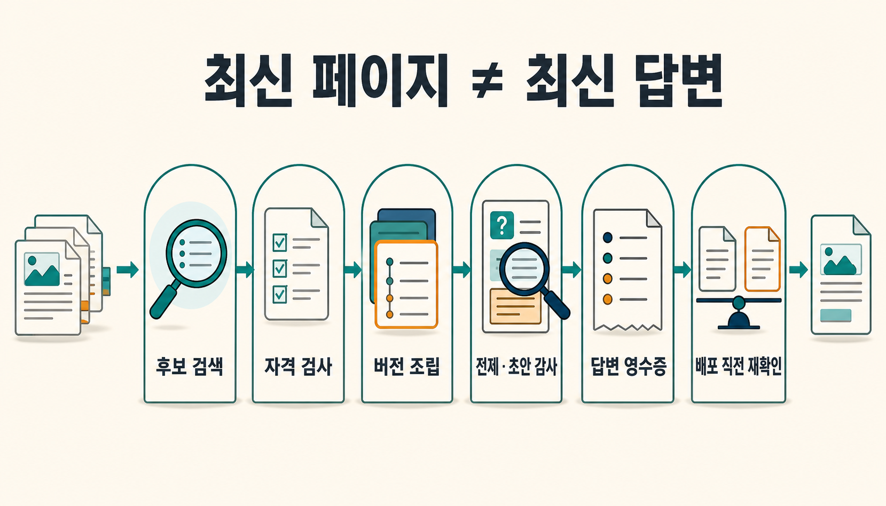
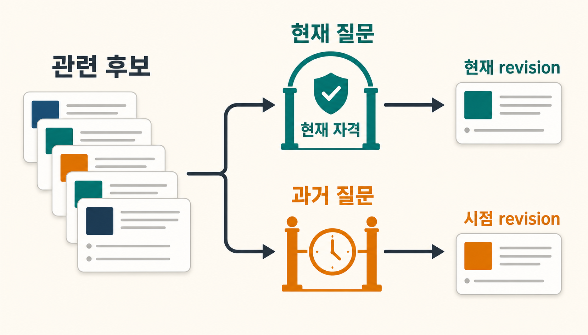
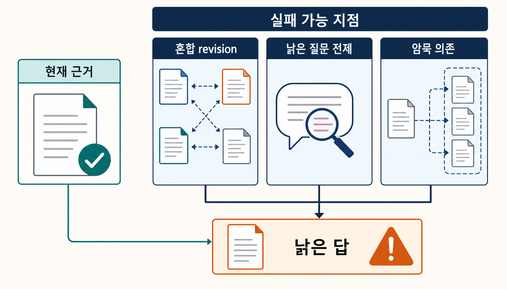
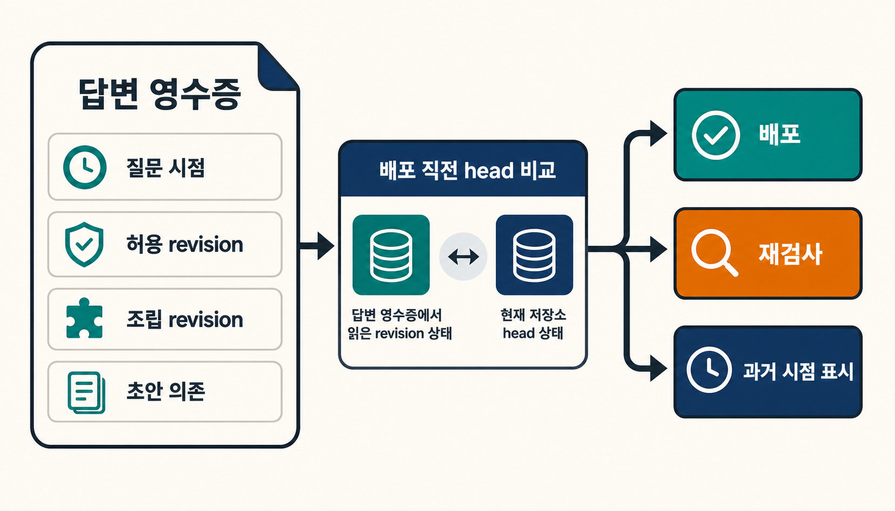

어제 호출 방식이 바뀐 내부 helper를 오늘 Agent가 고친다고 가정해 보겠습니다. Wiki의 canonical page는 이미 새 signature를 반영했습니다. 그런데 검색 cache에 예전 snippet이 남아 있거나, 새 설명과 과거 예제가 같은 context에 섞이거나, 질문 자체가 예전 인자를 당연한 전제로 깔고 있다면 Agent는 **최신 페이지를 가진 채로도 낡은 답을 만들 수 있습니다.**

4번 글에서는 source가 바뀌었을 때 어떤 page를 다시 검토해야 하는지 다뤘습니다. 이번에는 그 수리가 끝난 뒤를 봅니다. Page가 `current`라는 상태와, 지금 만들어지는 답변이 `current`라는 상태는 같지 않습니다.

> [!summary] 핵심 결론
> **최신 지식을 저장해 두는 것과 최신 지식으로 답하는 것은 다른 문제입니다.** Current answer를 만들려면 관련 후보를 찾는 retrieval과 별도로, 지금 써도 되는 revision인지 거르는 admission, 충돌하는 version을 정리하는 assembly, 오래된 전제를 다시 끌어오지 않는 premise·draft 검사, 그리고 답변을 내보내기 직전 사용한 revision이 아직 current인지 확인하는 release gate가 필요합니다.

## 4번은 write side를 닫았고, 5번은 read side를 봅니다

직전 글의 흐름은 다음과 같았습니다.

```text
source revision change
→ dependency receipt로 affected page 계산
→ current/latest surface에서 잠시 제외
→ repair·review
→ promotion 직전 expected revision 재확인
```

이 흐름이 해결하는 질문은 **“어떤 canonical을 다시 믿을 수 있는가?”**입니다. 답변 생성 시점에는 다른 경로가 하나 더 열립니다.

```text
current canonical pages
→ candidate retrieval
→ validity admission
→ version-aware assembly
→ premise·draft audit
→ answer receipt
→ release-time revision recheck
→ current answer
```

4번의 `dependency receipt`는 source가 바뀌었을 때 영향받은 파생 지식을 역추적합니다. 이번 글의 `answer receipt`는 한 답변이 실제로 어떤 state revision을 사용했는지 기록합니다. 둘은 연결되지만 같은 기록은 아닙니다.

```text
dependency receipt
= 이 page는 무엇을 소비해 만들어졌는가?

answer receipt
= 이 답변은 어떤 current state를 실제로 사용했는가?
```

그래서 이번 문제를 page의 속성 하나보다 **read transaction의 freshness**로 보는 편이 낫습니다. 이 표현과 뒤의 receipt schema는 프로젝트 설계 제안이며, LLM Wiki의 확립된 표준이나 현재 공개 저장소의 production runtime을 설명하는 말은 아닙니다.

## 관련도가 높은 것과 지금 유효한 것은 다릅니다

일반적인 retrieval은 질문과 의미가 가까운 후보를 잘 찾는 데 집중합니다. 하지만 state가 시간에 따라 바뀌는 지식에서는 relevance 점수만으로 현재 자격을 정할 수 없습니다.

[StateMem](https://arxiv.org/abs/2608.19652)은 234개 multi-session scenario에서 current state와 superseded state를 구분해 평가하고, explicit supersession과 relational dependency를 별도 상태 관리 문제로 다룹니다. [EvoWiki](https://arxiv.org/abs/2608.23265)도 entity version chain과 state overwrite를 통해 현재 유효한 상태와 과거 이력을 나눕니다. 두 연구 모두 대화형 memory·cross-meeting QA를 다루며, 이 Markdown Wiki의 성능을 검증한 결과는 아닙니다.

그래도 설계 경계는 분명합니다.

```text
semantic relevance
≠ current validity
```

따라서 current-value 질문에서는 ranking 전에 admission을 둘 수 있습니다.

```text
1. semantic / lexical / graph retrieval로 후보를 넓게 찾음
2. status·supersession·scope·permission·query time을 검사
3. 현재 사용할 수 있는 후보만 admitted set으로 만듦
4. admitted set 안에서 ranking
```



여기서 과거 revision을 삭제할 필요는 없습니다. Historical query에는 오히려 예전 상태가 정답일 수 있습니다.

```text
"지금 이 규칙은 무엇인가?"
→ current-valid revision만 사용

"지난 분기에는 이 규칙이 무엇이었나?"
→ as-of 시점에 맞는 historical revision 사용
```

`old ≠ stale`입니다. 오래된 snapshot은 역사적 질문에서 여전히 유효할 수 있고, 최근에 작성한 문서도 이미 superseded됐으면 current query에는 부적합할 수 있습니다.

## Current evidence를 가져와도 old behavior가 남을 수 있습니다

검색이 current state를 찾았다고 답변도 자동으로 최신이 되지는 않습니다. 이 간격을 가장 직접적으로 보여 주는 연구가 [STALE](https://arxiv.org/abs/2605.06527)입니다.

STALE는 400개의 expert-validated conflict scenario와 1,200개 query에서 세 능력을 나눠 평가합니다.

- **State Resolution** — 무엇이 최신 상태인지 찾는가
- **Premise Resistance** — 질문이 오래된 상태를 전제로 해도 그대로 따라가지 않는가
- **Implicit Policy Adaptation** — 새 상태를 실제 행동·추천에 적용하는가

저자 보고에서 평가된 최상 시스템도 전체 점수 55.2%에 머물렀습니다. 이 수치는 personalized agent-memory benchmark의 결과이며 이 Wiki의 stale-answer rate가 아닙니다. 여기서 중요한 것은 숫자보다 **updated evidence retrieval과 updated behavior가 서로 다른 평가 항목으로 분리된다는 점**입니다.

예를 들어 질문이 이렇게 들어올 수 있습니다.

```text
"기존 두 번째 인자를 그대로 넘기면서 새 helper를 어떻게 호출하나요?"
```

현재 revision에서는 그 인자가 이미 사라졌다고 가정해 보겠습니다. Retriever가 새 page를 가져와도 모델이 질문의 전제를 그대로 수용하면 답변은 과거 상태를 재현할 수 있습니다.

그래서 retrieval 뒤에는 premise gate가 필요합니다.

```text
query premise
→ current state와 충돌하는가?
→ 충돌하면 전제를 그대로 수용하지 말고 정정·확인·abstain
```

## Draft에 옛 값이 안 보여도 행동은 옛 상태에 기대고 있을 수 있습니다

오래된 state가 답변에 문자열 그대로 등장하지 않는 경우가 더 어렵습니다. [StateAuditor](https://arxiv.org/abs/2608.01619)는 이 문제를 implicit stale dependency로 다룹니다.

예전 규칙이 “직접 수정”이고 새 규칙이 “proposal을 먼저 생성”이라고 해 보겠습니다. Draft가 예전 규칙의 이름을 쓰지 않더라도 곧바로 수정 API를 호출하라고 권하면 행동은 여전히 과거 state에 의존합니다.

StateAuditor는 draft에서 오래된 표현을 검색하는 대신, 검증된 old→new state transition 쪽에서 draft를 향해 audit합니다. 저자들은 이 검사가 provenance와 chronology를 확인하는 것이며 semantic supersession 자체를 결정론적으로 증명하지는 않는다고 범위를 제한합니다.

프로젝트에 옮길 때도 같은 경계를 유지해야 합니다.

```text
old string absent from draft
≠ old state dependency absent
```



따라서 high-risk recommendation이나 tool action이 있는 경로에서는 state-to-draft audit을 별도 단계로 둘 수 있습니다. 다만 자연어 draft가 어떤 old state에 암묵적으로 의존하는지 안정적으로 자동 추출하는 성능은 이 프로젝트에서 아직 측정하지 않았습니다.

## Retrieval 뒤 assembly가 또 하나의 failure surface입니다

같은 후보 set을 가져와도 어떤 revision을 context에 넣고 어떤 순서로 정리하는지에 따라 결과가 달라집니다.

[Don't Ask the LLM to Track Freshness](https://arxiv.org/abs/2606.01435)는 explicit version marker가 있는 memory conflict에서 retrieval 뒤 version-aware aggregation을 deterministic하게 처리하는 방법을 시험합니다. 같은 backbone을 사용한 비교에서 `max(serial)`을 포함한 whole pipeline이 특정 FactConsolidation 설정에서 +10.8 point를 보고했지만, resolver만 바뀐 단독 ablation이 아니라 prompt·format·temperature 등도 함께 달라진 whole-pipeline effect입니다. 작은 LongMemEval update check에서는 timestamp 기준 resolver가 LLM 판단을 이기지 못했습니다.

그래서 이 결과에서 가져올 결론은 `최신 timestamp를 고르면 해결된다`가 아닙니다.

```text
retrieval set correct
≠ version resolution correct
≠ query intent에 맞는 assembly correct
```

Current-value query에서는 같은 key의 superseded revision을 ordinary answer context에서 빼는 편이 자연스럽습니다. Historical query에서는 오히려 그 revision이 필요합니다. 비교 질문이라면 old와 current를 둘 다 넣되 각 revision의 시점을 명확하게 표시해야 합니다.

한 resolver를 모든 질문에 쓰면 안 되는 이유입니다.

## Stale context는 context가 없는 것과도 다릅니다

코딩 Agent에서는 오래된 repository context가 단순히 “도움이 안 되는 정보”를 넘어 **과거 구현 방향으로 답을 끌어당기는 현상**도 관찰됩니다.

[When Retrieval Hurts Code Completion](https://arxiv.org/abs/2605.14478)은 click, flask, httpx, requests, rich에서 실제 helper signature가 바뀐 17개 사례를 골라 current-only, stale-only, no-retrieval, mixed context를 통제했습니다. 저자 보고에서 stale-only 조건은 Qwen2.5-Coder-7B-Instruct 15/17, gpt-4.1-mini 13/17 사례에서 obsolete signature와 맞는 stale reference를 만들었습니다. Current-only에서는 두 모델 모두 stale reference가 0/17이었습니다.

No-retrieval도 stale reference는 0이었지만 passing completion은 두 모델 모두 1/17이었습니다. 즉 이 작은 진단에서는 `정보가 부족해서 틀림`과 `과거 context가 틀린 방향으로 유도함`이 다른 실패로 나타났습니다.

> [!note] 이 수치의 범위
> 17개 one-parent-commit signature drift와 oracle-controlled retrieval을 사용한 좁은 code-RAG 진단입니다. 실제 배포 retriever의 stale 비율이나 이 프로젝트의 예상 개선률로 사용할 수 없습니다.

별도의 [Temporal Validity on Real Software Histories](https://arxiv.org/abs/2608.20685)는 SWE-bench Lite·Verified의 707개 실제 issue에서 130개 clean atomic state transition을 추출했습니다. 저자는 이 제한된 set에서 자체 MemStrata가 0.91 answer accuracy, 비교 RAG가 0.57~0.59였고 forced-answer 조건에서 RAG의 superseded-value 사용이 36~38%였다고 보고합니다. 하지만 clean atomic transition은 전체 fix의 약 18%이고 단일 저자의 자체 방법 평가입니다. 복잡한 software change 전체나 이 Wiki의 answer pipeline으로 일반화할 수 없습니다.

두 연구를 함께 볼 때 안전하게 가져올 경계는 이것입니다.

```text
no retrieval
≠ stale retrieval

relevant repository context
≠ temporally admissible repository context
```

## 이 프로젝트의 13/13은 성능 점수가 아니라 contract fixture입니다

이번 연구 번들에는 LLM을 호출하지 않는 작은 deterministic fixture가 있습니다. Explicit oracle state를 넣고 answer freshness의 책임을 13개 상태 전이로 쪼갰고 **13/13 PASS**했습니다.

대표적인 검사만 추리면 다음과 같습니다.

```text
relevance-only ranking
→ 더 관련 있어 보이는 superseded r1 선택 가능

current validity gate
→ active r2만 admission

r1 + r2 mixed assembly
→ current query에서는 conflict

historical query as_of=t
→ 당시 유효한 r1 사용 가능

context 생성 뒤 head r2 → r3 변경
→ release 전에 revision recheck 요구
```

이 결과는 [[notes/온톨로지/agent-evaluation-evidence-ladder|24번 글의 평가 사다리]]로 보면 **L1 합성 계약 스모크**에 가깝습니다. 미리 만든 상태에서 분기와 guard가 의도대로 작동한다는 것만 확인했습니다.

증명하지 않은 것이 더 많습니다.

- 실제 LLM이 stale premise를 얼마나 자주 수용하는지
- 자연어에서 implicit dependency를 얼마나 정확히 찾는지
- 실제 vector·graph cache가 revision을 올바르게 무효화하는지
- response audit의 latency와 false positive
- real corpus에서 stale-answer rate가 줄어드는지
- 분산 runtime에서 finalization race를 안전하게 막는지

따라서 `13/13`을 정확도나 운영 안전성 점수로 읽으면 안 됩니다.

## Answer receipt는 “무엇을 답했나”보다 revision을 남겨야 합니다

3번 글에서 receipt는 query·retrieval·model 실행 이력을 남기는 네 번째 객체였습니다. 4번에서는 dependency receipt를 추가해 source change의 역방향 영향을 계산했습니다. 이번에는 query receipt를 **state revision까지 추적하는 answer receipt**로 좁혀 볼 수 있습니다.

```yaml
answer_receipt:
  query_intent: current
  retrieved_candidates:
    - rule@r1
    - rule@r2
  admitted_revisions:
    - rule@r2
  assembled_revisions:
    - rule@r2
  premise_check: pass
  draft_state_dependencies:
    - rule@r2
  observed_head_at_finalize:
    rule: r2
  release_status: current
```

필드 이름은 프로젝트 제안입니다. 중요한 것은 답변 문자열만 저장하지 않고 **어떤 revision을 admission했고 어떤 revision으로 draft를 만들었는지** 남기는 것입니다.

이 receipt가 있으면 source가 r3으로 바뀐 뒤 과거 답변을 감사할 때 “당시 r2가 current였고 그 답변도 r2를 사용했다”와 “r2가 이미 superseded였는데 cache에서 다시 들어왔다”를 구분할 수 있습니다.

## 답을 만드는 동안 head가 바뀌면 마지막에 한 번 더 확인합니다

답변은 한 순간에 만들어지지 않습니다. Retrieval과 assembly가 끝난 뒤 모델이 긴 답을 쓰는 동안 underlying state가 바뀔 수 있습니다.

```text
context build 시점: rule@r2 current
          ↓
답변 생성 중 rule@r3 승격
          ↓
release 시점: r2를 그대로 current answer로 내보낼 것인가?
```

4번 글에서는 promotion 직전 expected source/page revision을 다시 검사했습니다. 같은 원리를 read side에도 적용할 수 있습니다.

```text
answer finalization
→ receipt가 사용한 revision 확인
→ current head와 다시 비교
→ 같음: release 후보
→ 다름: recheck / regenerate / explicit as-of 표시
```



이 release gate도 semantic correctness를 보장하지 않습니다. r2가 current라는 사실과 r2를 해석한 답변이 맞다는 사실은 다릅니다. 목적은 **이미 superseded된 state를 current인 것처럼 내보내는 race를 별도 상태로 잡는 것**입니다.

## 모델에게 `current`라고 쓰게 하는 것만으로는 닫히지 않습니다

한 가지 쉬운 해법은 모델에게 먼저 `current` 또는 `superseded` label을 출력하게 하는 것입니다. 하지만 [Explicit State Elicitation Is Not Enough](https://arxiv.org/abs/2608.17247)는 이런 접근의 한계를 보여 줍니다.

저자들은 초기 480-example development set의 큰 gain을 재검토하면서 lexical separability와 class coverage 문제를 찾았고, 160-example controlled counterfactual set을 새로 구성했습니다. 그 조건에서 explicit state-output field 자체는 두 평가 endpoint에서 policy accuracy를 유의하게 개선하지 못하거나 marginal non-significant gain에 그쳤습니다.

```text
"CURRENT"라고 출력함
≠ faithful state reasoning
≠ final recommendation이 current state를 따름
```

그래서 freshness를 모델의 자기보고 한 줄보다 **검증 가능한 state representation + admission + assembly + behavior audit + receipt**의 조합으로 다루는 편이 낫습니다.

## Side effect가 시작되면 answer freshness 뒤에 gate가 하나 더 생깁니다

최신 research supplement는 여기서 한 단계 더 나갑니다. [SafeCommit](https://arxiv.org/abs/2608.04289)은 persistent memory와 tool output을 사용하는 agent에서 stale·conflicting·incomplete state가 남아 있을 때 side-effectful action을 너무 빨리 실행하는 문제를 `commit | probe | fallback`의 별도 결정으로 둡니다.

이 연구는 controlled simulator와 명시적인 formal assumption에 기대는 proof-of-concept입니다. 이 프로젝트의 action safety를 검증한 결과가 아닙니다. 다만 다음 경계를 남기는 데는 유용합니다.

```text
current answer or plan
≠ 지금 side effect를 commit해도 됨
```

이번 프로젝트에서도 이 경계를 LLM 없이 6개 synthetic action-release contract로만 확인했고 6/6이 통과했습니다. 이것 역시 안전성 개선률이 아니라 policy denial, revision freshness, evidence sufficiency와 commit 상태를 분리할 수 있다는 구조 검사입니다. 실제 action runtime, plausible-world completeness, false block와 commit latency는 검증하지 않았습니다.

## 작은 Wiki라면 세 단계부터 시작하면 됩니다

Answer freshness를 위해 처음부터 여덟 개 gate를 만들 필요는 없습니다. 실패가 관찰되는 순서대로 올리는 편이 낫습니다.

**1단계 — current와 historical query를 나눕니다.**

Current query에는 superseded·conflict revision을 기본 후보에서 빼고, historical query에는 `as_of` 시점을 명시합니다.

**2단계 — ranking보다 admission을 앞에 둡니다.**

```text
retrieve broadly
→ validity / supersession / scope / permission gate
→ rank admitted candidates
```

이 한 단계만으로 relevance가 validity를 대신하는 오류를 줄일 수 있는지 먼저 측정합니다.

**3단계 — answer receipt와 release recheck를 붙입니다.**

답변이 실제 사용한 revision을 남기고, release 직전 current head와 다시 비교합니다. 실제로 stale premise나 implicit behavior failure가 반복될 때 premise gate와 state-to-draft audit을 추가합니다.

작은 Wiki나 변경 빈도가 낮은 corpus에서는 매 질문마다 live source를 직접 확인하거나 full rebuild·full review를 하는 쪽이 더 단순할 수 있습니다. Fine-grained gate는 그 복잡성이 실제 실패 비용을 줄인다는 근거가 생길 때 도입해야 합니다.

## 최종 판단

LLM Wiki를 최신으로 유지하는 작업은 source와 page를 고치는 데서 끝나지 않습니다. 4번 글의 dependency receipt와 promotion precondition은 **write side freshness**를 관리합니다. 그 다음 current answer에는 **read side freshness**가 필요합니다.

Retrieval은 관련 후보를 찾습니다. Admission은 그 후보를 지금 써도 되는지 판정합니다. Assembly는 같은 key의 충돌 revision을 query intent에 맞게 정리합니다. Premise와 draft audit은 오래된 state가 질문이나 행동에 다시 스며드는지 봅니다. Answer receipt는 실제 사용 revision을 남기고, release gate는 답변을 내보내기 직전 그 revision이 아직 current인지 확인합니다.

이 구조가 모든 RAG·Agent에 필요하다는 근거는 없습니다. 현재 외부 근거의 상당수는 2026년 preprint이고, project fixture도 합성 상태 머신입니다. 실제 LLM stale-answer rate, real corpus 성능, latency와 false positive는 아직 측정하지 않았습니다.

그래서 첫 구현의 기준은 단순합니다. **“관련도가 높은가?”와 “지금 써도 되는가?”를 한 점수로 합치지 마십시오.** Current/historical query를 먼저 나누고, admitted revision을 receipt에 남긴 뒤, 답변을 내보내는 순간 current head를 다시 확인하는 것부터 시작하면 됩니다. Page가 current라는 사실을 answer가 current라는 증거로 사용하지 않는 것이 이번 단계의 가장 작은 계약입니다.

## 함께 읽기

- [[notes/llm-wiki/llm-wiki-origin-and-implementations|1. LLM Wiki가 뭔가? 안드레이 카파시가 건넨 지식 성장 루프]]
- [[notes/llm-wiki/doctology-llm-wiki-anatomy|2. DocTology LLM Wiki 해부학: 폴더 구조와 실행 경계를 함께 읽는 법]]
- [[notes/llm-wiki/llm-wiki-authority-lifecycle-mvp|3. LLM Wiki는 네 종류의 파일로 시작한다: source · candidate · canonical · receipt MVP]]
- [[notes/llm-wiki/llm-wiki-stale-propagation|4. 원문이 바뀌면 LLM Wiki의 어떤 페이지를 다시 믿을 수 있는가: stale propagation과 dependency receipt]]
- [[notes/온톨로지/agent-evaluation-evidence-ladder|24. 합성 검사를 통과한 에이전트는 왜 아직 검증되지 않았는가: 계약 검사에서 운영 증거까지 잇는 평가 사다리]]

## 참고 자료

- Hanxiang Chao et al., [STALE: Can LLM Agents Know When Their Memories Are No Longer Valid?](https://arxiv.org/abs/2605.06527)
- Haofei Sun, Lin He, [When Memory Updates but Behavior Does Not: Repairing Implicit Stale Dependencies in Personalized Agent Responses](https://arxiv.org/abs/2608.01619)
- Vikas Reddy, Sumanth Challaram, [Don't Ask the LLM to Track Freshness: A Deterministic Recipe for Memory Conflict Resolution](https://arxiv.org/abs/2606.01435)
- Xinyi Fan et al., [Can Agent Memory Systems Track Evolving State?](https://arxiv.org/abs/2608.19652)
- [EvoWiki: Incremental State Overwriting and Traceable Question Answering for Cross-Meeting Knowledge Evolution](https://arxiv.org/abs/2608.23265)
- Sarthak Singh, [DreamBench-SWE: A Multi-Session Memory-Hygiene Benchmark for Software Agents](https://arxiv.org/abs/2608.20664)
- Yan Zhou et al., [TEPA: Revoking Stale Memories for Conflict-Robust Language Agents](https://arxiv.org/abs/2608.07429)
- Yihang Chen et al., [Explicit State Elicitation Is Not Enough: A Controlled Audit of Memory-Policy Classification](https://arxiv.org/abs/2608.17247)
- Haojun Weng et al., [When Retrieval Hurts Code Completion: A Diagnostic Study of Stale Repository Context](https://arxiv.org/abs/2605.14478)
- Neeraj Yadav, [Temporal Validity on Real Software Histories: Eliminating Stale-Fact Errors in Code-Assistant Memory over GitHub Fixes](https://arxiv.org/abs/2608.20685)
- [SafeCommit: Certifying When Memory-Grounded Agents May Safely Act](https://arxiv.org/abs/2608.04289)
