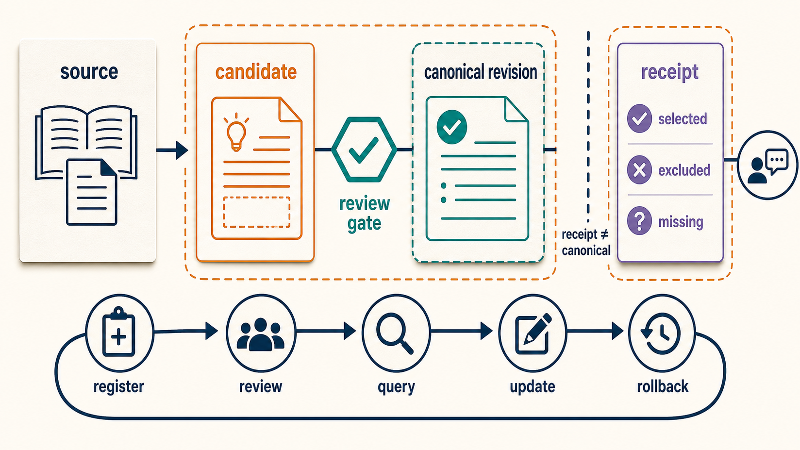
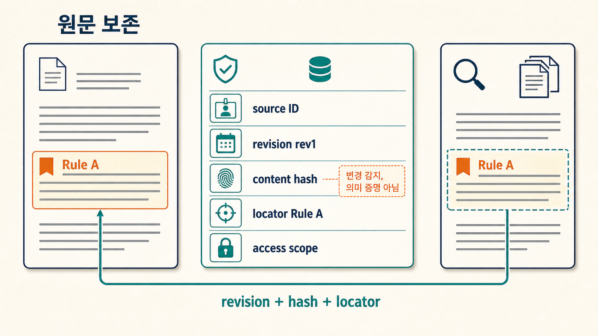
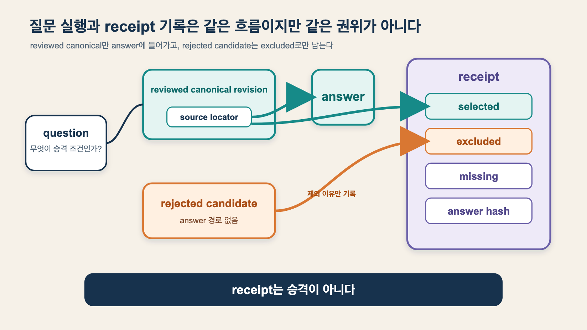
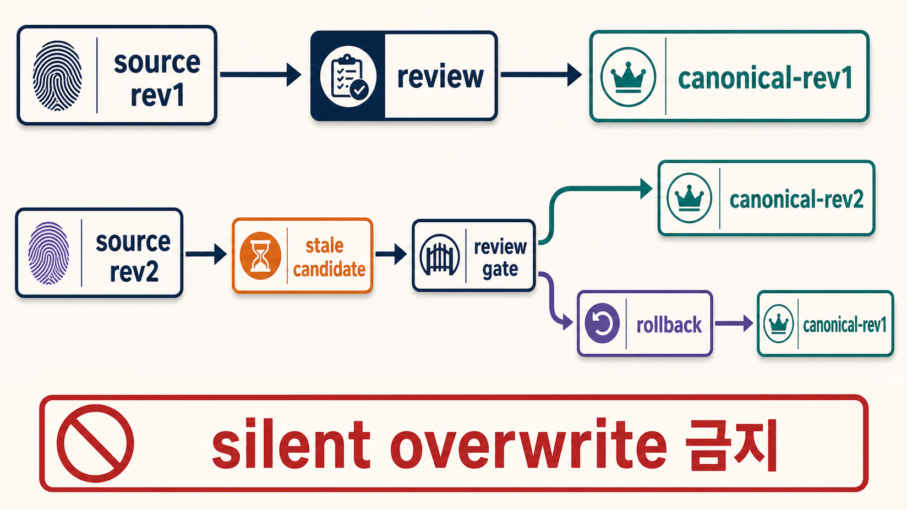

LLM Wiki를 만들겠다고 빈 폴더를 열면 대개 검색 엔진부터 고민합니다. 임베딩 모델, vector DB, graph DB, reranker를 고르다 보면 정작 더 위험한 질문이 남습니다.

**모델이 방금 만든 문장을 어느 파일에 써도 되는가?**

원문, 모델의 제안, 검토된 현재 지식, 한 번의 답변 기록을 같은 Markdown 폴더에 섞으면 파일은 많아져도 권위는 흐려집니다. 검색 결과가 반복해서 선택됐다는 이유로 정본이 되고, 오래된 원문이 바뀌어도 요약은 조용히 남으며, 잘못된 답의 입력 경로를 복원할 수 없게 됩니다.

> [!summary] 핵심 결론
> 첫 LLM Wiki의 최소 단위는 vector index가 아니라 **서로 다른 쓰기 권한을 가진 네 객체**입니다. `source`는 원문, `candidate`는 미승인 제안, `canonical`은 검토된 현재 지식 revision, `receipt`는 질문별 실행 기록이며, Agent는 candidate와 receipt를 만들 수 있지만 canonical을 바로 고치지 않습니다.

`llm-wiki-from-scratch`의 네 객체 권위 모델과 `persistent-knowledge-compiler`의 provenance·승격·rollback 요구를 연결해 파일 기반 fixture로 수명주기 8개 검사를 실행했습니다. 결과는 8/8 통과했지만 이는 **작은 결정론적 파일 흐름**의 성공입니다. LLM 추출 품질, 검색 정확도, 비용, 지연, 보안 격리와 대규모 운영은 측정하지 않았습니다.

## 1. `Raw / Wiki / Schema`를 실제 쓰기 경로로 번역합니다

[1번 글](https://tteggu87.github.io/notes/llm-wiki/llm-wiki-origin-and-implementations)은 Andrej Karpathy의 원형을 `Raw Sources / Markdown Wiki / Schema`로 정리했습니다. 이 구조는 무엇을 보존하고 무엇을 종합할지 설명하지만, 자동화가 파일을 쓰기 시작하면 상태 전이가 더 필요합니다.

```text
Raw source
→ 모델이 제안한 문장
→ 검토된 현재 지식

질문
→ 선택한 근거와 제외한 후보
→ 답변
```

여기서 가운데 단계를 생략하면 모델 출력이 곧 Wiki가 됩니다. 반대로 모든 결과를 임시 메모로만 남기면 장기 지식이 자라지 않습니다. 그래서 첫 구현에서는 저장 형식보다 권위를 네 종류로 나눕니다.

| 객체        | 의미                              | 기본 작성자             | 정본 여부                                                   | 다음 상태                    |
| ----------- | --------------------------------- | ----------------------- | ----------------------------------------------------------- | ---------------------------- |
| `source`    | 원문·직접 관찰과 revision         | 수집기·사람             | 수집된 원문 revision의 기준 기록이며 진실성을 보증하지 않음 | candidate의 근거             |
| `candidate` | 아직 승인하지 않은 주장·요약·관계 | Agent·사람              | 아님                                                        | reviewed·rejected·superseded |
| `canonical` | 검토된 현재 지식 revision         | reviewer·promotion 명령 | 사람이 읽는 현재 정본                                       | 새 revision·deprecated       |
| `receipt`   | 한 질문·실행의 선택·제외·missing  | query runtime           | 아님                                                        | 필요하면 새 candidate        |

이 네 객체가 반드시 네 개의 최상위 폴더여야 하는 것은 아닙니다. 작은 개인 Wiki라면 한 폴더 안의 `type`과 `status`로 구분할 수도 있습니다. 그러나 다음 전환은 암묵적으로 일어나면 안 됩니다.

```text
candidate → canonical
receipt → candidate
source revision 변경 → canonical 재검토
```

## 2. Source는 “읽은 문서”가 아니라 재검증할 주소입니다



Source 파일의 역할은 내용을 멋지게 요약하는 것이 아닙니다. 나중에 주장을 다시 검사할 수 있도록 **같은 원문 revision의 같은 구간**으로 돌아가는 것입니다.

최소 등록 정보는 다음과 같습니다.

```yaml
id: src_promotion_contract
kind: source
revision: rev1
content_hash: sha256:...
path: raw/promotion-contract.md
locators:
  - Rule A
  - Rule B
access_scope: project-local
```

`path`만 저장하면 파일이 바뀐 뒤에도 같은 근거라고 착각할 수 있습니다. hash만 저장하면 사람이 어느 문단을 읽어야 하는지 알기 어렵습니다. 따라서 첫 MVP에서도 `revision + hash + locator`를 함께 둡니다.

Locator의 최적 형식은 문서 종류에 따라 다릅니다. Markdown heading, paragraph ID, PDF page·bbox, 표의 row key, 영상 timestamp 중 무엇이 장기적으로 가장 안정적인지는 이 글에서 비교하지 않았습니다. 중요한 것은 locator가 **실제로 해석되는지 검사**하는 것입니다.

## 3. Candidate는 Agent의 쓰기 자유를 보존하는 완충지대입니다

Agent가 canonical을 직접 수정하지 못하게 하면 자동화가 쓸모없어 보일 수 있습니다. 실제로 필요한 것은 쓰기 금지가 아니라 쓰기 경로의 분리입니다.

```text
Agent가 할 수 있는 일
- source 등록 제안
- claim candidate 생성
- 반례·unknown candidate 생성
- receipt 작성

Agent가 바로 할 수 없는 일
- canonical claim 교체
- policy·permission 확대
- 기존 반례 삭제
- 승인 없이 source scope보다 넓게 공개
```

Candidate에는 자연어 문장만 두지 않습니다. 최소한 source ID, locator, 현재 상태, 적용 범위와 충돌 대상을 붙입니다.

```yaml
id: cand_locator_review
kind: claim
status: candidate
statement: >-
  Canonical promotion requires reviewer verification
  of an existing source locator.
source_id: src_promotion_contract
locator: Rule A
contradicts: []
supersedes: []
```

모델 confidence 숫자는 승격 권한이 아닙니다. 높은 확률은 문장이 그럴듯하다는 모델 내부 신호일 뿐, source가 그 문장을 지지하거나 현재 적용 범위에서 유효하다는 검토를 대신하지 않습니다.

## 4. Canonical은 파일 하나가 아니라 승인된 revision입니다

Canonical을 “최종본”이라고 부르면 갱신 모델이 사라집니다. 장기 지식은 변하므로 더 정확한 표현은 **현재 승인된 revision**입니다.

```text
canonical-rev1
├── claim revision: claim-rev1
├── source revision: src rev1
├── reviewed_by: reviewer
└── rollback target: previous revision
```

승격 gate는 최소한 다음을 검사합니다.

1. 참조한 source와 locator가 존재하는가
2. 문장이 locator의 범위를 넘어 강화되지 않았는가
3. 반례와 unknown이 삭제되지 않았는가
4. source revision과 접근 범위가 현재도 유효한가
5. reviewer와 변경 hash, 이전 revision이 기록됐는가

이 검사는 “사람이 언제나 옳다”는 가정이 아닙니다. 승인 실패를 되돌릴 주소를 남기고, 모델의 생성 권한과 장기 정본의 수정 권한을 분리하는 운영 기본값입니다.

## 5. Receipt는 답변을 지식으로 승격시키지 않고 관찰 가능하게 만듭니다



Receipt는 답변 전문을 저장하는 로그보다 좁고, 근거를 재구성하는 기록보다 넓습니다. 최소 필드는 다음과 같습니다.

```json
{
  "question": "What is required before canonical promotion?",
  "selected": [
    {
      "claim_id": "cand_locator_review",
      "revision": "claim-rev1",
      "source_id": "src_promotion_contract",
      "locator": "Rule A"
    }
  ],
  "excluded": [
    {
      "candidate_id": "cand_receipt_autopromote",
      "reason": "rejected"
    }
  ],
  "missing": [],
  "answer_hash": "sha256:..."
}
```

Receipt가 중요한 이유는 성공한 답변을 자동으로 학습시키기 위해서가 아닙니다. 잘못된 답이 발견됐을 때 다음을 구분하기 위해서입니다.

- 잘못된 source를 읽었는가
- 오래된 canonical revision을 읽었는가
- 올바른 근거를 읽고도 생성에서 왜곡했는가
- 필요한 근거가 `missing`이었는데 답을 강행했는가

같은 receipt가 반복됐다는 사실은 관심도 신호가 될 수 있지만 canonical 승격 근거는 아닙니다. 반복적으로 유용한 답은 새 candidate를 만들고 같은 review gate를 통과합니다.

## 6. 빈 폴더에서 재현한 최소 수명주기

이번 fixture는 다음 디렉터리만 사용했습니다.

```text
fixture/
├── source/
├── candidate/
├── canonical/
├── receipt/
└── state/
```

입력 source에는 두 규칙만 넣었습니다.

```text
Rule A
source locator를 reviewer가 확인한다.
그 뒤에만 canonical로 승격한다.

Rule B
receipt는 다음을 기록한다.
- 질문과 선택한 revision
- 제외한 candidate
- missing evidence
receipt는 canonical knowledge가 아니다.
```

Agent 역할로 candidate 두 개를 제안했습니다.

```text
candidate A
“승격 전에 reviewer가 기존 locator를 확인해야 한다.”
→ Rule A가 직접 지지

candidate B
“반복된 receipt는 review 없이 자동 승격할 수 있다.”
→ Rule B와 맞지 않는 범위 과장
```

Review 결과 A 하나만 `canonical-rev1`에 들어갔고 B는 rejected로 남았습니다. 이어서 질문을 실행해 A의 revision과 locator를 selected에, B를 excluded에 기록한 receipt를 만들었습니다.

Source를 `rev2`로 바꿨을 때 canonical 파일을 덮어쓰지 않았습니다. 이전 hash와 새 hash를 가리키는 `stale candidate`를 만들고, `canonical-rev1`을 rollback target으로 유지했습니다.

### 실행 결과

| 검사                                       | 결과 |
| ------------------------------------------ | ---- |
| source hash·revision 등록                  | 통과 |
| Agent의 canonical 직접 쓰기 차단           | 통과 |
| locator 근거가 있는 candidate 승격         | 통과 |
| 근거를 넘는 candidate 기각                 | 통과 |
| query가 reviewed revision만 선택           | 통과 |
| receipt 재구성 필드 완전성                 | 통과 |
| source 변경 시 stale candidate 생성        | 통과 |
| 이전 canonical revision rollback 주소 보존 | 통과 |

총 **8/8 검사**가 통과했습니다. 생성된 객체 수는 source 1개, 초기 candidate 2개, reviewed promotion 1개, rejection 1개, receipt 1개, stale proposal 1개입니다.

이 숫자는 제품 성능 지표가 아닙니다. 고정된 작은 fixture가 설계한 상태 전이를 그대로 수행했는지 확인한 카운트입니다. LLM을 호출하지 않았고 검색 품질도 평가하지 않았습니다.

## 7. 최소 frontmatter는 점수보다 수명주기를 설명해야 합니다

Candidate와 canonical에 많은 필드를 넣으면 관리 부담이 커집니다. 첫 버전에서는 아래 질문에 답하는 필드부터 둡니다.

```yaml
id: claim-example
kind: claim
status: candidate | reviewed | rejected | superseded
visibility: private | team | public
source_ids: [src_example]
evidence:
  - source_id: src_example
    locator: "section 2 / paragraph 4"
    relation: supports
valid_from: 2026-08-06
reviewed_at:
reviewed_by:
contradicts: []
supersedes: []
```

- 이 문장은 무엇인가
- 지금 어느 상태인가
- 무엇을 근거로 하는가
- 어디까지 보이는가
- 언제부터 유효한가
- 누가 검토했는가
- 무엇과 충돌하거나 무엇을 대체하는가

이 질문에 답하지 못하는 `confidence: 0.93`은 장기 운영에 거의 도움이 되지 않습니다.

## 8. Source revision이 바뀌면 조용히 고치지 않습니다



원문 갱신은 가장 흔한 오염 경로입니다. 단순 자동화는 새 원문을 읽고 기존 Wiki 문장을 바로 다시 씁니다. 그러면 무엇이 바뀌었고 왜 바뀌었는지, 이전 답변이 어느 revision을 사용했는지 잃습니다.

첫 MVP의 갱신 규칙은 단순합니다.

```text
source hash 동일
→ 기존 parse·candidate 재사용 가능

source hash 변경
→ 영향을 받는 canonical을 stale로 표시하는 candidate 생성
→ locator와 claim strength 재검토
→ 승인 시 canonical-rev2
→ 문제 발생 시 canonical-rev1 rollback
```

`stale`은 즉시 틀렸다는 뜻이 아닙니다. supporting source가 바뀌어 현재성을 다시 확인해야 한다는 상태입니다. 이 차이를 두면 갱신 속도를 유지하면서도 조용한 정본 교체를 피할 수 있습니다.

## 9. 검색은 네 객체 뒤에 붙입니다

첫 수명주기가 동작하기 전에는 vector DB가 문제를 해결하지 못합니다. 검색기가 candidate와 canonical을 구분하지 않으면 더 정교한 검색은 미승인 문장을 더 잘 찾아 줄 뿐입니다.

가장 얇은 검색은 다음으로 충분합니다.

```text
exact title·alias
+ Markdown full-text 또는 BM25
+ frontmatter status filter
+ source locator lookup
+ wikilink 1~2 hop
```

초기 query 계약은 간단합니다.

```text
답변 후보 =
  reviewed canonical
  ∩ 현재 source revision
  ∩ 허용 visibility
candidate·rejected = 기본 제외
claim-heavy 답변 = locator 재확인
근거 공백 = missing 기록 후 보류 가능
```

Vector search는 표현이 다른 관련 페이지를 lexical 검색이 반복해서 놓칠 때 추가합니다. Graph는 고정 질문에서 관계 경로·다중 홉 실패가 반복되고, 단순 wikilink와 source 검증 기준선보다 추가 가치를 보여 줄 때 비교합니다. Ontology는 entity 충돌, relation 제약, 정책·권한 검증이 반복될 때 필요한 부분부터 도입합니다.

## 10. 네 객체 MVP가 실패하는 지점도 분명합니다

이 구조는 작고 이해하기 쉽지만 공짜가 아닙니다.

### Review queue가 병목이 됩니다

Agent가 canonical을 직접 쓰지 않으면 candidate가 쌓입니다. reviewer accept·edit·reject 비율, 대기 시간, stale age를 측정하고 저위험 source note와 고위험 policy claim의 gate를 다르게 설계해야 합니다.

### Locator가 깨질 수 있습니다

Heading 이름 변경, PDF 재편집, table row 이동은 locator를 무효화합니다. hash는 변경을 알려 주지만 새 위치를 자동으로 찾아 주지 않습니다. locator resolution 실패를 조용히 무시하지 않고 stale·missing으로 표면화해야 합니다.

### 파일 권한만으로 보안을 증명할 수 없습니다

이 fixture의 canonical 쓰기 차단은 코드의 actor 비교로 재현한 계약 검사입니다. 실제 multi-user·multi-agent 환경의 ACL, tenant 격리, symlink·path traversal, remote write와 비밀 관리는 검증하지 않았습니다.

### Markdown만으로 모든 규모를 감당하지 못합니다

동시 편집, 수백만 segment, 대규모 ACL filter, 낮은 지연의 hybrid retrieval이 필요하면 JSONL registry, SQLite·vector index, graph projection과 별도 review service가 필요할 수 있습니다. 다만 이 파생 계층도 source와 canonical revision에서 재생성 가능해야 합니다.

## 11. 다음 기능을 붙이는 승격 기준

기능 목록이 아니라 실패 증거로 확장합니다.

| 관찰된 실패                                     | 다음 후보                                      | 비교해야 할 기준선                    |
| ----------------------------------------------- | ---------------------------------------------- | ------------------------------------- |
| exact·BM25가 표현 차이로 관련 page를 반복 누락  | local embedding·hybrid RAG                     | lexical only                          |
| 관계·영향 질문이 wikilink 1~2 hop에서 반복 실패 | typed derived graph                            | Wiki navigation + source verification |
| entity alias·relation domain/range 충돌이 반복  | 경량 ontology·schema guard                     | registry 없는 구조                    |
| candidate가 너무 많아 review가 정체             | risk tier·batch review·dedupe                  | 단일 queue                            |
| source 갱신 뒤 stale page를 놓침                | dependency registry·incremental invalidation   | 수동 audit                            |
| 여러 agent가 보호 파일을 건드림                 | write allowlist·proposal service·approval role | 파일 권한만 사용                      |

평균 답변 점수 하나로 승격하지 않습니다. claim citation support, caveat 보존, token·latency·구축 비용, review 비용, permission leakage와 rollback 가능성을 나눠 봅니다.

## 12. 오늘 만들 최소 체크리스트

```text
[ ] source 하나에 ID·revision·hash·locator를 기록한다
[ ] Agent가 쓸 candidate 경로를 만든다
[ ] canonical 직접 write를 기본 차단한다
[ ] supported 1개와 overclaim 1개를 review한다
[ ] 질문이 reviewed revision만 읽는지 검사한다
[ ] receipt에 selected·excluded·missing·hash를 남긴다
[ ] source hash 변경 시 stale candidate를 만든다
[ ] 이전 canonical revision으로 rollback할 주소를 남긴다
```

이 여덟 단계가 재현되기 전에는 검색 기능이 부족한지 권위 경계가 부족한지 구분하기 어렵습니다. 반대로 이 흐름이 안정되면 vector, graph, ontology는 “있으면 멋진 기술”이 아니라 **관찰된 실패를 해결하는 파생 계층**이 됩니다.

## 검증 범위와 한계

- `source → candidate → review → canonical`과 `question → receipt`, source revision 변경과 rollback 주소를 결정론적 파일 fixture로 실행했습니다.
- fixture는 8개 계약 검사를 통과했습니다. 이는 테스트가 스스로 정의한 작은 상태 전이를 만족했다는 뜻입니다.
- LLM 추출·요약·판정은 실행하지 않았고 answer accuracy, retrieval recall, latency, cost와 reviewer throughput을 측정하지 않았습니다.
- Agent canonical write 차단은 실제 OS·서비스 보안 감사가 아니라 fixture 내부 계약 검사입니다.
- 네 객체가 다른 설계보다 우월하다는 비교 실험은 없습니다.
- 연구 번들의 evidence audit는 통과했지만 독립 reviewer가 없는 degraded 반증 검토와 일부 metadata-only 출처 한계가 있습니다.

## 관련 글

- [[notes/llm-wiki/llm-wiki-origin-and-implementations|1. LLM Wiki가 뭔가? 안드레이 카파시가 건넨 지식 성장 루프]]
- [[notes/llm-wiki/doctology-llm-wiki-anatomy|2. DocTology LLM Wiki 해부학: 폴더 구조와 실행 경계를 함께 읽는 법]]
- [[notes/온톨로지/llm-wiki-double-compilation|25. LLM Wiki는 RAG를 대체하는가: 저장과 검색 사이의 이중 컴파일]]

## 출처

- [Andrej Karpathy, LLM Wiki Gist](https://gist.github.com/karpathy/442a6bf555914893e9891c11519de94f)
- [W3C PROV-O: The PROV Ontology](https://www.w3.org/TR/prov-o/)
- [SQLite FTS5 Extension](https://www.sqlite.org/fts5.html)
- [Git Documentation — git-diff](https://git-scm.com/docs/git-diff)
