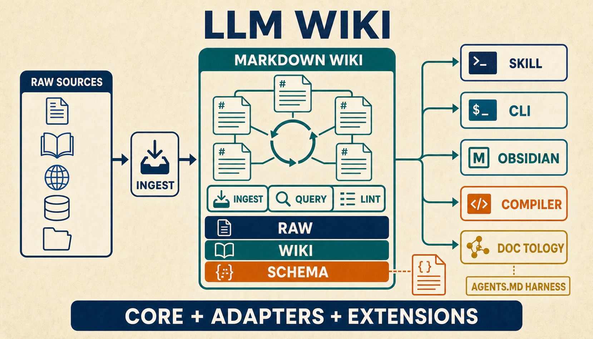
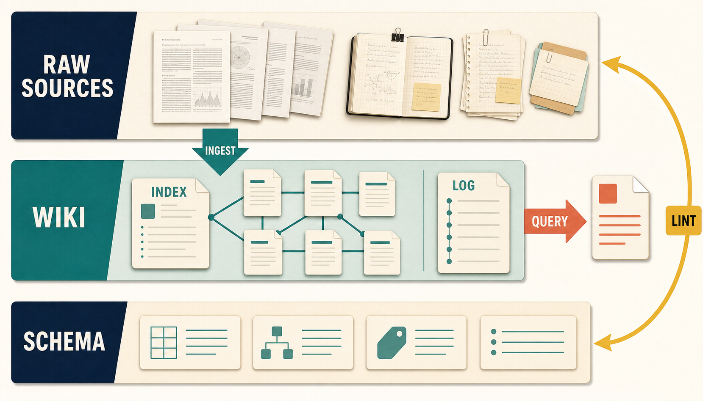
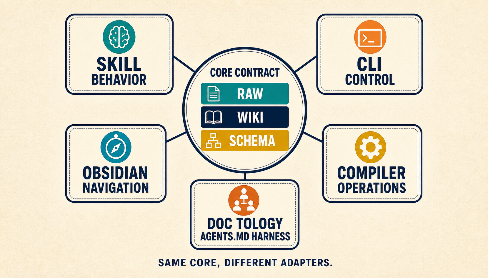
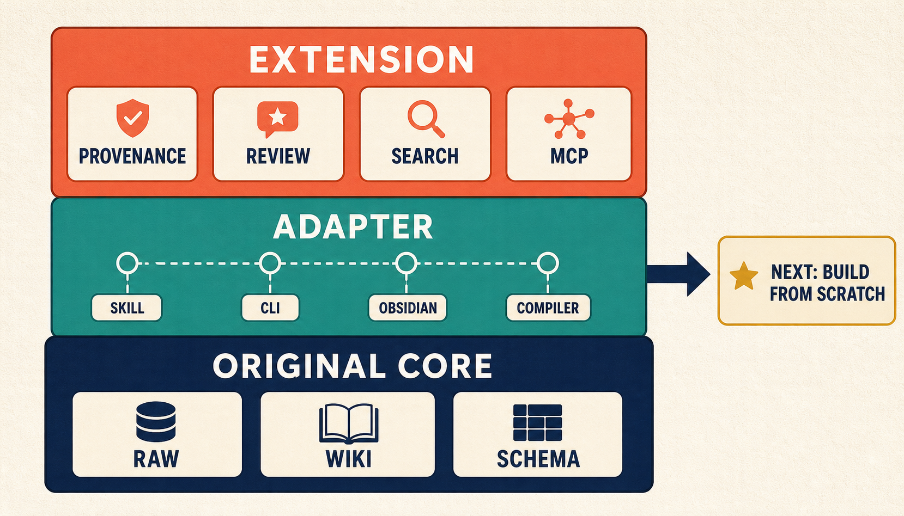

같은 자료를 읽고 내린 판단인데도 다음 질문이 들어오면 처음부터 다시 조사하는 일이 반복됩니다. 답은 남아 있어도 어떤 근거를 비교했고, 어떤 대안을 버렸으며, 무엇이 아직 불확실한지는 대화 기록 속에 흩어지기 쉽습니다.

안드레이 카파시(Andrej Karpathy)가 제안한 `LLM Wiki`는 이 반복을 줄이려는 작업 방식입니다. 대규모 언어 모델(Large Language Model, LLM)이 원문을 읽고 얻은 개념·비교·반례·미해결 질문을 서로 연결된 Markdown 문서로 남기고, 새 자료가 들어오면 기존 문서를 고칩니다. 원문을 없애는 저장소가 아니라 **원문으로 돌아갈 경로를 유지하면서 검토된 종합을 다음 작업에 넘기는 지식 작업 공간**에 가깝습니다.

> [!summary] 핵심 결론
> 검색 증강 생성(Retrieval-Augmented Generation, RAG)은 질문이 들어온 시점에 필요한 원문 조각을 찾아 답변에 공급합니다. LLM Wiki는 조사 과정에서 얻은 종합과 판단 이력을 다음 질문에서도 재사용할 수 있는 문서로 유지합니다. 둘은 대체 관계라기보다 질문 시점의 검색과 장기간의 지식 유지라는 서로 다른 책임을 맡으며, LLM Wiki의 가치는 더 높은 성능을 자동으로 보장하는 데 있지 않고 사람이 근거와 수정 이력을 확인할 수 있게 만드는 데 있습니다.

예를 들어 한 팀이 같은 기술 도입 여부를 분기마다 다시 검토한다고 가정해 보겠습니다. 첫 조사에서 여러 문서를 비교해 선택 조건과 반례를 정리했더라도, 결과가 답변 한 건으로만 남으면 다음 조사자는 같은 자료를 다시 찾고 같은 대안을 다시 검토합니다. LLM Wiki는 이전 조사에서 확인한 사실, 결정 이유, 기각한 선택지와 남은 질문을 페이지와 링크로 보존합니다. 다음 조사자는 그 문서에서 출발하되, 가격·버전·정책처럼 바뀌기 쉬운 사실은 원문이나 API에서 다시 확인합니다.

## 1. 왜 원문 구상부터 읽어야 하는가

안드레이 카파시의 Gist 제목은 `LLM Wiki`이며, 특정 상용 프로그램의 가이드북이 아니라 **LLM을 활용해 개인 지식 기반을 만드는 패턴**입니다. 카파시는 이를 완성된 제품 명세가 아닌, 자신의 에이전트에 복사해 아이디어를 전달하는 문서로 공유했습니다.

카파시의 원본 구상은 큰 아키텍처 방향을 제시할 뿐, 특정 기술 스택을 고정하지 않습니다.

- 특정 브랜드의 데이터베이스나 전용 저장소
- 고정된 임베딩 모델이나 벡터 검색 파이프라인
- 엄격하게 규격화된 폴더 구조와 frontmatter 속성
- Obsidian 이외의 전용 UI나 특정 앱
- 파이프라인 자동화 수준과 인간의 승인 절차

개별 구현체부터 접하면 특정 도구의 부가 기능이 LLM Wiki의 정의처럼 보일 수 있습니다. 따라서 원문이 제시한 최소 방향과 후속 구현체가 덧붙인 확장 기능을 구분해서 읽어야 합니다.

## 2. RAG와 LLM Wiki는 지식의 수명을 다르게 다룹니다

RAG는 질문이 들어오면 검색 인덱스에서 관련 원문 조각을 찾고, 이를 모델이 답변할 문맥으로 제공합니다. 최신 정책 한 줄, 특정 문서의 정확한 표현, 현재 장애 상태처럼 그 시점의 원문 확인이 중요한 질문에 잘 맞습니다.

LLM Wiki는 질문 이전과 이후의 시간을 다룹니다. 새 자료를 읽어 기존 페이지를 고치고, 여러 출처의 공통점과 충돌을 정리하며, 앞으로 다시 사용할 판단을 남깁니다.

```text
RAG:         질문 → 원문 검색 → 질문별 문맥 → 답변

LLM Wiki:    새 원문 → Wiki 갱신·검토 → 질문 → 관련 Wiki 탐색
                                            ↘ 필요한 원문 재확인 → 답변
```

여기서 LLM은 원문 요약만 쓰지 않습니다. 새 자료와 관련된 기존 페이지를 찾아 개념·인물·비교·종합을 갱신하는 **지식 유지 관리자(Maintainer)** 역할을 맡습니다.

사람과 LLM의 역할도 나뉩니다.

- 사람은 읽을 원자료와 질문을 고르고, 결과를 검토합니다.
- LLM은 원문을 요약하고, 기존 페이지와 링크·색인·로그의 변경안을 만듭니다.
- 사람은 Markdown 뷰어와 변경 diff에서 근거·반례·오류를 확인합니다.

RAG가 답변과 로그를 저장할 수 없다는 뜻은 아닙니다. 차이는 **과거에 만든 종합과 결정 이유를 다음 작업에서 직접 읽고 수정할 지식 산출물로 관리하느냐**에 있습니다. RAG가 질문 시점의 근거 공급을 맡는다면, LLM Wiki는 그 앞뒤에 작성·수정·연결·검토의 수명주기를 붙입니다.

## 3. 얻는 것은 재사용성이고, 새로 생기는 비용은 유지보수입니다

구현 방식을 평가할 때 기능 수만 세면 도입 이유가 흐려집니다. 반복해서 다시 만드는 종합을 얼마나 재사용할 수 있는지, 그 대가로 어떤 검토·유지 비용이 생기는지를 함께 봐야 합니다.

### 유연성: 특정 저장소를 필수로 요구하지 않습니다

카파시의 구상은 특정 데이터베이스나 벡터 인덱스를 필수로 지정하지 않습니다. 사용자는 자료와 작업 방식에 맞춰 폴더 구조, 파일명과 링크 규칙을 정할 수 있습니다.

이 선택은 지식 구조에 오류가 생겼을 때 유용합니다. 검색 파이프라인 전체를 다시 만들기 전에 Markdown 문서와 연결 규칙을 고쳐볼 수 있습니다. 다만 사람이 읽기 쉽다는 이유만으로 Wiki 페이지를 원문이나 정책의 유일한 기준으로 삼아서는 안 됩니다.

### 편집 가능성: 답변을 기억이 아닌 검토 대상으로 바꾸기

RAG의 검색 결과는 질문마다 새로 조립됩니다. 반면 Wiki 페이지는 사람이 직접 읽고 고칠 수 있는 지속 문서입니다. 모델이 잘못 이해한 내용을 교정하고, 빠진 반례를 보완하며, 특정 조건에서만 유효한 예외를 덧붙일 수 있습니다.

장점은 모델의 기억력이 좋아진다는 데 있지 않습니다. **무엇을 현재 지식으로 남길지 사람이 diff로 검토하고 고칠 수 있다는 점**에 있습니다.

### 에이전트 친화성: 파일 작업으로 작은 실험을 시작합니다

에이전트는 파일을 읽고 쓰며 관련 문서와 링크를 갱신할 수 있습니다. 복잡한 인프라나 전용 DB 없이도 `raw/`, `wiki/`, `SCHEMA.md` 세 가지 요소로 최소 루프를 시험할 수 있습니다.

시작이 간단하다고 유지가 저절로 되는 것은 아닙니다. 페이지 역할, 출처 표기, 갱신 범위, 충돌 처리와 승인 절차가 없으면 서로 겹치거나 모순되는 문서가 쌓입니다.

### 속도와 정확도: 같은 조건에서 따로 측정해야 합니다

검토된 종합이 있다면 반복 질문에서 재조사 시간을 줄일 수 있습니다. 그러나 Wiki 작성·검토·갱신 비용도 새로 생깁니다. Markdown 파일과 링크만으로 응답 속도나 정확도가 좋아진다고 말할 수는 없습니다. 같은 자료, 질문, 모델과 예산으로 첫 질문·반복 질문·수정 작업을 나누어 비교해야 합니다.

### 비용 구조: 토큰뿐 아니라 검토 시간까지 포함합니다

LLM Wiki는 원문을 읽고, 기존 페이지와 비교하며, Wiki를 갱신하고, 질문할 때 관련 노트를 다시 읽는 데 모델 사용량을 씁니다. 종량제 API 환경에서는 단발성 RAG 질의보다 초기 비용이 클 수 있습니다.

일정량의 사용량이 포함된 환경에서는 남은 토큰을 지식 파일 작성에 활용할 수 있습니다. 그래도 결과의 재사용 가치가 낮거나 검토 비용이 크면 이득이 아닙니다. 토큰 단가뿐 아니라 반복 조사 시간과 유지보수 시간을 함께 비교해야 합니다.

```text
RAG       = 인덱스 유지 + 질문별 검색·문맥 조립·답변 생성
LLM Wiki  = 원문 등록·페이지 작성·검토·유지 + 질문별 탐색·원문 확인·답변 생성
```

LLM Wiki는 RAG를 밀어내는 기술이라기보다, 검색 과정에서 얻은 종합과 판단 이력을 다음 질문에 이어 주는 유지 계층입니다.

## 4. 최소 구조를 이루는 세 가지 층

카파시의 원형 구상은 LLM Wiki의 최소 구조를 아래 세 층으로 설명합니다.



### Raw Sources

논문, 기사, 보고서, 이미지 등 수집된 원자료입니다. 사람은 자료를 선별하고, LLM은 읽되 원문 자체를 임의로 수정하지 않습니다. Wiki 문장을 확인할 때 돌아갈 위치와 revision을 보존합니다. 원문도 틀리거나 오래될 수 있으므로 절대적인 진실이라기보다 주장의 출처와 검증 기준으로 다룹니다.

### Wiki

LLM이 만들고 계속 수정하는 Markdown 문서 집합입니다. 출처별 메모, 개념 설명, 비교 분석, 결정 이유와 열린 질문이 들어갈 수 있습니다. 여러 원자료를 연결한 파생 지식이므로 출처·기준 시점·검토 상태를 함께 남겨야 합니다.

### Schema

에이전트가 Wiki 구조를 어떻게 만들고 유지할지 설명하는 작업 규칙입니다. 파일 명명, 링크, 출처 표기, Ingest·Query·Lint 절차와 검토 경계를 기록합니다.

에이전트에게 단순 요약을 지시하는 것만으로는 어떤 페이지를 새로 만들고 언제 기존 문서를 고칠지 일관되게 결정하기 어렵습니다.

```text
llm-wiki/
├── raw/          # 원자료와 revision
├── wiki/         # 사람이 읽는 파생 지식
│   ├── index.md
│   └── log.md
└── SCHEMA.md     # 페이지 역할과 작업 규칙
```

이 세 층은 교육용 최소 구조입니다. 출처와 주장을 더 엄격히 관리하는 구현은 JSONL이나 별도 warehouse를 추가할 수 있지만, 그 파생 계층이 원문을 조용히 대체해서는 안 됩니다.

## 5. Wiki는 Ingest·Query·Lint의 순환으로 유지됩니다

### Ingest — 새 원문의 지식 통합

새 원자료가 `raw/`에 추가되면 에이전트는 다음 순서로 변경안을 만듭니다.

1. 원문 데이터를 분석합니다.
2. 기존 `index.md`를 조회해 관련된 기존 문서를 탐색합니다.
3. 신규 Source 또는 Summary 문서를 생성합니다.
4. 연관된 기존 개념·인물·주제 문서를 업데이트합니다.
5. 문서 간 양방향 링크를 연결합니다.
6. 색인 파일과 작업 로그(`log.md`)를 갱신합니다.

자료를 등록한 것과 의미 통합이 끝난 것은 다릅니다. Source 페이지가 만들어졌다고 기존 판단과 충돌 여부까지 검토됐다고 볼 수는 없습니다.

### Query — 맥락 기반 질의 응답

질문이 입력되면 에이전트는 전체 문서를 매번 처음부터 읽지 않습니다. 색인에서 관련 페이지를 찾고 필요한 링크를 따라간 뒤, 수치·인용·최신성이 중요한 주장은 Raw Source에서 확인합니다.

이 과정에서 나온 비교나 종합도 자동으로 현재 지식에 합치지 않습니다. 반복 가치가 있을 때 검토 후보로 남기고, 승인 뒤 Wiki에 반영합니다.

### Lint — 지식 기반의 무결성 검증

Wiki가 확장될수록 다음과 같은 구조적 결함이 발생할 위험이 커집니다.

- 연결이 끊어진 고아(Orphan) 페이지
- 존재하지 않는 대상을 가리키는 고장 난 링크
- 색인에서 누락된 문서
- 상충하는 정보나 정합성 오류
- 원문 업데이트가 반영되지 않은 노후화된 지식

Lint는 오탈자보다 페이지와 링크 구조의 문제를 찾는 작업입니다. 의미가 맞는지까지 모두 판정할 수는 없으므로 기계 검사와 사람의 내용 검토를 나눕니다.

## 6. 공개 구현들은 서로 다른 운영 문제를 해결합니다

구현체를 기능 수로 줄 세우기보다 같은 질문으로 비교해야 합니다. 여기서는 원자료 분리, 변경 적용 방식, 사람 승인, 탐색 방식과 출처 추적을 기준으로 봅니다.



### 6.1 Agent Skill / Plugin — 에이전트 행동 계약 중심 구현

[praneybehl/llm-wiki-plugin](https://github.com/praneybehl/llm-wiki-plugin)은 원문의 구조를 에이전트가 따르는 Skill과 Plugin 형태로 옮깁니다. 별도 애플리케이션보다 기존 코딩 에이전트의 파일 작업을 활용한다는 점이 특징입니다. 품질은 Schema와 검토 절차를 얼마나 일관되게 지키는지에 영향을 받습니다.

### 6.2 CLI — 명시적 작업과 승인 절차 구체화

[hellohejinyu/llm-wiki](https://github.com/hellohejinyu/llm-wiki)는 `init`, `ingest`, `query`, `lint` 등 명령줄 작업을 제공합니다. 생성·수정·삭제를 제안 단위로 보여 주고 사람이 확인할 수 있어 변경 경계가 분명합니다.

### 6.3 Obsidian Plugin — 사람 중심의 시각적 탐색 환경

[green-dalii/obsidian-llm-wiki](https://github.com/green-dalii/obsidian-llm-wiki)는 Obsidian에서 노트와 PDF를 바탕으로 페이지와 링크를 만들고, 사람이 연결 구조를 읽고 고치는 흐름을 제공합니다. 저장 형식보다 로컬 탐색과 편집 경험에 무게를 둡니다.

### 6.4 Compiler — 출처 추적과 검토·검색 기능 확장

[atomicstrata/llm-wiki-compiler](https://github.com/atomicstrata/llm-wiki-compiler)는 출처 추적, 검토 대기열, 오래된 페이지 점검과 하이브리드 검색을 추가합니다. 이런 기능은 규모가 커질 때 유용할 수 있지만 카파시 원문의 필수 정의는 아닙니다. 성능·비용과 보안은 같은 환경에서 별도로 검증해야 합니다.

### 6.5 DocTology — AGENTS.md를 통한 하네스 규격화

[DocTology](https://github.com/tteggu87/DocTology)는 `AGENTS.md`를 최우선 작업 계약으로 두고, 원문과 사람이 읽는 Wiki, 선택적인 구조화 지식·그래프·검토 화면을 서로 다른 표면으로 관리합니다. 사람이 읽고 추론하는 주 표면은 Wiki이지만, 원문 사실과 구조화된 claim·evidence까지 Wiki 한곳을 유일한 기준으로 삼지는 않습니다.

현재 공개 계약에서는 단순 Source 등록과 LLM을 이용한 의미 통합을 다른 작업으로 구분합니다. 다만 저장소 전체의 reference runtime과 bootstrap으로 만든 독립 workspace가 같은 명령을 제공하는 것은 아닙니다. 저장소 루트에는 `llm_full_ingest.py`와 `answer-receipt`가 있지만, 현재 bootstrap 생성물의 `llm_wiki.py`는 `ingest`·`reindex`·`lint`·`status`·`log` 중심의 최소 CLI를 제공합니다. 두 실행 표면을 섞어 설명하면 독자가 복사한 명령이 실패할 수 있습니다.

Answer receipt도 질문과 사용한 자료 경로를 남기는 추적 자료이지, 답을 자동 검증하거나 지식을 승인하는 도구는 아닙니다. Graph와 Workbench는 탐색과 검토를 돕는 선택적 파생 표면입니다. 2026년 8월 6일의 제한된 bootstrap·registration 스모크는 두 profile의 생성과 구조 검사를 확인했을 뿐, 의미 통합 품질이나 답변 성능까지 검증하지 않았습니다.

이 구현들은 같은 이름을 사용하지만 해결하려는 운영 문제가 다릅니다. 직접 설치해 같은 자료와 질문으로 비교하지 않았다면 우열을 단정할 수 없습니다.

## 7. 공통 핵심 규약과 개별 확장 레이어

구현체의 가치를 평가할 때 단순히 기능의 개수만 세어서는 안 됩니다. 카파시 원문이 정의한 **공통 핵심 규약**과 개별 프로젝트가 추가한 **어댑터·확장 레이어**를 구분해서 바라봐야 합니다.



```text
카파시 원형 구상
  ├─ 핵심 규약: Raw / Wiki / Schema 3층 구조 + Ingest / Query / Lint 3대 작업
  ├─ 접점 어댑터: Agent Skill / CLI / Obsidian UI / AGENTS.md 규약
  └─ 운영 확장: Provenance 추적 / 검토 대기열 / 하이브리드 검색 / MCP 연동
```

## 8. 도입 여부는 반복 가치와 유지 능력으로 판단합니다

LLM Wiki가 잘 맞는 조건은 다음과 같습니다.

- 같은 자료에 여러 번 질문합니다.
- 여러 출처를 비교한 판단과 반례를 다시 사용합니다.
- 이전 결정과 수정 이유를 다음 작업자가 알아야 합니다.
- 사람이 Markdown과 변경 diff를 검토할 수 있습니다.
- 자료 변화 속도가 검토·갱신 주기보다 느립니다.

반대로 다음 상황에서는 원문 검색이나 더 단순한 도구가 낫습니다.

- 한 번 확인하고 끝나는 단일 사실 질문이 대부분입니다.
- 가격·권한·장애 상태처럼 자료가 실시간으로 바뀝니다.
- Wiki를 검토하고 고칠 책임자가 없습니다.
- 민감한 여러 권한 영역의 자료가 한 페이지에 섞일 수 있습니다.
- 형식 규칙이나 관계 경로 자체가 답입니다.

가장 작은 검증은 거대한 지식 저장소를 먼저 만드는 일이 아닙니다. 반복되는 질문 하나를 고르고, 원문 검색만 사용할 때와 작은 Wiki를 함께 사용할 때를 같은 조건으로 비교하면 됩니다. 첫 답변 시간뿐 아니라 재조사 시간, 인용 정확성, 빠진 반례, 수정 시간과 유지 비용까지 기록해야 합니다.

## 9. 결론: 반복 질문 하나로 시작하고 유지 비용까지 재야 합니다

LLM Wiki는 LLM이 원문을 읽어 만든 개념·비교·결정·반례를 연결된 문서로 남기고, 새 자료와 질문이 들어올 때 이를 갱신하는 지식 유지 방식입니다. RAG가 현재 질문에 필요한 원문을 찾는 책임을 맡는다면, LLM Wiki는 여러 질문에 걸쳐 재사용할 종합과 판단 이력을 관리합니다. 둘은 경쟁 제품이라기보다 함께 사용할 수 있는 서로 다른 계층입니다.

도입할 때는 원문, Wiki와 작업 규칙을 먼저 분리하고, Ingest·Query·Lint의 작은 순환을 만듭니다. 원문을 등록했다고 의미 통합이 끝난 것으로 보지 않고, 모델의 제안이 곧바로 승인된 지식이 되지 않게 검토 경계를 둡니다. 질문에는 Wiki에서 출발하되 수치·직접 인용·현재 상태는 원문에서 다시 확인합니다. 이 구조가 필요한 이유는 답 하나를 더 잘 생성하기 위해서가 아니라, 어떤 근거로 판단했고 무엇을 고쳤는지를 다음 작업자가 이어받게 하기 위해서입니다.

다만 Markdown과 링크만으로 정확도·속도·비용 개선이 보장되지는 않습니다. 공개 구현들의 동일 조건 비교도 아직 충분하지 않고, 자동 작성이 늘수록 오래된 요약·권한 누출·잘못된 승격을 관리할 비용이 커집니다. 따라서 첫 결정은 “전사 지식 Wiki를 만들 것인가”가 아니라 **반복되는 질문 하나에서 검토된 종합의 재사용 가치가 유지 비용보다 큰지 확인할 것인가**여야 합니다. 그 결과가 확인된 뒤에만 벡터 검색, 그래프, 온톨로지와 더 강한 자동화를 추가하는 편이 안전합니다.

## 출처

- [Andrej Karpathy, LLM Wiki Gist](https://gist.github.com/karpathy/442a6bf555914893e9891c11519de94f)
- [praneybehl/llm-wiki-plugin](https://github.com/praneybehl/llm-wiki-plugin)
- [hellohejinyu/llm-wiki](https://github.com/hellohejinyu/llm-wiki)
- [green-dalii/obsidian-llm-wiki](https://github.com/green-dalii/obsidian-llm-wiki)
- [atomicstrata/llm-wiki-compiler](https://github.com/atomicstrata/llm-wiki-compiler)
- [tteggu87/DocTology](https://github.com/tteggu87/DocTology)
- [DocTology llm-wiki-bootstrap 계약](https://github.com/tteggu87/DocTology/tree/main/.agents/skills/llm-wiki-bootstrap)
