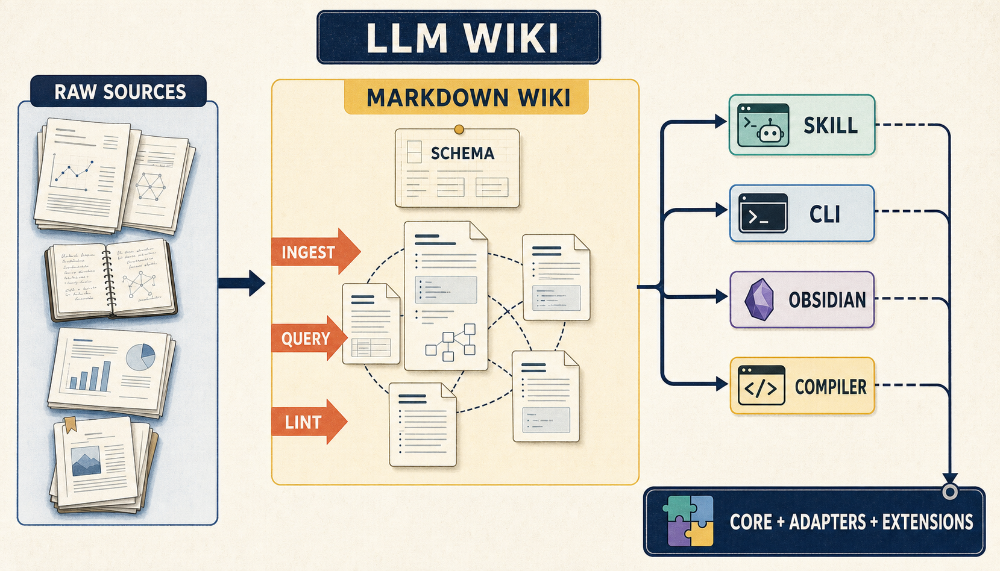
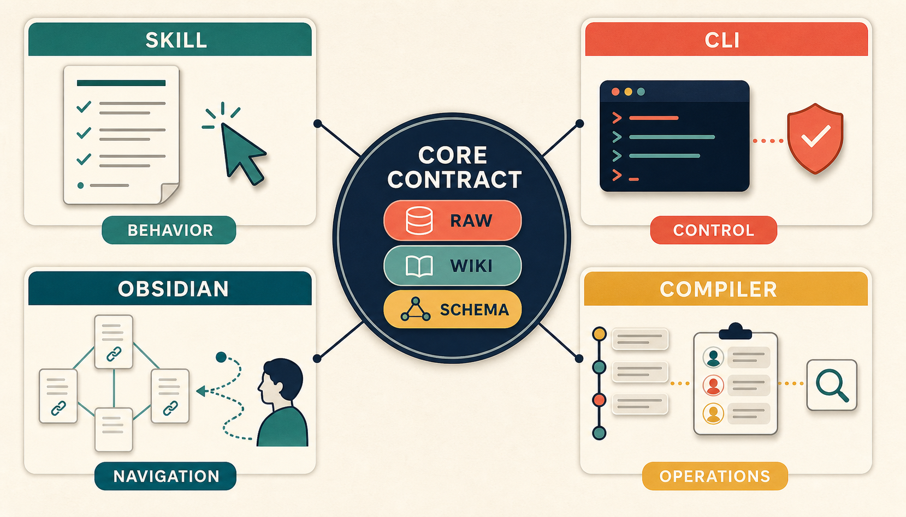

> [!summary] 핵심 결론
> LLM Wiki는 특정 제품이나 완성된 표준이 아니라, LLM이 원문을 읽고 지속적인 Markdown Wiki를 만들고 유지하게 하는 카파시의 아이디어 파일입니다. 구현체들은 이 핵심을 공유하지만, Skill·CLI·Obsidian·Compiler라는 서로 다른 층에서 사용자 확인, 탐색 화면, 출처 추적과 검색 기능을 추가합니다.

LLM Wiki라는 이름을 처음 접하면 새로운 RAG 제품이나 지식그래프 도구를 떠올리기 쉽습니다. 하지만 이 시리즈는 구현부터 시작하지 않겠습니다. 먼저 [Andrej Karpathy의 원문 Gist](https://gist.github.com/karpathy/442a6bf555914893e9891c11519de94f)를 읽고, 그 아이디어를 실제 프로젝트들이 어떻게 구체화했는지 비교하겠습니다.

앞선 [[notes/llm-wiki-double-compilation|25번 글]]에서는 LLM Wiki를 RAG와 문맥 컴파일의 관점에서 넓게 살펴봤습니다. 이번 글은 출발점을 다시 좁힙니다. 카파시가 말한 내용, 구현체가 선택한 내용, 그리고 우리가 나중에 추가할 내용을 서로 섞지 않는 것이 첫 번째 구현 규칙입니다.

## 1. 왜 원문부터 읽어야 하는가

카파시의 Gist 제목은 `LLM Wiki`이고, 설명은 특정 애플리케이션의 사용법이 아니라 **LLM으로 개인 지식 기반을 만드는 패턴**입니다. 그는 이 문서를 완성된 제품 명세가 아니라 자신의 에이전트에 복사해 넣어 아이디어를 전달하는 파일로 제시합니다.

이 차이는 중요합니다. 원문은 핵심 방향을 정하지만 다음 항목을 고정하지 않습니다.

- 반드시 사용해야 할 데이터베이스
- 특정 임베딩 모델이나 검색 엔진
- 고정된 폴더명과 frontmatter 형식
- Obsidian 이외의 유일한 사용자 인터페이스
- 자동화 수준과 승인 정책

따라서 원문을 읽기 전에 구현체를 먼저 보면, 구현체가 추가한 기능이 LLM Wiki의 본래 정의처럼 보일 수 있습니다. 이 글에서는 다음 순서를 지킵니다.

```text
원문이 정의한 핵심
→ 구현체가 보존한 부분
→ 구현체가 추가한 부분
→ 아직 확인되지 않은 부분
```

> [!important] 이 글의 범위
> 이 글은 LLM Wiki의 효과나 RAG 대비 성능을 판정하지 않습니다. 공개 원문과 저장소 문서를 기준으로 개념과 구현 접근을 비교합니다. 동일한 자료와 모델로 네 구현체를 설치해 성능·비용을 비교한 실험은 아닙니다.

## 2. 카파시가 바꾸려는 것은 검색 위치가 아니라 지식의 수명이다

일반적인 문서형 LLM 사용은 질문이 들어올 때 원문을 검색하고, 관련 조각을 다시 조립해 답하는 흐름에 가깝습니다. 이 방식은 현재 질문에 필요한 근거를 찾는 데 유용하지만, 이전 질문에서 만들어진 종합이 다음 질문의 지식으로 자동 축적되지는 않습니다.

LLM Wiki의 방향은 다릅니다.

```text
원문을 질문 때마다 다시 조립
              ↓
새 원문을 읽을 때 Wiki를 갱신
              ↓
다음 질문은 이미 연결된 Wiki에서 시작
```

여기서 LLM은 단순한 요약 생성기가 아닙니다. 새 자료를 읽고 기존 페이지를 찾아가며, 개념·인물·주제·비교·종합을 추가하거나 수정하는 **Wiki 유지 관리자**입니다.

사람과 LLM의 역할도 나뉩니다.

- 사람은 읽을 자료를 고르고, 무엇을 알아볼지 정하고, 결과를 탐색합니다.
- LLM은 요약하고, 기존 페이지를 갱신하고, 서로 연결하고, 로그와 색인을 관리합니다.
- 사람은 Obsidian 같은 Markdown 뷰어에서 페이지와 연결 구조를 확인합니다.

그러므로 LLM Wiki의 핵심은 “RAG보다 더 좋은 검색”이 아닙니다. **한 번의 답변으로 끝날 수 있는 종합을 다음 작업에서 다시 사용할 수 있는 파일로 남기는 것**입니다.

## 3. 최소 구조는 세 층이다

카파시 원문은 LLM Wiki를 세 층으로 설명합니다.


### Raw Sources

논문, 기사, 보고서, 이미지, 데이터 파일과 같은 원자료입니다. 사람이 선별하고, LLM은 읽지만 원자료 자체는 수정하지 않습니다. 나중에 Wiki 문장을 확인할 때 돌아갈 기준점입니다.

### Wiki

LLM이 만들고 계속 수정하는 Markdown 페이지의 모음입니다. 요약, 인물, 개념, 비교, 개요와 종합이 여기에 들어갈 수 있습니다. 중요한 점은 Wiki 페이지가 단순한 원문 복사본이 아니라, 여러 원문을 연결한 **지속적인 지식 산출물**이라는 것입니다.

### Schema

에이전트가 Wiki를 어떤 구조로 만들고 유지해야 하는지 설명하는 문서입니다. 페이지 이름, 링크 관례, ingest·query·lint 작업 방식과 도메인별 규칙을 기록합니다.

Schema가 필요한 이유는 LLM에게 “잘 정리해줘”라고 말하는 것만으로는 Wiki 유지 규칙이 고정되지 않기 때문입니다. 어떤 페이지를 새로 만들고, 어떤 페이지를 갱신하며, 언제 원문으로 돌아가야 하는지를 문서화해야 합니다.

최소 구조를 코드로 그리면 다음과 같습니다.

```text
llm-wiki/
├── raw/          # 사람이 수집한 원자료
├── wiki/         # LLM이 유지하는 Markdown Wiki
│   ├── index.md
│   └── log.md
└── SCHEMA.md     # Wiki 구조와 작업 규칙
```

이 구조에서 아직 벡터 DB, 그래프 DB, MCP와 정식 온톨로지는 필수 요소가 아닙니다. 원문도 구체적인 디렉터리 구조와 도구 선택은 도메인에 맞춰 정하라고 열어 둡니다.

## 4. Wiki는 세 작업으로 움직인다

### Ingest — 새 원문을 Wiki에 반영하기

새 자료를 `raw/`에 넣고 에이전트에게 처리하도록 요청합니다. 에이전트는 원문 요약만 쓰는 것이 아니라 다음 작업을 수행합니다.

1. 원문을 읽습니다.
2. 기존 `index.md`에서 관련 페이지를 찾습니다.
3. Source 또는 Summary 페이지를 만듭니다.
4. 영향을 받는 개념·인물·주제 페이지를 갱신합니다.
5. 페이지 사이의 링크를 연결합니다.
6. 색인과 로그를 갱신합니다.

원문 하나가 여러 페이지에 영향을 줄 수 있다는 점이 핵심입니다. Wiki는 자료마다 독립적인 요약을 쌓는 폴더가 아니라, 새 자료가 들어올 때 기존 지식과 관계를 다시 정리하는 구조입니다.

### Query — Wiki에서 질문하기

질문이 들어오면 에이전트는 Wiki 전체를 매번 처음부터 읽지 않습니다. 먼저 색인에서 관련 페이지를 찾고, 필요한 페이지를 읽고, 세부 사실이나 최신성이 중요할 때 Raw Source로 내려갑니다.

좋은 답변은 대화 안에서 사라지지 않을 수 있습니다. 비교, 분석, 새로 발견한 연결처럼 앞으로도 쓸 가치가 있는 답은 새로운 Synthesis 페이지로 저장할 수 있습니다.

### Lint — Wiki 건강 점검하기

Wiki가 커지면 다음 문제가 생깁니다.

- 어디에서도 연결되지 않는 고아 페이지
- 존재하지 않는 페이지를 가리키는 링크
- 색인에 빠진 페이지
- 서로 충돌하는 주장
- 새 자료가 들어왔는데 갱신되지 않은 오래된 페이지
- 자주 언급되지만 아직 별도 페이지가 없는 개념

Lint는 문법 검사를 넘어 Wiki의 지식 구조가 계속 유지되는지 점검하는 작업입니다. 원문에서 제안한 기능을 최소한으로 구현한다면 `index.md`와 `log.md`, 그리고 고아·끊어진 링크 검사부터 시작할 수 있습니다.

## 5. 같은 원문에서 네 가지 구현 경로가 나왔다

공개 구현체들은 모두 같은 핵심을 공유하지만, 각자 다른 층에 집중합니다.



### 5.1 Agent Skill / Plugin — LLM의 행동 계약으로 구현하기

[praneybehl/llm-wiki-plugin](https://github.com/praneybehl/llm-wiki-plugin)은 카파시의 구조를 에이전트가 따르는 Skill과 Plugin의 형태로 옮깁니다.

- `raw/`는 원자료로 둡니다.
- `wiki/`에는 source·entity·concept·synthesis 페이지를 둡니다.
- `SCHEMA.md`가 Wiki의 규칙과 작업 방식을 설명합니다.
- `ingest`, `query`, `lint`를 에이전트 작업으로 제공합니다.

이 접근은 원문에 가장 가깝습니다. 새로운 애플리케이션을 만드는 대신, 이미 사용하는 coding agent가 Markdown 저장소를 읽고 쓰게 합니다. 대신 실제 품질은 에이전트가 Schema를 얼마나 일관되게 따르는지에 영향을 받습니다.

### 5.2 CLI — 변경 과정을 명시적인 작업으로 만들기

[hellohejinyu/llm-wiki](https://github.com/hellohejinyu/llm-wiki)는 작은 CLI로 `init`, `ingest`, `query`, `list`, `lint` 작업을 제공합니다.

특징은 LLM의 변경을 바로 적용하지 않고 `create`, `update`, `delete` 제안으로 만들고 사용자 확인을 거칠 수 있다는 점입니다. Query는 색인에서 개념 페이지로 이동하고, 필요하면 원문으로 내려가 답을 구성합니다. Lint는 끊어진 링크·고아 페이지 같은 정적 문제와 페이지 간 의미 충돌을 함께 점검합니다.

이 방식은 원문의 흐름을 명령어와 확인 절차로 구체화합니다. LLM이 파일을 직접 바꾸는 것보다 변경 단위를 눈에 보이게 만들고 싶을 때 유리합니다.

### 5.3 Obsidian Plugin — 사람이 탐색하는 Wiki로 구현하기

[green-dalii/obsidian-llm-wiki](https://github.com/green-dalii/obsidian-llm-wiki)는 Obsidian Vault 안에서 LLM Wiki를 사용하도록 만듭니다.

- 기존 노트와 PDF를 입력으로 받을 수 있습니다.
- 개념·인물 페이지와 양방향 링크를 만듭니다.
- Obsidian Graph View로 연결 구조를 탐색합니다.
- 로컬 모델을 포함한 여러 LLM 제공자를 선택할 수 있습니다.

이 접근의 중심은 저장 포맷보다 **사용자 경험**입니다. LLM이 쓰는 페이지를 사람이 바로 읽고, 링크를 따라가고, 그래프 구조를 확인할 수 있습니다.

### 5.4 Compiler — 운영 기능을 덧붙인 구현으로 확장하기

[atomicstrata/llm-wiki-compiler](https://github.com/atomicstrata/llm-wiki-compiler)는 원문을 지속적인 Wiki 페이지로 컴파일하는 흐름에 운영 기능을 더합니다.

- 페이지와 원문 사이의 provenance를 추적합니다.
- 검토 대기열과 품질 게이트를 둡니다.
- 오래된 페이지와 고아 페이지를 찾습니다.
- BM25·벡터·링크 그래프를 조합한 검색을 제공합니다.
- CLI, 로컬 뷰어와 MCP를 제공합니다.

이 방식은 규모와 운영 안전성을 염두에 둔 강화형입니다. 다만 provenance, review queue, hybrid search와 MCP는 카파시 원문의 필수 정의가 아니라, 원문을 운영 환경에 가져갈 때 추가한 기능으로 읽어야 합니다.

## 6. 무엇이 같고, 어디서부터 달라지는가

네 구현체를 비교할 때 기능 개수로 순위를 매기면 핵심을 놓칩니다. 먼저 원문에서 보존해야 할 공통 계약을 확인하고, 그 위에 각 구현이 어떤 어댑터와 확장을 올렸는지 봐야 합니다.

### 공통으로 보존하는 핵심

- 원자료와 생성 Wiki를 분리합니다.
- Wiki는 사람이 읽을 수 있는 Markdown입니다.
- LLM이 기존 페이지를 갱신하고 링크를 유지합니다.
- 새 Source를 읽는 Ingest 작업이 있습니다.
- Wiki에서 답을 만드는 Query 작업이 있습니다.
- 고아·충돌·낡은 내용을 확인하는 Lint 작업이 있습니다.

### 구현체가 추가한 층

- **Skill**은 에이전트 행동 규칙을 강화합니다.
- **CLI**는 변경 제안과 사용자 확인을 강화합니다.
- **Obsidian**은 시각적 탐색과 로컬 편집 경험을 강화합니다.
- **Compiler**는 출처 추적·검토·검색·MCP를 강화합니다.


이렇게 보면 어느 구현이 “정답”인지보다 어떤 문제를 해결하려고 어떤 층을 추가했는지가 보입니다.

```text
카파시 원문
  ├─ 핵심 계약: raw / wiki / schema + ingest / query / lint
  ├─ 어댑터: agent skill / CLI / Obsidian UI
  └─ 확장: provenance / review / search / MCP
```

이 구분은 우리 구현에도 중요합니다. 나중에 Quartz를 연결하거나 provenance와 검토 게이트를 추가하더라도, 그것을 LLM Wiki의 원래 정의라고 부르지 않고 **우리 프로젝트의 구현 선택**으로 기록할 수 있습니다.

## 7. 이번 글에서 아직 결정하지 않은 것

이 글에서는 다음 결론을 내리지 않습니다.

- LLM Wiki가 RAG보다 항상 좋은가
- 어떤 구현체가 성능이나 비용 면에서 우월한가
- 벡터 DB나 GraphRAG가 언제 필수인가
- 온톨로지가 LLM Wiki에 반드시 필요한가
- 자동 생성 Wiki를 바로 Quartz에 공개해야 하는가

이 질문들은 원문을 이해하고 최소 구현을 만든 뒤에 다루는 편이 정확합니다. 먼저 가장 작은 구조를 만들고, 실제로 Source 하나가 Wiki를 어떻게 바꾸는지 확인해야 추가 기능의 필요성을 판단할 수 있습니다.

## 8. 다음 글: 빈 폴더에서 첫 Wiki 만들기

다음 글에서는 이 원문을 최소한으로 구현합니다.

```text
llm-wiki/
├── raw/
├── wiki/
│   ├── index.md
│   └── log.md
└── SCHEMA.md
```

첫 단계에서는 검색 서버도, 그래프 DB도, 정식 온톨로지도 만들지 않습니다. 카파시가 제안한 세 층과 세 작업을 Markdown과 에이전트만으로 재현하고, 그 다음 Source를 하나씩 넣으면서 Wiki가 실제로 축적되는지 확인하겠습니다.

## 출처

- [Andrej Karpathy, LLM Wiki Gist](https://gist.github.com/karpathy/442a6bf555914893e9891c11519de94f)
- [praneybehl/llm-wiki-plugin](https://github.com/praneybehl/llm-wiki-plugin)
- [hellohejinyu/llm-wiki](https://github.com/hellohejinyu/llm-wiki)
- [green-dalii/obsidian-llm-wiki](https://github.com/green-dalii/obsidian-llm-wiki)
- [atomicstrata/llm-wiki-compiler](https://github.com/atomicstrata/llm-wiki-compiler)
