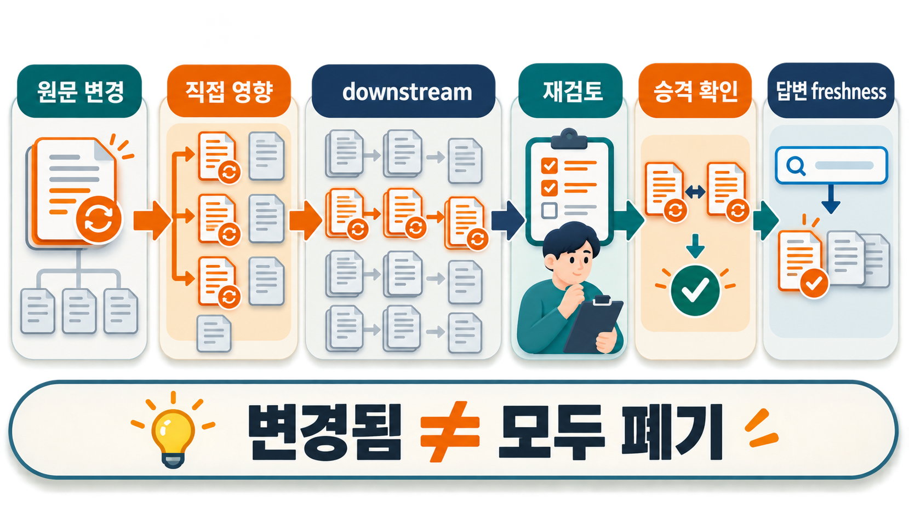
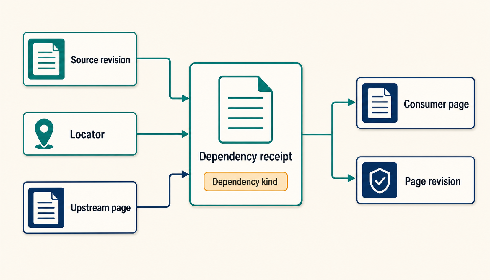
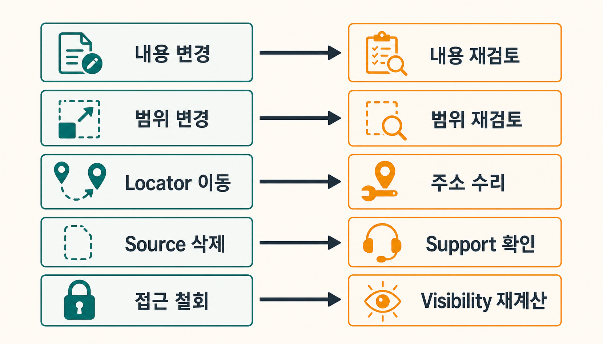
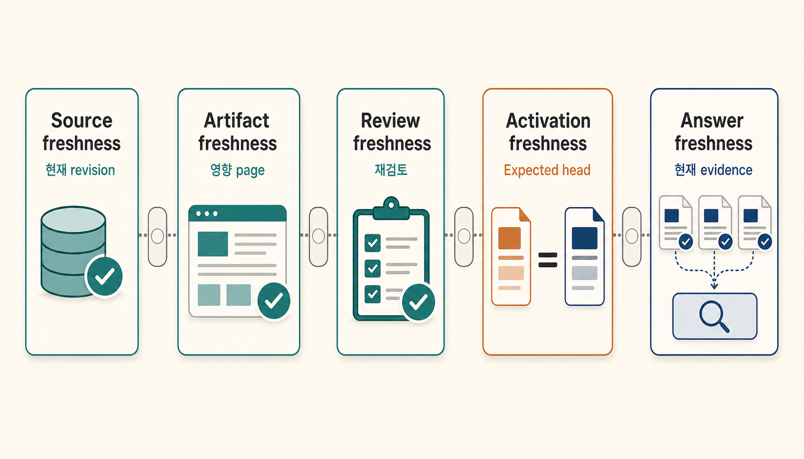

어제까지 맞던 정책 원문 한 문장이 오늘 수정됐다고 가정해 보겠습니다. 그 문장을 직접 설명한 페이지 하나는 찾기 쉽습니다. 더 어려운 문제는 그 페이지를 바탕으로 만든 비교 문서, 운영 가이드와 이후 답변까지 **어디까지 다시 확인해야 하는가**입니다.

3번 글에서는 `source → candidate → canonical`의 권위 경계와 source hash가 바뀌면 canonical을 조용히 덮어쓰지 않는 규칙을 만들었습니다. 실제 운영에서는 그 다음 질문이 남습니다. `source rev2`가 생겼다는 사실을 안 뒤, `canonical A`만 다시 보면 되는지, A를 바탕으로 쓴 `analysis B`와 `guide C`까지 보류해야 하는지 판단할 근거가 필요합니다.

> [!summary] 핵심 결론
> 원문 변경 감지는 시작점일 뿐입니다. **어떤 source·구간·page revision을 실제로 소비했는지 남긴 dependency receipt와 page dependency가 있어야 재검토 범위를 좁힐 수 있습니다.** 영향 페이지를 찾으면 고치기 전에 최신 답변 후보에서 먼저 제외하고, 검증된 새 revision만 다시 올려야 합니다. 영향 범위 계산, 수리와 재검토, 승격, 실제 답변의 freshness(최신성)는 서로 다른 계약입니다.

## Source hash는 “바뀌었다”까지만 알려 줍니다

3번 글의 첫 규칙은 여전히 유효합니다.

```text
source hash 동일
→ 기존 근거를 재사용할 수 있는 후보

source hash 변경
→ 기존 canonical의 현재성을 다시 확인
```

문제는 두 번째 줄의 범위입니다. 파일 전체 hash가 달라졌다고 해서 그 파일을 인용한 모든 페이지가 의미적으로 틀린 것은 아닙니다. 오탈자만 고쳤을 수도 있고, 문단 위치만 옮겼을 수도 있습니다. 반대로 작은 문장 하나가 바뀌었는데 여러 종합 페이지가 그 문장을 전제로 삼았다면 영향 범위는 파일 하나보다 훨씬 넓을 수 있습니다.

현재 공개 구현에서도 `stale`은 하나의 뜻으로 쓰이지 않습니다. [geronimo-iia/llm-wiki의 설정 문서](https://github.com/geronimo-iia/llm-wiki/blob/main/docs/guides/configuration.md)는 검색 인덱스가 Git HEAD보다 뒤처진 상태를 stale index로 다룹니다. 반면 [Atomic Strata의 llm-wiki-compiler](https://github.com/atomicstrata/llm-wiki-compiler/blob/main/docs/concepts/how-it-works.mdx)는 compiled page에 기여한 source와 SHA-256을 기록하고, 현재 source hash와 달라지면 page를 stale로 표시합니다.

둘 다 유용하지만 질문이 다릅니다.

```text
검색 인덱스가 최신인가?
≠
페이지가 현재 source revision을 반영했는가?
≠
페이지 안의 이 주장이 여전히 같은 근거에 의존하는가?
≠
이 페이지를 이용한 downstream synthesis도 현재인가?
```

작은 Wiki라면 파일 단위 source hash만으로 충분할 수 있습니다. 변경된 파일을 소유한 모든 페이지를 다시 검토하는 쪽이 dependency registry를 관리하는 것보다 싸다면 굳이 더 복잡하게 만들 이유가 없습니다. 정확한 dependency receipt는 **전체 재검토 비용이나 false positive가 실제로 문제가 될 때** 추가할 계층입니다.

이 판단과 같은 방향을 보여 주는 인접 연구도 있습니다. 코딩 에이전트가 이전 검증 근거를 기억하는 방식을 다룬 [EA-Graph](https://arxiv.org/abs/2608.04278)는 실험용으로 만든 코드 저장소에서 파일 전체를 의심 대상으로 잡는 방식이, 파일 안에서 실제로 사용한 세부 항목만 추적하는 방식보다 훨씬 넓은 검토 집합을 만들 수 있음을 보고합니다. 다만 코드의 세부 항목과 자연어 문서의 의미 구간은 같은 단위가 아니므로, 이 결과를 LLM Wiki의 성능 수치로 옮기지는 않습니다. 여기서는 **더 작은 dependency 단위는 파일 전체 재검토가 실제 비용을 만들 때만 정당화된다**는 설계 근거로만 사용합니다.

## Query receipt와 dependency receipt는 역할이 다릅니다

3번 글의 `receipt`는 한 질문이 어떤 근거를 선택했고 무엇을 제외했는지 되짚는 실행 기록이었습니다.

```text
query receipt
= 이 답변은 무엇을 읽었는가?
```

원문 변경을 다루려면 다른 방향의 기록도 필요합니다.

```text
dependency receipt
= 이 canonical 또는 synthesis는 무엇을 소비해 만들어졌는가?
```

둘을 같은 파일에 저장할 수도 있지만 책임은 구분하는 편이 좋습니다. Query receipt는 잘못된 답의 입력 경로를 복원합니다. Dependency receipt는 source가 바뀌었을 때 영향을 받을 파생 지식의 집합을 계산하는 데 씁니다.



첫 구현은 다음 정도면 충분합니다.

```yaml
consumer_page: release-governance
consumer_revision: page-rev4

depends_on_sources:
  - source_id: approval-policy
    source_revision: src-rev7
    locator: "Approval rules"
    dependency_kind: direct_content

depends_on_pages:
  - page_id: approval-policy-summary
    page_revision: page-rev3
    dependency_kind: derived_claim
```

여기서 중요한 것은 필드명이 아닙니다. **소비한 revision을 고정한다**는 점입니다. W3C [PROV-O](https://www.w3.org/TR/prov-o/)가 derivation, revision과 source 관계를 서로 다른 provenance 관계로 나누는 것처럼, `현재 파일 경로를 알고 있다`와 `어느 revision에서 파생됐는지 안다`는 같은 정보가 아닙니다.

## 모든 링크를 dependency로 만들면 오히려 과잉 전파됩니다

Wiki에는 링크가 많습니다. 관련 글, 배경 개념, 탐색용 태그까지 모두 파생 dependency로 취급하면 source 하나가 바뀔 때 거의 전체 Wiki가 재검토 대상으로 번질 수 있습니다.

가상의 정책 Wiki를 보겠습니다.

```text
source: approval-policy rev7
        │
        ├─ 직접 내용 사용
        ▼
page A: approval-policy-summary rev3
        │
        ├─ 핵심 판단을 재사용
        ▼
page B: release-governance rev4
        │
        └─ 관련 글 링크만 존재
        ▼
page C: agent-overview rev9
```

A는 source의 문장을 직접 사용합니다. B는 A의 판단을 다시 사용합니다. C는 B를 단지 “함께 읽기”로 연결했을 뿐입니다. source rev7이 바뀌었을 때 A와 B는 재검토 후보지만, C까지 자동으로 stale이라고 볼 근거는 없습니다.

그래서 dependency 종류를 최소한 둘로 나누는 편이 낫습니다.

- **직접 내용 dependency** — 문장·수치·정의·규칙을 실제 주장에 사용했습니다.
- **간접 scope dependency** — 필터 범위, 적용 대상, 정의 영역처럼 내용 선택에 영향을 줬습니다.

단순 탐색 링크는 dependency registry 밖에 둘 수 있습니다. OpenLineage가 데이터 lineage에서 direct와 indirect 영향을 구분하는 아이디어도 이런 분리의 참고가 되지만, 자연어 Wiki에서 어떤 링크가 실제 의미 dependency인지 판정하는 규칙은 별도로 검증해야 합니다.

## 같은 source 변경이라도 조치는 같지 않습니다

Hash mismatch만 보면 모든 변경이 같은 이벤트처럼 보입니다. 운영에서는 **무엇이 바뀌었는지**가 다음 행동을 결정합니다.



| 변경 종류      | 우선 확인할 것                      | 보수적인 기본 조치                          |
| -------------- | ----------------------------------- | ------------------------------------------- |
| 내용 변경      | 직접 사용한 claim·구간              | 해당 consumer와 downstream synthesis 재검토 |
| 범위·정의 변경 | 어떤 자료가 포함·제외되는지         | indirect dependency까지 검토 후보 확대      |
| locator 이동   | 같은 근거가 새 위치에 존재하는지    | 근거 주소를 수리하고 내용 동일성 확인       |
| source 삭제    | 현재 support가 사라졌는지           | support-loss 상태와 tombstone 기록          |
| 접근 철회      | 지금 이 근거를 사용할 권한이 있는지 | visibility·eligibility부터 재계산           |

이 분류표는 표준이 아니라 프로젝트 운영 제안입니다. 자연어 변경을 자동 분류하는 정확도는 이번 연구에서 측정하지 않았습니다. 작은 Wiki에서는 다섯 종류를 구분하는 것보다 “hash가 바뀌면 관련 페이지 전부 사람 검토”가 더 안전하고 단순할 수 있습니다.

삭제와 접근 철회도 같지 않습니다. 파일이 없어졌다면 현재 지식의 support가 사라졌는지 확인해야 합니다. 파일은 남아 있지만 접근 권한이 철회됐다면 우선 검색·답변 경로에서 사용할 수 있는지 다시 판정해야 합니다. `삭제됨`과 `볼 수 없음`을 같은 상태로 합치면 이후 복구나 감사에서 이유를 잃습니다.

## 직접 소비자만 고치면 downstream synthesis가 남습니다

Bazel의 [Skyframe 문서](https://bazel.build/versions/8.4.0/reference/skyframe)는 입력 dependency가 모두 등록되어 있으면 변경된 입력의 **reverse transitive closure**를 따라 실제 영향을 받는 노드만 다시 계산할 수 있다고 설명합니다. 반대로 dependency를 등록하지 않은 채 외부 값을 읽으면 incremental build가 잘못된 결과를 유지할 수 있다고 경고합니다.

LLM Wiki는 build graph와 동일하지 않습니다. 자연어 dependency는 더 모호하고, page가 source를 “참고”했는지 “결론의 전제”로 사용했는지도 구분해야 합니다. 그래도 한 가지 공학적 교훈은 가져올 수 있습니다.

```text
source가 바뀜
→ 직접 소비 page를 찾음
→ 그 page revision에 의존한 downstream page를 찾음
→ 각 consumer를 다시 검토
```

이때 A의 재검토가 끝났다고 B의 검토까지 끝난 것은 아닙니다. A가 같은 결론을 유지하더라도 B가 특정 표현, 적용 범위 또는 이전 revision의 조건을 사용했을 수 있기 때문입니다.

이번 프로젝트에서는 이 책임을 작은 결정론적 fixture로 나눠 검사했습니다. source dependency, typed change class, 삭제·tombstone, page cascade, cycle, concurrent revision precondition, source authority의 **7개 합성 suite에서 총 70개 계약 검사가 70/70 통과**했습니다.

> [!note] 70/70의 의미
> 실제 문서 70건에서 stale page를 정확히 찾았다는 뜻이 아닙니다. LLM도 real corpus도 사용하지 않았습니다. 미리 정의한 작은 그래프와 revision 상태에서 “숨은 dependency가 있으면 놓치고, registry를 수리하면 다시 찾는다”, “직접 page를 검토해도 downstream은 별도 상태로 남는다” 같은 상태 전이가 코드대로 작동했는지만 확인한 합성 계약 검사입니다.

실제 semantic dependency extraction의 precision·recall, 사람 review 시간, latency와 운영 비용은 별도 실험이 필요합니다.

## 숨은 dependency는 selective invalidation의 가장 큰 약점입니다

Selective re-review는 dependency registry가 충분히 완전하다는 전제에서만 안전합니다. source를 실제로 사용했는데 receipt에 기록하지 않았다면 그 page는 영향 집합에서 빠집니다.

첫 합성 fixture에서도 의도적으로 dependency 하나를 숨기자 affected-page recall이 `0.5`로 떨어졌습니다. clean rebuild 결과와 비교해 누락을 발견하고 registry를 수리한 뒤에야 fixture 안에서 precision과 recall이 `1.0`으로 돌아왔습니다. 이 숫자는 네 개의 합성 page를 사용한 진단 결과이지 운영 성능 지표가 아닙니다.

이 때문에 dependency receipt를 도입하더라도 정기적으로 다른 관점을 섞는 편이 좋습니다.

```text
정확한 registry 경로
+ clean rebuild 또는 전체 샘플 audit
+ 변경 범위가 넓은 source의 보수적 review
```

**탐지와 repair의 순서도 중요합니다.** Agentic memory를 다룬 [MEMOREPAIR](https://arxiv.org/abs/2605.07242)는 원문에서 파생된 결과물이 영향을 받았다고 판단되면, 수리하기 전에 먼저 사용 경로에서 빼고 수리한 새 결과물을 검증한 뒤 다시 공개하는 **barrier-first**, 즉 ‘수리보다 격리를 먼저 하는’ 계약을 제안합니다. Markdown Wiki를 직접 평가한 연구는 아니므로 실험 수치를 여기로 옮길 수는 없습니다. 다만 stale 후보를 찾고도 repair가 끝날 때까지 최신 지식처럼 계속 노출하는 수명주기 구멍을 피해야 한다는 인접 근거로는 유용합니다. 이 글의 보수적인 순서는 `영향 식별 → 최신 답변 후보에서 제외 → repair → 검증 → 다시 승격`입니다.

대체 근거를 확보하지 못했다고 기존 주장이 곧바로 거짓이 되는 것도 아닙니다. EA-Graph는 필요한 근거가 바뀌었지만 새 근거를 사용할 수 없을 때 `unprovable`, 즉 **현재 근거로는 다시 입증할 수 없는 상태**를 따로 둡니다. 이 이름을 LLM Wiki의 표준 상태로 채택하자는 뜻은 아닙니다. 여기서는 **stale은 현재 자격을 다시 확인해야 한다는 뜻이지, 자동으로 틀렸다는 뜻은 아니다**라는 경계만 가져옵니다. 과거 revision을 보존하더라도 최신 답변에는 쓰지 않을 수 있습니다.

이처럼 selective cascade를 정밀하게 만들수록 누락 dependency는 더 위험해집니다. MEMOREPAIR도 어떤 결과물이 무엇에서 파생됐는지를 나타내는 provenance 관계를 일부 누락한 실험에서 stale 파생물이 격리 범위 밖에 남는 현상을 보고합니다. 따라서 세밀한 dependency graph 자체를 안전성의 증거로 보지 말고 clean rebuild·표본 audit·보수적 fallback으로 **dependency completeness, 즉 실제 의존 관계가 빠짐없이 기록됐는지를 계속 검사**해야 합니다.

Ontology나 graph neighborhood를 이용해 “이 page도 혹시 영향을 받았는가?”를 찾는 방법도 review-priority 신호로는 유용할 수 있습니다. [WikiMonitor-Onto](https://www.jaai.net/vol4/JAAI-V4N3-66.pdf)는 61개 AI 강의 문서에서 만든 642-node·487-edge graph와 62-concept gold set을 이용해 간접 stale 후보 탐지를 시험했지만, 한 도메인·한 annotator·합성 stale seed라는 범위가 있습니다. 따라서 이런 확률적 구조 신호가 exact dependency를 대신해 canonical을 자동 무효화하는 권한을 가져서는 안 됩니다. 발견 신호와 정본 자격 판정을 분리하면 false positive를 검토 큐로 흡수할 수 있습니다.

## “오래됐다”와 “stale이다”도 구분해야 합니다

시간이 오래 지났다는 사실만으로 지식이 틀린 것은 아닙니다. 과거의 의사결정 기록, 당시 상태를 설명하는 incident report, 특정 시점의 snapshot은 오래돼도 역사적 근거로 유효합니다.

반대로 “현재 가격”, “현재 권한”, “현재 장애 상태”처럼 present tense가 중요한 사실은 source revision이 명시적으로 바뀌지 않아도 재확인이 필요할 수 있습니다.

```text
old
≠ stale

superseded
≠ delete history

current source revision
≠ current answer
```

그래서 freshness를 한 개 boolean으로 합치기보다 최소한 세 층으로 읽는 편이 안전합니다.

- **temporal currentness** — 이 주장에 현재 시점 값이 필요한가
- **evidence freshness** — 이 page가 현재 source/page revision을 반영했는가
- **query freshness** — 이번 답변이 현재 자격을 가진 evidence만 선택했는가

Age나 confidence는 review 순위를 정하는 신호로 쓸 수 있지만, 그 자체를 validity나 authority로 바꾸면 역사 기록과 현재 사실이 뒤섞입니다.

## Review가 끝난 뒤 source가 또 바뀔 수 있습니다

한 reviewer가 A를 읽기 시작한 뒤 source rev8이 rev9로 바뀌었다고 가정해 보겠습니다. reviewer는 rev8을 기준으로 승인했지만, 승인 버튼을 누르는 시점에는 이미 rev9가 current head입니다.

이 경우 `reviewed: true` 하나만 검사하면 오래된 검토가 새 current state 위에 올라갈 수 있습니다. 그래서 promotion 직전에 검토가 시작됐을 때 본 revision을 다시 확인하는 precondition이 필요합니다.

```text
review 시작
expected_source_revision = rev8
expected_page_revision   = page-rev3

승격 직전
current_source_revision == rev8 ?
current_page_revision   == page-rev3 ?

둘 다 맞음 → promote 후보
하나라도 다름 → conflict / re-review
```

HTTP의 [If-Match 조건부 요청](https://www.rfc-editor.org/rfc/rfc9110.html#name-if-match)과 Git의 [update-ref](https://git-scm.com/docs/git-update-ref)는 서로 다른 시스템에서 “내가 읽은 current value가 아직 current일 때만 갱신하라”는 경계를 제공합니다. 이를 LLM Wiki에 그대로 복사할 필요는 없지만, **검토 완료와 current-head 확인을 분리하는 설계 근거**로는 유용합니다.

이 precondition도 semantic correctness를 증명하지 않습니다. rev8을 정확히 검토했어도 source 자체가 틀릴 수 있고, 어떤 branch를 authoritative source로 볼지는 별도 정책입니다. 단일 작성자 Wiki라면 한 번에 하나의 review만 허용하는 직렬화가 더 간단한 해결책일 수 있습니다.

## Page가 fresh해도 답변은 stale할 수 있습니다

마지막 경계는 query입니다. Canonical page를 모두 최신 revision으로 갱신해도 retrieval cache가 오래됐거나, 여러 version을 조립하는 과정에서 이전 값이 선택되거나, 모델이 과거 premise를 답변에 다시 끌어오면 최종 답은 여전히 낡을 수 있습니다.



```text
1. source freshness
   현재 source revision은 무엇인가

2. artifact freshness
   어떤 page가 그 revision을 소비했는가

3. review freshness
   affected page가 재검토됐는가

4. activation freshness
   promote 직전 expected revision이 아직 current인가

5. answer freshness
   query가 current-eligible evidence만 사용했는가
```

최근 agent-memory 연구인 [STALE](https://arxiv.org/abs/2605.06527)과 [StateAuditor](https://arxiv.org/abs/2608.01619), 별도의 [deterministic freshness 연구](https://arxiv.org/abs/2606.01435)도 저장된 상태가 갱신됐다는 사실과 downstream 응답이 새 상태를 실제로 적용하는 일을 별도 문제로 다룹니다. 다만 이들은 대화형 agent memory를 대상으로 하며, 이 Markdown Wiki의 stale-answer rate를 직접 측정한 결과가 아닙니다. 여기서는 “page freshness와 answer freshness를 한 gate로 합치지 않는다”는 경계만 가져옵니다.

## 첫 구현은 file hash에서 시작해도 됩니다

Dependency receipt를 처음부터 segment 단위 graph registry로 만들 필요는 없습니다. 실제 도입 순서는 더 단순하게 잡을 수 있습니다.

**1단계 — file-level source ownership**

```yaml
page_revision: page-rev3
source_revisions:
  - source_id: approval-policy
    revision: src-rev7
    hash: sha256:...
```

Hash가 달라지면 그 source가 소유한 page를 전부 review queue로 보냅니다. Atomic Strata의 현재 source freshness 방식처럼 이해하기 쉽고, source와 page가 비교적 1:1에 가까운 Wiki에는 충분할 수 있습니다.

**2단계 — downstream page dependency**

종합 page가 늘어나 “직접 page만 고치면 끝나지 않는” 문제가 반복될 때 `depends_on_pages`와 reverse lookup을 추가합니다.

**3단계 — typed segment dependency**

큰 source 하나의 작은 구간 변경 때문에 수십 page가 매번 불필요하게 막힐 때 locator와 dependency kind를 세분화합니다.

**4단계 — promotion precondition과 query freshness**

동시 review나 빠른 source 갱신이 실제로 생기면 expected revision check를 넣고, current query가 stale·conflict 상태를 기본 제외하는지 검사합니다.

이 순서는 복잡한 registry를 먼저 만드는 대신 **관찰된 maintenance failure가 생길 때 한 계층씩 승격**합니다.

## 언제 selective propagation을 쓰지 않는 편이 나은가

Dependency registry가 항상 좋은 선택은 아닙니다.

- Wiki가 작아서 전체 review가 더 싸면 full review가 단순합니다.
- source와 page가 거의 1:1이면 file-level hash ownership이면 충분할 수 있습니다.
- 가격·장애·재고처럼 실시간 값이 핵심이면 compiled Wiki보다 live API·원문 조회가 우선입니다.
- 권한 철회가 즉시 강제돼야 하는 환경에서는 stale flag가 ACL enforcement를 대신할 수 없습니다.
- semantic dependency를 안정적으로 판정하지 못하면 정교한 graph가 false confidence만 키울 수 있습니다.

Selective invalidation의 가치는 “검토할 것이 줄었다”가 아니라 **줄여도 놓치지 않는다는 근거를 만들 수 있을 때** 생깁니다. Registry의 완전성을 검증할 방법이 없다면 보수적으로 범위를 넓히는 편이 낫습니다.

## 오늘 추가할 가장 작은 계약

3번 글의 네 객체를 이미 만들었다면 다음 한 가지를 먼저 추가해 볼 수 있습니다.

```yaml
canonical_revision: page-rev4
built_from:
  - source_id: approval-policy
    source_revision: src-rev7
    locator: "Approval rules"
```

그리고 source hash가 바뀔 때 canonical을 바로 다시 쓰지 말고 다음 세 질문을 기록합니다.

```text
1. 이 page가 바뀐 구간을 실제로 사용했는가?
2. 이 page revision을 소비한 downstream page가 있는가?
3. 영향받은 page를 review·repair 전에 최신 답변 후보에서 뺐는가?
4. review가 끝난 순간에도 source/page head가 그대로였는가?
```

이 네 질문에 답할 수 있으면 `stale`은 막연한 “오래된 문서” 표시에서 **재검토 범위와 최신 답변 자격을 함께 관리하는 운영 상태**로 바뀝니다.

## 최종 판단

LLM Wiki의 첫 어려움은 모델이 만든 문장을 어디에 쓸지 정하는 것입니다. 3번 글의 source·candidate·canonical·receipt가 그 권위 경계를 만들었습니다. 두 번째 어려움은 이미 승인한 지식을 어떻게 계속 믿을지 정하는 일입니다.

Source hash는 원문이 바뀌었다는 사실을 잘 알려 줍니다. 하지만 selective re-review를 하려면 어떤 source revision과 구간, 어떤 upstream page revision이 현재 canonical에 실제로 들어갔는지 남겨야 합니다. 영향 범위를 찾은 뒤에는 stale page를 repair보다 먼저 최신 답변 후보에서 빼고, 새 근거가 없다면 억지로 current라고 판단하지 않아야 합니다. 직접 소비 page의 재검토가 끝난 뒤에도 downstream synthesis는 별도로 확인해야 하고, reviewer가 승인하는 순간에는 expected revision이 여전히 current인지 다시 확인해야 합니다. 그 뒤 query도 stale·conflict 상태를 다시 끌어오지 않아야 합니다.

따라서 stale propagation을 하나의 자동 invalidation 알고리즘으로 보는 것보다 **변경 감지, 영향 범위와 격리, repair·review, promotion, answer freshness를 연결하는 다섯 책임**으로 보는 편이 정확합니다. 작은 Wiki에서는 file-level hash와 full review로 시작해도 됩니다. 그 방식이 실제로 너무 많은 재검토를 만들거나 downstream 누락을 반복할 때에만 dependency receipt와 typed propagation을 추가하는 것이 안전합니다. 정밀한 selective propagation을 택했다면, dependency graph를 만드는 일만큼 누락 관계를 계속 감사하는 일도 운영 계약에 포함해야 합니다.

## 함께 읽기

- [[notes/llm-wiki/llm-wiki-origin-and-implementations|1. LLM Wiki가 뭔가? 안드레이 카파시가 건넨 지식 성장 루프]]
- [[notes/llm-wiki/doctology-llm-wiki-anatomy|2. DocTology LLM Wiki 해부학: 폴더 구조와 실행 경계를 함께 읽는 법]]
- [[notes/llm-wiki/llm-wiki-authority-lifecycle-mvp|3. LLM Wiki는 네 종류의 파일로 시작한다: source · candidate · canonical · receipt MVP]]
- [[notes/온톨로지/llm-wiki-double-compilation|25. LLM Wiki는 RAG를 대체하는가: 저장과 검색 사이의 이중 컴파일]]
- [[notes/온톨로지/agent-evaluation-evidence-ladder|24. 합성 검사를 통과한 에이전트는 왜 아직 검증되지 않았는가: 계약 검사에서 운영 증거까지 잇는 평가 사다리]]

## 참고 자료

- W3C, [PROV-O: The PROV Ontology](https://www.w3.org/TR/prov-o/)
- Bazel, [Skyframe](https://bazel.build/versions/8.4.0/reference/skyframe)
- Atomic Strata, [How llmwiki's Two-Phase Pipeline Compiles Your Sources](https://github.com/atomicstrata/llm-wiki-compiler/blob/main/docs/concepts/how-it-works.mdx)
- Atomic Strata, [Review Policy](https://github.com/atomicstrata/llm-wiki-compiler/blob/main/docs/configuration/review-policy.mdx)
- geronimo-iia/llm-wiki, [Configuration Guide](https://github.com/geronimo-iia/llm-wiki/blob/main/docs/guides/configuration.md)
- RFC Editor, [RFC 9110 — HTTP Semantics, If-Match](https://www.rfc-editor.org/rfc/rfc9110.html#name-if-match)
- Git, [git-update-ref Documentation](https://git-scm.com/docs/git-update-ref)
- Bailing Zhang, [WikiMonitor-onto: Ontology-aware Staleness Propagation for LLM-maintained Knowledge Bases](https://www.jaai.net/vol4/JAAI-V4N3-66.pdf)
- Hanxiang Chao et al., [STALE: Can LLM Agents Know When Their Memories Are No Longer Valid?](https://arxiv.org/abs/2605.06527)
- Haofei Sun, Lin He, [When Memory Updates but Behavior Does Not](https://arxiv.org/abs/2608.01619)
- Vikas Reddy, Sumanth Challaram, [Don't Ask the LLM to Track Freshness](https://arxiv.org/abs/2606.01435)
- Hwai-Jung Hsu, Cheng-Jan Chi, Hanna Everett, [EA-Graph: Artifact-Anchored Verification Memory for Coding Agents under Upstream Drift](https://arxiv.org/abs/2608.04278)
- Yang Zhao, Chengxiao Dai, Mengying Kou, Yue Xiu, [MEMOREPAIR: Barrier-First Cascade Repair in Agentic Memory](https://arxiv.org/abs/2605.07242)
