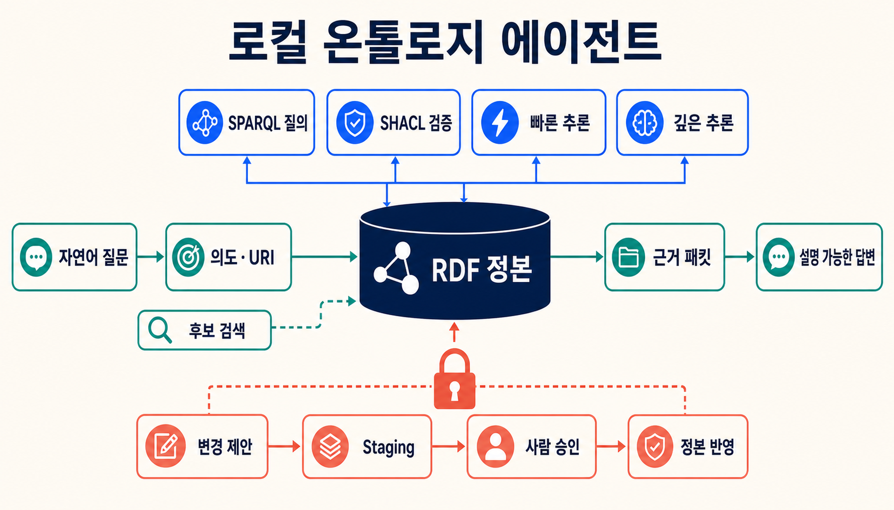
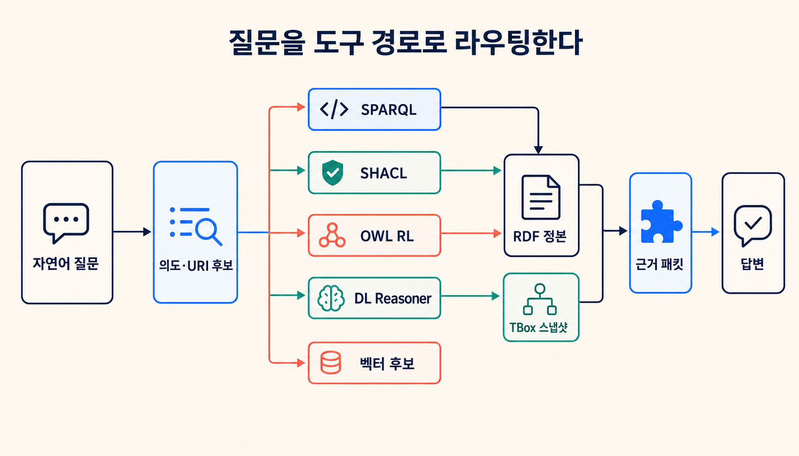
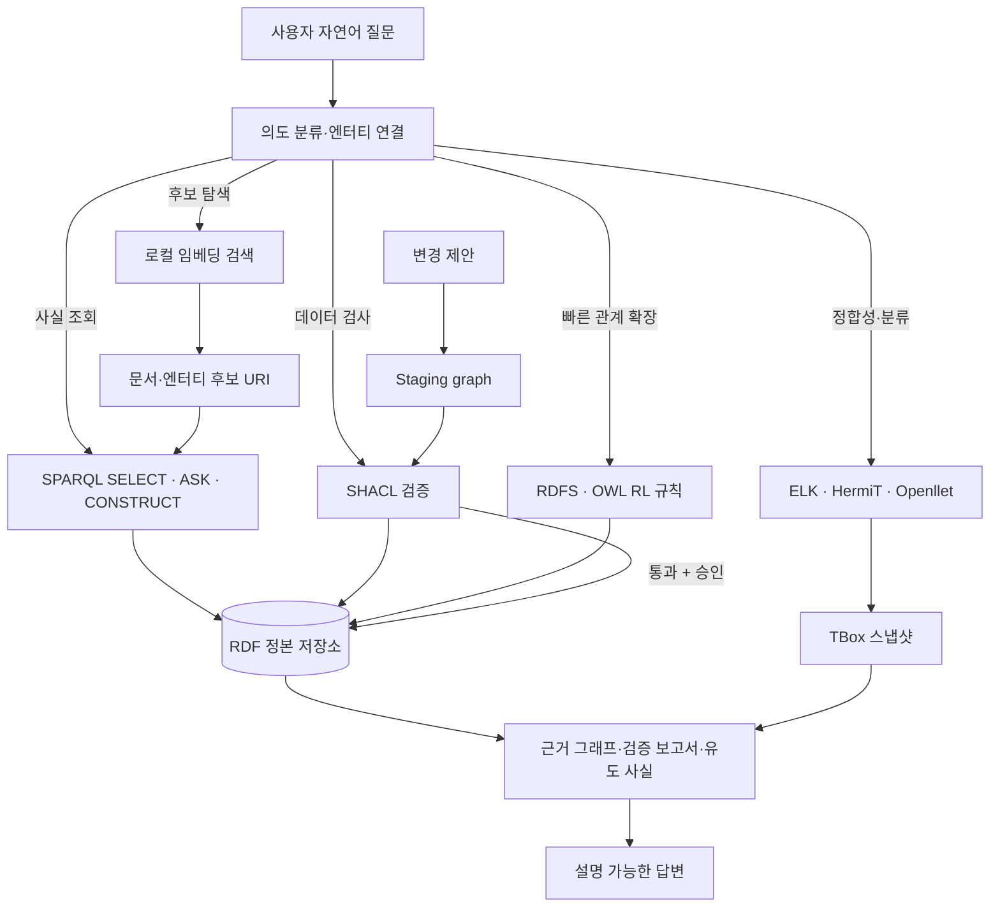
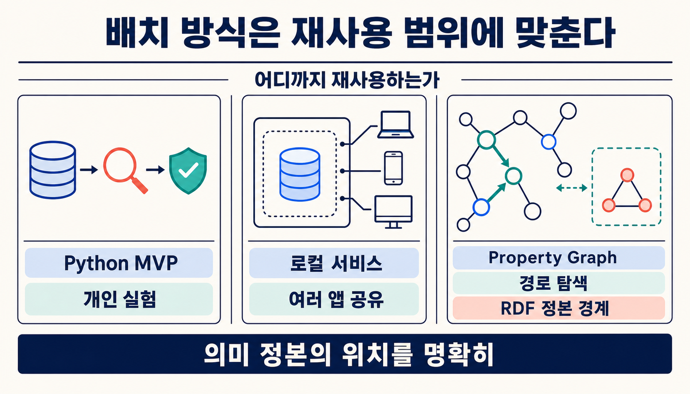
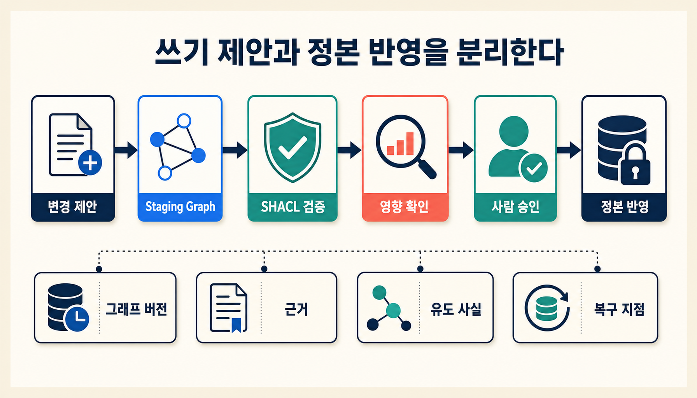

[[notes/ontology-vs-json-rules|6번 글]]에서는 관계 깊이, 변경 전파, 감사 요구가 어느 지점에서 온톨로지 비용을 정당화하는지 검증할 실험을 설계했다. 이번 글은 그 조건이 실제로 나타났다고 보고, **한 대의 로컬 머신에서 무엇부터 나눠 구현할지** 정리한다.

> [!important] 이 글의 검증 상태
> 이 글은 공식 표준과 각 도구의 문서를 바탕으로 쓴 **구현 설계 가이드**다. 아래의 저장소, reasoner, API 조합을 하나의 시스템으로 설치해 성능과 호환성까지 검증한 완료 보고서는 아니다. 코드와 명령도 출발점에 가깝다. 실제 도입 전에는 버전을 고정하고 스모크 테스트와 회귀 검사를 따로 해야 한다.

## 핵심 결론

처음부터 거대한 온톨로지 플랫폼을 만들 필요는 없다. 여섯 가지 책임을 나눈 작은 닫힌 루프로 시작하면 된다.

1. **RDF·OWL 정본:** 원본 사실, 클래스와 관계 의미를 저장한다.
2. **SPARQL 질의:** 사실 조회와 관계 확인을 결정론적으로 실행한다.
3. **SHACL 검증:** 적재 전후와 변경 제안의 품질 게이트가 된다.
4. **빠른 추론:** RDFS·OWL RL 또는 작은 명시 규칙을 상시 경로에 둔다.
5. **깊은 추론:** ELK·HermiT·Openllet 같은 reasoner를 필요할 때만 격리 호출한다.
6. **쓰기 승인:** 에이전트 제안을 staging graph에서 검증한 뒤 사람이 승인해야 정본에 반영한다.

OWL은 클래스·속성·개체와 관계 의미를 표현한다. SPARQL은 RDF 그래프를 질의하고, SHACL은 그래프가 제약을 지키는지 검사한다.[src_001](#src-001)[src_002](#src-002)[src_003](#src-003) 검색, 판정, 검증, 추론을 한 덩어리로 묶으면 어디서 실패했는지 알기 어렵고 권한 경계도 흐려진다.

## 적용 범위와 설계 기준

여기서는 다음 조건을 기본값으로 삼는다.

- 한 대의 개인용 또는 팀 내부 로컬 머신
- 외부 SaaS가 아닌 로컬 저장소와 로컬 모델 우선
- RDF·OWL 의미를 정본으로 유지
- 자유형 자연어보다 등록된 질의·검증 도구를 우선
- 읽기 전용 MVP로 시작하고 쓰기는 나중에 추가
- 성능 숫자보다 재현성·근거·복구 가능성을 먼저 검증

단일 JSON 문서의 구조를 검사하고 간단한 참·거짓 정책만 판단한다면 이 구조는 과하다. 그런 문제는 [[notes/ontology-vs-json-rules|6번 글의 JSON 기준선]]부터 시작하는 편이 낫다.

## 1. 하나의 에이전트가 아니라 여러 결정 경로다



자연어 제어기가 모든 일을 직접 처리할 필요는 없다. 질문의 성격을 보고 조회·검증·빠른 추론·깊은 추론·검색 보조 중 알맞은 경로를 고르면 된다.



세 경계만큼은 처음부터 분명히 해 둔다.

- **벡터 검색은 후보를 찾고, 상징 계층이 판정한다.** 검색 점수만으로 사실이나 정책 결론을 확정하지 않는다.
- **빠른 추론과 깊은 추론을 분리한다.** 상시 응답에는 가벼운 규칙을 사용하고, 복잡한 분류·정합성 검사는 별도 작업으로 보낸다.
- **조회와 쓰기를 분리한다.** 모델이 생성한 SPARQL Update를 정본에 즉시 실행하지 않는다.

## 2. 배치 방식은 재사용 범위에 맞춘다



### 요구 조건에 따라 구성을 바꿔 보기

아래 선택기에서 배치 방식, 의미론 수준, 운영 규모, 감사·쓰기 요구를 바꾸면 어떤 구성이 어울리는지 살펴볼 수 있다. 점수는 제품 성능이나 용량을 잰 값이 아니라 설계 성향을 비교한 상대값이다.

<iframe
  class="interactive-visualization-frame"
  src="/attachments/local-ontology-agent-implementation/local-ontology-agent-stack-explorer.htm"
  title="로컬 온톨로지 에이전트 구성 선택기"
  loading="lazy"
  scrolling="no"
  sandbox="allow-scripts allow-same-origin"
  style="height:860px"
></iframe>

### 2.1 Python 단일 프로세스형

개인용 도구나 연구용 MVP라면 저장소·검증·라우터를 Python 안에 묶는 방식이 가장 빠르다. Owlready2는 OWL 엔터티를 Python 객체처럼 다루며 로컬 quadstore와 HermiT 추론도 연결한다.[src_011](#src-011) 질의와 저장에는 RDFLib 또는 pyoxigraph를, 검증에는 pySHACL을 붙일 수 있다.[src_012](#src-012)

| 책임            | 후보                               |
| --------------- | ---------------------------------- |
| OWL 모델 조작   | Owlready2                          |
| RDF 파싱·SPARQL | RDFLib 또는 pyoxigraph             |
| SHACL 검증      | pySHACL                            |
| 빠른 규칙       | OWL-RL 또는 명시적 Python 규칙     |
| 깊은 추론       | HermiT·Openllet 요청 시 호출       |
| API             | FastAPI, loopback 바인딩           |
| 검색 보조       | 로컬 임베딩 + FAISS, URI 후보 반환 |

구현과 디버깅은 쉽다. 다만 여러 앱이 동시에 접근하거나 장기 저장·잠금·관측 요구가 커지면 서비스 경계를 다시 잡아야 한다.

### 2.2 로컬 서비스형

여러 앱이 같은 그래프를 함께 쓰거나 반복 질의가 많다면 저장소를 로컬 서비스로 떼는 편이 낫다. Apache Jena TDB2는 단일 머신용 RDF 저장소이고, Fuseki를 붙이면 SPARQL 서비스로 쓸 수 있다.[src_004](#src-004)[src_005](#src-005)[src_006](#src-006) RDF4J도 Repository API와 NativeStore를 중심으로 로컬 저장과 질의를 구성한다.[src_009](#src-009)

- Fuseki 또는 RDF4J Server: 정본 그래프와 SPARQL endpoint
- SHACL: 저장 트랜잭션 또는 적재 파이프라인의 검증 경계
- 경량 추론: 저장소 inferencer 또는 별도 materialization 작업
- DL reasoner: TBox 스냅샷을 처리하는 전용 worker
- 에이전트 API: 의도 분류, query template 선택, 설명 패킷 생성

Jena는 RDF 저장·SPARQL·추론·SHACL을 한 생태계에서 제공한다. RDF4J는 Repository와 Sail 계층으로 저장소·inferencer·SHACL을 조합한다.[src_007](#src-007)[src_008](#src-008)[src_010](#src-010) 제품의 우열보다 중요한 것은 **정본 저장소와 추론 작업의 수명주기를 따로 운영할 수 있느냐**다.

### 2.3 Property graph 탐색형

경로 탐색과 애플리케이션 UX가 중심이라면 Neo4j와 n10s도 현실적인 후보다. n10s는 Neo4j에서 RDF·OWL·SKOS·SHACL 연동과 일부 추론 기능을 제공한다.[src_013](#src-013)

그렇다고 property graph가 OWL 의미론 전체를 자동으로 보존하는 것은 아니다. 아래 조건에 해당하면 RDF 정본이나 검증 계층을 따로 둔다.

- OWL 프로파일별 추론 결과가 중요하다.
- SHACL 보고서를 감사 증거로 보존해야 한다.
- RDF 직렬화와 URI 의미가 장기 호환성의 기준이다.
- 다른 RDF 도구와 상호운용해야 한다.

Neo4j가 온톨로지를 대체하는지부터 따질 필요는 없다. **운영 탐색용 투영으로 어디까지 쓸지** 먼저 정하면 된다.

## 3. 추론은 빠른 경로와 깊은 경로로 나눈다

### 빠른 경로: RDFS·OWL RL·명시 규칙

상시 질의에는 가벼운 규칙 계층을 둔다. 한 번 계산한 결과를 빠르게 재사용할 수 있어서다. OWL 2 RL은 규칙 엔진 구현을 고려한 프로파일이라 클래스·속성 계층과 일부 OWL 의미를 규칙 형태로 다루기 좋다.[src_001](#src-001) Jena inference subsystem처럼 forward·backward·hybrid 규칙을 제공하는 도구도 이 층에 놓을 수 있다.[src_008](#src-008)

다음 산출물을 반드시 남긴다.

- 사용한 그래프와 규칙 버전
- 새로 유도된 트리플
- 원본 사실과 유도 사실의 구분
- materialization 수행 시점과 재생성 방법

### 깊은 경로: ELK·HermiT·Openllet

클래스 분류, 일관성 검사, 동치성, 복잡한 제약이 필요할 때만 DL reasoner를 부른다. 큰 EL 계층에는 ELK가 잘 맞고, 더 높은 OWL DL 표현력이 필요하면 HermiT나 Openllet을 검토할 수 있다.[src_015](#src-015)[src_016](#src-016)[src_017](#src-017)

이 작업을 대화 요청마다 돌리지는 않는다.

1. TBox와 필요한 ABox 부분집합을 스냅샷으로 만든다.
2. worker에 제한 시간과 메모리 한도를 적용한다.
3. 엔진·설정·입력 hash와 결과를 저장한다.
4. 승인된 결과만 closure 또는 캐시에 반영한다.

빠른 경로와 깊은 경로를 나누는 이유는 속도만이 아니다. “에이전트가 추론했다”는 말만 남겨서는 어떤 엔진과 그래프가 결과를 만들었는지 재현할 수 없다.

## 4. SHACL은 적재와 변경의 품질 게이트다

SHACL은 RDF 그래프가 shape에 적힌 제약을 지키는지 검사하고 validation report를 만든다.[src_003](#src-003) 로컬 에이전트에서는 세 지점에 배치한다.

- **ingest 전:** CSV·JSON·문서 추출 결과를 RDF로 바꾼 뒤 검사
- **staging:** 에이전트가 제안한 추가·수정 트리플을 정본 반영 전에 검사
- **회귀 검사:** ontology·shape 버전이 바뀔 때 기존 그래프를 재검사

```python
from pathlib import Path

from pyshacl import validate
from rdflib import Graph


def validate_graph(data_path: Path, shapes_path: Path) -> tuple[bool, str]:
    data_graph = Graph().parse(data_path)
    shapes_graph = Graph().parse(shapes_path)

    conforms, _, report_text = validate(
        data_graph=data_graph,
        shacl_graph=shapes_graph,
        inference="rdfs",
        abort_on_first=False,
        allow_infos=True,
        allow_warnings=True,
    )
    return bool(conforms), str(report_text)
```

SHACL을 통과했다는 말은 **주어진 그래프가 주어진 shape를 어기지 않았다**는 뜻일 뿐이다. 원출처가 사실인지, 누가 쓸 권한이 있는지, 데이터가 어디서 왔는지는 따로 관리해야 한다. 그래서 provenance가 필요하다.

## 5. 자연어는 제한된 SPARQL 도구로 보낸다

처음부터 자유형 text-to-SPARQL을 열어 두기보다, 작은 query template 집합으로 시작한다.

| 의도        | 안전한 실행 방식                                        |
| ----------- | ------------------------------------------------------- |
| 엔터티 찾기 | 라벨·별칭 인덱스로 URI 후보를 만든 뒤 파라미터화 SELECT |
| 관계 확인   | 허용된 predicate 안에서 ASK                             |
| 주변 맥락   | 깊이와 결과 수를 제한한 CONSTRUCT                       |
| 정책 검사   | 등록된 SHACL shape 또는 ASK template                    |
| 변경 제안   | SPARQL Update가 아닌 구조화된 patch proposal            |

가령 “A가 B의 상위 개념인가?”를 묻는다면 질의 구조와 predicate는 서버가 정한다. 사용자 입력은 URI 값에만 넣는다.

```sparql
PREFIX rdfs: <http://www.w3.org/2000/01/rdf-schema#>
ASK {
  VALUES (?child ?parent) {
    (<urn:example:A> <urn:example:B>)
  }
  ?child rdfs:subClassOf+ ?parent .
}
```

나중에 생성형 SPARQL을 붙이더라도 `parse → 허용 연산 검사 → 제한 시간 → 읽기 전용 endpoint` 순서는 지킨다.

## 6. 쓰기 제안과 정본 반영을 분리한다



로컬에서 실행한다고 쓰기 권한까지 안전해지는 것은 아니다. 정본은 아래 순서를 거쳐서만 바꾼다.

```text
자연어 요청
  → 구조화된 변경 제안
  → staging graph
  → SHACL 검증
  → 영향 범위와 diff 표시
  → 사람 승인
  → 정본 트랜잭션
  → 버전·근거·복구 지점 기록
```

운영 규칙에는 적어도 아래 항목이 들어가야 한다.

- 서비스는 기본적으로 `127.0.0.1`에만 바인딩한다.
- Query와 Update endpoint를 분리하고 Update는 별도 자격증명을 사용한다.
- 모델 출력 원문을 SPARQL Update로 즉시 실행하지 않는다.
- 원문·추출 사실·유도 사실·모델 제안을 named graph나 provenance 속성으로 구분한다.
- 그래프, ontology, shape와 query template 버전을 함께 기록한다.
- 백업 복원과 ontology·shape 회귀 검사를 정기적으로 수행한다.
- 외부 문서와 memory write를 prompt injection 가능 입력으로 취급한다.

설명 패킷에는 최소한 **질문, 선택된 URI, 실행 질의, 그래프 버전, 근거 트리플, 검증 결과, 유도 규칙**을 담는다.

## 7. 최소 실행 가능한 데모와 로드맵

첫 MVP에서 중요한 것은 기능 수가 아니라 **관측 가능한 한 바퀴**다.

1. 작은 TBox와 예시 ABox를 로드한다.
2. 라벨 검색으로 URI 후보를 찾는다.
3. 등록된 SELECT·ASK template을 실행한다.
4. SHACL 위반 사례를 만들고 보고서를 반환한다.
5. RDFS·OWL RL 규칙 전후의 결과 차이를 보여 준다.
6. “왜 이 답인가?”에 근거 트리플과 그래프 버전을 반환한다.
7. 쓰기 요청은 proposal로 저장하고 정본은 변경하지 않는다.

결정론적 라우터는 다음 정도로 시작할 수 있다.

```python
from dataclasses import dataclass
from typing import Literal

Intent = Literal["lookup", "relation", "validate", "explain", "propose_change"]


@dataclass(frozen=True)
class AgentRequest:
    intent: Intent
    entity_uris: tuple[str, ...]
    question: str


def route(request: AgentRequest) -> str:
    return {
        "lookup": "sparql_select",
        "relation": "sparql_ask",
        "validate": "shacl_validate",
        "explain": "construct_evidence_graph",
        "propose_change": "write_staging_proposal",
    }[request.intent]
```

LLM은 의도와 URI 후보를 제안한다. 실제 도구와 권한은 라우터가 고른다. 그래야 모델이나 프롬프트를 바꿔도 저장소 권한은 흔들리지 않는다.

| 단계           | 범위                                    | 완료 신호                                      |
| -------------- | --------------------------------------- | ---------------------------------------------- |
| 1. 의미 모델   | 핵심 클래스·관계·shape와 작은 gold 사례 | 기대한 SELECT·ASK·SHACL 결과가 테스트로 고정됨 |
| 2. 로컬 코어   | 저장소, SPARQL, SHACL                   | 재시작 뒤 같은 그래프와 판정이 재현됨          |
| 3. 빠른 추론   | RDFS·OWL RL과 유도 사실 분리            | 추론 전후 차이와 사용 규칙을 설명할 수 있음    |
| 4. 대화 라우터 | 의도 분류, URI 후보, query template     | 자유형 질문이 허용 경로로만 실행됨             |
| 5. 깊은 추론   | ELK·HermiT·Openllet worker              | 제한 시간·메모리·버전이 기록됨                 |
| 6. 쓰기 제안   | staging, SHACL, 승인                    | 모델이 정본을 직접 바꾸지 않음                 |
| 7. 운영화      | 백업, 회귀, 권한, 관측성                | 잘못된 변경에서 이전 스냅샷으로 복구 가능      |

## 8. 반대 선택지와 대안 가설

이 구성이 모든 문제의 정답은 아니다.

- 읽기 전용 문서 검색이 목적이면 일반 RAG가 더 단순할 수 있다.
- 관계 경로와 제품 UX가 핵심이면 property graph가 더 자연스러울 수 있다.
- 작은 분류 체계는 Markdown·JSONL·SQLite와 명시 규칙으로 충분할 수 있다.
- OWL 의미론이 필요하더라도 상시 DL 추론보다 사전 분류한 closure를 배포하는 편이 나을 수 있다.
- 팀이 RDF·SPARQL을 운영할 역량이 없다면 도구의 이론적 장점이 총소유비용으로 이어지지 않는다.

가장 강한 반론은 **“온톨로지 에이전트까지 만들 필요 없이, 검증된 구조화 도구를 호출하는 로컬 에이전트면 충분하다”**는 주장이다. 그래서 MVP는 온톨로지가 없는 기준선과 정확도·변경·감사 비용을 꼭 비교해야 한다.

## 9. 불확실성과 한계

- 이 글은 통합 구현 완료 보고서가 아니다.
- 각 저장소·reasoner 조합의 버전 호환성과 처리량은 별도 실행으로 검증해야 한다.
- 공식 기능이 존재해도 동일 데이터와 공리에서 같은 결과를 보장하지는 않는다.
- 벡터 검색, entity linking과 자연어 의도 분류의 정확도는 이 글에서 측정하지 않았다.
- SHACL 통과는 사실성이나 외부 행동 안전성을 보증하지 않는다.
- 로컬 배치도 사용자 권한, 백업, 로그와 prompt injection 위험을 별도로 관리해야 한다.

## 10. 무엇부터 만들 것인가

개인용 도구라면 Python 단일 프로세스에 읽기 전용 질의와 SHACL만 붙여 시작한다. 여러 앱이 같은 그래프를 함께 쓰게 되면 Jena·Fuseki나 RDF4J로 저장소 경계를 분리한다. 복잡한 DL 추론은 상시 요청 경로 밖으로 빼고, 임베딩은 후보를 찾는 데만 쓴다.

쓰기 권한과 자동화는 다음 세 질문에 모두 답할 수 있을 때 넓힌다.

1. 같은 질문을 다시 실행했을 때 같은 그래프 버전과 근거를 재현하는가?
2. 잘못된 데이터와 변경 제안을 정본 반영 전에 차단하는가?
3. 답변·위반·추론 결과가 어떤 사실과 규칙에서 나왔는지 추적하고 복구할 수 있는가?

## 참고문헌

<a id="src-001"></a>

- W3C. [OWL 2 Web Ontology Language Profiles (Second Edition)](https://www.w3.org/TR/owl2-profiles/).

<a id="src-002"></a>

- W3C. [SPARQL 1.2 Query Language](https://www.w3.org/TR/sparql12-query/) (Working Draft).

<a id="src-003"></a>

- W3C. [Shapes Constraint Language (SHACL)](https://www.w3.org/TR/shacl/).

<a id="src-004"></a>

- Apache Jena. [Documentation overview](https://jena.apache.org/documentation/index.html).

<a id="src-005"></a>

- Apache Jena. [TDB2](https://jena.apache.org/documentation/tdb2/index.html).

<a id="src-006"></a>

- Apache Jena. [Fuseki](https://jena.apache.org/documentation/fuseki2/).

<a id="src-007"></a>

- Apache Jena. [SHACL implementation](https://jena.apache.org/documentation/shacl/).

<a id="src-008"></a>

- Apache Jena. [Inference subsystem](https://jena.apache.org/documentation/inference/).

<a id="src-009"></a>

- Eclipse RDF4J. [Repository API](https://rdf4j.org/documentation/programming/repository/).

<a id="src-010"></a>

- Eclipse RDF4J. [SHACL validation](https://rdf4j.org/documentation/programming/shacl/).

<a id="src-011"></a>

- Owlready2. [Documentation](https://owlready2.readthedocs.io/en/latest/).

<a id="src-012"></a>

- RDFLib community. [pySHACL](https://github.com/RDFLib/pySHACL).

<a id="src-013"></a>

- Neo4j Labs. [Neosemantics (n10s)](https://neo4j.com/labs/neosemantics/).

<a id="src-014"></a>

- OWLAPI. [OWLAPI repository](https://github.com/owlcs/owlapi).

<a id="src-015"></a>

- Live Ontologies. [ELK reasoner](https://github.com/liveontologies/elk-reasoner).

<a id="src-016"></a>

- HermiT. [HermiT OWL Reasoner](http://www.hermit-reasoner.com/).

<a id="src-017"></a>

- Openllet. [Openllet repository](https://github.com/Galigator/openllet).
