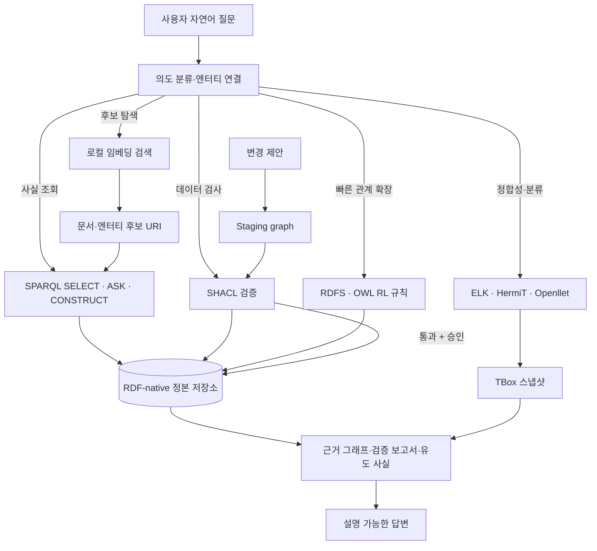

[[notes/ontology-vs-json-rules|6번 글]]에서는 온톨로지가 JSON 규칙보다 나아질 수 있는 조건을 실험 설계로 정리했다. 이번 글은 그 조건이 실제로 필요하다고 판단했을 때, **한 대의 로컬 머신에서 어떤 구성으로 시작할 것인가**를 다룬다.

핵심은 거대한 “온톨로지 플랫폼”을 한 번에 만드는 것이 아니다. 저장소, 질의, 검증, 빠른 추론, 깊은 추론, 자연어 인터페이스를 서로 다른 책임으로 나누고, 가장 작은 닫힌 루프부터 검증하는 것이다.

> 자연어 질문을 곧바로 생성형 답변이나 그래프 업데이트로 보내지 않는다. 먼저 의도를 분류하고, SPARQL·SHACL·추론 가운데 필요한 도구를 호출한 뒤, 결과와 근거를 함께 답한다.

## 먼저 결론부터

제약이 아직 명확하지 않은 로컬 프로젝트라면 다음 구조가 가장 안전한 기본값이다.

- **정본:** RDF/OWL 그래프와 명시적인 TBox·ABox
- **질의:** SPARQL SELECT·ASK·CONSTRUCT
- **검증:** SHACL을 적재 전후의 경계로 사용
- **빠른 추론:** RDFS 또는 OWL RL 수준의 규칙·materialization
- **깊은 추론:** ELK, HermiT, Openllet 같은 reasoner를 필요할 때만 격리 호출
- **자연어 검색:** 로컬 임베딩은 엔터티·문서 후보를 찾는 보조 계층으로만 사용
- **에이전트 쓰기:** staging graph → SHACL → 사람 승인 → 정본 반영 순서로 제한

이 구성이 중요한 이유는 각 기술이 해결하는 문제가 다르기 때문이다. OWL은 클래스·속성·개체와 관계 의미를 표현하고, SPARQL은 RDF 그래프를 질의하며, SHACL은 그래프가 제약을 만족하는지 검증한다.[src_001](#src-001)[src_002](#src-002)[src_003](#src-003) 이 세 역할을 한 덩어리로 취급하면, 검색 실패인지 데이터 오류인지 추론 비용 문제인지 구분하기 어려워진다.

## 아키텍처: 한 에이전트가 아니라 여러 결정 경로

로컬 온톨로지 에이전트는 다음처럼 생각하면 단순해진다. 자연어 제어기는 모든 일을 직접 하지 않고, 질문의 성격에 따라 **조회·검증·빠른 추론·깊은 추론·검색 보조** 경로를 선택한다.



이 구조에서 가장 중요한 경계는 세 가지다.

1. **벡터 검색은 후보를 찾고, 상징 계층이 판정한다.** 임베딩 검색 결과가 곧 사실이나 정책 결론이 되지 않는다.
2. **빠른 추론과 깊은 추론을 같은 요청 경로에 넣지 않는다.** 상시 응답에는 가벼운 규칙을 쓰고, 복잡한 분류·정합성 검사는 별도 작업으로 보낸다.
3. **조회와 쓰기를 분리한다.** 에이전트가 생성한 SPARQL Update를 정본에 즉시 실행하지 않는다.

## 요구 조건에 따라 구성을 바꿔 보기

아래 선택기는 배치 방식, 의미론 수준, 운영 규모, 감사·쓰기 요구를 바꾸면 어떤 로컬 구성이 자연스러운지 보여 준다. **표시되는 점수는 제품 성능이나 용량 벤치마크가 아니라 상대적 설계 성향**이다.

<iframe
  class="interactive-visualization-frame"
  src="/attachments/local-ontology-agent-implementation/local-ontology-agent-stack-explorer.htm"
  title="로컬 온톨로지 에이전트 구성 선택기"
  loading="lazy"
  scrolling="no"
  sandbox="allow-scripts allow-same-origin"
  style="height:860px"
></iframe>

## 세 가지 현실적인 배치 방식

### 1. Python 단일 프로세스형

개인용 도구나 연구용 MVP라면 Python 안에 저장소·검증·라우터를 넣는 방식이 가장 빠르다. Owlready2는 Python 객체처럼 OWL 엔터티를 다루고 로컬 quadstore를 사용할 수 있으며, HermiT 기반 추론도 연결한다.[src_011](#src-011) RDFLib이나 pyoxigraph를 질의·저장 계층으로 쓰고 pySHACL로 검증하면, 한 프로세스 안에서 작은 닫힌 루프를 만들 수 있다.[src_012](#src-012)

권장 시작점은 다음과 같다.

| 책임            | 선택지                               |
| --------------- | ------------------------------------ |
| OWL 모델 조작   | Owlready2                            |
| RDF 파싱·SPARQL | RDFLib 또는 pyoxigraph               |
| SHACL 검증      | pySHACL                              |
| 빠른 규칙       | OWL-RL 또는 명시적인 Python 규칙     |
| 깊은 추론       | HermiT/Openllet을 요청 시 호출       |
| API             | FastAPI, loopback 바인딩             |
| 검색 보조       | 로컬 임베딩 + FAISS, URI 후보만 반환 |

장점은 구현 속도와 디버깅 편의성이다. 단점은 여러 앱이 동시에 쓰기 시작하거나 장기 운영에서 저장·잠금·관측 요구가 커질 때 경계가 흐려질 수 있다는 점이다.

### 2. 로컬 서비스형

여러 앱이 같은 그래프를 공유하거나 반복 질의가 많다면 저장소를 별도 로컬 서비스로 분리하는 편이 낫다. Apache Jena TDB2는 단일 머신용 RDF 저장소이고 Fuseki를 통해 SPARQL 서비스를 제공할 수 있다.[src_004](#src-004)[src_005](#src-005)[src_006](#src-006) RDF4J도 Repository API와 NativeStore를 중심으로 로컬 저장·질의를 구성할 수 있다.[src_009](#src-009)

이 배치에서는 다음 경계를 권장한다.

- Fuseki 또는 RDF4J Server: 정본 그래프와 SPARQL endpoint
- SHACL: 저장 트랜잭션 또는 적재 파이프라인의 검증 경계
- 경량 추론: 저장소 내부 inferencer 또는 별도 materialization job
- DL reasoner: TBox 스냅샷을 받아 실행하는 전용 worker
- 에이전트 API: 자연어 의도 분류, query template 선택, 설명 패킷 생성

Jena는 RDF 저장·SPARQL·추론·SHACL을 한 생태계 안에서 제공하고, RDF4J는 Repository/Sail 계층으로 저장소와 inferencer, SHACL을 조합한다.[src_007](#src-007)[src_008](#src-008)[src_010](#src-010) 중요한 것은 어느 제품이 절대적으로 우월한지가 아니라, **정본 저장소와 추론 작업의 수명주기를 분리할 수 있는가**다.

### 3. Property graph 탐색형

운영 그래프의 경로 탐색과 애플리케이션 UX가 중심이면 Neo4j와 n10s도 현실적인 선택이다. n10s는 Neo4j에서 RDF·OWL·SKOS·SHACL 연동과 일부 추론 기능을 제공한다.[src_013](#src-013)

다만 property graph를 선택했다고 OWL 의미론 전체가 자동으로 보존되는 것은 아니다. 다음 조건에서는 별도 RDF-native 정본이나 검증 계층을 유지하는 편이 안전하다.

- OWL 프로파일별 추론 결과가 중요하다.
- SHACL 보고서를 감사 증거로 보존해야 한다.
- 원본 RDF 직렬화와 URI 의미가 장기 호환성의 기준이다.
- 다른 RDF 도구와의 상호운용이 핵심이다.

즉 Neo4j는 “온톨로지를 대체하는가”보다, **운영 탐색 투영으로 어디까지 쓸 것인가**를 먼저 정해야 한다.

## 저장소와 엔진을 고르는 기준

| 선택지                        | 잘 맞는 상황                                            | 주의할 점                                           |
| ----------------------------- | ------------------------------------------------------- | --------------------------------------------------- |
| Owlready2 + RDFLib/pyoxigraph | 개인용 MVP, Python 파이프라인, 작은 로컬 앱             | 다중 클라이언트 운영 경계는 직접 설계해야 함        |
| Jena TDB2 + Fuseki            | RDF/SPARQL 중심의 지속 저장, Java 운영, 여러 클라이언트 | 추론 모드와 materialization 비용을 분리 측정해야 함 |
| RDF4J NativeStore             | Repository/Sail 조합, 트랜잭션과 SHACL 통합             | 제품별 inferencer 동작 범위를 명확히 고정해야 함    |
| Neo4j + n10s                  | 경로 탐색, property graph 애플리케이션, Cypher 중심 팀  | OWL·RDF 정본과의 의미 손실 여부를 별도 검증해야 함  |
| OWLAPI                        | Java에서 온톨로지 로드·변환·reasoner 연결               | 저장소가 아니라 온톨로지 엔지니어링 API에 가까움    |

OWLAPI는 온톨로지 파일을 다루고 reasoner를 연결하는 Java API로 유용하지만, 그 자체를 장기 저장소로 오해하면 안 된다.[src_014](#src-014) 저장, 질의, 추론 API의 역할을 따로 보는 습관이 중요하다.

## 추론은 두 층으로 나눈다

### 빠른 경로: RDFS·OWL RL·명시 규칙

상시 질의 경로에는 결과를 빠르게 재사용할 수 있는 규칙 계층이 적합하다. OWL 2 RL은 규칙 엔진 구현에 맞춰 설계된 프로파일이며, 클래스·속성 계층과 일부 OWL 의미를 규칙 형태로 처리하기 좋다.[src_001](#src-001) Jena의 inference subsystem처럼 forward·backward·hybrid 규칙을 제공하는 도구도 이 계층에 들어간다.[src_008](#src-008)

이 경로의 산출물은 가능한 한 명시적으로 남긴다.

- 어떤 그래프 버전을 사용했는가
- 어떤 규칙 세트를 적용했는가
- 새로 유도된 트리플은 무엇인가
- 원래 사실과 유도 사실을 구분할 수 있는가

### 깊은 경로: ELK·HermiT·Openllet

클래스 분류, 일관성 검사, 동치성, 복잡한 제약이 필요할 때만 DL reasoner를 호출한다. 큰 EL 계층에는 ELK가 잘 맞고, 표현력이 더 높은 OWL DL 검사는 HermiT나 Openllet을 후보로 둘 수 있다.[src_015](#src-015)[src_016](#src-016)[src_017](#src-017)

깊은 추론은 대화 요청마다 실행하기보다 다음 방식이 안전하다.

1. TBox와 필요한 ABox 부분집합을 스냅샷으로 만든다.
2. reasoner worker에서 제한 시간과 메모리 한도를 적용한다.
3. 분류·정합성 결과와 엔진 설정을 저장한다.
4. 승인된 결과만 검색용 closure나 캐시에 반영한다.

이 분리는 응답속도뿐 아니라 재현성을 위한 것이다. “에이전트가 추론했다”는 문장만으로는 어떤 엔진·설정·그래프 버전이 결과를 만들었는지 알 수 없다.

## SHACL은 저장 전후의 품질 게이트다

SHACL은 RDF 그래프가 shape로 표현한 제약을 만족하는지 검사하고 validation report를 만든다.[src_003](#src-003) 로컬 에이전트에서는 세 지점에 두기 좋다.

- **ingest 전:** 외부 CSV·JSON·문서 추출 결과를 RDF로 바꾼 뒤 검사
- **staging:** 에이전트가 제안한 추가·수정 트리플을 정본 반영 전에 검사
- **회귀 검사:** 온톨로지·shape 버전이 바뀔 때 기존 그래프를 다시 검사

```python
from pathlib import Path

from pyshacl import validate
from rdflib import Graph


def validate_graph(data_path: Path, shapes_path: Path) -> tuple[bool, str]:
    data_graph = Graph().parse(data_path)
    shapes_graph = Graph().parse(shapes_path)

    conforms, _, report_text = validate(
        data_graph=data_graph,
        shacl_graph=shapes_graph,
        inference="rdfs",
        abort_on_first=False,
        allow_infos=True,
        allow_warnings=True,
    )
    return bool(conforms), str(report_text)
```

중요한 경계도 있다. SHACL 통과는 **주어진 그래프가 주어진 shape를 위반하지 않았다는 뜻**이지, 원출처의 사실성이 보증됐다는 뜻은 아니다. 출처 hash, 작성 권한, 데이터 계보는 별도로 관리해야 한다.

## 자연어를 SPARQL로 보내는 안전한 패턴

처음부터 자유형 text-to-SPARQL을 허용하기보다 작은 query template 집합으로 시작하는 편이 낫다.

| 의도        | 안전한 실행 방식                                           |
| ----------- | ---------------------------------------------------------- |
| 엔터티 찾기 | 라벨·별칭 인덱스로 URI 후보 생성 후 파라미터화 SELECT      |
| 관계 확인   | 허용된 predicate 목록 안에서 ASK                           |
| 주변 맥락   | 깊이와 결과 수가 제한된 CONSTRUCT                          |
| 정책 검사   | 미리 등록된 SHACL shape 또는 ASK template                  |
| 변경 제안   | SPARQL Update 문자열이 아니라 구조화된 patch proposal 생성 |

예를 들어 “A가 B의 상위 개념인가?”는 자유형 쿼리보다 아래처럼 허용된 경로를 고정할 수 있다.

```sparql
PREFIX rdfs: <http://www.w3.org/2000/01/rdf-schema#>
ASK {
  VALUES (?child ?parent) {
    (<urn:example:A> <urn:example:B>)
  }
  ?child rdfs:subClassOf+ ?parent .
}
```

사용자 입력은 URI 값에만 들어가고, predicate와 질의 구조는 서버가 소유한다. 이후 요구가 커질 때 생성형 SPARQL 후보를 추가하더라도, parse → 허용 연산 검사 → 제한 시간 → 읽기 전용 endpoint 순서로 통제할 수 있다.

## 최소 실행 가능한 데모

첫 MVP는 기능 수보다 **관측 가능한 한 바퀴**가 중요하다.

1. 작은 TBox와 예시 ABox를 로드한다.
2. 라벨 검색으로 URI 후보를 찾는다.
3. 등록된 SELECT·ASK template을 실행한다.
4. SHACL 위반 사례를 하나 만들고 보고서를 보여 준다.
5. RDFS/OWL RL 규칙 전후의 결과 차이를 보여 준다.
6. “왜 이 답인가?”에 사용 트리플과 그래프 버전을 반환한다.
7. 쓰기 요청은 proposal 파일로만 저장하고 정본은 바꾸지 않는다.

에이전트 제어기는 다음 정도면 충분하다.

```python
from dataclasses import dataclass
from typing import Literal

Intent = Literal["lookup", "relation", "validate", "explain", "propose_change"]


@dataclass(frozen=True)
class AgentRequest:
    intent: Intent
    entity_uris: tuple[str, ...]
    question: str


def route(request: AgentRequest) -> str:
    routes = {
        "lookup": "sparql_select",
        "relation": "sparql_ask",
        "validate": "shacl_validate",
        "explain": "construct_evidence_graph",
        "propose_change": "write_staging_proposal",
    }
    return routes[request.intent]
```

LLM은 의도와 URI 후보를 제안할 수 있지만, 실제 실행 도구와 권한은 결정론적 라우터가 선택한다. 이렇게 해야 모델 교체나 프롬프트 변경이 저장소 권한까지 흔들지 않는다.

## 보안·프라이버시·운영 규칙

로컬 실행만으로 안전이 자동 보장되지는 않는다. 최소한 아래 규칙은 처음부터 넣는 편이 좋다.

- 서비스는 기본적으로 `127.0.0.1`에만 바인딩한다.
- Query와 Update endpoint를 분리하고, Update는 별도 자격증명을 요구한다.
- 자연어 또는 모델 출력 원문을 그대로 SPARQL Update로 실행하지 않는다.
- 파일·RDB·API ingest는 staging graph에서 검증한 뒤 정본에 반영한다.
- 그래프 스냅샷, ontology version, shape version, query template version을 함께 기록한다.
- 원문·추출 사실·유도 사실·모델 제안을 서로 다른 named graph 또는 provenance 속성으로 구분한다.
- 백업 복원과 ontology/shape 회귀 검사를 정기적으로 실행한다.
- 외부 문서와 memory write는 prompt injection이 들어올 수 있는 입력으로 취급한다.

특히 “설명 가능성”은 자연어 설명의 품질만으로 평가하면 안 된다. 최소 설명 패킷에는 **질문, 선택된 URI, 실행 질의, 사용 그래프 버전, 근거 트리플, 검증 결과, 유도 규칙**이 들어가야 한다.

## 단계별 구현 로드맵

| 단계           | 범위                                   | 완료 신호                                               |
| -------------- | -------------------------------------- | ------------------------------------------------------- |
| 1. 의미 모델   | 핵심 클래스·관계·shape, 작은 gold 사례 | 사람이 기대한 SELECT·ASK·SHACL 결과가 테스트로 고정됨   |
| 2. 로컬 코어   | 저장소, SPARQL, pySHACL/Jena SHACL     | 재시작 후 같은 그래프와 판정이 재현됨                   |
| 3. 빠른 추론   | RDFS/OWL RL 규칙과 유도 사실 분리      | 추론 전후 차이와 사용 규칙을 설명할 수 있음             |
| 4. 대화 라우터 | 의도 분류, URI 후보, query template    | 자유형 질문이 허용된 도구 경로로만 실행됨               |
| 5. 깊은 추론   | ELK/HermiT/Openllet worker             | 제한 시간·메모리·버전이 기록된 결과를 생성함            |
| 6. 쓰기 제안   | staging graph, SHACL, 승인             | 모델이 정본을 직접 바꾸지 않고 검토 가능한 patch를 남김 |
| 7. 운영화      | 백업, 회귀, 권한, 관측성               | 장애·오염·잘못된 변경에서 이전 스냅샷으로 복구 가능     |

## 무엇부터 만들 것인가

개인용 로컬 도구라면 Python MVP로 시작하는 것이 가장 빠르다. 하지만 MVP의 목적은 기술을 많이 붙이는 것이 아니라 **정본 그래프 → 통제된 질의 → 검증·추론 → 근거 포함 답변**이 한 바퀴 도는지 확인하는 것이다.

여러 앱이 재사용하거나 데이터가 계속 누적된다면 Jena/Fuseki 또는 RDF4J처럼 저장소 경계를 분리한다. 복잡한 DL 추론은 상시 요청 경로에서 떼고, 로컬 임베딩은 후보 탐색에만 사용한다. property graph는 경로 탐색과 제품 UX가 주목적일 때 선택하되, RDF/OWL 의미 정본의 위치를 명확히 한다.

결국 로컬 온톨로지 에이전트의 품질은 “몇 개의 AI 모델을 붙였는가”가 아니라 다음 세 질문으로 판단할 수 있다.

- 같은 질문을 다시 실행했을 때 같은 그래프 버전과 근거를 재현하는가?
- 잘못된 데이터와 변경 제안을 정본 반영 전에 차단하는가?
- 답변·위반·추론 결과가 어떤 사실과 규칙에서 나왔는지 추적할 수 있는가?

## 핵심만 다시 정리하면

로컬 온톨로지 에이전트는 **RDF 정본, SPARQL 질의, SHACL 검증, 빠른 규칙 추론, 격리된 깊은 추론**을 분리할수록 운영하기 쉽다.  
개인용 MVP는 Python 조합으로 작게 시작하고, 여러 앱이 공유할 때 Jena/Fuseki나 RDF4J 같은 로컬 서비스 경계를 도입한다.  
벡터 검색은 후보 탐색에, LLM은 의도·설명 생성에 쓰되, 최종 판정과 정본 변경은 검증 가능한 상징 계층과 승인 절차가 맡아야 한다.

## 참고문헌

<a id="src-001"></a>

- W3C. [OWL 2 Web Ontology Language Profiles (Second Edition)](https://www.w3.org/TR/owl2-profiles/).

<a id="src-002"></a>

- W3C. [SPARQL 1.2 Query Language](https://www.w3.org/TR/sparql12-query/) (Working Draft).

<a id="src-003"></a>

- W3C. [Shapes Constraint Language (SHACL)](https://www.w3.org/TR/shacl/).

<a id="src-004"></a>

- Apache Jena. [Documentation overview](https://jena.apache.org/documentation/index.html).

<a id="src-005"></a>

- Apache Jena. [TDB2](https://jena.apache.org/documentation/tdb2/index.html).

<a id="src-006"></a>

- Apache Jena. [Fuseki](https://jena.apache.org/documentation/fuseki2/).

<a id="src-007"></a>

- Apache Jena. [SHACL implementation](https://jena.apache.org/documentation/shacl/).

<a id="src-008"></a>

- Apache Jena. [Inference subsystem](https://jena.apache.org/documentation/inference/).

<a id="src-009"></a>

- Eclipse RDF4J. [Repository API](https://rdf4j.org/documentation/programming/repository/).

<a id="src-010"></a>

- Eclipse RDF4J. [SHACL validation](https://rdf4j.org/documentation/programming/shacl/).

<a id="src-011"></a>

- Owlready2. [Documentation](https://owlready2.readthedocs.io/en/latest/).

<a id="src-012"></a>

- RDFLib community. [pySHACL](https://github.com/RDFLib/pySHACL).

<a id="src-013"></a>

- Neo4j Labs. [Neosemantics (n10s)](https://neo4j.com/labs/neosemantics/).

<a id="src-014"></a>

- OWLAPI. [OWLAPI repository](https://github.com/owlcs/owlapi).

<a id="src-015"></a>

- Live Ontologies. [ELK reasoner](https://github.com/liveontologies/elk-reasoner).

<a id="src-016"></a>

- HermiT. [HermiT OWL Reasoner](http://www.hermit-reasoner.com/).

<a id="src-017"></a>

- Openllet. [Openllet repository](https://github.com/Galigator/openllet).
