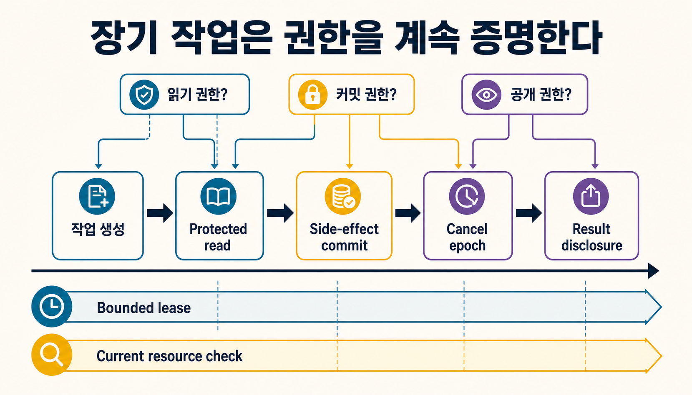
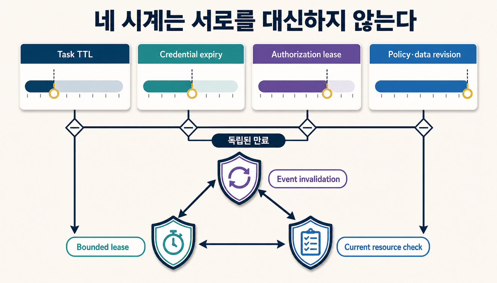
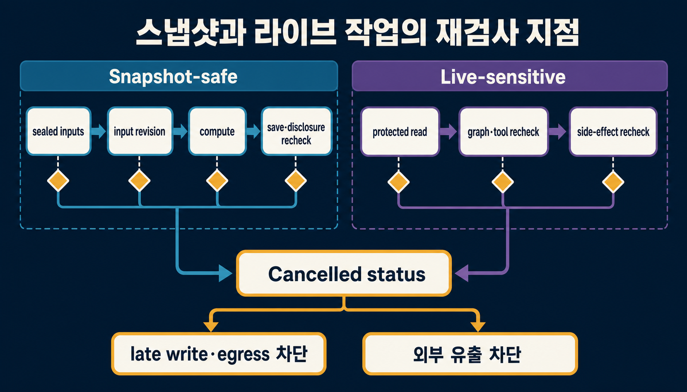
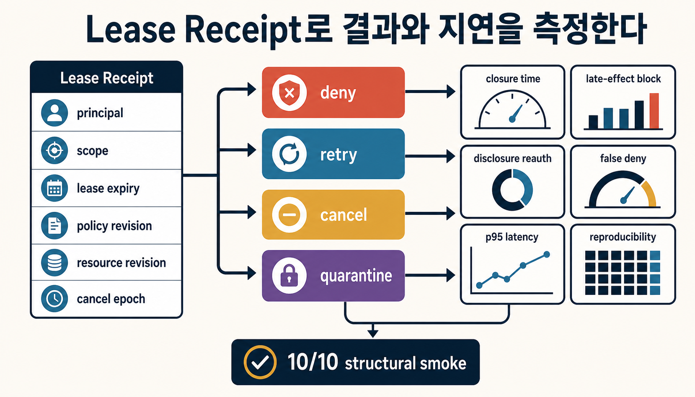

> [!summary] 핵심 결론
> 장기 실행 작업은 시작할 때 받은 허가를 끝까지 그대로 쓸 수 없습니다. **작업 상태를 보관하는 기간, 로그인 자격증명의 유효기간, 이전 권한 판단을 재사용할 수 있는 시간, 문서·조직 권한의 현재 버전을 따로 관리하고, 새 보호 자료를 읽거나 외부 시스템에 쓰거나 완료 결과를 보여 주기 직전에 현재 권한을 다시 확인해야 합니다.**

몇 시간 걸리는 조사 작업을 AI 에이전트에게 맡겼다고 가정해 보겠습니다. 작업을 시작할 때 사용자는 해당 프로젝트 문서에 접근할 수 있었고, 에이전트도 필요한 도구를 호출할 권한이 있었습니다. 그런데 실행 중 사용자가 프로젝트에서 빠졌고, 누가 문서를 볼 수 있는지 정한 접근 목록(ACL)이 바뀌었으며, 운영자는 작업을 취소했습니다.

대시보드에는 `cancelled`가 표시됐지만 이미 실행 중이던 실행기(worker)는 마지막 보고서를 저장하려고 했습니다. 나중에는 같은 작업 번호(task ID)를 아는 다른 연결이 완료 결과를 조회하려고 했습니다. 이때 “작업을 시작할 때 권한이 있었다”는 사실만으로 저장과 공개를 허용해도 될까요?

작업 생성 허가는 시작 시점의 결정일 뿐입니다. 장기 실행 작업에서는 보호 자료를 읽는 시점, 파일을 쓰거나 전송하는 시점, 완료 결과를 현재 요청자에게 보여 주는 시점이 서로 다릅니다. 그 사이에 권한이 바뀔 수 있으므로 **작업의 진행 상태와 권한의 유효 상태를 따로 관리해야 합니다.**

[[notes/authorization-aware-rag-graph-boundary|17번 글]]은 관련도와 권한을 분리하고 문서·그래프 경로·파생 답변·도구 행동을 각각 다시 허가해야 한다고 설명했습니다.[src_001](#src-001) [[notes/agent-memory-poisoning-promotion-gate|18번 글]]은 저장된 상태가 다음 세션까지 살아남아도 곧바로 신뢰할 수 있는 지식이 되는 것은 아니라고 정리했습니다.[src_002](#src-002) 이번 글은 두 경계 사이에 남은 시간 문제를 다룹니다.

> **권한이 있었던 작업이 오래 실행되는 동안 권한이 바뀌면, 어디에서 멈추고 무엇을 다시 검사해야 하는가?**

이 글에서는 **작업 권한 임대**(Task Authorization Lease)라는 표현을 사용합니다. MCP Tasks, OpenID CAEP, OAuth Token Introspection의 공식 계약을 프로젝트의 장기 작업 구조에 연결한 설계 제안입니다. 일정 시간 동안 이전 권한 판단을 재사용하되, 시간이 끝나거나 권한 변경 신호가 오면 다시 검사한다는 뜻입니다. 확립된 표준 명칭이나 현재 DuckCrab에 구현 완료된 기능은 아닙니다. 합성 상태 전이 검사는 수행했지만 실제 MCP 서버·권한 엔진·분산 작업 대기열·완료 알림 환경의 방어 성능은 아직 측정하지 않았습니다.

이제 작업 번호를 권한과 어떻게 묶는지부터 살펴본 뒤, 서로 다른 네 가지 시간값, 권한 회수와 취소, 완료 결과 공개, 회귀 검사 순서로 이어가겠습니다. 이 글은 **작업과 권한 맥락의 결속, 제한된 권한 임대, 보호 행동 직전 재검사, 취소 뒤 늦은 쓰기 차단, 결과 공개 재검사**라는 최소 계약에 집중합니다.

권한을 내주는 시스템과 실제 실행기가 서로 떨어져 있고, 중간에서 요청을 전달하거나 바꾸는 게이트웨이(gateway)가 있으며, 별칭(alias)·파일 경로·URL이 실행 중 다른 대상으로 연결될 수 있다면 검사를 더 촘촘하게 해야 합니다. 쉽게 말해 허가받은 요청과 실제 실행 요청이 같은지, 권한을 검사한 대상과 실행기가 실제로 연 대상이 같은지 확인하는 장치입니다. 연구 보고서에서는 이를 실행 허가(permit) 결속, 기준 요청(canonical request), 실제 접근 대상(resolved target) 검증 같은 강화 장치(hardening)로 구분합니다. 이런 장치는 시스템 구조가 복잡할 때 덧붙이는 확장 계약입니다.

## 작업 번호와 완료 상태는 권한 증명이 아닙니다

MCP Tasks는 오래 걸리는 요청의 상태를 보존하는 **지속형 상태 관리 구조(durable state machine)**입니다. 작업 생성 응답에서 최종 결과를 바로 받지 않고, 이후 `tasks/get`, `tasks/result`, `tasks/cancel` 같은 명령으로 상태 확인, 결과 조회, 취소를 처리할 수 있습니다.[src_003](#src-003)

여기서 가장 중요한 보안 경계는 **작업 번호를 알고 있다는 사실과 그 작업을 사용할 권한이 있다는 사실을 분리하는 것**입니다. MCP Tasks 명세는 권한 맥락(authorization context)이 제공되면 작업을 그 맥락에 묶고, 다른 맥락에서 들어온 상태 조회·결과 조회·취소를 거부하도록 요구합니다. 권한 맥락은 누가, 어느 조직에서, 어떤 에이전트와 연결을 통해 요청했는지를 묶은 정보입니다. `tasks/list`도 같은 권한 맥락에 속한 작업만 보여 줘야 합니다.[src_003](#src-003)

```text
작업 번호를 알고 있음
≠ 작업 상태를 볼 수 있음
≠ 작업을 재개할 수 있음
≠ 결과를 받을 수 있음
≠ 작업을 취소할 수 있음
```

작업 번호를 비밀 암호처럼 사용하는 설계는 취약합니다. 번호가 로그, 완료 알림 주소, 브라우저 기록이나 다른 에이전트의 작업 메모에 남을 수 있기 때문입니다. 현재 권한 주체(principal), 조직 공간(tenant), 실제 수행 에이전트(acting agent), 연결 세션이 작업을 만들 때의 정보와 맞지 않으면 작업 상태와 결과에 접근할 수 없어야 합니다.

## 장기 작업에는 네 개의 시계가 함께 흐릅니다

장기 실행 작업에서 자주 섞이는 시간값은 최소 네 가지입니다.

| 시계           | 의미                                              | 잘못된 해석                                     |
| -------------- | ------------------------------------------------- | ----------------------------------------------- |
| 작업 TTL       | 작업 상태와 결과를 보존하는 기간                  | 이 기간 동안 권한도 유지된다                    |
| 자격증명 만료  | 토큰이나 연결 자격증명을 사용할 수 있는 기간      | 토큰이 유효하면 모든 자료 접근이 허용된다       |
| 권한 임대      | 이전 권한 결정을 재사용할 수 있는 최대 시간       | 한 번 통과하면 작업 종료까지 재검사가 필요 없다 |
| 정책·자료 버전 | 조직 소속, 문서 ACL, 도구 권한과 원문의 현재 버전 | 작업 시작 시점의 사본이 항상 공개 가능하다      |

MCP의 작업 `ttl`은 작업을 받은 쪽이 상태와 결과를 얼마나 오래 보존할 수 있는지를 나타냅니다. 사용자의 권한 유효기간이 아닙니다.[src_003](#src-003) OAuth Token Introspection은 토큰이 발급된 뒤 만료되거나 회수되지 않았는지, 어떤 범위(scope)와 대상(audience)에 쓸 수 있는지 확인하는 표준 경로를 제공합니다.[src_005](#src-005) 그러나 토큰이 `active`, 즉 아직 유효하더라도 문서 ACL, 조직 소속, 작업 위임 또는 특정 도구 행동 권한은 이미 바뀌었을 수 있습니다.

따라서 접속에 쓰는 자격증명의 상태와 실제 문서·그래프·도구에 대한 현재 권한을 분리해야 합니다.

```text
유효한 토큰
≠ 현재 조직 소속
≠ 현재 문서·그래프 권한
≠ 현재 도구 실행 권한
≠ 완료 결과 공개 권한
```



`authorization lease`, 즉 권한 임대는 이전 권한 판단을 무한히 재사용하지 않도록 제한하는 프로젝트 계약입니다. 예를 들어 짧은 시간 안에 끝나는 순수 계산에는 기존 판단을 다시 쓸 수 있습니다. 하지만 임대 시간이 끝났거나 권한 변경 신호를 받으면, 다음 보호 행동 전에 현재 정책 버전으로 권한을 다시 계산합니다. 적정 시간은 자료의 민감도, 행동의 위험, 권한 엔진의 응답 지연, 회수 신호가 도착하는 시간을 실제로 측정해 정해야 합니다. 이 글은 모든 시스템에 통하는 초 단위 기준을 제안하지 않습니다.

## 회수 이벤트는 빠른 신호지만 완전한 증명은 아닙니다

OpenID CAEP 1.0은 `session-revoked`처럼 기존 접근 권한이 약해졌음을 알리는 보안 이벤트를 정의합니다. 사용자, 장치, 세션, 애플리케이션, 자동화 계정, 조직 공간 같은 대상의 상태가 바뀌었다는 신호를 이후 처리 시스템에 전달할 수 있습니다.[src_004](#src-004)

이벤트를 받으면 관련 작업의 권한 임대를 즉시 무효화하고, 다음 보호 행동에서 재검사를 요구할 수 있습니다. 하지만 이벤트가 오기를 기다리는 방식만 믿으면 다음 문제가 남습니다.

- 구독 연결이 끊길 수 있습니다.
- 이벤트 전달이나 처리가 늦을 수 있습니다.
- 세션 회수와 문서·그래프·도구의 세부 권한 변경은 범위가 다릅니다.
- 완료 알림 처리기나 실행기가 오래된 권한 사본을 들고 있을 수 있습니다.

그래서 다음 세 가지를 함께 사용합니다.

```text
권한 변경 이벤트를 받으면 즉시 무효화
+ 재사용 시간을 제한한 권한 임대
+ 영향이 큰 행동 직전 실제 자원 권한 재검사
```

CAEP 이벤트는 “권한을 다시 확인하라”는 빠른 신호입니다. 특정 문서를 읽거나 외부 시스템에 쓰는 행동을 최종 허가하는 판정 자체는 아닙니다. 이벤트를 놓치더라도 짧게 설정한 권한 임대가 끝나면 재검사가 일어나야 합니다.

## 봉인형 작업과 실시간 의존 작업을 나눕니다

권한이 바뀌었다고 모든 장기 계산을 즉시 폐기하면 가용성이 지나치게 낮아질 수 있습니다. 작업이 실행 중 무엇을 읽고 무엇을 바꾸는지에 따라 두 유형을 나누는 편이 낫습니다.

### 봉인형(snapshot-safe) 작업

작업 시작 시 허용된 입력을 내용 해시(content hash)와 권한 버전(permission revision)으로 봉인한 뒤, 새로운 보호 자료를 읽지 않고 외부 시스템도 바꾸지 않는 순수 계산입니다. 내용 해시는 파일 내용이 바뀌었는지 확인하는 짧은 지문과 같습니다.

- 내부 계산은 계속할 수 있습니다.
- 계산 중 새 문서·그래프·도구를 사용하지 않습니다.
- 결과를 저장하거나 공개할 때는 현재 권한을 다시 검사합니다.
- 공개가 금지되면 권한 있는 운영자만 볼 수 있는 격리 저장소에 보존하거나 폐기합니다.

### 실시간 의존(live-sensitive) 작업

실행 중 새 문서를 읽고, 그래프를 확장하거나, 도구를 호출하고, 외부 시스템에 쓰는 작업입니다.

- 권한 임대가 만료되거나 회수 신호를 받으면 다음 보호 단계 전에 재검사합니다.
- 오래된 권한 판단으로 새로운 근거 자료를 읽지 않습니다.
- 쓰기·공유·삭제·외부 전송은 현재 권한 없이는 확정하지 않습니다.
- 권한을 복구할 수 없으면 민감한 내부 사유를 드러내지 않는 오류로 종료하거나 취소합니다.



이 구분은 작업을 계속 실행할 수 있는지와 결과를 공개할 수 있는지를 분리합니다. 이미 허용된 입력으로 내부 계산을 끝낼 수 있어도, 권한이 회수된 사용자에게 그 결과를 돌려주는 것은 별도 행동입니다.

## 취소 상태와 실제 부작용 중단은 다릅니다

MCP Tasks는 취소 요청 뒤 작업 상태를 `cancelled`로 전환하지만, 실제 실행이 계속되더라도 상태는 취소됨으로 유지될 수 있다고 명시합니다.[src_003](#src-003) 따라서 대시보드에 취소 표시가 보인다는 사실만으로 실행기의 외부 전송과 쓰기가 멈췄다고 판단해서는 안 됩니다.

```text
취소 상태 기록
→ 이미 실행 중인 실행기가 뒤늦게 쓰기 확정 시도
→ 상태 화면은 cancelled
→ 실제 외부 전송·쓰기는 발생할 수 있음
```

안전한 구현은 실행기 중단 신호와 함께 **취소 세대 번호**(cancellation epoch)를 증가시킵니다. 그리고 쓰기 확정, 외부 전송, 오래 보관할 결과 저장 직전에 현재 세대 번호와 권한 임대를 다시 확인합니다. 취소 전에 준비한 결과라도 세대 번호가 달라졌다면 뒤늦은 쓰기를 차단합니다.

> [!warning] 취소는 감사 이벤트이지 단독 차단 장치가 아닙니다
> `tasks/cancel` 응답 성공, 화면의 `cancelled` 표시와 실제 실행기 중단을 같은 상태로 취급하지 않습니다. 외부 전송·쓰기·결과 저장 직전에 취소 세대 번호를 확인해야 늦게 도착한 부작용을 막을 수 있습니다.

## 완료 결과를 보여 주는 일도 새로운 권한 행동입니다

완료 결과는 여러 자료를 바탕으로 새로 만든 **파생 결과물**(derived artifact)입니다. `completed`라는 상태는 현재 요청자에게 보여 줘도 된다는 뜻이 아닙니다. 작업을 만든 사용자가 조직에서 빠졌거나, 결과가 참조한 원본 문서의 공개 범위가 바뀌었거나, 다른 에이전트가 작업 번호를 넘겨받았을 수 있습니다.

`tasks/result`나 완료 알림을 처리할 때 최소한 다음을 다시 확인합니다.

1. 현재 요청자가 작업과 같은 권한 맥락에 속하는가
2. 조직 공간·수행 에이전트·작업 목적의 결속이 여전히 유효한가
3. 결과가 참조한 부모 자료의 현재 공개 권한이 유지되는가
4. 검토를 거쳐 보호 수준을 낮추는 공개 승인이나 봉인된 사본 공개 정책이 있는가
5. 결과 보관 기간, 작업 TTL, 권한 임대가 각각 유효한가

[[notes/authorization-aware-rag-graph-boundary|17번 글]]에서 파생 Claim·summary·answer도 별도 보호 자원으로 다뤄야 한다고 설명한 이유가 여기서 더 분명해집니다.[src_001](#src-001) 결과는 원문을 복사하지 않았더라도 여러 보호 자료의 결론과 존재를 드러낼 수 있습니다. 과거에 허용된 문맥으로 만들었다는 이유만으로 현재 공개 권한을 자동 상속시키지 않습니다.



## 작업 권한 임대 기록에는 무엇을 남깁니까

다음 구조는 표준 스키마가 아니라, 같은 조건에서 권한 판단을 다시 확인하고 감사하기 위한 최소 프로젝트 제안입니다.

```yaml
task_authorization_lease:
  task_id: opaque-task-id
  principal_id: opaque-principal-id
  tenant_id: opaque-tenant-id
  acting_agent_id: opaque-agent-id
  purpose: research-report
  authorization_model_id: auth-model-v4
  authorization_data_revision: rev-882
  minimum_data_revision: rev-882
  protected_outputs:
    - protected_read
    - durable_result
    - result_disclosure
  allowed_resource_classes:
    - project_document
    - derived_report
  allowed_actions:
    - read
    - result_persist
  allowed_egress_destinations: []
  lease_issued_at: 2026-07-29T09:00:00Z
  lease_valid_until: 2026-07-29T09:05:00Z
  last_invalidation_event_id: evt-1042
  cancellation_epoch: 3
  commit_policy: recheck_before_write_or_egress
  result_disclosure_policy: recheck_current_caller_and_parents
  next_recheck:
    - protected_read
    - side_effect
    - result_disclosure
```

재검사 실패는 원인과 복구 가능성에 따라 다르게 처리합니다.

| 판정         | 적용 예시                                              | 처리                                              |
| ------------ | ------------------------------------------------------ | ------------------------------------------------- |
| `deny`       | 현재 주체·조직·자원·행동 권한이 없음                   | 보호 자료 읽기, 부작용, 결과 공개를 차단          |
| `retry`      | 임대 만료, 정책 버전 전파 대기, 일시적 판정 불가       | 새 버전으로 재검사하고 시간 예산 초과 시 중단     |
| `cancel`     | 작업 목적·수행 에이전트 결속이 깨졌거나 작업이 취소됨  | 실행기 중단을 요청하고 늦은 쓰기를 차단           |
| `quarantine` | 계산은 끝났지만 부모 자료의 현재 공개 권한을 증명 못함 | 일반 요청자에게 공개하지 않고 제한 저장 또는 폐기 |

원문 경로, 사용자 정보와 권한 그래프 전체를 권한 판단 기록(receipt)에 복제하면 감사 자료가 새로운 민감정보 저장소가 됩니다. 실제 이름을 드러내지 않는 식별자(opaque ID), 해시, 접근통제와 보존기간을 사용하고, 재현에 필요하지 않은 세부 정보는 기록하지 않습니다.

## 발행 전에 어떤 실패를 재현해야 합니까

프로젝트의 합성 스모크 테스트는 다음 열 가지 구조 조건을 검사했고 모두 통과했습니다. 이는 실제 공격 방어율을 측정한 성능 평가(benchmark)가 아니라, 작성한 보호 규칙이 기대한 상태 전이를 막는지 확인한 결과입니다.

- 같은 권한 맥락에서만 작업 상태를 조회합니다.
- 다른 조직 공간에서는 작업 번호를 알아도 결과를 받을 수 없습니다.
- 다른 수행 에이전트는 작업을 이어받지 못합니다.
- 세션 회수 뒤 외부 부작용이 차단됩니다.
- 토큰이 유효해도 실제 자원 권한이 회수되면 차단됩니다.
- 권한 변경 이벤트를 놓쳐도 임대 만료가 재검사를 강제합니다.
- 취소된 실행기가 계속 움직여도 뒤늦은 쓰기가 차단됩니다.
- 완료 뒤 권한이 회수되면 결과 공개가 차단됩니다.
- 작업 TTL이 길어도 권한 임대가 자동 연장되지 않습니다.
- 물리적으로 격리된 공개 자료 전용 작업에는 더 단순한 명시적 정책을 적용할 수 있습니다.

실제 통합에서는 평균 성공률 하나보다 다음을 분리해 측정해야 합니다.

| 지표                 | 묻는 질문                                               |
| -------------------- | ------------------------------------------------------- |
| 권한 회수 차단 시간  | 권한 회수 뒤 모든 보호 경계가 닫히는 데 얼마나 걸리는가 |
| 늦은 부작용 차단률   | 취소 뒤 늦은 쓰기·외부 전송을 얼마나 차단하는가         |
| 결과 공개 재검사율   | 완료 결과 조회에서 현재 권한을 다시 확인했는가          |
| 잘못된 거부율        | 정당한 봉인형 결과까지 불필요하게 막았는가              |
| 권한 재검사 p95 지연 | 재검사가 장기 작업 처리량에 어떤 비용을 더하는가        |
| 판단 기록 재현성     | 같은 권한 버전과 이벤트로 판정을 재현할 수 있는가       |

## 모든 장기 작업에 같은 계약이 필요한 것은 아닙니다

이 전체 계약은 보호된 조직 자료를 읽거나 영향 있는 행동을 수행하는 장기 작업을 위한 프로젝트 기준입니다. 물리적으로 분리된 공개 자료만 처리하는 작업, 외부 부작용이 없는 짧은 계산, 매 단계 사람이 다시 승인하는 고위험 작업에는 더 단순한 구조가 나을 수 있습니다.

되돌릴 수 없는 행동이나 강한 규제를 받는 자료라면 백그라운드 실행 자체를 허용하지 않는 편이 더 안전할 수 있습니다. 짧게 끝나는 요청으로 바꾸거나, 중간에 사람이 다시 승인하게 하거나, 작업을 작은 단계로 나누는 방식이 긴 권한 임대를 정교하게 관리하는 것보다 단순하고 강할 수 있습니다.

아직 남은 검증도 분명합니다.

- MCP Tasks는 2025-11-25 명세에서 실험적(experimental) 기능이며 계약이 바뀔 수 있습니다.[src_003](#src-003)
- CAEP는 지속 보안 신호 표준이지 문서·그래프·도구 권한 표준이 아닙니다.[src_004](#src-004)
- RFC 7662 토큰 상태 조회(introspection)를 지원하지 않는 제공자가 있을 수 있습니다.[src_005](#src-005)
- 적정 권한 임대 길이와 회수 지연은 실제 권한 엔진·작업 대기열·완료 알림 환경에서 측정해야 합니다.
- 취소와 부작용 확정이 거의 동시에 일어나는 경쟁 상태를 실제 분산 시스템에서 재현하지 않았습니다.
- 봉인된 입력으로 만든 결과를 부모 자료의 권한 회수 뒤에도 공개할 수 있는지는 조직의 법적·제품 정책에 따라 달라집니다.

## 결론: 작업의 수명과 권한의 수명을 분리합니다

장기 실행 AI 작업은 시작할 때의 허가만으로 끝까지 안전하게 운영할 수 없습니다. 작업이 진행되는 몇 분 또는 몇 시간 사이에 사용자가 조직에서 빠지거나 문서 ACL과 도구 권한이 바뀔 수 있습니다. 운영자가 취소를 눌러도 이미 실행 중인 실행기가 뒤늦게 파일을 저장하거나 외부 시스템에 전송할 수 있고, 완료된 결과는 작업을 만든 연결과 다른 곳에서 조회될 수도 있습니다.

그래서 작업의 진행 상태와 권한의 유효 상태를 따로 관리해야 합니다. MCP 작업의 TTL과 `working`·`completed`·`cancelled` 상태는 작업과 결과를 얼마나 보관하고 어디까지 진행했는지를 알려 줍니다. 현재 사용자가 문서·그래프·도구를 사용할 수 있는지, 완료 결과를 볼 수 있는지까지 증명하지는 않습니다. 작업을 만들 때 사용자·조직·수행 에이전트·목적을 묶고, 이전 권한 판단은 제한된 **권한 임대** 기간 안에서만 재사용해야 합니다.

```text
장기 작업 보안
= 생성 시 권한 맥락 결속
+ 제한된 권한 임대
+ 회수 이벤트와 권한 버전 추적
+ 새 보호 자료 읽기 재검사
+ 부작용 확정 직전 재검사
+ 취소 뒤 늦은 쓰기 차단
+ 현재 권한 기반 결과 공개
```

이 구조가 필요한 이유는 어느 한 신호도 현재 권한을 완전히 설명하지 못하기 때문입니다. 유효한 토큰이 있어도 문서 권한은 이미 회수됐을 수 있고, 권한 변경 이벤트는 늦거나 누락될 수 있으며, 화면의 `cancelled` 상태가 실제 실행기 중단을 보장하지도 않습니다. 따라서 회수 이벤트가 오면 권한 임대를 즉시 무효화하고, 이벤트를 놓치더라도 임대가 끝나면 다시 검사하며, 자료 읽기·쓰기·외부 전송·결과 공개처럼 영향이 큰 행동 직전에는 실제 자원의 현재 권한을 확인해야 합니다. 취소 세대 번호는 취소 전에 준비된 결과가 뒤늦게 확정되는 일을 막습니다.

적용 방식은 작업의 성격에 따라 달라집니다. 시작할 때 허용된 입력만으로 계산하는 봉인형 작업은 내부 계산을 이어 갈 수 있지만, 결과를 저장하거나 보여 주기 전에는 현재 권한을 다시 확인해야 합니다. 실행 중 새 자료와 도구를 사용하는 실시간 의존 작업은 권한 임대가 끝나거나 회수 신호를 받으면 다음 보호 단계 앞에서 멈춰야 합니다. 공개 자료만 다루는 짧은 계산에는 더 단순한 정책이 알맞고, 되돌릴 수 없는 행동이나 규제 자료에는 백그라운드 실행 대신 사람의 재승인이 더 안전할 수 있습니다.

운영자는 보호 행동 직전에 세 질문에 답하면 됩니다. **지금 이 자료를 읽어도 되는가? 지금 이 행동을 확정해도 되는가? 지금 이 결과를 이 요청자에게 보여 줘도 되는가?** 세 질문을 각각 현재 권한으로 확인해야 작업 중 권한 변경이 읽기, 부작용, 결과 공개의 누출로 이어지는 것을 막을 수 있습니다. 다만 작업 권한 임대는 MCP·CAEP·OAuth의 기존 계약을 조합한 프로젝트 제안이며, 적정 임대 시간과 실제 차단 성능은 MCP 서버·권한 엔진·분산 실행기·완료 알림을 연결한 환경에서 추가로 측정해야 합니다.

---

## 출처

<a id="src-001"></a>**src_001.** tteggu의 지식창고. “17. 관련도는 권한이 아니다: 멀티테넌트 RAG와 GraphRAG의 문맥 누출을 막는 법.” 2026-07-29. https://tteggu87.github.io/notes/authorization-aware-rag-graph-boundary

<a id="src-002"></a>**src_002.** tteggu의 지식창고. “18. 에이전트가 스스로 배운 지식은 안전한가: 지속 메모리 오염과 승격 게이트를 검증하는 법.” 2026-07-29. https://tteggu87.github.io/notes/agent-memory-poisoning-promotion-gate

<a id="src-003"></a>**src_003.** Model Context Protocol. “Tasks.” Specification 2025-11-25. https://modelcontextprotocol.io/specification/2025-11-25/basic/utilities/tasks

<a id="src-004"></a>**src_004.** OpenID Foundation Shared Signals Working Group. “OpenID Continuous Access Evaluation Profile 1.0.” 2025-08-29. https://openid.net/specs/openid-caep-1_0.html

<a id="src-005"></a>**src_005.** IETF. “OAuth 2.0 Token Introspection.” RFC 7662. 2015-10. https://datatracker.ietf.org/doc/rfc7662/
