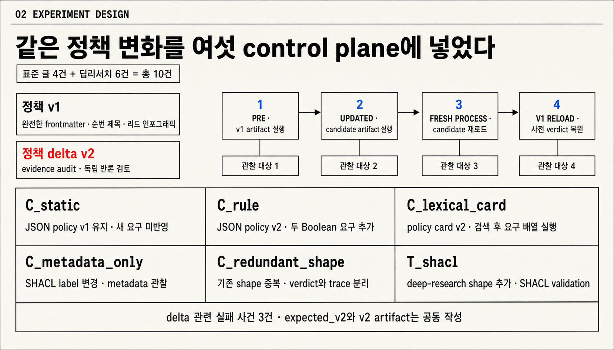
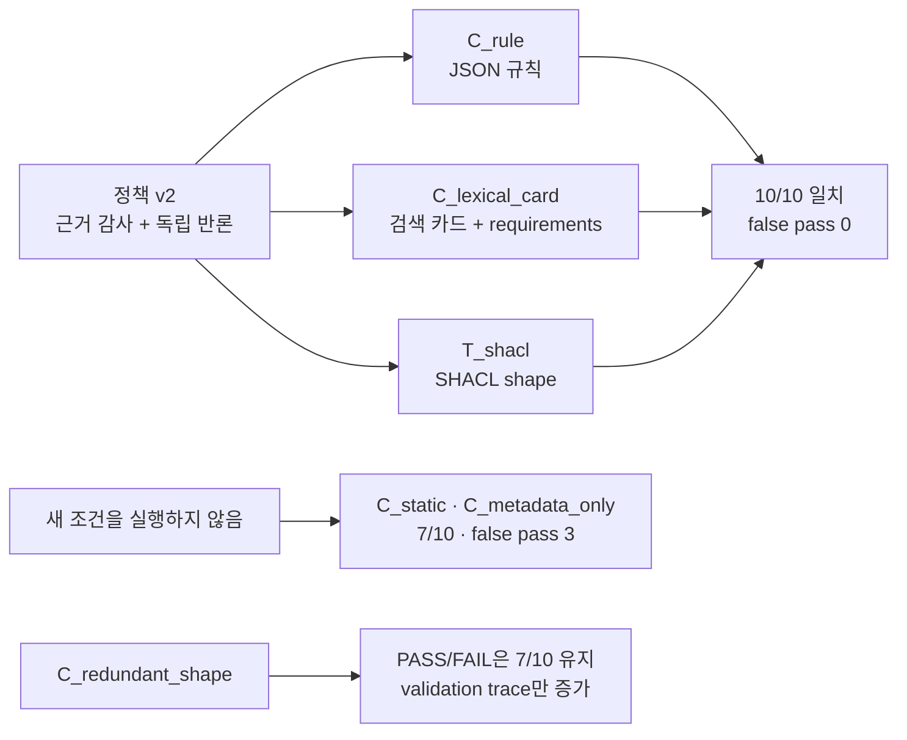
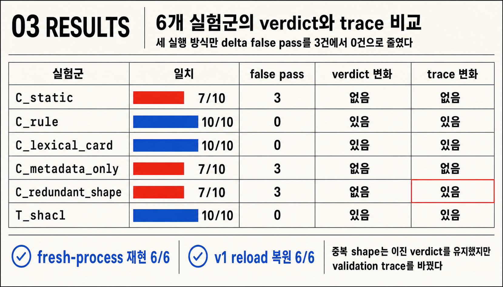
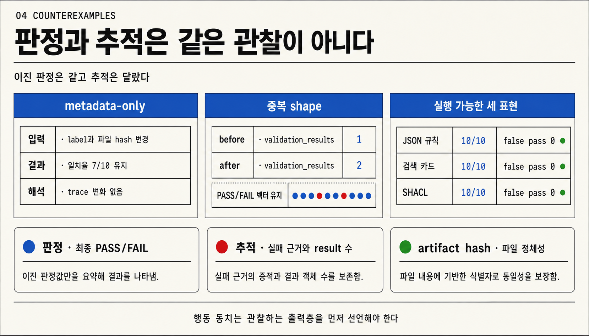

- 기준일: 2026-07-20
- 실행 범위: 합성 Quartz 발행 승인 사례 10건
- 측정 대상: 결정론적 PASS/FAIL 판정과 판정 근거

이 글은 [[notes/ontology-agent-guide|온톨로지 에이전트의 기본 구조]], [[notes/ontology-in-the-agentic-era|실행의 의미 계층]], [[notes/ontology-judge-loop-agent-validation|Judge Loop]], [[notes/ontology-emergent-agent|지속적 자기변화의 증명 조건]]을 실제 비교 실험으로 이어가는 다섯 번째 글입니다.

앞선 글에서는 온톨로지 에이전트가 무엇이고, 어떤 조건에서 행동 변화를 증명할 수 있는지 살펴봤습니다. 이번에는 방향을 조금 바꿔보겠습니다.

> 판정이 달라졌다면 정말 온톨로지 때문일까요? 같은 정책 변경을 더 단순한 규칙이나 검색 카드로도 실행할 수 있지 않을까요?

## 먼저 결론을 말한다

결론은 조금 심심할 수 있습니다. 이번 실험만으로는 온톨로지나 SHACL이 일반 규칙보다 더 낫거나 반드시 필요하다고 말하기 어렵습니다.

같은 두 가지 발행 조건을 JSON 규칙, 구조화 검색 카드, SHACL에 각각 넣어봤습니다. 그 결과 세 방식 모두 공동 작성된 기대 판정과 10/10으로 일치했습니다. 반면 새 조건을 실제로 실행하지 않은 통제군은 7/10에 머물렀습니다.

그렇다면 무엇이 판정을 바꾼 걸까요? 이번 결과만 놓고 보면 **표현 형식의 우월성**이 아니라 **실제로 실행된 요구조건**이 판정을 바꿨다고 보는 편이 맞습니다.

다만 여기서 꼭 짚고 넘어갈 점이 세 가지 있습니다.

1. 10/10은 독립 정답에 대한 정확도가 아닙니다. 기대값과 세 실행물을 같은 설계자가 만들었기 때문에, 이번 수치는 공동 작성 정책에 대한 적합성 점검입니다.
2. 최종 PASS/FAIL 판정이 같아도 판정 근거는 달라질 수 있습니다. 중복 SHACL 제약은 판정을 유지하면서 실패 근거의 개수를 늘렸습니다.
3. 새 프로세스에서 같은 파일을 다시 읽어 같은 판정을 얻었다고 해서 실제 운영 롤백까지 검증된 것은 아닙니다. 이번에 확인한 것은 결정론적 재현입니다.

## 1. 같은 정책 변경을 세 방식으로 비교한다

### 1.1 하나의 정책 변경을 세 방식으로 표현한다

먼저 비교할 정책을 단순하게 만들었습니다. 정책 v1은 모든 공개 글에 다음 세 조건을 요구합니다.

- 완전한 frontmatter
- 순번이 붙은 제목
- 본문 첫머리의 리드 인포그래픽

정책 v2에서는 딥리서치 글에 두 조건을 더했습니다.

- 근거 감사 통과
- 독립 반론 검토 완료

표준 글 4건과 딥리서치 글 6건, 총 10개의 합성 테스트 사례를 만들었습니다. 새 조건과 직접 관련된 실패 사례는 3건입니다.

기대 판정인 `expected_v2`도 이 두 조건을 기준으로 직접 작성했습니다. `policy_v2.json`, `memory_v2.json`, `ontology_v2.ttl` 역시 같은 요구를 서로 다른 형식으로 표현합니다.

그래서 이후에 나오는 7/10과 10/10을 일반적인 정확도로 읽으면 안 됩니다. 이 숫자는 **같은 정책을 각 실행물이 제대로 받아서 실행했는지**를 보여주는 값입니다.

### 1.2 여섯 실험군을 구성한다

| 실험군              | 실행물                         | 확인하려는 것                        |
| ------------------- | ------------------------------ | ------------------------------------ |
| `C_static`          | JSON policy v1 유지            | 새 요구를 반영하지 않을 때의 기준선  |
| `C_rule`            | versioned JSON policy v2       | 두 참/거짓 조건을 일반 규칙으로 실행 |
| `C_lexical_card`    | 구조화 policy card v2          | 어휘 검색 뒤 요구조건 배열을 실행    |
| `C_metadata_only`   | SHACL label만 변경             | 평가기가 읽지 않는 metadata의 영향   |
| `C_redundant_shape` | 기존 infographic shape 중복    | 최종 판정과 판정 근거의 차이         |
| `T_shacl`           | deep-research SHACL shape 추가 | 두 조건을 SHACL 검증 정책으로 실행   |

여기서 `C_lexical_card`는 흔히 떠올리는 신경망 임베딩이나 자유형 RAG가 아닙니다. 두 영문 카드에 단어 빈도 기반 코사인 유사도를 적용하고, 선택된 카드 안의 정확한 `requirements` 배열을 소비자 코드가 실행합니다.

쉽게 말하면 검색 모델이 정책을 깊이 이해했다기보다, **구조화된 payload와 실행 코드가 의미를 전달했다**고 보는 편이 정확합니다.

`C_redundant_shape`도 논리 동치나 안전한 온톨로지 교체를 증명하려는 실험은 아닙니다. 이번에는 10개 사례에서 최종 PASS/FAIL 벡터와 판정 근거가 어떻게 달라지는지만 확인했습니다. 더 강한 동치 판단을 하려면 적용 질의와 추론 목적에 맞는 별도 검사가 필요합니다.[src_005](#src-005)

### 1.3 같은 순서로 다시 실행한다

각 실험군은 다음 순서로 별도 프로세스에서 실행했습니다.

`v1 실행 → 후보 실행물 적용 → 새 프로세스에서 후보 재로드 → v1 실행물 재로드`

실험군과 관찰 결과의 관계를 한눈에 보면 다음과 같습니다.

각 사례의 최종 판정과 판정 근거, 실행물 SHA-256, 기대 판정 일치 수, 새 조건 관련 false pass를 저장했습니다. 왜 최종 판정과 판정 근거를 따로 기록했을까요? 에이전트 평가에서는 대화 기록과 실제 환경 결과를 구분해야 하고, 같은 최종 결과도 서로 다른 경로로 만들어질 수 있기 때문입니다.[src_014](#src-014)[src_015](#src-015)

> [!info] 실행 환경
> Python 3.14.3 · RDFLib 7.6.0 · pySHACL 0.40.0 · 격리된 임시 가상환경  
> 결과 SHA-256: `24f1f6d04d427531209cc9b132c3544dcbce302909561cc14f87e99dfa419afc`

## 2. 형식보다 실행된 조건이 판정을 바꾼다

| 실험군              | 공동 작성 기대값과 일치 | 새 조건 false pass | PASS/FAIL 변화 | 판정 근거 변화 | 새 프로세스 재현 | v1 재로드 복원 |
| ------------------- | ----------------------: | -----------------: | -------------- | -------------- | ---------------- | -------------- |
| `C_static`          |                    7/10 |                  3 | 없음           | 없음           | 통과             | 통과           |
| `C_rule`            |                   10/10 |                  0 | 있음           | 있음           | 통과             | 통과           |
| `C_lexical_card`    |                   10/10 |                  0 | 있음           | 있음           | 통과             | 통과           |
| `C_metadata_only`   |                    7/10 |                  3 | 없음           | 없음           | 통과             | 통과           |
| `C_redundant_shape` |                    7/10 |                  3 | 없음           | **있음**       | 통과             | 통과           |
| `T_shacl`           |                   10/10 |                  0 | 있음           | 있음           | 통과             | 통과           |

### 2.1 실제 요구조건을 실행한 세 방식만 10/10에 도달한다

`C_rule`, `C_lexical_card`, `T_shacl`은 새 조건과 관련된 false pass 3건을 모두 제거했습니다. 세 방식 모두 공동 작성된 기대 판정과 10/10으로 일치했습니다.

SHACL은 이 문제를 표현하기에 충분했습니다. 하지만 JSON 규칙과 구조화 검색 카드도 같은 판정 변화를 만들었습니다. 그러니 이번 결과를 보고 “SHACL이 더 우수하다”고 결론내리기는 어렵습니다.

이번 실험에서 SHACL은 OWL 도메인 온톨로지나 다중 홉 추론을 사용하지 않았습니다. 참/거짓 제약을 표현하는 검증 정책 언어로 동작했습니다. 이 정도 문제라면 다른 규칙 형식도 충분히 같은 일을 할 수 있었던 셈입니다.

### 2.2 파일 변경만으로 판정이 바뀌지는 않는다

`C_metadata_only`는 label과 파일 hash를 바꿨습니다. 하지만 평가기는 해당 metadata를 읽어 분기하지 않았습니다. 그래서 최종 판정과 판정 근거가 그대로였습니다.

그렇다고 “metadata는 행동에 영향을 줄 수 없다”고 일반화해도 될까요? 그렇지는 않습니다. 배포 이벤트나 버전 이름, 권한 정보처럼 metadata를 실제로 읽는 실행환경은 이번 실험에 포함하지 않았습니다.

이번에 확인한 내용은 더 좁습니다. **이 평가기가 읽지 않는 변경은 이 평가기의 출력에 영향을 주지 않았습니다.**

### 2.3 최종 판정이 같아도 판정 근거는 달라진다

`C_redundant_shape`는 10개 사례의 PASS/FAIL 벡터를 그대로 유지했습니다. 그런데 인포그래픽 조건을 어긴 사례에서는 `validation_results`가 1개에서 2개로 늘었습니다.

이 경우 “행동이 같았다”고 말해도 될까요? 최종 판정만 본다면 그렇습니다. 하지만 검증 보고서를 읽는 UI나 후속 자동화까지 생각하면 이야기가 달라집니다. 이들은 실패 근거가 하나 더 생긴 변화를 관찰할 수 있습니다.

따라서 이번 결과는 **이진 판정은 같았지만 추적 정보는 달랐다**고 표현하는 편이 정확합니다.

### 2.4 재로드 성공은 운영 롤백 성공이 아니다

모든 실험군에서 같은 후보 파일을 새 프로세스가 다시 읽으면 같은 판정이 재현됐습니다. v1 파일을 다시 읽었을 때는 변경 전 판정도 재현됐습니다.

여기까지만 보면 롤백도 잘 된 것처럼 보일 수 있습니다. 하지만 이번 실험은 이미 공개된 글이나 캐시, 권한 결속, 장기 메모리, 컴파일된 실행물, 외부 API 부작용을 복원하지 않았습니다.

그래서 이번 결과가 보여주는 범위는 파일 기반 판정의 재현성까지입니다. 지속 학습이나 실제 운영 수명주기의 롤백을 입증한 것은 아닙니다.

## 3. 이 실험에서는 온톨로지가 필수는 아니다

이제 처음 질문으로 돌아가보겠습니다. 온톨로지는 정말 필요했을까요?

이번 실험에서 내릴 수 있는 가장 방어적인 결론은 다음과 같습니다.

> 같은 정책 변경을 여러 실행 방식이 같은 PASS/FAIL 벡터로 표현할 수 있었습니다. 이 단순 승인 문제에서 SHACL은 충분했지만 필수는 아니었습니다.

SHACL은 데이터 그래프가 선언된 shapes graph의 제약을 만족하는지 검사합니다. `sh:conforms=true`는 해당 검증 실행에서 위반 결과가 생성되지 않았다는 뜻입니다. 입력 사실이 현실에서 참인지, 외부 행동이 안전한지까지 보증하는 것은 아닙니다.[src_001](#src-001)[src_016](#src-016)

예를 들어 `evidenceAuditPassed=true`가 잘못 적재돼도 SHACL은 원출처를 직접 조사하지 않습니다. 실제 시스템에서는 신뢰할 수 있는 원본과 원문 hash, 작성 권한, 별도의 사실 검증이 함께 필요합니다.

구조화 검색 카드도 마찬가지입니다. 검색 자체가 정책을 이해해서 성공한 것이 아니라, 정확한 요구조건 배열과 소비자 코드가 있었기 때문에 같은 판정이 가능했습니다.

자연어 문서를 검색하고 LLM이 의미를 해석하며 충돌까지 해결하는 RAG라면 상황이 달라질까요? 그럴 수 있습니다. 대신 바꿔 말하기, 정보 누락, 프롬프트 주입 같은 조건을 별도로 시험해야 합니다.

결국 단순한 참/거짓 승인 문제에서는 더 작은 규칙이 합리적일 수 있습니다. 온톨로지는 관계 재사용, 추론, 감사, 변경 영향 분석 같은 추가 가치가 실제로 필요할 때 비교하는 편이 좋습니다.

## 4. 문헌이 보태는 경계선을 살펴본다

### 4.1 그래프의 이점은 과제에 따라 달라진다

GraphRAG는 대규모 문서 집합의 전역 요약에서 naive RAG보다 포괄성과 다양성이 좋아졌다고 보고했습니다. KG-Agent도 선택된 지식그래프 질의 benchmark에서 경쟁 방법보다 나은 성능을 보고했습니다.[src_006](#src-006)[src_007](#src-007)

그렇다면 그래프를 쓰면 언제나 더 나은 결과가 나올까요? BRINK는 그렇게 단순하게 보기 어렵다고 지적합니다. 지식이 누락된 조건에서는 KG-RAG가 모델 내부 기억에 의존할 수 있고, 평가 규칙과 실제 구현이 어긋나면 비교 결과도 흐려질 수 있습니다.[src_008](#src-008)

그래프를 사용했다는 사실과 특정 업무에서 더 나은 결정을 했다는 사실은 따로 확인해야 합니다.

### 4.2 provenance와 hash는 추적 수단이지 인과 증명은 아니다

PROV-O는 Entity, Activity, Agent와 생성·사용·파생 관계를 표현하는 어휘를 제공합니다.[src_002](#src-002) RDFC-1.0은 RDF dataset을 결정적으로 비교하고 hash나 서명에 활용할 수 있도록 돕습니다.[src_003](#src-003)

이 표준들은 어떤 버전이 어떤 활동에서 사용됐는지 추적하는 기반이 됩니다. 하지만 파일이 같다는 것, 논리적으로 같다는 것, 특정 소비자가 같은 판정을 내렸다는 것은 서로 다른 이야기입니다.

안전한 온톨로지 교체 역시 마찬가지입니다. 무엇을 같은 것으로 볼지 먼저 정하고, 사용 목적에 맞는 검증을 따로 해야 합니다.[src_004](#src-004)[src_005](#src-005)

### 4.3 지속적 symbolic repair와 롤백의 근거는 아직 좁다

ANNEAL 프리프린트는 반복 실패를 typed operator patch로 만들고, 점수화와 symbolic guardrail, canary를 거쳐 반영하는 구조를 제안합니다. 다만 근거는 operator·tool-schema 중심의 제한된 sandbox와 짧은 작업 지평에 묶여 있습니다. 평가 실행에서 실제 롤백도 관찰되지 않았습니다.[src_012](#src-012)

인접 연구인 governed capability evolution은 interface·policy·behavioral·recovery compatibility를 분리하고, 15개 seed의 post-activation drift 조건에서 79.8% 롤백 성공률을 보고했습니다.[src_013](#src-013)

두 수치를 바로 비교해도 될까요? 대상과 분모가 다르기 때문에 어렵습니다. NIST AI RMF도 반복 가능한 TEVV와 기준선 비교, 개발 조건 밖의 일반화 한계 기록을 요구합니다.[src_014](#src-014)

### 4.4 검색 메모리는 실행 경로이자 공격면이다

Zep은 시간 인식 지식그래프 메모리의 선택된 benchmark 성능을 보고했습니다. 동시에 실제 업무와 구조화 데이터를 함께 평가할 benchmark가 부족하다고 적었습니다.[src_009](#src-009)

검색 메모리가 유용한 만큼 안전할까요? AgentPoison은 장기 메모리나 RAG 지식베이스의 소수 항목을 오염해 에이전트 행동을 조종할 수 있음을 보였습니다.[src_010](#src-010)

검색 결과를 실행 의미로 사용한다면 update 권한과 provenance, 격리 정책도 함께 설계해야 합니다.

LLM이 역량 질문에서 OWL 후보를 생성할 가능성을 보인 연구도 있습니다. 하지만 공통 오류와 품질 변동 때문에 다차원 검증이 필요하다고 결론냅니다.[src_011](#src-011) 생성할 수 있다는 사실과 운영 환경에 바로 승격해도 된다는 판단은 별개입니다.

## 5. 온톨로지 비용을 지불할 조건을 묻는다

그렇다면 언제 온톨로지의 비용을 지불할 만할까요? 다음 질문에 실제 수치로 답할 수 있어야 합니다.

- 여러 도구와 에이전트가 같은 개념·관계·제약을 실제로 재사용하는가?
- 클래스와 속성, 다중 홉 관계가 늘어날 때 규칙 중복과 불일치가 줄어드는가?
- provenance와 변경 영향 분석이 감사·복구 시간을 줄이는가?
- JSON Schema, OPA, CEL, 일반 코드보다 작성·검토·운영 비용이 낮은가?

이런 이점이 보이지 않는다면 full ontology보다 작은 결정론적 규칙이 더 나은 선택일 수 있습니다.

반대로 관계 재사용과 추론, 감사 가능성이 복잡도 증가를 충분히 상쇄한다면 어떨까요? 그때는 온톨로지를 도입할 이유가 분명해집니다. 중요한 건 “온톨로지를 썼다”가 아니라 “추가 비용보다 측정 가능한 이익이 컸다”는 사실입니다.

## 6. 한계와 다음 실험을 정리한다

### 6.1 이번 결과의 한계를 분명히 한다

이번 결과를 어디까지 믿을 수 있는지 다시 정리해보겠습니다.

- 합성 테스트 사례 10건과 하나의 정책 변경만 사용했습니다.
- `expected_v2`와 세 v2 실행물을 같은 설계자가 작성해 10/10은 순환적 적합성입니다.
- `C_lexical_card`는 두 카드의 수제 어휘 검색이며 신경망 검색이나 RAG benchmark가 아닙니다.
- `C_redundant_shape`는 최종 판정만 같고 판정 근거의 개수는 달랐습니다.
- 새 프로세스와 v1 재로드는 캐시·상태·마이그레이션·외부 부작용을 포함한 운영 롤백이 아닙니다.
- SHACL 검증 정책만 시험했으며 OWL 도메인 온톨로지, 다중 홉 추론, 온톨로지 진화의 이점은 평가하지 않았습니다.
- 단일 실행 시간은 성능 비교에 사용하지 않았고, 일부 최신 근거는 프리프린트나 저자 자체 평가에 의존합니다.
- 공개 영문 연구가 중심이어서 다국어·산업별 적용성은 검증하지 않았습니다.

### 6.2 다음 실험에는 현실 조건을 더한다

다음 실험에서는 합성 환경을 조금씩 현실에 가깝게 옮겨가야 합니다.

1. 실제 저장소에서 독립 사람이 만든 gold label과 holdout을 사용합니다.
2. unknown/null, 복수 타입, 상충 정책 버전, 누락 관계를 추가합니다.[src_008](#src-008)
3. 구조화 payload가 없는 문서 RAG와 LLM 해석을 분리해 시험합니다.
4. 권한 없는 memory write와 정책 오염에 quarantine·provenance gate를 적용합니다.[src_010](#src-010)
5. 컴파일된 규칙, 캐시, 장기 메모리, 권한, 외부 부작용을 포함한 실제 롤백 훈련을 수행합니다.[src_012](#src-012)[src_013](#src-013)
6. 정확도뿐 아니라 작성 시간, 변경 영향 분석, 검토 시간, 지연시간, 장기 drift를 측정합니다.[src_004](#src-004)[src_014](#src-014)
7. 클래스 계층과 관계 추론이 실제로 필요한 과제에서 full ontology를 JSON·OPA·CEL 기준선과 비교합니다.

## 작은 기준선부터 시작한다

이번 실험은 “온톨로지 에이전트가 더 낫다”는 결론을 내리지 못했습니다. 오히려 비교 기준선이 없으면 단순한 정책 변경의 효과를 표현 형식의 효과로 잘못 해석하기 쉽다는 점을 보여줬습니다.

그래서 실무에서는 어디서 시작하면 좋을까요? 먼저 작은 결정론적 기준선을 만들고, 최종 판정과 판정 근거를 나눠서 보는 편이 좋습니다. 그다음 독립 정답과 실패 조건, 실제 운영 복원을 하나씩 추가하면서 각 실행 방식을 비교할 수 있습니다.

관계 재사용과 추론, 감사, 변경 영향에서 측정 가능한 이익이 생길 때만 full ontology의 비용을 지불해도 늦지 않습니다.

## 참고문헌

- W3C RDF Data Shapes Working Group. (2017). [Shapes Constraint Language (SHACL)](https://www.w3.org/TR/shacl/).

- W3C Provenance Working Group. (2013). [PROV-O: The PROV Ontology](https://www.w3.org/TR/prov-o/).

- W3C RDF Dataset Canonicalization and Hash Working Group. (2024). [RDF Dataset Canonicalization](https://www.w3.org/TR/rdf-canon/).

- Zablith, F. et al. (2015). [Ontology evolution: a process-centric survey](https://doi.org/10.1017/S0269888913000349). _The Knowledge Engineering Review_, 30(1), 45–75.

- Botoeva, E. et al. (2018). [Inseparability and Conservative Extensions of Description Logic Ontologies: A Survey](https://arxiv.org/abs/1804.07805).

- Edge, D. et al. (2024). [From Local to Global: A Graph RAG Approach to Query-Focused Summarization](https://arxiv.org/abs/2404.16130).

- Jiang, J. et al. (2025). [KG-Agent: An Efficient Autonomous Agent Framework for Complex Reasoning over Knowledge Graph](https://doi.org/10.18653/v1/2025.acl-long.468). ACL 2025.

- Zhou, D. et al. (2026). [What Breaks Knowledge Graph based RAG? Benchmarking and Empirical Insights into Reasoning under Incomplete Knowledge](https://doi.org/10.18653/v1/2026.eacl-long.114). EACL 2026.

- Rasmussen, P. et al. (2025). [Zep: A Temporal Knowledge Graph Architecture for Agent Memory](https://arxiv.org/abs/2501.13956).

- Chen, Z. et al. (2024). [AgentPoison: Red-teaming LLM Agents via Poisoning Memory or Knowledge Bases](https://arxiv.org/abs/2407.12784). NeurIPS 2024.

- Lippolis, A. S. et al. (2025). [Ontology Generation using Large Language Models](https://arxiv.org/abs/2503.05388).

- Hakim, S. B. et al. (2026). [ANNEAL: Adapting LLM Agents via Governed Symbolic Patch Learning](https://arxiv.org/abs/2605.16309) (v2).

- Qin, X. et al. (2026). [Governed Capability Evolution: Lifecycle-Time Compatibility Checking and Rollback for AI-Component-Based Systems, with Embodied Agents as Case Study](https://arxiv.org/abs/2604.08059) (v5).

- National Institute of Standards and Technology. (2023). [AI RMF Core: Measure](https://airc.nist.gov/airmf-resources/airmf/5-sec-core/).

- Anthropic. (2026). [Demystifying evals for AI agents](https://www.anthropic.com/engineering/demystifying-evals-for-ai-agents).

- Pareti, P., & Konstantinidis, G. (2021). [A Review of SHACL: From Data Validation to Schema Reasoning for RDF Graphs](https://arxiv.org/abs/2112.01441).
