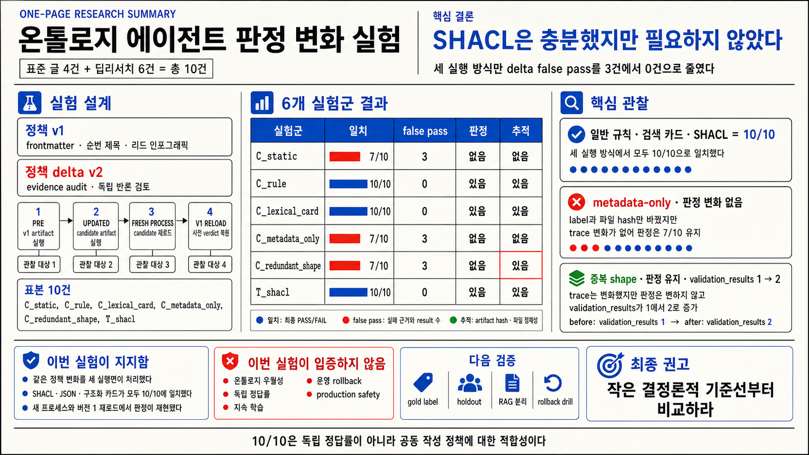

- 기준일: 2026-07-20
- 연구 모드: direct research
- 실행 범위: 합성 Quartz 발행 승인 fixture 10건, 결정론적 PASS/FAIL 적합성 점검

이 글은 [[notes/ontology-agent-guide|온톨로지 에이전트의 기본 구조]], [[notes/ontology-in-the-agentic-era|실행의 의미 계층]], [[notes/ontology-judge-loop-agent-validation|Judge Loop]], [[notes/ontology-emergent-agent|지속적 자기변화의 증명 조건]]을 실제 비교 실험으로 이어가는 다섯 번째 글이다.

## 결론부터

이번 조사와 실행만으로는 온톨로지나 SHACL이 일반 규칙 또는 검색 카드보다 우월하거나 필요하다고 결론낼 수 없다. 공동 작성한 새 발행 조건을 버전 JSON 규칙, 수제 어휘 검색으로 선택하는 구조화 정책 카드, SHACL validation policy에 각각 넣었을 때 세 방식 모두 같은 `expected_v2` PASS/FAIL 벡터에 10/10으로 일치했다. 이 정확도는 독립 정답에 대한 성능이 아니라, 같은 사람이 정한 Boolean 정책을 서로 다른 artifact에 옮긴 뒤 소비자가 그대로 실행하는지 확인한 적합성 sanity check다.

파일이 바뀌었다는 사실만으로 이진 판정이 바뀌지는 않았다. evaluator가 읽지 않는 metadata만 바꾼 SHACL과 기존 제약을 중복한 SHACL은 모두 PASS/FAIL 벡터를 유지했다. 다만 중복 shape는 실패 사례의 `validation_results` 개수를 1개에서 2개로 바꿨다. 따라서 “행동이 같았다”가 아니라 **이진 verdict는 같고 trace는 달랐다**고 말해야 한다.

각 후보 artifact를 새 subprocess에서 다시 읽었을 때 같은 verdict 벡터가 재현됐고, v1 artifact를 읽으면 사전 verdict 벡터가 재현됐다. 이것은 결정론적 파일 reload 확인이지 지속 학습, 배포 rollback, cache·migration·외부 부작용 복원이 아니다. 이번 `T_shacl`도 OWL 도메인 온톨로지나 다중 홉 추론을 시험한 것이 아니라 SHACL shapes graph를 validation-policy DSL로 사용했다.

## 1. 왜 다섯 번째 글은 비교 점검이어야 했나

앞선 네 글은 온톨로지 에이전트의 정의, 실행 의미 계층, Judge Loop, 지속적 자기변화의 판정 기준을 단계적으로 제안했다. 다음 질문은 아키텍처를 한 층 더 추가하는 것이 아니라 반가설을 거는 것이다.

> 판정이 달라졌다면 정말 온톨로지 때문인가? 같은 정책 delta를 더 단순한 규칙이나 검색 카드도 실행할 수 있지 않은가?

그래프 기반 연구는 조건부 이점을 보고한다. GraphRAG는 대규모 문서 집합의 전역 sensemaking에서 naive RAG보다 포괄성과 다양성이 좋아졌다고 보고했고, KG-Agent는 선택된 지식그래프 질의 benchmark에서 경쟁 방법을 앞섰다.[src_006](#src-006)[src_007](#src-007) 반면 BRINK는 누락 지식 조건에서 KG-RAG가 모델 내부 기억에 의존할 수 있고, 평가 규칙과 구현 불일치가 비교를 흐린다고 지적한다.[src_008](#src-008) 그래프를 사용했다는 사실과 특정 업무에서 더 나은 결정을 했다는 사실은 분리해야 한다.

온톨로지 진화 연구도 변화 감지부터 검증·승격까지를 다단계 과정으로 다루며, 안전한 교체의 의미는 사용 목적에 따라 달라진다고 정리한다.[src_004](#src-004)[src_005](#src-005) RDFC-1.0은 동형 RDF dataset에 결정적 canonical form을 제공하지만, canonical byte identity·논리 동치·특정 consumer가 관찰한 verdict 동치는 서로 다른 개념이다.[src_003](#src-003)[src_005](#src-005)

## 2. 문헌이 직접 지지하는 범위

### 2.1 SHACL은 선언된 제약의 적합성을 검사한다

SHACL validation은 data graph와 shapes graph를 입력으로 받아 validation report를 만든다. `sh:conforms=true`는 그 실행에서 validation result가 생성되지 않았다는 뜻이다. SHACL 표준과 체계적 리뷰 모두 유효성을 특정 shapes graph의 제약을 만족하는 관계로 다룬다.[src_001](#src-001)[src_016](#src-016) 이는 입력 사실이 현실에서 참이거나 외부 행동이 안전하다는 보증이 아니다.

이번 `T_shacl`의 10/10도 합성 case graph와 우리가 작성한 shapes graph가 공동 작성된 기대 verdict에 일치했다는 뜻이다. `evidenceAuditPassed=true`가 거짓으로 적재돼도 SHACL은 원출처를 스스로 조사하지 않는다. 실제 시스템에는 신뢰 루트, 원문 hash, 권한과 별도 사실 검증이 필요하다.

### 2.2 provenance와 hash는 추적 수단이다

PROV-O는 Entity, Activity, Agent와 생성·사용·파생 관계를 표현하는 어휘를 제공한다.[src_002](#src-002) RDFC-1.0은 RDF dataset의 결정적 비교·hash·서명을 돕는다.[src_003](#src-003) 두 표준은 어떤 version이 어떤 활동에서 쓰였는지 결속하는 기반이지만, 변경의 유일한 인과나 운영 rollback 성공을 자동 증명하지 않는다.

### 2.3 지속적 symbolic repair의 근거는 아직 좁다

ANNEAL 프리프린트는 반복 실패를 typed operator patch로 만들고 scoring, symbolic guardrail, canary 뒤에 commit하는 구조를 제안한다. 저자들은 평가한 반복 고장 조건에서 holdout target failure 제거를 보고하지만, 근거는 operator·tool-schema 중심 sandbox와 최대 15-task horizon에 묶여 있고 평가 run에서 실제 rollback은 관찰되지 않았다.[src_012](#src-012)

인접한 governed capability evolution 프리프린트는 interface·policy·behavioral·recovery compatibility를 분리하고, 15개 seed의 post-activation drift 조건에서 79.8% rollback 성공률을 보고했다.[src_013](#src-013) 대상과 분모가 달라 ANNEAL 수치와 직접 비교할 수 없다. NIST AI RMF도 객관적·반복 가능한 TEVV, 기준선 비교와 개발 조건 밖 일반화 한계 기록을 요구한다.[src_014](#src-014)

### 2.4 검색 메모리는 영향 경로이자 공격면이다

Zep은 시간 인식 지식그래프 메모리의 선택된 benchmark 성능을 보고하면서 실제 business task와 구조화 데이터 결합을 평가할 benchmark가 부족하다고 적었다.[src_009](#src-009) AgentPoison은 장기 메모리나 RAG knowledge base의 소수 항목을 오염해 테스트한 에이전트 행동을 조종할 수 있음을 보였다.[src_010](#src-010) 검색 결과를 실행 의미로 쓰면 update 권한과 provenance도 함께 통제해야 한다.

LLM이 역량 질문에서 OWL 후보를 작성할 가능성을 보인 연구도 공통 오류와 품질 변동 때문에 다차원 검증이 필요하다고 결론낸다.[src_011](#src-011) 생성 가능성은 production promotion 권한이 아니다.

## 3. 실험 질문과 반가설

측정 질문은 다음처럼 좁혔다.

> 같은 Boolean 정책 delta를 서로 다른 실행 artifact에 넣었을 때, 이 합성 harness의 PASS/FAIL verdict 벡터가 어떻게 달라지는가? 같은 파일을 새 subprocess에서 다시 읽거나 v1 파일을 다시 읽으면 해당 verdict 벡터가 재현되는가?

반가설은 네 가지다.

1. 버전 JSON 규칙만으로 같은 verdict 변화를 만들 수 있다.
2. 구조화 요구조건 payload를 가진 정책 카드를 어휘 검색해도 같은 verdict 변화를 만들 수 있다.
3. SHACL metadata 또는 중복 제약만 바꿔도 이진 verdict가 달라질 수 있다.
4. 10/10 일치의 원인은 표현 형식이 아니라 세 v2 artifact와 `expected_v2`가 같은 요구조건을 공동으로 부호화했기 때문이다.

넷째 반가설은 해결된 문제가 아니라 이번 설계의 핵심 한계다. 외부 gold label이나 holdout을 두지 않았으므로 형식별 실제 업무 성능을 비교할 수 없다.

## 4. 실험 설계

### 4.1 합성 정책과 공동 작성된 정답표

정책 v1은 모든 공개 글에 완전한 frontmatter, 순번 제목, 리드 인포그래픽을 요구한다. v2는 deep-research 글에 evidence audit와 독립 반론 검토를 추가한다. 표준 글 4건과 deep-research 글 6건, 총 10개 fixture를 만들었고 delta에 직접 관련된 실패 사건은 3건이다.

`expected_v2`는 이 두 새 요구조건에서 직접 작성했다. `policy_v2.json`, `memory_v2.json`, `ontology_v2.ttl`도 같은 요구를 표현한다. 그러므로 7/10과 10/10은 독립 정답률이 아니라 author-defined policy에 대한 conformance다.

### 4.2 여섯 실험군

| 실험군              | 후보 artifact                  | 관찰 대상                              |
| ------------------- | ------------------------------ | -------------------------------------- |
| `C_static`          | JSON policy v1 유지            | 새 요구를 반영하지 않음                |
| `C_rule`            | versioned JSON policy v2       | 두 Boolean 요구 추가                   |
| `C_lexical_card`    | 구조화 policy card v2          | 수제 어휘 검색 후 요구 배열 실행       |
| `C_metadata_only`   | SHACL label만 변경             | evaluator가 읽지 않는 metadata         |
| `C_redundant_shape` | 기존 infographic shape 중복    | verdict와 trace 차이 분리              |
| `T_shacl`           | deep-research SHACL shape 추가 | SHACL validation policy로 두 요구 실행 |

`C_lexical_card`는 neural embedding, vector DB 또는 자유형 RAG가 아니다. 두 영문 카드에 term-frequency cosine을 적용하고 선택된 카드의 정확한 `requirements` 배열을 consumer code가 실행한다. 검색 자체보다 구조화 payload와 소비자 코드가 의미를 운반한다.

`C_redundant_shape`는 논리 동치나 query inseparability를 증명하지 않는다. 단지 이 10개 fixture에서 PASS/FAIL 벡터를 비교한다. 온톨로지의 conservative extension과 안전한 교체는 적용 질의·추론 목적에 따라 더 강한 시험이 필요하다.[src_005](#src-005)

### 4.3 절차와 실행 결속

각 군마다 `pre(v1) → updated(candidate) → fresh-process reload(candidate) → v1-artifact reload`를 별도 subprocess로 실행했다. 사건별 verdict·trace, artifact SHA-256, 정확도, delta 관련 false pass를 저장했다. fresh-process reload는 같은 파일을 다시 읽는 결정론 검사이고, v1 reload는 파일 기반 verdict 복원 검사다. 지속 메모리, cache, migration, 배포 상태 또는 외부 부작용은 없다.

실행 영수증은 runner, 실제 결정을 수행하는 `runtime_probe.py`, cases, requirements, 두 JSON policy, 두 policy-card memory, 네 TTL과 결과 파일의 SHA-256을 결속한다. 에이전트 평가에서 transcript와 environment outcome을 구분하라는 방법론에 맞춰 verdict와 trace를 따로 기록했다.[src_014](#src-014)[src_015](#src-015)

- Python 3.14.3
- RDFLib 7.6.0
- pySHACL 0.40.0
- 격리된 임시 virtual environment
- 결과 SHA-256: `24f1f6d04d427531209cc9b132c3544dcbce302909561cc14f87e99dfa419afc`

## 5. 결과

| 실험군              | 공동 작성 정답과 일치 | delta false pass | PASS/FAIL 변화 | trace 변화 | fresh-process 재현 | v1 reload 복원 |
| ------------------- | --------------------: | ---------------: | -------------- | ---------- | ------------------ | -------------- |
| `C_static`          |                  7/10 |                3 | 없음           | 없음       | 통과               | 통과           |
| `C_rule`            |                 10/10 |                0 | 있음           | 있음       | 통과               | 통과           |
| `C_lexical_card`    |                 10/10 |                0 | 있음           | 있음       | 통과               | 통과           |
| `C_metadata_only`   |                  7/10 |                3 | 없음           | 없음       | 통과               | 통과           |
| `C_redundant_shape` |                  7/10 |                3 | 없음           | **있음**   | 통과               | 통과           |
| `T_shacl`           |                 10/10 |                0 | 있음           | 있음       | 통과               | 통과           |

### 5.1 metadata-only 변경은 이 구현에서 관찰되지 않았다

`C_metadata_only`는 label과 파일 hash를 바꿨지만 evaluator는 metadata나 hash에 분기하지 않는다. 그래서 verdict와 trace가 바뀌지 않은 것은 예상된 결과다. 이 관찰은 일반적으로 “metadata나 배포 event가 행동에 영향을 줄 수 없다”는 반증이 아니다. 그런 신호를 읽는 runtime은 이번에 시험하지 않았다.

### 5.2 중복 shape는 verdict를 유지했지만 trace를 바꿨다

`C_redundant_shape`는 10건의 PASS/FAIL 벡터를 유지했지만, infographic 요구를 어긴 사례에서 `validation_results`가 1개에서 2개로 늘었다. 따라서 validation report를 소비하는 downstream UI나 자동화는 binary verdict가 같아도 변화를 관찰할 수 있다. 이번 결과가 지지하는 동치는 오직 fixture 수준의 이진 verdict 동치다.

### 5.3 세 표현은 같은 정책 delta를 실행했다

`C_rule`, `C_lexical_card`, `T_shacl`은 세 delta false pass를 제거해 공동 작성된 기대 벡터와 10/10 일치했다. 이는 SHACL이 충분한 표현임을 보이지만 필요조건이나 우월성을 보이지 않는다. SHACL군도 full ontology, class hierarchy, 다중 홉 추론, ontology evolution tooling을 사용하지 않았다. 이 문제에서는 SHACL이 JSON 또는 다른 policy DSL처럼 Boolean 제약을 표현했다.

### 5.4 reload는 운영 rollback이 아니다

모든 군에서 같은 candidate를 새 subprocess가 다시 읽으면 verdict가 재현됐고, v1 artifact를 읽으면 pre verdict가 재현됐다. 이미 공개한 글, cache, 권한 binding, 장기 메모리, compiled artifact, 외부 API 부작용은 복원하지 않았다. 따라서 durable learning이나 production lifecycle rollback이라는 표현은 사용할 수 없다.

## 6. 무엇을 결론낼 수 있는가

가장 방어적인 결론은 **같은 policy delta를 여러 control plane이 같은 PASS/FAIL 벡터로 표현할 수 있었다**는 것이다. 이번 문제에서 SHACL은 충분했지만 필요하지 않았고, JSON rule과 구조화 검색 카드도 충분했다. “실행 가능한 versioned contract가 필요하다”는 표현도 일반 법칙이 아니라 이 파일 기반 harness의 설계 선택으로 한정해야 한다.

온톨로지의 추가 가치는 다음과 같은 별도 시험에서 입증해야 한다.

- 여러 tool·agent가 같은 개념·관계·제약을 재사용하는가?
- class·property와 다중 홉 관계가 늘 때 규칙 중복이 줄어드는가?
- 변경 영향과 provenance가 감사·복구 시간을 줄이는가?
- JSON Schema, OPA, CEL 또는 일반 코드보다 유지보수·오류 비용이 낮은가?

이 이점이 관찰되지 않는 단순 Boolean 승인 문제에서는 더 작은 규칙이 합리적일 수 있다.

`C_lexical_card`의 성공도 검색 모델의 이해가 아니라 정확한 구조화 payload와 consumer code에 의존했다. 자연어 문서 검색·LLM 해석·충돌 해결을 포함하는 RAG는 다른 시스템이며, paraphrase·누락·prompt injection 조건에서 따로 평가해야 한다. 검증되지 않은 memory write가 지속 공격면이 될 수 있다는 AgentPoison의 결과도 이 분리를 뒷받침한다.[src_010](#src-010)

## 7. 다음 실험

1. 실제 저장소에서 독립 사람이 만든 gold label과 holdout을 사용한다.
2. unknown/null, 복수 타입, 상충 policy version과 누락 relation을 추가한다.[src_008](#src-008)
3. structured payload 없는 문서 RAG와 LLM 해석을 분리해 시험한다.
4. 권한 없는 memory write와 정책 오염에 quarantine·provenance gate를 건다.[src_010](#src-010)
5. compiled rule, cache, memory, 권한과 외부 side effect를 포함한 rollback drill을 한다.[src_012](#src-012)[src_013](#src-013)
6. 정확도 외 authoring time, 변경 영향 분석, review time, latency와 장기 drift를 측정한다.[src_004](#src-004)[src_014](#src-014)
7. full ontology의 class hierarchy·관계 추론이 실제로 필요한 과제를 JSON/OPA/CEL baseline과 비교한다.

## 8. 최종 해석

이번 실험은 “온톨로지 에이전트가 더 낫다”를 입증하지 않았다. 오히려 비교 baseline이 없으면 단순 policy delta의 효과를 표현 형식의 효과로 오인하기 쉽다는 점을 드러냈다.

실무에서는 작은 결정론적 baseline부터 만들고 verdict와 trace를 분리한다. 그 뒤 독립 정답, 실패 조건과 실제 운영 복원을 넣어 각 control plane을 비교한다. 관계 재사용·추론·감사·변경 영향에서 측정 가능한 이익이 생길 때만 full ontology의 비용을 지불하는 것이 안전하다.

## 불확실성과 한계

- 합성 fixture 10건과 하나의 정책 delta만 사용했다.
- `expected_v2`와 세 v2 artifact를 같은 설계자가 작성해 10/10은 순환적 conformance다.
- `C_lexical_card`는 두 카드의 수제 어휘 cosine 검색이며 neural retrieval이나 RAG benchmark가 아니다.
- `C_redundant_shape`는 binary verdict만 같고 validation trace cardinality는 달랐다.
- fresh-process와 v1 reload는 durable learning, cache·state·migration·외부 부작용 rollback이 아니다.
- SHACL validation policy만 시험했으며 OWL domain ontology, 다중 홉 추론과 ontology evolution benefit은 평가하지 않았다.
- 단일 실행의 elapsed time은 성능 비교에 사용하지 않았다.
- 최신 ANNEAL·Zep·governed capability 자료는 프리프린트 또는 저자 자체 평가가 중심이다.
- 공개 영문 연구 중심이라 다국어·산업별 적용성을 평가하지 않았다.

## 참고문헌

- W3C RDF Data Shapes Working Group. (2017). [Shapes Constraint Language (SHACL)](https://www.w3.org/TR/shacl/).

- W3C Provenance Working Group. (2013). [PROV-O: The PROV Ontology](https://www.w3.org/TR/prov-o/).

- W3C RDF Dataset Canonicalization and Hash Working Group. (2024). [RDF Dataset Canonicalization](https://www.w3.org/TR/rdf-canon/).

- Zablith, F. et al. (2015). [Ontology evolution: a process-centric survey](https://doi.org/10.1017/S0269888913000349). _The Knowledge Engineering Review_, 30(1), 45–75.

- Botoeva, E. et al. (2018). [Inseparability and Conservative Extensions of Description Logic Ontologies: A Survey](https://arxiv.org/abs/1804.07805).

- Edge, D. et al. (2024). [From Local to Global: A Graph RAG Approach to Query-Focused Summarization](https://arxiv.org/abs/2404.16130).

- Jiang, J. et al. (2025). [KG-Agent: An Efficient Autonomous Agent Framework for Complex Reasoning over Knowledge Graph](https://doi.org/10.18653/v1/2025.acl-long.468). ACL 2025.

- Zhou, D. et al. (2026). [What Breaks Knowledge Graph based RAG? Benchmarking and Empirical Insights into Reasoning under Incomplete Knowledge](https://doi.org/10.18653/v1/2026.eacl-long.114). EACL 2026.

- Rasmussen, P. et al. (2025). [Zep: A Temporal Knowledge Graph Architecture for Agent Memory](https://arxiv.org/abs/2501.13956).

- Chen, Z. et al. (2024). [AgentPoison: Red-teaming LLM Agents via Poisoning Memory or Knowledge Bases](https://arxiv.org/abs/2407.12784). NeurIPS 2024.

- Lippolis, A. S. et al. (2025). [Ontology Generation using Large Language Models](https://arxiv.org/abs/2503.05388).

- Hakim, S. B. et al. (2026). [ANNEAL: Adapting LLM Agents via Governed Symbolic Patch Learning](https://arxiv.org/abs/2605.16309) (v2).

- Qin, X. et al. (2026). [Governed Capability Evolution: Lifecycle-Time Compatibility Checking and Rollback for AI-Component-Based Systems, with Embodied Agents as Case Study](https://arxiv.org/abs/2604.08059) (v5).

- National Institute of Standards and Technology. (2023). [AI RMF Core: Measure](https://airc.nist.gov/airmf-resources/airmf/5-sec-core/).

- Anthropic. (2026). [Demystifying evals for AI agents](https://www.anthropic.com/engineering/demystifying-evals-for-ai-agents).

- Pareti, P., & Konstantinidis, G. (2021). [A Review of SHACL: From Data Validation to Schema Reasoning for RDF Graphs](https://arxiv.org/abs/2112.01441).
