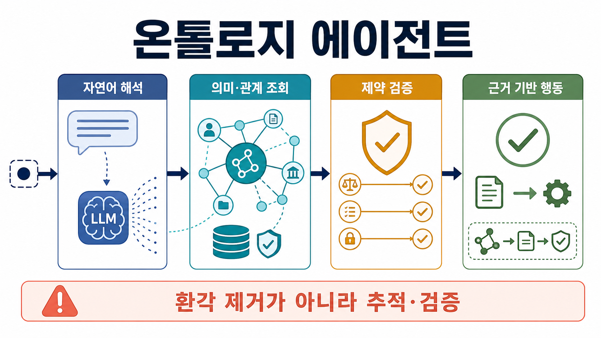
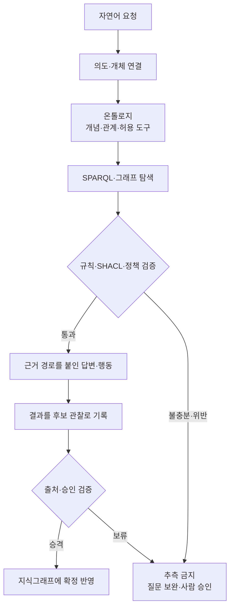

## 핵심 결론

온톨로지 에이전트는 새로운 종류의 언어모델이 아니다. 이 글에서는 **도메인의 개념·관계·제약을 명시한 온톨로지와 그 인스턴스인 지식그래프를 조회하고, 그 결과를 근거로 계획·검증·행동하는 에이전트**라고 정의한다. 자연어의 유연함은 LLM이 맡고, “무엇이 무엇이며 어떤 관계와 규칙이 허용되는가”는 온톨로지가 맡는 하이브리드 구조다.

이 구조의 장점은 관계 중심 질문, 다단계 탐색, 데이터 통합, 근거 경로와 정책 검증이다. 그러나 온톨로지가 있다고 사실이 자동으로 참이 되거나 환각이 사라지는 것은 아니다. 잘못된 스키마와 오래된 데이터는 오히려 오류를 체계적으로 전파한다. 그래서 좋은 도입 기준은 “AI를 더 똑똑하게 보이게 하는가”가 아니라 **반복되는 중요 질문을 더 정확하고 추적 가능하게 답하게 하는가**다.

이 글은 온톨로지 기반 에이전트의 개념과 구현 구조를 한 번에 이해할 수 있도록 정리한 첫 번째 발행글이다. 이후 연구 흐름은 [[notes/ontology-in-the-agentic-era|2. LLM 에이전트 시대의 온톨로지]]로 이어진다.

## 먼저 용어를 분리하자

### 온톨로지

Gruber는 온톨로지를 공유 도메인을 표현하기 위한 어휘의 명세로 설명했고, Stanford의 실무 가이드는 이를 도메인의 용어와 그 관계에 대한 명시적 형식 명세로 다룬다. OWL 2는 클래스, 속성, 개체와 논리적 공리를 기계가 해석할 수 있도록 표준화한다. 즉 온톨로지는 단순 태그 목록이 아니라 **공유 의미의 계약**이다.[src_001](#src-001)[src_002](#src-002)[src_003](#src-003)

예를 들어 제조 도메인에서 `설비`, `고장`, `정비조치`라는 클래스와 `고장이 설비에 영향을 준다`, `고장에는 정비조치가 필요하다`라는 관계를 정의할 수 있다. 여기에 실제 프레스 7호기와 7월 19일 베어링 고장을 넣으면 지식그래프가 된다.

### 지식그래프

온톨로지가 “어떤 종류의 것이 존재하고 어떻게 연결될 수 있는가”라는 스키마라면, 지식그래프는 “실제로 어떤 개체와 사실이 있는가”라는 데이터다. 둘은 자주 함께 쓰이지만 동의어는 아니다. 스키마가 약한 속성 그래프도 지식그래프로 불리고, 온톨로지만 있고 실제 개체가 거의 없을 수도 있다.

### 에이전트

에이전트는 목표를 달성하기 위해 모델이 자신의 과정과 도구 사용을 동적으로 지시하는 시스템으로 볼 수 있다. ReAct는 추론과 외부 행동을 번갈아 수행하며 관찰을 다음 계획에 반영하는 전형적인 루프를 보여준다.[src_006](#src-006)[src_007](#src-007)

따라서 온톨로지 에이전트는 다음 루프를 돈다.

1. 사용자의 자연어 요청에서 의도와 도메인 개체를 찾는다.
2. 온톨로지를 읽어 허용된 개념, 관계, 도구와 제약을 확인한다.
3. SPARQL 같은 질의나 그래프 탐색으로 필요한 사실과 경로를 찾는다.
4. 규칙 추론과 SHACL 검증으로 후보 답변 또는 행동이 스키마·정책에 맞는지 확인한다.
5. 출처와 판단 경로를 붙여 답하거나, 승인된 도구를 실행한다.
6. 결과와 출처를 새로운 관찰로 기록하되, 검증 전 생성 내용을 확정 사실로 승격하지 않는다.

이 역할 분담을 실행 흐름으로 펼치면 다음과 같다.

## 같은 이름 아래 두 가지가 있다

최근의 AgentO처럼 **에이전트 시스템 자체를 기술하는 온톨로지**도 있다. 어떤 모델, 도구, 메시지, 역할이 워크플로에 포함되는지를 RDF/OWL로 표현하는 방식이다.[src_015](#src-015) 반면 이 글의 중심은 **온톨로지를 런타임 지식과 제약 계층으로 사용하는 에이전트**다. 전자는 시스템 관찰·상호운용에, 후자는 도메인 추론·행동 통제에 초점이 있다. 한 시스템이 두 역할을 모두 사용할 수도 있지만, 둘을 섞으면 기대효과를 잘못 설명하기 쉽다.

또한 “온톨로지 에이전트”는 2026년 7월 현재 하나의 국제 표준으로 고정된 명칭이 아니다. 그러므로 도입 문서에는 이름보다 **온톨로지가 검색, 추론, 검증, 메모리, 도구 선택 중 어디에 실제로 쓰이는지**를 적어야 한다.

## 일반 RAG와 무엇이 다른가

일반 벡터 RAG는 질문과 의미상 가까운 문서 조각을 찾아 프롬프트에 넣는 데 강하다. 온톨로지 기반 접근은 명시된 개체·관계·제약을 따라 찾는 데 강하다.

| 질문                                             | 벡터 RAG가 잘하는 것           | 온톨로지 에이전트가 잘하는 것          |
| ------------------------------------------------ | ------------------------------ | -------------------------------------- |
| “베어링 고장 보고서를 요약해줘”                  | 관련 문서 검색과 서술 요약     | 필요하면 용어 정규화와 출처 연결       |
| “이 고장에 영향받는 설비와 필수 조치는?”         | 문서에 한 문장으로 있으면 검색 | `고장 → 설비`, `고장 → 조치` 관계 탐색 |
| “권한 없는 사용자가 이 조치를 실행해도 되나?”    | 정책 문구 검색                 | 역할·권한·행동 제약 검증               |
| “A의 공급업체가 납품한 부품을 쓴 설비의 사고는?” | 여러 조각 검색 후 모델이 결합  | 여러 홉의 명시적 경로 질의             |

실전에서는 경쟁 관계가 아니라 혼합 관계다. 문서에서 후보 사실을 찾을 때는 벡터 검색이 유용하고, 개체 정규화·관계 탐색·정책 검증에는 그래프가 유용하다. LLM은 질문을 질의로 바꾸고 결과를 설명하되, 그래프에 없는 사실을 채워 넣는 권한까지 가져서는 안 된다.

## 주요 특징

### 1. 명시적 의미와 타입

`고객`, `계약`, `위험`, `승인`의 뜻과 관계 범위를 코드 밖에서 공유할 수 있다. OWL 2는 표현력과 계산 특성이 다른 프로필을 제공하므로, 모든 논리를 가장 복잡한 형태로 만들 필요도 없다.[src_003](#src-003)

### 2. 관계 경로를 따라가는 검색

Think-on-Graph와 KG-Agent는 LLM이 그래프의 개체와 관계를 반복적으로 선택하며 복잡한 질문을 풀도록 설계됐다. 이 연구들은 특정 벤치마크에서 그래프 탐색의 효율과 추적 가능성을 보여주지만, 결과를 모든 업무로 일반화해서는 안 된다.[src_009](#src-009)[src_010](#src-010)

### 3. 추론과 검증의 분리

OWL 추론은 명시되지 않은 분류나 관계를 논리적으로 도출하는 데 쓰인다. SHACL은 데이터가 필수 필드, 타입, 개수, 값 범위 같은 제약을 만족하는지 검사한다. “추론할 수 있다”와 “업무 데이터가 유효하다”는 다른 문제이므로 두 계층을 분리하는 것이 안전하다.[src_004](#src-004)[src_003](#src-003)

### 4. 출처가 붙은 기억

에이전트 메모리를 단순 텍스트로 누적하지 않고 `누가`, `무엇에서`, `언제`, `어떻게 생성했는가`를 함께 저장할 수 있다. W3C PROV-O는 개체, 활동, 행위자 사이의 provenance를 표현하는 표준 어휘를 제공한다.[src_014](#src-014)

### 5. 자연어와 기호 추론의 결합

LLM은 동의어, 생략, 모호한 표현을 처리하고, 온톨로지는 허용된 개념과 관계로 해석 범위를 좁힌다. 역할 분담이 핵심이며 어느 한쪽이 다른 쪽의 오류를 자동으로 없애 주지는 않는다.

## 장점

### 설명 가능성과 감사 가능성

답변에 사용한 개체, 관계 경로, 규칙, 원문 출처를 기록할 수 있다. “모델이 그렇게 말했다”보다 조사와 수정이 쉽다. 단, 설명 경로가 있다는 사실은 그 경로의 전제가 참이라는 보증이 아니다.

### 여러 데이터 소스의 의미 통합

부서마다 다른 이름을 같은 개념에 매핑하고, 동일 개체를 공통 식별자로 연결할 수 있다. 검색 색인만 합치는 것보다 의미 충돌을 드러내기 쉽다.

### 다단계·관계형 질문

문서 유사도만으로 놓치기 쉬운 공급망, 조직, 의존성, 규제, 장애 전파 같은 연결 질문에 적합하다. Think-on-Graph와 KG-Agent의 실험은 이 가능성을 뒷받침한다.[src_009](#src-009)[src_010](#src-010)

### 답변 전 데이터·정책 검사

SHACL로 누락, 잘못된 타입, 범위를 벗어난 값과 금지된 조합을 차단할 수 있다. 실행 에이전트에서는 이 계층을 도구 호출 전의 정책 게이트로 확장할 수 있다.[src_004](#src-004)[src_005](#src-005)

### 모델과 지식의 분리

도메인 사실을 모델 가중치에만 묻어 두지 않고 외부에서 갱신·검토할 수 있다. KG-증강 LLM 연구 리뷰는 환각 완화의 가능성을 보고하지만, 여전히 평가와 통합의 난제를 함께 지적한다.[src_008](#src-008)[src_009](#src-009)

## 단점과 실패 조건

### 초기 모델링과 지속 유지비

도메인 전문가와 지식 엔지니어가 경계를 합의해야 한다. 온톨로지 개발은 한 번 끝나는 설계가 아니라 반복 과정이다. 질문이나 데이터가 바뀌면 클래스·관계·매핑·테스트도 바뀐다. 온톨로지 진화에 관한 과정 중심 조사도 도메인과 정보시스템 요구의 변화에 대응하는 일을 여러 단계의 지속적 과정으로 다룬다. 공개 연구만으로 조직별 비용을 하나의 숫자로 제시할 수는 없지만, 이 과정이 별도 운영 역량을 요구한다는 점은 분명하다.[src_002](#src-002)[src_011](#src-011)[src_016](#src-016)

### 잘못된 구조가 오류를 확대

빠진 관계는 검색되지 않고, 잘못된 동일성 연결은 멀리 있는 사실까지 오염시킨다. 그래프는 모델의 추측을 줄이는 도구일 수 있지만, 그래프 자체의 편향·누락·오래된 상태를 고치지는 않는다. 따라서 “KG가 환각을 없앤다”가 아니라 “검증 가능한 외부 근거와 제약을 제공한다”로 표현해야 한다.[src_008](#src-008)[src_004](#src-004)

### 열린 세계와 업무 검증의 충돌

OWL 계열 추론에서는 기록이 없다는 사실을 곧바로 거짓으로 보지 않는 열린 세계 관점이 일반적이다. W3C OWL 2 Primer는 데이터베이스에서 누락된 사실을 보통 거짓으로 취급하는 방식과 달리, OWL 문서의 누락은 아직 알 수 없는 사실일 수 있다고 설명한다. 그러나 업무에서는 “승인 기록이 없으면 실행 금지” 같은 닫힌 세계 검사가 필요하다. 이 간극은 SHACL, 명시적 부정·상태, 애플리케이션 정책으로 메워야 한다.[src_018](#src-018)[src_004](#src-004)

### 계산 복잡성과 지연

표현력이 높은 논리, 큰 그래프의 다중 홉 탐색, 매 턴의 검증은 지연과 비용을 늘린다. 필요한 질문에 맞춰 OWL 프로필, 추론 범위, 그래프 서브셋과 캐시를 제한해야 한다. 가장 복잡한 온톨로지가 가장 좋은 온톨로지는 아니다.

### 자연어-질의 변환 오류

LLM이 잘못된 클래스나 관계를 선택하면 문법적으로 유효한 SPARQL도 엉뚱한 답을 낼 수 있다. 허용된 질의 템플릿, 읽기 전용 권한, 결과의 타입 검사, 실패 시 명확한 질문 되묻기가 필요하다.

### 보안과 권한

지식그래프의 민감한 관계는 조직 구조나 개인 연결을 한곳에 모을 수 있으므로 별도의 접근통제가 필요하다. 특히 에이전트가 외부 지식베이스나 장기 기억을 직접 갱신하면 오염된 데이터가 나중의 계획과 행동에 재사용될 수 있다. AgentPoison과 Agent Security Bench는 일반 LLM 에이전트의 메모리·RAG 지식베이스 오염과 도구 사용 공격을 실험적으로 보여준다.[src_021](#src-021)[src_017](#src-017) 다만 이 연구들은 모든 RDF/OWL 저장소의 침해 발생률을 측정한 것이 아니라, 에이전트가 신뢰하지 않은 정보를 기억하고 행동에 쓰는 구조의 위험을 입증한 것이다. 따라서 읽기와 쓰기를 분리하고, 쓰기는 격리된 후보 그래프와 승인 절차를 거치며, 고위험 행동은 결정론적 정책과 사람 승인 뒤에 두어야 한다.

## 어떻게 구현할까

### 1단계: 기술보다 질문을 먼저 고른다

온톨로지가 답해야 할 역량 질문(competency question)을 소수의 핵심 업무 질문부터 적는다. 이 질문은 시스템의 기능 요구사항이자 평가 케이스다. 아래 개수는 최적값이 아니라 작은 파일럿을 설명하기 위한 원칙이며, 실제 범위는 위험과 도메인 복잡도로 결정해야 한다. 예를 들면 다음과 같다.

- 현재 심각도 5인 사고가 영향을 주는 설비는 무엇인가?
- 그 사고에 요구되는 조치와 승인 역할은 무엇인가?
- 답변의 각 사실은 어느 문서와 관찰에서 왔는가?
- 필요한 사실이 없을 때 시스템은 추측하지 않고 “알 수 없음”이라고 말하는가?

역량 질문은 온톨로지의 범위를 제한하고 SPARQL 테스트로 바꿀 수 있다.[src_011](#src-011)[src_002](#src-002)

### 2단계: 최소 온톨로지를 만든다

처음부터 조직 전체를 모델링하지 않는다. 핵심 질문에 실제로 필요한 클래스·관계·제약만 먼저 만든다. 이름과 정의, domain/range, 동일성 기준, 시간 유효성, 출처를 명시한다. 기존 표준 어휘를 재사용할 수 있는지 먼저 확인한다. “작게 시작한다”는 범위 관리 원칙이지, 검증된 클래스나 관계 수의 최적값을 뜻하지 않는다.

### 3단계: 사실과 출처를 적재한다

문서·DB·API에서 개체와 관계 후보를 추출한다. LLM 추출 결과는 곧바로 확정 사실로 쓰지 않고 `후보 주장`으로 저장한다. 규칙 검증, 원문 링크, 신뢰도, 생성 시점, 승인자를 붙인 뒤 승격한다. 출처 표현에는 PROV-O를 활용할 수 있다.[src_014](#src-014)

### 4단계: 질의와 검증 도구를 분리한다

- 조회: SPARQL 또는 제한된 그래프 탐색 API
- 추론: 필요한 범위의 RDFS/OWL 규칙
- 검증: SHACL과 애플리케이션 정책
- 검색: 문서 벡터 검색 + 개체 연결
- 쓰기: 검토 큐를 거치는 별도 API

SPARQL은 RDF 그래프 질의의 표준이며, SHACL은 그래프 제약 검증의 표준이다.[src_005](#src-005)[src_004](#src-004)

### 5단계: 에이전트 루프에 연결한다

가장 작은 루프는 `질문 분류 → 개체 연결 → 허용 질의 선택 → 그래프 조회 → 제약 검증 → 근거 포함 답변`이다. 실패하면 질의를 무한 반복하지 말고, 최대 홉 수·도구 호출 수·시간 예산을 두고 사용자에게 부족한 사실을 요청한다. 에이전트 복잡성은 실제 평가가 좋아질 때만 추가한다.[src_006](#src-006)[src_007](#src-007)

### 6단계: 정답뿐 아니라 과정도 평가한다

- 역량 질문 정답률과 미응답률
- 근거 없는 주장 비율
- 올바른 개체 연결률
- 유효한 관계 경로 비율
- SHACL 위반 탐지율
- 사람에게 올바르게 넘긴 비율
- 질의 지연, 토큰·인프라 비용
- 온톨로지 변경 후 회귀 테스트 통과율

답이 맞았더라도 우연히 잘못된 경로로 도달했다면 실패로 기록한다.

## 최소 Python 구현

가벼운 실험은 RDFLib로 RDF 그래프와 SPARQL을 다루고 pySHACL로 제약을 검증할 수 있다. RDFLib의 공식 문서는 그래프를 triple 집합으로 다루고 SPARQL 질의를 실행하는 기본 흐름을 제공한다.[src_012](#src-012)[src_013](#src-013)[src_019](#src-019)

이 연구의 `artifacts/prototype/`에는 `rdflib==7.6.0`, `pyshacl==0.40.0`을 고정한 실행 예제가 있다. 2026년 7월 19일 임시 Python 가상환경에서 의존성을 새로 설치해 실행했고, `PASS: validated 1 critical incident and selected 1 grounded action`을 확인했다. 명령, 버전, 결과는 `artifacts/execution_check.json`에 기록했다. 이 스모크 테스트가 확인한 범위는 RDF 로딩, RDFS 추론을 포함한 SHACL 검증, SPARQL 질의, 한 건의 근거 기반 행동 선택뿐이다. LLM의 자연어-질의 변환, 대규모 성능, 운영 보안, 두 패키지의 모든 기능 호환성을 검증한 결과는 아니다.

프로덕션에서는 그래프 규모와 조직 환경에 따라 Apache Jena/Fuseki, GraphDB, Stardog 같은 RDF 스택이나 Neo4j 같은 속성 그래프를 선택할 수 있다. 다만 저장소를 먼저 고르지 말고, OWL 추론·SHACL·SPARQL·트랜잭션·권한·운영 규모 가운데 실제 요구사항을 먼저 고른다.

## 언제 사용하면 좋은가

다음은 점수표가 아니라 파일럿 후보를 찾기 위한 질적 질문이다. 여러 항목이 실제 문제와 맞고, 단순한 대안으로 해결되지 않을 때 작은 읽기 전용 실험을 검토할 수 있다.

- 핵심 개념과 관계가 비교적 안정적이다.
- 여러 시스템이 같은 개체를 다른 이름으로 부른다.
- 두 단계 이상의 관계를 따라야 답할 수 있다.
- 잘못된 답이나 행동의 비용이 높다.
- 왜 그런 답이 나왔는지 감사해야 한다.
- 도메인 전문가가 모델과 규칙을 검토할 수 있다.
- 동일한 중요 질문이 반복된다.

관계와 출처가 중요한 설비 정비, 공급망 영향 분석, 데이터 카탈로그, IT 구성·장애 분석, 조직 권한·정책 질의는 탐색 후보가 될 수 있다. 임상·과학 지식 탐색과 규제 준수도 구조적으로는 후보지만, 이번 조사는 해당 분야의 안전성·법적 적합성·현장 성과를 평가하지 않았다. 따라서 고위험 분야에서는 별도의 도메인 전문가 검증, 규제 검토, 데이터 보호와 실패 대응 설계 없이는 적용 권고로 읽어서는 안 된다.

반대로 단발성 요약, 자유 창작, 개념이 매주 바뀌는 탐색 단계, 데이터 소유자와 유지보수 인력이 없는 조직에서는 일반 검색·벡터 RAG·관계형 DB가 더 낫다. 에이전트가 필요 없는 결정론적 업무라면 워크플로와 규칙 엔진이 더 단순하고 안전할 수 있다.[src_006](#src-006)[src_002](#src-002)

## 추천 도입 순서

1. 가치와 위험이 분명한 소수의 핵심 질문을 고른다.
2. 작은 온톨로지와 읽기 전용 그래프를 만든다.
3. 사람 작성 SPARQL로 정답 기준을 확립한다.
4. LLM은 질문 분류와 설명에만 사용한다.
5. 자연어-질의 변환을 추가하되 템플릿과 허용 목록으로 제한한다.
6. 모든 답에 경로와 출처를 붙인다.
7. 쓰기와 행동은 검토 큐, SHACL, 권한 검사, 사람 승인을 거친다.
8. 정확도·미응답·지연·유지비가 기준선을 이길 때만 범위를 넓힌다.

## 불확실성과 남은 과제

- “온톨로지 에이전트”의 합의된 단일 정의는 없다. 이 글의 정의는 표준 온톨지와 현대 에이전트 구조를 결합한 조작적 정의다.
- 그래프 기반 방법의 벤치마크 향상은 확인되지만, 일반 기업 업무에서 벡터 RAG 대비 총소유비용 우위를 보여주는 표준 비교는 부족하다.
- 그래프가 제공하는 추적 가능성과 실제 설명 충실성은 다르다. 에이전트가 검색한 경로와 최종 문장의 각 주장을 연결하는 평가가 필요하다.
- 자동 온톨로지 생성은 초기 비용을 줄일 수 있지만, 도메인 경계와 책임을 자동으로 정당화하지 못한다.
- 유지보수와 보안의 위험 근거는 보강했지만, 조직별 발생률이나 총비용은 조사하지 못했다. 특히 메모리 오염 연구는 일반 LLM 에이전트의 장기 기억·RAG 지식베이스를 대상으로 하므로, 특정 온톨로지 저장소의 침해 확률로 해석할 수 없다.

## 결론

온톨로지 에이전트의 본질은 LLM에 지식그래프를 붙이는 것이 아니라 **의미, 사실, 제약, 출처, 행동 권한을 분리해 운영하는 것**이다. 잘 만들면 언어모델의 유연함과 형식 지식의 검증 가능성을 결합할 수 있다. 잘못 만들면 비싼 그래프 위에서 더 일관되게 틀리는 시스템이 된다.

따라서 시작점은 거대한 지식그래프가 아니다. 반복되는 중요 질문, 작은 의미 계약, 검증 가능한 데이터, 읽기 전용 에이전트다. 그 작은 시스템이 실제 기준선을 이길 때만 자율성과 범위를 늘리는 것이 가장 현실적인 사용법이다.

## 출처

-  **src_001** — Gruber, T. R. (1993). _A Translation Approach to Portable Ontology Specifications_. Knowledge Acquisition, 5(2), 199–220. [원문](https://doi.org/10.1006/knac.1993.1008)
-  **src_002** — Noy, N. F., & McGuinness, D. L. (2001). _Ontology Development 101: A Guide to Creating Your First Ontology_. Stanford University. [원문](https://protege.stanford.edu/publications/ontology_development/ontology101-noy-mcguinness.html)
-  **src_003** — W3C. (2012). _OWL 2 Web Ontology Language Document Overview (Second Edition)_. [원문](https://www.w3.org/TR/owl2-overview/)
-  **src_004** — W3C. (2017). _Shapes Constraint Language (SHACL)_. [원문](https://www.w3.org/TR/shacl/)
-  **src_005** — W3C. (2013). _SPARQL 1.1 Query Language_. [원문](https://www.w3.org/TR/sparql11-query/)
-  **src_006** — Anthropic. (2024). _Building Effective Agents_. [원문](https://www.anthropic.com/engineering/building-effective-agents)
-  **src_007** — Yao, S. et al. (2023). _ReAct: Synergizing Reasoning and Acting in Language Models_. ICLR 2023. [원문](https://react-lm.github.io/)
-  **src_008** — Agrawal, G. et al. (2024). _Can Knowledge Graphs Reduce Hallucinations in LLMs? A Survey_. NAACL 2024. [원문](https://aclanthology.org/2024.naacl-long.219/)
-  **src_009** — Lan, Y. et al. (2024). _Think-on-Graph: Deep and Responsible Reasoning of Large Language Model on Knowledge Graph_. ICLR 2024. [원문](https://proceedings.iclr.cc/paper_files/paper/2024/hash/10a6bdcabbd5a3d36b760daa295f63c1-Abstract-Conference.html)
-  **src_010** — Jiang, J. et al. (2025). _KG-Agent: An Efficient Autonomous Agent Framework for Complex Reasoning over Knowledge Graph_. ACL 2025. [원문](https://aclanthology.org/2025.acl-long.468/)
-  **src_011** — Wiśniewski, D. et al. (2019). _Analysis of Ontology Competency Questions and their Formalizations in SPARQL-OWL_. Journal of Web Semantics, 59, 100534. [원문](https://doi.org/10.1016/j.websem.2019.100534)
-  **src_012** — RDFLib Team. _Getting Started with RDFLib_. [원문](https://rdflib.readthedocs.io/en/stable/gettingstarted/)
-  **src_013** — RDFLib Team. (2026). _RDFLib 7.6.0_. PyPI. [원문](https://pypi.org/project/rdflib/)
-  **src_014** — W3C. (2013). _PROV-O: The PROV Ontology_. [원문](https://www.w3.org/TR/prov-o/)
-  **src_015** — _AgentO: An Ontology for Modeling Agentic AI Systems_. (2026). University of Vienna ePrints. [원문](https://eprints.cs.univie.ac.at/8749/)
-  **src_016** — Zablith, F. et al. (2015). _Ontology Evolution: A Process-Centric Survey_. The Knowledge Engineering Review, 30. [원문](https://doi.org/10.1017/S0269888913000349)
-  **src_017** — Zhang, H. et al. (2025). _Agent Security Bench (ASB): Formalizing and Benchmarking Attacks and Defenses in LLM-based Agents_. ICLR 2025. [원문](https://proceedings.iclr.cc/paper_files/paper/2025/file/5750f91d8fb9d5c02bd8ad2c3b44456b-Paper-Conference.pdf)
-  **src_018** — W3C. (2009). _OWL 2 Web Ontology Language Primer_. [원문](https://www.w3.org/TR/2009/REC-owl2-primer-20091027/)
-  **src_019** — Sommer, A. et al. (2026). _pySHACL 0.40.0_. PyPI. [원문](https://pypi.org/project/pyshacl/)
-  **src_021** — Chen, Z. et al. (2024). _AgentPoison: Red-teaming LLM Agents via Poisoning Memory or Knowledge Bases_. NeurIPS 2024. [원문](https://proceedings.neurips.cc/paper_files/paper/2024/hash/eb113910e9c3f6242541c1652e30dfd6-Abstract-Conference.html)
