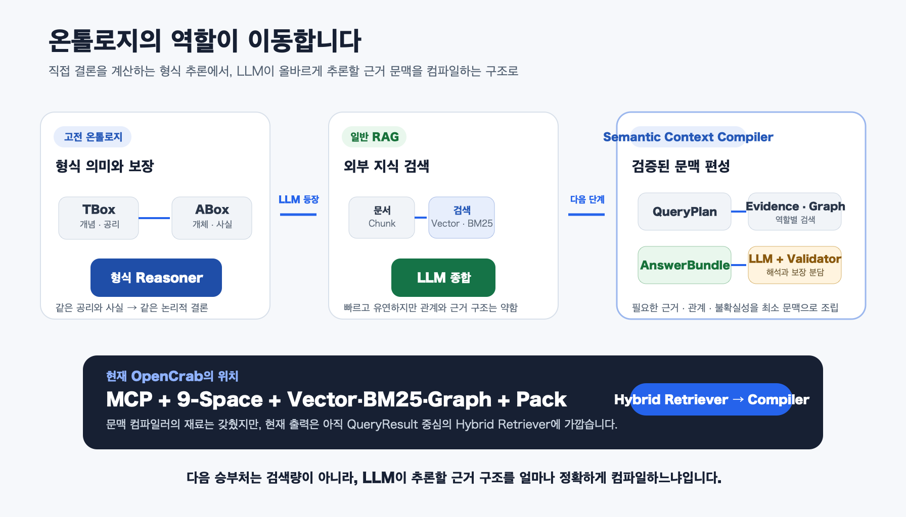
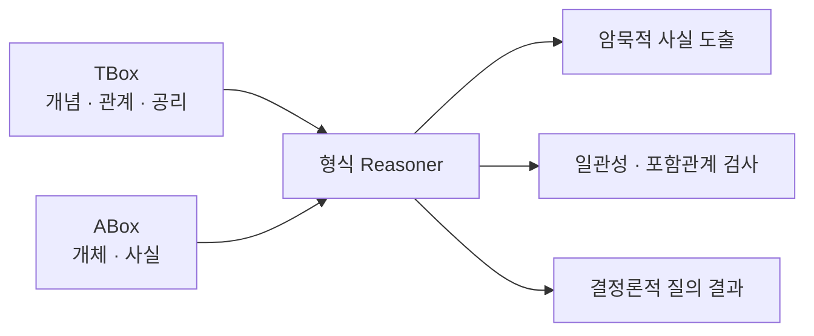
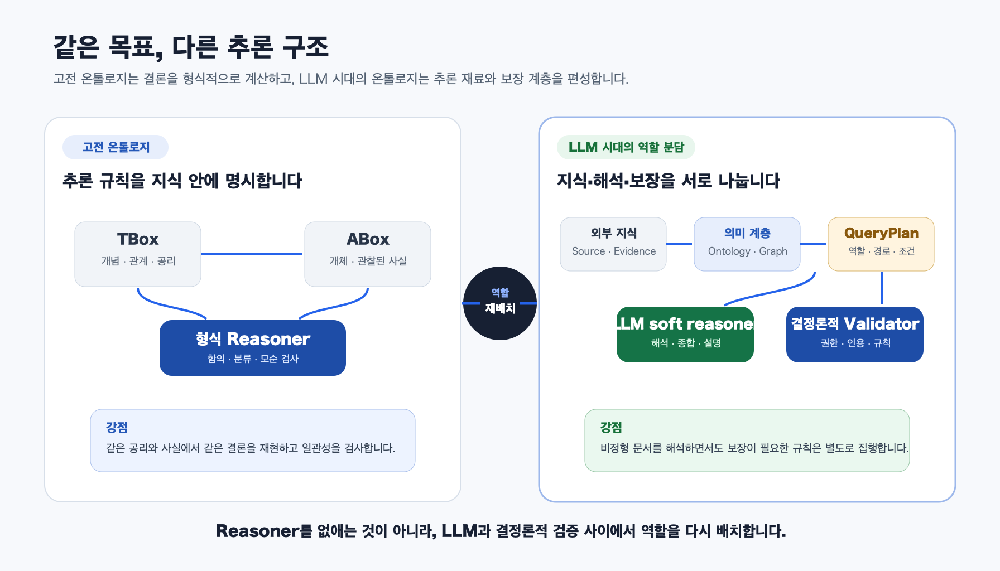
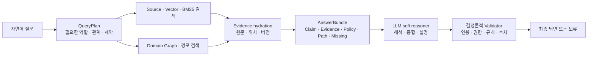
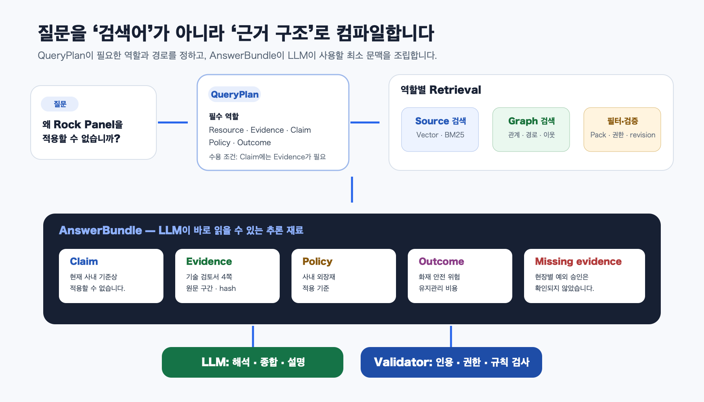
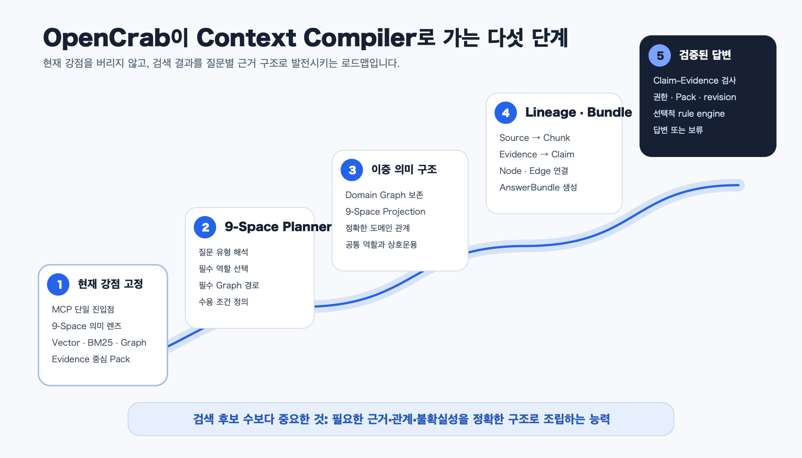

> [!summary] 결론부터
> 고전 온톨로지는 자연어를 이해하지 못하는 기계가 지식을 일관되게 사용하도록 개념·사실·공리를 형식화하고 Reasoner가 결론을 계산하게 했습니다. LLM은 자연어 해석과 유연한 종합을 상당 부분 맡을 수 있지만, 최신·비공개·전문 지식과 정확한 출처를 자동으로 갖고 있지는 않습니다. 그래서 LLM 시대의 온톨로지는 사라지기보다 **질문에 필요한 외부 지식을 근거·관계·정책 구조로 선별해 LLM에 제공하는 의미 기반 문맥 계층**으로 확장될 수 있습니다. OpenCrab은 MCP, 9-Space, Vector·BM25·Graph 검색과 Pack을 통해 이 방향으로 상당히 이동했지만, 현재는 완성된 문맥 컴파일러보다 **온톨로지 유도 Hybrid Retriever와 지식 Pack 공장**에 더 가깝습니다.

이 글은 앞선 [[notes/opencrab-ontology-build-architecture|OpenCrab 온톨로지 빌드 분석]]의 후속편입니다. 앞 글이 원문에서 Pack까지 무엇을 만드는지 살펴봤다면, 이번 글은 만들어진 지식을 **LLM Agent가 어떻게 찾아 쓰는지**, 그리고 그 방식이 고전 온톨로지와 어떻게 다른지를 살펴봅니다.

먼저 오해를 하나 피해야 합니다. 고전 온톨로지는 LLM이 없던 시절의 낡은 우회로가 아닙니다. 형식 의미론, 일관성 검사와 결정론적 추론이라는 고유한 가치를 지금도 갖고 있습니다. 반대로 LLM이 자연어를 잘 읽는다고 해서 필요한 사실을 아무렇게나 많이 넣어도 올바른 결론이 나오는 것도 아닙니다.

이 글의 핵심 질문은 둘 중 하나를 선택하는 것이 아닙니다.

> **형식 온톨로지의 의미 계약과 LLM의 유연한 추론을 어떻게 역할 분담할 것인가?**

## 1. 고전 온톨로지는 어떤 문제를 해결했는가

OWL 2는 클래스, 속성, 개체와 데이터 값을 명시하고, 형식적으로 정의된 의미를 바탕으로 지식을 다루는 언어입니다. W3C 문서는 Reasoner가 클래스 일관성, 포함 관계와 개체 검색 같은 문제를 처리할 수 있다고 설명합니다. 즉 고전 온톨로지의 핵심은 단순히 데이터를 그래프로 그리는 것이 아니라, **그래프에 기계가 계산할 수 있는 의미를 부여하는 것**입니다. ([W3C OWL 2 Overview](https://www.w3.org/TR/owl-overview/), [OWL 2 Direct Semantics](https://www.w3.org/TR/owl2-direct-semantics/))

초보자에게는 TBox와 ABox로 나누어 보면 이해하기 쉽습니다.

- **TBox**는 세상의 개념과 규칙을 정의합니다. `승인자`는 `운영자`의 하위 개념이라는 식입니다.
- **ABox**는 실제 개체와 사실을 기록합니다. `김 대리`가 `승인자`라는 식입니다.
- **Reasoner**는 두 층을 결합해 명시되지 않은 결론을 도출하거나 모순을 검사합니다.



예를 들어 다음 두 사실이 있다고 하겠습니다.

```text
모든 승인자는 운영자입니다.
김 대리는 승인자입니다.
```

사람은 `김 대리는 운영자입니다`라는 결론을 쉽게 냅니다. 고전 온톨로지는 이 과정을 자연어 감각이 아니라 공리와 형식 의미론으로 재현합니다.

### 고전 접근의 강점은 ‘설명’보다 ‘보장’에 있습니다

형식 Reasoner의 가장 큰 장점은 말솜씨가 아닙니다.

```text
같은 공리 + 같은 사실
→ 같은 논리적 결론
```

어떤 결론이 반드시 따라오는지, 클래스 정의가 서로 모순되는지, 관계의 제약을 위반했는지를 정해진 의미론으로 확인할 수 있습니다. 의료·제조·규제처럼 감사와 재현성이 중요한 분야에서 이 성질은 여전히 중요합니다.

다만 현실 문서를 이 구조로 옮기는 비용이 큽니다. 조직의 PDF, 회의록, 로그와 내부 규정에는 예외와 암묵적 문맥이 많습니다. 이를 모두 클래스·공리·관계로 형식화하고 실제 자료가 바뀔 때마다 유지하려면 상당한 전문 작업이 필요합니다.



## 2. LLM이 등장하면서 병목은 어디로 이동했는가

LLM은 이전의 규칙 엔진과 달리 자연어 문장을 읽고, 표현이 다른 여러 문서를 연결하며, 사용자의 의도에 맞게 설명할 수 있습니다.

> 이 자재는 성능 자체가 부족해서가 아니라 유지관리 위험과 사내 승인 기준 때문에 적용하지 않습니다.

이 문장을 읽은 LLM은 대상, 이유, 위험과 정책을 어느 정도 구분할 수 있습니다. 예전에는 사람이 이 내용을 개별 triple과 공리로 번역해야 했지만, 이제는 LLM이 자연어 자체에서 의미를 읽어낼 수 있습니다.

그렇다면 온톨로지는 필요 없어졌을까요? 그렇지 않습니다. 문제의 중심이 바뀌었습니다.

### LLM은 추론할 수 있지만 필요한 지식을 항상 갖고 있지는 않습니다

LLM이 답하지 못하는 이유 중 하나는 학습하지 않은 지식을 모르기 때문입니다.

- 학습 이후에 생긴 최신 정보
- 회사 내부 규정과 비공개 설계 기준
- 특정 프로젝트의 변경 이력
- 좁은 전문 분야의 문서
- 조직에서만 사용하는 약어와 예외 규칙

Retrieval-Augmented Generation은 모델의 파라미터 기억과 외부 비파라미터 기억을 결합해, 지식 갱신과 출처 제공의 어려움을 줄이려는 접근입니다. 원래 RAG 연구도 모델 내부 지식의 갱신과 provenance를 열린 문제로 지적하고 외부 검색 메모리를 결합했습니다. ([Lewis et al., 2020](https://arxiv.org/abs/2005.11401))

```text
모델이 모르는 지식
→ 외부 저장소에서 검색
→ 관련 근거를 문맥으로 제공
→ LLM이 해석하고 답변
```

이 구조는 자주 바뀌는 사실을 Fine-tuning으로 계속 다시 학습시키는 것보다 관리하기 쉬운 경우가 많습니다. 지식을 모델 파라미터와 분리하면 버전 교체, 삭제, 접근권한과 출처 추적도 다루기 쉬워집니다.

### 하지만 LLM의 약점은 지식 컷오프만이 아닙니다

`모르면 알려주면 된다`는 방향은 맞지만, **무엇을 어떻게 알려주느냐**가 더 중요합니다.

LLM은 필요한 문서가 입력에 있어도 중요한 부분을 놓칠 수 있습니다. `Lost in the Middle` 연구는 관련 정보의 위치에 따라 장문 문맥 활용 성능이 크게 달라질 수 있고, 검색 문서를 더 늘려도 읽기 성능이 그만큼 계속 좋아지지는 않는다고 보고했습니다. ([Liu et al., 2024](https://aclanthology.org/2024.tacl-1.9/))

그래서 문서를 많이 넣는 것만으로는 충분하지 않습니다.

```text
많은 Chunk
≠ 좋은 문맥

필요한 근거 + 올바른 관계 + 명시된 불확실성
= 추론하기 좋은 문맥
```

LLM은 또한 다음 실수를 할 수 있습니다.

- 관련 자료와 무관한 자료를 섞습니다.
- 원문 관찰과 모델의 해석을 혼동합니다.
- 충돌하는 주장을 하나의 확정 사실처럼 합칩니다.
- 제공된 근거에 없는 설명을 자연스럽게 추가합니다.
- 권한과 정책을 이해하더라도 반드시 집행하지는 않습니다.

따라서 LLM 시대의 온톨로지는 단순히 정보를 저장하는 분류표가 아니라, **LLM에 전달할 지식의 역할과 경계를 정하는 계층**이 되어야 합니다.

## 3. 온톨로지는 ‘문맥 컴파일러’로 어떻게 이동할 수 있는가

일반 RAG는 질문과 비슷한 문장을 찾는 데 집중합니다.

```text
질문
→ 비슷한 Chunk 검색
→ 상위 결과 전달
→ LLM 답변
```

온톨로지 기반 문맥 컴파일은 한 단계를 더 둡니다.



여기서 `컴파일`이라는 표현은 비유가 아니라 실제 설계 단계를 설명합니다.

| 컴파일러    | 의미 기반 문맥 컴파일러  |
| ----------- | ------------------------ |
| 소스 코드   | 자연어 질문              |
| 구문 분석   | 질문 의도 분석           |
| 타입 검사   | 필요한 의미 역할 선택    |
| 심벌 연결   | 개체·Claim·Evidence 연결 |
| 중간 표현   | QueryPlan                |
| 실행 산출물 | AnswerBundle             |
| 실행기      | LLM Agent                |
| 런타임 검사 | 권한·근거·형식 Validator |

### QueryPlan은 ‘무엇을 찾을지’를 먼저 정합니다

예를 들어 사용자가 다음과 같이 질문했다고 하겠습니다.

> Rock Panel을 왜 우리 회사에서 적용할 수 없습니까?

일반 검색은 `Rock Panel`, `적용 불가`, `이유`와 비슷한 자료를 찾습니다. QueryPlan은 질문을 지식의 역할로 바꿉니다.

```yaml
intent: applicability_reason
target: Rock Panel
required_roles:
  - Resource
  - Evidence
  - Claim
  - Policy
  - Outcome
optional_roles:
  - Lever
required_relations:
  - Evidence supports Claim
  - Policy constrains Resource
  - Claim predicts Outcome
acceptance:
  claim_requires_evidence: true
  policy_required: true
```

### AnswerBundle은 검색 결과를 추론 가능한 구조로 묶습니다

검색 결과를 단순 점수 순서로 나열하지 않고 다음처럼 조립합니다.

```yaml
claim:
  statement: Rock Panel은 현재 사내 기준상 적용할 수 없습니다.
evidence:
  source: 외장재 기술 검토서
  page: 4
  quote: 내화성능 및 유지관리 문제로 적용 대상에서 제외함
policy:
  - 사내 외장재 적용 기준
outcomes:
  - 화재 안전 위험
  - 유지관리 비용 증가
missing_evidence:
  - 현장별 예외 승인 자료는 확인되지 않음
```

이 구조를 받은 LLM은 관련 문서가 있다는 사실만 말하는 대신, 직접 근거와 정책을 구분하고 확인되지 않은 부분을 함께 설명할 수 있습니다.

### 온톨로지는 LLM 대신 모든 추론을 하지 않습니다

가장 현실적인 구조는 역할 분담입니다.

| LLM에 맡기기 좋은 일      | 결정론적으로 처리해야 할 일 |
| ------------------------- | --------------------------- |
| 자연어 질문 해석          | 접근권한과 tenant 격리      |
| 여러 근거의 종합과 설명   | Pack·revision 일치 검사     |
| 모호한 표현과 예외의 해석 | 필수 Evidence 존재 검사     |
| 사용자의 수준에 맞는 서술 | 상태 전환과 금지 규칙       |
| 가능한 가설과 대안 제시   | 숫자·단위 계산과 형식 제약  |

형식 Reasoner가 사라지는 것이 아니라 **보장이 필요한 작은 영역으로 집중**되고, LLM은 자연어 해석과 종합을 맡습니다.

## 구조를 직접 비교해 보기

아래 탐색기는 고전 온톨로지, 일반 RAG, 목표로 하는 문맥 컴파일러와 현재 OpenCrab의 역할 배치를 비교합니다. 막대는 측정된 성능 수치가 아니라 구조적 특징을 설명하기 위한 상대값입니다.

<iframe
  id="ontology-context-compiler-explorer-frame"
  class="interactive-visualization-frame"
  src="/attachments/ontology-context-compiler-opencrab/ontology-context-compiler-explorer.htm"
  title="고전 온톨로지, 일반 RAG, 문맥 컴파일러와 OpenCrab 구조 비교 탐색기"
  loading="lazy"
  scrolling="no"
  sandbox="allow-scripts allow-same-origin"
  style="height:940px"
></iframe>

[탐색기를 새 화면에서 크게 열기](/attachments/ontology-context-compiler-opencrab/ontology-context-compiler-explorer.htm)



## 4. OpenCrab은 이 변화에서 어디에 있는가

이제 OpenCrab을 이 큰 그림 위에 올려 보겠습니다.

> [!note] 분석 기준
> 이 글은 OpenCrab 공개 저장소의 `d34352cec9d99c755c1e891f811911461a460280` 커밋을 기준으로 읽었습니다. 저장소는 공개 LocalCrab 엔진과 Pack 계약을 포함하지만, 호스팅된 `opencrab.sh` SaaS의 비공개 구현은 포함하지 않는다고 명시합니다. ([OpenCrab README](https://github.com/AlexAI-MCP/OpenCrab/blob/d34352cec9d99c755c1e891f811911461a460280/README.md))

OpenCrab의 공식 README가 강조하는 흐름은 다음과 같습니다.

```text
원문과 크롤링 대상
→ CrabHarness 수집 계획
→ Evidence 수집과 색인
→ MetaOntology 문법 추출
→ Graph 검증
→ OpenCrab Pack ZIP
→ MCP와 생태계 배포
```

이것은 전통적인 `TBox + ABox + Reasoner` 제품이라기보다 **근거가 있는 지식 제품을 만들고 Agent에 배포하는 공장**에 가깝습니다.

### MCP는 LLM과 온톨로지 런타임 사이의 단일 진입점입니다

MCP는 서버가 모델이 호출할 수 있는 도구와 입력 schema를 노출하도록 하는 표준화된 연결 방식입니다. 모델은 도구를 발견하고 외부 시스템의 검색·연산·행동을 호출할 수 있습니다. ([MCP Tools specification](https://modelcontextprotocol.io/specification/2025-11-25/server/tools))

OpenCrab의 stdio MCP는 `ontology_query`, `ontology_manifest`, `ontology_add_node`, `ontology_add_edge`, `ontology_ingest` 같은 도구를 한 registry에서 노출합니다. Agent는 ChromaDB, Document store와 Graph store의 세부 API를 직접 알 필요가 없습니다. ([`opencrab/mcp/tools.py`](https://github.com/AlexAI-MCP/OpenCrab/blob/d34352cec9d99c755c1e891f811911461a460280/opencrab/mcp/tools.py), [`opencrab/mcp/server.py`](https://github.com/AlexAI-MCP/OpenCrab/blob/d34352cec9d99c755c1e891f811911461a460280/opencrab/mcp/server.py))

```text
Claude · Codex · 로컬 LLM
→ MCP ontology_query
→ OpenCrab 검색 계층
→ 관련 지식과 Graph 문맥
→ Agent가 최종 해석
```

이 선택은 칭찬할 만합니다. 검색 내부 구조가 바뀌어도 MCP 도구 계약을 유지하면 여러 Agent가 같은 방식으로 지식을 사용할 수 있기 때문입니다.

### 9-Space는 고전 TBox보다 질문의 의미 역할에 가깝습니다

OpenCrab의 grammar manifest는 Subject, Resource, Evidence, Concept, Claim, Community, Outcome, Lever와 Policy를 정의합니다. Evidence가 Claim을 지지하거나 반박하고, Lever가 Outcome을 조절하며, Policy가 Resource와 Subject를 통제하는 관계도 정의합니다. ([`opencrab/grammar/manifest.py`](https://github.com/AlexAI-MCP/OpenCrab/blob/d34352cec9d99c755c1e891f811911461a460280/opencrab/grammar/manifest.py))

이 구조를 고전적인 클래스 계층으로만 읽기보다, 다음 질문을 반복하는 **의미 렌즈**로 읽는 편이 더 자연스럽습니다.

- 누가 관련됩니까?
- 무엇이 대상입니까?
- 직접 근거는 무엇입니까?
- 어떤 주장을 할 수 있습니까?
- 어떤 결과와 위험이 달라집니까?
- 무엇을 조절할 수 있습니까?
- 어떤 정책이 적용됩니까?

이 지점에서 OpenCrab은 LLM 시대의 온톨로지에 가까운 방향을 이미 선택했습니다.

### HybridQuery는 Reasoner가 아니라 온톨로지 유도 검색기입니다

MCP의 `ontology_query`는 내부적으로 다음 검색 분기를 조합합니다.

```text
Vector similarity
+ BM25 keyword
+ Graph neighborhood expansion
→ RRF와 keyword cross-score 재정렬
→ ReBAC 필터
→ QueryResult 목록
```

Vector는 표현이 다른 문장을 찾고, BM25는 제품명·법규명과 정확한 용어를 찾으며, Graph는 후보 node 주변의 관계를 확장합니다. 관계·원인·영향 질문에는 후보 수와 Graph 깊이를 높이는 간단한 질의 profile도 적용합니다. ([`opencrab/ontology/query.py`](https://github.com/AlexAI-MCP/OpenCrab/blob/d34352cec9d99c755c1e891f811911461a460280/opencrab/ontology/query.py), [`opencrab/ontology/bm25.py`](https://github.com/AlexAI-MCP/OpenCrab/blob/d34352cec9d99c755c1e891f811911461a460280/opencrab/ontology/bm25.py), [`opencrab/ontology/reranker.py`](https://github.com/AlexAI-MCP/OpenCrab/blob/d34352cec9d99c755c1e891f811911461a460280/opencrab/ontology/reranker.py))

Graph를 검색 문맥으로 쓰는 방향 자체는 타당합니다. GraphRAG 연구도 일반적인 local retrieval이 놓치기 쉬운 전역적 질문을 다루기 위해 entity graph와 community summary를 사용했습니다. ([Edge et al., 2024](https://arxiv.org/abs/2404.16130))

다만 OpenCrab의 HybridQuery는 논리 공리에서 새로운 사실을 증명하지 않습니다.

```text
고전 Reasoner
공리 + 사실 → 필연적인 결론

OpenCrab HybridQuery
질문 + 색인 + Graph → 관련성이 높은 추론 재료
```

따라서 현재 OpenCrab을 OWL Reasoner의 대체품이라고 부르면 과장입니다. 더 정확한 표현은 **온톨로지 유도 Hybrid Retriever**입니다.

### Pack은 외부 지식을 모델 파라미터와 분리하는 배포 단위입니다

OpenCrab Pack 문서는 graph node·edge뿐 아니라 Evidence index, quality report, hash, sample query와 community report를 하나의 ZIP 계약으로 묶습니다. promoted node와 edge에는 evidence reference를 두고, broken edge와 graph reference integrity를 검사하는 방향을 명시합니다. ([`docs/opencrab-pack-v1.md`](https://github.com/AlexAI-MCP/OpenCrab/blob/d34352cec9d99c755c1e891f811911461a460280/docs/opencrab-pack-v1.md))

이 설계의 의미는 큽니다.

```text
LLM 모델
≠ 도메인 지식 저장소

LLM 모델 + 설치 가능한 Pack
= 특정 도메인을 다루는 Agent
```

모델을 다시 학습하지 않고 법률, 건설, 제품 규정과 조직 내부 지식을 교체할 수 있는 구조입니다. 지식의 출처·버전·품질을 모델 밖에서 관리할 수도 있습니다.

## 5. OpenCrab은 얼마나 잘 접근했는가

### 칭찬할 만한 점

#### 1. 온톨로지의 역할을 현실 문서에 맞게 재배치했습니다

OpenCrab은 처음부터 완벽하게 형식화된 RDF 사실보다 문서, 로그, 크롤링 결과와 LLM 추출물을 입력으로 봅니다. 현실 조직의 지식은 대부분 이 형태로 존재하므로, 완전한 공리를 기다리지 않고 검색과 검증을 시작할 수 있습니다.

#### 2. 단순 Vector RAG보다 관계와 근거를 더 진지하게 다룹니다

Evidence와 Claim을 구분하고, Outcome·Lever·Policy까지 모델링하려는 시도는 단순한 유사 문장 검색을 넘어섭니다.

```text
비슷한 문장은 무엇입니까?
↓
어떤 Evidence가 Claim을 지지합니까?
어떤 Policy가 대상을 제한합니까?
어떤 Outcome과 Risk가 달라집니까?
무엇을 Lever로 조절할 수 있습니까?
```

#### 3. MCP를 통해 모델과 검색 런타임을 분리했습니다

검색 방식과 저장소는 OpenCrab 안에서 바뀔 수 있고, Agent는 같은 MCP 도구를 계속 사용할 수 있습니다. 모델 공급자와 검색 구현의 결합을 낮추는 좋은 선택입니다.

#### 4. 지식의 배포와 검증을 Pack으로 생각했습니다

지식을 단순한 운영 DB 상태가 아니라 검사 가능한 배포 artifact로 보려는 방향은 provenance와 재현성에 유리합니다.

#### 5. 로컬 Agent 실험에는 장점이 분명합니다

로컬 Chroma, SQLite Graph와 JSON Document store를 조합해 외부 관리형 서비스 없이 실험할 수 있습니다. 개인 지식베이스, 사내 문서 탐색과 MCP Agent 프로토타입에는 실용적인 출발점입니다.

### 아직 철학에 못 미치는 점

#### 1. 9-Space가 QueryPlan으로 작동하지 않습니다

현재 질의 profile은 `이유`, `관계`, `영향` 같은 cue가 있으면 검색 후보와 Graph depth를 늘리는 수준입니다. 질문을 다음처럼 역할별 계획으로 만들지는 않습니다.

```text
Evidence와 Claim은 필수
Policy와 Outcome도 필요
Lever는 선택
Evidence → Claim → Outcome 경로를 검증
```

철학에는 렌즈가 있지만 검색 코드에는 아직 **렌즈 기반 Planner**가 없습니다.

#### 2. 결과가 AnswerBundle이 아니라 평평한 목록입니다

`ontology_query`가 반환하는 핵심 구조는 `node_id`, `score`, `text`, `metadata`, `graph_context`입니다. 관련 결과를 찾는 데는 유용하지만, Claim과 Evidence를 하나의 답변 단위로 묶지는 않습니다.

```text
현재
관련 결과 1 · 2 · 3

목표
Claim
→ Evidence와 원문 위치
→ Policy
→ Outcome
→ Conflict
→ Missing evidence
```

그래서 현재 OpenCrab은 Context Compiler보다 **Context Retriever**에 가깝습니다.

#### 3. Source·Evidence·Graph의 lineage를 더 강하게 묶어야 합니다

Vector의 source ID와 Graph의 node ID가 항상 같은 대상을 가리킨다는 보장이 약하면, 문서는 찾았지만 관계를 확장하지 못하거나 node는 찾았지만 원문의 정확한 구간을 인용하지 못할 수 있습니다.

```text
source_id
→ chunk_id
→ evidence_id
→ claim_id
→ node_id · edge_id
```

이 연결은 선택적 metadata가 아니라 Pack과 runtime의 필수 계약이 되어야 합니다.

#### 4. 도메인 관계와 9-Space 역할을 분리해야 합니다

`CONTRAINDICATED_WITH`, `SUITABLE_FOR`, `REQUIRES_STANDARD` 같은 도메인 관계를 일반적인 `related_to`, `depends_on`, `influences`로만 낮추면 핵심 의미가 사라집니다.

```text
Domain Graph
RockPanel -[PROHIBITED_BY]-> InternalStandard

9-Space Projection
Resource → constrained_by → Policy
```

정확한 도메인 관계와 공통 의미 역할을 함께 보존하는 이중 구조가 필요합니다.

#### 5. LLM의 최종 답변을 검증하는 계층이 없습니다

좋은 자료를 찾더라도 LLM이 근거에 없는 문장을 추가하거나, 다른 Evidence를 Claim에 잘못 연결할 수 있습니다. 검색 이후에 다음을 검사해야 합니다.

- 답변의 핵심 주장이 실제 Evidence를 인용합니까?
- Evidence가 해당 Claim을 지지합니까?
- 다른 Pack과 revision이 섞이지 않았습니까?
- 접근권한이 없는 자료를 사용하지 않았습니까?
- 불확실성을 확정 사실처럼 표현하지 않았습니까?

#### 6. 보장이 필요한 영역은 LLM에 맡기면 안 됩니다

권한, 필수 Evidence, 상태 전환, 숫자와 단위, Pack revision과 금지 규칙은 결정론적으로 처리해야 합니다. OpenCrab에 OWL 전체를 도입할 필요는 없지만, Pack별로 작은 rule engine이나 SHACL 유사 검증을 선택할 수 있어야 합니다.

## 6. 단점보다 장점이 큰가

사용 목적을 구분해야 합니다.

| 사용 목적                    | 현재 OpenCrab에 대한 평가                       |
| ---------------------------- | ----------------------------------------------- |
| 로컬 Agent용 문서·관계 검색  | 장점이 큽니다                                   |
| 사내 비공개 도메인 지식 제공 | 방향이 좋고 보완 가치가 큽니다                  |
| 자연어 기반 탐색과 설명      | 전통 Reasoner보다 실용적일 수 있습니다          |
| 빠른 온톨로지·MCP 실험       | 장점이 큽니다                                   |
| 형식적인 논리 증명           | 적합하지 않습니다                               |
| 규정의 결정론적 판정         | 별도 rule·validation 계층이 필요합니다          |
| 감사 가능한 인용 답변        | Evidence lineage와 AnswerValidator가 필요합니다 |
| 의료·법률의 강한 일관성 보장 | 선택적 형식 Reasoner가 필요합니다               |

로컬 Agent와 비정형 문서 탐색이라는 현재 목표에서는 **단점보다 장점이 더 큽니다**. 완전한 TBox와 공리를 먼저 구축하지 않고도 의미 검색과 Graph 관계 탐색을 시작할 수 있고, MCP를 통해 여러 Agent에 같은 도구를 제공할 수 있기 때문입니다.

반면 OpenCrab을 형식 온톨로지 엔진이나 검증된 의사결정 시스템으로 판매한다면 단점이 더 크게 드러납니다. 검색 결과는 관련성이 높은 후보이지 논리적으로 증명된 결론이 아니기 때문입니다.

> [!important] 가장 공정한 평가
> OpenCrab은 형식 Reasoner의 대체품으로는 부족하지만, **LLM Agent에 외부 도메인 지식을 공급하는 온톨로지 유도 검색 기반**으로는 충분히 칭찬할 만합니다. 현재의 약점은 방향이 틀려서라기보다, 좋은 철학을 완성된 QueryPlan·AnswerBundle·Validator로 아직 연결하지 못했다는 데 있습니다.

## 7. 앞으로 나아갈 방향



### 7.1 9-Space Query Planner를 만듭니다

자연어 질문을 검색어와 Graph depth로만 바꾸지 말고, 필요한 역할·관계·수용 조건으로 컴파일해야 합니다.

```yaml
question_type: change_reason
required_roles: [Resource, Evidence, Claim, Policy, Outcome]
required_paths:
  - Evidence supports Claim
  - Policy constrains Resource
optional_roles: [Lever]
```

### 7.2 Domain Graph와 9-Space Projection을 분리합니다

현업 타입과 관계는 제품 의미로 보존하고, 9-Space는 질문별 역할과 상호운용을 위한 projection으로 사용합니다.

```text
도메인 의미: RockPanel -[PROHIBITED_BY]-> InternalStandard
해석 역할: Resource → Policy
```

### 7.3 Evidence lineage를 필수 계약으로 만듭니다

모든 promoted node와 edge는 원문의 정확한 구간까지 추적할 수 있어야 합니다.

```text
Source
→ Chunk
→ Evidence
→ Claim
→ Domain node · edge
```

### 7.4 MCP가 AnswerBundle을 반환하게 합니다

`ontology_query`의 다음 단계는 단순 result list가 아니라 LLM이 바로 사용할 수 있는 구조여야 합니다.

```yaml
query_plan: { ... }
claims: [...]
evidence: [...]
policies: [...]
outcomes: [...]
paths: [...]
conflicts: [...]
missing_evidence: [...]
citations: [...]
pack_revision: ...
```

### 7.5 답변 이후 검증을 추가합니다

LLM이 작성한 답변의 각 주장에 Evidence ID를 요구하고, 존재하지 않는 인용·권한 위반·Pack 혼합과 근거 없는 확정을 차단합니다.

### 7.6 선택적 형식 Reasoner와 Guardrail을 둡니다

모든 Pack에 OWL Reasoner를 강제할 필요는 없습니다. 다만 도메인에 따라 다음을 선택적으로 켤 수 있어야 합니다.

- subclass와 inverse relation closure
- transitive relation
- SHACL 유사 shape validation
- 숫자와 단위 검사
- 상태 전환 규칙
- 법규·정책의 금지 조건

### 7.7 검색 영수증을 남깁니다

Agent와 운영자가 검색 실패를 설명할 수 있도록 MCP 결과에 실행 정보를 포함합니다.

```yaml
branches:
  vector: { status: used, candidates: 20 }
  bm25: { status: used, candidates: 35 }
  graph: { status: partial, anchors: 3 }
filters:
  pack_id: construction-materials
  revision: 1.2.0
degraded:
  - edge evidence hydration incomplete
```

## 최종 해석

온톨로지는 LLM의 등장으로 쓸모를 잃지 않았습니다. 역할이 달라지고 있습니다.

고전 온톨로지는 자연어를 이해하지 못하는 기계가 지식을 일관되게 사용하도록 개념과 규칙을 형식화했습니다. LLM은 자연어 해석과 유연한 종합을 상당 부분 맡을 수 있게 됐습니다. 그 결과 모든 추론을 미리 공리로 작성해야 할 필요는 줄었지만, 모델이 사용할 지식의 출처·구조·버전·권한을 관리하는 문제는 오히려 더 중요해졌습니다.

```text
과거
형식 지식 + Reasoner
→ 논리적 결론

LLM 시대
외부 지식 + Ontology-guided Retrieval
→ 검증된 문맥
→ LLM soft reasoning
→ 결정론적 검증
```

OpenCrab은 이미 이 변화의 중요한 재료를 갖고 있습니다.

- MCP 단일 진입점
- 9-Space 의미 렌즈
- Vector·BM25·Graph 검색
- Evidence와 Claim
- Outcome·Lever·Policy
- Pack 배포 계약

이 선택은 충분히 칭찬할 만합니다. 특히 온톨로지를 정적인 지식 파일이 아니라 Agent가 사용할 외부 기억과 지식 제품으로 본 점이 좋습니다.

하지만 현재 검색 계층은 질문을 9-Space 역할로 계획하고, Evidence와 Claim을 검증된 AnswerBundle로 묶는 단계까지 가지 못했습니다. 그래서 OpenCrab의 다음 경쟁력은 검색 후보를 더 많이 가져오는 데 있지 않습니다.

> **LLM이 올바르게 추론하는 데 필요한 최소한의 근거 구조를 얼마나 정확하게 컴파일해 제공할 수 있는가가 다음 승부처입니다.**

처음 접하신다면 마지막으로 세 줄만 기억하셔도 됩니다.

1. **고전 온톨로지는 형식 의미와 결정론적 추론을 제공하며, LLM이 등장했다고 그 가치가 사라지지는 않습니다.**
2. **LLM 시대의 온톨로지는 외부 지식을 질문에 맞는 근거 구조로 편성하는 Semantic Context Compiler로 확장될 수 있습니다.**
3. **OpenCrab은 이 방향을 잘 잡은 Hybrid Retriever이지만, QueryPlan·Evidence lineage·AnswerBundle·Validator가 추가돼야 철학이 완성됩니다.**

## 함께 읽기

- [[notes/opencrab-ontology-build-architecture|8. OpenCrab 온톨로지 빌드는 무엇을 만드는가]]
- [[notes/ontology-in-the-agentic-era|2. LLM 에이전트 시대, 온톨로지는 실행의 의미 계층으로 확장될 수 있다]]
- [[notes/ontology-agent-guide|1. 온톨로지 에이전트: 의미를 아는 AI를 만드는 방법]]
- [[notes/ontology-judge-loop-agent-validation|3. 온톨로지 기반 Judge Loop와 에이전트 검증 설계]]
- [[notes/local-ontology-agent-implementation|7. 로컬 온톨로지 에이전트 구현 설계]]

## 참고 자료

- W3C, [OWL 2 Web Ontology Language Primer](https://www.w3.org/TR/owl2-primer/)
- W3C, [OWL 2 Web Ontology Language Document Overview](https://www.w3.org/TR/owl-overview/)
- W3C, [OWL 2 Direct Semantics](https://www.w3.org/TR/owl2-direct-semantics/)
- Patrick Lewis et al., [Retrieval-Augmented Generation for Knowledge-Intensive NLP Tasks](https://arxiv.org/abs/2005.11401), 2020
- Nelson F. Liu et al., [Lost in the Middle: How Language Models Use Long Contexts](https://aclanthology.org/2024.tacl-1.9/), 2024
- Darren Edge et al., [From Local to Global: A Graph RAG Approach to Query-Focused Summarization](https://arxiv.org/abs/2404.16130), 2024
- Model Context Protocol, [Tools specification](https://modelcontextprotocol.io/specification/2025-11-25/server/tools)
- OpenCrab, [public integration repository at analyzed commit](https://github.com/AlexAI-MCP/OpenCrab/tree/d34352cec9d99c755c1e891f811911461a460280)
