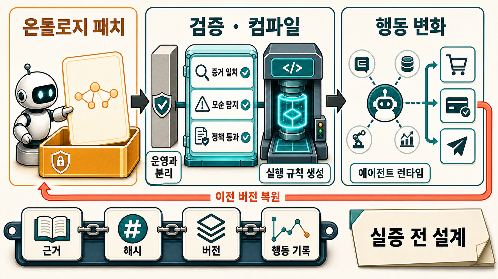
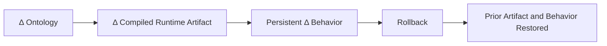
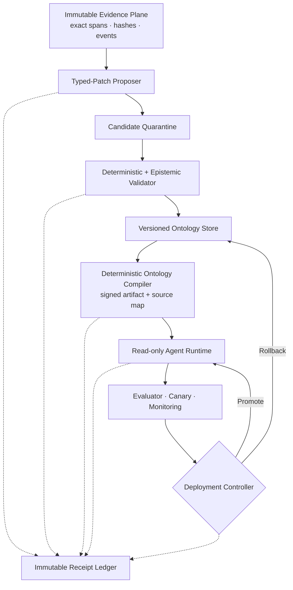

“온톨로지가 스스로 진화하면서 에이전트의 기억과 행동까지 바꾼다면, 그것을 정말 새로운 종류의 에이전트라고 부를 수 있을까?” 이 질문에 대한 결론은 명확하다. **그래프를 검색해 답변이 달라지는 것만으로는 온톨로지 창발이 아니다. 온톨로지의 변경이 실행 규칙으로 컴파일되고, 그 결과가 재시작 후에도 지속되며, 롤백하면 이전 행동까지 돌아가야 한다.**

이 글은 [[notes/ontology-in-the-agentic-era|LLM 에이전트 시대의 온톨로지]]와 [[notes/ontology-judge-loop-agent-validation|온톨로지 기반 Judge Loop]]를 이어, “의미 계층”과 “판정 계약”을 실제 자기변화 시스템의 설계 조건으로 확장한다.

## 먼저 구분해야 할 세 종류의 에이전트

온톨로지나 지식그래프를 사용한다고 모두 같은 시스템은 아니다.

| 유형               | 온톨로지의 역할                              | 행동 변화의 원천                 | 이 글의 판정     |
| ------------------ | -------------------------------------------- | -------------------------------- | ---------------- |
| Ontology-augmented | 검색·설명·엔티티 연결을 보조                 | 프롬프트와 검색 문맥             | 창발 아님        |
| Ontology-governed  | 정책·제약·도구 조건을 실행 중 강제           | 고정된 온톨로지 규칙             | 필요한 중간 단계 |
| Ontology-emergent  | 검증·승격된 온톨로지 변화가 이후 행동을 변경 | 버전 있는 온톨로지와 컴파일 결과 | 엄격한 목표      |

Graph RAG는 관련 문서를 더 잘 찾게 할 수 있다. 시간 인식 지식그래프는 과거와 현재 사실을 구분하는 데 도움을 준다. SHACL은 데이터가 정해진 shape에 맞는지 검사할 수 있다. 하지만 어느 것도 그 자체로 “에이전트가 온톨로지를 통해 학습해 행동이 달라졌다”는 사실을 증명하지 않는다.[src_001](#src-001) [src_002](#src-002)

## 창발을 한 문장으로 판정하기

좋은 구성요소를 나열하는 것만으로는 부족하다. “창발”을 반증 가능한 형태로 정의하려면 다음 판정식이 필요하다.

> **모델·프롬프트·입력·seed·도구 환경을 고정했을 때, 의미 있는 ontology delta가 결정론적 compiled-runtime delta를 만들고, 그 변화가 재시작 후에도 지속되는 behavior delta를 유발하며, ontology rollback이 이전 artifact와 행동을 복원할 때만 온톨로지 창발로 인정한다.**

이를 짧게 쓰면 다음과 같다.



이 사슬은 비슷해 보이는 현상을 걷어낸다.

- 새 문서가 vector index에 들어가 답이 바뀌었다면 검색 변화다.
- ontology 내용을 prompt에 붙여 답이 바뀌었다면 문맥 변화다.
- 온톨로지를 수정했지만 runtime artifact가 그대로라면 문서 변경이다.
- 한 번 다른 답이 나왔지만 재시작 후 사라진다면 세션 효과다.
- rollback 뒤에도 이전 행동이 돌아오지 않는다면 변경 원인을 통제하지 못한 것이다.

창발이라는 말을 유지하려면 결국 **온톨로지 변경과 행동 변경 사이의 인과 계보**를 증명해야 한다.

## 창발 에이전트의 최소 아키텍처

필요한 시스템은 의미 아키텍처와 장기 메모리, 평가 신뢰성, 거버넌스와 운영을 함께 다뤄야 한다. 최소 구조는 다음 아홉 구성요소로 정리된다.



### 1. 불변 증거 계층

원문, 관찰, 실행 trace, 도구 응답과 사람 주석을 append-only로 보존한다. 각 증거에는 정확한 span, hash, 수집 시각, 실제 유효 시각, 출처와 적용 범위가 필요하다. Zep/Graphiti의 bi-temporal memory는 사실의 생성·무효화 시각과 현실의 유효 시각을 나누는 방향을 보여준다. 다만 해당 연구도 그래프 메모리의 일반적 우월성이나 형식 온톨로지 통합을 완성한 것은 아니다.[src_002](#src-002)

### 2. 버전 온톨로지와 후보 격리

현재 승인된 온톨로지와 후보 patch를 같은 저장면에서 섞지 않는다. 운영 runtime은 promoted version만 읽고, 모든 후보는 quarantine에서 검증을 기다린다. 과거 사실을 덮어쓰지 않고 유효 기간, 대체, 무효화와 모순 관계를 보존한다.

### 3. LLM은 저자가 아니라 제안자

LLM은 자연어 목표를 온톨로지 용어로 바꾸고, 실행 실패를 구조화하고, typed patch와 설명을 제안할 수 있다. 그러나 검증, commit, compiler 실행, production promotion 권한을 갖지 않는다. Evo-DKD는 구조화된 후보와 자연어 설명을 함께 만드는 방향을 제안하지만, 핵심 이중 디코더 구현과 평가에는 뚜렷한 한계가 있다.[src_003](#src-003)

LLM 온톨로지 생성 연구에서도 역량 질문을 높은 비율로 모델링하면서 동시에 불필요한 클래스·속성, 잘못된 inverse·transitive 관계, hierarchy cycle과 원치 않는 추론이 관찰됐다. “잘 생성한다”와 “운영 의미를 바꿔도 안전하다” 사이에는 큰 간격이 있다.[src_004](#src-004) [src_005](#src-005)

### 4. 결정론적 validator와 compiler

Validator는 type, endpoint, cardinality, SHACL, satisfiability, identity, provenance, 시간·관할 범위, 모순과 blast radius를 검사한다. 이 중 구조 적합성은 진실성과 별개의 축이다. 문법과 shape를 통과해도 잘못된 정책일 수 있다.[src_001](#src-001)

Compiler는 승인된 ontology version을 다음 runtime artifact로 바꾼다.

| 온톨로지 편집                | 컴파일 결과                            | 행동 영향                      |
| ---------------------------- | -------------------------------------- | ------------------------------ |
| class·alias                  | parser/type registry                   | 개체 해석과 계획 후보 변경     |
| relation·domain·range        | typed traversal과 binding              | 허용 추론과 tool argument 변경 |
| constraint·shape             | executable guard                       | 잘못된 상태·행동 거부          |
| policy·permission            | authorization graph                    | permit, deny, escalation 변경  |
| operator precondition/effect | planner state machine                  | 행동 순서와 실행 가능성 변경   |
| temporal fact                | validity-scoped memory                 | 미래 판단에 사용할 사실 변경   |
| contradiction                | unresolved conflict set                | 자동 결론 금지와 검토 요청     |
| deprecation                  | rule disable과 dependency invalidation | 기존 행동 제거와 재컴파일      |
| provenance-only metadata     | artifact hash 불변                     | 행동 변화 없음                 |

Compiler가 없다면 ontology update는 검색 데이터나 문서 변경에 머문다. 반대로 compiler가 있으면 어떤 ontology edit가 어떤 planner rule, permission guard와 tool contract를 바꿨는지 추적할 수 있다.

### 5. 단 하나의 배포 권한

Deployment controller만 canary, promotion과 rollback을 수행한다. Proposer는 자기 제안을 승인할 수 없고, Judge는 점수만 제출하며, runtime은 ontology를 직접 수정할 수 없다. 권한·보안·정체성·헌법적 정책과 비가역적 외부 행동은 별도의 사람 승인을 요구한다.

## 자유 형식 메모리가 아니라 typed patch가 학습 단위다

창발 에이전트가 학습하는 대상은 “지난번에 실패했으니 다음엔 조심하자” 같은 메모 한 줄이 아니다. 최소한 다음 계약을 가진 patch여야 한다.

- stable patch ID와 parent ontology version
- typed before/after diff
- exact source span과 content hash
- event time, valid time, tenant, jurisdiction와 scope
- supporting·contradicting evidence
- 예상 runtime delta와 blast radius
- validator와 canary 결과
- inverse patch 또는 복원할 snapshot
- 승인자, 배포 cohort와 만료·재검토 시점

ANNEAL은 반복되는 실행 실패를 typed process-knowledge patch로 바꾸고, hard guardrail, sandbox canary, commit 또는 rollback을 거치는 구조를 제안한다. 이는 현재 연구 중 온톨로지 또는 symbolic state 변화가 이후 행동에 영향을 주는 가장 가까운 사례다. 다만 합성 환경과 좁은 operator repair 범위의 프리프린트이므로, 범용 자율 진화의 증거로 읽으면 안 된다.[src_006](#src-006)

운영 상태는 다음처럼 명시한다.

```text
observed
  → localized
  → proposed
  → quarantined
  → validated
  → approved
  → canary
  → promoted
  → monitored
  → retained | rolled_back | deprecated
```

각 화살표마다 누가 무엇을 근거로 상태를 바꿨는지 receipt가 남아야 한다.

## 진짜 창발인지 확인하는 최소 실험

좋은 데모보다 먼저 세 개의 대조군이 필요하다. 모델, 프롬프트, 입력, seed, 도구, evidence corpus와 retrieval result를 가능한 한 동일하게 고정한다.

1. `C_static`: 고정 prompt, durable update 없음
2. `C_vector`: 같은 evidence를 vector memory에만 추가
3. `T_ontology`: evidence를 typed ontology patch로 검증·컴파일·승격

예를 들어 “월요일에는 법인카드를 사용할 수 없다”는 반복 실패를 학습한다고 하자.

- `C_static`은 기존 행동을 유지한다.
- `C_vector`는 관련 실패 기록을 검색할 수 있지만 행동 guard는 없다.
- `T_ontology`는 `CorporateCard AND Monday → ineligible`을 planner precondition으로 컴파일한다.

통과하려면 `T_ontology`에서만 개인카드 선택으로 행동이 바뀌어야 한다. runtime을 재시작해도 같은 ontology version과 artifact가 같은 결정을 내려야 한다. 이후 parent ontology와 artifact로 rollback하면 월요일 행동까지 이전 trace로 돌아가야 한다.

이 실험은 “정보를 보여줘서 답이 바뀐 것”과 “승인된 의미 규칙이 행동을 바꾼 것”을 분리한다.

## 성공 경로보다 먼저 실패 경로를 만든다

### 구조상 유효하지만 의미상 위험한 patch

기존 정책이 `파괴적 export에는 사람 승인이 필요하다`고 하자. 오염된 문서가 승인 요구를 제거하는 typed patch를 제안한다.

1. 문법과 SHACL 검사는 통과할 수 있다.
2. provenance validator는 source span과 hash의 불일치를 찾는다.
3. contradiction validator는 기존 의무 정책과의 충돌을 찾는다.
4. evidence independence 검사는 복제된 출처를 독립 증거로 세지 않는다.
5. patch는 quarantine되고 production artifact는 변하지 않는다.

여기서 epistemic gate를 의도적으로 끄는 negative ablation도 필요하다. 그때 금지된 export가 도달 가능해진다면, 해당 검사가 단순 장식이 아니라 실제 안전 경계였음을 입증할 수 있다.

### Canary에서 발견되는 회귀

고객과 공급자를 하나의 상위 개념으로 합치는 patch가 invoice 처리를 단순화한다고 가정하자. 구조적으로는 타당해도 공급자 전용 지급 tool이 고객 요청에서 도달 가능해질 수 있다.

Canary가 이 권한 회귀를 발견하면 deployment controller는 parent ontology와 이미 검증된 parent artifact를 함께 복원한다. 같은 query receipt를 재생했을 때 action hash와 behavior trace가 이전과 일치해야 한다. ontology만 되돌리고 파생 cache, dependent rule 또는 runtime artifact가 남는다면 rollback은 실패다.

이미 외부에서 실행된 송금이나 삭제를 ontology rollback으로 취소할 수는 없다. 그래서 비가역적 행동에는 사후 복구가 아니라 실행 전 guard와 사람 승인이 필요하다.

## Judge가 많다고 안전해지는 것은 아니다

변경안을 여러 LLM Judge에게 평가시키는 것은 도움이 될 수 있지만, 표의 수와 독립 증거의 수는 다르다. PoLL은 다양한 모델 panel이 일부 설정에서 사람 선호 판단과의 일치도와 비용을 개선할 수 있음을 보였다. 반면 9개 Judge, 7개 model family를 분석한 2026년 프리프린트는 유효 독립표가 약 `2.18`에 불과하고, 독립성을 가정한 예측과 실제 다수결 사이에 큰 Condorcet gap이 생길 수 있음을 보고했다.[src_007](#src-007) [src_008](#src-008)

따라서 promotion에는 다음이 필요하다.

- 후보 순서 교환과 Judge identity 익명화
- proposer 자기 결과를 별도 slice로 평가
- model family별 오류 상관과 `n_eff` 보고
- deterministic oracle와 tool outcome 우선 사용
- 위험·불일치·새로운 edit type에 대한 사람 truth sample
- agreement와 accuracy를 별도 지표로 기록

LLM panel은 보조 센서다. 변경 승인 권한의 대체물이 아니다.

## 불변조건과 임계값을 섞지 않는다

핵심은 “반드시 지켜야 할 구조”와 “운영하면서 보정할 숫자”를 분리하는 것이다.

### 바뀌면 안 되는 불변조건

- proposer에게 commit 권한을 주지 않는다.
- ontology version과 compiler artifact를 content-addressed로 고정한다.
- unpromoted patch를 runtime이 읽지 못하게 한다.
- 고정 대조군 없이 창발을 주장하지 않는다.
- query부터 rollback까지 receipt 계보를 끊지 않는다.
- rollback은 ontology뿐 아니라 artifact와 behavior를 복원한다.

### 도메인에서 보정해야 할 가설

- confidence와 risk threshold
- blast-radius 기준
- canary 개수와 성공률
- 허용 가능한 성능·latency 회귀
- Judge panel 크기와 최소 `n_eff`
- 사람 검토 표본 비율

ANNEAL 같은 연구가 제시한 canary와 trust 수치는 출발점일 수 있지만 다른 도메인의 기본값은 아니다. 금융 송금, 연구 메모, 고객 지원과 산업 제어는 실패 비용이 다르다. 임계값은 실제 회귀와 사람 검토 데이터로 보정해야 한다.[src_006](#src-006)

## 구축 순서는 ‘자율성’이 아니라 ‘복원 가능성’부터다

### 1단계: 불변 evidence와 receipt

원문, exact span, hash, source version, 실행 trace를 보존한다. provider 장애와 실제 `not_found`도 구분한다. promoted claim은 원문 구간까지 역추적돼야 한다.

### 2단계: governed edits

Typed patch, quarantine, schema·identity·provenance·contradiction·scope validator를 구축한다. 오염 patch가 production version을 바꾸지 않는 실패 receipt부터 통과시킨다.

### 3단계: compiler와 read-only runtime

지원할 edit type을 좁게 정하고 parser, planner, guard, permission과 tool contract로 컴파일한다. 동일 입력의 격리 build가 같은 artifact hash를 만들어야 한다.

### 4단계: 인과 평가

`C_static`, `C_vector`, `T_ontology`를 같은 조건에서 비교한다. restart persistence와 exact rollback restoration을 시험한다.

### 5단계: 점진적 배포

Offline replay, shadow, canary, 제한 cohort, guarded production 순으로 확장한다. 의도적으로 회귀를 주입하고 atomic rollback을 반복 훈련한다.

### 6단계: 장기 학습

Stale fact, 모순 누적, concept fragmentation, ontology 비대화, 반복 실패 patch, model·compiler 변경과 evaluator gaming을 장기간 추적한다. 여러 agent의 local ontology를 shared ontology로 승격하는 문제는 이 단계 이후에 다룬다.

## 연구가 지지하는 것과 아직 지지하지 않는 것

Gruber의 명시적 명세, SHACL의 구조 검증, Zep의 temporal graph memory, Evo-DKD의 구조화 후보 생성, IAL의 ontology-constrained intention, ANNEAL의 governed symbolic patch는 참조 아키텍처의 부품을 지지한다. LLM Judge 연구는 평가자 일치와 진실을 분리하고 오류 상관을 측정해야 한다는 경고를 제공한다.[src_001](#src-001) [src_002](#src-002) [src_003](#src-003) [src_006](#src-006) [src_007](#src-007) [src_008](#src-008) [src_009](#src-009)

그러나 이 부품을 모두 결합한 시스템이 vector-only memory나 고정 규칙 baseline보다 우월하다는 공개 실증은 확인되지 않았다. 장기 ontology evolution, 행동 rollback, 여러 agent의 scope conflict, provider 장애와 고위험 외부 행동까지 포함한 검증도 부족하다. 그러므로 이 글의 결과는 **구현 가능한 규범적 명세와 최소 실험 계획**이지, 이미 작동하는 창발 시스템의 증거가 아니다.

## 결론: 온톨로지는 기억 저장소가 아니라 행동 변경의 검증 가능한 매개가 된다

온톨로지 창발 에이전트의 핵심은 지식그래프의 크기나 LLM의 자율성이 아니다. 중요한 것은 어떤 evidence가 어떤 typed patch를 만들었고, 어떤 검사를 거쳐 어떤 ontology version으로 승격됐으며, 그 version이 어떤 runtime rule과 행동을 바꿨는지 다시 재생할 수 있는가다.

LLM은 넓게 제안하고 설명한다. 온톨로지는 의미와 적용 범위를 명시한다. Validator는 잘못된 변경을 격리한다. Compiler는 승인된 의미를 행동 규칙으로 바꾼다. Canary와 사람은 실제 실패 비용을 확인한다. Receipt와 rollback은 변화의 원인과 책임을 남긴다.

이 모든 연결이 갖춰졌을 때 온톨로지는 단순한 검색 보조물이 아니라 **에이전트가 무엇을 기억하고, 무엇을 할 수 있으며, 어떻게 안전하게 달라졌는지를 증명하는 실행 가능한 학습 매개**가 된다.

## 함께 읽기

- [[notes/ontology-agent-guide|1. 온톨로지 에이전트: 의미를 아는 AI를 만드는 방법]]
- [[notes/ontology-in-the-agentic-era|2. LLM 에이전트 시대, 온톨로지는 ‘실행의 의미 계층’으로 확장될 수 있다]]
- [[notes/ontology-judge-loop-agent-validation|3. 온톨로지 기반 Judge Loop와 에이전트 검증 설계]]

## 출처

- <a id="src-001"></a> **src_001** — W3C RDF Data Shapes Working Group. (2017). _Shapes Constraint Language (SHACL)_. [원문](https://www.w3.org/TR/shacl/)
- <a id="src-002"></a> **src_002** — Rasmussen, P. et al. (2025). _Zep: A Temporal Knowledge Graph Architecture for Agent Memory_. arXiv:2501.13956. [원문](https://arxiv.org/abs/2501.13956)
- <a id="src-003"></a> **src_003** — Raman, V., & Aravindh, V. R. (2025). _Evo-DKD_. arXiv:2507.21438. [원문](https://arxiv.org/abs/2507.21438)
- <a id="src-004"></a> **src_004** — Lippolis, A. S. et al. (2025). _Ontology Generation using Large Language Models_. arXiv:2503.05388. [원문](https://arxiv.org/abs/2503.05388)
- <a id="src-005"></a> **src_005** — Lippolis, A. S. et al. (2025). _Assessing the Capability of LLMs for Domain-Specific Ontology Generation_. arXiv:2504.17402. [원문](https://arxiv.org/abs/2504.17402)
- <a id="src-006"></a> **src_006** — Hakim, S. B. et al. (2026). _ANNEAL_. arXiv:2605.16309. [원문](https://arxiv.org/abs/2605.16309)
- <a id="src-007"></a> **src_007** — Verga, P. et al. (2024). _Replacing Judges with Juries: Evaluating LLM Generations with a Panel of Diverse Models_. arXiv:2404.18796. [원문](https://arxiv.org/abs/2404.18796)
- <a id="src-008"></a> **src_008** — Apple Machine Learning Research. (2026). _Nine Judges, Two Effective Votes: Correlated Errors Undermine LLM Evaluation Panels_. [원문](https://arxiv.org/abs/2605.29800)
- <a id="src-009"></a> **src_009** — Markaj, A. et al. (2026). _Towards an Intention Abstraction Layer for Autonomous Industrial Systems_. arXiv:2607.14553. [원문](https://arxiv.org/abs/2607.14553)
