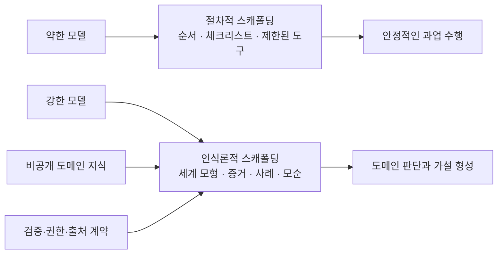

> [!summary] 결론부터
> 모델이 강해질수록 세세한 사고 절차를 대신 작성하는 하네스의 가치는 일부 줄어들 수 있습니다. 그러나 모델이 학습하지 못한 비공개 도메인 지식, 조직의 과거 결정, 실패 경험과 현재 제약을 전달하는 외부 지식 계층의 가치는 사라지지 않습니다. 오히려 강한 모델에는 더 많은 규칙보다 **사실·관계·인과·결정 이유·사례·예외·모순을 질문에 맞게 조립한 도메인 작업공간**이 필요합니다.
>
> 이 글에서는 그 작업공간을 **Ontology Expertise Pack**이라고 부르겠습니다. 일반 온톨로지가 세계에 무엇이 존재하고 어떻게 연결되는지를 명시한다면, Expertise Pack은 여기에 증거, 결정, 경험, 인과 가설, 전문가 질문과 평가 계약을 더합니다. 목표는 정답 문장을 검색하는 것이 아니라, 강한 범용 모델이 조직의 사적 세계 안에서 가설을 세우고 반례를 찾고 영향 범위를 추적하도록 돕는 것입니다.
>
> 다만 공개 연구만으로 “온톨로지 Pack을 붙이면 시니어 엔지니어가 된다”고 말할 수는 없습니다. 그래프 기반 추론과 도메인 특화 메모리는 유망한 결과를 보이지만, 불완전한 그래프에서는 모델 내부 기억에 기대거나 잘못된 경로를 따를 수 있습니다. 따라서 현실적인 목표는 사람을 복제하는 것이 아니라 **도메인에 새로 들어온 강한 모델을, 조직의 근거와 경험을 빠르게 활용하는 유능한 동료로 만드는 것**입니다.

이 글은 앞선 [[notes/ontology-context-compiler-opencrab|온톨로지를 문맥 컴파일러로 보는 관점]]에서 한 단계 더 나아갑니다. 앞 글에서는 외부 지식을 질문에 맞는 문맥으로 컴파일하는 역할을 살펴봤습니다. 이번에는 더 근본적인 질문을 다룹니다.

> **잘 구축된 온톨로지 Pack은 모델이 아는 사실만 늘리는가, 아니면 모델이 문제를 바라보고 판단하는 방식까지 바꿀 수 있는가?**

## 1. 모델이 강해져도 남는 문제

최근 에이전트 연구는 관찰된 성능을 모델 하나의 속성으로 보기 어렵다는 점을 반복해서 보여줍니다. Harness-Bench는 같은 업무 환경에서도 모델과 하네스의 조합에 따라 완료율, 과정 품질, 효율과 실패 방식이 크게 달라진다고 보고하며, 에이전트 능력을 `모델–하네스 구성` 단위로 평가할 것을 제안합니다.[src_001](#src-001) ToFu도 에이전트 시스템의 성능이 LLM과 그 주위를 둘러싼 오케스트레이션 코드에 함께 달려 있다고 설명합니다.[src_002](#src-002)

Harness-Bench에서는 더 강한 모델 백엔드가 평균 성능이 높으면서 하네스 간 편차는 더 작은 경향을 보였고, 저자들은 이를 프롬프트·도구 인터페이스·상태 관리 차이에 더 잘 견딜 가능성으로 해석했습니다.[src_001](#src-001) 그러나 이것이 계획·복구·컨텍스트 관리가 모델 안으로 계속 흡수된다는 보편 법칙을 입증하지는 않습니다. 이 글에서는 **모델이 강해질수록 일부 절차적 보조의 한계효용이 줄 수 있다**는 정도의 설계 가설로만 사용하겠습니다. AOrchestra처럼 과제마다 `Instruction–Context–Tools–Model` 조합을 동적으로 만드는 연구의 핵심도 고정 절차를 계속 늘리기보다 현재 과제에 필요한 실행 구성을 선택하는 데 가깝습니다.[src_003](#src-003) 자기개선 에이전트 서베이는 현대 에이전트를 기반 모델과 프롬프트·메모리·도구·제어 로직으로 이루어진 스캐폴드의 결합으로 정의하고, 개선 대상이 모델 가중치일 수도 스캐폴드일 수도 있다고 구분합니다.[src_004](#src-004)

여기서 두 문제가 갈라집니다.

| 최적화 문제        | 약한 모델을 보완하는 경우                         | 강한 모델을 증폭하는 경우                             |
| ------------------ | ------------------------------------------------- | ----------------------------------------------------- |
| 주된 결함          | 문제 분해·도구 선택·상태 추적이 불안정함          | 도메인 내부의 사적 사실과 판단 맥락을 모름            |
| 효과적인 외부 계층 | 단계별 절차, 체크리스트, 제한된 도구, 강한 스키마 | 고밀도 세계 모형, 사례, 인과, 모순, 결정 이유         |
| 온톨로지의 역할    | 이탈을 막는 레일과 허용 경로                      | 무엇을 볼지 정하는 지도와 의미 렌즈                   |
| 실패 위험          | 사람이 모든 사고 절차를 대신 작성함               | 그래프를 많이 주입하고도 질문에 필요한 관계를 못 고름 |
| 바람직한 결과      | 정해진 과정을 안정적으로 수행함                   | 낯선 문제에서 근거 있는 가설과 반례를 만듦            |

약한 모델에는 “먼저 A를 확인하고 실패하면 B를 실행하라”는 절차가 도움이 됩니다. 반면 강한 모델에 같은 수준의 세부 절차를 강제하면 더 나은 분해 전략을 선택할 자유를 빼앗거나, 오래된 운영 규칙에 모델을 가둘 수 있습니다.


모델이 강해질수록 외부 계층이 없어지는 것이 아니라 **외부 계층의 무게중심이 이동한다**고 보는 편이 정확합니다.



이 글에서 말하는 인식론적 스캐폴딩은 모델에게 생각의 문장을 대신 써주는 장치가 아닙니다. 다음 경계를 알려주는 장치입니다.

- 무엇을 현재 사실로 신뢰할 수 있는가
- 무엇이 과거 사실이며 언제 무효화됐는가
- 어떤 결론이 직접 근거이고 어떤 결론이 해석인가
- 어떤 관계가 검증된 의존성이고 어떤 관계가 인과 가설인가
- 어떤 예외와 반례 때문에 일반 규칙을 그대로 적용하면 안 되는가
- 무엇을 아직 모르며 어떤 추가 증거가 필요한가

모델이 아무리 강해져도 조직 내부 장애 기록, 미공개 설계 결정, 고객 계약의 예외와 팀의 암묵적 위험 기준을 자동으로 알 수는 없습니다. 따라서 강한 모델 시대의 핵심 문제는 “모델 대신 더 많이 생각해 주는 하네스”보다 **모델이 알 수 없는 세계를 어떻게 정확하고 유용하게 전달할 것인가**로 이동합니다.

## 2. 지식그래프만으로 시니어 엔지니어가 되지 않는 이유

일반적인 RAG는 질문과 가까운 문서 조각을 찾아 모델에 제공합니다. 지식그래프는 엔티티와 관계를 따라 여러 단계를 탐색하고, 답에 사용한 경로를 남기는 데 유리합니다. Think-on-Graph와 KG-Agent는 LLM이 지식그래프의 엔티티·관계를 반복적으로 선택하며 복합 질문을 푸는 가능성을 보여줬습니다.[src_005](#src-005)[src_006](#src-006) KnowAgent는 행동 지식으로 계획 경로를 제한해 실행 궤적의 환각을 줄이는 접근을 제안합니다.[src_007](#src-007)

하지만 그래프를 붙였다는 사실과 전문가처럼 판단한다는 사실 사이에는 큰 간격이 있습니다.

예를 들어 다음 그래프가 있다고 하겠습니다.

```text
서비스 A → 의존한다 → 데이터베이스 B
장애 C → 영향을 주었다 → 서비스 A
정책 D → 적용된다 → 데이터베이스 B
```

이 그래프는 “장애 C와 연결된 데이터베이스는 무엇인가?”라는 질문에는 도움이 됩니다. 그러나 시니어 엔지니어가 실제로 던질 법한 질문에는 충분하지 않습니다.

- 이 의존성은 장애의 원인인가, 단순히 함께 관찰된 경로인가?
- 과거에 같은 증상이 다른 원인으로 발생한 적은 없는가?
- 정책 D는 지금도 유효한가, 특정 고객에게만 적용되는가?
- 데이터베이스 B를 바꾸면 어떤 서비스가 2차 영향을 받는가?
- 당시 팀은 왜 더 단순한 대안을 선택하지 않았는가?
- 현재 가설과 맞지 않는 반례는 무엇인가?

이 질문에 답하려면 엔티티와 관계 외에 **결정의 이유, 시간, 실패 사례, 예외, 신뢰 수준과 미해결 모순**이 필요합니다.

BRINK는 불완전한 지식 조건에서 현재 KG-RAG 방식의 추론 능력이 제한적이며, 그래프에 답이 없을 때 모델 내부 기억에 의존하는 경우가 있다고 보고합니다.[src_008](#src-008) 이는 그래프가 쓸모없다는 뜻이 아닙니다. “경로가 존재한다”와 “그 경로로 새 결론을 정당화할 수 있다”를 분리해야 한다는 뜻입니다.

도메인 특화 구조의 중요성을 보여주는 최신 신호도 있습니다. Narrative World Model은 장편 서사의 인물 상태·시간·관계 변화를 표현하는 타입이 있는 시간 그래프와 질문 조건형 검색을 결합해, 일반 목적 그래프 메모리와 평면 검색보다 다중 홉 서사 질문에서 나은 결과를 보고했습니다.[src_009](#src-009) 아직 2026년 프리프린트이고 소설 도메인에 한정된 결과지만, **그래프 크기보다 도메인의 실제 질문을 반영한 표현과 검색 구조가 중요할 수 있다**는 점을 보여줍니다.

따라서 목표는 모든 문서를 거대한 그래프로 바꾸는 것이 아닙니다. 이 도메인의 시니어가 실제로 구분하는 상태, 사건, 판단과 예외를 표현하고, 질문에 따라 필요한 부분만 작업공간으로 조립하는 것입니다.

## 3. 시니어의 전문성에서 무엇을 외부화할 것인가

시니어 엔지니어의 전문성을 “많은 사실을 외운 상태”로 보면 Expertise Pack은 문서 검색 시스템에 머뭅니다. 실제 전문성에는 최소한 일곱 층이 있습니다.

### 3.1 도메인 세계 모형

어떤 시스템, 사람, 데이터, 정책과 프로세스가 존재하며 서로 어떻게 연결되는지를 정의합니다. 이 층은 전통적인 온톨로지와 지식그래프가 가장 잘 다루는 부분입니다.

단, 도메인 고유 언어를 일반 타입으로 지워서는 안 됩니다. `CacheTTL`, `SchemaMigration`, `EnterpriseContractException` 같은 이름과 관계는 제품과 조직이 실제로 사용하는 의미입니다. 공통 온톨로지 역할은 이들을 대체하기보다 탐색과 검증을 위한 상위 렌즈로 작동해야 합니다.

### 3.2 증거와 주장

원문 관찰과 해석을 분리합니다.

```text
Evidence: 배포 후 15분 동안 오류율이 4배 증가했다.
Claim: 새 캐시 정책이 오류 증가의 주원인이다.
```

두 문장을 하나의 사실로 저장하면 나중에 가설이 반박돼도 오염된 결론이 계속 재사용됩니다. 각 주장에는 지지·반박 근거, 유효 기간, 출처와 신뢰 범위가 필요합니다.

### 3.3 인과·영향 모형

`관련 있다`보다 더 구체적인 구분이 필요합니다.

- 직접 의존성인지 간접 경로인지
- 관찰된 상관인지 검증된 인과인지
- 어떤 조건에서만 효과가 나타나는지
- 시간 지연과 역효과가 있는지
- 어떤 조절 변수와 결과가 연결되는지

이 층이 있어야 모델이 “관련 문서는 이것입니다”에서 “이 가설이 맞다면 다음 신호가 함께 나타나야 합니다”로 이동할 수 있습니다.

### 3.4 결정과 트레이드오프

최종 결정만 저장하지 않고 검토한 대안과 당시의 이유를 남깁니다.

- 어떤 선택지를 비교했는가
- 왜 한 선택지를 버렸는가
- 어떤 비용과 위험을 받아들였는가
- 결정의 유효 조건은 무엇인가
- 어떤 조건이 바뀌면 다시 검토해야 하는가

조직의 아키텍처에는 과거 제약의 흔적이 남습니다. 이유가 사라진 결정은 미래 모델에게 불변 법칙처럼 보이거나, 반대로 쉽게 제거해도 되는 낡은 관습처럼 보일 수 있습니다.

### 3.5 사례와 실패 기억

전문가는 추상 규칙만으로 판단하지 않습니다. 현재 사건을 비슷한 과거 사례와 비교하고, 겉보기에는 비슷하지만 원인이 달랐던 사례를 함께 떠올립니다.

좋은 사례 기억은 다음을 포함합니다.

- 당시 관찰된 초기 신호
- 처음 세운 가설과 틀린 이유
- 실제 원인과 확인 방법
- 효과가 있었던 조치와 부작용
- 재발 방지책과 이후의 회귀
- 현재 사례와 같거나 다른 조건

Zep은 시간 인식 지식그래프로 대화와 비즈니스 데이터의 역사적 관계를 유지하는 메모리 구조를 제안했습니다.[src_010](#src-010) 그러나 일반 목적 시간 그래프만으로 도메인 전문가의 사례 비교 기준이 자동으로 생기는 것은 아닙니다. 어떤 사건을 같은 유형으로 볼지, 차이를 만드는 조건이 무엇인지 도메인 모델이 필요합니다.

### 3.6 휴리스틱과 예외

시니어의 지식에는 완전한 법칙으로 쓰기 어려운 경험 규칙이 많습니다.

> 배포 직후 오류율이 오르면 최근 변경부터 보되, 읽기 지연만 증가했다면 캐시 무효화와 연결 풀을 먼저 비교한다.

이런 규칙은 정답이 아니라 **조사 우선순위**입니다. Expertise Pack에는 기본 휴리스틱뿐 아니라 적용 조건, 알려진 예외, 근거 사례와 만료 시점을 함께 기록해야 합니다.

### 3.7 미해결 모순과 전문가 질문

완성된 결론만 저장하면 모델은 지나치게 확신하기 쉽습니다. 다음도 일급 객체로 남겨야 합니다.

- 서로 충돌하는 두 설명
- 증거가 부족한 가설
- 정의가 팀마다 다른 개념
- 오래돼 재검토가 필요한 정책
- 아직 측정하지 못한 위험
- 결론을 뒤집을 수 있는 미수집 증거

그리고 시니어가 반복적으로 던지는 질문을 저장해야 합니다.

- 이 설명과 맞지 않는 반례는 무엇인가?
- 같은 증상을 만든 다른 원인은 무엇이었는가?
- 이 결정을 무효화하는 조건은 무엇인가?
- 직접 영향과 2차 영향은 어떻게 다른가?
- 지금 모르는 사실 가운데 판단을 가장 크게 바꿀 것은 무엇인가?

Competency Question은 원래 온톨로지가 답해야 할 요구사항을 질문 형태로 고정하는 방법입니다. LLM을 이용한 온톨로지 생성 연구도 사용자 스토리와 역량 질문을 입력과 평가에 사용하면서, 문법적 타당성과 현업 유용성이 별개의 평가 축임을 보여줍니다.[src_011](#src-011) Expertise Pack에서는 이 질문을 스키마 테스트에 그치지 않고 **전문가의 주의와 조사 문법**으로 확장할 수 있습니다.

## 4. Ontology Expertise Pack의 제안 구조


이 글에서 제안하는 Expertise Pack은 하나의 RDF 파일이나 그래프 데이터베이스를 뜻하지 않습니다. 다음 일곱 구성요소를 함께 배포하는 **전문성 전달 계약**입니다. 이 일곱 층은 표준이나 실증적으로 확립된 최소값이 아니라, 이번 글이 비교와 구현을 위해 제안하는 설계 가설입니다. 도메인에 따라 합치거나 빼고, 별도의 조직·시장·물리 환경 모형을 더할 수 있습니다.

| 구성요소            | 담는 것                                | 모델의 사용 방식                        |
| ------------------- | -------------------------------------- | --------------------------------------- |
| Domain Ontology     | 개념, 상태, 관계, 시간, 권한           | 질문을 도메인 객체와 관계로 해석함      |
| Evidence Graph      | 원문, 관찰, 주장, 반박, 출처           | 결론의 근거와 한계를 추적함             |
| Decision Graph      | 목표, 대안, 선택, 이유, 트레이드오프   | 과거 결정의 맥락과 재검토 조건을 이해함 |
| Experience Memory   | 사건, 실패, 조치, 결과, 회귀           | 현재 문제를 유사·대조 사례와 비교함     |
| Causal Model        | 원인 가설, 영향 경로, 조건, 지연       | 경쟁 가설과 예상 관찰을 만듦            |
| Inquiry Model       | 역량 질문, 진단 질문, 반례 질문        | 무엇을 더 조사해야 하는지 결정함        |
| Evaluation Contract | 근거 충실성, 반례, 불확실성, 행동 기준 | 그럴듯한 답과 전문가적 판단을 구분함    |

여기서 온톨로지는 중심 스키마지만 전부는 아닙니다. 출처가 없는 관계, 이유가 사라진 결정, 결과가 기록되지 않은 조치는 그래프에 들어 있어도 전문성으로 사용하기 어렵습니다.

또한 Pack은 모델에 전체를 한 번에 주입하는 문서 묶음이 아닙니다. 질문에 필요한 하위 구조를 선택해 **질문 조건형 의미 작업공간**을 만들어야 합니다.

```text
사용자 질문
→ 목표·개체·시간·위험 수준 해석
→ 관련 세계 모형과 사례 탐색
→ 직접 근거와 유도 관계 분리
→ 충돌 주장·예외·반례 포함
→ Lever·Outcome·Policy 연결
→ 경쟁 가설과 필요한 추가 증거 구성
→ 강한 모델의 종합·비판·행동 제안
→ 근거와 불확실성을 포함한 결과
```

이 구조에서 모델은 자유로운 추론과 설명을 맡습니다. Pack은 그 자유가 어떤 세계와 근거 안에서 작동해야 하는지 정합니다.

## 5. 모델의 강도와 과제에 따라 Pack을 다르게 읽는다

같은 Expertise Pack도 모든 모델과 질문에 같은 형태로 제공할 필요는 없습니다. 아래 탐색기는 모델의 자율성과 과제 유형을 바꿨을 때 어떤 지식 층과 통제가 앞에 나와야 하는지 보여주는 설명 도구입니다. 표시되는 구성은 측정된 성능 순위나 권고 임계값이 아니라, 이 글의 설계 원칙을 비교하기 위한 질적 구조입니다.

<iframe
  id="ontology-expertise-pack-explorer-frame"
  class="interactive-visualization-frame"
  src="/attachments/ontology-expertise-pack/ontology-expertise-pack-explorer.htm"
  title="모델 강도와 과제 유형에 따른 Expertise Pack 구성 탐색기"
  loading="lazy"
  scrolling="no"
  sandbox="allow-scripts allow-same-origin"
  style="height:920px"
></iframe>

약한 모델에는 조회 경로와 출력 계약을 더 좁게 제공합니다.

```text
등록된 질문 유형
→ 허용된 그래프 질의
→ 제한된 사례 비교
→ 체크리스트 검증
→ 구조화된 답변
```

강한 모델에는 결론보다 **논쟁 가능한 작업공간**을 제공합니다.

```text
핵심 세계 상태
+ 직접 증거
+ 경쟁 주장
+ 유사·대조 사례
+ 인과 가설
+ 정책과 제약
+ 미해결 질문
→ 모델이 조사 순서와 가설을 선택
```

이 차이는 약한 모델을 포기하자는 뜻이 아닙니다. 정본 Pack은 하나로 유지하되 소비 계층을 달리하자는 뜻입니다.

| 모델·과제           | 우선 제공할 것                           | 피해야 할 것                   |
| ------------------- | ---------------------------------------- | ------------------------------ |
| 약한 모델·반복 업무 | 고정 질의, 작은 서브그래프, 명시적 순서  | 자유형 전체 그래프 탐색        |
| 중간 모델·분석 업무 | 관련 관계, 대표 사례, 검증 체크리스트    | 장황한 원문 전체 주입          |
| 강한 모델·진단 업무 | 근거, 모순, 인과 가설, 대조 사례         | 하나의 정답 경로 강제          |
| 강한 모델·설계 업무 | 과거 결정, 트레이드오프, 영향 경로, 정책 | 현재 구조를 불변 규칙으로 취급 |

핵심은 모델의 일반 추론 능력을 존중하면서도, 모델이 모르는 도메인 세계를 정확하게 제한하는 것입니다.

## 6. 새로운 인사이트는 어디에서 나오는가

Ontology Expertise Pack 자체가 새로운 아이디어를 생성하는 두뇌는 아닙니다. 새로운 인사이트는 강한 모델이 Pack의 서로 다른 구조를 **새 질문 아래 다시 조합할 때** 나옵니다.

### 관계 재조합

서로 다른 문서와 팀에 흩어진 사실을 공통 개체와 영향 경로로 연결합니다.

```text
고객 계약 예외
→ 배포 승인 우회
→ 설정 버전 불일치
→ 특정 지역 장애 반복
```

개별 문서에는 이 전체 사슬이 쓰여 있지 않아도, 각 연결에 근거가 있다면 모델은 새로운 조사 가설을 만들 수 있습니다.

### 사례 대조

가장 비슷한 사례만 찾지 않고, 증상은 같지만 원인이 달랐던 사례를 함께 제공합니다. 모델은 공통점보다 **차이를 만드는 조건**을 찾을 수 있습니다.

### 반사실 질문

Decision Graph의 버려진 대안과 Causal Model을 사용해 묻습니다.

> 당시 제약이 사라졌다면 같은 결정을 내렸을까요?

이 질문은 오래된 아키텍처를 재검토하는 데 유용합니다. 다만 실제 결과를 보장하는 예측이 아니라, 검증해야 할 가설을 만드는 용도입니다.

### 모순 탐색

Pack이 서로 충돌하는 주장을 숨기지 않으면 모델은 합의된 답을 반복하는 대신 충돌 원인을 분해할 수 있습니다.

- 시점 차이인가
- 대상 고객이 다른가
- 측정 방식이 다른가
- 정책과 실제 실행이 어긋났는가
- 둘 중 하나가 오래된 가정인가

### 미지의 식별

전문가다운 답은 항상 결론을 내리는 답이 아닙니다. 현재 증거로 구분할 수 없는 두 가설을 밝히고, 가장 정보 가치가 큰 다음 측정을 제안하는 것도 중요한 인사이트입니다.

이 과정은 일반적인 `검색 → 요약`보다 다음에 가깝습니다.

```text
질문 → 의미적 문제 구성 → 경쟁 가설 → 근거·반례 탐색
→ 영향 분석 → 추가 조사 설계 → 조건부 판단
```

Agentic Reasoning 연구는 도구 사용과 구조화된 기억, 지식그래프 형태의 추론 문맥을 결합해 긴 연구 과정을 관리하는 가능성을 보여줍니다.[src_012](#src-012) 그러나 특정 프레임워크의 벤치마크 향상을 “Expertise Pack이 일반적인 창의적 통찰을 보장한다”는 근거로 확대해서는 안 됩니다. 공개 연구는 주로 QA, 계획, 검색과 제한된 도메인 과제를 평가하며, 조직의 시니어급 판단을 장기간 비교한 표준 벤치마크는 아직 확인되지 않았습니다.

## 7. ‘그럴듯한 새 말’과 도메인 인사이트를 구분한다


모델이 문서에 없는 문장을 만들었다고 모두 새로운 인사이트는 아닙니다. 최소한 다음 조건을 구분해야 합니다.

### 근거 연결

새 결론을 구성한 각 전제가 원문, 관찰 또는 승인된 관계로 역추적돼야 합니다. 외부 문맥을 제공했더라도 모델이 필요한 지식을 실제로 사용하고 그 범위를 넘지 않는지는 별도 평가가 필요합니다. grounding 연구도 정답 여부만으로는 제공된 문맥에 충실했는지 보장할 수 없다고 지적합니다.[src_013](#src-013)

### 경쟁 가설

하나의 설명만 만들지 않고 같은 관찰을 설명할 수 있는 대안을 함께 제시해야 합니다.

### 반례와 예외

결론을 약화하거나 뒤집을 사례를 의도적으로 찾습니다. 그래프 검색은 관련 경로를 잘 보여줄 수 있지만, 잘못된 엔티티 연결이나 누락된 관계는 그럴듯한 오답 경로를 만들 수 있습니다.

### 예측 가능한 관찰

가설이 맞다면 추가로 무엇이 관찰돼야 하는지 적습니다. 실제 측정과 맞지 않으면 가설을 폐기하거나 약화할 수 있어야 합니다.

### 불확실성 경계

Pack에 없는 사실을 모델 내부 기억으로 채운 경우, 외부 근거와 파라메트릭 기억을 구분해야 합니다. BRINK가 지적한 것처럼 불완전한 KG에서 모델이 내부 지식에 의존하면 그래프 기반 추론의 효과를 과대평가하기 쉽습니다.[src_008](#src-008)

### 행동 전 검증

새로운 통찰이 외부 행동으로 이어질 때는 결정론적 정책, 권한, 시뮬레이션과 사람 승인이 별도로 필요합니다. 온톨로지의 관계가 맞다는 것과 실제 변경이 안전하다는 것은 다른 문제입니다.

## 8. 가장 큰 실패 위험

### 8.1 온톨로지가 조직의 오래된 사고를 굳힌다

과거 결정과 휴리스틱을 구조화하면 재사용하기 쉬워집니다. 동시에 오래된 편견과 정치적 타협도 권위 있는 지식처럼 굳을 수 있습니다. 모든 규칙에 유효 기간과 재검토 조건을 두고, 반례와 폐기 이력을 보존해야 합니다.

### 8.2 암묵지를 억지로 명시화한다

전문가가 직관적으로 판단하는 모든 요소를 그래프로 표현할 수는 없습니다. 불완전한 모델을 완전한 세계 설명처럼 다루기보다, 원문과 사람에게 돌아갈 수 있는 경로를 남겨야 합니다.

### 8.3 그래프의 구조를 진실로 착각한다

지식그래프는 틀린 사실도 일관되게 연결할 수 있습니다. KG를 활용한 환각 완화 연구는 유망하지만 접근 방식과 결과가 다양하며, 데이터 품질과 검색 정책이 성과를 좌우합니다.[src_014](#src-014)

### 8.4 메모리와 Pack이 공격면이 된다

AgentPoison은 장기 메모리나 RAG 지식베이스의 극소수 항목을 오염해 에이전트 행동을 조종할 수 있음을 보였습니다.[src_015](#src-015) 후보 지식과 운영 지식을 분리하고, 정확한 출처·해시·승인·롤백 없이 자동 승격해서는 안 됩니다.

### 8.5 모델이 Pack을 무시하거나 과도하게 따른다

강한 모델은 제공된 구조보다 내부 기억을 우선할 수 있습니다. 반대로 지나치게 강한 시스템 지시는 Pack의 불완전한 관계를 절대 규칙처럼 따르게 할 수 있습니다. Pack 사용 정책에는 다음 세 상태가 필요합니다.

- 직접 근거로 사용
- 가설 생성에만 사용
- 불확실성으로 보류

### 8.6 평가가 검색 정답률에 머문다

정답 문서를 찾았는지로만 평가하면 Expertise Pack의 목표를 측정하지 못합니다. 최소한 다음을 함께 봐야 합니다.

- 주장 단위의 근거 완전성
- 경쟁 가설의 질과 중복도
- 중요한 반례를 찾은 비율
- 잘못된 확신과 적절한 기권
- 과거 결정의 조건을 잘못 일반화한 비율
- 사람이 검토할 때 수정해야 한 핵심 전제 수
- 새로운 제안이 실제 후속 관찰로 검증된 비율

## 9. 온톨로지 에이전트를 설계할 때 먼저 고정할 원칙

이 글의 관점에서 DuckCrab과 BangCrab의 중심은 그래프 저장소나 검색 알고리즘이 아닙니다. **도메인 전문성을 어떤 계약으로 Pack에 담고, 질문에 맞게 어떤 작업공간으로 제공할 것인가**입니다.

### 원칙 1. 도메인 그래프를 제품의 의미 정본으로 둔다

현업의 구체적인 타입과 관계를 유지합니다. 공통 Space나 역할 분류는 도메인 의미를 대체하는 노드 타입 목록이 아니라, 질문 계획과 품질 검사를 돕는 거버넌스 렌즈로 사용합니다.

### 원칙 2. Evidence와 Claim을 모든 층의 기반으로 둔다

노드뿐 아니라 관계, 결정, 사례와 휴리스틱도 원문 구간과 연결합니다. 출처가 없는 항목은 확정 지식이 아니라 후보 또는 사람의 경험 메모로 명시합니다.

### 원칙 3. Decision과 Experience를 별도 그래프로 다룬다

현재 상태만 보여주는 그래프는 왜 이렇게 됐는지 설명하지 못합니다. 결정의 대안·이유·트레이드오프와 사건의 가설·조치·결과를 구조화합니다.

### 원칙 4. 모순과 미지를 삭제하지 않는다

중복 제거 과정에서 상충하는 주장을 하나로 합치지 않습니다. 해결된 모순, 미해결 모순과 더 필요한 증거를 구분합니다.

### 원칙 5. 질문 조건형 Pack을 만든다

전체 그래프를 LLM에 던지지 않습니다. 질문의 목적에 따라 세계 모형, 사례, 인과, 정책과 반례를 선택해 작은 의미 작업공간을 만듭니다.

### 원칙 6. 모델 강도에 따라 소비 계약을 바꾼다

약한 모델에는 등록된 질의와 절차를, 강한 모델에는 근거와 모순을 풍부하게 제공하되 조사 전략은 더 많이 위임합니다.

### 원칙 7. ‘새로운 답’이 아니라 ‘검증 가능한 새 가설’을 평가한다

Pack에 없는 문장을 만들었다는 이유로 통찰이라 부르지 않습니다. 근거, 반례, 예측 가능한 관찰과 후속 검증 계획을 요구합니다.

## 최종 해석

모델이 강해질수록 하네스의 모든 부분이 더 중요해지는 것도, 모두 모델 안으로 사라지는 것도 아닙니다. 세세한 작업 분해와 복구 절차 가운데 일부는 모델 능력으로 이동할 수 있습니다. 그러나 비공개 도메인 세계, 조직의 경험과 판단 이유를 전달하는 문제는 모델 크기만으로 해결되지 않습니다.

온톨로지는 이 문제에서 단순한 사실 저장소보다 더 큰 역할을 할 수 있습니다. 어떤 개념과 상태가 존재하는지, 어떤 관계가 직접 관찰됐고 어떤 관계가 가설인지, 어떤 결정이 어떤 제약 아래 내려졌는지, 어떤 사례가 예외인지 표현할 수 있습니다. 여기에 Evidence, Decision, Experience, Causal, Inquiry와 Evaluation 계약을 결합하면 온톨로지는 **강한 모델이 도메인 안에서 사고할 수 있는 외부 인지 기반**이 됩니다.

그렇다고 시니어 엔지니어가 파일로 복제되는 것은 아닙니다. 사람의 체화된 경험, 조직 감각, 책임과 실시간 관찰은 완전히 구조화할 수 없습니다. 공개 연구도 Ontology Expertise Pack이 사람 전문가와 동등한 통찰을 만든다고 입증하지 않았습니다.

따라서 현실적인 목표는 다음과 같습니다.

> **강한 범용 모델에 조직의 세계 모형·근거·결정·실패·모순을 연결해, 단순 검색보다 깊은 가설과 조사 계획을 만들고 그 판단을 다시 검증할 수 있게 한다.**

성공 여부는 그래프 크기나 답변의 그럴듯함으로 판단하지 않습니다. 새로운 문제에서 중요한 관계를 발견했는지, 반례와 불확실성을 놓치지 않았는지, 사람 전문가가 검토할 수 있는 근거와 다음 행동을 남겼는지로 판단해야 합니다.

이 조건을 만족할 때 Expertise Pack은 시니어 엔지니어의 페르소나를 흉내 내는 프롬프트가 아니라, **전문가의 사고가 자랄 수 있는 도메인 작업환경**에 가까워집니다.

## 함께 읽기

- [[notes/ontology-in-the-agentic-era|2. LLM 에이전트 시대의 온톨로지]]
- [[notes/ontology-emergent-agent|4. 온톨로지가 행동을 바꾸는 에이전트]]
- [[notes/local-ontology-agent-implementation|7. 로컬 온톨로지 에이전트 구현 설계]]
- [[notes/opencrab-ontology-build-architecture|8. OpenCrab 온톨로지 빌드 아키텍처]]
- [[notes/ontology-context-compiler-opencrab|9. 온톨로지는 문맥 컴파일러로 이동하는가]]

## 불확실성과 한계

- 이 글의 `Ontology Expertise Pack`은 기존 단일 표준 명칭이 아니라, 온톨로지·그래프 메모리·결정 기록·사례 기반 지식·질문 조건형 검색을 하나의 설계 목표로 묶은 개념적 프레임입니다.
- 최신 하네스, Narrative World Model과 자기개선 에이전트 자료는 2026년 프리프린트이며 동료심사와 독립 재현이 완료되지 않았습니다.
- 공개 연구는 주로 QA·검색·계획·게임·서사 기억을 평가합니다. 조직의 비공개 지식으로 장기간 시니어 엔지니어급 판단을 비교한 표준 실험은 확인되지 않았습니다.
- 모델이 강해질수록 구조화된 지식을 더 잘 활용한다는 가설도 모델, 도메인, 검색 정책과 컨텍스트 예산에 따라 달라질 수 있습니다.
- 인과 관계와 휴리스틱을 Pack에 넣을 때 구조적 타당성, 실제 진실성과 업무 안전성을 별도로 검증해야 합니다.

## 참고 자료

- <a id="src-001"></a> **src_001** — Yao, Y. et al. (2026). _Harness-Bench: Measuring Harness Effects across Models in Realistic Agent Workflows_. arXiv:2605.27922. [원문](https://arxiv.org/abs/2605.27922)
- <a id="src-002"></a> **src_002** — Ruan, J. et al. (2026). _ToFu: A White-Box, Token-Efficient Agent Harness for Researchers_. arXiv:2607.11423. [원문](https://arxiv.org/abs/2607.11423)
- <a id="src-003"></a> **src_003** — Ruan, J. et al. (2026). _AOrchestra: Automating Sub-Agent Creation for Agentic Orchestration_. arXiv:2602.03786. [원문](https://arxiv.org/abs/2602.03786)
- <a id="src-004"></a> **src_004** — Ren, Z. et al. (2026). _Self-Improvements in Modern Agentic Systems: A Survey_. arXiv:2607.13104. [원문](https://arxiv.org/abs/2607.13104)
- <a id="src-005"></a> **src_005** — Sun, J. et al. (2024). _Think-on-Graph: Deep and Responsible Reasoning of Large Language Model on Knowledge Graph_. ICLR 2024. [원문](https://openreview.net/forum?id=nnVO1PvbTv)
- <a id="src-006"></a> **src_006** — Jiang, J. et al. (2025). _KG-Agent: An Efficient Autonomous Agent Framework for Complex Reasoning over Knowledge Graph_. ACL 2025. [원문](https://aclanthology.org/2025.acl-long.468/)
- <a id="src-007"></a> **src_007** — Zhu, Y. et al. (2025). _KnowAgent: Knowledge-Augmented Planning for LLM-Based Agents_. Findings of NAACL 2025. [원문](https://aclanthology.org/2025.findings-naacl.205/)
- <a id="src-008"></a> **src_008** — Zhou, D. et al. (2026). _What Breaks Knowledge Graph based RAG? Benchmarking and Empirical Insights into Reasoning under Incomplete Knowledge_. EACL 2026. [원문](https://aclanthology.org/2026.eacl-long.114/)
- <a id="src-009"></a> **src_009** — Saifullah, M. et al. (2026). _Narrative World Model: Narratology-Grounded Writer Memory for Long-Form Fiction_. arXiv:2607.05577. [원문](https://arxiv.org/abs/2607.05577)
- <a id="src-010"></a> **src_010** — Rasmussen, P. et al. (2025). _Zep: A Temporal Knowledge Graph Architecture for Agent Memory_. arXiv:2501.13956. [원문](https://arxiv.org/abs/2501.13956)
- <a id="src-011"></a> **src_011** — Lippolis, A. S. et al. (2025). _Ontology Generation using Large Language Models_. arXiv:2503.05388. [원문](https://arxiv.org/abs/2503.05388)
- <a id="src-012"></a> **src_012** — Wu, J. et al. (2025). _Agentic Reasoning: A Streamlined Framework for Enhancing LLM Reasoning with Agentic Tools_. ACL 2025. [원문](https://aclanthology.org/2025.acl-long.1383/)
- <a id="src-013"></a> **src_013** — Lee, H. et al. (2024). _How Well Do Large Language Models Truly Ground?_. NAACL 2024. [원문](https://aclanthology.org/2024.naacl-long.135/)
- <a id="src-014"></a> **src_014** — Agrawal, G. et al. (2024). _Can Knowledge Graphs Reduce Hallucinations in LLMs? A Survey_. NAACL 2024. [원문](https://aclanthology.org/2024.naacl-long.219/)
- <a id="src-015"></a> **src_015** — Chen, Z. et al. (2024). _AgentPoison: Red-teaming LLM Agents via Poisoning Memory or Knowledge Bases_. NeurIPS 2024. [원문](https://proceedings.neurips.cc/paper_files/paper/2024/hash/eb113910e9c3f6242541c1652e30dfd6-Abstract-Conference.html)
