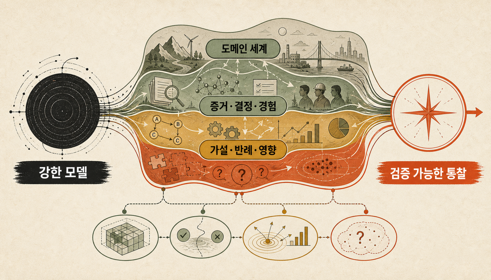
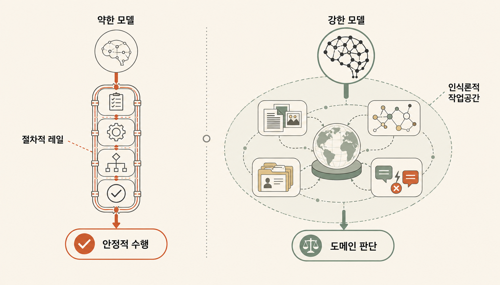
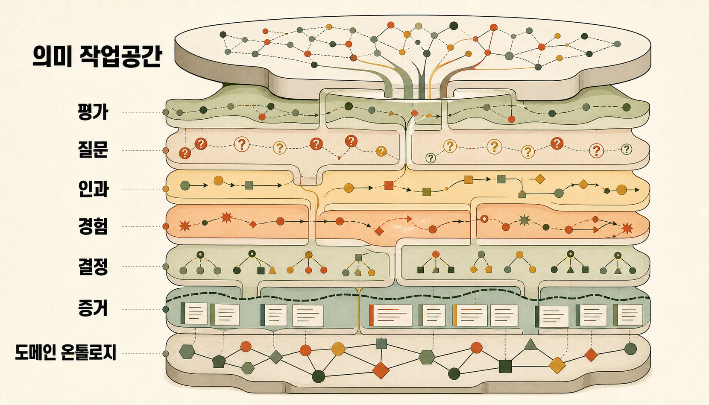
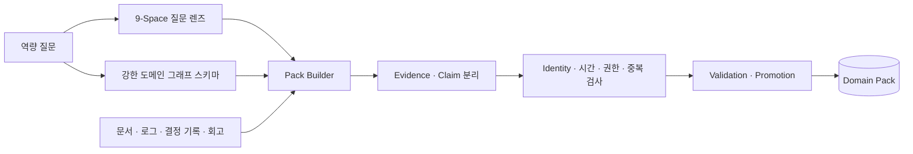
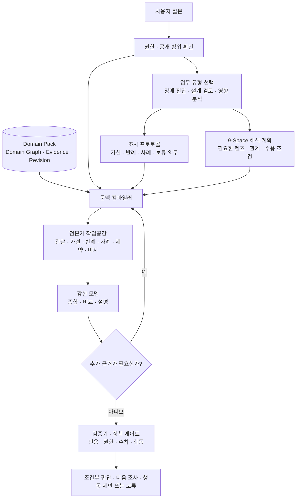
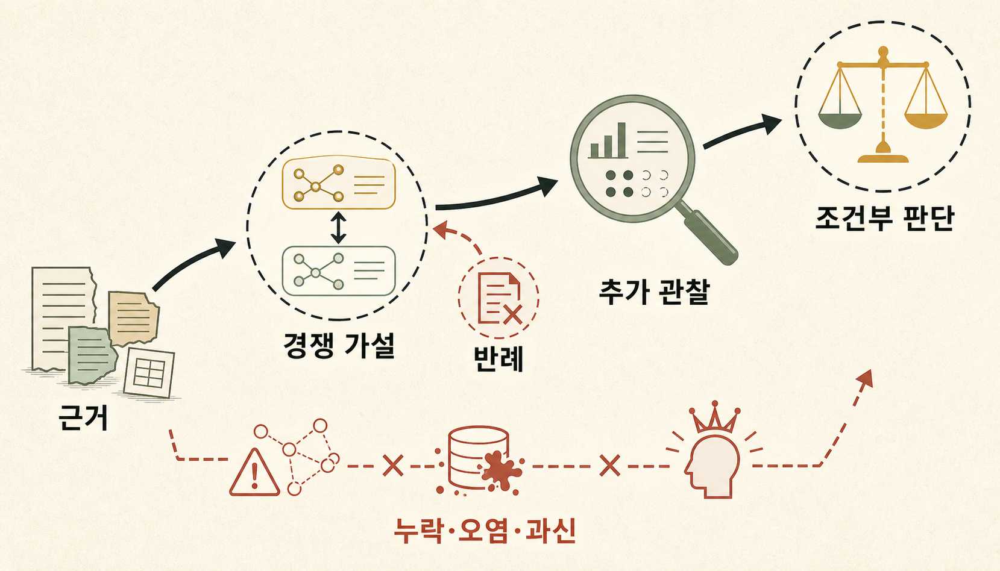

> [!summary] 한 문장 결론
> 약한 모델에는 일을 순서대로 수행하게 하는 레일이 필요합니다. 강한 모델에는 무엇을 믿고 의심하며 더 확인해야 하는지 알려주는 도메인 지도와 증거가 필요합니다.
>
> 온톨로지는 모델 대신 생각하는 장치가 아닙니다. 조직의 실제 세계, 근거, 결정, 실패와 모순을 질문에 맞는 작은 작업공간으로 조립해, 강한 모델이 더 나은 가설과 다음 조사를 만들도록 돕는 장치에 가깝습니다.

새로 합류한 유능한 엔지니어에게 장애 보고서 500개를 건넸다고 해보겠습니다. 모든 문서를 검색할 수 있다고 해서 그 사람이 곧바로 시니어가 되지는 않습니다.

시니어는 비슷한 보고서를 찾는 데서 멈추지 않습니다. 지난번과 증상은 같지만 원인이 달랐던 사건을 떠올리고, 당시 결정을 내린 이유와 지금도 유효한 제약을 확인합니다. 현재 가설이 맞다면 함께 변해야 할 지표를 예상하고, 그 지표가 움직이지 않았다면 다른 설명을 찾습니다. 정보가 부족하면 결론을 서두르지 않고 다음에 무엇을 측정할지 말합니다.

이런 판단 구조를 모델 가중치 밖에 저장해 강한 범용 모델에 건넬 수 있을까요?

이 질문에서 출발해 필요한 지식과 실행 구조를 하나씩 분해해봤습니다. 그런데 구축 방식을 구체화할수록 뜻밖의 사실이 보였습니다. 앞선 글에서 살펴본 OpenCrab 안에 이미 상당한 재료가 있었습니다. 새 시스템을 처음부터 발명하기보다, 흩어진 재료를 어떤 원리로 조합하느냐가 더 중요한 문제였습니다.

> [!important] 이 글에서 말하는 학습
> 여기서 학습은 모델 가중치를 바꾸는 파인튜닝이 아닙니다. 모델은 그대로 두고, 외부 지식의 구조와 검색·조립 방식을 다듬어 질문마다 더 나은 작업공간을 제공하는 방법을 다룹니다. 바뀌는 것은 모델의 기억이 아니라 모델이 접근하는 도메인 상태와 판단 재료입니다.

## 1. 장애 보고서 500개를 주면 시니어가 되는가

일반적인 RAG는 질문과 가까운 문서 조각을 찾습니다. 지식그래프는 서비스, 설정, 정책과 사건의 관계를 따라가며 답에 사용한 경로를 남깁니다. Think-on-Graph와 KG-Agent는 LLM이 그래프의 엔티티와 관계를 반복해서 고르며 복합 질문을 푸는 가능성을 보여줬습니다.[src_005](#src-005)[src_006](#src-006) KnowAgent는 행동 지식으로 계획 경로를 제한해 실행 궤적의 환각을 줄이는 방법을 제안합니다.[src_007](#src-007)

그래도 관련 문서를 찾는 능력과 전문가처럼 판단하는 능력 사이에는 간격이 남습니다. 캐시 장애를 예로 들어보겠습니다.

```text
사건 1: 캐시 TTL을 늘린 뒤 오래된 데이터가 노출됐다.
사건 2: 증상은 같았지만 실제 원인은 복제 지연이었다.
결정 기록: 특정 고객 계약 때문에 TTL을 더 낮출 수 없었다.
현재 사건: 배포 직후 읽기 오류만 증가했다.
```

단순 유사도 검색은 사건 1을 가장 먼저 내놓을 수 있습니다. 시니어는 시간 조건과 관측 지표를 사건 2와도 비교합니다. 고객 계약 때문에 가능한 조치가 제한된다는 사실을 확인하고, 두 가설을 가를 다음 측정을 제안합니다.

BRINK는 불완전한 지식 조건에서 KG-RAG의 추론 능력이 제한되며, 그래프에 답이 없을 때 모델이 내부 기억에 기대기도 한다고 보고합니다.[src_008](#src-008) 그래프에 경로가 있다는 사실과 그 경로로 결론을 정당화할 수 있다는 판단은 다릅니다.

도메인의 실제 질문을 반영한 구조도 중요합니다. Narrative World Model은 인물 상태, 시간과 관계 변화를 표현한 시간 그래프에 질문 조건형 검색을 결합해 일반 목적 그래프 메모리와 평면 검색보다 다중 홉 서사 질문에서 나은 결과를 보고했습니다.[src_009](#src-009) 2026년 프리프린트이고 소설 도메인에 한정된 결과지만, 그래프의 크기보다 무엇을 어떤 타입으로 표현하고 꺼내는지가 중요하다는 단서를 줍니다.

목표는 모든 문서를 거대한 그래프로 바꾸는 데 있지 않습니다. 이 도메인의 전문가가 실제로 구분하는 상태, 사건, 판단과 예외를 표현하고, 현재 질문에 필요한 부분만 꺼내야 합니다.

## 2. 약한 모델에는 레일, 강한 모델에는 지도

최근 연구를 보면 에이전트의 성능을 모델 하나의 속성으로 설명하기 어렵습니다. Harness-Bench는 같은 업무 환경에서도 모델과 하네스의 조합에 따라 완료율, 과정 품질, 효율과 실패 방식이 달라진다고 보고하며, 에이전트 능력을 `모델–하네스 구성` 단위로 평가하자고 제안합니다.[src_001](#src-001) ToFu도 성능이 LLM과 주변 오케스트레이션 코드에 함께 달려 있다고 설명합니다.[src_002](#src-002)

Harness-Bench에서는 더 강한 모델 백엔드가 평균 성능은 높고 하네스 간 편차는 더 작은 경향을 보였습니다.[src_001](#src-001) 그렇다고 계획, 복구와 컨텍스트 관리가 계속 모델 안으로 흡수된다는 보편 법칙이 입증된 것은 아닙니다. 여기서는 모델이 강해질수록 일부 절차적 보조의 한계효용이 줄 수 있다는 설계 가설로만 받아들입니다.

AOrchestra는 과제마다 `Instruction–Context–Tools–Model` 조합을 동적으로 구성합니다.[src_003](#src-003) 자기개선 에이전트 서베이도 현대 에이전트를 기반 모델과 프롬프트, 메모리, 도구와 제어 로직이 결합된 시스템으로 보고, 개선 대상이 모델 가중치일 수도 스캐폴드일 수도 있다고 구분합니다.[src_004](#src-004)

| 최적화 문제      | 약한 모델을 보완하는 경우                   | 강한 모델을 증폭하는 경우                    |
| ---------------- | ------------------------------------------- | -------------------------------------------- |
| 주된 결함        | 문제 분해, 도구 선택과 상태 추적이 불안정함 | 비공개 사실과 판단 맥락을 모름               |
| 필요한 외부 계층 | 절차, 체크리스트, 제한된 도구와 강한 스키마 | 세계 모형, 사례, 인과 가설, 모순과 결정 이유 |
| 온톨로지의 역할  | 이탈을 막는 레일과 허용 경로                | 무엇을 볼지 정하는 지도와 의미 렌즈          |
| 실패 위험        | 사람이 사고 절차를 지나치게 대신 씀         | 많은 그래프를 주고도 필요한 관계를 못 고름   |
| 바람직한 결과    | 정해진 과정을 안정적으로 수행함             | 낯선 문제에서 근거 있는 가설과 반례를 만듦   |



약한 모델에는 “먼저 A를 확인하고 실패하면 B를 실행하라”는 절차가 도움이 됩니다. 강한 모델에 같은 수준의 세부 절차를 강제하면 더 나은 조사 순서를 선택할 자유를 빼앗거나, 오래된 운영 규칙에 모델을 가둘 수 있습니다.

모델이 강해진다고 외부 계층이 사라지는 것은 아닙니다. 무게중심이 절차에서 세계 모형과 증거로 옮겨갑니다. 모델이 아무리 강해도 조직 내부 장애 기록, 미공개 설계 결정, 고객 계약의 예외와 팀의 위험 기준을 저절로 알 수는 없습니다.

시니어처럼 말하게 하는 것과 시니어가 쓰는 판단 재료를 제공하는 일도 구분해야 합니다.

| 시니어 페르소나 프롬프트     | 온톨로지 기반 작업공간         |
| ---------------------------- | ------------------------------ |
| 말투와 답변 형식을 바꿈      | 사용할 증거와 관계를 바꿈      |
| 일반적인 조언을 생성함       | 조직 내부 사건과 결정에 근거함 |
| 자신감 있는 답을 만들기 쉬움 | 모순과 미지를 표시함           |
| 모델 기억에 의존함           | 외부 지식과 출처에 의존함      |

이 글의 관심은 오른쪽입니다.

## 3. 시니어의 전문성은 사실 목록이 아니다



시니어의 전문성을 많은 사실을 외운 상태로 보면 온톨로지는 문서 검색 시스템에 머뭅니다. 실제 전문성에는 세계와 증거를 읽는 능력, 판단과 영향을 비교하는 능력, 조사를 설계하고 검증하는 능력이 함께 들어 있습니다.

| 묶음        | 구성요소         | 담는 것                                 | 모델이 하는 일                          |
| ----------- | ---------------- | --------------------------------------- | --------------------------------------- |
| 세계와 증거 | 도메인 의미 지도 | 개념, 상태, 관계, 시간과 권한           | 질문을 도메인 객체와 관계로 해석함      |
| 세계와 증거 | 근거·주장 원장   | 원문, 관찰, 주장, 반박과 출처           | 결론의 근거와 한계를 추적함             |
| 판단과 영향 | 결정·대안 기록   | 목표, 대안, 선택, 이유와 트레이드오프   | 과거 결정의 맥락과 재검토 조건을 이해함 |
| 판단과 영향 | 사례·실패 기억   | 사건, 실패, 휴리스틱, 예외, 조치와 결과 | 현재 문제를 유사·대조 사례와 비교함     |
| 판단과 영향 | 인과·영향 가설   | 원인 후보, 영향 경로, 조건과 지연       | 경쟁 가설과 예상 관찰을 만듦            |
| 조사와 검증 | 전문가 질문 모형 | 역량 질문, 진단 질문과 반례 질문        | 무엇을 더 조사할지 정함                 |
| 조사와 검증 | 판단 검증 계약   | 근거 충실성, 반례, 불확실성과 행동 기준 | 그럴듯한 답과 검토 가능한 판단을 구분함 |

`Evidence: 배포 후 15분 동안 오류율이 4배 증가했다`와 `Claim: 새 캐시 정책이 오류 증가의 주원인이다`는 다른 타입으로 나눠 저장합니다. 관찰과 해석을 하나의 사실로 합치면 가설이 반박된 뒤에도 오염된 결론이 재사용됩니다.

인과 관계도 마찬가지입니다. 직접 의존성인지 간접 경로인지, 관찰된 상관인지 검증된 인과인지, 어떤 조건에서만 효과가 나타나는지 구분합니다. 검증이 끝나지 않은 관계는 법칙이 아니라 인과·영향 가설로 다뤄야 합니다.

결정에는 선택한 안뿐 아니라 버린 대안과 당시 제약을 남깁니다. 사례에는 첫 가설이 왜 틀렸는지, 어떤 조치가 효과가 있었고 어떤 부작용을 낳았는지 기록합니다. 휴리스틱은 정답이 아니라 조사 우선순위로 취급하고 적용 조건, 알려진 예외와 만료 시점을 붙입니다.

Zep은 시간 인식 지식그래프로 대화와 비즈니스 데이터의 역사적 관계를 유지하는 메모리 구조를 제안했습니다.[src_010](#src-010) 그러나 시간 그래프만 만든다고 전문가의 사례 비교 기준이 생기지는 않습니다. 무엇을 같은 사건으로 볼지, 차이를 만든 조건이 무엇인지 도메인 언어로 남겨야 합니다.

전문가가 반복해서 던지는 질문도 지식입니다.

- 이 설명과 맞지 않는 반례는 무엇인가?
- 같은 증상을 만든 다른 원인은 무엇이었는가?
- 이 결정을 무효화하는 조건은 무엇인가?
- 지금 모르는 사실 가운데 판단을 가장 크게 바꿀 것은 무엇인가?

Competency Question은 온톨로지가 답해야 할 요구사항을 질문으로 고정하는 방법입니다. LLM을 이용한 온톨로지 생성 연구도 사용자 스토리와 역량 질문을 입력과 평가에 사용하며, 문법적 타당성과 현업 유용성을 별도 축으로 봅니다.[src_011](#src-011) 여기서는 이 질문을 스키마 테스트에 그치지 않고 전문가의 조사 문법으로 확장합니다.

모든 구성요소에는 출처와 생성 계보, 시간·버전·유효 범위, 접근 권한·공개 범위가 함께 있어야 합니다. 전문가가 말했다고 바로 사실이 되는 것은 아닙니다. 경험은 사례로, 휴리스틱은 조건부 규칙으로, 인과는 검증할 가설로 나눠 기록합니다.

## 4. 새로운 인사이트는 어디에서 나오는가

온톨로지가 새로운 아이디어를 만드는 두뇌는 아닙니다. 강한 모델이 서로 다른 구조를 새 질문 아래 다시 조합할 때 조사할 가치가 있는 가설이 생깁니다.

### 관계 재조합과 사례 대조

서로 다른 문서와 팀에 흩어진 사실을 공통 개체와 영향 경로로 연결합니다.

```text
고객 계약 예외
→ 배포 승인 우회
→ 설정 버전 불일치
→ 특정 지역 장애 반복
```

개별 문서에 전체 사슬이 적혀 있지 않아도 각 연결에 근거가 있다면 새로운 조사 가설을 세울 수 있습니다. 가장 비슷한 사건 하나만 고르지 않고, 증상은 같지만 원인이 달랐던 사건도 함께 봅니다. 앞의 캐시 사례에서는 사건 1과 사건 2의 공통점보다 시간 조건과 관측 지표의 차이가 더 중요합니다.

### 반사실과 모순

결정 기록에 남은 버려진 대안과 인과·영향 가설을 보고 묻습니다.

> 당시 고객 계약 제약이 없었다면 같은 TTL 결정을 내렸을까요?

이 질문은 오래된 아키텍처를 다시 살필 때 유용합니다. 실제 결과를 보장하는 예측이 아니라 검증할 가설을 만드는 질문입니다.

서로 충돌하는 주장도 지우지 않습니다. 시점이 다른지, 대상 고객이나 측정 방식이 다른지, 정책과 실제 실행이 어긋났는지 나눠 봅니다. 합의된 답을 되풀이하는 대신 충돌이 생긴 이유를 조사합니다.

### 미지의 식별

전문가다운 답이 언제나 결론인 것은 아닙니다. 현재 증거로 구분할 수 없는 두 가설을 밝히고, 둘을 가르는 데 정보 가치가 가장 큰 측정을 제안할 수도 있습니다.

```text
질문 → 의미적 문제 구성 → 경쟁 가설 → 근거·반례 탐색
→ 영향 분석 → 추가 조사 설계 → 조건부 판단
```

이 흐름이 일반적인 `검색 → 요약`과 온톨로지 기반 작업공간의 가장 큰 차이입니다. Agentic Reasoning 연구도 도구 사용, 구조화된 기억과 지식그래프 형태의 추론 문맥을 결합해 긴 연구 과정을 관리하는 가능성을 보여줍니다.[src_012](#src-012) 다만 공개 연구는 주로 QA, 계획과 검색 과제를 다룹니다. 온톨로지가 조직의 시니어급 판단을 그대로 재현한다고 확대해석해서는 안 됩니다.

## 5. 여기까지 따라왔다면 OpenCrab이 보인다

여기까지 따라왔다면 한 가지 사실이 보입니다. 시니어형 온톨로지 에이전트에 필요한 재료의 상당 부분이 앞선 [[notes/opencrab-ontology-build-architecture|8번 글]]과 [[notes/ontology-context-compiler-opencrab|9번 글]]에서 살펴본 OpenCrab의 설계와 겹칩니다.[src_013](#src-013)

물론 OpenCrab 안에 완성된 시니어 엔지니어 에이전트가 들어 있는 것은 아닙니다. 발견한 것은 그보다 근본적인 기반입니다. 도메인 세계를 어떤 문법으로 읽고, 어떤 타입과 관계로 보존하며, 어떻게 검증된 Pack으로 만들 것인가라는 문제가 이미 OpenCrab의 중심 설계에 들어 있습니다.

| 앞에서 도출한 필요 조건 | OpenCrab에서 찾은 기반                                   | 더 구체화할 부분                             |
| ----------------------- | -------------------------------------------------------- | -------------------------------------------- |
| 도메인 의미 지도        | 도메인 그래프와 canonical grammar                        | 현업 타입과 관계를 강한 스키마로 설계        |
| 질문에 따른 의미 전환   | Subject부터 Policy까지 아우르는 9-Space 문법             | 질문별 우선 렌즈와 수용 조건                 |
| 근거와 변경 이력        | Material, Evidence, validation, promotion, revision 계약 | 전체 빌드 경로에서 검증·승격을 일관되게 강제 |
| 복합 검색               | Vector·BM25·Graph를 조합하는 HybridQuery 기반            | 유사 사례뿐 아니라 대조 사례와 반례까지 검색 |
| 질문별 문맥             | QueryPlan과 AnswerBundle로 향하는 문맥 편성 방향         | 전문가 작업공간의 명시적 계약                |
| 안전한 판단             | 권한·인용·거버넌스로 확장할 구조적 기반                  | 권한 선행 필터, 반복 검증과 행동 게이트      |

OpenCrab의 장점은 9-Space라는 고정 분류표에 모든 도메인을 억지로 끼워 맞추는 데 있지 않습니다. 9-Space는 Subject, Resource, Evidence, Concept, Claim, Community, Outcome, Lever, Policy라는 공통 질문을 제공합니다. 도메인 그래프는 그 아래에서 `CacheSetting`, `ReadReplicaLag`, `EnterpriseSLA` 같은 현업의 구체적 타입과 `AFFECTS`, `OCCURRED_AFTER`, `REJECTED_BECAUSE` 같은 관계를 유지합니다.

이 두 축을 나눠 쓰면 유연성과 강한 스키마를 함께 얻습니다.

- 도메인 타입은 “이것이 무엇인가”를 고정합니다.
- 9-Space는 “이번 질문에서 이것을 어떤 역할로 볼 것인가”를 바꿉니다.
- 같은 `CacheSetting`도 장애 진단에서는 Claim을 검토할 단서가 되고, 영향 분석에서는 Lever가 되며, 변경 승인 질문에서는 Policy와 함께 읽힙니다.

공통 렌즈가 질문의 방향을 잡고, 도메인 스키마는 현업의 의미를 붙듭니다. 이 조합이 OpenCrab을 단순한 범용 그래프 저장소와 다르게 만듭니다.

## 6. 핵심은 Pack 빌드에서 이미 결정된다

시니어형 에이전트의 품질은 좋은 모델을 붙이는 순간보다 Pack을 설계하고 빌드하는 단계에서 먼저 갈립니다. 런타임은 Pack에 없는 결정 이유를 복원할 수 없고, 관찰과 주장이 합쳐진 그래프에서 믿을 만한 반례를 만들 수도 없습니다.

Pack 빌드는 문서를 많이 넣는 작업이 아닙니다. 이 도메인에서 어떤 판단을 잘해야 하는지 먼저 정하고, 그 판단에 필요한 세계를 검증 가능한 구조로 컴파일하는 일입니다.

```text
역량 질문 정의
→ 도메인 타입과 관계 설계
→ 질문에 필요한 9-Space 렌즈 매핑
→ 원문에서 Node·Edge 후보 추출
→ Evidence와 Claim, 사건과 결정 분리
→ Identity·중복·시간·권한 검사
→ 후보 지식 검증과 promotion
→ 검색 인덱스와 함께 Domain Pack으로 배포
```

첫 단계는 스키마가 아니라 질문입니다.

```text
장애 진단: 왜 이 현상이 지금 이 범위에서 발생했는가?
설계 검토: 이 선택의 전제와 버린 대안은 무엇이었는가?
변경 영향 분석: 이 조치가 누구에게 어떤 경로로 영향을 주는가?
```

이 질문을 풀려면 어떤 개체와 관계가 필요한지 거꾸로 설계합니다. 캐시 도메인이라면 설정, 배포, 읽기 경로, 복제 지연, 고객 계약, 장애와 롤백 결정을 도메인 타입으로 둡니다. 그 위에 Evidence와 Claim을 분리하고, 결정의 이유와 버린 대안, 유사·대조 사례, 인과·영향 가설, 적용 조건과 만료 시점을 연결합니다.

9-Space는 이 과정에서 두 역할을 합니다. 빌드할 때는 빠진 관점을 찾는 질문 집합이 되고, 질의할 때는 같은 그래프에서 어떤 의미 경로를 우선할지 정하는 렌즈가 됩니다. 아홉 칸을 모두 채우는 체크리스트로 사용하면 안 됩니다. 근거가 없는 Policy나 Claim은 억지로 만들지 않고 비워둬야 합니다.



Pack에는 최종 결론만 들어가면 안 됩니다. 시니어의 판단을 재현하려면 다음 재료가 함께 살아 있어야 합니다.

| Pack에 남길 것        | 이유                                             |
| --------------------- | ------------------------------------------------ |
| 도메인 객체와 관계    | 조직의 실제 세계와 언어를 보존함                 |
| 직접 Evidence와 Claim | 관찰과 해석을 분리하고 주장을 반박할 수 있게 함  |
| 결정과 버린 대안      | 현재 구조가 만들어진 이유와 재검토 조건을 복원함 |
| 유사·대조 사례        | 닮은 증상에 성급히 고착되지 않게 함              |
| 인과·영향 가설        | 다음 관찰과 변경 영향을 예측할 출발점을 제공함   |
| 전문가 질문과 미지    | 무엇을 더 조사해야 하는지 알려줌                 |
| 출처·버전·권한        | 지식의 유효 범위와 사용 가능한 경계를 정함       |

그래서 핵심은 OpenCrab 위에 화려한 에이전트 루프를 먼저 얹는 일이 아닙니다. 9-Space 문법의 유연한 렌즈와 도메인의 강한 그래프 스키마를 함께 사용해, 좋은 판단 재료가 처음부터 Pack에 들어가도록 만드는 일입니다. 질문별 작업공간과 검증기는 그 Pack을 제대로 소비하기 위한 다음 단계입니다.

공개 저장소를 분석한 시점의 OpenCrab은 이 전체 흐름을 완전히 강제하는 제품이라기보다, 온톨로지 공장과 Hybrid Retriever로 발전할 설계 계약과 부분 구현을 갖춘 기반에 가깝습니다. 아래의 조사 프로토콜, 대조 사례 재검색과 임시 작업공간은 그 기반을 조합한 제안이지 이미 완성된 공식 기능은 아닙니다.

## 7. 좋은 Pack을 질문별 전문가 작업공간으로 바꾼다

Pack을 잘 만들었다면 이제 질문에 맞는 작은 작업공간으로 꺼내야 합니다. 역할은 다섯 가지로 나눌 수 있습니다.

| 계층              | 맡는 일                                                                 |
| ----------------- | ----------------------------------------------------------------------- |
| Domain Pack       | 사실, 사건, 결정, 사례, 도메인 휴리스틱과 근거를 보존합니다.            |
| 조사 프로토콜     | 경쟁 가설, 반례, 사례 대조, 보류와 행동 검토 같은 공통 의무를 정합니다. |
| 9-Space 해석 계획 | 이번 질문에서 필요한 렌즈, 관계와 수용 조건을 정합니다.                 |
| 문맥 컴파일러     | 권한 범위 안에서 Pack과 계획을 작은 작업공간으로 조립합니다.            |
| LLM과 검증기      | LLM은 종합·비교·설명을, 검증기는 인용·권한·수치·안전을 맡습니다.        |

Pack은 저장 단위이고 문맥 컴파일러는 선택기입니다. 전문가 작업공간은 이번 사건을 위해 조립한 작은 자료집이며, 모델은 그 자료를 읽고 조사하는 분석가입니다.

조사 프로토콜은 모델의 문장을 대신 쓰는 절차서가 아닙니다. 답변 전에 어떤 검토 결과가 존재해야 하는지를 정하는 최소 계약입니다.

```yaml
obligations:
  - observation과 interpretation을 분리한다
  - 경쟁 가설을 둘 이상 검토한다
  - 각 가설의 지지·반대 근거를 찾는다
  - 유사 사례와 대조 사례를 함께 비교한다
  - 가설을 구분할 다음 관찰을 제안한다
  - 근거가 부족하면 보류한다
```



권한 검사는 검색 뒤가 아니라 앞에 와야 합니다. 접근할 수 없는 고객 계약, 보안 구성과 장애 기록은 검색 후보와 모델 문맥에 처음부터 들어가지 않아야 합니다. 마지막 정책 게이트는 답변과 행동 제안을 다시 검사하지만, 선행 권한 필터를 대신하지는 못합니다.

문맥 컴파일러도 단순한 top-k 목록을 만들지 않습니다. 현재 사건의 시간과 범위를 고정하고, 직접 관찰과 해석을 분리합니다. 경쟁 Claim과 반대 Evidence, 가장 비슷한 사건과 결정적으로 다른 사건을 한 쌍으로 고릅니다. 과거 Decision과 당시 Assumption, 관련 Lever와 Outcome 경로, 적용되는 Policy를 보충한 뒤 근거가 없는 부분은 `Missing`으로 남깁니다.

```yaml
scope:
  incident: CacheExposureIncident-042
  time_window: ...

observations: [...]
hypotheses: [...]
supporting_evidence: [...]
counterevidence: [...]

similar_cases: [...]
contrasting_cases: [...]
past_decisions: [...]
constraints: [...]

impact_paths: [...]
unknowns: [...]
next_tests: [...]
citations: [...]
pack_revision: ...
retrieval_receipt: ...
```

이 형식은 영구 그래프의 새 스키마가 아니라 한 질문을 위해 만든 임시 작업공간입니다. 현재 OpenCrab Pack v1의 공식 필드나 API 응답 형식도 아닙니다. 중요한 것은 필드 이름보다 관찰, 가설, 반례, 제약과 미지를 한 문맥 안에서 구분해 모델에 건네는 일입니다.

한 번 검색하고 바로 답하면 첫 결과에 고착되기 쉽습니다. 초기 작업공간에서 모델이 경쟁 가설을 제안하면, 가설별 반대 근거와 대조 사례를 다시 찾고, 누락된 Policy와 영향 경로를 보충한 뒤 최종 판단으로 넘어갑니다.

## 8. 같은 질문도 세 시스템은 다르게 처리한다

앞의 캐시 질문으로 돌아가겠습니다.

> 배포 이후 오래된 데이터 노출이 반복되는 이유는 무엇이며, 가장 안전한 다음 조치는 무엇입니까?

일반 RAG는 관련 장애 보고서, 캐시 운영 문서와 배포 기록을 찾아 요약합니다. 빠르지만 관찰과 원인 가설을 분리하거나 과거 결정의 전제와 반례를 반드시 찾지는 않습니다.

OpenCrab의 HybridQuery 기반은 Vector·BM25·Graph를 조합해 `CacheExposureIncident`, `CacheTTLSetting`, `InvalidationFailure`, `ReadReplicaLag`, `EnterpriseSLA` 같은 관련 개체와 주변 관계를 함께 가져올 수 있습니다. 일반 RAG보다 관계 맥락은 풍부해집니다. 다만 결과가 평평한 목록에 머문다면 무엇을 어떤 순서로 검토할지는 여전히 모델과 프롬프트에 크게 의존합니다.

질문별 전문가 작업공간은 한 걸음 더 나아갑니다.

1. 배포 이후의 오류 범위, 읽기 경로, 고객과 시간대를 관찰로 고정합니다.
2. `캐시 무효화 실패`와 `읽기 복제본 지연 또는 라우팅 변화`를 경쟁 가설로 둡니다.
3. 캐시를 거치지 않은 읽기에서도 같은 문제가 있는지처럼 각 가설의 반대 근거를 찾습니다.
4. TTL을 낮추지 못했던 고객 계약, 당시 버린 대안과 지금도 유효한 제약을 복원합니다.
5. 두 가설을 가장 잘 구분할 다음 관찰과 제한된 범위의 가역 조치를 제안합니다.

좋은 답은 “원인은 이것입니다”라는 한 문장이 아닐 수 있습니다.

> 현재 근거는 캐시 무효화 실패 가설을 더 지지합니다. 다만 캐시를 거치지 않은 읽기 경로의 자료가 없어 복제본 지연 가설을 배제할 수 없습니다. 먼저 두 경로의 동일 시간대 지표를 비교해야 합니다. TTL 변경은 고객 SLA와 읽기 부하에 영향을 줄 수 있으므로 전면 적용보다 제한된 범위의 가역 실험이 적절합니다.

조건부 판단과 다음 조사 계획을 함께 내는 것이 하나의 원인을 자신 있게 단정하는 것보다 시니어의 행동에 가깝습니다.

## 9. 그럴듯한 새 말과 도메인 인사이트를 구분한다



모델이 문서에 없는 문장을 만들었다고 모두 새로운 인사이트는 아닙니다. 최소한 다음 여섯 가지를 확인해야 합니다.

| 검증 문                          | 실패하면 생기는 문제                      |
| -------------------------------- | ----------------------------------------- |
| 전제가 원문과 연결되는가         | 근거 없는 조합이 사실처럼 보임            |
| 경쟁 가설이 있는가               | 첫 설명에 고착됨                          |
| 반례와 대조 사례를 찾았는가      | 확인 편향이 강화됨                        |
| 추가 관찰을 예측하는가           | 검증할 수 없는 이야기가 됨                |
| 모르는 범위를 표시하는가         | 그래프의 빈칸을 모델 기억으로 조용히 채움 |
| 행동 전 권한과 정책을 검사하는가 | 그럴듯하지만 위험한 실행으로 이어짐       |

외부 문맥을 줬다고 모델이 그 근거에 충실해지는 것은 아닙니다. 정답을 맞혀도 제공된 문맥을 실제 근거로 사용하지 않을 수 있다는 연구 결과가 있습니다.[src_014](#src-014) 지식 Pack과 장기 메모리는 오염 공격의 대상이 될 수도 있습니다.[src_015](#src-015) 후보 지식과 운영 지식을 분리하고, 출처·승인·롤백 없는 자동 승격을 막아야 합니다.

평가도 검색 적중률에서 끝나면 안 됩니다. 경쟁 가설의 질, 중요한 반례를 찾은 비율, 적절한 보류, 과거 결정의 조건을 잘못 일반화한 비율, 사람이 수정해야 한 핵심 전제 수를 함께 봐야 합니다. 좋은 평가 세트에는 증거가 부족해 결론을 보류해야 하는 사례와 가장 비슷한 과거 사례가 오답을 유도하는 사례도 들어가야 합니다.

## 10. 무엇부터 만들 것인가

처음부터 거대한 시스템을 만들 필요는 없습니다. 기존 OpenCrab 재료를 활용한다면 Pack 빌드의 품질부터 고정하고, 그 다음 질의 런타임으로 넘어가는 순서가 맞습니다.

| 우선순위 | 먼저 만들 것                             | 확인할 기준                                                |
| -------- | ---------------------------------------- | ---------------------------------------------------------- |
| 1        | 역량 질문과 도메인 그래프 스키마         | 현업의 판단 질문이 타입과 관계에 반영되는가                |
| 2        | 9-Space 매핑과 Evidence·Claim 분리       | 공통 렌즈를 쓰면서 도메인 의미와 관찰·해석 경계를 지키는가 |
| 3        | lineage, revision, validation, promotion | 중요한 노드와 관계가 원문과 버전으로 돌아가고 검증됐는가   |
| 4        | 권한 필터가 선행된 문맥 컴파일러         | 허용되지 않은 근거가 검색과 작업공간에 들어오지 않는가     |
| 5        | 전문가 작업공간, 반례 재검색과 검증기    | 대조 사례와 반대 근거를 찾고 인용·권한·행동을 검사하는가   |

이 순서는 OpenCrab을 다른 시스템으로 갈아엎자는 제안이 아닙니다. OpenCrab의 장점인 9-Space 문법, 도메인 그래프, Pack 빌드와 HybridQuery를 하나의 흐름으로 완성하자는 제안입니다. 강한 모델에는 세세한 사고 순서를 강요하지 않고, 답변 전에 반드시 갖춰야 할 증거와 반례, 제약과 보류 조건만 계약으로 남깁니다.

## 11. 무엇까지 외부화할 수 있는가

좋은 온톨로지와 작업공간을 만들어도 인간 시니어의 모든 전문성을 복제할 수는 없습니다. 사람의 전문성에는 시스템을 직접 운영하며 얻은 감각, 실시간 현장의 약한 신호, 책임을 지며 형성된 위험 감각, 문서화하기 어려운 조직·사업 맥락이 함께 들어 있습니다.

그래프는 틀린 지식도 일관되게 연결할 수 있습니다. 과거의 조직 편견과 임시 타협을 구조화하면 더 오래, 더 권위 있게 재사용할 위험도 있습니다.

현실적인 목표는 시니어 엔지니어를 파일로 복제하는 것이 아닙니다.

> 강한 범용 모델이 조직의 실제 세계, 근거, 결정, 실패와 제약을 빠르게 이해하고, 일반 RAG보다 나은 가설·반례·영향·다음 조사를 만들도록 돕는다.

이 글은 처음에 온톨로지로 어떤 지식을 외부화해야 하는지 물었습니다. 그 답을 따라가다 보니 OpenCrab의 9-Space 문법, Domain Graph, Evidence 계약, Pack 빌드와 HybridQuery가 상당한 기반을 이미 제공한다는 사실을 발견했습니다.

가장 중요한 일은 Pack 빌드부터 잘 설계하는 것입니다. 9-Space의 유연한 질문 렌즈와 도메인의 강한 그래프 스키마를 함께 쓰고, Evidence와 Claim, 결정과 사례, 반례와 미지를 검증 가능한 상태로 Pack에 남겨야 합니다. 그 다음 문맥 컴파일러가 질문별 작업공간을 만들고, 강한 모델과 검증기가 조사와 안전의 경계를 나눠 맡습니다.

온톨로지는 시니어처럼 말하게 만드는 프롬프트가 아닙니다. 모델이 조직의 세계 안에서 무엇을 알고, 무엇을 의심하고, 무엇을 더 확인해야 하는지 판단하도록 돕는 작업환경입니다. 이 조건을 갖출 때 강한 모델의 일반 추론 능력과 조직의 축적된 전문성이 비로소 같은 문제를 함께 풀 수 있습니다.

## 함께 읽기

- [[notes/opencrab-ontology-build-architecture|8. OpenCrab 온톨로지 빌드는 무엇을 만드는가]]
- [[notes/ontology-context-compiler-opencrab|9. LLM 시대, 온톨지는 추론기에서 문맥 컴파일러로 이동하는가]]
- [[notes/ontology-emergent-agent|4. 온톨로지가 행동을 바꾸는 에이전트]]
- [[notes/local-ontology-agent-implementation|7. 로컬 온톨로지 에이전트 구현 설계]]

## 불확실성과 한계

- 조사 프로토콜과 질문별 전문가 작업공간은 OpenCrab의 공식 규격이나 완성된 구현이 아니라 이 글의 설계 제안입니다.
- 9-Space를 질문별 해석 렌즈로 사용하는 방향과 현재 canonical grammar 구현 사이에는 여전히 간격이 있습니다.
- Harness-Bench, ToFu, AOrchestra, Narrative World Model과 자기개선 에이전트 자료는 2026년 자료이며 일부는 프리프린트입니다.
- 공개 연구는 주로 QA, 검색, 계획과 서사 기억을 평가합니다. 조직의 비공개 지식으로 장기간 시니어 엔지니어급 판단을 비교한 표준 실험은 확인되지 않았습니다.
- 강한 모델이 구조화된 작업공간을 일반 문서 문맥보다 항상 더 잘 활용한다는 보장은 없습니다. 모델, 도메인, 검색 정책과 컨텍스트 예산에 따라 별도 평가가 필요합니다.

## 참고 자료

- <a id="src-001"></a> **src_001** — Yao, Y. et al. (2026). _Harness-Bench: Measuring Harness Effects across Models in Realistic Agent Workflows_. arXiv:2605.27922. [원문](https://arxiv.org/abs/2605.27922)
- <a id="src-002"></a> **src_002** — Ruan, J. et al. (2026). _ToFu: A White-Box, Token-Efficient Agent Harness for Researchers_. arXiv:2607.11423. [원문](https://arxiv.org/abs/2607.11423)
- <a id="src-003"></a> **src_003** — Ruan, J. et al. (2026). _AOrchestra: Automating Sub-Agent Creation for Agentic Orchestration_. arXiv:2602.03786. [원문](https://arxiv.org/abs/2602.03786)
- <a id="src-004"></a> **src_004** — Ren, Z. et al. (2026). _Self-Improvements in Modern Agentic Systems: A Survey_. arXiv:2607.13104. [원문](https://arxiv.org/abs/2607.13104)
- <a id="src-005"></a> **src_005** — Sun, J. et al. (2024). _Think-on-Graph: Deep and Responsible Reasoning of Large Language Model on Knowledge Graph_. ICLR 2024. [원문](https://openreview.net/forum?id=nnVO1PvbTv)
- <a id="src-006"></a> **src_006** — Jiang, J. et al. (2025). _KG-Agent: An Efficient Autonomous Agent Framework for Complex Reasoning over Knowledge Graph_. ACL 2025. [원문](https://aclanthology.org/2025.acl-long.468/)
- <a id="src-007"></a> **src_007** — Zhu, Y. et al. (2025). _KnowAgent: Knowledge-Augmented Planning for LLM-Based Agents_. Findings of NAACL 2025. [원문](https://aclanthology.org/2025.findings-naacl.205/)
- <a id="src-008"></a> **src_008** — Zhou, D. et al. (2026). _What Breaks Knowledge Graph based RAG? Benchmarking and Empirical Insights into Reasoning under Incomplete Knowledge_. EACL 2026. [원문](https://aclanthology.org/2026.eacl-long.114/)
- <a id="src-009"></a> **src_009** — Saifullah, M. et al. (2026). _Narrative World Model: Narratology-Grounded Writer Memory for Long-Form Fiction_. arXiv:2607.05577. [원문](https://arxiv.org/abs/2607.05577)
- <a id="src-010"></a> **src_010** — Rasmussen, P. et al. (2025). _Zep: A Temporal Knowledge Graph Architecture for Agent Memory_. arXiv:2501.13956. [원문](https://arxiv.org/abs/2501.13956)
- <a id="src-011"></a> **src_011** — Lippolis, A. S. et al. (2025). _Ontology Generation using Large Language Models_. arXiv:2503.05388. [원문](https://arxiv.org/abs/2503.05388)
- <a id="src-012"></a> **src_012** — Wu, J. et al. (2025). _Agentic Reasoning: A Streamlined Framework for Enhancing LLM Reasoning with Agentic Tools_. ACL 2025. [원문](https://aclanthology.org/2025.acl-long.1383/)
- <a id="src-013"></a> **src_013** — OpenCrab, [public integration repository at analyzed commit](https://github.com/AlexAI-MCP/OpenCrab/tree/d34352cec9d99c755c1e891f811911461a460280), accessed 2026-07-22.
- <a id="src-014"></a> **src_014** — Lee, H. et al. (2024). _How Well Do Large Language Models Truly Ground?_. NAACL 2024. [원문](https://aclanthology.org/2024.naacl-long.135/)
- <a id="src-015"></a> **src_015** — Chen, Z. et al. (2024). _AgentPoison: Red-teaming LLM Agents via Poisoning Memory or Knowledge Bases_. NeurIPS 2024. [원문](https://proceedings.neurips.cc/paper_files/paper/2024/hash/eb113910e9c3f6242541c1652e30dfd6-Abstract-Conference.html)
