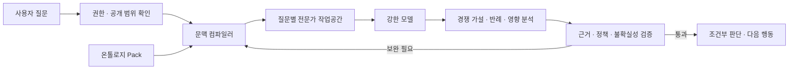

> [!summary] 한 문장 결론
> 약한 모델에는 일을 순서대로 수행하게 하는 레일이 필요합니다. 강한 모델에는 무엇을 믿고 의심하며 더 확인해야 하는지 알려주는 도메인 지도와 증거가 필요합니다.
>
> 이 글은 온톨로지에 근거, 과거 결정, 실패 사례, 인과 가설과 전문가 질문을 더한 지식 묶음을 잠정적으로 `Ontology Expertise Pack`이라고 부릅니다. Pack은 모델 대신 생각하지 않습니다. 질문에 필요한 세계와 논쟁거리를 조립해 모델이 더 나은 가설을 세우도록 돕습니다.

새로 합류한 유능한 엔지니어에게 장애 보고서 500개를 건넸다고 해보겠습니다. 모든 문서를 검색할 수 있다고 해서 그 사람이 바로 시니어가 되지는 않습니다.

시니어는 비슷한 보고서를 찾는 데서 멈추지 않습니다. 지난번과 증상은 같지만 원인이 달랐던 사건을 떠올리고, 당시 결정을 내린 이유와 지금도 유효한 제약을 확인합니다. 현재 가설이 맞다면 함께 변해야 할 지표를 예상하고, 그 지표가 움직이지 않았다면 다른 설명을 찾습니다. 정보가 부족하면 섣불리 결론을 내리는 대신 다음에 무엇을 측정할지 말합니다.

이런 판단 구조를 모델 가중치 밖에 저장해 강한 범용 모델에 건넬 수 있을까요?

> [!important] 이 글에서 말하는 학습
> 여기서 학습은 모델 가중치를 바꾸는 파인튜닝이 아닙니다. 모델은 그대로 두고, 외부 지식의 구조와 검색·조립 방식을 다듬어 질문마다 더 나은 작업공간을 제공하는 방법을 다룹니다. 바뀌는 것은 모델의 기억이 아니라 모델이 접근하는 도메인 상태와 판단 재료입니다.

## 1. 장애 보고서 500개를 주면 시니어가 되는가

일반적인 RAG는 질문과 가까운 문서 조각을 찾습니다. 지식그래프는 서비스, 설정, 정책과 사건의 관계를 따라가며 답에 사용한 경로를 남깁니다. Think-on-Graph와 KG-Agent는 LLM이 그래프의 엔티티와 관계를 반복해서 고르며 복합 질문을 푸는 가능성을 보여줬습니다.[src_005](#src-005)[src_006](#src-006) KnowAgent는 행동 지식으로 계획 경로를 제한해 실행 궤적의 환각을 줄이는 방법을 제안합니다.[src_007](#src-007)

그래도 관련 문서를 찾는 능력과 전문가처럼 판단하는 능력 사이에는 간격이 남습니다. 캐시 장애를 조사한다고 해보겠습니다.

```text
사건 1: 캐시 TTL을 늘린 뒤 오래된 데이터가 노출됐다.
사건 2: 증상은 같았지만 실제 원인은 복제 지연이었다.
결정 기록: 특정 고객 계약 때문에 TTL을 더 낮출 수 없었다.
현재 사건: 배포 직후 읽기 오류만 증가했다.
```

단순 유사도 검색은 사건 1을 가장 먼저 내놓을 수 있습니다. 시니어는 시간 조건과 관측 지표를 사건 2와도 비교합니다. 고객 계약 때문에 가능한 조치가 제한된다는 사실을 확인하고, 두 가설을 가를 다음 측정을 제안합니다.

BRINK는 불완전한 지식 조건에서 KG-RAG의 추론 능력이 제한되며, 그래프에 답이 없을 때 모델이 내부 기억에 기대기도 한다고 보고합니다.[src_008](#src-008) 경로가 존재한다는 사실과 그 경로로 결론을 정당화할 수 있다는 판단은 다릅니다.

도메인의 실제 질문을 반영한 구조가 중요하다는 연구도 있습니다. Narrative World Model은 인물 상태, 시간과 관계 변화를 표현한 시간 그래프에 질문 조건형 검색을 결합해 일반 목적 그래프 메모리와 평면 검색보다 다중 홉 서사 질문에서 나은 결과를 보고했습니다.[src_009](#src-009) 2026년 프리프린트이고 소설 도메인에 한정된 결과지만, 그래프의 크기보다 무엇을 어떤 타입으로 표현하고 꺼내는지가 중요하다는 단서를 줍니다.

목표는 모든 문서를 거대한 그래프로 바꾸는 데 있지 않습니다. 이 도메인의 전문가가 실제로 구분하는 상태, 사건, 판단과 예외를 표현하고, 현재 질문에 필요한 부분만 꺼내야 합니다.

## 2. 이 글에서 쓰는 네 단어

비슷한 표현이 섞이면 하나의 시스템이 여러 시스템처럼 보입니다. 이 글에서는 역할을 네 가지로 고정합니다.

| 용어            | 역할                                                |
| --------------- | --------------------------------------------------- |
| 온톨로지 Pack   | 장기간 보관하는 도메인 지식 정본                    |
| 문맥 컴파일러   | 질문에 필요한 지식, 반례와 제약을 고르는 장치       |
| 전문가 작업공간 | 이번 질문을 위해 조립한 작은 사건 자료집            |
| 강한 모델       | 작업공간 안에서 가설, 비판과 설명을 수행하는 추론자 |

Pack은 저장 단위이고 문맥 컴파일러는 선택기입니다. 전문가 작업공간은 이번 사건의 자료집이며, 모델은 그 자료를 읽고 조사하는 분석가입니다. 앞선 [[notes/ontology-context-compiler-opencrab|온톨로지를 문맥 컴파일러로 보는 관점]]은 두 번째 역할을 다뤘습니다. 이번 글은 네 역할이 함께 작동할 때 판단이 어떻게 달라지는지를 묻습니다.

시니어처럼 말하게 하는 것과 시니어가 쓰는 판단 재료를 제공하는 일은 다릅니다.

| 시니어 페르소나 프롬프트     | 전문가 지식 Pack               |
| ---------------------------- | ------------------------------ |
| 말투와 답변 형식을 바꿈      | 사용할 증거와 관계를 바꿈      |
| 일반적인 조언을 생성함       | 조직 내부 사건과 결정에 근거함 |
| 자신감 있는 답을 만들기 쉬움 | 모순과 미지를 표시함           |
| 모델 기억에 의존함           | 외부 지식과 출처에 의존함      |

이 글의 관심은 왼쪽이 아니라 오른쪽입니다.

## 3. 약한 모델에는 레일, 강한 모델에는 지도

최근 연구를 보면 에이전트의 성능을 모델 하나의 속성으로 설명하기 어렵습니다. Harness-Bench는 같은 업무 환경에서도 모델과 하네스의 조합에 따라 완료율, 과정 품질, 효율과 실패 방식이 달라진다고 보고하며, 에이전트 능력을 `모델–하네스 구성` 단위로 평가하자고 제안합니다.[src_001](#src-001) ToFu도 성능이 LLM과 주변 오케스트레이션 코드에 함께 달려 있다고 설명합니다.[src_002](#src-002)

Harness-Bench에서는 더 강한 모델 백엔드가 평균 성능은 높고 하네스 간 편차는 더 작은 경향을 보였습니다.[src_001](#src-001) 그렇다고 계획, 복구와 컨텍스트 관리가 계속 모델 안으로 흡수된다는 보편 법칙이 입증된 것은 아닙니다. 여기서는 모델이 강해질수록 일부 절차적 보조의 한계효용이 줄 수 있다는 설계 가설로만 받아들입니다.

AOrchestra는 과제마다 `Instruction–Context–Tools–Model` 조합을 동적으로 구성합니다.[src_003](#src-003) 자기개선 에이전트 서베이도 현대 에이전트를 기반 모델과 프롬프트, 메모리, 도구와 제어 로직이 결합된 시스템으로 보고, 개선 대상이 모델 가중치일 수도 스캐폴드일 수도 있다고 구분합니다.[src_004](#src-004)

| 최적화 문제      | 약한 모델을 보완하는 경우                   | 강한 모델을 증폭하는 경우                    |
| ---------------- | ------------------------------------------- | -------------------------------------------- |
| 주된 결함        | 문제 분해, 도구 선택과 상태 추적이 불안정함 | 비공개 사실과 판단 맥락을 모름               |
| 필요한 외부 계층 | 절차, 체크리스트, 제한된 도구와 강한 스키마 | 세계 모형, 사례, 인과 가설, 모순과 결정 이유 |
| 온톨로지의 역할  | 이탈을 막는 레일과 허용 경로                | 무엇을 볼지 정하는 지도와 의미 렌즈          |
| 실패 위험        | 사람이 사고 절차를 지나치게 대신 씀         | 많은 그래프를 주고도 필요한 관계를 못 고름   |
| 바람직한 결과    | 정해진 과정을 안정적으로 수행함             | 낯선 문제에서 근거 있는 가설과 반례를 만듦   |


약한 모델에는 “먼저 A를 확인하고 실패하면 B를 실행하라”는 절차가 도움이 됩니다. 강한 모델에 같은 수준의 세부 절차를 강제하면 더 나은 조사 순서를 선택할 자유를 빼앗거나, 오래된 운영 규칙에 모델을 가둘 수 있습니다.

모델이 강해진다고 외부 계층이 사라지는 것은 아닙니다. 무게중심이 절차에서 세계 모형과 증거로 옮겨갑니다. 모델이 아무리 강해도 조직 내부 장애 기록, 미공개 설계 결정, 고객 계약의 예외와 팀의 위험 기준을 저절로 알 수는 없습니다.

## 4. 시니어의 전문성은 사실 목록이 아니다


시니어의 전문성을 많은 사실을 외운 상태로 보면 Pack은 문서 검색 시스템에 머뭅니다. 실제 전문성에는 세계와 증거를 읽는 능력, 판단과 영향을 비교하는 능력, 조사를 설계하고 검증하는 능력이 함께 들어 있습니다.

| 묶음        | 구성요소         | 담는 것                                 | 모델이 하는 일                          |
| ----------- | ---------------- | --------------------------------------- | --------------------------------------- |
| 세계와 증거 | 도메인 의미 지도 | 개념, 상태, 관계, 시간과 권한           | 질문을 도메인 객체와 관계로 해석함      |
| 세계와 증거 | 근거·주장 원장   | 원문, 관찰, 주장, 반박과 출처           | 결론의 근거와 한계를 추적함             |
| 판단과 영향 | 결정·대안 기록   | 목표, 대안, 선택, 이유와 트레이드오프   | 과거 결정의 맥락과 재검토 조건을 이해함 |
| 판단과 영향 | 사례·실패 기억   | 사건, 실패, 휴리스틱, 예외, 조치와 결과 | 현재 문제를 유사·대조 사례와 비교함     |
| 판단과 영향 | 인과·영향 가설   | 원인 후보, 영향 경로, 조건과 지연       | 경쟁 가설과 예상 관찰을 만듦            |
| 조사와 검증 | 전문가 질문 모형 | 역량 질문, 진단 질문과 반례 질문        | 무엇을 더 조사할지 정함                 |
| 조사와 검증 | 판단 검증 계약   | 근거 충실성, 반례, 불확실성과 행동 기준 | 그럴듯한 답과 검토 가능한 판단을 구분함 |

`Evidence: 배포 후 15분 동안 오류율이 4배 증가했다`와 `Claim: 새 캐시 정책이 오류 증가의 주원인이다`는 다른 타입으로 나눠 저장합니다. 관찰과 해석을 하나의 사실로 합치면 가설이 반박된 뒤에도 오염된 결론이 재사용됩니다.

인과 관계도 마찬가지입니다. 직접 의존성인지 간접 경로인지, 관찰된 상관인지 검증된 인과인지, 어떤 조건에서만 효과가 나타나는지 구분합니다. 그래서 이 글은 `Causal Model`보다 인과·영향 가설이라는 이름을 씁니다. 검증이 끝나지 않은 관계를 확정된 법칙처럼 보이지 않게 하려는 선택입니다.

결정에는 선택한 안뿐 아니라 버린 대안과 당시 제약을 남깁니다. 사례에는 첫 가설이 왜 틀렸는지, 어떤 조치가 효과가 있었고 어떤 부작용을 낳았는지 기록합니다. 휴리스틱은 정답이 아니라 조사 우선순위로 취급하고 적용 조건, 알려진 예외와 만료 시점을 붙입니다.

Zep은 시간 인식 지식그래프로 대화와 비즈니스 데이터의 역사적 관계를 유지하는 메모리 구조를 제안했습니다.[src_010](#src-010) 그러나 시간 그래프만 만든다고 전문가의 사례 비교 기준이 생기지는 않습니다. 무엇을 같은 사건으로 볼지, 차이를 만든 조건이 무엇인지 도메인 언어로 남겨야 합니다.

전문가가 반복해서 던지는 질문도 지식입니다.

- 이 설명과 맞지 않는 반례는 무엇인가?
- 같은 증상을 만든 다른 원인은 무엇이었는가?
- 이 결정을 무효화하는 조건은 무엇인가?
- 지금 모르는 사실 가운데 판단을 가장 크게 바꿀 것은 무엇인가?

Competency Question은 온톨로지가 답해야 할 요구사항을 질문으로 고정하는 방법입니다. LLM을 이용한 온톨로지 생성 연구도 사용자 스토리와 역량 질문을 입력과 평가에 사용하며, 문법적 타당성과 현업 유용성을 별도 축으로 봅니다.[src_011](#src-011) 전문가 지식 Pack에서는 이 질문을 스키마 테스트에 그치지 않고 전문가의 조사 문법으로 확장합니다.

세 가지 계약이 모든 구성요소를 가로지릅니다.

1. 출처와 생성 계보
2. 시간, 버전과 유효 범위
3. 접근 권한과 공개 가능 범위

시니어의 전문성은 네 경로로 채집할 수 있습니다. 문서와 시스템 상태에서 사실을 모으고, 장애 회고와 설계 문서에서 결정과 이유를 복원합니다. 인터뷰에서는 휴리스틱과 예외를 후보로 뽑습니다. 마지막으로 실제 결과와 반례를 보고 후보 지식을 수정하거나 만료시킵니다. 전문가가 말했다고 곧바로 사실이 되는 것은 아닙니다. 경험은 사례로, 휴리스틱은 조사 규칙으로, 인과는 가설로 나눠 기록합니다.

## 5. Pack이 질문별 작업공간이 되는 과정

Pack은 전체를 한 번에 모델에 넣는 문서 묶음이 아닙니다. 문맥 컴파일러가 질문에 맞는 작은 작업공간을 만들 때 비로소 쓸모가 생깁니다.



캐시 장애 질문이라면 컴파일러는 서비스와 캐시 설정만 꺼내지 않습니다. 배포 전후의 직접 관찰, 증상이 비슷했던 두 사건, TTL을 낮추지 못한 고객 계약, 서로 충돌하는 원인 가설과 다음 측정 항목을 함께 고릅니다. 이 묶음이 이번 사건의 전문가 작업공간입니다.

권한 검사는 검색 뒤가 아니라 앞에 와야 합니다.

```text
사용자 권한 확인
→ 검색 후보 제한
→ 공개 가능한 근거만 작업공간에 삽입
→ 모델의 조사와 답변
→ 출력 정책 재검사
```

검색한 다음 모델에 넣고 마지막에 민감한 문장만 가리는 방식은 안전하지 않습니다. 고객 계약 예외, 장애 원인, 보안 구성과 조직 내부 갈등이 한 Pack에 모이면 Pack 자체가 고가치 공격 대상이 됩니다. 접근할 수 없는 지식은 검색 후보와 모델 문맥에 처음부터 들어가지 않아야 합니다.

## 6. 새로운 인사이트는 어디에서 나오는가

Ontology Expertise Pack이 새로운 아이디어를 만드는 두뇌는 아닙니다. 강한 모델이 Pack의 서로 다른 구조를 새 질문 아래 다시 조합할 때 조사할 가치가 있는 가설이 생깁니다.

### 관계 재조합과 사례 대조

서로 다른 문서와 팀에 흩어진 사실을 공통 개체와 영향 경로로 연결합니다.

```text
고객 계약 예외
→ 배포 승인 우회
→ 설정 버전 불일치
→ 특정 지역 장애 반복
```

개별 문서에 전체 사슬이 적혀 있지 않아도 각 연결에 근거가 있다면 새로운 조사 가설을 세울 수 있습니다. 가장 비슷한 사건 하나만 고르지 않고, 증상은 같지만 원인이 달랐던 사건도 함께 봅니다. 앞의 캐시 사례에서는 사건 1과 사건 2의 공통점보다 시간 조건과 관측 지표의 차이가 더 중요합니다.

### 반사실과 모순

결정 기록에 남은 버려진 대안과 인과·영향 가설을 보고 묻습니다.

> 당시 고객 계약 제약이 없었다면 같은 TTL 결정을 내렸을까요?

이 질문은 오래된 아키텍처를 다시 살필 때 유용합니다. 실제 결과를 보장하는 예측이 아니라 검증할 가설을 만드는 질문입니다.

서로 충돌하는 주장도 지우지 않습니다. 시점이 다른지, 대상 고객이나 측정 방식이 다른지, 정책과 실제 실행이 어긋났는지 나눠 봅니다. 합의된 답을 되풀이하는 대신 충돌이 생긴 이유를 조사합니다.

### 미지의 식별

전문가다운 답이 언제나 결론인 것은 아닙니다. 현재 증거로 구분할 수 없는 두 가설을 밝히고, 둘을 가르는 데 정보 가치가 가장 큰 측정을 제안할 수도 있습니다.

```text
질문 → 의미적 문제 구성 → 경쟁 가설 → 근거·반례 탐색
→ 영향 분석 → 추가 조사 설계 → 조건부 판단
```

Agentic Reasoning 연구는 도구, 구조화된 기억과 지식그래프 형태의 추론 문맥을 결합해 긴 연구 과정을 관리할 가능성을 보여줬습니다.[src_012](#src-012) 다만 특정 프레임워크의 벤치마크 향상을 일반적인 창의적 통찰의 보장으로 확대해서는 안 됩니다. 공개 연구는 주로 QA, 계획, 검색과 제한된 도메인 과제를 평가합니다. 조직의 시니어급 판단을 장기간 비교한 표준 벤치마크는 아직 확인되지 않았습니다.

## 7. 모델과 과제에 따라 무엇을 꺼낼 것인가

같은 Pack도 모든 모델과 질문에 같은 형태로 제공할 필요는 없습니다. 아래 탐색기는 모델의 자율성과 과제 유형을 바꿨을 때 어떤 지식 층과 통제가 앞에 나와야 하는지 보여줍니다. 측정된 성능 순위나 권고 임계값이 아니라 이 글의 설계 원칙을 비교하는 도구입니다.

<iframe
  id="ontology-expertise-pack-explorer-frame"
  class="interactive-visualization-frame"
  src="/attachments/ontology-expertise-pack/ontology-expertise-pack-explorer.htm"
  title="모델 강도와 과제 유형에 따른 Expertise Pack 구성 탐색기"
  loading="lazy"
  scrolling="no"
  sandbox="allow-scripts allow-same-origin"
  style="height:920px"
></iframe>

| 모델·과제           | 우선 제공할 것                            | 피해야 할 것                   |
| ------------------- | ----------------------------------------- | ------------------------------ |
| 약한 모델·반복 업무 | 고정 질의, 작은 서브그래프와 명시적 순서  | 자유형 전체 그래프 탐색        |
| 중간 모델·분석 업무 | 관련 관계, 대표 사례와 검증 체크리스트    | 장황한 원문 전체 주입          |
| 강한 모델·진단 업무 | 근거, 모순, 인과 가설과 대조 사례         | 하나의 정답 경로 강제          |
| 강한 모델·설계 업무 | 과거 결정, 트레이드오프, 영향 경로와 정책 | 현재 구조를 불변 규칙으로 취급 |

사실 조회에서는 도메인 의미 지도와 직접 근거가 중심입니다. 장애 진단에서는 사례, 인과 가설과 반례 질문의 비중이 커집니다. 설계 검토라면 과거 결정, 트레이드오프와 영향 경로를 먼저 봐야 합니다.

정본 Pack은 하나로 유지할 수 있습니다. 대신 약한 모델에는 질의와 절차를 좁게 주고, 강한 모델에는 근거와 모순을 넉넉히 주되 조사 전략은 더 많이 맡깁니다.

## 8. 새 통찰을 믿기 위한 여섯 개의 문


모델이 문서에 없던 문장을 만들었다고 모두 새로운 인사이트는 아닙니다. 다음 여섯 검증문을 통과해야 합니다.

| 검증문                                                    | 실패하면 생기는 문제             |
| --------------------------------------------------------- | -------------------------------- |
| 전제가 원문과 승인된 관계로 이어지는가                    | 근거 없는 조합                   |
| 같은 관찰을 설명할 경쟁 가설이 있는가                     | 첫 설명에 고착                   |
| 결론을 약화하거나 뒤집을 반례를 찾았는가                  | 확인 편향                        |
| 가설이 맞을 때 추가로 관찰될 신호를 예측하는가            | 검증할 수 없는 이야기            |
| Pack에 없는 사실과 모르는 범위를 표시하는가               | 그래프 누락을 모델 기억으로 보충 |
| 행동 전에 권한, 정책, 시뮬레이션과 사람 승인을 검사하는가 | 그럴듯하지만 위험한 실행         |

외부 문맥을 제공했다고 모델이 그 근거에 충실한 것은 아닙니다. grounding 연구는 정답 여부만으로 제공된 문맥을 실제로 사용했는지 보장할 수 없다고 지적합니다.[src_013](#src-013) BRINK가 다룬 불완전한 KG처럼, 모델이 빈틈을 내부 기억으로 채운 경우에는 외부 근거와 파라메트릭 기억을 나눠 표시합니다.[src_008](#src-008)

장기 운영에서는 세 가지 위험을 따로 살펴야 합니다.

- 과거 결정과 휴리스틱이 오래된 조직 판단을 권위 있는 지식으로 굳힐 수 있습니다. 유효 기간, 재검토 조건과 폐기 이력을 남겨야 합니다.
- 지식그래프는 틀린 사실도 일관되게 연결합니다. KG를 활용한 환각 완화는 유망하지만 데이터 품질과 검색 정책에 따라 결과가 달라집니다.[src_014](#src-014)
- 메모리와 Pack은 공격면이 됩니다. AgentPoison은 장기 메모리나 RAG 지식베이스의 소수 항목을 오염해 에이전트 행동을 조종할 수 있음을 보였습니다.[src_015](#src-015) 후보 지식과 운영 지식을 분리하고 출처, 해시, 승인과 롤백 없이 자동 승격하지 않아야 합니다.

Pack을 무시하거나 절대시하는 문제도 있습니다. 사용 정책은 `직접 근거로 사용`, `가설 생성에만 사용`, `불확실성으로 보류`의 세 상태로 나눕니다.

평가도 검색 정답률에 머물러서는 안 됩니다. 주장 단위의 근거 완전성, 경쟁 가설의 질, 중요한 반례를 찾은 비율, 잘못된 확신과 적절한 기권, 후속 관찰로 검증된 제안의 비율을 함께 봐야 합니다.

## 9. 온톨로지 에이전트를 설계할 때 먼저 고정할 원칙

### 원칙 1. 도메인 언어를 의미 정본으로 유지한다

현업이 쓰는 구체적인 타입과 관계를 일반 분류로 지우지 않습니다. 공통 온톨로지는 도메인 의미를 대체하는 노드 목록이 아니라 질문 계획과 품질 검사를 돕는 상위 렌즈로 씁니다.

### 원칙 2. Evidence와 Claim을 분리한다

노드뿐 아니라 관계, 결정, 사례와 휴리스틱도 원문 구간으로 이어져야 합니다. 출처가 없는 항목은 확정 지식이 아니라 후보나 경험 메모로 표시합니다.

### 원칙 3. 결정, 사례와 모순을 일급 객체로 다룬다

현재 상태만으로는 왜 이런 구조가 됐는지 설명할 수 없습니다. 결정의 대안과 이유, 사건의 가설과 결과를 남기고, 상충하는 주장을 중복 제거 과정에서 하나로 합치지 않습니다.

### 원칙 4. 질문별 작업공간을 만든다

전체 그래프를 LLM에 던지지 않습니다. 사용자 권한, 질문의 목적과 모델의 강도에 따라 세계 모형, 사례, 인과 가설, 정책과 반례를 골라 작은 작업공간으로 조립합니다.

### 원칙 5. 검증 가능한 새 가설을 평가한다

Pack에 없는 문장을 만들었다는 이유로 통찰이라 부르지 않습니다. 근거, 경쟁 가설, 반례, 예상 관찰과 후속 검증 계획을 요구합니다.

이 다섯 원칙은 특정 제품의 내부 구조가 아니라 온톨로지 기반 에이전트를 설계할 때 공통으로 적용할 기준입니다.

## 10. 무엇을 외부화할 수 없는가

사람의 체화된 경험, 조직 감각, 책임과 실시간 관찰을 Pack에 완전히 옮길 수는 없습니다. 인터뷰에서 얻은 휴리스틱도 전문가가 말했다는 이유만으로 사실이 되지 않습니다. 불완전한 세계 모형을 완전한 설명처럼 다루지 말고, 원문과 사람에게 돌아갈 경로를 남겨야 합니다.

공개 연구도 Ontology Expertise Pack이 사람 전문가와 동등한 통찰을 만든다고 입증하지 않았습니다. 모델이 강해질수록 구조화된 지식을 더 잘 쓴다는 가설은 모델, 도메인, 검색 정책과 컨텍스트 예산에 따라 달라질 수 있습니다.

현실적인 목표는 시니어 엔지니어를 파일로 복제하는 것이 아닙니다.

> 강한 범용 모델에 조직의 세계 모형, 근거, 결정, 실패와 모순을 연결해 단순 검색보다 깊은 가설과 조사 계획을 만들고, 그 판단을 사람이 다시 검토할 수 있게 한다.

성공 여부는 그래프 크기나 답변의 그럴듯함으로 판단하지 않습니다. 새로운 문제에서 중요한 관계를 발견했는지, 반례와 불확실성을 놓치지 않았는지, 사람이 검토할 근거와 다음 행동을 남겼는지로 판단합니다.

이 조건을 만족할 때 전문가 지식 Pack은 시니어의 말투를 흉내 내는 프롬프트가 아니라, 전문가다운 판단이 자랄 수 있는 도메인 작업환경에 가까워집니다.

## 함께 읽기

- [[notes/ontology-in-the-agentic-era|2. LLM 에이전트 시대의 온톨로지]]
- [[notes/ontology-emergent-agent|4. 온톨로지가 행동을 바꾸는 에이전트]]
- [[notes/local-ontology-agent-implementation|7. 로컬 온톨로지 에이전트 구현 설계]]
- [[notes/opencrab-ontology-build-architecture|8. OpenCrab 온톨로지 빌드 아키텍처]]
- [[notes/ontology-context-compiler-opencrab|9. 온톨로지는 문맥 컴파일러로 이동하는가]]

## 불확실성과 한계

- 이 글의 `Ontology Expertise Pack`은 단일 표준 명칭이 아니라 온톨로지, 그래프 메모리, 결정 기록, 사례 기반 지식과 질문 조건형 검색을 하나의 설계 목표로 묶은 작업 개념입니다.
- 최신 하네스, Narrative World Model과 자기개선 에이전트 자료는 2026년 프리프린트이며 동료심사와 독립 재현이 끝나지 않았습니다.
- 공개 연구는 주로 QA, 검색, 계획, 게임과 서사 기억을 평가합니다. 조직의 비공개 지식으로 시니어급 판단을 장기간 비교한 표준 실험은 확인되지 않았습니다.
- 인과 관계와 휴리스틱을 Pack에 넣을 때 구조적 타당성, 실제 진실성과 업무 안전성을 따로 검증합니다.

## 참고 자료

- <a id="src-001"></a> **src_001** — Yao, Y. et al. (2026). _Harness-Bench: Measuring Harness Effects across Models in Realistic Agent Workflows_. arXiv:2605.27922. [원문](https://arxiv.org/abs/2605.27922)
- <a id="src-002"></a> **src_002** — Ruan, J. et al. (2026). _ToFu: A White-Box, Token-Efficient Agent Harness for Researchers_. arXiv:2607.11423. [원문](https://arxiv.org/abs/2607.11423)
- <a id="src-003"></a> **src_003** — Ruan, J. et al. (2026). _AOrchestra: Automating Sub-Agent Creation for Agentic Orchestration_. arXiv:2602.03786. [원문](https://arxiv.org/abs/2602.03786)
- <a id="src-004"></a> **src_004** — Ren, Z. et al. (2026). _Self-Improvements in Modern Agentic Systems: A Survey_. arXiv:2607.13104. [원문](https://arxiv.org/abs/2607.13104)
- <a id="src-005"></a> **src_005** — Sun, J. et al. (2024). _Think-on-Graph: Deep and Responsible Reasoning of Large Language Model on Knowledge Graph_. ICLR 2024. [원문](https://openreview.net/forum?id=nnVO1PvbTv)
- <a id="src-006"></a> **src_006** — Jiang, J. et al. (2025). _KG-Agent: An Efficient Autonomous Agent Framework for Complex Reasoning over Knowledge Graph_. ACL 2025. [원문](https://aclanthology.org/2025.acl-long.468/)
- <a id="src-007"></a> **src_007** — Zhu, Y. et al. (2025). _KnowAgent: Knowledge-Augmented Planning for LLM-Based Agents_. Findings of NAACL 2025. [원문](https://aclanthology.org/2025.findings-naacl.205/)
- <a id="src-008"></a> **src_008** — Zhou, D. et al. (2026). _What Breaks Knowledge Graph based RAG? Benchmarking and Empirical Insights into Reasoning under Incomplete Knowledge_. EACL 2026. [원문](https://aclanthology.org/2026.eacl-long.114/)
- <a id="src-009"></a> **src_009** — Saifullah, M. et al. (2026). _Narrative World Model: Narratology-Grounded Writer Memory for Long-Form Fiction_. arXiv:2607.05577. [원문](https://arxiv.org/abs/2607.05577)
- <a id="src-010"></a> **src_010** — Rasmussen, P. et al. (2025). _Zep: A Temporal Knowledge Graph Architecture for Agent Memory_. arXiv:2501.13956. [원문](https://arxiv.org/abs/2501.13956)
- <a id="src-011"></a> **src_011** — Lippolis, A. S. et al. (2025). _Ontology Generation using Large Language Models_. arXiv:2503.05388. [원문](https://arxiv.org/abs/2503.05388)
- <a id="src-012"></a> **src_012** — Wu, J. et al. (2025). _Agentic Reasoning: A Streamlined Framework for Enhancing LLM Reasoning with Agentic Tools_. ACL 2025. [원문](https://aclanthology.org/2025.acl-long.1383/)
- <a id="src-013"></a> **src_013** — Lee, H. et al. (2024). _How Well Do Large Language Models Truly Ground?_. NAACL 2024. [원문](https://aclanthology.org/2024.naacl-long.135/)
- <a id="src-014"></a> **src_014** — Agrawal, G. et al. (2024). _Can Knowledge Graphs Reduce Hallucinations in LLMs? A Survey_. NAACL 2024. [원문](https://aclanthology.org/2024.naacl-long.219/)
- <a id="src-015"></a> **src_015** — Chen, Z. et al. (2024). _AgentPoison: Red-teaming LLM Agents via Poisoning Memory or Knowledge Bases_. NeurIPS 2024. [원문](https://proceedings.neurips.cc/paper_files/paper/2024/hash/eb113910e9c3f6242541c1652e30dfd6-Abstract-Conference.html)
