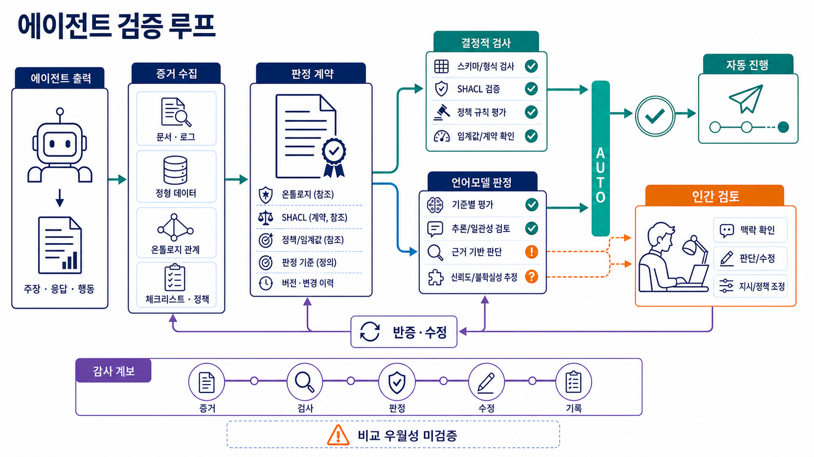

## 한 문장 결론

현재의 영어 중심 공개 연구와 W3C 표준을 함께 읽으면, **판정 기준을 버전 있는 지식 구조로 표현하고 결정적 검사·전문 LLM 판정·반증·사람 승급을 분리하는 위험기반 참조 아키텍처**를 권할 수 있다. 그러나 이 조합이 단순 규칙·타입·실행 테스트보다 정확하거나 안전하다는 비교 실증은 아직 확인되지 않았으며, 글로벌·다국어·고위험 자동 승인의 근거로 사용할 수 없다. [src_001](#src-001) [src_006](#src-006) [src_013](#src-013) [src_014](#src-014)

이 글은 [[notes/ontology-in-the-agentic-era|LLM 에이전트 시대의 온톨로지]]를 “실행의 의미 계층”에서 “판정의 증거 계약”으로 확장한 후속 설계다.

## 문제는 더 강한 Judge가 아니라 판정 가능한 구조다

에이전트는 목표 해석, 계획, 도구 호출, 중간 결과 해석, 상태 변경을 거쳐 외부 세계에 영향을 준다. 최종 답만 보면 잘못된 도구 사용이나 정책 위반을 놓칠 수 있다. Agent-as-a-Judge 연구와 에이전트 평가 실무는 최종 출력과 실행 궤적을 함께 보는 방향을 제안한다. 다만 이것이 모든 과업에서 final-output-only 평가보다 우월하다는 독립 비교는 부족하므로, **trace 평가는 검증할 운영 가설**로 다루는 편이 정확하다. [src_009](#src-009) [src_012](#src-012)

LLM-as-a-Judge는 확장 가능한 평가 센서다. MT-Bench/Chatbot Arena 연구는 사람 선호와의 유용한 합의를 보인 동시에 위치·장황성·자기강화 편향을 보고했다. EMNLP 2024의 변이 연구에서는 평가 모델이 인위적 품질 저하를 평균 절반 이상 놓쳤고 reference-based 평가가 상대적으로 나았다. 별도 연구도 위치 편향과 자기선호를 보고한다. 그러므로 중요 판정에서 단일 LLM을 최종 권위로 쓰려면 실제 데이터에 대한 보정과 반사실 검사가 선행돼야 한다. [src_005](#src-005) [src_006](#src-006) [src_007](#src-007) [src_008](#src-008)

## 표준 네 개의 역할과 비보장 범위

| 계층             | 표현하는 것                       | 권장 용도                   | 자동으로 보장하지 않는 것          |
| ---------------- | --------------------------------- | --------------------------- | ---------------------------------- |
| OWL/RDF          | 클래스·관계·함의                  | 도메인 의미와 분류          | 데이터 완전성, 입력 사실의 진실성  |
| SHACL            | data graph와 shapes의 제약 적합성 | 필수값·범위·카디널리티 검사 | 세계의 사실성, 과업 성공, 안전성   |
| ODRL/도메인 정책 | 허용·금지·의무·조건               | 기계가 읽는 정책 표현       | 실제 인가·집행, 법적 적합성        |
| PROV-O           | Entity–Activity–Agent의 계보      | 증거·실행·수정의 추적 표현  | 로그 무결성, 원출처 진실성, 인과성 |

OWL은 개방세계 가정을 사용한다. 정보가 없다는 사실만으로 거짓이라고 결론 내리지 않는다. SHACL은 명시된 data graph를 shapes graph에 대조하는 검증 언어다. 따라서 둘을 동일한 “폐쇄세계 판정기”로 부르지 않고 의미 추론과 운영 제약 검사로 구분하는 편이 안전하다. SHACL 적합성은 주어진 그래프가 주어진 shape에 맞는다는 뜻이지, 입력 triple이 참이거나 에이전트 행동이 안전하다는 뜻은 아니다. SHACL의 재귀 shape 처리도 구현체에 맡겨진 부분이 있어 엔진별 회귀 시험이 필요하다. [src_001](#src-001) [src_002](#src-002) [src_014](#src-014)

ODRL은 Permission, Prohibition, Duty, Constraint와 충돌 전략을 표현한다. 정책을 실제로 집행하려면 별도의 Policy Decision Point와 Policy Enforcement Point, 인증된 주체·자산 식별, 부분 실패 기본값이 필요하다. PROV-O는 계보를 상호운용 가능한 형태로 표현하지만, 악의적 또는 잘못된 provenance assertion을 진실로 바꾸지 않는다. 해시·서명·불변 로그·접근 제어·원출처 신뢰 루트가 별도 통제다. [src_003](#src-003) [src_004](#src-004)

## 위험기반 Judge Loop 참조 아키텍처

### 1. 판정 계약 고정

`Task`, `Requirement`, `Risk`, `Evidence`, `Action`, `Actor`, `Tool`, `Policy`, `Verdict`, `Appeal`의 의미와 버전을 평가 전에 고정한다. 요구사항마다 필수성, 금지 조건, 증거 유형, 심각도, 자동판정 가능 여부를 붙인다. 이 작은 계약은 거대한 범용 온톨로지보다 먼저 만들 수 있다.

### 2. 입력·실행·증거 정규화

입력, 계획, 도구 호출과 응답, 상태 변경, 최종 산출물, 모델·프롬프트·정책 버전을 사건 그래프로 연결한다. 외부 문서와 tool output은 신뢰 등급, 원출처, 수집 시간, 해시를 기록하고 prompt injection과 ontology/evidence poisoning 검사를 거친다. 계보 기록은 추적성을 돕지만 진실성을 보장하지 않는다. [src_003](#src-003) [src_012](#src-012)

### 3. 결정 가능한 검사를 우선

JSON Schema, 타입, 해시, unit/property-based test, sandbox 실행, SHACL, 허용 도구 목록, 예산·시간 한도는 LLM에게 묻지 않는다. 여기서 “통과”는 해당 검사 계약만 만족한다는 뜻이다. 실행 불가·timeout·엔진 오류는 성공으로 간주하지 않고 고위험이면 fail-closed, 저위험이면 `ABSTAIN` 후 수동 승급한다. [src_002](#src-002) [src_014](#src-014)

### 4. LLM 판정자를 기준별로 분리

사실성, 요구 충족, 정책 준수, 과정 건전성, 사용자 효용을 한 총점으로 섞지 않는다. 각 판정자는 필요한 증거 서브그래프와 체크리스트만 받고 `criterion`, `evidence_ids`, `finding`, `confidence`, `counterevidence`를 반환한다. confidence는 관측 확률로 간주하지 말고 사람 골드셋에서 기준별로 보정한다. [src_005](#src-005) [src_006](#src-006)

### 5. 반증과 변이 검사

반증자는 결과를 뒤집을 최소 반례를 찾는다. 입력 순서 교환, 길이 압축, 모델 서명 제거, 숫자 변형, 출처 제거, tool output 교체, 정책 경계값 변경을 실행한다. 동일 Judge를 통과할 때까지 반복 수정하면 evaluator hacking이나 판정자 과적합이 생길 수 있다는 점은 이번 조사에서 직접 비교 증거를 충분히 확보하지 못했다. 따라서 이를 운영 시험 항목으로 남기고 홀드아웃 Judge·최대 반복·개선량 하한을 둔다. [src_006](#src-006) [src_007](#src-007) [src_008](#src-008)

### 6. 패널의 표 수보다 독립성 측정

다양한 모델 패널은 개별 편향을 줄일 가능성이 있지만, 모델 계열·학습 데이터·참조 답·프롬프트가 겹치면 오류가 상관된다. PoLL 연구는 패널의 효용을 제안했고, 2026년 Apple 연구는 9개 판정자가 약 2개의 독립 투표에 해당할 수 있다는 반대 결과를 보고했다. 두 결과는 “패널은 항상 낫다”가 아니라 오류 상관을 측정하라는 결론을 지지한다. 최신 결과의 후속 재현은 아직 필요하다. [src_010](#src-010) [src_011](#src-011)

### 7. 네 상태와 위험기반 승급

- `PASS`: 정해진 검사 범위의 필수 조건이 통과하고 중대 반례가 없다.
- `FAIL`: 명시적 필수조건 또는 금지 규칙을 위반했다.
- `UNCERTAIN`: 증거 충돌이나 판정자 불일치가 크다.
- `ABSTAIN`: 범위 밖, 필수 증거 없음, 검사 실행 불가다.

고위험 행동, 낮은 보정 신뢰도, 새 실패 유형, 중대 불일치는 사람 또는 외부 도구 검증으로 승급하는 것을 권장한다. 이는 임계값이 실증적으로 확립됐다는 뜻이 아니라, 평가 모델의 사각지대와 자동 grader의 전문가 대체 한계에서 도출한 위험관리 원칙이다. [src_006](#src-006) [src_013](#src-013)

### 8. 새 수정 사건과 종료 조건

수정본은 이전 산출물을 덮어쓰지 않고 새 Entity로 기록한다. 사용한 피드백, 변경된 기준, 새 검사 결과를 연결한다. 최대 반복, 비용, 시간, 동일 실패 반복, 개선량 하한, 정책 위반을 종료 조건으로 둔다. 부분 실패를 조용히 성공으로 바꾸지 않는다.

## 최소 판정 데이터 계약

```json
{
  "case_id": "case-2026-0001",
  "contract_version": "judge-contract/1.0",
  "ontology_version": "domain-ontology/3.2",
  "policy_version": "agent-policy/2.1",
  "evidence": [{ "id": "ev-01", "sha256": "...", "trust_root": "..." }],
  "deterministic_checks": [{ "rule": "RequiredCitation", "status": "pass" }],
  "judgments": [
    {
      "criterion": "factuality",
      "judge": "judge-factuality-v4",
      "evidence_ids": ["ev-01"],
      "finding": "명시된 근거 범위에서 지지됨",
      "confidence": 0.82,
      "counterevidence": []
    }
  ],
  "verdict": "UNCERTAIN",
  "enforcement_point": "pep-agent-tools-v2",
  "partial_failure_policy": "manual_escalation",
  "privacy": { "classification": "internal", "retention_days": 30 },
  "provenance": { "activity": "eval-run-778", "signature": "..." }
}
```

숫자 `0.82`는 실제 보정 없이는 확률이 아니라 모델이 낸 점수에 불과하다. 데이터 계약은 신뢰 루트, 서명·해시, 정책 집행점, 부분 실패 기본값, 민감정보 등급과 보존 기간까지 판정에 묶어야 한다.

## Judge 자체를 검증하는 시험 세트

1. **사람 골드셋**: 경계·불일치·고위험 사례와 사람 간 불확실성을 포함한다.
2. **변이 검사**: 위치, 길이, 문체, 모델 서명만 바꾸고 판정 안정성을 본다. 사실 하나를 깨뜨려 탐지 민감도를 측정한다. [src_005](#src-005) [src_006](#src-006) [src_007](#src-007)
3. **위험가중 지표**: 평균 점수 대신 심각도별 false pass/false fail, abstention precision, recall, 보정 오차를 본다.
4. **과정 회귀**: 금지 tool 사용, 불필요한 호출, 근거 없는 상태 변경, 비용·지연, 복구 행동을 trace에서 검사한다. [src_009](#src-009) [src_012](#src-012)
5. **독립성 감사**: 모델 수가 아니라 공동 실패와 오류 상관을 측정한다. [src_010](#src-010) [src_011](#src-011)
6. **변경 회귀**: ontology, shape, policy, prompt, model, tool 버전이 바뀔 때 compatibility corpus를 재실행하고 rollback 경로를 확인한다.
7. **적응형 공격**: ontology/policy poisoning, provenance 위조, prompt injection, rubric gaming을 별도 red-team 세트로 둔다.
8. **개인정보 검사**: trace 최소수집, 마스킹, 접근 통제, 삭제·보존 충돌을 시험한다.

## 대체 반가설과 도입 순서

온톨로지는 정확도 엔진이 아니라 설명·연결 비용이 큰 보조물일 수 있다. 작은 시스템에서는 타입 시스템, schema, 테스트 하네스와 RAG 기반 reference judge가 더 단순하고 충분할 가능성이 있다. 따라서 첫 단계는 거대한 knowledge graph가 아니라 다음 ablation이다.

1. 규칙·타입·실행 테스트만 사용한 baseline을 만든다.
2. `Task–Requirement–Evidence–Verdict`의 작은 온톨로지와 SHACL을 추가한다.
3. trace와 claim-level provenance를 추가한다.
4. 기준별 LLM Judge와 반증자를 추가한다.
5. 각 단계의 false pass, false fail, 지연, 비용, 유지보수 부담을 비교한다.

온톨로지 계층은 이 비교에서 경계 사례 설명력, 변경 영향 추적, 정책 재사용 같은 명시적 이득이 관찰될 때 확장하는 것이 타당하다.

## 실패 모드와 방어선

| 실패 모드                        | 방어선                                            |
| -------------------------------- | ------------------------------------------------- |
| SHACL 통과를 진실·안전으로 오해  | 검사 계약 범위를 verdict에 기록                   |
| stale/poisoned ontology·evidence | 신뢰 루트, 서명·해시, 입력 검역, 버전 회귀        |
| PROV 기록 위조·인과 과장         | 불변 로그·서명, provenance와 truth/causality 분리 |
| ODRL 표현만 있고 집행 없음       | 외부 PDP/PEP, 인증, fail-closed 정책              |
| 패널 독립성 착시                 | 오류 상관·모델 계열·증거 중복 측정                |
| Judge 과적합·무한 루프           | 홀드아웃 Judge, 반복·예산·개선량 종료             |
| trace 개인정보 과수집            | 최소수집, 분류·마스킹·접근·보존·삭제 정책         |
| 부분 실패의 조용한 통과          | `ABSTAIN`, 수동 승급, 고위험 fail-closed          |

## 결론과 불확실성

온톨로지 기반 Judge Loop를 **검증 가능한 참조 아키텍처**로 보면 가치가 있다. OWL/RDF는 의미, SHACL은 명시된 그래프 제약, ODRL 또는 도메인 정책은 정책 표현, PROV-O는 계보 표현을 맡고, LLM 판정자는 그 위에서 기준별 의미 판단과 반증을 수행한다. 결정적 검사, 오류 상관 측정, 사람 승급, 신뢰 루트와 집행점을 별도 통제로 두는 것이 핵심이다. [src_001](#src-001) [src_003](#src-003) [src_005](#src-005) [src_006](#src-006) [src_010](#src-010) [src_011](#src-011) [src_013](#src-013) [src_014](#src-014)

그러나 이 전체 조합이 비온톨로지 baseline보다 우월하다는 공개 비교 결과는 확인하지 못했다. 조사 자료도 영어권 벤치마크, preprint, 미국 기업 자료에 치우쳐 있다. 다국어·관할권별 정책·장기 에이전트·고위험 산업에서는 별도 골드셋, 공격 시험, 사람 책임 체계 없이 이 구조를 자동 승인 근거로 사용해서는 안 된다. 특정 RDF 저장소, SHACL 엔진, 모델 조합 역시 실행 검증되지 않았다.

## 출처

- <a id="src-001"></a> **src_001** — W3C OWL Working Group. (2012). “OWL 2 Web Ontology Language Primer (Second Edition).” [원문](https://www.w3.org/TR/owl2-primer/)
- <a id="src-002"></a> **src_002** — W3C RDF Data Shapes Working Group. (2017). “Shapes Constraint Language (SHACL).” [원문](https://www.w3.org/TR/shacl/)
- <a id="src-003"></a> **src_003** — W3C Provenance Working Group. (2013). “PROV-O: The PROV Ontology.” [원문](https://www.w3.org/TR/prov-o/)
- <a id="src-004"></a> **src_004** — W3C Permissions and Obligations Expression Working Group. (2018). “ODRL Information Model 2.2.” [원문](https://www.w3.org/TR/odrl-model/)
- <a id="src-005"></a> **src_005** — Zheng, L., et al. (2023). “Judging LLM-as-a-Judge with MT-Bench and Chatbot Arena.” NeurIPS 2023. [원문](https://papers.neurips.cc/paper_files/paper/2023/hash/91f18a1287b398d378ef22505bf41832-Abstract-Datasets_and_Benchmarks.html)
- <a id="src-006"></a> **src_006** — Doddapaneni, S., et al. (2024). “Finding Blind Spots in Evaluator LLMs with Interpretable Checklists.” EMNLP 2024, 16279–16309. [원문](https://doi.org/10.18653/v1/2024.emnlp-main.911)
- <a id="src-007"></a> **src_007** — Shi, L., et al. (2024). “Judging the Judges: A Systematic Study of Position Bias in LLM-as-a-Judge.” [원문](https://arxiv.org/abs/2406.07791)
- <a id="src-008"></a> **src_008** — Wataoka, K., Takahashi, T., & Ri, R. (2024). “Self-Preference Bias in LLM-as-a-Judge.” [원문](https://arxiv.org/abs/2410.21819)
- <a id="src-009"></a> **src_009** — Zhuge, M., et al. (2024). “Agent-as-a-Judge: Evaluate Agents with Agents.” [원문](https://arxiv.org/abs/2410.10934)
- <a id="src-010"></a> **src_010** — Verga, P., et al. (2024). “Replacing Judges with Juries: Evaluating LLM Generations with a Panel of Diverse Models.” [원문](https://arxiv.org/abs/2404.18796)
- <a id="src-011"></a> **src_011** — Apple Machine Learning Research. (2026). “Nine Judges, Two Effective Votes: Correlated Errors Undermine LLM Evaluation Panels.” [원문](https://machinelearning.apple.com/research/correlated-llm-evaluation-panels)
- <a id="src-012"></a> **src_012** — Anthropic. (2026). “Demystifying evals for AI agents.” [원문](https://www.anthropic.com/engineering/demystifying-evals-for-ai-agents)
- <a id="src-013"></a> **src_013** — OpenAI. (2025). “Measuring the performance of our models on real-world tasks.” [원문](https://openai.com/index/gdpval/)
- <a id="src-014"></a> **src_014** — Labra Gayo, J. E., et al. (2021). “A Review of SHACL: From Data Validation to Schema Reasoning for RDF Graphs.” [원문](https://arxiv.org/abs/2112.01441)
