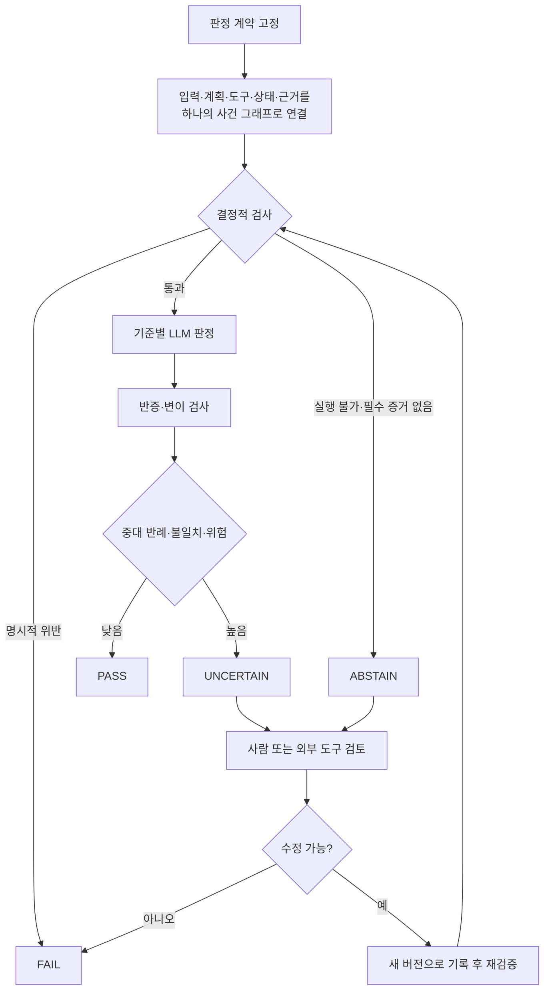

## 핵심 결론

에이전트를 제대로 검증하려면 더 강한 LLM 판정자 하나를 찾는 것만으로는 부족하다. **판정 기준을 버전 관리되는 지식 구조로 고정하고, 기계가 확실히 검사할 수 있는 항목과 LLM의 해석이 필요한 항목을 분리하며, 불확실하거나 위험한 결과만 사람 검토로 보내는 구조**가 필요하다.

현재의 영어 중심 공개 연구와 W3C 표준을 종합하면 이런 위험 기반 참조 구조를 제안할 수 있다. 그러나 온톨로지, 결정적 검사, LLM 판정, 반증, 사람 검토를 결합한 전체 구조가 단순 규칙·타입·실행 테스트보다 더 정확하거나 안전하다는 비교 실증은 아직 부족하다. 따라서 글로벌·다국어·고위험 업무의 자동 승인 근거로 사용해서는 안 된다.[src_001](#src-001)[src_006](#src-006)[src_013](#src-013)[src_014](#src-014)

이 글은 [[notes/ontology-in-the-agentic-era|LLM 에이전트 시대의 온톨로지]]에서 다룬 “실행의 의미 계층”을 “판정의 증거 계약”으로 확장한 후속 설계다.

## 문제는 더 강한 판정자가 아니라 판정 가능한 구조다

고객 지원 에이전트가 고액 환불을 처리했다고 가정하자. 최종 답변만 보면 요청을 잘 해결한 것처럼 보일 수 있다. 하지만 실행 과정에서는 승인받지 않은 도구를 사용했거나, 필수 확인 절차를 건너뛰었거나, 근거가 부족한 고객 상태를 사실로 간주했을 수 있다. 에이전트 평가는 최종 문장뿐 아니라 계획, 도구 호출, 상태 변경과 근거까지 함께 봐야 한다.

Agent-as-a-Judge 연구와 에이전트 평가 실무는 최종 출력과 실행 궤적을 함께 평가하는 방향을 제안한다. 다만 실행 궤적 평가가 모든 과업에서 최종 출력만 보는 평가보다 우월하다는 독립 비교는 아직 부족하다. 따라서 **실행 궤적 평가는 검증을 거쳐야 할 운영 가설**로 다루는 편이 정확하다.[src_009](#src-009)[src_012](#src-012)

LLM-as-a-Judge는 반복 적용하기 쉬운 보조 평가 도구다. MT-Bench와 Chatbot Arena 연구는 사람 선호와 유용한 수준의 일치를 보인 동시에 위치 편향, 장황성 편향, 자기강화 편향을 보고했다. EMNLP 2024의 변이 연구에서는 평가 모델이 인위적인 품질 저하를 평균 절반 이상 놓쳤고, 기준 답안을 제공한 평가가 상대적으로 나았다. 별도 연구에서도 위치 편향과 자기선호가 확인됐다. 그러므로 중요한 판정에서 단일 LLM을 최종 권위로 사용하려면 실제 업무 데이터에 대한 보정과 반사실 검사가 선행돼야 한다.[src_005](#src-005)[src_006](#src-006)[src_007](#src-007)[src_008](#src-008)

## 네 표준이 맡는 역할과 보장하지 않는 것

| 계층             | 표현하는 것                 | 권장 용도                  | 자동으로 보장하지 않는 것          |
| ---------------- | --------------------------- | -------------------------- | ---------------------------------- |
| OWL/RDF          | 클래스·관계·함의            | 도메인 의미와 분류         | 데이터 완전성, 입력 사실의 진실성  |
| SHACL            | 데이터 그래프의 제약 적합성 | 필수값·범위·개수 제한 검사 | 세계의 사실성, 과업 성공, 안전성   |
| ODRL/도메인 정책 | 허용·금지·의무·조건         | 기계가 읽는 정책 표현      | 실제 인가·집행, 법적 적합성        |
| PROV-O           | 개체·활동·행위자의 계보     | 증거·실행·수정의 추적 표현 | 로그 무결성, 원출처 진실성, 인과성 |

OWL은 개방세계 가정을 사용한다. 정보가 없다는 이유만으로 거짓이라고 결론 내리지 않는다. 반면 SHACL은 명시된 데이터 그래프가 셰이프 그래프의 제약에 맞는지 검사한다. 따라서 둘을 하나의 “폐쇄세계 판정기”로 묶지 말고, 의미 추론과 운영 제약 검사로 구분해야 한다.

SHACL 적합성은 주어진 그래프가 주어진 제약에 맞는다는 뜻일 뿐이다. 입력 트리플이 실제로 참인지, 에이전트 행동이 안전한지까지 보장하지 않는다. 재귀 셰이프 처리처럼 구현체에 맡겨진 부분도 있어 엔진별 회귀 시험이 필요하다.[src_001](#src-001)[src_002](#src-002)[src_014](#src-014)

ODRL은 허용, 금지, 의무, 조건과 충돌 처리 방식을 표현한다. 그러나 정책을 실제로 집행하려면 별도의 정책 결정 지점과 집행 지점, 인증된 주체·자산 식별, 부분 실패 시 기본 동작이 필요하다. PROV-O도 계보를 상호운용 가능한 형태로 표현할 뿐, 악의적이거나 잘못된 계보 기록을 진실로 바꾸지는 않는다. 해시, 서명, 불변 로그, 접근 제어와 원출처의 신뢰 기준은 별도의 통제로 두어야 한다.[src_003](#src-003)[src_004](#src-004)

## 위험 기반 Judge Loop 참조 구조

이 글에서 말하는 Judge Loop는 `결정적 검사 → 기준별 LLM 판정 → 반증 → 위험에 따른 사람 검토`의 순서로 작동한다. 각 단계가 맡는 책임을 분리해야 부분 실패가 전체 통과로 둔갑하지 않는다.



### 1. 평가 전에 판정 계약을 고정한다

`Task`, `Requirement`, `Risk`, `Evidence`, `Action`, `Actor`, `Tool`, `Policy`, `Verdict`, `Appeal`의 의미와 버전을 평가 전에 고정한다. 요구사항마다 필수 여부, 금지 조건, 필요한 증거 유형, 심각도와 자동 판정 가능 여부를 붙인다. 이 작은 계약은 거대한 범용 온톨로지보다 먼저 만들 수 있다.

### 2. 입력·실행·증거를 같은 사건으로 연결한다

입력, 계획, 도구 호출과 응답, 상태 변경, 최종 산출물, 모델·프롬프트·정책 버전을 하나의 사건 그래프로 연결한다. 외부 문서와 도구 출력에는 신뢰 등급, 원출처, 수집 시간과 해시를 기록하고, 프롬프트 주입이나 온톨로지·증거 오염 공격을 검사한다. 계보 기록은 추적성을 높이지만 진실성을 보장하지 않는다.[src_003](#src-003)[src_012](#src-012)

### 3. 기계가 판정할 수 있는 것은 LLM에게 묻지 않는다

JSON Schema, 타입, 해시, 단위 테스트와 속성 기반 테스트, 샌드박스 실행, SHACL, 허용 도구 목록, 예산·시간 한도는 결정적 검사로 처리한다. 여기서 “통과”는 해당 검사 계약만 만족했다는 뜻이다.

검사를 실행할 수 없거나 시간 초과·엔진 오류가 발생한 경우 이를 성공으로 간주해서는 안 된다. 고위험 업무는 안전한 방향으로 차단하고, 저위험 업무는 `ABSTAIN`으로 분류한 뒤 사람 검토로 넘긴다.[src_002](#src-002)[src_014](#src-014)

### 4. LLM 판정자를 기준별로 분리한다

사실성, 요구 충족, 정책 준수, 과정 건전성, 사용자 효용을 하나의 총점으로 섞지 않는다. 각 판정자는 필요한 증거 하위 그래프와 체크리스트만 받고 `criterion`, `evidence_ids`, `finding`, `confidence`, `counterevidence`를 반환한다.

`confidence`는 실제 확률로 간주하지 않는다. 사람 골드셋을 사용해 기준별로 보정하고, 보정되지 않은 점수는 단지 모델이 출력한 수치라고 명시해야 한다.[src_005](#src-005)[src_006](#src-006)

### 5. 판정을 뒤집을 반례를 찾는다

반증 단계에서는 결과를 뒤집을 수 있는 최소 반례를 찾는다. 입력 순서 교환, 길이 압축, 모델 이름 제거, 숫자 변형, 출처 제거, 도구 출력 교체, 정책 경계값 변경 등을 시험한다.

같은 판정자를 통과할 때까지 결과를 반복 수정하면 평가자 공략이나 판정자 과적합이 생길 수 있다. 이번 조사에서는 이를 직접 비교한 충분한 증거를 확보하지 못했으므로 운영 시험 항목으로 남겨야 한다. 별도로 보관한 판정자, 최대 반복 횟수와 최소 개선 기준을 함께 두는 것이 안전하다.[src_006](#src-006)[src_007](#src-007)[src_008](#src-008)

### 6. 판정자 수보다 오류의 독립성을 측정한다

서로 다른 모델로 패널을 구성하면 개별 편향을 줄일 가능성이 있다. 하지만 모델 계열, 학습 데이터, 기준 답안과 프롬프트가 겹치면 오류도 함께 움직인다. PoLL 연구는 패널의 효용을 제안했지만, 2026년 Apple 연구는 판정자 9명이 약 2개의 독립 투표에 해당할 수 있다는 반대 결과를 보고했다.

두 결과는 “패널은 항상 낫다”가 아니라, 다수결에 앞서 공동 실패와 오류 상관을 측정해야 한다는 결론을 지지한다. 최신 결과는 후속 재현이 더 필요하다.[src_010](#src-010)[src_011](#src-011)

### 7. 네 상태로 판정하고 위험에 따라 사람에게 넘긴다

- `PASS`: 정해진 검사 범위의 필수 조건이 통과했고 중대한 반례가 없다.
- `FAIL`: 명시된 필수 조건이나 금지 규칙을 위반했다.
- `UNCERTAIN`: 증거 충돌이나 판정자 불일치가 크다.
- `ABSTAIN`: 평가 범위 밖이거나 필수 증거가 없고, 검사를 실행할 수 없다.

고위험 행동, 낮은 보정 신뢰도, 새로운 실패 유형과 중대한 불일치는 사람 또는 외부 도구 검증으로 넘기는 것이 타당하다. 이는 특정 임계값이 실증적으로 확립됐다는 뜻이 아니라, 평가 모델의 사각지대와 자동 채점기의 전문가 대체 한계에서 도출한 위험관리 원칙이다.[src_006](#src-006)[src_013](#src-013)

### 판정 조건을 바꿔 네 상태를 직접 만들어 보기

결정적 검사 결과, 행동 위험, 기준별 판정 불일치와 반증 결과를 바꾸면 `PASS`, `FAIL`, `UNCERTAIN`, `ABSTAIN` 가운데 어떤 경로로 이동하는지 확인할 수 있다. 이 도구는 글의 참조 구조를 설명하기 위한 것이며 실제 자동 승인 임계값은 아니다.

<iframe
  class="interactive-visualization-frame"
  src="/attachments/ontology-judge-loop-agent-validation/judge-loop-verdict-simulator.htm"
  title="Judge Loop 판정 경로 시뮬레이터"
  loading="lazy"
  scrolling="no"
  sandbox="allow-scripts allow-same-origin"
  style="height:920px"
></iframe>

### 8. 수정본과 종료 조건을 별도 기록한다

수정본은 이전 산출물을 덮어쓰지 않고 새로운 버전으로 기록한다. 어떤 피드백을 사용했고, 어떤 판정 기준이 바뀌었으며, 새 검사 결과가 무엇인지 연결한다. 최대 반복 횟수, 비용, 시간, 같은 실패의 반복, 최소 개선량과 정책 위반을 종료 조건으로 둔다. 부분 실패를 조용히 성공으로 바꾸지 않는다.

## 최소 판정 데이터 계약

```json
{
  "case_id": "case-2026-0001",
  "contract_version": "judge-contract/1.0",
  "ontology_version": "domain-ontology/3.2",
  "policy_version": "agent-policy/2.1",
  "evidence": [{ "id": "ev-01", "sha256": "...", "trust_root": "..." }],
  "deterministic_checks": [{ "rule": "RequiredCitation", "status": "pass" }],
  "judgments": [
    {
      "criterion": "factuality",
      "judge": "judge-factuality-v4",
      "evidence_ids": ["ev-01"],
      "finding": "명시된 근거 범위에서 지지됨",
      "confidence": 0.82,
      "counterevidence": []
    }
  ],
  "verdict": "UNCERTAIN",
  "enforcement_point": "pep-agent-tools-v2",
  "partial_failure_policy": "manual_escalation",
  "privacy": { "classification": "internal", "retention_days": 30 },
  "provenance": { "activity": "eval-run-778", "signature": "..." }
}
```

숫자 `0.82`는 실제 보정이 없다면 확률이 아니라 모델이 출력한 점수에 불과하다. 데이터 계약에는 신뢰 기준, 서명과 해시, 정책 집행점, 부분 실패 시 기본 동작, 민감정보 등급과 보존 기간까지 포함해야 한다.

## 판정자 자체를 검증하는 시험 세트

1. **사람 골드셋**: 경계 사례, 판정자 간 불일치, 고위험 사례와 사람 사이의 불확실성을 포함한다.
2. **변이 검사**: 위치, 길이, 문체와 모델 이름만 바꾸고 판정 안정성을 본다. 사실 하나를 의도적으로 틀리게 만들어 탐지 민감도를 측정한다.[src_005](#src-005)[src_006](#src-006)[src_007](#src-007)
3. **위험 가중 지표**: 평균 점수 대신 심각도별 거짓 통과·거짓 실패, 기권 판정의 정밀도와 재현율, 보정 오차를 본다.
4. **과정 회귀**: 금지된 도구 사용, 불필요한 호출, 근거 없는 상태 변경, 비용·지연과 복구 행동을 실행 궤적에서 검사한다.[src_009](#src-009)[src_012](#src-012)
5. **독립성 감사**: 모델 수가 아니라 공동 실패와 오류 상관을 측정한다.[src_010](#src-010)[src_011](#src-011)
6. **변경 회귀**: 온톨로지, 셰이프, 정책, 프롬프트, 모델과 도구 버전이 바뀔 때 호환성 사례 모음을 다시 실행하고 복원 경로를 확인한다.
7. **적응형 공격**: 온톨로지·정책 오염, 계보 위조, 프롬프트 주입과 평가 기준 공략을 별도의 레드팀 세트로 둔다.
8. **개인정보 검사**: 실행 궤적의 최소 수집, 마스킹, 접근 통제와 삭제·보존 정책의 충돌을 시험한다.

## 더 단순한 대안과 도입 순서

온톨로지가 언제나 필요한 것은 아니다. 온톨로지는 정확도 엔진이라기보다 설명과 연결을 위해 추가 비용을 지불하는 구조일 수 있다. 작은 시스템에서는 타입 시스템, 스키마, 테스트 하네스와 RAG 기반 기준 답안 판정자가 더 단순하고 충분할 가능성이 있다.

따라서 첫 단계는 거대한 지식그래프가 아니라 단계별 비교 실험이어야 한다.

1. 규칙·타입·실행 테스트만 사용하는 기준선을 만든다.
2. `Task–Requirement–Evidence–Verdict`의 작은 온톨로지와 SHACL을 추가한다.
3. 실행 궤적과 주장 단위의 출처 계보를 추가한다.
4. 기준별 LLM 판정자와 반증 단계를 추가한다.
5. 각 단계의 거짓 통과, 거짓 실패, 지연, 비용과 유지보수 부담을 비교한다.

온톨로지 계층은 이 비교에서 경계 사례의 설명력, 변경 영향 추적, 정책 재사용 같은 구체적인 이득이 관찰될 때 확장하는 것이 타당하다.

## 실패 모드와 방어선

| 실패 모드                         | 방어선                                             |
| --------------------------------- | -------------------------------------------------- |
| SHACL 통과를 진실·안전으로 오해   | 판정 결과에 검사 계약의 범위를 기록                |
| 오래됐거나 오염된 온톨로지·증거   | 신뢰 기준, 서명·해시, 입력 검역, 버전 회귀         |
| 계보 기록 위조와 인과관계 과장    | 불변 로그·서명, 계보와 진실·인과성의 분리          |
| ODRL 표현만 있고 실제 집행은 없음 | 외부 정책 결정·집행 지점, 인증, 안전 우선 차단     |
| 패널 독립성에 대한 착시           | 오류 상관, 모델 계열과 증거 중복 측정              |
| 판정자 과적합과 무한 수정 루프    | 별도 판정자, 반복·예산·최소 개선량 종료 조건       |
| 실행 궤적의 개인정보 과수집       | 최소 수집, 분류·마스킹·접근·보존·삭제 정책         |
| 부분 실패가 조용히 통과로 바뀜    | `ABSTAIN`, 사람 검토, 고위험 업무의 안전 우선 차단 |

## 결론: 가장 작은 검증 계약부터 시작한다

온톨로지 기반 Judge Loop는 완성된 정답이라기보다 **검증 가능한 참조 구조**로 볼 때 가치가 있다. OWL/RDF는 의미를, SHACL은 명시된 그래프 제약을, ODRL이나 도메인 정책은 정책 표현을, PROV-O는 계보 표현을 맡는다. 그 위에서 LLM 판정자는 기준별 의미 판단과 반증을 수행한다. 결정적 검사, 오류 상관 측정, 사람 검토, 신뢰 기준과 실제 집행 지점을 별도 통제로 두는 것이 핵심이다.[src_001](#src-001)[src_003](#src-003)[src_005](#src-005)[src_006](#src-006)[src_010](#src-010)[src_011](#src-011)[src_013](#src-013)[src_014](#src-014)

실무의 시작점은 거대한 평가 온톨로지가 아니다. 중요한 실패 사례 하나를 고르고, 판정 기준과 필요한 증거를 작은 계약으로 고정한 뒤, 결정적 검사만으로 만든 기준선을 먼저 측정해야 한다. 그 다음에 온톨로지, 실행 궤적, LLM 판정과 반증을 한 단계씩 추가하며 실제 이득과 비용을 비교하는 편이 안전하다.

이 전체 조합이 비온톨로지 기준선보다 우월하다는 공개 비교 결과는 아직 확인되지 않았다. 조사 자료도 영어권 벤치마크, 프리프린트와 미국 기업 자료에 치우쳐 있다. 다국어, 관할권별 정책, 장기 실행 에이전트와 고위험 산업에서는 별도의 골드셋, 공격 시험과 사람 책임 체계 없이 이 구조를 자동 승인 근거로 사용해서는 안 된다. 특정 RDF 저장소, SHACL 엔진과 모델 조합도 이 글에서 실행 검증하지 않았다.

## 함께 읽기

- [[notes/ontology-agent-guide|1. 온톨로지 에이전트: 의미를 아는 AI를 만드는 방법]]
- [[notes/ontology-in-the-agentic-era|2. LLM 에이전트 시대, 온톨로지는 ‘실행의 의미 계층’으로 확장될 수 있다]]
- [[notes/ontology-emergent-agent|4. 온톨로지가 행동을 바꾸는 에이전트: 창발을 설계하고 증명하는 법]]

## 출처

- <a id="src-001"></a> **src_001** — W3C OWL Working Group. (2012). “OWL 2 Web Ontology Language Primer (Second Edition).” [원문](https://www.w3.org/TR/owl2-primer/)
- <a id="src-002"></a> **src_002** — W3C RDF Data Shapes Working Group. (2017). “Shapes Constraint Language (SHACL).” [원문](https://www.w3.org/TR/shacl/)
- <a id="src-003"></a> **src_003** — W3C Provenance Working Group. (2013). “PROV-O: The PROV Ontology.” [원문](https://www.w3.org/TR/prov-o/)
- <a id="src-004"></a> **src_004** — W3C Permissions and Obligations Expression Working Group. (2018). “ODRL Information Model 2.2.” [원문](https://www.w3.org/TR/odrl-model/)
- <a id="src-005"></a> **src_005** — Zheng, L., et al. (2023). “Judging LLM-as-a-Judge with MT-Bench and Chatbot Arena.” NeurIPS 2023. [원문](https://papers.neurips.cc/paper_files/paper/2023/hash/91f18a1287b398d378ef22505bf41832-Abstract-Datasets_and_Benchmarks.html)
- <a id="src-006"></a> **src_006** — Doddapaneni, S., et al. (2024). “Finding Blind Spots in Evaluator LLMs with Interpretable Checklists.” EMNLP 2024, 16279–16309. [원문](https://doi.org/10.18653/v1/2024.emnlp-main.911)
- <a id="src-007"></a> **src_007** — Shi, L., et al. (2024). “Judging the Judges: A Systematic Study of Position Bias in LLM-as-a-Judge.” [원문](https://arxiv.org/abs/2406.07791)
- <a id="src-008"></a> **src_008** — Wataoka, K., Takahashi, T., & Ri, R. (2024). “Self-Preference Bias in LLM-as-a-Judge.” [원문](https://arxiv.org/abs/2410.21819)
- <a id="src-009"></a> **src_009** — Zhuge, M., et al. (2024). “Agent-as-a-Judge: Evaluate Agents with Agents.” [원문](https://arxiv.org/abs/2410.10934)
- <a id="src-010"></a> **src_010** — Verga, P., et al. (2024). “Replacing Judges with Juries: Evaluating LLM Generations with a Panel of Diverse Models.” [원문](https://arxiv.org/abs/2404.18796)
- <a id="src-011"></a> **src_011** — Apple Machine Learning Research. (2026). “Nine Judges, Two Effective Votes: Correlated Errors Undermine LLM Evaluation Panels.” [원문](https://machinelearning.apple.com/research/correlated-llm-evaluation-panels)
- <a id="src-012"></a> **src_012** — Anthropic. (2026). “Demystifying evals for AI agents.” [원문](https://www.anthropic.com/engineering/demystifying-evals-for-ai-agents)
- <a id="src-013"></a> **src_013** — OpenAI. (2025). “Measuring the performance of our models on real-world tasks.” [원문](https://openai.com/index/gdpval/)
- <a id="src-014"></a> **src_014** — Labra Gayo, J. E., et al. (2021). “A Review of SHACL: From Data Validation to Schema Reasoning for RDF Graphs.” [원문](https://arxiv.org/abs/2112.01441)
