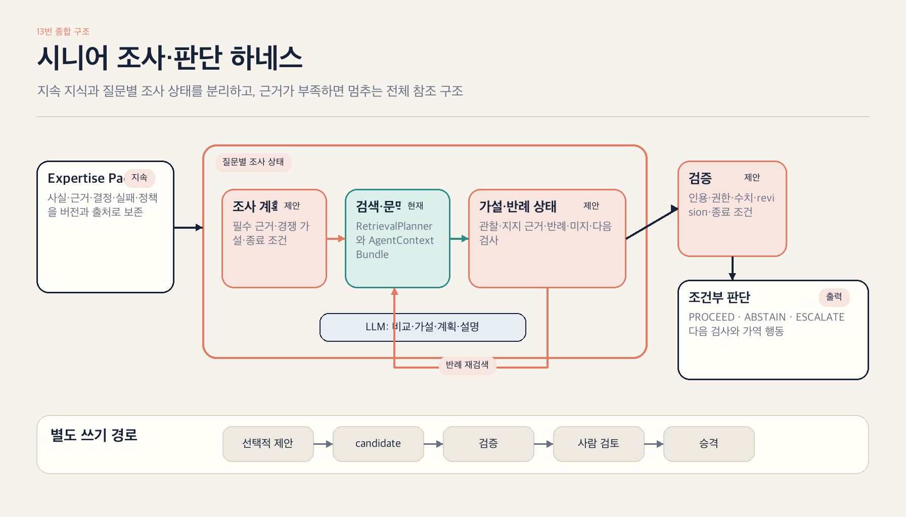
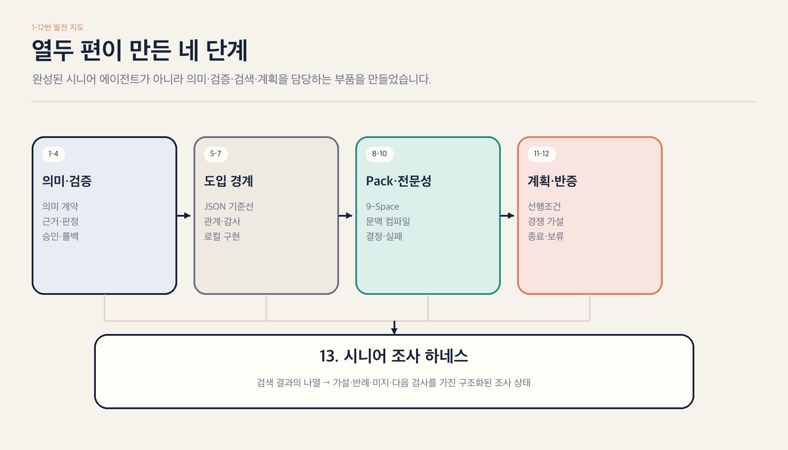
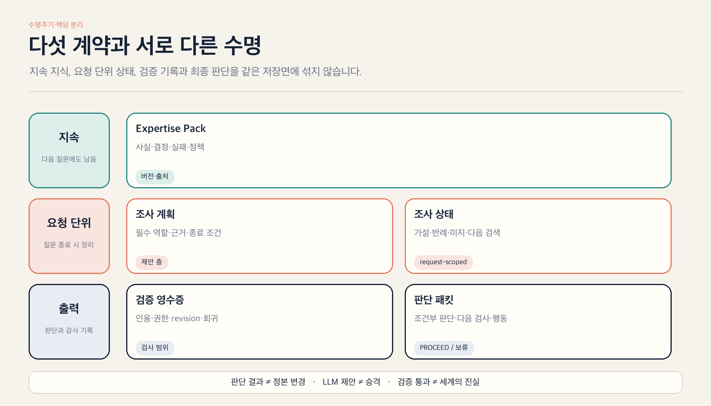
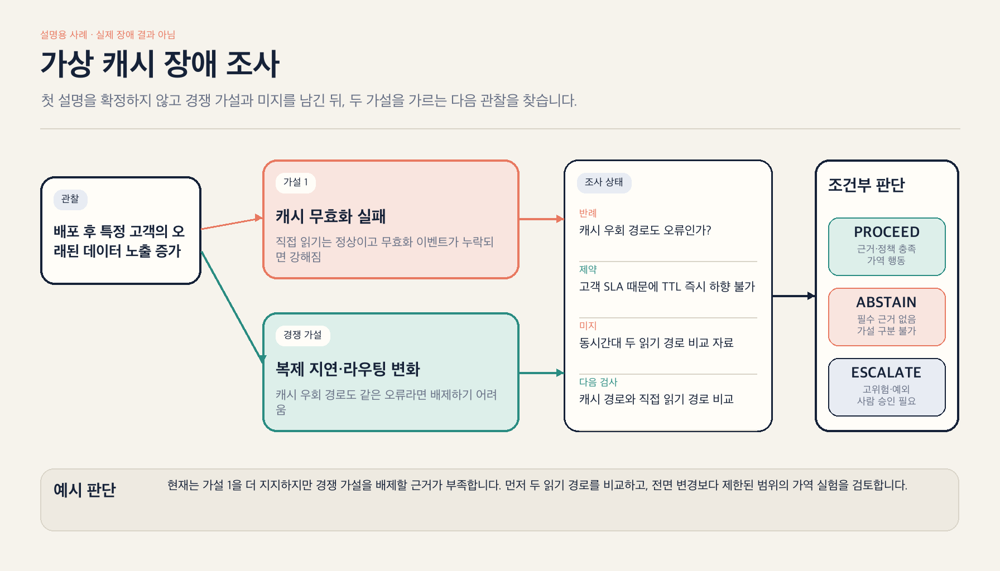

> [!summary] 핵심 결론
> 온톨로지와 지식그래프를 붙였다고 에이전트가 시니어 엔지니어가 되지는 않습니다. 더 현실적인 목표는 **조직의 사실·근거·결정·실패와 제약을 버전 있는 Pack으로 보존하고, 질문마다 필요한 조사 상태를 조립해 LLM이 경쟁 가설·반례·계획과 다음 검사를 만들도록 돕는 것**입니다.

서비스를 배포한 직후 특정 고객에게 오래된 데이터가 노출됐다고 가정해 보겠습니다. 첫 설명은 자연스럽습니다.

> 방금 배포하면서 캐시 무효화가 실패한 것 아닐까?

관련 로그와 과거 장애 보고서를 검색하면 이 가설을 지지하는 자료를 쉽게 찾을 수 있습니다. 하지만 시니어 엔지니어는 여기서 멈추지 않습니다. 증상은 같지만 원인이 달랐던 사건을 함께 떠올리고, 캐시를 우회한 읽기에서도 같은 문제가 발생했는지 확인합니다. 고객 SLA 때문에 TTL을 즉시 낮출 수 있는지도 살핍니다. 현재 자료로 원인을 구분할 수 없다면 결론을 서두르지 않고 다음 측정을 제안합니다.

이 글은 이런 조사 구조를 모델 바깥에 어떻게 둘 것인지 살펴봅니다.

> [!important] 이 글의 검증 범위
> 아래의 전체 하네스는 이미 성능이 입증된 완제품이 아닙니다. 블로그 1~12번의 결론, 관련 연구, OpenCrab의 설계 원형과 DuckCrab의 현재 코드를 연결한 **구현 가능한 참조 구조**입니다. 그래프의 순증분 효과, 반복 조사와 Validator의 기여, 전체 운영 비용은 후속 통제 실험으로 확인해야 합니다.

## 열두 편이 만든 것은 완성된 에이전트가 아니라 부품입니다

앞선 열두 편은 서로 다른 질문을 다뤘습니다.

- [[notes/ontology-agent-guide|1번]]부터 [[notes/ontology-emergent-agent|4번]]까지는 자연어의 유연성과 의미·근거·제약·판정·승인 권한을 분리했습니다.
- [[notes/ontology-agent-behavior-experiment|5번]]부터 [[notes/local-ontology-agent-implementation|7번]]까지는 단순 문제에는 JSON 규칙이 더 작은 기준선일 수 있으며, 관계 재사용·변경 영향·감사 비용이 커질 때 온톨로지를 비교해야 한다고 정리했습니다.
- [[notes/opencrab-ontology-build-architecture|8번]]과 [[notes/ontology-context-compiler-opencrab|9번]]은 OpenCrab의 9-Space, Evidence·Claim, Pack과 MCP를 LLM에 외부 지식을 공급하는 문맥 계층으로 읽었습니다.
- [[notes/ontology-expertise-pack|10번]]은 전문가의 지식을 사실 목록이 아니라 사건, 결정, 버린 대안, 실패, 인과 가설, 반례와 미지로 확장했습니다.
- [[notes/kg-guided-llm-planning|11번]]은 목표·상태·행동·선행조건·정책을 계획 계약으로, [[notes/iterative-investigation-refutation-loop|12번]]은 가설·지지 근거·반례·미지·수정·종료 이유를 갱신하는 조사 계약으로 분리했습니다.



이제 필요한 것은 더 많은 기능을 한 에이전트에 몰아넣는 일이 아닙니다. **오래 지속되는 지식, 한 질문 안에서만 바뀌는 조사 상태, 결정론적 검사와 정본 변경 권한을 서로 다른 계약으로 두는 일**입니다.

에이전트의 성능은 모델만으로 결정되지 않습니다. 같은 모델도 프롬프트, 도구, 상태 관리와 실행 하네스에 따라 다른 결과를 낼 수 있다는 연구가 이어지고 있습니다. 다만 2026년 Harness-Bench는 프리프린트이며, 이 글에서 제안한 통합 구조의 성능을 직접 평가한 연구는 아닙니다.[src_005](#src-005)

## 시니어 조사 하네스는 다섯 계약으로 닫힙니다



### 1. Expertise Pack: 다음 질문에도 남는 조직 지식

Pack에는 도메인 객체와 관계만 들어가면 부족합니다. 직접 관찰한 Evidence와 해석한 Claim, 사건과 실패, 선택한 결정과 버린 대안, 유효 기간, 정책, 접근 범위와 provenance가 함께 있어야 합니다.

```text
도메인 객체와 관계
+ Evidence와 Claim
+ 사건·실패·결정·버린 대안
+ 적용 조건·유효 기간·권한
+ 인과·영향 가설
+ Pack revision과 provenance
```

고전 온톨로지는 공유할 개념과 관계를 명시적인 의미 계약으로 표현합니다. OWL은 클래스·속성·개체와 형식 의미론을 기계가 처리할 수 있도록 정의합니다.[src_001](#src-001)[src_002](#src-002) OpenCrab은 이 전통을 그대로 복제하기보다 9-Space, Evidence·Claim, Pack과 MCP를 통해 에이전트가 비정형 조직 지식을 읽도록 재배치하려 했습니다.[src_018](#src-018)

하지만 그래프가 크다고 좋은 Pack은 아닙니다. 어떤 관계가 원문에서 왔고, 어떤 연결은 아직 가설이며, 무엇이 오래됐는지를 구분할 수 있어야 합니다. 불완전한 지식그래프에서는 필요한 근거를 놓치거나 모델이 내부 기억에 기대는 문제가 나타날 수 있습니다.[src_006](#src-006)

### 2. Semantic Investigation Plan: 이번 질문의 조사 의무

Semantic Investigation Plan은 “어떤 검색 모드를 사용할까?”보다 한 단계 위의 계약입니다. 이번 질문에서 어떤 자료와 검토 결과가 반드시 있어야 하는지를 정합니다.

```yaml
question_type: incident_diagnosis
required:
  - current_observations
  - competing_hypotheses
  - supporting_evidence
  - counterevidence
  - applicable_policy
  - unknowns
obligations:
  - 유사 사례와 대조 사례를 함께 조사한다
  - 가설을 구분할 다음 관찰을 제안한다
  - 근거가 부족하면 판단을 보류한다
stop_conditions:
  - 필수 근거 충족
  - 추가 정보가치 소진
  - 조사 예산 소진
  - 사람 승인이 필요한 위험 도달
```

이 이름은 DuckCrab의 현재 `retrieval_plan`과 구분해야 합니다. 현재 `retrieval_plan`은 query variant, graph/schema term, route와 bounded expansion을 명시하는 **검색 실행 계획**입니다. 여기서 말하는 Semantic Investigation Plan은 그 위에서 조사 의무를 정하는 제안 층이며, 2026년 7월 24일 현재 공개 DuckCrab 런타임 계약이 아닙니다.[src_015](#src-015)[src_017](#src-017)

### 3. Investigation State: 한 질문 안에서만 바뀌는 조사 상태

조사 상태는 Pack과 수명이 다릅니다.

```text
관찰
+ 주 가설과 경쟁 가설
+ 지지 근거와 반례
+ 유사·대조 사례
+ 정책과 제약
+ 미지
+ 다음 검색·도구 호출
+ 수정 이유와 종료 이유
```

반복할 때마다 보고서를 처음부터 다시 쓰면 무엇이 바뀌었는지 알기 어렵습니다. 그래서 어떤 가설이 어떤 외부 신호 때문에 강해지거나 약해졌는지 변경분을 남겨야 합니다.

여기서 중요한 것은 “같은 모델이 한 번 더 생각했다”가 아닙니다. ReAct와 CRITIC은 환경·검색·검증 도구가 주는 외부 관찰을 추론 과정에 다시 넣는 가능성을 보여줬습니다.[src_010](#src-010)[src_011](#src-011) 반면 외부 피드백 없는 자기교정은 실패하거나 오히려 성능을 떨어뜨릴 수 있다는 연구와 비판적 조사도 있습니다.[src_012](#src-012)[src_013](#src-013)

조사 중 생긴 가설은 검증과 승격 없이 Expertise Pack의 정본이 되지 않습니다.

### 4. Validation Receipt: 자신감이 아니라 검사 범위

Validator는 LLM의 자신감과 별개로 기계가 확인할 수 있는 항목을 맡습니다.

- 인용한 Evidence가 실제로 존재합니까?
- Claim이 인용한 원문 범위를 넘어섰습니까?
- 서로 다른 Pack revision이 섞였습니까?
- 접근 권한과 정책을 위반했습니까?
- 수치·단위·시간 범위가 맞습니까?
- 수정 중 기존의 올바른 주장과 인용이 손상됐습니까?
- 정해진 종료 조건을 실제로 만족했습니까?

계획 연구에서도 자연어로 그럴듯한 순서를 쓰는 것과 실행 가능한 계획을 만드는 것은 다릅니다. PlanBench는 당시 모델의 계획과 변화 추론 한계를 측정했고, LLM+P와 형식 검증 연구는 LLM, 외부 플래너와 검증기의 역할을 나누는 방향을 제안했습니다.[src_007](#src-007)[src_008](#src-008)[src_009](#src-009)

다만 Validator를 통과했다고 세계의 사실이 자동으로 참이 되지는 않습니다. 입력 그래프가 오래됐거나 잘못됐다면 구조적으로 정상인 오류가 남습니다.

### 5. Judgment Packet: 정답보다 조건부 판단

최종 산출물은 단정적인 한 문장보다 다음 묶음에 가깝습니다.

```text
조건부 판단
+ 현재 가장 강한 가설
+ 배제하지 못한 대안
+ 핵심 근거와 반례
+ 현재 미지
+ 다음 검사
+ 가역적인 안전 행동
+ 금지 행동
+ PROCEED | ABSTAIN | ESCALATE
+ citations와 Pack revision
```

이 Judgment Packet 역시 현재 DuckCrab의 공개 응답 계약이 아니라 목표 구조입니다.[src_015](#src-015)[src_016](#src-016)[src_017](#src-017)

## 오래 남는 Pack과 질문마다 사라지는 상태를 나눕니다

Expertise Pack과 Investigation State를 합치면 첫 조사에서 나온 미확정 가설이 다음 질문의 사실처럼 재사용될 수 있습니다. 반대로 모든 것을 세션 메모로만 두면 과거 결정의 이유와 출처가 사라집니다.

```text
지속 계층
Expertise Pack + revision + provenance

요청 계층
Semantic Plan + Investigation State + retrieval receipt

출력 계층
Validation Receipt + Judgment Packet

쓰기 계층
optional Proposal
  → candidate
  → validation
  → human review
  → promotion
```

LLM은 Proposal을 만들 수 있지만 정본 승격 권한을 갖지 않습니다. 최종 판단을 내린 것과 장기 지식을 바꾼 것은 서로 다른 사건이어야 합니다.

## 캐시 장애 질문이 조건부 판단으로 바뀌는 과정



다시 가상 캐시 장애로 돌아가 보겠습니다.

> 배포 이후 특정 고객에게 오래된 데이터 노출이 늘어난 이유는 무엇이며, 가장 안전한 다음 행동은 무엇입니까?

첫 관찰만 보면 `캐시 무효화 실패`가 자연스러운 가설입니다. 시니어 조사 하네스는 같은 가설을 지지하는 문서를 더 찾는 데서 멈추지 않습니다. `읽기 복제본 지연 또는 라우팅 변화`를 경쟁 가설로 두고 두 설명을 가를 관찰을 찾습니다.

```yaml
observations:
  - 배포 직후 특정 고객 범위에서 노출 증가
hypotheses:
  - id: H1
    statement: 캐시 무효화 실패
  - id: H2
    statement: 읽기 복제본 지연 또는 라우팅 변화
constraints:
  - 특정 고객 SLA 때문에 TTL 즉시 하향 불가
unknowns:
  - 캐시를 우회한 읽기에서도 같은 현상이 있는가
next_test:
  - 같은 시간대의 캐시 경로와 직접 읽기 경로 비교
```

Pack과 검색 계층은 과거의 캐시 장애, TTL 결정, 고객 SLA, 배포와 롤백 기록을 가져올 수 있습니다. Think-on-Graph와 KG-Agent는 LLM이 그래프의 개체와 관계를 단계적으로 탐색하는 구조가 복합 질의에 쓰일 수 있음을 보여줬습니다.[src_003](#src-003)[src_004](#src-004) 그러나 이 결과가 실제 장애 조사에서 더 좋은 판단을 보장하는 것은 아닙니다.

LLM은 유사 사례뿐 아니라 증상은 같지만 원인이 달랐던 대조 사례를 비교합니다. 캐시 우회 경로에서도 같은 현상이 보인다면 H1은 약해집니다. 직접 읽기는 정상이고 무효화 이벤트가 누락됐다면 H1은 강해집니다.

현재 근거로 H2를 배제할 수 없다면 답은 “원인은 H1입니다”가 아닙니다.

> 현재 근거는 캐시 무효화 실패를 더 지지하지만, 캐시 우회 읽기 경로의 동시간대 자료가 없어 복제본 지연 또는 라우팅 변화를 배제할 수 없습니다. 먼저 두 읽기 경로를 비교해야 합니다. TTL 변경은 고객 SLA와 부하에 영향을 줄 수 있으므로 전면 적용보다 제한된 범위의 가역 실험이 적절합니다.

## LLM, 결정론적 계층과 사람이 맡을 일을 나눕니다

| 주체               | 맡기기 좋은 일                                               | 맡기면 안 되는 권한                       |
| ------------------ | ------------------------------------------------------------ | ----------------------------------------- |
| LLM                | 자연어 질문 해석, 경쟁 가설, 사례 비교, 다음 조사 후보, 설명 | 정본 변경 승인, 권한 우회, 근거 없는 확정 |
| 검색·그래프 계층   | Pack 범위 검색, 관계 경로, provenance, missing surface       | 그래프의 빈칸을 사실로 추정               |
| 결정론적 Validator | 인용, revision, 권한, 수치, 상태 전환, 종료 조건             | 입력 사실의 현실적 진실을 자동 보증       |
| 사람               | 고위험 판단, 예외 승인, 지식 승격과 책임                     | 모든 저위험 검색을 수작업으로 대체        |

한 계층이 모든 권한을 가져서는 안 됩니다. 검색 결과를 만든 모델이 자기 가설을 정본으로 승격하거나, Judge가 평가와 배포를 함께 맡으면 오류의 원인과 책임을 분리하기 어렵습니다.

## OpenCrab과 DuckCrab은 어디까지 와 있습니까

OpenCrab은 9-Space, Evidence·Claim, Pack, MCP와 candidate·validation·promotion이라는 설계 원형을 제공했습니다. 그러나 앞선 분석에서 확인했듯 공개 구현은 질문별 Semantic Plan과 검증된 AnswerBundle보다 Hybrid Retriever와 Pack 공장에 가까웠습니다.[src_018](#src-018)

2026년 7월 23일 커밋 `8ae4960` 기준 DuckCrab에서 확인되는 현재 기반은 다음과 같습니다.[src_015](#src-015)[src_016](#src-016)[src_017](#src-017)

- DuckDB가 canonical ontology, 관계, 문서, provenance와 정책 상태를 소유합니다.
- Chroma는 파생 vector index입니다.
- MCP·CLI·web query와 retrieve 계열은 하나의 `RetrievalPlanner` 랭킹 코어를 공유합니다.
- 명시적 `retrieval_plan`은 query variant, graph/schema term, route와 bounded expansion을 받을 수 있습니다.
- schema planning card와 retrieval receipt가 caller 또는 LLM의 명시적 계획을 지원합니다.
- read-only `AgentContextBundle`은 facts, supporting evidence, provenance paths, inferred links, missing links, policies, scope, uncertainty와 raw refs를 담습니다.

집중 실행 확인에서는 DuckCrab의 프로젝트 환경에서 `tests/test_retrieval_planner.py`와 `tests/test_mcp.py` 178개가 통과했습니다. 이 검사는 현재 검색·MCP 계약의 회귀만 확인합니다. 아래 제안 층은 구현돼 있지 않으므로 시험 대상도 아니었습니다.

아직 구현된 것으로 말하면 안 되는 부분도 분명합니다.

- 경쟁 가설과 조사 의무를 가진 Semantic Investigation Plan
- request-scoped Investigation State
- 새 외부 신호를 요구하는 counterevidence re-search loop
- claim/evidence/revision/stop-condition Validator
- conditional Judgment Packet

따라서 DuckCrab은 전체 시니어 조사 하네스가 아니라 **검색과 문맥 조립 기반**을 상당 부분 갖춘 상태로 보는 편이 정확합니다. 나머지 계약의 구현 난도와 효과는 별도 구현 글과 실험에서 확인해야 합니다.

### 현재 기반과 제안 층을 직접 비교해 보기

아래 탐색기에서 전체 구조, 현재 DuckCrab, 제안 층과 가상 캐시 조사를 바꿔 보실 수 있습니다. 표시된 구조는 성능 점수나 구현 완료율이 아닙니다.

<iframe
  class="interactive-visualization-frame"
  src="/attachments/ontology-senior-investigation-harness/senior-investigation-harness-explorer.htm"
  title="현재 DuckCrab 기반과 제안된 시니어 조사 하네스 층을 비교하는 인터랙티브 탐색기"
  loading="lazy"
  scrolling="no"
  sandbox="allow-scripts allow-same-origin"
  style="height:760px"
></iframe>

[탐색기를 새 화면에서 크게 열기](/attachments/ontology-senior-investigation-harness/senior-investigation-harness-explorer.htm)

## 실패할 때는 더 조사하거나 멈춰야 합니다

그래프와 Pack은 오류를 없애지 않습니다. 불완전한 KG에서는 필요한 근거를 놓치거나 모델이 내부 기억에 기대는 문제가 나타날 수 있습니다.[src_006](#src-006) 오래된 결정과 조직 편견을 Pack으로 구조화하면 임시 타협이 더 오래, 더 권위 있게 재사용될 수도 있습니다.

반복도 자동 개선 장치가 아닙니다. 같은 모델의 자기교정은 최초 오류를 공유할 수 있고, 검색 결과가 쌓이면 문맥 간섭이 생깁니다. 여러 차례 보고서를 고치는 연구에서는 새 요구를 반영하는 동안 이전의 맞는 내용과 인용이 손상되는 회귀도 관찰됐습니다.[src_012](#src-012)[src_013](#src-013)[src_014](#src-014)

다음 상태는 모두 정상 종료입니다.

- `PROCEED`: 필수 근거와 정책 검사가 충족됐고 가역적인 행동이 가능합니다.
- `ABSTAIN`: 필수 근거가 없거나 경쟁 가설을 구분할 자료가 없습니다.
- `ESCALATE`: 위험이 높거나 예외 승인과 책임 있는 사람 판단이 필요합니다.

계속 검색하는 것보다 멈추는 편이 더 정확한 경우가 있습니다.

## 효과를 주장하려면 네 조건을 분리해 비교합니다

전체 하네스가 실제로 더 좋은 판단을 만드는지는 아직 확인되지 않았습니다. 최소한 다음 조건을 같은 모델, 도구, 코퍼스, 질문과 예산에서 비교해야 합니다.

```text
C_single
= 일회 검색 + 일회 답변

C_graph
= Pack·graph context + 일회 답변

C_loop
= 반복 검색 + 가설·반례·종료 계약

T_harness
= Expertise Pack + Semantic Plan
  + Investigation State + Validator
```

측정값은 정답률 하나로 충분하지 않습니다.

- 근거가 있는 핵심 주장 비율
- 중요한 반례 회수율
- 첫 가설 고착률
- 적절한 `ABSTAIN`과 `ESCALATE`
- 인용과 Pack revision 완전성
- 수정 회귀와 기존 주장 손상
- 사람이 수정해야 한 핵심 전제 수
- 지연시간, 토큰, 검색 호출과 검토 비용

그래프가 만든 이익, 반복 검색이 만든 이익과 Validator가 막은 오류를 분리하지 않으면 어떤 복잡성이 실제로 필요한지 알 수 없습니다. Harness 연구, 계획 벤치마크와 다중 턴 수정 연구는 이런 분리 평가의 필요성을 뒷받침하지만, 이 글의 통합 구조가 우월하다는 직접 증거는 아닙니다.[src_005](#src-005)[src_007](#src-007)[src_014](#src-014)

## 결론: 시니어의 답보다 조사 상태를 외부화합니다

온톨로지로 시니어 엔지니어의 머릿속을 복제할 수는 없습니다. 다만 시니어가 결론을 내리기 전에 확인하는 관찰, 경쟁 가설, 반례, 과거 결정, 제약, 미지와 다음 실험을 외부화할 수는 있습니다.

강한 모델은 이 작업공간에서 자연어를 해석하고 가설과 계획을 만듭니다. Pack과 검색 계층은 조직의 실제 세계와 근거를 공급합니다. Validator는 검사 가능한 경계를 지키고, 사람은 위험과 지식 승격의 책임을 맡습니다.

이 글의 결론은 제품 완성이 아닙니다.

> **온톨로지 에이전트가 검색기에서 조사 하네스로 발전하려면 무엇을 지속 지식으로 남기고, 무엇을 질문별 상태로 격리하며, 무엇을 기계와 사람이 검증해야 하는지 정한 참조 구조입니다.**

## 조사·검증 상태

- 기준일: 2026-07-24
- 연구 모드: direct research
- 출처: 표준·동료심사 논문·프리프린트·프로젝트 코드와 정본 문서 18건
- 핵심 주장: 8개 주장에 대한 출처 삼각측량과 evidence audit 수행
- DuckCrab 실행 확인: 커밋 `8ae4960`, 집중 테스트 178개 통과
- 반증 검토: 구조화된 자기 검토로 과장된 우월성 주장과 구현 범위 혼합을 수정했으나 독립 리뷰어는 확보하지 못함

## 함께 읽기

- [[notes/ontology-context-compiler-opencrab|9. 온톨로지는 추론기에서 문맥 컴파일러로 이동하는가]]
- [[notes/ontology-expertise-pack|10. 온톨로지로 시니어 엔지니어의 사고를 외부화할 수 있을까]]
- [[notes/kg-guided-llm-planning|11. 지식그래프는 LLM의 계획을 어떻게 돕는가]]
- [[notes/iterative-investigation-refutation-loop|12. 한 번 검색하고 답하지 않는 에이전트]]

## 출처

- <a id="src-001"></a> **src_001** — Thomas R. Gruber. (1993). _A Translation Approach to Portable Ontology Specifications_. [원문](https://doi.org/10.1006/knac.1993.1008)
- <a id="src-002"></a> **src_002** — W3C OWL Working Group. (2012). _OWL 2 Web Ontology Language Document Overview (Second Edition)_. [원문](https://www.w3.org/TR/owl2-overview/)
- <a id="src-003"></a> **src_003** — Jin Sun et al. (2024). _Think-on-Graph: Deep and Responsible Reasoning of Large Language Model on Knowledge Graph_. ICLR 2024. [원문](https://openreview.net/forum?id=nnVO1PvbTv)
- <a id="src-004"></a> **src_004** — Jinhao Jiang et al. (2025). _KG-Agent: An Efficient Autonomous Agent Framework for Complex Reasoning over Knowledge Graph_. ACL 2025. [원문](https://aclanthology.org/2025.acl-long.468/)
- <a id="src-005"></a> **src_005** — Yao Yao et al. (2026). _Harness-Bench: Measuring Harness Effects across Models in Realistic Agent Workflows_. arXiv preprint. [원문](https://arxiv.org/abs/2605.27922)
- <a id="src-006"></a> **src_006** — Dingyi Zhou et al. (2026). _What Breaks Knowledge Graph based RAG? Benchmarking and Empirical Insights into Reasoning under Incomplete Knowledge_. EACL 2026. [원문](https://aclanthology.org/2026.eacl-long.114/)
- <a id="src-007"></a> **src_007** — Karthik Valmeekam et al. (2023). _PlanBench: An Extensible Benchmark for Evaluating Large Language Models on Planning and Reasoning about Change_. NeurIPS 2023. [원문](https://arxiv.org/abs/2206.10498)
- <a id="src-008"></a> **src_008** — Bo Liu et al. (2023). _LLM+P: Empowering Large Language Models with Optimal Planning Proficiency_. [원문](https://arxiv.org/abs/2304.11477)
- <a id="src-009"></a> **src_009** — Yilun Hao et al. (2025). _Large Language Models Can Solve Real-World Planning Rigorously with Formal Verification Tools_. NAACL 2025. [원문](https://aclanthology.org/2025.naacl-long.176/)
- <a id="src-010"></a> **src_010** — Shunyu Yao et al. (2023). _ReAct: Synergizing Reasoning and Acting in Language Models_. ICLR 2023. [원문](https://arxiv.org/abs/2210.03629)
- <a id="src-011"></a> **src_011** — Zhibin Gou et al. (2024). _CRITIC: Large Language Models Can Self-Correct with Tool-Interactive Critiquing_. ICLR 2024. [원문](https://proceedings.iclr.cc/paper_files/paper/2024/hash/fef126561bbf9d4467dbb8d27334b8fe-Abstract-Conference.html)
- <a id="src-012"></a> **src_012** — Jie Huang et al. (2024). _Large Language Models Cannot Self-Correct Reasoning Yet_. ICLR 2024. [원문](https://proceedings.iclr.cc/paper_files/paper/2024/hash/8b4add8b0aa8749d80a34ca5d941c355-Abstract-Conference.html)
- <a id="src-013"></a> **src_013** — Ryo Kamoi et al. (2024). _When Can LLMs Actually Correct Their Own Mistakes? A Critical Survey of Self-Correction of LLMs_. TACL 2024. [원문](https://aclanthology.org/2024.tacl-1.78/)
- <a id="src-014"></a> **src_014** — Boya Chen et al. (2026). _Beyond Single-shot Writing: Deep Research Agents are Unreliable at Multi-turn Report Revision_. ACL 2026. [원문](https://aclanthology.org/2026.acl-long.609/)
- <a id="src-015"></a> **src_015** — DuckCrab project. (2026). _DuckCrab Current State at 8ae4960_. [원문](https://github.com/tteggu87/duckcrab/blob/8ae49609813b915a239e352e374ebc5fd3544628/docs/CURRENT_STATE.md)
- <a id="src-016"></a> **src_016** — DuckCrab project. (2026). _DuckCrab Agent Context Pipeline at 8ae4960_. [원문](https://github.com/tteggu87/duckcrab/blob/8ae49609813b915a239e352e374ebc5fd3544628/duckcrab/ontology/context_pipeline.py)
- <a id="src-017"></a> **src_017** — DuckCrab project. (2026). _DuckCrab Retrieval Planner at 8ae4960_. [원문](https://github.com/tteggu87/duckcrab/blob/8ae49609813b915a239e352e374ebc5fd3544628/duckcrab/ontology/retrieval_planner.py)
- <a id="src-018"></a> **src_018** — OpenCrab project. (2026). _OpenCrab public integration repository at analyzed commit_. [원문](https://github.com/AlexAI-MCP/OpenCrab/tree/d34352cec9d99c755c1e891f811911461a460280)
