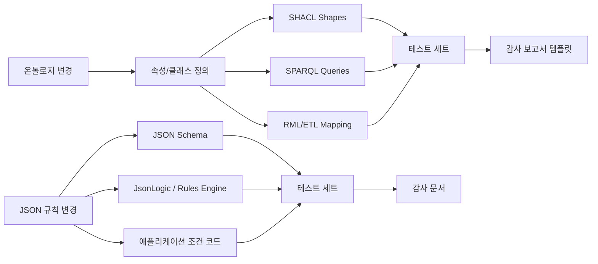

이 글은 [[notes/ontology-agent-behavior-experiment|5번 비교 실험]]에서 확인한 “단순 승인 문제에서는 SHACL이 필수가 아니었다”는 결과를 다음 단계로 확장한다. 질문은 기술 취향이 아니라 **비용을 지불할 승부선**이다.

> JSON 규칙으로 충분한 문제와, 온톨로지의 관계 의미·변경 영향·감사 경로가 실제 이익을 만드는 문제를 어떻게 같은 조건에서 비교할 수 있을까?

## 먼저 결론부터

이 보고서는 **“온톨로지 스택(OWL/RDF/SPARQL/SHACL)이 언제 JSON 기반 규칙 스택(JSON Schema, JSON 규칙 엔진, JSON-LD+외부 규칙)보다 실질적으로 우월해지는가”**를 실험적으로 판별하기 위한 연구 설계를 제안한다. 핵심 결론부터 말하면, 문헌과 표준을 종합할 때 **단일 문서 구조 검증이나 얕은 조건 분기**에서는 JSON 계열이 더 단순하고 빠를 가능성이 높지만, **다중 홉 추론, 스키마/도메인 의미 재사용, 변경의 파급효과 관리, 감사 가능한 설명 경로**가 중요해질수록 온톨로지 기반 접근의 우위가 커질 가능성이 높다. 이는 JSON Schema가 본질적으로 구조·검증·문서화 중심의 표준이고, JSON-LD도 자체적으로는 링크드데이터 직렬화 형식인 반면, OWL/RDF/SPARQL은 그래프 의미론과 추론을 전제로 설계되었기 때문이다.[src_001](#src-001)[src_002](#src-002)[src_003](#src-003)

구체적으로 본 보고서는 세 가지 주 연구 질문을 중심으로 한다. 첫째, **다중 홉 추론에서의 정확도·성능·확장성**이다. 둘째, **변경 발생 시 영향 범위와 유지보수 비용**이다. 셋째, **감사·투명성·해석 가능성**이다. 이 세 영역은 서로 연결되어 있다. 예를 들어, OWL 2 RL은 규칙 엔진 구현에 적합하도록 설계되어 있고, SPARQL은 RDF 그래프 질의를 표준화하며, SHACL은 RDF 그래프 검증을 담당한다.[src_003](#src-003)[src_004](#src-004)[src_005](#src-005) 반대로 JSON Schema는 인스턴스 검증을, json-rules-engine과 JsonLogic은 휴대 가능한 JSON 규칙 표현을 제공하지만, 다중 홉 그래프 의미론은 엔진 외부 코드나 수작업 규칙 확장으로 메워야 하는 경우가 많다.

도메인은 사용자 요청상 **미지정**이므로, 본 설계는 이를 명시적으로 처리한다. 즉, 하나의 도메인에 과적합되지 않도록 **일반적 지식 그래프 벤치마크**와 **도메인별 시나리오**를 함께 사용한다. 일반 벤치마크로는 LUBM, OWL2Bench, WatDiv를 사용하고, 도메인 시나리오로는 **공공조달·자격심사** 같은 변경·감사 중심 영역을 추천한다. 공공조달 영역은 실제로 온톨로지 변경이 매핑 규칙에 미치는 영향을 다룬 최근 연구 사례가 있어 변경 전파 실험과 잘 맞는다.[src_006](#src-006)

실험의 최종 목표는 “누가 항상 더 좋다”를 선언하는 것이 아니라, **어떤 조건에서 승부가 갈리는지 임계점을 찾는 것**이다. 이 보고서는 그 임계점을 대략 다음과 같이 가설화한다. **홉 수가 3 이상으로 늘고**, **전이성·역관계·서브클래스·동일성 같은 의미론적 관계가 섞이며**, **규칙이 여러 서비스와 스키마에 중복 배치되기 시작하면**, 온톨로지 스택의 정확도·유지보수·감사성 이점이 통계적으로 유의미해질 가능성이 높다. 반대로 **홉 수가 0–1이고**, **입력 JSON 한 건에 대한 구조 검증 또는 간단한 이벤트 판정**이 주업무라면, JSON Schema/Ajv와 JSON 규칙 엔진이 더 낮은 운영 복잡도로 우세할 가능성이 높다. 이는 본 보고서의 **문헌 기반 추론**이며, 실제 검증은 제안된 통제 실험으로 수행되어야 한다.

## 승부선 가설을 직접 바꿔 보기

아래 탐색기는 관계 홉 수, 중복 아티팩트, 변경 빈도, 감사 중요도와 필요한 의미론을 바꿔 보며 JSON 규칙·온톨로지·혼합형의 예상 운영 부담을 비교한다. **표시값은 측정된 성능 수치나 권고 임계값이 아니라, 이 글의 실험 가설을 구조화한 상대 지수**다.

<iframe
  class="interactive-visualization-frame"
  src="/attachments/ontology-vs-json-rules/ontology-vs-json-threshold-explorer.htm"
  title="온톨로지와 JSON 규칙 승부선 가설 탐색기"
  loading="lazy"
  scrolling="no"
  sandbox="allow-scripts allow-same-origin"
  style="height:760px"
></iframe>

## 비교 프레임과 문헌 기반 판단

온톨로지와 JSON 규칙은 겉으로는 모두 “규칙을 기계가 읽게 만든다”는 점에서 비슷해 보이지만, 표준의 목적 자체가 다르다. RDF는 그래프 데이터 모델이고, OWL은 그 위에 형식 의미론을 부여하는 온톨로지 언어이며, SPARQL은 RDF 그래프 질의 언어다. W3C는 OWL 2 프로파일을 통해 **표현력과 추론 효율의 절충**을 명시했고, 특히 OWL 2 RL은 규칙 기반 엔진으로 구현 가능하도록 설계했다.[src_003](#src-003) SHACL은 또 다른 축으로, RDF 그래프에 대한 구조 제약과 검증을 맡으며, 최근 SHACL 1.2 문서와 SHACL Rules 초안은 검증뿐 아니라 추론·규칙 활용까지 포괄하려는 방향을 보여 준다.

반면 JSON Schema는 JSON 데이터의 **구조 정의, 검증, 문서화, 상호작용 제어**를 위한 표준이다. JSON-LD는 JSON을 이용해 링크드데이터를 직렬화하는 형식이며, 기존 JSON과의 호환성을 유지하면서 RDF/링크드데이터 세계로 들어가는 업그레이드 경로를 제공한다.[src_002](#src-002) 그러나 JSON-LD 자체는 추론 엔진이 아니다. JsonLogic과 json-rules-engine은 이 공백을 실용적으로 메우는 도구지만, 현재까지는 W3C와 같은 수준의 단일 의미론 표준이 아니라 **커뮤니티 규약과 구현체 생태계**에 가깝다. JSON Logic 커뮤니티가 2025년 이후 “보다 엄격한 명세와 호환성 자원”을 만들겠다고 밝힌 것 자체가, 현재 구현 간 모호성과 차이가 존재함을 방증한다.

이 차이는 **개방세계 가정과 폐쇄세계 가정의 차이**에서도 드러난다. OWL은 불완전한 데이터를 전제로 결손 사실을 곧바로 거짓으로 보지 않는 개방세계 가정을 채택한다. 반대로 SHACL 검증은 입력 그래프를 주어진 그대로 평가하는 폐쇄세계적 성격이 강하며, 최근 연구도 이 점을 명확히 짚는다. JSON Schema와 대부분의 JSON 규칙 엔진은 실무적으로 SHACL 쪽에 더 가깝다. 즉, “지금 들어온 문서/객체가 이 조건을 만족하는가”를 판정하는 데는 매우 적합하지만, **다른 노드와의 연결을 따라가며 누락된 사실을 추론하는 작업**은 별도의 코드 또는 그래프 변환 단계에 의존하게 된다.

아래 표는 이 보고서가 비교 대상으로 삼는 기술군의 역할과 실험적 의미를 요약한 것이다.

| 기술군              | 실험에서의 역할                     | 강점                                                         | 본질적 한계                                                | 대표 표준·도구                                   |
| ------------------- | ----------------------------------- | ------------------------------------------------------------ | ---------------------------------------------------------- | ------------------------------------------------ |
| RDF + SPARQL        | 그래프 데이터 표현·질의 기준선      | 다중 홉 그래프 탐색에 자연스럽고, 표준 질의 언어가 있음      | 의미론적 추론 자체는 OWL/RDFS/규칙 엔진 결합이 필요        | RDF 1.2, SPARQL 1.2, Apache Jena, GraphDB, RDFox |
| OWL 2 EL/QL/RL/DL   | 의미론적 추론의 핵심 비교축         | 프로파일별로 효율–표현력 절충이 명확함                       | DL은 대규모·고표현력에서 비용이 큼                         | OWL 2 Profiles, HermiT, Openllet                 |
| SHACL               | RDF 구조 검증·감사 보고             | 검증 보고서가 명시적이고, RDF 그래프 품질 관리에 적합        | OWL과의 결합은 구현·설정에 따라 성능 차이가 큼             | SHACL, Jena SHACL, pySHACL                       |
| JSON Schema         | JSON 구조 검증 기준선               | 단순·빠름, 문서화와 검증 출력 형식이 잘 정리됨               | 그래프 추론과 다중 인스턴스 의미론에는 비본질적            | Draft 2020-12, Ajv                               |
| json-rules-engine   | JSON 규칙 엔진 기준선               | 읽기 쉬운 JSON 규칙, 중첩 불리언, 캐시/우선순위 등 실용 기능 | 그래프 의미론·전역 추론은 직접 설계해야 함                 | CacheControl/json-rules-engine                   |
| JsonLogic           | 이식성 높은 표현식 규칙 기준선      | 프론트/백엔드 간 규칙 공유가 쉬움                            | 단일 규칙 AST에는 강하지만, 그래프 추론에는 별도 계층 필요 | json-logic-js, JSON Logic Community              |
| JSON-LD + 외부 규칙 | “JSON 친화적 linked data” 중간 지점 | JSON 친화성과 RDF 변환 가능성의 절충                         | 추론은 JSON-LD가 아니라 외부 규칙 계층이 담당              | JSON-LD 1.1 + JsonLogic/json-rules-engine        |

## 연구 질문과 가설

이 연구의 주 연구 질문은 세 갈래다. 첫째, **다중 홉 추론**에서 온톨로지 스택이 JSON 규칙 스택보다 어느 지점부터 정확도와 유지보수성에서 우세해지는가. 둘째, **스키마·규칙 변화가 발생했을 때** 어느 접근이 더 작은 변경 전파 범위와 더 낮은 수정 비용을 보이는가. 셋째, **감사·설명·투명성** 측면에서 어떤 접근이 더 빠르고 재현 가능한 설명을 제공하는가. 이 질문들은 모두 최근 문헌이 실제로 문제 삼아 온 축과 맞닿아 있다. 예를 들어 OWL reasoner 벤치마크 연구들은 성능과 확장성 병목을, SHACL+추론 연구들은 검증의 정확성과 비용을, 온톨로지 XAI 연구들은 설명의 구조성과 provenance를 강조한다.

이를 바탕으로 다음 가설을 세운다.

| 가설                | 내용                                                                                                                                                                                                                                               | 문헌 기반               |
| ------------------- | -------------------------------------------------------------------------------------------------------------------------------------------------------------------------------------------------------------------------------------------------- | ----------------------- |
| 다중 홉 정확도 가설 | 홉 수가 증가하고 전이성·역관계·서브클래스·동일성 추론이 섞일수록, 온톨로지 스택이 JSON 규칙보다 더 높은 정답률과 더 낮은 규칙 누락률을 보일 가능성이 높다. 이는 OWL 2 RL이 규칙 엔진 구현에 적합하고, RDF/OWL이 연결 의미론을 공식화하기 때문이다. | OWL 2 Profiles          |
| 얕은 검증 비용 가설 | 홉 수가 0–1이고 단일 JSON 인스턴스 검증이 주업무라면, JSON Schema/Ajv가 더 낮은 지연시간과 더 단순한 구현을 보일 가능성이 높다.                                                                                                                    | JSON Schema·Ajv         |
| 변경 전파 가설      | 개념·관계 정의가 여러 규칙 파일과 서비스에 중복될수록 JSON 규칙 접근의 변경 전파 범위가 급격히 커지고, 공통 의미를 중앙화한 온톨로지 접근이 더 적은 아티팩트 수정을 요구할 가능성이 높다.                                                          | 온톨로지 변경 전파 연구 |
| 감사 비용 가설      | 다중 홉 결과의 근거를 설명하는 과제에서는, SHACL 보고서·추론 derivation·proof/explain 기능을 갖춘 온톨로지 스택이 평균 “설명 완료 시간”을 줄일 가능성이 높다.                                                                                      | SHACL·reasoner 문서     |
| 고표현력 비용 가설  | OWL 2 DL 전면 활용 구간에서는 대규모 추론 비용이 커질 수 있으므로, 실무 승부선은 종종 OWL 2 RL/QL + SHACL + 선택적 DL 검증으로 형성될 가능성이 높다.                                                                                               | OWL 2 Profiles          |

도메인과 운영 조건의 미지정 사항은 다음과 같이 처리한다.

| 항목        | 상태   | 본 보고서 기본값                                        | 이유                                            |
| ----------- | ------ | ------------------------------------------------------- | ----------------------------------------------- |
| 특정 도메인 | 미지정 | 일반 벤치마크 + 공공조달 시나리오 병행                  | 일반성과 변경·감사 중요도를 동시에 확보         |
| 배포 형태   | 미지정 | 오프라인 배치 벤치마크 + 단일 노드 서비스 테스트        | 재현성과 비교 용이성 확보                       |
| 하드웨어    | 미지정 | 16 vCPU, 64GB RAM, NVMe, Linux                          | 메모리·추론 비용 측정에 충분한 중간급 서버 기준 |
| 동시성 요구 | 미지정 | 기본은 단일 스레드/단일 클라이언트, 추가로 8동시성 부하 | 엔진 고유 성능과 서비스 상황을 분리 측정        |
| 평가자 수준 | 미지정 | 실무 경력 2년 이상 엔지니어/데이터 모델러 12–20명       | 유지보수·감사 시간 측정의 현실성 확보           |

## 실험 설계

실험은 한 번에 하나의 거대 비교를 하지 않고, **세 개의 데이터셋 패밀리**로 나눈다. 첫 번째는 **온톨로지 추론 성능 패밀리**로, LUBM과 OWL2Bench를 사용한다. LUBM은 대학 도메인의 반복 가능한 합성 데이터를 제공해 대규모 지식베이스 성능 비교에 유리하고, OWL2Bench는 OWL 2 프로파일별 TBox와 가변 크기 ABox, 추론 질의를 제공해 reasoner의 커버리지·확장성·질의 성능을 비교하게 해 준다.[src_007](#src-007)[src_008](#src-008) 두 번째는 **질의 다양성 패밀리**로, WatDiv를 사용한다. WatDiv는 구조와 선택도가 다른 다양한 SPARQL 질의를 제공하므로 홉 수와 구조 다양성에 따른 엔진 반응을 보기 좋다.[src_009](#src-009) 세 번째는 **변경·감사 패밀리**로, 최근 공공조달 영역의 ontology evolution–mapping propagation 연구를 참고한 버전드(versioned) 도메인 KG를 합성 생성한다.

데이터 규모는 소형·중형·대형 세 구간으로 나누는 것이 적절하다. 온톨로지 실험은 최소 수십만 트리플에서 시작해 수천만 트리플까지 올라가야 하고, 변경 영향 실험은 단순 트리플 수보다 **아티팩트 수**가 더 중요하므로 온톨로지, SHACL shape, SPARQL query, JSON Schema, 규칙 파일, 변환기 코드, 테스트 케이스를 함께 버전 관리해야 한다. 단순 데이터 크기만이 아니라 **의미론적 난이도 축**도 독립 변수로 넣어야 한다.

실험 조건은 크게 다섯 엔진군으로 나눈다.

| 군                | 스택                                          | 주 용도                               | 권장 설정                                           |
| ----------------- | --------------------------------------------- | ------------------------------------- | --------------------------------------------------- |
| 온톨로지 기본     | RDF + SPARQL만 사용                           | 그래프 질의 순수 기준선               | Jena Fuseki/TDB2, 추론 off                          |
| 온톨로지 실무형   | OWL 2 RL + SHACL                              | 멀티홉·검증·설명 중심 핵심 비교군     | materialization과 SHACL 검증을 분리 측정            |
| 온톨로지 고표현력 | OWL 2 DL                                      | 작은/중간 규모에서 정합성·설명성 비교 | HermiT 또는 Openllet, 대형 구간은 선택적 샘플링     |
| JSON 검증형       | JSON Schema                                   | 단일 문서·구조 검증 기준선            | Draft 2020-12, Ajv strict mode, verbose output 저장 |
| JSON 규칙형       | json-rules-engine / JsonLogic / JSON-LD+rules | 이벤트·정책·휴대형 조건 평가          | 규칙·스키마·projection 분리 저장, 디버그 로그 수집  |

온톨로지 툴체인은 하나의 제품에 올인하기보다 **표준 중심의 이중 구현**이 좋다. 특정 엔진의 최적화가 곧 접근 방식 전체의 우월성을 의미하지 않기 때문이다. 주력 실험은 RL/SHACL에 두고, DL은 표현력 상한선과 정합성 검증용으로 두는 편이 합리적이다.

JSON 툴체인에서는 Ajv를 구조 검증 대표로 두는 것이 적절하다. Ajv는 JSON Schema Draft 2020-12를 지원하고, 스키마를 검증 코드로 컴파일하는 방식으로 동작한다.[src_010](#src-010) json-rules-engine은 사람이 읽기 쉬운 JSON 규칙과 중첩 불리언을 제공하므로 이벤트형 정책 판단에 적합하다. JsonLogic은 연산자를 key 위치에 두는 단일 AST 형식으로 프론트/백엔드 간 규칙 공유에 유리하다. 실험에서는 **버전 고정과 테스트 스위트 동봉**이 필수다.

측정 지표는 아래처럼 정의한다.

| 지표           | 정의                                                         | 수집 방식                           |
| -------------- | ------------------------------------------------------------ | ----------------------------------- |
| 정확도         | 예측된 답/위반/설명 경로가 논리적 oracle과 일치하는 비율     | 합성 생성기가 만든 정답 집합과 비교 |
| 응답시간       | 질의·검증·규칙평가의 p50/p95/p99 지연시간                    | cold/warm run 분리 측정             |
| 메모리         | peak RSS, GC 이후 steady-state RSS                           | OS 계측 + 프로세스 샘플링           |
| 홉별 성능      | 홉 수 1–6에 따른 응답시간·정확도 변화                        | 질의 템플릿별 층화 실험             |
| 변경 전파 범위 | 변경 후 영향을 받은 아티팩트 수, 영향 closure 크기           | dependency graph 분석               |
| 유지보수 비용  | 수정 LOC, touched artifact 수, rerun test 수, 개발 시간      | controlled task + 저장소 로그       |
| 감사 비용      | 설명 완성 시간, 근거 완전성, 재현 가능성, reviewer 간 일치도 | human audit task                    |
| 설명 품질      | derivation/path completeness, 중복/허위 위반 수              | 자동 스코어 + 인적 평가             |

## 구현 예시와 실험 프로토콜

실험 프로토콜은 아래와 같이 설계하면 재현성과 공정성을 동시에 잡을 수 있다.

| 단계           | 입력                                       | 출력                                     | 핵심 측정                           |
| -------------- | ------------------------------------------ | ---------------------------------------- | ----------------------------------- |
| 데이터 생성    | LUBM/OWL2Bench/WatDiv + 도메인 생성기 seed | RDF 그래프, JSON projection, 정답 oracle | 생성 시간, 데이터 크기              |
| 의미 계층 구축 | OWL/RDFS/SHACL 또는 JSON Schema/규칙 파일  | 버전 고정된 스키마·규칙·shape 세트       | 규칙 수, axioms 수                  |
| 기준선 실행    | 추론 off RDF/SPARQL, JSON Schema only      | 질의/검증 결과                           | 구조 검증 지연, 오류 탐지           |
| 멀티홉 실행    | 홉 수 1–6 질의 템플릿                      | 답 집합·설명 경로                        | 정확도, p95, peak RSS               |
| 변경 주입      | 클래스/속성/제약/정책 1개씩 변경           | 새 온톨로지/새 규칙/새 shape             | 영향 closure, touched artifacts     |
| 재검증         | 변경 후 전체 테스트 재실행                 | 실패 목록·변경 요약                      | 재실행 시간, 회귀 실패 수           |
| 감사 태스크    | “왜 이 판정이 나왔는가?” 질문 세트         | human-readable explanation packet        | 설명 완료 시간, 완전성, 평가자 일치 |
| 통계 분석      | 수집된 CSV/로그/리뷰 스코어                | 모델·효과크기·신뢰구간                   | 유의성, 효과크기                    |

이 프로토콜은 SHACL validation report, Jena의 추론·검증 산출물, JSON Schema output formatting과 같은 각 스택의 **관측 가능한 내부 산출물**을 활용하도록 설계되어 있다. 연구의 핵심은 응답시간뿐 아니라, **무엇이 자동 설명 가능한 산출물로 남는가**를 같이 재는 데 있다.

변경 영향은 dependency graph로 모델링한다. 온톨로지 스택에서는 클래스·속성·shape·query·매핑이 명시적 링크를 형성하므로, 영향 closure를 상대적으로 구조화해서 계산할 수 있다. 최근 연구도 온톨로지 변화가 매핑 규칙과 같은 종속 아티팩트에 어떻게 전파되는지를 다루며, 변경 탐지와 반자동 갱신을 결합한 선언적 파이프라인을 제안했다.[src_006](#src-006) JSON 규칙 스택에서도 동일한 그래프를 만들 수는 있지만, 관례적으로 의미가 스키마·규칙·애플리케이션 코드에 분산되는 경우가 많아 영향 경계가 흐려질 가능성이 있다.



### 샘플 데이터와 쿼리 예시

아래 RDF/OWL 예시는 **역관계 + 서브클래스 + 멀티홉**이 섞인 최소 사례다. 이런 유형은 온톨로지 스택에서 자연스럽지만, JSON 규칙 스택에서는 대개 projection과 중복 조건이 추가된다. OWL은 온톨로지를 형식 의미론으로 정의하고, SPARQL은 RDF 그래프를 질의하며, SHACL은 RDF 그래프를 검증한다는 점이 이 예시의 배경이다.

```turtle
@prefix ex: <http://example.org/> .
@prefix rdf: <http://www.w3.org/1999/02/22-rdf-syntax-ns#> .
@prefix rdfs: <http://www.w3.org/2000/01/rdf-schema#> .
@prefix owl: <http://www.w3.org/2002/07/owl#> .

ex:AcademicStaff a owl:Class .
ex:Professor a owl:Class ; rdfs:subClassOf ex:AcademicStaff .

ex:advisorOf a owl:ObjectProperty ; rdfs:subPropertyOf ex:mentorOf .
ex:mentorOf a owl:ObjectProperty ; owl:inverseOf ex:mentoredBy .
ex:mentoredBy a owl:ObjectProperty .

ex:kim a ex:Professor ;
       ex:advisorOf ex:lee .
```

이 RDF 예시에 대해 아래 질의는 명시적으로는 존재하지 않는 `ex:mentoredBy`와 `ex:AcademicStaff`를 찾아야 하므로, 스키마 지식의 활용 여부가 결과를 바꾼다.

```sparql
PREFIX ex: <http://example.org/>
SELECT ?staff
WHERE {
  ?staff ex:mentoredBy ex:lee .
  ?staff a ex:AcademicStaff .
}
```

SHACL 검증도 같은 설정에서 함께 돌릴 수 있다. SHACL은 입력 그래프 검증 언어이며, 구현은 entailment regime을 지원할 수도 있고 그렇지 않을 수도 있으므로, 실험에서는 **추론 전/후 SHACL 결과**를 분리 수집해야 한다.

```turtle
@prefix sh: <http://www.w3.org/ns/shacl#> .
@prefix ex: <http://example.org/> .

ex:StaffShape a sh:NodeShape ;
  sh:targetClass ex:AcademicStaff ;
  sh:property [
    sh:path ex:mentoredBy ;
    sh:minCount 1 ;
  ] .
```

JSON 쪽 최소 대응 예시는 아래와 같다. JSON Schema는 구조를 검증하고, JsonLogic이나 json-rules-engine은 판정 규칙을 수행한다. 그러나 역관계나 서브클래스 같은 의미론을 자동으로 얻지 못하므로, 보통은 이미 전개된(flattened) 필드를 미리 만들어 주거나, 규칙에서 여러 조건을 중복 기술하게 된다. 이것이 바로 변경 비용 실험에서 측정해야 할 포인트다.

```json
{
  "$schema": "https://json-schema.org/draft/2020-12/schema",
  "type": "object",
  "required": ["staffId", "role", "menteeIds"],
  "properties": {
    "staffId": { "type": "string" },
    "role": { "type": "string", "enum": ["Professor", "Researcher", "Staff"] },
    "menteeIds": {
      "type": "array",
      "items": { "type": "string" }
    }
  }
}
```

```json
{
  "and": [{ "==": [{ "var": "role" }, "Professor"] }, { "in": ["lee", { "var": "menteeIds" }] }]
}
```

### 벤치마크 실행 스크립트 예시

아래 Python 스크립트는 엔진을 외부 프로세스로 호출하고, 응답시간과 메모리, exit code를 CSV로 남기는 최소 골격이다. 실제 연구에서는 각 엔진 별 wrapper를 만들어 동일한 입력과 동일한 워밍 조건을 맞춰야 한다.

```python
from __future__ import annotations

import csv
import os
import subprocess
import time
from dataclasses import dataclass
from typing import List

import psutil


@dataclass
class RunResult:
    system: str
    task_id: str
    elapsed_ms: float
    peak_rss_mb: float
    return_code: int


def run_and_measure(system: str, task_id: str, cmd: List[str]) -> RunResult:
    start = time.perf_counter()
    proc = subprocess.Popen(cmd)
    ps_proc = psutil.Process(proc.pid)
    peak_rss = 0

    while proc.poll() is None:
        try:
            rss = ps_proc.memory_info().rss
            peak_rss = max(peak_rss, rss)
        except psutil.Error:
            pass
        time.sleep(0.01)

    elapsed_ms = (time.perf_counter() - start) * 1000.0
    return RunResult(
        system=system,
        task_id=task_id,
        elapsed_ms=elapsed_ms,
        peak_rss_mb=peak_rss / (1024 * 1024),
        return_code=proc.returncode,
    )


def append_csv(path: str, result: RunResult) -> None:
    exists = os.path.exists(path)
    with open(path, "a", newline="", encoding="utf-8") as f:
        writer = csv.DictWriter(
            f,
            fieldnames=["system", "task_id", "elapsed_ms", "peak_rss_mb", "return_code"],
        )
        if not exists:
            writer.writeheader()
        writer.writerow(result.__dict__)
```

이때 JSON Schema 쪽은 Ajv CLI 또는 Node wrapper, json-rules-engine은 별도 Node runner, RDF/OWL 쪽은 Jena/Fuseki와 DL reasoner wrapper로 분리하면 된다. 특히 온톨로지 쪽은 materialization 기반과 query-time reasoning 기반을 분리해야 비교가 공정하다.

## 통계 분석과 예상 결과 해석

통계 분석은 단순 평균 비교로 끝내면 안 된다. 왜냐하면 이 문제는 **표현 방식 × 홉 수 × 데이터 규모 × 의미론 난이도 × 변경 유형**이 얽힌 다요인 문제이기 때문이다. 따라서 주 분석은 **혼합효과 모형**으로 가는 것이 가장 타당하다. 정확도는 로지스틱 mixed-effects model, 응답시간과 메모리처럼 비대칭 분포를 보일 가능성이 큰 지표는 로그 변환 후 선형 mixed-effects model 또는 감마 GLMM을 사용한다. 고정효과는 `representation`, `hop_count`, `dataset_family`, `size_bucket`, `change_type`, `reasoning_mode`로 두고, 랜덤효과는 `query_template`, `seed`, `subject_participant`를 둔다. 다중비교는 Holm 또는 Benjamini–Hochberg로 보정하고, 효과크기는 오즈비·표준화 β·Cliff’s delta를 병기한다.

감사 비용과 유지보수 시간은 사람 과제가 섞이므로, **교차 설계(crossover)**가 중요하다. 같은 참가자가 온톨로지 조건과 JSON 조건을 모두 경험하되, 순서를 무작위화해야 학습 효과를 줄일 수 있다. 과제는 “왜 이 사례가 위반인가/통과인가”, “이 변경이 어떤 테스트를 깨뜨렸는가”, “제약 변경 후 어느 파일을 고쳐야 하는가”의 세 종류로 제한하는 것이 좋다. 설명 품질은 단순 시간만 아니라 **근거 완전성**, **중복 없는 설명**, **검토자 간 일치도**를 함께 봐야 한다.

예상 결과는 다음과 같이 해석하는 것이 가장 문헌 친화적이다. 먼저, **단일 JSON 인스턴스 구조 검증**에서는 Ajv 기반 JSON Schema가 가장 빠르고 단순할 가능성이 높다. 그러나 이 장점은 어디까지나 “이미 필요한 정보가 같은 문서 안에 있고, 의미론적 closure를 바깥에서 계산할 필요가 없을 때” 강하다.

둘째, **다중 홉 + 의미론 혼합** 구간에서는 온톨로지 스택이 우세할 가능성이 높다. 이 우위는 “순수 속도”보다 먼저 **정확도와 규칙 재사용성**에서 나타날 가능성이 크다. 반대로 JSON 규칙 스택은 멀티홉 의미를 재현하려면 사전 전개, 투영 필드, 중복 규칙, lookup 코드가 늘어나 유지보수 부채가 커지기 쉽다. 이 부분은 문헌이 직접 “JSON 규칙이 온톨로지보다 뒤진다”고 말하는 것은 아니지만, 각 표준의 목적과 구현 방식을 종합하면 충분히 타당한 **연구 가설**이다.

셋째, **변경 영향**에서 온톨로지 우위는 특히 눈에 띌 가능성이 있다. 최근 연구는 온톨로지 변경이 RML 매핑에 미치는 영향을 분석하고, semi-automatic propagation 도구가 지식공학자의 개입을 줄일 수 있음을 보였다. 따라서 실험적으로는 **개념명 변경, 속성 range/domain 변경, 제약 강화/완화** 같은 수정이 있을 때, 온톨로지 조건이 더 적은 touched artifact 수와 더 낮은 회귀 실패 수를 보일 것으로 예상된다.

넷째, **감사·설명**에서는 온톨로지 스택이 강할 공산이 크다. Jena 계열은 RDF 저장·SPARQL·추론·SHACL을 한 도구군에서 관찰할 수 있고, 다른 reasoner의 explanation 기능을 별도 비교군으로 붙일 수 있다.[src_011](#src-011)[src_012](#src-012) SHACL은 validation report를 표준 산출물로 다룬다. JSON Schema도 상세한 검증 출력을 만들 수 있지만, 이는 어디까지나 검증 결과 구조화이지 **다중 홉 논리 증명**과는 다르다.

다섯째, **고표현력 OWL DL은 항상 승자가 아니다**. OWL 2 프로파일 자체가 표현력과 계산 특성의 절충을 위해 분리되어 있다. 따라서 실무적 결론은 “온톨로지냐 JSON 규칙이냐”의 이분법보다, **JSON Schema/Ajv for shallow validation + OWL 2 RL/SHACL for relational semantics + 선택적 OWL DL 검증**이라는 계층적 아키텍처일 가능성이 높다. 실험은 이 균형점까지 검증해야 한다.[src_003](#src-003)

## 한계와 윤리 및 실무 고려

가장 큰 방법론적 한계는 **비교의 공정성**이다. 온톨로지 스택은 그래프 모델과 의미론을 내장하고 있고, JSON 규칙 스택은 그렇지 않다. 따라서 “같은 문제를 같은 입력으로 푼다”는 표면적 공정성만으로는 충분하지 않다. 더 중요한 것은 **같은 추상 문제를 각 접근의 자연스러운 구현 방식으로 풀게 하되, 추가 projection/중복 규칙/전처리 코드도 비용으로 포함하는 것**이다. JSON-LD는 특히 주의가 필요하다. JSON-LD를 쓴다고 자동으로 온톨로지 실험이 되는 것이 아니며, JSON-LD는 링크드데이터 직렬화 형식일 뿐 추론은 외부 계층이 담당한다.

두 번째 한계는 **구현 성숙도 차이**다. 이 연구는 제품군 대결이 아니라 **표준 역할 대결**이라는 점을 끝까지 유지해야 한다. 모든 실험은 Docker 이미지, Git commit hash, exact configuration, warm-up policy, timeout policy를 완전히 고정해야 한다.

세 번째는 **윤리와 인적 평가 설계**다. 개발·감사 시간 측정을 위해 실제 엔지니어를 참여시키는 경우, 이는 엄연한 human-subject study에 해당한다. 참가자 동의, 시간 보상, 업무 경력 분포의 균형, 그리고 과제의 비기밀성 보장이 필요하다. 특히 특정 도메인이 규제 민감 영역이라면, 실제 운영 데이터를 쓰기보다 합성 데이터와 공개 스키마를 사용하는 것이 안전하다. 본 보고서는 도메인을 미지정 상태로 두었기 때문에, 1차 실험은 전부 합성 또는 공개 데이터 기반으로 수행하는 것이 적절하다.

네 번째는 **실무 해석의 과도한 일반화**를 피해야 한다는 점이다. 예를 들어 JSON 규칙 스택이 불리하다고 나오더라도, 조직 역량이 JavaScript/TypeScript 중심이고 그래프 전문 인력이 없으면 총소유비용은 반대로 나올 수 있다. 반대로 온톨로지 스택이 정확도와 감사성에서 우위여도, 비즈니스 요구가 얕은 정책 검증에 머무르면 투자 대비 효용은 작을 수 있다. 따라서 최종 보고서에서는 반드시 “승부선 조건”을 함께 적어야 한다. 즉, **온톨로지가 이긴 조건**, **JSON 규칙이 이긴 조건**, **혼합형이 가장 타당한 조건**을 나눠 제시해야 한다.

마지막으로, SHACL 1.2 Rules는 2026년 7월 현재 Working Draft이므로, 본 연구의 핵심 비교군에서는 **탐색적 부가 실험**으로 두는 편이 안전하다. 주 비교군은 여전히 OWL 2 RL/RDFS/SHACL Recommendation/JSON Schema 2020-12/성숙한 JSON 규칙 라이브러리로 구성해야 한다.[src_005](#src-005)[src_013](#src-013)

## 핵심만 다시 정리하면

온톨로지는 **다중 홉, 의미론 재사용, 변경 전파 관리, 감사 가능한 설명**이 중요해질수록 JSON 규칙보다 우세해질 가능성이 높고, 특히 OWL 2 RL + SHACL + SPARQL 조합이 실무 승부선이 될 가능성이 크다.  
JSON Schema/Ajv와 JSON 규칙 엔진은 **얕은 구조 검증과 단순 정책 판정**에서는 더 단순하고 빠를 수 있지만, 그래프 의미를 수작업으로 확장할수록 정확도·유지보수·감사 비용에서 불리해질 가능성이 높다.  
가장 타당한 연구 설계는 **LUBM·OWL2Bench·WatDiv + 버전드 도메인 KG**를 이용해 홉 수, 데이터 규모, 변경 유형, 설명 과제를 교차시키고, 정확도·지연·메모리·영향 범위·개발/감사 시간을 혼합효과 모형으로 분석하는 것이다.

## 참고문헌

<a id="src-001"></a>

- JSON Schema. [Draft 2020-12](https://json-schema.org/draft/2020-12).

<a id="src-002"></a>

- W3C. [JSON-LD 1.1](https://www.w3.org/TR/json-ld11/).

<a id="src-003"></a>

- W3C. [OWL 2 Web Ontology Language Profiles (Second Edition)](https://www.w3.org/TR/owl2-profiles/).

<a id="src-004"></a>

- W3C. [SPARQL 1.2 Query Language](https://www.w3.org/TR/sparql12-query/) (Working Draft).

<a id="src-005"></a>

- W3C. [Shapes Constraint Language (SHACL)](https://www.w3.org/TR/shacl/).

<a id="src-006"></a>

- OpenReview. [Propagating Ontology Changes to Declarative Mappings in Construction of Knowledge Graphs](https://openreview.net/forum?id=ONL4LGlHNu).

<a id="src-007"></a>

- Lehigh University. [Lehigh University Benchmark (LUBM)](https://swat.cse.lehigh.edu/projects/lubm/).

<a id="src-008"></a>

- Singh, G., Bhatia, S., & Mutharaju, R. (2020). [OWL2Bench: A Benchmark for OWL 2 Reasoners](https://doi.org/10.1007/978-3-030-62466-8_6).

<a id="src-009"></a>

- University of Waterloo Data Systems Group. [Waterloo SPARQL Diversity Test Suite (WatDiv)](https://dsg-uwaterloo.github.io/watdiv/).

<a id="src-010"></a>

- Ajv. [JSON Schema validator documentation](https://ajv.js.org/).

<a id="src-011"></a>

- Apache Jena. [Documentation overview](https://jena.apache.org/documentation/index.html).

<a id="src-012"></a>

- Apache Jena. [SHACL implementation and Fuseki integration](https://jena.apache.org/documentation/shacl/).

<a id="src-013"></a>

- W3C. [SHACL 1.2 Rules](https://www.w3.org/TR/shacl12-rules/) (Working Draft).
