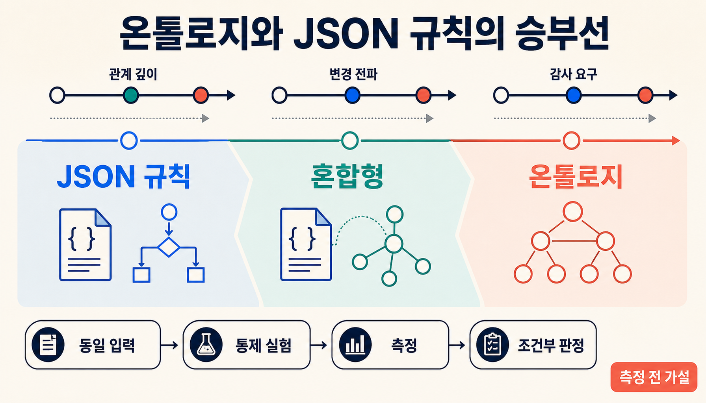
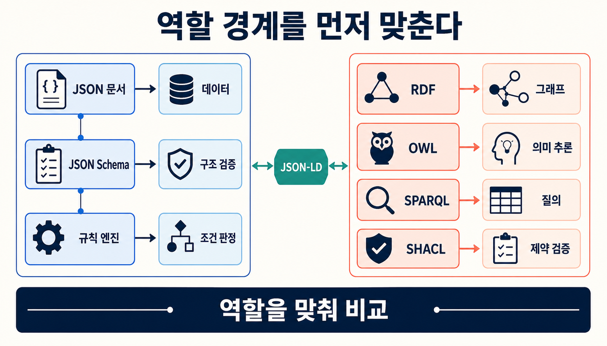
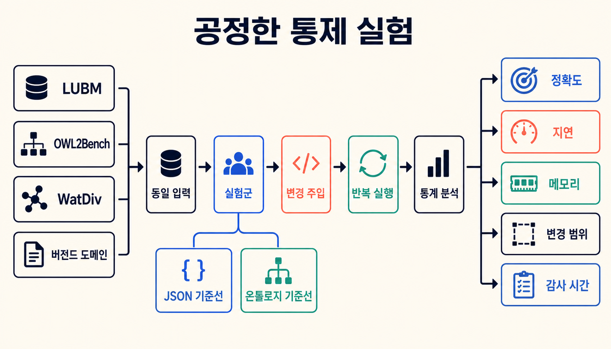
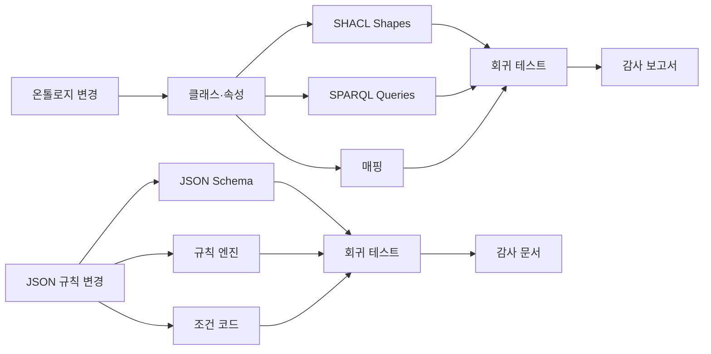
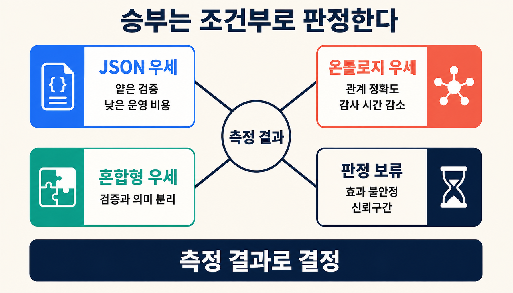

[[notes/ontology-agent-behavior-experiment|5번 비교 실험]]에서는 단순한 발행 승인 문제라면 JSON 규칙, 구조화 검색 카드, SHACL이 같은 결론에 도달할 수 있음을 확인했다. 이번에는 질문을 한 단계 더 밀어 본다.

> JSON 규칙만으로 충분한 문제와, 관계 의미·변경 영향·감사 경로를 갖춘 온톨로지가 제값을 하는 문제를 어떻게 같은 조건에서 비교할까?

> [!important] 이 글의 성격
> 이 글은 제품 성능 결과가 아니라 **온톨로지와 JSON 규칙의 승부선을 찾기 위한 통제 실험 설계**다. 아래에서 언급하는 “3홉 이상” 같은 경계도 문헌과 표준의 역할 차이에서 세운 사전 가설이다. 실제 임계값은 제안한 실험을 끝낸 뒤에야 정할 수 있다.

## 조사 질문과 핵심 결론

관심사는 “어느 기술이 늘 더 좋은가”가 아니다. **문제가 얼마나 복잡해져야 온톨로지의 의미 계층이 측정 가능한 이익을 만드는가**를 묻는다.

문헌과 표준만 놓고 보면 결론은 세 갈래다.

1. **단일 문서의 구조 검증과 얕은 조건 판정**에서는 JSON Schema와 일반 규칙 엔진이 더 단순한 기준선이 될 가능성이 높다.
2. **다중 홉 관계, 전이성·역관계·서브클래스·동일성, 여러 서비스에 흩어진 중복 의미**가 늘어날수록 RDF·OWL·SPARQL 계층을 재사용할 가치가 커질 가능성이 높다.[src_001](#src-001)[src_002](#src-002)[src_003](#src-003)
3. 실무에서는 하나의 순수 스택보다 **얕은 검증은 JSON, 관계 의미와 감사는 온톨로지로 나눈 혼합형**이 더 나을 수 있다. 다만 정확도·지연시간·변경 범위·검토 시간을 함께 재기 전에는 단정할 수 없다.

## 조사 범위와 방법

두 진영은 애초에 같은 종류의 도구가 아니다. JSON Schema는 JSON 인스턴스의 구조 정의와 검증에 초점을 맞춘다. JSON-LD는 링크드데이터 직렬화 형식이다.[src_001](#src-001)[src_002](#src-002) RDF는 그래프 데이터 모델이고, OWL은 형식 의미론, SPARQL은 그래프 질의, SHACL은 RDF 그래프 검증을 맡는다.[src_003](#src-003)[src_004](#src-004)[src_005](#src-005)

그래서 제품 이름끼리 바로 맞붙이지 않고 세 층으로 나눠 본다.

- **표현과 저장:** JSON 문서·JSON-LD·RDF 그래프
- **판정과 추론:** JSON 규칙·RDFS/OWL 프로파일·외부 규칙
- **검증과 감사:** JSON Schema 출력·SHACL validation report·추론 경로

일반성을 확보하려고 LUBM, OWL2Bench, WatDiv 같은 공개 벤치마크와 변경·감사가 중요한 버전드 도메인 시나리오를 함께 쓴다.[src_006](#src-006)[src_007](#src-007)[src_008](#src-008)[src_009](#src-009) 특정 제품의 최적화를 표현 방식 전체의 우월성으로 착각하지 않도록, 가능하면 각 접근을 두 개 이상의 구현에서 반복한다.

## 1. 먼저 역할 경계를 맞춰야 한다



겉모습은 비슷해도 맡은 일은 다르다.

| 기술군                   | 주 역할                           | 강점                                  | 비교할 때 주의할 점                    |
| ------------------------ | --------------------------------- | ------------------------------------- | -------------------------------------- |
| JSON Schema              | 한 JSON 인스턴스의 구조·형식 검증 | 단순한 도입, 명확한 validation output | 다중 객체 관계 의미는 외부 코드가 담당 |
| JsonLogic·JSON 규칙 엔진 | 이벤트·정책 조건 판정             | 규칙 이동과 애플리케이션 통합이 쉬움  | 전역 그래프 의미와 추론은 직접 설계    |
| JSON-LD                  | JSON 형태의 링크드데이터 직렬화   | 기존 JSON과 RDF 세계의 연결점         | 직렬화 형식 자체가 추론 엔진은 아님    |
| RDF·SPARQL               | 그래프 표현과 다중 홉 질의        | 관계 탐색과 URI 기반 재사용           | 추론은 RDFS·OWL·규칙 계층이 필요       |
| OWL 2 EL·QL·RL·DL        | 클래스·속성 의미와 추론           | 표현력과 계산 특성의 프로파일 선택    | 고표현력 추론은 규모에 따라 비용 증가  |
| SHACL                    | RDF 그래프 제약 검증과 보고       | 명시적인 위반 결과와 감사 산출물      | 원출처의 사실성까지 보증하지는 않음    |

공정하게 비교하려면 각 접근이 요구하는 **projection, 사전 전개, 중복 규칙, 매핑 코드**까지 비용으로 쳐야 한다. RDF 그래프를 JSON 한 건으로 억지로 펴거나, 단순한 폼 검증에 OWL DL 전체를 얹으면 출발부터 불공정하다.

## 2. 승부선을 만드는 세 변수

### 2.1 관계 깊이와 의미론

홉 수가 늘었다고 곧바로 온톨로지가 필요한 것은 아니다. 단순 경로 탐색이라면 일반 코드나 property graph로도 충분하다. 차이는 전이성, 역관계, 서브클래스, 동일성처럼 **명시되지 않은 결과를 어떤 규칙으로 유도하느냐**가 중요해질 때 생긴다. OWL 2 RL은 규칙 기반 구현을 염두에 둔 프로파일이지만, 모든 문제에 OWL DL 수준의 표현력이 필요한 것은 아니다.[src_003](#src-003)

### 2.2 중복 의미와 변경 전파

같은 개념이 스키마, 규칙 파일, 서비스 코드, 매핑에 반복되면 작은 의미 변경도 여러 아티팩트로 번진다. 온톨로지라고 공짜는 아니다. 다만 클래스·속성·shape·query의 의존 관계를 명시해 두면 어디까지 손봐야 하는지 계산하기 쉽다. 온톨로지 변경을 선언적 매핑에 전파하는 연구도 바로 이 문제를 다룬다.[src_006](#src-006)

### 2.3 감사와 설명 요구

최종 참·거짓만 필요하면 작은 규칙이 유리하다. 반대로 “어떤 그래프 버전과 규칙이 이 판정을 만들었는가”까지 재현해야 한다면 validation report, 유도 사실, 질의, 근거 경로가 운영 자산이 된다. 여기서 재야 할 것은 자연어 설명이 그럴듯한지가 아니다. **재현 가능한 설명 패킷을 만드는 데 걸린 시간과 그 완전성**이다.

### 승부선 가설을 직접 바꿔 보기

아래 탐색기에서 관계 홉 수, 중복 아티팩트, 변경 빈도, 감사 중요도, 필요한 의미론을 바꾸면 JSON 규칙·온톨로지·혼합형의 예상 운영 부담이 어떻게 달라지는지 볼 수 있다. 표시값은 측정된 성능이나 권고 임계값이 아니라 이 연구 설계의 상대 가설 지수다.

<iframe
  class="interactive-visualization-frame"
  src="/attachments/ontology-vs-json-rules/ontology-vs-json-threshold-explorer.htm"
  title="온톨로지와 JSON 규칙 승부선 가설 탐색기"
  loading="lazy"
  scrolling="no"
  sandbox="allow-scripts allow-same-origin"
  style="height:760px"
></iframe>

## 3. 공정한 통제 실험을 설계한다



하나의 거대한 데이터셋으로 모든 것을 재기보다, 목적에 따라 세 패밀리로 나눈다.

| 데이터 패밀리 | 목적                                 | 후보                             |
| ------------- | ------------------------------------ | -------------------------------- |
| 추론 커버리지 | OWL 프로파일별 분류·질의·확장성 비교 | LUBM, OWL2Bench                  |
| 질의 다양성   | 홉 수와 질의 구조 변화에 따른 반응   | WatDiv                           |
| 변경·감사     | 스키마·정책 변경 후 영향과 설명 비용 | 버전드 공공조달·자격심사 합성 KG |

비교군은 최소 다섯 개가 필요하다.

| 실험군            | 구성                          | 확인하려는 것                     |
| ----------------- | ----------------------------- | --------------------------------- |
| RDF 기준선        | RDF + SPARQL, 추론 없음       | 그래프 질의 자체의 비용           |
| 온톨로지 실무형   | OWL 2 RL + SHACL              | 빠른 의미 확장과 검증·감사의 결합 |
| 온톨로지 고표현력 | OWL 2 EL 또는 DL              | 분류·정합성의 표현력 상한과 비용  |
| JSON 검증형       | JSON Schema + Ajv             | 단일 문서 구조 검증 기준선        |
| JSON 규칙형       | JsonLogic 또는 JSON 규칙 엔진 | 이벤트·정책 판정과 중복 규칙 비용 |

Ajv는 Draft 2020-12를 지원하며 스키마를 검증 코드로 컴파일한다.[src_010](#src-010) 온톨로지 쪽에서는 materialization과 query-time reasoning을 한데 묶으면 안 된다. 전처리 시간과 질의 시간을 따로 기록한다.

### 측정 지표

| 지표          | 정의                                       | 수집 방식                      |
| ------------- | ------------------------------------------ | ------------------------------ |
| 정확도        | 답·위반·설명 경로가 oracle과 일치하는 비율 | 합성 생성기의 정답 집합과 비교 |
| 응답시간      | 질의·검증·규칙 평가의 p50·p95·p99          | cold·warm run 분리             |
| 메모리        | peak RSS와 안정 상태 RSS                   | 프로세스 계측                  |
| 홉별 성능     | 홉 수 1–6에 따른 정확도와 지연 변화        | 동일 템플릿의 층화 실험        |
| 변경 전파     | 영향을 받은 파일·규칙·shape·query 수       | dependency graph closure       |
| 유지보수 비용 | 수정 시간, touched artifacts, 회귀 실패    | 통제된 개발 과제와 저장소 로그 |
| 감사 비용     | 설명 완료 시간, 완전성, 재현성             | 인적 감사 과제와 자동 검사     |

### 실행 순서

1. 같은 도메인 사실에서 RDF 그래프와 JSON projection을 생성한다.
2. 각 스택의 자연스러운 스키마·규칙·shape를 별도 버전으로 고정한다.
3. 추론 없는 기준선과 각 추론 모드를 분리 실행한다.
4. 클래스명 변경, 속성 범위 변경, 제약 강화 같은 변화 한 개씩 주입한다.
5. 영향 closure, 수정 파일, 회귀 실패와 설명 패킷을 수집한다.
6. 같은 작업을 seed와 질의 템플릿을 바꿔 반복한다.

변경 영향은 아래처럼 추적한다. 두 접근 모두 의존 그래프를 만들 수 있다. 다만 JSON 스택의 의미가 애플리케이션 조건 코드까지 흩어져 있다면 그 코드도 비용에서 빼면 안 된다.



## 4. 최소 사례로 의미 차이를 고정한다

아래 RDF 예시에는 서브클래스와 역관계가 함께 들어 있다.

```turtle
@prefix ex: <http://example.org/> .
@prefix rdfs: <http://www.w3.org/2000/01/rdf-schema#> .
@prefix owl: <http://www.w3.org/2002/07/owl#> .

ex:AcademicStaff a owl:Class .
ex:Professor a owl:Class ; rdfs:subClassOf ex:AcademicStaff .

ex:advisorOf a owl:ObjectProperty ; rdfs:subPropertyOf ex:mentorOf .
ex:mentorOf a owl:ObjectProperty ; owl:inverseOf ex:mentoredBy .

ex:kim a ex:Professor ; ex:advisorOf ex:lee .
```

이 질의는 저장소에 직접 적혀 있지 않은 `AcademicStaff` 타입과 `mentoredBy` 역관계를 추론했는지 확인한다.

```sparql
PREFIX ex: <http://example.org/>
SELECT ?staff
WHERE {
  ?staff ex:mentoredBy ex:lee .
  ?staff a ex:AcademicStaff .
}
```

JSON 조건으로도 같은 판정을 만들 수 있다. 문제는 `role`과 `menteeIds`처럼 미리 펼쳐 둔 필드다. 누가 언제 어떤 규칙으로 만들었는지까지 비용과 provenance에 포함해야 비교가 맞다.

```json
{
  "and": [{ "==": [{ "var": "role" }, "Professor"] }, { "in": ["lee", { "var": "menteeIds" }] }]
}
```

실험 러너는 모든 엔진에 같은 워밍 정책, 제한 시간, 출력 형식을 적용해야 한다. 아래 코드는 응답시간과 메모리를 모으는 최소 골격이다. 실제 엔진 wrapper를 묶어 실행하는 작업은 이 글의 범위에 포함하지 않았다.

```python
from dataclasses import dataclass
import subprocess
import time

import psutil


@dataclass
class RunResult:
    system: str
    task_id: str
    elapsed_ms: float
    peak_rss_mb: float
    return_code: int


def run_and_measure(system: str, task_id: str, command: list[str]) -> RunResult:
    started = time.perf_counter()
    process = subprocess.Popen(command)
    monitored = psutil.Process(process.pid)
    peak_rss = 0

    while process.poll() is None:
        try:
            peak_rss = max(peak_rss, monitored.memory_info().rss)
        except psutil.Error:
            pass
        time.sleep(0.01)

    return RunResult(
        system=system,
        task_id=task_id,
        elapsed_ms=(time.perf_counter() - started) * 1000,
        peak_rss_mb=peak_rss / (1024 * 1024),
        return_code=process.returncode,
    )
```

## 5. 분석 계획과 판정 규칙

이 실험에는 `표현 방식 × 홉 수 × 데이터 규모 × 의미론 난이도 × 변경 유형`이 동시에 얽힌다. 정확도에는 로지스틱 혼합효과 모형을, 지연시간과 메모리에는 로그 변환 선형 혼합효과 모형이나 감마 GLMM을 적용하는 방안을 검토한다. 질의 템플릿, seed, 참가자는 랜덤효과로 두고 다중비교 보정과 효과크기도 함께 보고한다.

판정은 속도 순위 하나로 끝내지 않는다.

- **JSON 우세:** 정확도 차이가 없고, 지연·메모리·수정 시간에서 일관되게 낮은 비용을 보인다.
- **온톨로지 우세:** 관계·추론 과제의 정확도 또는 설명 완전성이 개선되고, 추가 운영 비용을 포함해도 변경·감사 시간이 줄어든다.
- **혼합형 우세:** 얕은 검증은 JSON이 유리하고 관계 의미·감사 영역에서만 온톨로지가 이익을 만든다.
- **판정 보류:** 효과가 데이터셋이나 엔진 하나에만 나타나거나 신뢰구간이 넓다.

## 6. 반대 근거와 대안 가설



복잡한 관계를 다루기 편하다는 이유만으로 온톨로지의 총비용이 낮아지지는 않는다.

- JSON 스택도 명시적인 dependency registry와 provenance를 갖추면 변경 추적이 나아진다.
- 필요한 것이 경로 질의뿐이라면 property graph와 일반 코드가 더 단순할 수 있다.
- 온톨로지 전문 인력, reasoner 운영, 매핑 계층의 비용이 관계 재사용으로 얻는 이익보다 클 수 있다.
- 고표현력 OWL DL은 규모와 공리 구성에 따라 상시 요청 경로에 맞지 않을 수 있다.
- 제품별 최적화 차이가 표준의 역할 차이보다 더 크게 나타날 수도 있다.

가장 강한 대안 가설은 **“필요한 것은 온톨로지 자체가 아니라, 흩어진 의미와 의존성을 명시적으로 관리하는 계층이다”**라는 주장이다. 이를 검증하려면 JSON 규칙 스택에도 같은 수준의 버전 관리와 의존 추적을 제공해야 한다. 온톨로지만 잘 정비한 채 비교하면 결과가 기울어진다.

## 7. 불확실성과 한계

- 이 글은 실험 설계이며 통합 benchmark를 실행한 결과 보고서가 아니다.
- “3홉 이상”은 문헌 기반 사전 가설이지 검증된 보편 임계값이 아니다.
- 공개 벤치마크가 실제 조직의 규칙 중복, 승인 절차와 인력 비용을 완전히 재현하지 못할 수 있다.
- 같은 표준을 구현한 엔진 간 성능 차이가 크므로 제품 하나의 결과를 접근 방식 전체로 일반화하면 안 된다.
- 사람을 대상으로 유지보수·감사 시간을 측정하면 참가자 동의, 보상과 순서 효과 통제가 필요하다.
- SHACL 1.2 Rules는 2026년 7월 현재 Working Draft이므로 핵심 비교군이 아니라 탐색적 부가 실험으로 두는 편이 안전하다.[src_013](#src-013)

## 8. 실무적 의미와 조건부 권고

출발점은 작고 결정론적인 기준선이면 충분하다. 입력 한 건의 구조와 정책을 검사한다면 JSON Schema와 일반 규칙부터 재면 된다. 관계 깊이, 의미 중복, 변경 전파, 감사 시간이 실제 병목으로 드러날 때 RDF·SPARQL·OWL RL·SHACL 계층을 더한다.

온톨로지를 썼다는 사실 자체는 성과가 아니다. 도입 여부는 다음 세 질문으로 판단한다.

1. 관계·추론 과제의 오류가 줄었는가
2. 변경 후 수정·재검증 범위가 줄었는가
3. 근거를 재현하는 감사 시간이 줄었는가

세 가지 이익이 추가 저장소, 매핑, 추론, 전문성 비용을 넘지 못한다면 작은 JSON 규칙이 낫다. 여러 도구와 에이전트가 같은 의미를 거듭 쓰고 변경 영향과 설명 경로가 운영비의 큰 몫을 차지한다면, 그때는 온톨로지 계층을 도입할 이유가 생긴다.

## 참고문헌

<a id="src-001"></a>

- JSON Schema. [Draft 2020-12](https://json-schema.org/draft/2020-12).

<a id="src-002"></a>

- W3C. [JSON-LD 1.1](https://www.w3.org/TR/json-ld11/).

<a id="src-003"></a>

- W3C. [OWL 2 Web Ontology Language Profiles (Second Edition)](https://www.w3.org/TR/owl2-profiles/).

<a id="src-004"></a>

- W3C. [SPARQL 1.2 Query Language](https://www.w3.org/TR/sparql12-query/) (Working Draft).

<a id="src-005"></a>

- W3C. [Shapes Constraint Language (SHACL)](https://www.w3.org/TR/shacl/).

<a id="src-006"></a>

- OpenReview. [Propagating Ontology Changes to Declarative Mappings in Construction of Knowledge Graphs](https://openreview.net/forum?id=ONL4LGlHNu).

<a id="src-007"></a>

- Lehigh University. [Lehigh University Benchmark (LUBM)](https://swat.cse.lehigh.edu/projects/lubm/).

<a id="src-008"></a>

- Singh, G., Bhatia, S., & Mutharaju, R. (2020). [OWL2Bench: A Benchmark for OWL 2 Reasoners](https://doi.org/10.1007/978-3-030-62466-8_6).

<a id="src-009"></a>

- University of Waterloo Data Systems Group. [Waterloo SPARQL Diversity Test Suite (WatDiv)](https://dsg-uwaterloo.github.io/watdiv/).

<a id="src-010"></a>

- Ajv. [JSON Schema validator documentation](https://ajv.js.org/).

<a id="src-011"></a>

- Apache Jena. [Documentation overview](https://jena.apache.org/documentation/index.html).

<a id="src-012"></a>

- Apache Jena. [SHACL implementation and Fuseki integration](https://jena.apache.org/documentation/shacl/).

<a id="src-013"></a>

- W3C. [SHACL 1.2 Rules](https://www.w3.org/TR/shacl12-rules/) (Working Draft).
