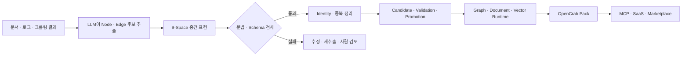
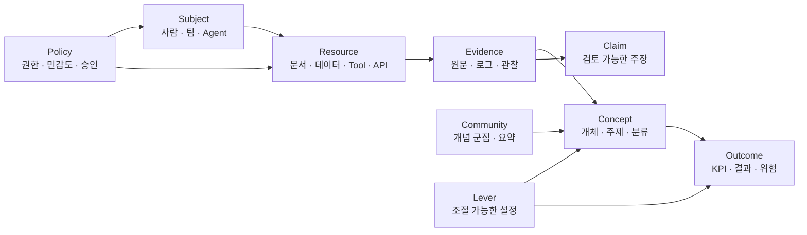

> [!summary] 결론부터
> OpenCrab은 전통적인 RDF·OWL 온톨로지 편집기가 아니다. 더 정확히는 **문서와 로그를 공통 의미 문법으로 바꾸고, Agent가 MCP를 통해 읽고 쓰며, 최종 결과를 설치 가능한 지식 Pack으로 배포하려는 온톨로지 공장**이다. 9-Space는 그 공장의 공통 분류표이고, MCP는 Agent가 공장을 조작하는 공식 창구다. 설계 철학은 매우 좋지만 현재 코드는 검토·승격 절차를 우회할 수 있어, 완성된 온톨로지 컴파일러보다는 문법 검사가 붙은 동적 지식그래프 빌더에 가깝다.

> [!info] 검토 범위
> 이 글은 2026년 7월 21일 확인한 OpenCrab 로컬 체크아웃의 문서와 소스 코드를 기준으로 한다. 분석 당시 체크아웃은 `origin/main`보다 5개 커밋 뒤에 있었으므로 최신 브랜치에서 일부 문제가 수정됐을 수 있다. 선언된 Python 3.11 환경에서는 테스트 **128개가 통과하고 3개가 건너뛰어졌다.** 다만 테스트는 문법, MCP dispatcher, 개별 저장소와 검색 로직 중심이며, approval 우회나 CrabHarness와 9-Space 문법의 전체 정합성까지 모두 검증하지는 않는다.

OpenCrab을 처음 보면 기능이 너무 많아 보인다. 9개의 의미 공간, LLM 추출, 그래프 검색, 벡터 검색, ReBAC 권한 검사, 영향 분석, workflow, approval, identity, promotion, billing, schema pack, CrabHarness, OpenCrab Pack, 로컬 MCP와 원격 MCP까지 한 저장소에 들어 있다.

기능 이름만 나열하면 초보자는 금방 길을 잃는다. 그래서 이 글에서는 OpenCrab을 **도서관이 아니라 공장**으로 비유해 설명한다.

- 도서관은 이미 만들어진 지식을 찾아 읽는 곳이다.
- 공장은 원문을 받아 분류하고, 불량을 검사하고, 제품으로 포장해 내보낸다.
- OpenCrab이 만들려는 것은 두 번째에 가깝다.

초보자는 우선 세 가지만 기억하면 된다.

1. **9-Space는 지식을 담는 아홉 개의 서랍이다.**
2. **MCP는 Agent가 그 서랍을 읽고 수정하는 공식 창구다.**
3. **Pack은 검사가 끝난 온톨로지를 배포하는 완제품 상자다.**

이제 각 부품이 무엇이고, 왜 그렇게 만들었는지를 순서대로 살펴보자.

## 1. 먼저, 온톨로지는 무엇인가

온톨로지를 어렵게 말하면 “어떤 세계에 무엇이 존재하고, 서로 어떤 관계를 맺으며, 어떤 표현이 허용되는지 정한 명세”다. 쉽게 말하면 **데이터에 공통 의미를 붙이는 약속**이다.

예를 들어 문서에 다음 문장이 있다고 하자.

> 캐시 시간이 너무 길어 오래된 데이터가 노출됐고, 운영팀이 캐시 시간을 300초에서 60초로 줄였다.

일반 문서 검색은 이 문장을 그대로 보관한다. 온톨로지로 바꾸면 다음처럼 의미를 나눌 수 있다.

- `캐시 시간`은 조절 가능한 설정이다.
- `오래된 데이터 노출`은 위험 또는 결과다.
- 캐시 시간이 오래된 데이터 노출에 영향을 준다.
- 운영팀이 설정을 변경했다.
- 이 주장의 근거는 특정 운영 보고서의 특정 문장이다.

이렇게 나누면 Agent는 단순히 비슷한 문장을 찾는 것을 넘어 다음 질문을 할 수 있다.

- 오래된 데이터 위험에 영향을 주는 설정은 무엇인가?
- 누가 그 설정을 바꿀 권한이 있는가?
- 이 판단의 근거 문서는 무엇인가?
- 캐시 시간을 바꾸면 어떤 결과가 함께 달라질 수 있는가?

OpenCrab은 이런 질문을 하나의 공통 구조로 다루려 한다.

## 2. OpenCrab은 왜 온톨로지를 ‘컴파일’하려 하는가

OpenCrab의 온톨로지 빌드 과정을 가장 잘 설명하는 비유는 컴파일러다.

컴파일러는 사람이 쓴 코드를 곧바로 실행하지 않는다.

1. 문장을 읽는다.
2. 정해진 문법에 맞는지 검사한다.
3. 변수와 함수가 무엇을 뜻하는지 연결한다.
4. 실행 가능한 형태로 바꾼다.
5. 배포 파일로 만든다.

OpenCrab도 비슷한 흐름을 지향한다.

| OpenCrab 구성요소     | 컴파일러에 비유하면 | 실제 역할                             |
| --------------------- | ------------------- | ------------------------------------- |
| `grammar/manifest.py` | 언어 문법           | 허용 Space, node type, relation 정의  |
| `grammar/glossary.py` | 언어 설명서         | 각 용어의 사람용 의미 설명            |
| YAML type schema      | 자료형 정의         | 일부 node 속성의 필수값과 enum 검사   |
| `LLMExtractor`        | 번역기·parser       | 자연어를 node와 edge 후보로 변환      |
| `OntologyBuilder`     | 중간 표현 생성기    | 검사된 그래프를 저장소에 기록         |
| Identity              | 이름표 관리대장     | 같은 개체의 별칭과 중복 후보 관리     |
| Canonicalization      | 연결 편집기         | 여러 이름을 대표 ID에 연결            |
| Promotion             | 출고 승인           | 후보 지식을 검증·승격 상태로 이동     |
| HybridQuery           | 실행 환경           | 만들어진 그래프와 검색 색인을 사용    |
| MCP tools             | 공용 조작 규격      | Agent가 온톨로지를 읽고 수정하는 방법 |
| OpenCrab Pack         | 배포 패키지         | 검증된 지식과 근거를 묶은 완제품      |



왜 이렇게 복잡하게 만들었을까? LLM이 문서에서 바로 그래프를 만들게 두면 빠르지만, 다음 문제가 생기기 때문이다.

- 같은 사람을 문서마다 다른 ID로 만들 수 있다.
- 근거가 없는 관계를 사실처럼 저장할 수 있다.
- 잘못된 지식이 검색과 Agent 행동에 바로 사용될 수 있다.
- 나중에 어느 문장에서 나온 관계인지 찾기 어렵다.
- 변경 전후를 비교하거나 되돌리기 어렵다.

그래서 OpenCrab은 원문에서 완제품까지 여러 단계를 두려 했다. 이것이 설계 의도다.

다만 현재 기본 실행 경로는 이 모든 단계를 반드시 거치도록 막고 있지는 않다.

- `ontology_add_node`는 approval 없이 바로 쓸 수 있다.
- `ontology_extract`는 추출 결과를 candidate 영역에 격리하지 않고 builder로 바로 기록한다.
- promotion은 상태 속성을 바꾸지만 허용된 상태 전환을 엄격하게 검사하지 않는다.
- query는 `promoted` 상태만 읽도록 강제하지 않는다.

따라서 현재 OpenCrab은 **설계상 컴파일러, 구현상 동적 인터프리터**라고 보는 것이 정확하다.

## 3. 9-Space는 무엇인가

9-Space는 아홉 층짜리 위계가 아니다. 지식이 시스템에서 맡는 역할을 아홉 종류로 나눈 것이다.



이 구조는 전통적인 upper ontology와 조금 다르다. 전통 상위 온톨로지는 물체, 사건, 시간, 장소처럼 세상에 존재하는 범주를 나누는 경우가 많다. OpenCrab은 다음처럼 **Agent 운영에 필요한 역할**을 나눈다.

- 누가 행동하는가?
- 무엇을 읽거나 실행하는가?
- 무엇이 원문 근거인가?
- 무엇이 해석이나 주장인가?
- 무엇이 도메인 개념인가?
- 어떤 결과와 위험에 연결되는가?
- 무엇을 조정할 수 있는가?
- 어떤 정책이 행동을 제한하는가?

그래서 9-Space는 **에이전트 운영 메타온톨로지**라고 부르는 편이 맞다.

### 직접 살펴보기

아래 탐색기에서 각 Space를 선택하면 어떤 기존 개념과 닮았는지, 왜 만들었는지, 현재 코드에서는 어디까지 작동하는지 확인할 수 있다. 상태 표시는 성능 점수가 아니라 이 글의 질적 분석이다.

<iframe
  id="opencrab-ontology-build-explorer-frame"
  class="interactive-visualization-frame"
  src="/attachments/opencrab-ontology-build-architecture/opencrab-ontology-build-explorer.htm"
  title="OpenCrab 9-Space, MCP SSOT와 온톨로지 빌드 인터랙티브 탐색기"
  loading="lazy"
  scrolling="no"
  sandbox="allow-scripts allow-same-origin"
  style="height:760px"
></iframe>

### 3.1 Subject: 누가 행동하는가

Subject에는 `User`, `Team`, `Org`, `Agent`가 들어간다.

#### 무엇인가

사람과 조직, AI Agent처럼 의도와 책임을 가진 주체를 따로 모은 공간이다.

#### 왜 만들었나

일반 지식그래프는 “A는 B와 관련 있다”를 표현하는 데 집중한다. 하지만 Agent 시스템에는 다음 정보가 필요하다.

- 누가 이 문서를 볼 수 있는가?
- 어떤 Agent가 이 API를 실행할 수 있는가?
- 누가 변경을 승인해야 하는가?
- 문제가 생겼을 때 누구의 행동이었는가?

그래서 OpenCrab은 사람과 Agent를 일반 Concept로만 저장하지 않고 별도 Subject로 분리했다.

#### 어떤 효과가 있나

Subject와 Resource를 연결하면 같은 그래프에서 지식과 권한을 함께 다룰 수 있다.

```text
agent-rag ── can_view ──→ user-events-dataset
user-alice ── can_approve ──→ deployment-tool
```

#### 현재 한계

조직 관계를 표현하기에는 문법이 좁다. 자연스러운 구조는 `User → member_of → Team → member_of → Org`지만 현재 strict grammar에는 Subject→Subject 관계가 없다. Seed에서는 `Team → member_of → Project`처럼 사용한다. 따라서 조직 소속과 프로젝트 참여의 뜻이 섞인다.

### 3.2 Resource: 무엇을 읽고 실행하는가

Resource에는 `Project`, `Document`, `File`, `Dataset`, `Tool`, `API`, `CrawlRun`이 있다.

#### 무엇인가

사람과 Agent가 읽거나 수정하거나 실행하는 대상이다.

#### 왜 만들었나

OpenCrab은 문서 검색만 하는 시스템이 아니다. Agent가 Tool과 API를 실제로 사용할 가능성까지 생각한다. 그래서 문서와 데이터뿐 아니라 실행 가능한 도구도 같은 Resource 공간에 넣었다.

#### 어떤 효과가 있나

Agent가 “알고 있는 것”과 “사용할 수 있는 것”을 하나의 의미 그래프에서 연결할 수 있다.

- Document는 지식 자원이다.
- Dataset은 분석 자원이다.
- Tool과 API는 행동 자원이다.
- CrawlRun은 자료를 만든 실행 기록이다.

이 선택은 MCP와 권한 시스템을 온톨로지 옆에 붙일 수 있게 한다.

#### 현재 한계

문서와 API는 성격이 매우 다르지만 같은 관계 집합을 공유한다. 도메인이 커지면 `reads`, `invokes`, `produces`, `configured_by` 같은 더 세밀한 관계가 필요하다.

### 3.3 Evidence: 무엇이 실제 근거인가

Evidence에는 `TextUnit`, `LogEntry`, `Evidence`가 있다.

#### 무엇인가

원문 문장, 로그, 관찰 결과처럼 현실에서 직접 수집한 자료다.

#### 왜 만들었나

LLM이 만든 해석과 실제 원문을 구분하기 위해서다.

예를 들어 “시스템 성능이 저하됐다”는 문장은 Claim일 수 있다. 이를 뒷받침하는 “오류율이 40% 증가했다”는 로그와 보고서 문장은 Evidence다.

```text
LogEntry ── supports ──→ Claim
TextUnit ── mentions ──→ Concept
```

#### 어떤 효과가 있나

답변이 틀렸을 때 원인을 추적할 수 있다.

- 원문 자체가 잘못됐는가?
- parser가 문장을 놓쳤는가?
- LLM이 관계를 잘못 해석했는가?
- 오래된 근거가 아직 사용되고 있는가?

즉 온톨로지가 진실을 자동 보장하지는 못해도 **오류를 어디서 고쳐야 하는지 찾게 해준다.**

#### 현재 한계

OpenCrab Pack 문서는 evidence ID, hash, parser 상태, node·edge evidence reference를 매우 엄격하게 요구한다. 그러나 기본 `LLMExtractor`는 exact span, character offset, chunk hash와 evidence ID를 강제하지 않는다. 그래서 빠른 추출 경로에서는 “근거 중심” 철학이 충분히 실현되지 않는다.

### 3.4 Concept: 무엇을 뜻하는가

Concept에는 `Entity`, `Concept`, `Topic`, `Class`가 들어간다.

#### 무엇인가

문서 속 사람, 제품, 기술, 주제, 분류처럼 검색하고 연결할 의미 객체다.

#### 왜 만들었나

문장만 저장하면 표현이 달라질 때 같은 대상을 연결하기 어렵다. 예를 들어 “캐시 만료 시간”, “Cache TTL”, “캐시 유지 시간”은 같은 개념일 수 있다. Concept를 만들면 여러 표현을 하나의 의미 객체에 연결할 수 있다.

#### 어떤 효과가 있나

다음과 같은 관계 질문이 가능해진다.

- 어떤 개념이 이 위험에 영향을 주는가?
- 이 개념은 어떤 상위 분류에 속하는가?
- 이 부품이 어떤 시스템의 일부인가?
- 어떤 개념들이 서로 의존하는가?

#### 현재 한계

`Entity`, `Concept`, `Topic`, `Class`는 엄격한 OWL 관점에서는 서로 다른 수준이다. OpenCrab은 사용 편의를 위해 한 공간에 넣는다. `subclass_of`도 논리 추론 규칙이 아니라 단순 edge다. 따라서 Concept Space는 형식 온톨로지의 TBox보다 **경량 의미 어휘와 property graph**에 가깝다.

### 3.5 Claim: 무엇이 검토가 필요한 주장인가

Claim에는 `Claim`, `Covariate`, `CollectionCompleteness`가 있다.

#### 무엇인가

Evidence를 보고 사람이거나 LLM이 내린 해석과 주장이다.

#### 왜 만들었나

“원문에 적혀 있다”와 “원문을 근거로 이런 결론을 내렸다”를 구분하기 위해서다.

예를 들어 다음 두 항목은 다르다.

- Evidence: “P95 지연 시간이 145ms였다.”
- Claim: “현재 시스템은 100ms SLA를 만족하지 못한다.”

Claim에는 `candidate`, `validated`, `promoted`, `rejected` 같은 상태를 둘 수 있다. 이는 모델의 출력을 곧바로 확정 사실로 취급하지 않겠다는 의도다.

#### 어떤 효과가 있나

LLM이 만든 해석을 사람 검토 대상으로 관리할 수 있다. Evidence가 Claim을 지지하거나 반박하는 구조도 만들 수 있다.

#### 현재 한계

현재 문법에는 Claim→Concept, Claim→Outcome, Claim→Claim 관계가 없다. 그래서 “이 주장이 어떤 개념에 관한 것인지”, “어떤 다른 주장을 대체했는지”를 풍부하게 표현하기 어렵다. 또한 query가 promoted 상태만 읽도록 강제하지 않아 candidate도 검색 결과에 나타날 수 있다.

### 3.6 Community: 큰 주제를 어떻게 요약하는가

Community에는 `Community`와 `CommunityReport`가 있다.

#### 무엇인가

서로 밀접하게 연결된 Concept 묶음과 그 묶음의 요약이다.

#### 왜 만들었나

개별 노드 검색만으로는 “전체 자료에서 큰 흐름이 무엇인가?” 같은 전역 질문에 답하기 어렵다. GraphRAG는 그래프를 군집으로 나누고 각 군집을 요약해 이런 질문을 처리한다.

#### 어떤 효과가 있나

- 세부 질문은 특정 Concept 주변을 탐색한다.
- 큰 질문은 CommunityReport를 읽는다.

#### 현재 한계

Glossary와 seed에는 Leiden·Louvain 군집화 개념이 있지만 실제 community detection과 report 생성 엔진은 확인되지 않았다. 현재는 구현된 기능이라기보다 미래 기능을 위한 자리다.

### 3.7 Outcome: 그래서 무엇이 좋아지거나 나빠지는가

Outcome에는 `Outcome`, `KPI`, `Risk`가 있다.

#### 무엇인가

시스템이 관리하려는 최종 결과, 측정 지표와 위험이다.

#### 왜 만들었나

지식그래프가 개념 설명에서 끝나지 않고 의사결정에 도움을 주게 하기 위해서다.

예를 들어:

```text
ErrorRate ── degrades ──→ Reliability
SystemPerformance ── predicts ──→ P95Latency
```

#### 어떤 효과가 있나

Agent가 “무엇과 관련 있는가?”뿐 아니라 “무엇이 어떤 결과에 영향을 주는가?”를 물을 수 있다. 일반적인 GraphRAG보다 행동과 운영에 가까워진다.

#### 현재 한계

Outcome 관계에는 효과 크기, 시간 지연, 단위, 조건과 불확실성이 없다. 따라서 현재 구조는 의사결정 그래프의 틀이지 실제 예측 모델은 아니다.

### 3.8 Lever: 무엇을 바꿀 수 있는가

Lever에는 `Lever`가 있다.

#### 무엇인가

사람이나 Agent가 조정할 수 있는 설정과 행동 변수다.

예를 들면:

- Cache TTL
- Query limit
- 승인 임계값
- 가격 정책
- 재시도 횟수

#### 왜 만들었나

문제를 설명하는 데서 끝나지 않고 “어떤 값을 조절해야 하는가?”까지 연결하기 위해서다.

```text
CacheTTL ── lowers ──→ QueryLatency
QueryLimit ── stabilizes ──→ Reliability
```

#### 어떤 효과가 있나

Outcome에 영향을 주는 조절 수단을 그래프에서 찾을 수 있다. 이것이 OpenCrab을 단순 지식그래프가 아니라 decision graph로 보이게 하는 부분이다.

#### 현재 한계

현재 `lever_simulate`는 관계 방향과 입력 magnitude를 조합한 휴리스틱이다. 실제 실험 데이터, 인과 계수와 baseline에 근거한 시뮬레이션이 아니다. 구조 탐색에는 유용하지만 수치 예측으로 믿으면 안 된다.

### 3.9 Policy: 무엇을 해도 되는가

Policy에는 `Policy`, `Sensitivity`, `ApprovalRule`이 있다.

#### 무엇인가

자원 접근, 민감도, 승인 조건과 행동 제한을 표현하는 공간이다.

#### 왜 만들었나

Agent는 답만 생성하지 않는다. API를 호출하고 파일을 수정하고 외부 시스템에 행동할 수 있다. 따라서 “무엇을 아는가?”만큼 “무엇을 할 수 있는가?”가 중요하다.

#### 어떤 효과가 있나

온톨로지를 권한과 승인 시스템으로 확장할 수 있다.

```text
Policy ── classifies ──→ Dataset
Policy ── requires_approval ──→ Agent
User ── can_execute ──→ Tool
```

#### 현재 한계

실제 ReBAC 판정은 SQL `rebac_policies`와 Subject→Resource 권한 edge를 사용한다. Policy node의 `permits`, `denies`, `requires_approval` 관계는 실행 엔진이 직접 소비하지 않는다. 즉 정책을 **표현하는 그래프**와 정책을 **집행하는 코드**가 아직 분리돼 있다.

## 4. 9-Space는 왜 좋은가

9-Space의 장점은 도메인별 완벽한 분류를 제공한다는 데 있지 않다. 서로 다른 온톨로지 Pack이 최소한 같은 질문을 할 수 있게 만든다는 데 있다.

- 누가 이 지식을 만들고 사용하는가?
- 원문 근거는 무엇인가?
- 어떤 개념과 주장이 있는가?
- 어떤 결과와 위험에 연결되는가?
- 어떤 행동 변수와 정책이 있는가?

예를 들어 법률, 제조, SaaS, 의료처럼 서로 다른 Pack도 Evidence, Claim, Policy, Outcome이라는 공통 자리를 가질 수 있다. Agent는 모든 도메인의 세부 관계를 처음부터 알지 못해도 공통 문법을 통해 자료를 탐색할 수 있다.

하지만 단점도 명확하다. 공통 문법에 맞추다 보면 도메인의 섬세한 관계가 `related_to`, `influences`, `depends_on` 같은 넓은 relation으로 압축될 수 있다.

예를 들어 식물 도메인에서 다음 관계가 있다고 하자.

```text
Rose ── SUITABLE_FOR ──→ TemperateClimate
```

OpenCrab의 고정 문법만 사용하면 이를 Concept→Concept의 `related_to`로 단순화할 가능성이 있다. 그러면 “적합하다”라는 중요한 도메인 의미가 property 안으로 밀려난다.

그래서 9-Space는 **도메인 온톨로지 전체를 대체하는 정본**보다 다음 역할에 더 잘 맞는다.

> 여러 도메인 그래프가 공통으로 제공해야 할 운영 의미를 정하는 상위 profile이자 교환 문법

## 5. MCP가 SSOT라는 말은 정확히 무슨 뜻인가

SSOT는 Single Source of Truth, 즉 “무엇을 최종 기준으로 볼 것인가”라는 뜻이다.

초보자는 MCP를 데이터베이스로 오해하기 쉽다. MCP는 데이터를 저장하지 않는다. Agent가 외부 기능을 호출하는 공통 규격이다.

식당으로 비유하면 다음과 같다.

- 주방 창고는 데이터 저장소다.
- 조리법은 온톨로지 문법이다.
- 메뉴판은 Agent가 사용할 수 있는 도구 목록이다.
- 주문 창구는 MCP다.
- 완성된 포장 음식은 Pack이다.

따라서 “MCP가 SSOT”라는 말은 엄밀히는 맞지 않는다. OpenCrab에서는 기준이 여러 층으로 나뉜다.

### 5.1 Semantic SSOT: 의미 규칙의 기준

`opencrab/grammar/manifest.py`가 9개 Space, node type, relation과 ReBAC vocabulary를 정의한다.

`ontology_manifest` MCP 도구는 이 내용을 Agent에게 보여준다.

```text
manifest.py = 의미 규칙의 실제 기준
ontology_manifest = 그 기준을 Agent에게 공개하는 창구
```

왜 manifest를 MCP 도구로 제공했을까? Agent가 prompt에 오래된 문법을 외우고 있는 대신, 실행 시점에 현재 문법을 직접 조회하게 하기 위해서다. 이는 OpenAPI 문서나 GraphQL introspection과 비슷하다.

### 5.2 Type Schema SSOT: 속성 형식의 기준

`schemas/types/*.yaml`은 일부 node type의 필수 필드와 enum을 정의한다.

예를 들어 Claim에는 statement가 필요하고 status는 candidate·validated·promoted·rejected 중 하나여야 한다.

하지만 schema가 없는 타입은 검증을 통과한다. 따라서 이것은 강한 정본이라기보다 선택적 schema registry다.

### 5.3 Tool SSOT: Agent가 무엇을 할 수 있는가

로컬 stdio MCP에서는 `opencrab/mcp/tools.py` 한 파일에 다음이 함께 있다.

- tool 이름
- 설명
- JSON input schema
- 실제 함수
- dispatcher

이 구조는 좋다. Agent에게 보여주는 메뉴와 실제 주방 명령이 같은 registry에 있기 때문이다.

문제는 제품 전체에 다른 경로가 있다는 점이다.

- 로컬 stdio MCP
- 별도 HTTP MCP
- REST API
- CLI
- 직접 Python API

HTTP MCP는 별도 tool 목록과 별도 dispatcher를 가진다. CLI와 REST도 store 또는 builder를 직접 호출한다. 따라서 현재 MCP는 **공식 창구를 지향하지만 유일한 창구는 아니다.**

### 5.4 Data SSOT: 실제 데이터의 기준

로컬 OpenCrab 데이터는 여러 저장소에 나뉜다.

| 저장소               | 맡은 역할                                  |
| -------------------- | ------------------------------------------ |
| SQLite `graph.db`    | node·edge와 BFS graph traversal            |
| JSON 문서 저장소     | node 문서, source text, audit log          |
| SQLite `opencrab.db` | registry, ReBAC, impact, workflow, billing |
| Chroma               | vector 검색용 text와 embedding             |

`OntologyBuilder`는 이 저장소들에 best-effort로 쓴다. 한 저장소의 쓰기가 실패해도 다른 저장소의 결과는 남길 수 있다.

왜 이렇게 만들었을까? 원래 Neo4j, MongoDB, PostgreSQL, Chroma로 역할을 나눈 SaaS 구조를 생각했고, 이후 로컬 실행을 위해 SQLite와 JSON adapter로 교체한 흔적으로 보인다.

장점은 가용성과 교체 가능성이다.

- graph DB가 잠시 실패해도 registry를 남길 수 있다.
- 저장소별 강점을 활용할 수 있다.
- hosted backend와 local backend를 같은 interface로 다룰 수 있다.

단점은 단일 data SSOT가 없다는 점이다.

- graph에는 있는데 JSON에는 없는 node
- SQL registry에는 있지만 graph에는 없는 edge
- vector에는 남았지만 source가 지워진 문서

가 생길 수 있다. 따라서 repair와 rebuild가 별도 운영 책임이 된다.

### 5.5 Publication SSOT: 무엇을 완제품으로 인정할 것인가

OpenCrab의 문서를 끝까지 읽으면 가장 강한 SSOT 후보는 실제 운영 DB가 아니라 **OpenCrab Pack**이다.

Pack v1은 다음을 묶으려 한다.

- manifest와 version
- graph node·edge JSONL
- evidence index
- quality report
- hash
- Neo4j import와 검증 snapshot
- sample query
- license와 marketplace metadata

즉 Pack은 단순 백업 ZIP이 아니라 “이 온톨로지는 이 근거와 품질 검사를 통과했다”는 배포 계약이다.

소프트웨어에 비유하면:

- source document는 소스 코드다.
- 9-Space graph는 컴파일 중간 결과다.
- quality report는 테스트 결과다.
- Pack은 배포 바이너리다.

철학적으로는 Pack이 publication SSOT가 되는 것이 가장 자연스럽다. 다만 현재 `opencrab/pack`에는 Neo4j 검증 snapshot exporter 중심 구현만 보이며, 문서가 약속한 전체 ZIP compiler와 evidence quality gate는 완성되지 않았다.

## 6. MCP SSOT 접근법을 왜 택했을까

OpenCrab이 MCP를 중심에 둔 이유는 온톨로지를 사람만 편집하는 파일로 보지 않았기 때문이다. 여러 LLM Agent가 같은 문법을 읽고 작업하게 하려면 공통 조작 규격이 필요하다.

### 이유 1. 저장소를 Agent에게 숨긴다

Agent는 Neo4j, SQLite, Chroma의 세부 API를 알 필요가 없다.

```text
ontology_manifest
ontology_add_node
ontology_add_edge
ontology_query
ontology_impact
```

같은 의미 도구만 알면 된다.

### 이유 2. 문법을 prompt에서 분리한다

문법을 system prompt에 복사해두면 schema가 바뀔 때 prompt와 runtime이 어긋난다. Manifest를 runtime에서 조회하게 하면 Agent가 현재 계약을 다시 읽을 수 있다.

### 이유 3. 모델을 바꿔도 같은 도구를 쓴다

Claude, Codex, 로컬 LLM이 같은 MCP tool schema를 사용할 수 있다. 모델이 달라도 의미 조작 계약은 유지된다.

### 이유 4. 권한과 감사를 중앙에 붙일 수 있다

모든 write가 하나의 MCP command service를 통과한다면 다음을 공통으로 적용할 수 있다.

- 누가 요청했는가
- 권한이 있는가
- approval이 끝났는가
- 어떤 evidence가 있는가
- 어떤 receipt가 생성됐는가
- 어떤 index를 다시 만들어야 하는가

이것이 MCP를 단순 편의 API가 아니라 **Semantic Control Plane**으로 보려는 이유다.

### 현재 문제: 공식 창구가 여러 개다

현재는 직접 store를 호출하는 경로가 여러 곳에 남아 있다. 그래서 동일한 `ontology_add_node` 의미를 중앙에서 강제하기 어렵다.

진짜 MCP SSOT 구조가 되려면 다음처럼 바뀌어야 한다.

```text
CLI ─┐
REST ─┤
stdio MCP ─┤
HTTP MCP ─┤──→ OntologyCommandService
Python SDK ─┘          │
                       ├─ grammar validation
                       ├─ identity resolution
                       ├─ evidence validation
                       ├─ approval check
                       ├─ atomic publication
                       ├─ receipt
                       └─ cache · index update
```

표면은 여러 개여도 내부 command service는 하나여야 한다.

## 7. 실제 빌드 파이프라인은 어떻게 움직이는가

### 7.1 Mission-first 수집

CrabHarness는 crawler를 먼저 고르지 않고 mission을 먼저 작성한다.

Mission에는 다음이 들어간다.

- 무엇을 알아내려는가
- 어떤 대상과 범위를 수집하는가
- 어떤 질문에 답해야 하는가
- 어떤 evidence가 필요한가
- 완전성과 의미 품질을 어떻게 판단하는가
- 자동 승격할지 사람 검토할지

왜 이렇게 만들었을까? 크롤러가 정상 종료됐다고 유용한 자료가 모인 것은 아니기 때문이다. 파일을 받았는지가 아니라 **질문에 답할 근거가 충분한지**를 수집 성공 기준으로 바꾸려 한 것이다.

이 접근은 매우 실용적이다. 다만 현재 semantic fallback은 특정 단어에 의존하는 heuristic이 포함돼 있고, 생성된 PromotionPackage와 9-Space grammar가 완전히 일치하지 않는 사례가 있다.

### 7.2 LLM 추출

`LLMExtractor`는 문서를 문단 경계에서 약 3,000자 단위로 나누고 Claude에게 9-Space node와 edge JSON을 요청한다.

왜 LLM을 쓰는가? 사람이 모든 문서에서 개체와 관계를 직접 적는 비용이 너무 크기 때문이다. LLM은 초안 생성 속도를 크게 높인다.

하지만 prompt에는 “의미 있는 내용이면 최소 3~5개 node를 추출하라”는 규칙이 있다. 이는 빈 그래프를 피하고 recall을 높이는 데 유리하지만, 중요하지 않은 Concept와 관계를 과도하게 만들 수 있다.

또 node 중복 제거는 exact `node_id` 기준이다. 같은 대상을 `opencrab`, `open_crab`, `opencrab_project`로 만들면 서로 다른 node가 된다.

### 7.3 문법 검사

Builder는 node와 edge를 쓰기 전에 다음을 검사한다.

- 이 Space가 존재하는가?
- 이 node type이 해당 Space에 허용되는가?
- 이 relation이 source Space와 target Space 사이에 허용되는가?
- 등록된 type schema의 required와 enum을 만족하는가?

이 검사는 LLM이 아무 relation이나 만들어내는 것을 막는다. 하지만 OWL reasoner나 SHACL과 같은 깊은 의미 검증은 아니다.

검사하지 않는 예:

- edge 양쪽 node가 실제 존재하는가
- 하나의 Claim에 evidence가 반드시 하나 이상 있는가
- 어떤 relation이 cycle을 만들면 안 되는가
- 시간 범위가 서로 충돌하는가
- subclass 관계가 논리적으로 모순되는가

즉 현재 validator는 **그래프의 문법 검사기**이지 사실과 논리를 보장하는 엔진은 아니다.

### 7.4 Identity와 Canonicalization

문서마다 같은 대상의 이름이 다르게 나오는 문제를 해결하려고 alias table과 duplicate candidate queue를 만들었다.

좋은 원칙은 명확하다.

- 비슷하다고 자동 merge하지 않는다.
- 중복 후보만 제안한다.
- 사람이 accepted 또는 rejected를 결정한다.
- 원래 node는 지우지 않고 alias로 남긴다.

왜 보수적으로 만들었을까? 잘못된 merge 하나가 여러 문서와 관계를 한꺼번에 오염시킬 수 있기 때문이다.

그러나 현재 `merge_nodes()`는 설명과 달리 실제 property 병합이나 edge rewiring을 수행하지 않고 alias record 중심으로 끝난다. HybridQuery도 조회 전에 canonical ID를 자동 적용하지 않는다. 따라서 identity subsystem은 좋은 골격이지만 아직 query 품질을 완전히 바꾸지는 않는다.

### 7.5 Promotion과 Approval

Promotion은 LLM 추출 결과를 바로 운영 지식으로 보지 않기 위해 존재한다.

```text
candidate → validated → promoted
                    ↘ rejected
```

왜 단계가 필요한가?

- candidate: 모델이 제안했을 뿐이다.
- validated: 형식과 근거를 확인했다.
- promoted: 운영 검색과 Agent 행동에 사용해도 된다고 승인했다.
- rejected: 잘못됐거나 사용할 가치가 없다.

문제는 현재 상태 전이가 강제되지 않는다는 점이다.

- candidate가 아니어도 validated로 쓸 수 있다.
- validated가 아니어도 promoted로 쓸 수 있다.
- promoted node도 다시 rejected로 덮어쓸 수 있다.
- approval queue 결과를 write 함수가 확인하지 않는다.

따라서 현재 promotion과 approval은 중앙 게이트보다 **Agent가 잘 따라야 하는 선택적 프로토콜**에 가깝다.

### 7.6 여러 저장소로 기록

Builder는 graph, document, SQL registry에 best-effort로 기록한다. Ingest는 Chroma에도 text를 넣는다.

왜 한 DB에 다 넣지 않았을까?

- graph traversal은 graph store가 편하다.
- 원문과 audit 문서는 document store가 편하다.
- 권한, workflow와 billing은 SQL이 편하다.
- 의미 검색은 vector store가 편하다.

이는 polyglot persistence라는 전형적인 설계다. 각 문제에 맞는 저장소를 고르는 방식이다.

그러나 개인용 로컬 도구에서는 장점보다 정합성 비용이 커질 수 있다. OpenCrab 로컬 모드는 네 저장소를 모두 파일 기반으로 바꿨지만 동일 정보가 중복되는 문제는 남았다.

### 7.7 Pack 배포

OpenCrab Pack은 빌드의 최종 목적이다. 내부 DB를 그대로 복사하는 대신 다음을 가진 지식 제품을 만들려 한다.

- 무엇을 수집했는가
- 어떤 문법 버전인가
- node와 edge가 몇 개인가
- 모든 관계에 evidence가 있는가
- broken edge가 없는가
- 어떤 hash와 license를 가지는가
- 어떤 sample query를 실행할 수 있는가

이 구조는 npm package나 Docker image와 비슷하다. 내부 개발 환경을 몰라도 manifest와 artifact 계약만 맞으면 설치할 수 있다.

현재 Pack 문서는 매우 구체적이지만, 실제 통합 compiler는 아직 문서 수준에 더 가깝다. 이것이 OpenCrab에서 가장 큰 “철학과 구현 사이의 거리”다.

## 8. Query는 온톨로지를 어떻게 사용하나

온톨로지 빌드가 끝나면 HybridQuery가 검색한다.

```text
질문
→ vector 유사도 검색
→ BM25 키워드 검색
→ 상위 결과를 graph anchor로 사용
→ 주변 node 확장
→ RRF로 결과 순위 결합
→ 필요하면 ReBAC 필터
```

왜 vector, BM25, graph를 모두 사용할까?

- Vector는 표현이 달라도 의미가 비슷한 문장을 찾는다.
- BM25는 제품명, 법규명과 정확한 용어에 강하다.
- Graph는 관계와 multi-hop 문맥을 확장한다.

OpenCrab은 특히 한국어의 “이유”, “변경”, “개정”, “불가”, “관계”, “법규” 같은 표현을 감지해 graph depth와 후보 수를 늘린다. 한국어 BM25에는 2글자·3글자 n-gram도 추가한다.

이것은 형식 reasoner가 아니라 **관계 질문을 잘 찾기 위해 튜닝한 GraphRAG 검색기**다.

현재 한계도 있다.

- vector에 저장된 source ID와 graph node ID가 항상 같지 않다.
- 로컬 graph store는 Cypher를 지원하지 않아 ReBAC, impact와 일부 graph 기능이 약해진다.
- BM25 doc store 연결이 stdio MCP, CLI와 HTTP API에서 동일하지 않다.
- graph result에는 전체 path와 edge evidence가 완전한 답변 packet으로 묶이지 않는다.

따라서 query는 실용적인 hybrid retrieval이지만 “온톨로지 추론 엔진”으로 부르면 과장이다.

## 9. 무엇을 왜 이렇게 만들었는지 한 장으로 정리

| 만든 것             | 초보자용 설명                        | 만든 이유                                   | 기대 효과                        | 현재 상태                              |
| ------------------- | ------------------------------------ | ------------------------------------------- | -------------------------------- | -------------------------------------- |
| 9-Space grammar     | 아홉 개 의미 서랍                    | 여러 도메인과 Agent가 공통 언어를 쓰게 함   | Pack 호환성과 공통 탐색          | 유용하지만 도메인 관계를 압축함        |
| Evidence·Claim 분리 | 원문과 해석을 다른 서랍에 저장       | LLM의 해석을 바로 사실로 취급하지 않기 위해 | 근거 추적과 검토                 | 기본 extractor의 exact evidence가 약함 |
| LLMExtractor        | 문서를 그래프 초안으로 번역          | 사람이 전부 저작하는 비용을 줄임            | 빠른 온톨로지 초안               | identity와 provenance 품질 변동        |
| Grammar validator   | 허용된 이름과 연결만 통과시키는 검사 | LLM의 자유로운 출력을 제한                  | 구조적 오류 감소                 | 형식 논리와 사실 검증은 아님           |
| Identity            | 같은 대상을 같은 ID로 모으는 장부    | 중복 node가 그래프를 오염시키는 것을 막음   | 검색과 관계 품질 향상            | merge와 query 통합이 미완성            |
| Promotion           | 후보와 운영 지식을 분리              | 검토되지 않은 지식의 사용 방지              | 안전한 publication               | 현재 우회 가능                         |
| MCP                 | Agent용 공통 주문 창구               | 모델과 저장소를 분리                        | 여러 Agent·모델이 같은 도구 사용 | stdio·HTTP·REST 경로가 분산            |
| Multi-store         | 그래프·문서·SQL·벡터 역할 분담       | 각 저장소의 강점 활용                       | 기능 확장과 backend 교체         | 단일 data SSOT 부재                    |
| OpenCrab Pack       | 검증된 온톨로지 완제품 상자          | 재현·설치·판매 가능한 지식 제품 생성        | Marketplace와 SaaS 배포          | 상세 명세에 비해 compiler 미완성       |

## 10. OpenCrab의 철학은 실용적인가

철학은 상당히 실용적이다. 특히 다음 네 가지는 가치가 크다.

### 10.1 문서보다 질문과 근거에서 시작한다

CrabHarness의 mission-first 접근은 “파일을 많이 모았다”보다 “필요한 질문에 답할 근거가 모였는가”를 중요하게 본다.

### 10.2 LLM 출력을 확정 사실과 구분한다

Evidence, Claim, candidate, validation과 promotion을 분리한 것은 Agent 메모리 오염을 줄이는 올바른 방향이다.

### 10.3 온톨로지를 검색뿐 아니라 행동에 연결한다

Subject, Resource, Outcome, Lever와 Policy를 함께 둬서 권한, 영향과 조정 행동까지 모델링한다.

### 10.4 온톨로지를 설치 가능한 제품으로 본다

Pack에 근거, 품질, hash, license와 sample query를 넣으려는 생각은 온톨로지를 DB 내부 데이터가 아니라 재사용 가능한 지식 제품으로 만든다.

하지만 현재 구현에서 실용성이 낮은 부분도 분명하다.

- 기본 extractor는 evidence-first 수준에 못 미친다.
- promotion과 approval이 write를 실제로 막지 않는다.
- multi-store fan-out은 정합성 비용이 크다.
- 로컬 graph store는 Neo4j와 기능적으로 동등하지 않다.
- Policy graph와 ReBAC 집행이 분리돼 있다.
- Lever simulation은 실제 인과 예측이 아니다.
- Pack compiler는 목표 아키텍처에 가깝다.

## 11. OpenCrab과 DuckCrab은 왜 다르게 느껴지는가

OpenCrab은 공통 메타문법에서 시작한다.

```text
9-Space grammar
→ 여러 도메인 자료를 공통 구조로 변환
→ MCP와 Pack으로 교환
```

DuckCrab은 도메인 그래프 자체에서 시작한다.

```text
도메인 고유 node·relation
→ DuckDB에 graph Pack 정본
→ vector·graph 검색과 MCP 사용
```

예를 들어 식물 온톨로지라면 OpenCrab은 `Species`와 `ClimateZone`을 Concept에 넣고 관계를 `related_to`로 맞출 가능성이 있다. DuckCrab은 `Species ─ SUITABLE_FOR → ClimateZone`처럼 도메인 의미를 그대로 유지하기 쉽다.

그래서 두 시스템의 강점이 다르다.

- OpenCrab: 공통 문법, Agent 운영, Pack 호환성과 유통
- DuckCrab: 도메인 관계의 정확성, 빠른 로컬 빌드와 실사용 검색

가장 좋은 조합은 9-Space를 도메인 그래프의 유일한 정본으로 강제하는 것이 아니다.

```text
Domain Graph = 상세 의미의 정본
9-Space = 공통 운영 profile과 교환 projection
MCP = 하나의 command service를 노출하는 공식 표면
Pack = 검증된 publication SSOT
```

이 구조라면 DuckCrab의 도메인 정밀도를 유지하면서 OpenCrab의 Evidence, Claim, Subject, Policy와 Pack 철학을 활용할 수 있다.

## 12. OpenCrab이 진짜 컴파일러가 되려면

현재 철학을 살리면서 구현을 단순화하려면 다섯 가지가 중요하다.

### 12.1 모든 write를 하나의 command service로 모은다

CLI, REST, stdio MCP와 HTTP MCP가 동일한 내부 함수를 호출해야 한다. Tool schema와 실제 동작이 갈라지면 MCP는 SSOT가 될 수 없다.

### 12.2 Extract와 Publish를 분리한다

기본 경로를 다음처럼 바꿔야 한다.

```text
extract
→ candidate package
→ grammar·evidence·identity 검사
→ 사람 승인
→ atomic publish
```

LLM extraction은 빠른 초안 생성기로 남기되 운영 그래프에 직접 쓰지 않아야 한다.

### 12.3 Evidence를 node·edge의 필수 계약으로 만든다

최소한 다음을 기록해야 한다.

- source ID와 hash
- chunk ID
- exact text span 또는 위치
- extraction model과 version
- node·edge별 evidence reference

### 12.4 Domain relation과 9-Space projection을 분리한다

도메인에서는 `SUITABLE_FOR`, `CONTRAINDICATED_WITH`, `REQUIRES_STANDARD` 같은 정확한 관계를 유지한다. 9-Space는 공통 검색과 Pack 교환을 위한 상위 projection으로 사용한다.

### 12.5 Pack 단위 publication을 구현한다

node 하나씩 mutable store에 쓰는 것보다 다음이 안전하다.

```text
candidate Pack
→ 전체 validation
→ immutable revision 생성
→ active revision 원자 전환
→ 실패 시 이전 revision 유지
```

이렇게 되어야 OpenCrab 문서가 말하는 “ZIP은 단순 archive가 아니라 promotion artifact”라는 철학이 실제 코드가 된다.

## 최종 해석

OpenCrab이 만들려는 것은 온톨로지 파일 한 개가 아니다.

> **원문을 근거가 있는 의미 그래프로 바꾸고, Agent가 공통 문법으로 사용하며, 검증된 결과를 Pack으로 유통하는 지식 공급망**이다.

9-Space는 이 공급망의 공통 분류표다. Subject와 Resource는 행동 주체와 도구를 연결하고, Evidence와 Claim은 원문과 해석을 분리하며, Concept와 Community는 검색 가능한 의미 구조를 만들고, Outcome과 Lever는 지식을 의사결정으로 확장하며, Policy는 Agent 행동의 경계를 표현한다.

MCP는 저장소 정본이 아니다. `manifest.py`에 있는 의미 정본을 Agent에게 보여주고, 온톨로지 runtime을 조작하게 하는 Semantic Control Plane이다. OpenCrab의 장기적 publication 정본은 mutable store보다 evidence와 quality report를 포함한 Pack에 가깝다.

현재 코드는 이 그림을 모두 강제하지 못한다. 빠른 추출과 hybrid query는 실제로 사용할 수 있지만, evidence, identity, approval, promotion과 Pack compiler는 서로 느슨하게 연결돼 있다. 그러므로 OpenCrab은 완성된 형식 온톨로지 엔진이라기보다 **아주 좋은 운영 온톨로지 청사진 위에 여러 실용 기능을 먼저 올린 알파 플랫폼**으로 평가하는 것이 맞다.

초보자는 마지막으로 다음 세 줄만 기억해도 된다.

1. **9-Space는 온톨로지 내용을 아홉 역할로 정리하는 공통 지도다.**
2. **MCP는 Agent가 그 지도를 읽고 조작하는 창구이지, 데이터베이스 자체는 아니다.**
3. **OpenCrab의 가장 큰 가치는 그래프 엔진보다 Evidence→Claim→Outcome→Policy→Pack으로 이어지는 전체 설계 철학에 있다.**

## 함께 읽기

- [[notes/ontology-agent-guide|1. 온톨로지 에이전트: 의미를 아는 AI를 만드는 방법]]
- [[notes/ontology-in-the-agentic-era|2. LLM 에이전트 시대, 온톨로지는 ‘실행의 의미 계층’으로 확장될 수 있다]]
- [[notes/ontology-judge-loop-agent-validation|3. 온톨로지 기반 Judge Loop와 에이전트 검증 설계]]
- [[notes/ontology-emergent-agent|4. 온톨로지가 행동을 바꾸는 에이전트]]
- [[notes/local-ontology-agent-implementation|7. 로컬 온톨로지 에이전트 구현 설계]]

## 검토한 주요 코드와 문서

- `opencrab/grammar/manifest.py` — 9-Space, node type, relation, impact와 ReBAC vocabulary
- `opencrab/grammar/validator.py` — node·edge·property 문법 검사
- `opencrab/ontology/extractor.py` — LLM 기반 node·edge 추출
- `opencrab/ontology/builder.py` — multi-store best-effort write
- `opencrab/ontology/query.py` — vector·BM25·graph hybrid query
- `opencrab/ontology/identity.py` — alias와 duplicate candidate
- `opencrab/ontology/canonicalize.py` — canonical merge 골격
- `opencrab/ontology/promotion.py` — candidate·validated·promoted 상태
- `opencrab/ontology/rebac.py` — SQL policy와 graph path 기반 권한 판정
- `opencrab/ontology/impact.py` — I1~I7 영향 분류와 Lever simulation
- `opencrab/mcp/tools.py` — 로컬 MCP 30개 도구와 dispatcher
- `opencrab/mcp/server.py` — stdio MCP JSON-RPC server
- `crabharness/crabharness/models.py` — Mission, ArtifactBundle, ValidationReport, PromotionPackage
- `crabharness/crabharness/runtime.py` — mission 실행과 artifact 생성
- `docs/opencrab-pack-v1.md` — Pack 배포 계약과 quality 요구사항
