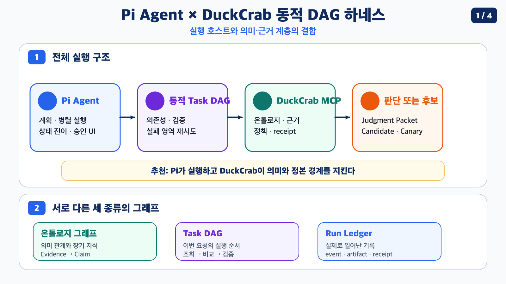
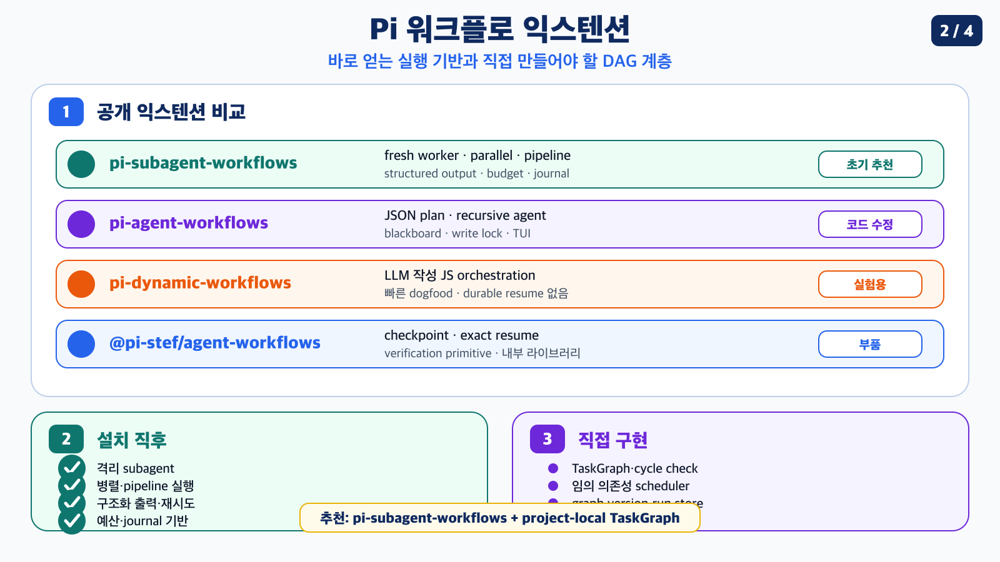
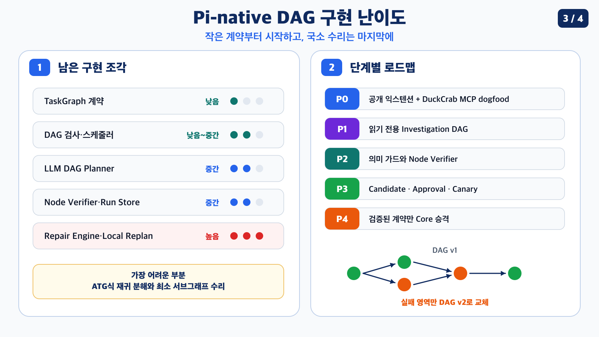
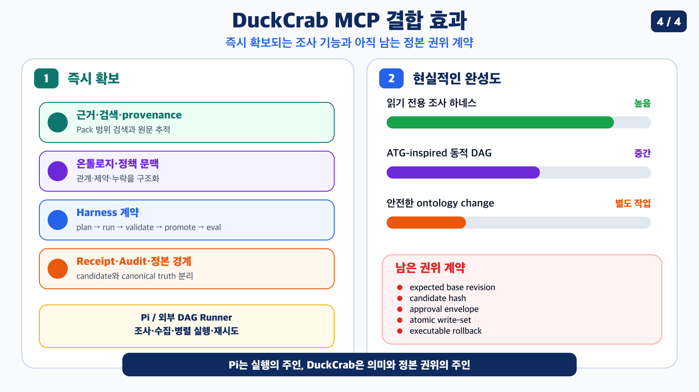

> [!summary] 핵심 결론
> Pi Agent는 완성된 DAG 엔진이 아니라, 프로젝트별 TypeScript 익스텐션과 격리된 하위 에이전트, 도구 제어, 사용자 인터페이스를 제공하는 **실행 하네스의 좋은 호스트**입니다. 공개 익스텐션으로 병렬 조사와 구조화 출력, 예산과 재사용 기반을 빠르게 확보한 뒤, TaskGraph·스케줄러·검증·국소 수리 계층을 얹고 DuckCrab MCP로 의미·근거·정책·정본 경계를 채우는 순서가 현실적입니다.

[[notes/ontology-senior-investigation-harness|13번 글]]은 온톨로지 에이전트의 결론을 `Expertise Pack`, 질문별 조사 계획과 상태, 검증 기록, 조건부 판단의 다섯 책임으로 정리했습니다. 구조는 보이지만 실행 주체는 아직 비어 있었습니다.

그 빈자리에 Pi Agent를 놓으면 어떨까요? Pi가 작업을 쪼개고 여러 에이전트를 실행하며, 각 에이전트가 DuckCrab MCP에서 근거와 관계를 읽도록 만드는 방식입니다. 얼핏 보면 필요한 부품이 이미 거의 갖춰진 것처럼 보입니다.

하지만 세 질문을 분리해야 합니다.

1. Pi가 기본으로 해주는 일은 무엇입니까?
2. 공개 익스텐션을 설치하면 어디까지 바로 구현됩니까?
3. DuckCrab MCP를 붙였을 때 무엇이 완성되고, 무엇은 여전히 직접 만들어야 합니까?

## Pi는 DAG 엔진보다 ‘바꾸기 쉬운 실행 호스트’에 가깝습니다

Pi 익스텐션은 프로젝트의 `.pi/extensions/`에 TypeScript 모듈을 두고 동작을 확장합니다. 커스텀 도구 등록, 도구 호출 차단과 수정, 문맥 주입, 활성 도구 변경, 사용자 확인 UI와 세션 상태 저장을 지원합니다.[src_001](#src-001) SDK에서는 별도의 `AgentSession`을 만들고 자동 파이프라인이나 하위 에이전트를 프로그램 방식으로 실행할 수 있습니다.[src_002](#src-002)

이 제어면은 전용 하네스를 실험하기에 좋습니다.

```text
Pi가 이미 제공하는 것
= 모델 루프
+ 파일·코드·셸 도구
+ MCP 연결
+ 프로젝트 로컬 익스텐션
+ 격리된 AgentSession
+ 사용자 승인 UI
+ 세션과 문맥 압축
```

반대로 Pi가 기본으로 제공하지 않는 것도 명확합니다.

```text
Pi가 자동으로 제공하지 않는 것
= 범용 TaskGraph 계약
+ cycle 검사와 위상 스케줄러
+ 고수준 작업의 재귀 분해
+ 노드별 완료 검증
+ 실패 영향 범위 계산
+ 최소 서브그래프 수리
```

따라서 “Pi로 구현한다”는 말은 Pi 내부 기능 하나를 켠다는 뜻이 아닙니다. **Pi가 모델과 도구, 세션과 UI를 맡고, 우리가 그 위에 실행 계약을 만드는 것**에 가깝습니다.

## 공개 익스텐션으로 멀티에이전트 실행 기반은 상당 부분 확보할 수 있습니다

현재 Pi 패키지 생태계에는 비슷하지만 역할이 다른 워크플로 익스텐션이 있습니다. 모두 서드파티 코드이므로 설치 전 소스와 권한을 확인해야 합니다.

| 선택지                     | 바로 얻는 기능                                                                        | 이 설계에서의 위치                                               |
| -------------------------- | ------------------------------------------------------------------------------------- | ---------------------------------------------------------------- |
| `pi-subagent-workflows`    | fresh-context worker, 병렬·파이프라인, JSON Schema 출력, 재시도, 예산, 디스크 journal | **초기 실행 기반으로 가장 적합**                                 |
| `pi-agent-workflows`       | JSON workflow, 재귀 subagent, 메시지·blackboard, 파일 write lock, 비용·TUI            | 여러 에이전트가 같은 저장소를 수정할 때 유리                     |
| `pi-dynamic-workflows`     | LLM이 JavaScript 실행 스크립트를 만들고 병렬·pipeline을 즉석 구성                     | 빠른 dogfood에는 좋지만 durable run은 아직 없음                  |
| `@pi-stef/agent-workflows` | atomic write, lock, checkpoint, exact resume, verification primitive                  | 사용자용 익스텐션이 아니라 다른 익스텐션이 가져다 쓰는 내부 부품 |

`pi-subagent-workflows`는 에이전트를 fresh Pi 세션으로 실행하고, `parallel()`과 `pipeline()`을 제공하며, JSON Schema로 출력을 검증하고 수정 재시도를 할 수 있습니다. 실행 수·동시성·시간·토큰·비용 예산과 journal 캐시도 제공합니다.[src_003](#src-003)

`pi-agent-workflows`는 agent class와 의존성, agent 간 메시지, 공유 blackboard와 전역 write lock을 제공하기 때문에 병렬 코드 수정처럼 충돌 위험이 있는 작업에 더 가깝습니다.[src_004](#src-004)

`pi-dynamic-workflows`는 모델이 `agent()`, `parallel()`, `pipeline()`을 조합한 JavaScript를 작성하는 방식입니다. 빠르게 다양한 작업 구조를 시험하기 좋지만, 공식 설명상 persisted·resumable run manager는 아직 구현되지 않았습니다.[src_005](#src-005)

`@pi-stef/agent-workflows`는 durable workflow 폴더, lock, checkpoint, exact resume와 검증 캐시를 제공하지만 사용자에게 직접 설치할 완제품이 아니라 소비자 익스텐션용 내부 라이브러리로 설명됩니다.[src_006](#src-006)



### 설치 직후 가능한 수준

가장 단순한 조사라면 `pi-subagent-workflows`만으로도 다음 흐름을 구성할 수 있습니다.

```text
메인 Pi 세션
  ├─ 근거 검색 에이전트
  ├─ 반대 근거 검색 에이전트
  ├─ 정책·권한 확인 에이전트
  └─ 과거 사례 검색 에이전트
        ↓
구조화 결과 합성
        ↓
별도 Reviewer 세션
```

여기에 DuckCrab MCP를 모든 하위 에이전트의 허용 도구로 넣으면 Pack 단위 검색, 원문 상세 조회, 관계 경로와 근거 확인까지 연결할 수 있습니다.

다만 이 단계는 엄밀한 DAG보다는 **병렬 작업과 합성 단계가 있는 스크립트형 워크플로**입니다. 임의의 `dependsOn` 관계, cycle 검사, 그래프 버전과 실패 영역 수리는 아직 없습니다.

## 우리가 직접 만들어야 할 핵심은 TaskGraph·검증·수리입니다

Atomic Task Graph 연구는 텍스트 계획에 숨어 있던 입력·출력 의존성을 명시적 DAG로 드러내고, 독립 분기를 병렬 실행하며, 실패가 생기면 그래프 진화 이력에서 영향을 받은 부분만 수리하는 구조를 제안합니다.[src_007](#src-007)

이 연구의 아이디어를 Pi에 옮기려면 최소 다섯 조각이 필요합니다.

### 1. TaskGraph 계약 — 난이도 낮음

```ts
interface TaskNode {
  id: string
  objective: string
  dependsOn: string[]
  tools: string[]
  inputRefs: string[]
  outputSchema: object
  verifier: string[]
}
```

노드 ID, 목표, 의존성, 허용 도구, 입력 참조, 출력 스키마와 완료 검사를 정합니다. TypeScript 타입과 JSON Schema로 시작할 수 있습니다.

### 2. DAG 검사와 스케줄러 — 난이도 낮음~중간

- 존재하지 않는 의존성 검사
- cycle 차단
- 현재 실행 가능한 `ready` 노드 계산
- 독립 노드 병렬 실행
- 실패 노드의 후속 영역 계산

일반 그래프 알고리즘이므로 테스트가 명확합니다. 어려운 부분은 실행 자체보다 LLM이 만든 그래프를 신뢰하지 않고 먼저 검사하는 계약입니다.

### 3. LLM DAG Planner — 난이도 중간

모델은 사용자 요청, 사용 가능한 도구, 비용과 위험도를 보고 Direct·Mini DAG·Investigation DAG·Change DAG 중 하나를 제안합니다. JSON을 만드는 일보다 **어디까지 쪼개야 하나의 노드가 검증 가능한 작업이 되는지** 정하는 일이 어렵습니다.

### 4. Node Verifier와 Run Store — 난이도 중간

“에이전트가 답을 냈다”와 “노드가 완료됐다”를 구분해야 합니다. 근거 검색 노드라면 source ID, 원문 위치, Pack revision과 검색 receipt가 있어야 통과하도록 만들 수 있습니다.

Pi의 compaction은 오래된 대화를 줄이는 손실 요약입니다. 실행 정본은 대화 요약에 두지 말고 그래프 버전, 노드 이벤트, artifact와 receipt를 별도 저장해야 합니다. Pi 공식 문서도 compaction과 branch summarization을 세션 문맥 관리 기능으로 설명합니다.[src_008](#src-008)

### 5. Repair Engine — 난이도 높음

첫 구현은 단순하게 시작할 수 있습니다.

```text
실패 노드
+ 그 노드에 의존하는 후속 노드
→ 무효화 후 다시 실행
```

어려운 단계는 ATG식 재귀 분해 이력과 노드 인터페이스를 보존하면서 **실패한 최소 서브그래프만 다시 계획하는 것**입니다. 성공한 artifact를 재사용해도 되는지, 새 출력이 기존 후속 노드와 호환되는지를 검사해야 합니다.



## DuckCrab MCP는 DAG 실행기가 아니라 의미·근거·정본 경계를 채웁니다

일반 Pi DAG만으로도 작업은 돌아갑니다. DuckCrab이 없으면 파일 검색, 웹 도구, JSON 규칙과 프롬프트가 근거와 정책 역할을 대신할 수 있습니다.

DuckCrab MCP를 붙였을 때 달라지는 것은 실행 순서가 아니라 **각 노드가 무엇을 알고, 무엇을 증명하고, 어디까지 행동할 수 있는지**입니다.

### 근거와 문맥

> [!note] DuckCrab 구현 범위
> 아래의 DuckCrab 기능 설명은 2026-07-25 현재 로컬 저장소의 정본 문서와 코드를 대조한 결과입니다. 공개 패키지의 일반 기능이나 독립 재현 결과로 확대해 해석하지 않습니다.[src_009](#src-009)

현재 로컬 DuckCrab 구현은 Pack·스키마를 확인하고, 검색 계획을 받아 vector·lexical·bounded graph 경로를 조합하며, 사실·근거·출처 경로·누락·정책·불확실성을 에이전트 문맥으로 제공합니다. 이는 [[notes/ontology-context-compiler-opencrab|9번 문맥 컴파일러 글]]에서 제안한 기반과 연결됩니다.

예를 들어 `search_counterevidence` 노드가 다음 산출물을 요구할 수 있습니다.

```yaml
outputs:
  counterevidence_refs: []
  competing_hypotheses: []
  unresolved_questions: []
verifier:
  - source_ref_exists
  - evidence_scope_valid
  - competing_explanation_present
```

DuckCrab은 검색 결과와 source·evidence 참조, Pack 범위와 receipt를 제공하고, Pi는 이 자료가 완료 조건을 충족했는지 검사한 뒤 다음 DAG 노드를 엽니다.

### 하네스와 승격 경계

DuckCrab의 로컬 Search/Collection Harness는 mission, artifact bundle, validation report, promotion package와 eval report를 구분합니다. 실제 외부 검색과 수집은 에이전트가 맡고, 수집물을 로컬 artifact로 만든 뒤 DuckCrab의 `plan → run → validate → promote → eval` 계약에 넘기는 방향입니다.

이 구조는 Pi와 잘 맞습니다.

```text
Pi / 외부 DAG Runner
= 조사·수집·병렬 실행·재시도

DuckCrab
= Pack·근거·검증·candidate·receipt·정본 경계
```



## 어디까지 완성된다고 볼 수 있습니까?

정확한 성능 수치가 아니라 기능 범위로 보면 다음처럼 정리할 수 있습니다.

| 구성                              | 가능한 수준                                             | 남는 핵심 문제                        |
| --------------------------------- | ------------------------------------------------------- | ------------------------------------- |
| Pi만 사용                         | 단일 에이전트와 프로젝트 익스텐션                       | 병렬 workflow와 DAG 계약              |
| Pi + `pi-subagent-workflows`      | 병렬 조사, 구조화 출력, 별도 Reviewer, 예산·journal     | 명시적 임의 DAG와 국소 수리           |
| 위 구성 + project-local TaskGraph | 읽기 전용 Investigation DAG, node verifier, resume 기반 | ATG식 재귀 분해와 최소 수리           |
| 위 구성 + DuckCrab MCP            | 근거·반례·정책·provenance가 붙은 조사 하네스            | 안전한 정본 변경과 원자적 rollback    |
| DuckCrab Core 계약 보강           | revision·hash·승인 envelope 기반 승격                   | 실제 운영 데이터에서 효과와 비용 검증 |

### 읽기 전용 조사 하네스는 비교적 빠르게 만들 수 있습니다

다음 범위는 현재 부품을 조합해 현실적으로 구현할 수 있습니다.

```text
CONTRACT
→ OBSERVE
→ FRAME
→ CHALLENGE
→ JUDGE
→ DONE / ABSTAIN / ESCALATE
```

Pi는 DAG를 만들고 하위 에이전트를 실행합니다. DuckCrab은 근거와 관계, 정책, 누락과 receipt를 제공합니다. 별도 Reviewer는 최종 Judgment Packet의 근거 범위와 미해결 반례를 확인합니다.

### 안전한 온톨로지 변경은 별도 단계입니다

후보를 만들고 검증해 사람 승인을 요청하는 데까지는 연결할 수 있습니다. 그러나 현재 로컬 승격 경로는 전체 write set의 원자성, expected base revision, candidate hash, reviewer disposition과 실행 가능한 rollback을 완성된 권위 계약으로 보장하지 않습니다.

Pi가 승격을 중단하고 before/after eval을 보존하며 rollback을 **권고**할 수는 있습니다. 실제 원자적 승격과 복구 보장은 DuckCrab Core가 소유해야 합니다.

## 가장 현실적인 구현 순서

### P0. 공개 익스텐션으로 dogfood

`pi-subagent-workflows`에 DuckCrab MCP를 연결합니다. 같은 질문을 근거·반례·정책·사례 worker로 병렬 조사하고, 구조화 출력과 Reviewer를 시험합니다.

### P1. 읽기 전용 TaskGraph

TaskGraph JSON, cycle 검사, ready-node scheduler, node artifact와 run store를 추가합니다. 실패하면 우선 해당 노드와 후속 노드를 다시 실행합니다.

### P2. 의미 가드 추가

복잡한 조사 노드에만 `requiredEvidence`, `requiredRelations`, `requiredPolicies`, `requiredPermissions`를 붙입니다. 온톨로지가 모든 DAG를 지배하는 것이 아니라 필요한 노드에서 검증 의무를 제공합니다.

### P3. Candidate와 Canary

`PROPOSE → VALIDATE → ATTACK → REPAIR`까지 구현한 뒤 사람 승인과 before/after canary를 연결합니다. 자동 승격은 마지막에 둡니다.

### P4. 효과가 확인된 계약만 Core로 이동

다른 host에서도 반복되는 phase state, completion validator, approval envelope와 trajectory receipt만 DuckCrab의 공통 계약 후보로 올립니다.

> [!important] 구현 원칙
> 처음부터 Pi와 DuckCrab 안에 각각 별도의 에이전트 루프를 만들지 않습니다. **Pi는 실행의 주인, DuckCrab은 의미와 정본 권위의 주인**으로 둡니다. 그래야 실패 원인과 실험 효과를 분리할 수 있습니다.

## 결론: 완성품을 찾기보다 경계를 잘 조합하는 문제입니다

Pi를 선택하면 모델 루프, 도구, 세션, 하위 에이전트와 UI를 새로 만들 필요가 없습니다. 공개 익스텐션을 사용하면 병렬 실행과 구조화 출력, 예산과 journal도 상당 부분 해결됩니다.

우리가 직접 만들어야 할 핵심은 네 가지입니다.

```text
TaskGraph 계약
+ DAG Planner와 Scheduler
+ Node Verifier와 Run Store
+ 실패 영역 Repair Engine
```

DuckCrab MCP를 붙이면 여기에 Pack, 근거, 관계, 정책, validation, receipt와 정본 경계가 들어옵니다. 그 결과 [[notes/ontology-senior-investigation-harness|13번 글]]의 읽기 전용 조사 구조는 꽤 높은 수준까지 구현할 수 있습니다.

다만 ATG 논문의 재귀 분해와 최소 서브그래프 수리, 원자적 ontology promotion과 실제 rollback은 남은 연구·구현 과제입니다. **첫 목표는 완전 자율 에이전트가 아니라, 근거를 잃지 않고 실패한 부분만 다시 조사할 수 있는 작은 DAG 하네스**가 되어야 합니다.

## 출처

- <a id="src-001"></a> Pi. [Extensions documentation](https://pi.dev/docs/latest/extensions). 프로젝트 로컬 TypeScript 익스텐션, 커스텀 도구, 이벤트 가로채기, 동적 도구 선택과 UI 기능.
- <a id="src-002"></a> Pi. [SDK documentation](https://github.com/badlogic/pi-mono/blob/main/packages/coding-agent/docs/sdk.md). `AgentSession`, 자동 pipeline과 프로그램 방식의 agent 통합.
- <a id="src-003"></a> Pi Packages. [pi-subagent-workflows](https://pi.dev/packages/pi-subagent-workflows). fresh worker, 병렬·pipeline, 구조화 출력, 예산과 journal.
- <a id="src-004"></a> Pi Packages. [pi-agent-workflows](https://pi.dev/packages/pi-agent-workflows). JSON workflow, 재귀 agent, 메시지·blackboard, write lock과 TUI.
- <a id="src-005"></a> Pi Packages. [pi-dynamic-workflows](https://pi.dev/packages/pi-dynamic-workflows). JavaScript 기반 동적 orchestration과 현재 prototype 경계.
- <a id="src-006"></a> Pi Packages. [@pi-stef/agent-workflows](https://pi.dev/packages/%40pi-stef/agent-workflows). checkpoint·resume·verification을 제공하는 내부 workflow-engine primitive.
- <a id="src-007"></a> Zhang, Y. et al. (2026). [Atomic Task Graph: A Unified Framework for Agentic Planning and Execution](https://arxiv.org/abs/2607.01942). arXiv preprint.
- <a id="src-008"></a> Pi. [Compaction & Branch Summarization](https://pi.dev/docs/latest/compaction). 세션 문맥 압축과 branch summary의 역할·상태 구조.
- <a id="src-009"></a> DuckCrab local repository audit. `docs/ARCHITECTURE.md`, `docs/CURRENT_STATE.md`, `docs/SEARCH_COLLECTION_HARNESS_PLAN.md`와 관련 MCP·검색 하네스 코드를 2026-07-25에 대조한 내부 구현 감사. 공개 재현 출처가 아니라 현재 로컬 경계를 기록한 근거입니다.
