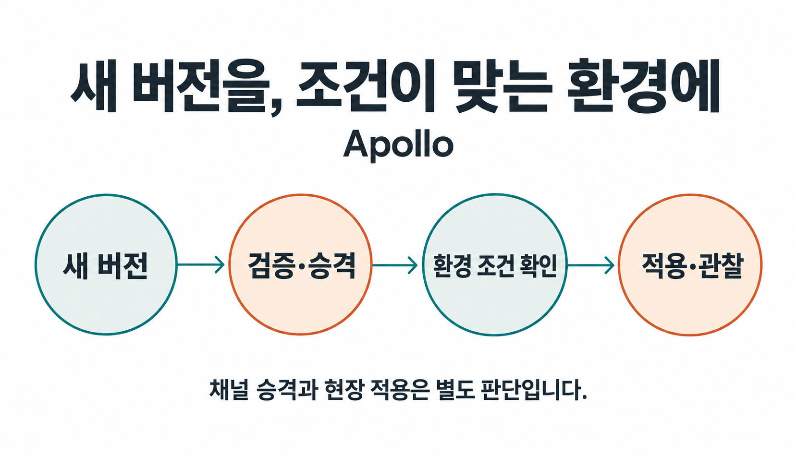

개발팀이 버그를 고쳤고 테스트도 통과했습니다. 그런데 운영팀은 왜 모든 현장에 바로 배포하지 않을까요?

여러 공장에서 같은 검사 서비스를 쓴다고 가정해 보겠습니다. 검사 결과가 누락됐는데도 정상으로 처리하는 오류를 발견해 수정했습니다. 시험 환경에서는 잘 동작합니다. 하지만 생산 중인 공장과 점검 중인 공장, 함께 쓰는 다른 서비스의 버전이 다른 공장에 모두 같은 순간 적용해도 될지는 아직 확인하지 않았습니다.

**팔란티어 Apollo는 여러 환경의 소프트웨어 버전과 설정을 관리하고, 조건이 맞는 대상에 변경을 적용하도록 조율하는 배포·운영 플랫폼입니다.** 어떤 버전이 준비됐는지, 어디에 적용할 수 있는지, 실제로 어떻게 끝났는지를 연결해 다룹니다. 빌드 이후에도 남는 운영 판단을 이해하는 데 좋은 출발점입니다. [Apollo 공식 개요](https://www.palantir.com/docs/apollo/core/overview)

> [!summary] 만들어진 변경을 실제로 받아들이기까지
> Apollo에서는 새 버전의 존재, 검증을 거친 채널 승격, 실제 환경에 적용된 상태를 구분합니다. 이 구조를 이해하면 에이전틱 개발의 브랜치·PR·커밋 기록에서도 비슷한 질문이 보입니다. 무엇을 왜 바꾸며, 어떤 근거로 받아들이고, 그 판단을 어떻게 다음 작업에 남길 것인가입니다.

## 1. Apollo가 맡는 일은 빌드 다음부터 분명해집니다

CI는 변경된 코드를 빌드하고 자동 테스트를 실행해 배포할 결과물을 준비합니다. Apollo는 CI에서 릴리스를 등록받아 관리할 수 있습니다. 이미지를 만들었다는 사실과 현장의 설치본이 바뀌었다는 사실은 서로 다릅니다. [CI에서 Apollo로 릴리스 등록](https://www.palantir.com/docs/apollo/core/ci-publish-setup)

검사 서비스의 수정본도 마찬가지입니다. 개발자는 오류가 고쳐졌다는 테스트 결과를 제출할 수 있습니다. 운영자는 해당 공장에서 함께 돌아가는 서비스와 호환되는지, 지금 변경 가능한 시간인지, 먼저 시험한 대상에서 문제가 없었는지를 추가로 봅니다. 수정본의 품질과 적용 대상의 사정을 함께 알아야 합니다.

Apollo는 배포할 소프트웨어와 설치된 대상을 구분하는 이름을 둡니다. Product는 배포할 소프트웨어, Release는 그 특정 버전입니다. 개별 관리 대상은 Entity, 같은 기반 시설에서 실행되는 대상의 묶음은 Environment입니다. [Product와 Release](https://www.palantir.com/docs/apollo/core/products-releases-versions), [Environment](https://www.palantir.com/docs/apollo/core/environments)

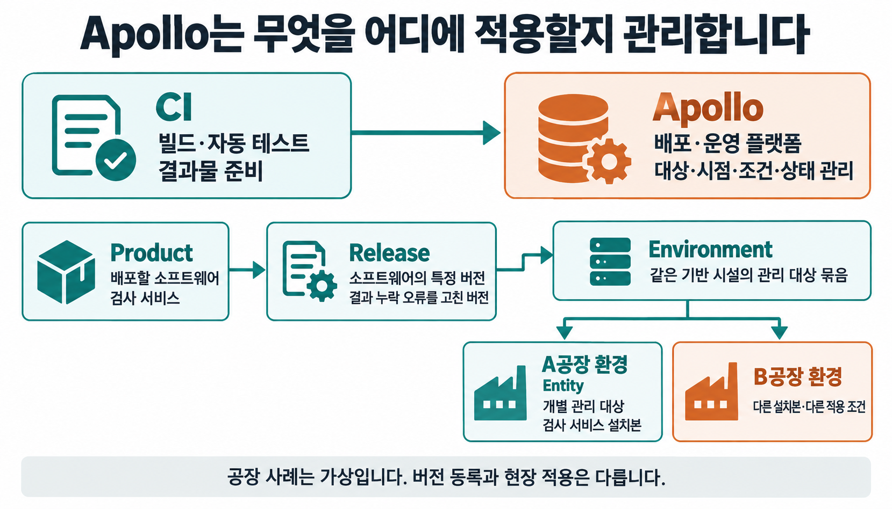

가상 사례에서 Product는 검사 서비스, Release는 결과 누락 오류를 고친 버전입니다. A공장에 설치된 관리 대상이 Entity이고, 그 대상이 속한 실행 환경이 Environment입니다. 이렇게 나누면 어느 버전의 문제인지와 어느 설치본의 문제인지를 구별할 수 있습니다.

## 2. Foundry의 업무를 계속 운영하려면

Foundry는 여러 곳의 데이터를 연결하고 가공해 분석과 업무 애플리케이션에 사용하는 플랫폼입니다. 그 안의 Ontology는 데이터와 실제 업무 대상을 연결합니다. 공장·제품·주문 같은 객체, 그 속성과 관계, 허용된 동작을 함께 표현합니다. [Foundry 개요](https://www.palantir.com/docs/foundry/platform-overview/overview), [Ontology 개요](https://www.palantir.com/docs/foundry/ontology/overview)

검사 결과를 제품과 주문에 연결하면 담당자는 어느 주문의 출하를 보류해야 하는지 살필 수 있습니다. 그 결과에 따라 허용된 Action으로 업무 상태를 바꾸는 애플리케이션도 구성할 수 있습니다. 화면에서 확인한 데이터를 실제 업무의 판단과 행동에 사용합니다. 이 출하 업무는 기능을 설명하기 위한 가상 설계입니다. [Action의 역할](https://www.palantir.com/docs/foundry/action-types/overview)

업무를 계속 운영하다 보면 그 판단을 수행하는 프로그램도 바뀝니다. 검사 결과 누락을 처리하는 방식을 고치거나, 새로운 설비와 연결하거나, 서비스의 버전을 올려야 합니다. 오늘 제품의 출하 상태를 변경하는 일과 내일부터 사용할 검사 소프트웨어를 변경하는 일이 같은 현장에서 함께 일어납니다.

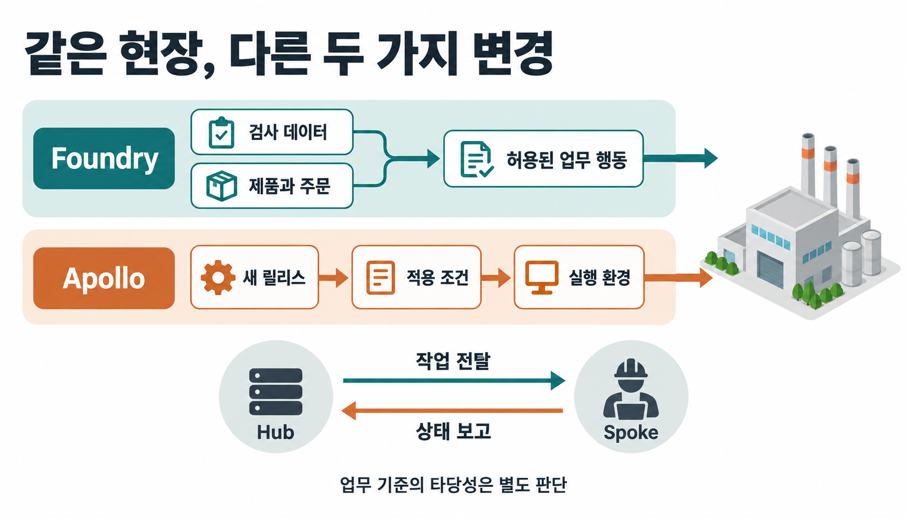

Foundry와 Apollo를 이어 읽을 때 제가 주목한 것은 이 연결입니다. 업무를 데이터와 동작으로 표현했다면, 그 동작을 수행하는 소프트웨어의 변경도 대상·조건·결과를 갖춰 관리해야 합니다. 이는 두 제품의 역할을 바탕으로 한 해석입니다. Foundry의 모든 Action이 Apollo의 승격 절차를 거친다는 실행 구조는 아닙니다.

따라서 Apollo를 이해할 때도 서버에 파일을 전달하는 장면만 보면 부족합니다. 어떤 소프트웨어가 어떤 환경에서 실행되고, 무엇을 확인한 뒤 바뀌며, 실제 상태는 어떠한지를 함께 봐야 합니다.

## 3. Hub는 판단하고 Spoke는 실행과 상태를 보고합니다

Apollo의 Hub는 변경을 조율하는 환경입니다. 관리 대상 환경인 Spoke에서는 실행 에이전트가 현장 상태를 보고하고 작업을 수행합니다. Hub 안의 조율 엔진은 사용 가능한 릴리스, 환경 설정, 보고된 상태와 제약조건을 고려해 작업을 제안합니다. [Hub와 Spoke의 구조](https://www.palantir.com/docs/apollo/core/overview)

Release Channel은 릴리스를 묶는 경로입니다. 관리 대상이 어떤 채널을 구독하는지에 따라 사용할 수 있는 릴리스가 달라집니다. 이를 품질 등급 하나로만 읽으면 안 됩니다. 기본 채널의 분류 규칙과 별도로 구성하는 승격 경로가 있으며, 다음 절에서 구분합니다. [Release Channels](https://www.palantir.com/docs/apollo/core/release-channels)

Plan은 실제로 수행할 작업이고 Constraints는 그 작업의 선행조건입니다. 새 버전을 적용하는 작업을 제안했더라도 의존성이나 변경 가능 시간 같은 조건을 충족하지 못하면 바로 실행할 수 없습니다. Spoke의 에이전트가 Plan을 조회하면 관련 조건을 통과한 작업이 전달됩니다. [Plan과 제약조건](https://www.palantir.com/docs/apollo/core/plans-and-constraints)

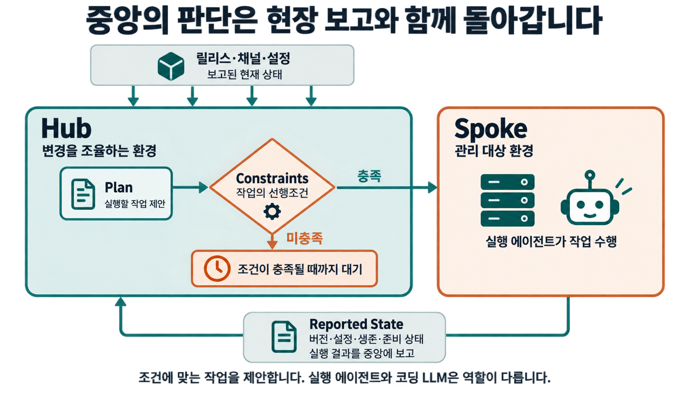

현장에서는 실행 중인 버전과 설정, 생존·준비 상태 등이 Reported State로 돌아옵니다. Hub는 명령을 보냈다는 기록뿐 아니라 현장이 보고한 상태를 다음 판단에 사용합니다. 현재 공식 문서는 Apollo를 하나의 고정 목표 버전으로 무조건 수렴시키는 방식이 아니라, 설정된 제약을 만족하는 Plan을 제안하는 방식으로 설명합니다. [상태 보고와 작업 실행](https://www.palantir.com/docs/apollo/core/how-apollo-works)

여기서 실행 에이전트는 코드를 작성하는 LLM 에이전트와 역할이 다릅니다. 공장 사례에서는 새 버전의 적용 작업을 수행하고 그 결과를 보고하는 쪽입니다. 운영자는 실행이 끝난 것과 조건을 기다리는 것을 구분할 수 있어야 합니다.

## 4. 수정 버전 하나가 현장에 도착하기까지

검사 서비스의 오류 수정본이 준비됐다고 해보겠습니다. 먼저 CI에서 만든 결과물과 버전 정보를 Apollo에 Release로 등록합니다. 이후 어떤 릴리스를 시험하고 어느 채널로 넘길지, 각 설치본에 언제 적용할지를 설정합니다.

이때 이름 때문에 생기기 쉬운 오해가 있습니다. Apollo의 기본 채널 `DEV`, `RELEASE_CANDIDATE`, `RELEASE`는 반드시 하나씩 통과해야 하는 승인 단계가 아닙니다. 버전 형식에 따라 자동 분류되는 채널입니다. 정식 Release 형식은 세 기본 채널에, 후보 형식은 `DEV`와 `RELEASE_CANDIDATE`에, 그 밖의 형식은 `DEV`에 들어갑니다. [기본 채널의 분류](https://www.palantir.com/docs/apollo/core/release-channels)

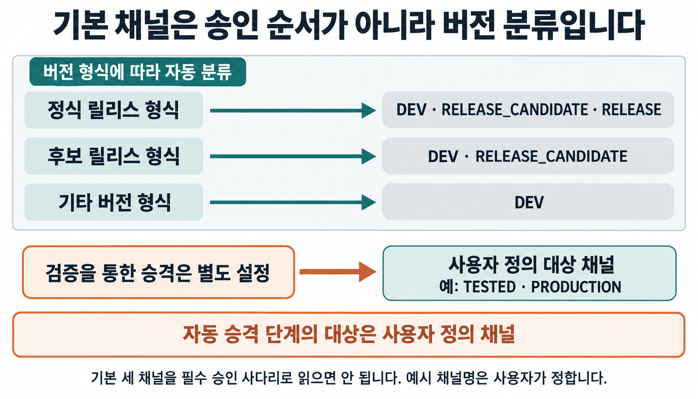

검증을 거쳐 다음 채널에 릴리스를 추가하는 경로는 승격 파이프라인으로 구성합니다. 공식 문서상 자동 승격 단계의 대상은 사용자 정의 채널입니다. 예를 들어 `DEV → TESTED → PRODUCTION`이라는 경로를 만들 수 있습니다. 여기서 뒤의 두 이름은 설명용 사용자 정의 채널이며, 제품이 강제하는 이름이 아닙니다. [승격 파이프라인 설정](https://www.palantir.com/docs/apollo/managing-release-channels/configure-promotion-pipeline)

승격을 평가하는 방식도 선택합니다. Timed 방식은 정한 시간과 라벨 조건 등을 평가합니다. Canary 방식은 선택한 시험 대상을 관찰해 조건을 확인합니다. 사람이 검증한 뒤 권한에 따라 수동 승격하는 경로도 있습니다. 이 세 가지를 반드시 차례로 수행하는 것은 아닙니다. [승격 조건](https://www.palantir.com/docs/apollo/managing-release-channels/configure-promotion-pipeline), [수동 승격](https://www.palantir.com/docs/apollo/managing-release-channels/manual-promotion)

가상 사례에서는 시험 환경에서 수정본을 실행하고 결과 누락이 의도대로 처리되는지 확인할 수 있습니다. 정한 조건을 통과한 릴리스를 다음 채널로 넘기고, 더 넓은 대상에서 사용할 후보로 삼습니다. 이것이 새 버전을 등록하는 일과 승격을 구분하는 이유입니다.

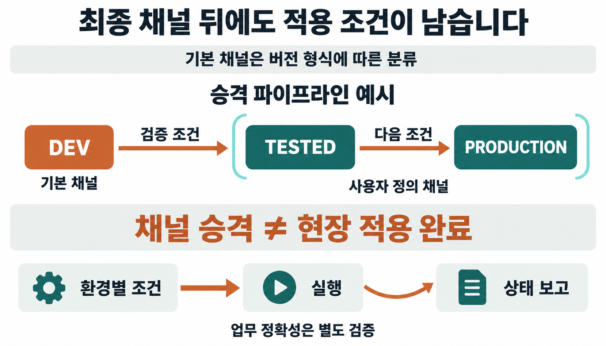

**최종 채널에 들어갔다고 모든 환경의 적용이 끝나는 것은 아닙니다.** 그 채널을 구독하는 설치본에도 각자의 실행 제약이 있습니다. 생산 중인 A공장은 점검 시간까지 기다리고, 조건을 만족한 B공장은 먼저 적용할 수 있습니다. 두 공장의 버전이 잠시 다르다는 사실만으로 배포 실패라고 단정할 수 없습니다.

이제 운영자가 확인할 질문은 구체적입니다. 릴리스가 다음 채널로 넘어가지 못했는지, 채널에는 들어갔지만 환경 조건을 기다리는지, 실행을 시작했지만 실패했는지를 나눠 봅니다. 같은 ‘아직 새 버전이 아니다’라는 화면 뒤에도 서로 다른 상황이 있습니다.

## 5. 적용 뒤에는 무엇을 관찰하고 어디까지 되돌릴 것인가

시험 대상이 살아 있다는 신호와 업무가 올바르게 처리된다는 증거는 다릅니다. 서비스가 응답하더라도 누락된 검사 결과를 잘못 분류할 수 있습니다. 어떤 신호를 관찰하도록 구성했는지가 검증의 범위를 결정합니다.

공식 문서에는 중요한 경계가 있습니다. Health는 대상이 제공하는 건강 상태 평가 신호입니다. 이를 제공하지 않는 Entity의 해당 승격 평가는 생존 상태와 시간에 의존합니다. 그 Health 평가로는 실패를 판정할 수 없습니다. 그러므로 통과한 상태만 보고 업무의 정확성까지 확인됐다고 읽어서는 안 됩니다. [Health 부재의 평가 한계](https://www.palantir.com/docs/apollo/managing-release-channels/configure-promotion-pipeline)

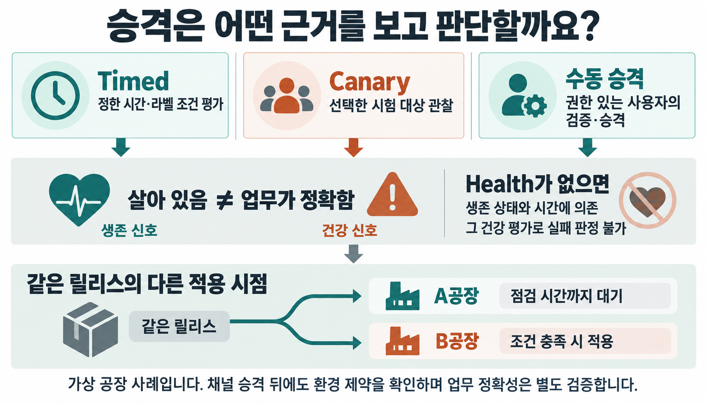

문제를 발견한 뒤에도 대응을 구분합니다. Recall은 정한 전략에 따라 문제가 있는 소프트웨어 릴리스에서 대상을 벗어나게 하는 기능입니다. 언제나 직전 버전으로 복원한다는 뜻은 아닙니다. Plan 실행이 실패했고 환경에 실행 전과 다른 상태가 남았다면, Apollo는 이전 상태로 복원하기 위한 rollback Plan을 발행합니다. [Recall](https://www.palantir.com/docs/apollo/recalling-releases/overview), [실행 실패와 복구](https://www.palantir.com/docs/apollo/core/how-apollo-works)

가령 검사 서비스의 수정본이 다른 오류를 일으켜 문제 버전에서 벗어났다고 해보겠습니다. 이미 잘못 처리한 출하 판단은 여전히 남을 수 있습니다. 프로그램의 복구와 해당 판단의 재검토는 담당자와 절차를 따로 정해야 합니다. 소프트웨어를 정상 상태로 돌렸다는 기록이 업무상의 후속 조치 완료를 대신할 수는 없습니다.

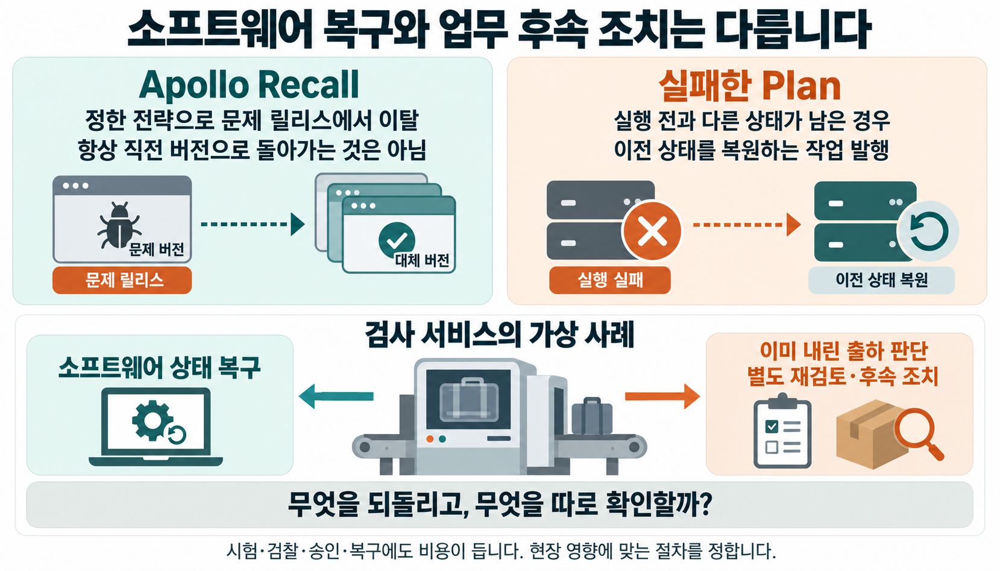

이렇게 보면 Apollo의 운영 구조는 버전 전달에서 끝나지 않습니다. **어떤 변경을 어느 대상에 적용할 수 있는지 판단하고, 실제 결과를 돌려받으며, 문제가 생기면 대응할 경계를 남깁니다.** 이를 유지하려면 시험 환경, 관찰 신호, 적용 제약과 복구 절차를 운영하는 비용도 필요합니다. 환경이 적고 쉽게 되돌릴 수 있는 작업에 같은 규모의 체계를 그대로 도입할 필요는 없습니다.

## 6. Apollo를 이해하니 가재코드의 dev가 다르게 보였습니다

Apollo를 읽다가 최근 에이전틱 개발 저장소에서 본 장면이 떠올랐습니다. 가재코드에는 `main`과 별도로 `dev` 브랜치가 있었습니다. 여러 작업을 곧바로 릴리스 쪽에 반영하지 않고 중간에서 모으는 구조가 눈에 들어왔습니다.

[가재코드(gajae-code)](https://github.com/Yeachan-Heo/gajae-code)는 저장소에서 코딩 에이전트를 운용하는 개발 도구입니다. 공개 기여 지침은 일반 PR을 `dev`로 보내고, `main`은 관리자가 지시하는 릴리스 흐름에 남기도록 정합니다. [브랜치 정책](https://github.com/Yeachan-Heo/gajae-code/blob/9da99cdd708ce3b97d64111d8eefc98a7e0921ee/CONTRIBUTING.md)

브랜치를 나누는 방식 자체는 익숙합니다. 더 흥미로웠던 것은 그곳에 들어오는 PR이 변경을 설명하는 방식이었습니다. 실제 [PR #5566](https://github.com/Yeachan-Heo/gajae-code/pull/5566)은 `dev` 대상이며, PDF 안의 압축 데이터를 텍스트로 읽어 검사기가 잘못된 단어를 탐지한 문제를 다룹니다.

PR 설명은 수정 목록부터 시작하지 않습니다. 무엇이 실패했는지 밝히고, PDF가 들어온 때에는 관련 검사가 실행되지 않아 문제가 나중에 드러났다고 설명합니다. 이어 바이너리 파일을 검사에서 제외하는 수정과 검증 결과를 적습니다. 실제 텍스트의 탐지는 유지되는지도 확인했다고 기록합니다.

| PR에 담긴 내용            | 검토자가 판단할 수 있는 것                  |
| ------------------------- | ------------------------------------------- |
| 문제와 발생 원인          | 무엇을 고치려는 변경인가                    |
| 이번에야 드러난 이유      | 왜 이 시점에 실패했으며 어디서 시작됐는가   |
| 수정 방법                 | 원인을 어떻게 다뤘는가                      |
| 수행한 검사               | 무엇을 확인했고 어떤 동작을 유지했는가      |
| 수정을 되돌리는 대조 확인 | 수정이 사라지면 같은 실패가 다시 나타나는가 |

마지막의 대조 확인은 특히 눈에 띕니다. PR 작성자는 수정한 검사 파일만 되돌리면 같은 바이너리 사례가 다시 실패한다고 기록했습니다. 단순히 테스트가 초록색이라는 말보다, 이번 수정이 관찰된 실패를 다뤘다는 근거를 더 구체적으로 제시합니다. 이는 PR에 기록된 결과를 읽은 것이며, 제가 그 테스트를 별도로 재실행한 것은 아닙니다.

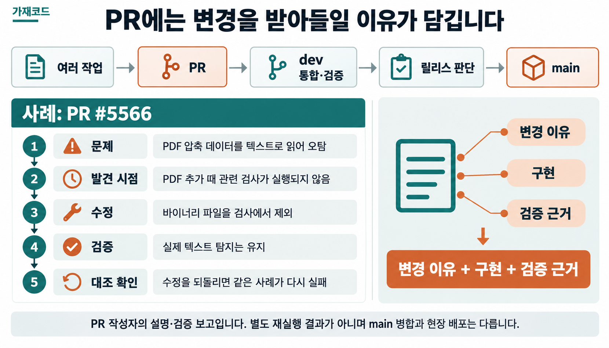

이 지점에서 Apollo와의 연결이 분명해졌습니다. 이 PR은 변경을 받아들일 판단 근거를 함께 제시합니다. Git 브랜치는 코드 revision을 가리키고 Apollo 환경은 실제 실행 상태를 다루므로 둘이 같은 대상은 아닙니다. 닮은 것은 브랜치 이름보다, 따로 시험한 변경을 통합하고 그다음에 사용할 조건을 정하는 방식입니다.

여러 에이전트가 각자 코드를 수정한다면 이런 기록이 더 중요해질 수 있습니다. 각 작업이 통과한 검사와 함께 합친 뒤 필요한 검사가 다를 수 있기 때문입니다. 코드 생산이 빨라질수록 모든 팀의 병목이 반드시 바뀐다는 단정까지는 필요하지 않습니다. 변경을 많이 받아보는 개발자에게는 어느 변경을 어떤 근거로 통합할지가 이미 구체적인 질문입니다.

## 7. re0-git은 같은 코드에 남길 설명을 다시 봅니다

Paperthin의 [`re0-git`](https://github.com/LilMGenius/paperthin/blob/6f706e30b5ec55e87598bf3b59164c9d9d96222f/skills/depth/re0-git/SKILL.md)을 읽을 때도 비슷한 느낌을 받았습니다. 이 스킬의 목표는 새 세션이 diff를 열지 않고 `git log`만 읽어도 작업을 이어갈 수 있도록, 이미 만든 커밋의 메시지를 정리하는 것입니다.

규칙은 무조건 자세히 쓰라고 요구하지 않습니다. 주변 커밋과 작성자의 문체를 살피고, 다음 작업에 필요한 오래 남길 사실을 추립니다. diff나 버전 자체가 이미 알려주는 내용과 사소한 작업 목록은 줄입니다. 메시지를 정리한 뒤에도 코드 트리는 같아야 하고, 로그만 다시 읽었을 때 필요한 설명이 빠졌으면 복원합니다.

앞의 바이너리 검사 문제를 커밋 메시지로 설명한다고 가정해 보겠습니다. 다음은 실제 PR의 커밋 메시지를 인용한 것이 아닌 **집필용 예시**입니다.

```text
바이너리 파일을 단어 검사에서 제외

- PDF 압축 데이터를 텍스트로 읽어 생긴 오탐을 제거하고 실제 텍스트 탐지는 유지한다.
```

이 메시지는 고쳤다는 사실에 더해 왜 제외했는지와 무엇을 계속 검사해야 하는지를 남깁니다. 다음 에이전트가 검사 범위를 넓히려 할 때, 그 변경이 지켜야 할 경계를 다시 찾을 단서가 됩니다. 로그만으로 코드를 검증할 수 있다는 뜻은 아닙니다. 어떤 의도로 고쳤고 무엇을 확인해야 하는지 이해한 상태에서 코드로 돌아갈 수 있다는 의미입니다.

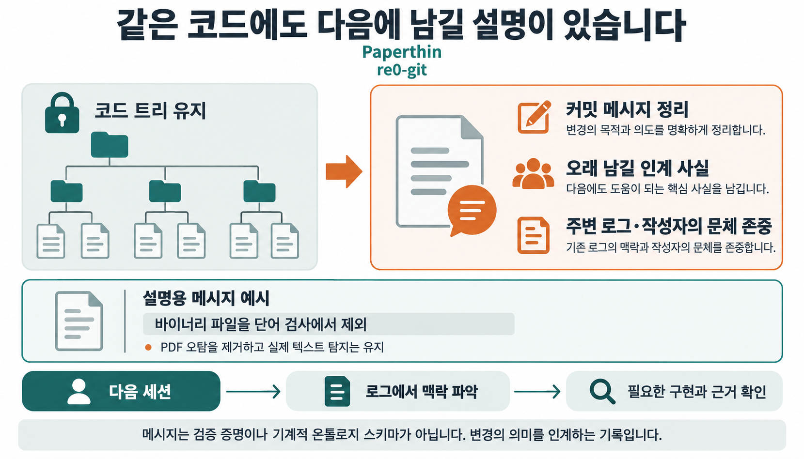

Paperthin의 `re0-loop`는 실제 사용 경로를 확인하고 교훈·실패 패턴·다음 검증 기준을 남기는 반복을 다룹니다. `re0-git`은 그중 커밋 기록이라는 좁은 자리에 시선을 두게 합니다. 어떤 코드를 다음 반복에 남길지뿐 아니라, 그 코드의 의미를 어떻게 인계할지도 작업의 일부로 봅니다. [반복 개발 스킬](https://github.com/LilMGenius/paperthin/blob/6f706e30b5ec55e87598bf3b59164c9d9d96222f/skills/coil/re0-loop/SKILL.md)

Apollo가 릴리스와 환경의 관계를 다룬다면, 잘 쓴 PR과 커밋 메시지는 변경과 그 이유·근거의 관계를 사람이 읽을 수 있게 남깁니다. 이 두 방식을 같은 시스템이라고 부를 수는 없지만, 변경을 코드 조각 하나로만 취급하지 않는다는 관점에서 함께 읽을 수 있습니다.

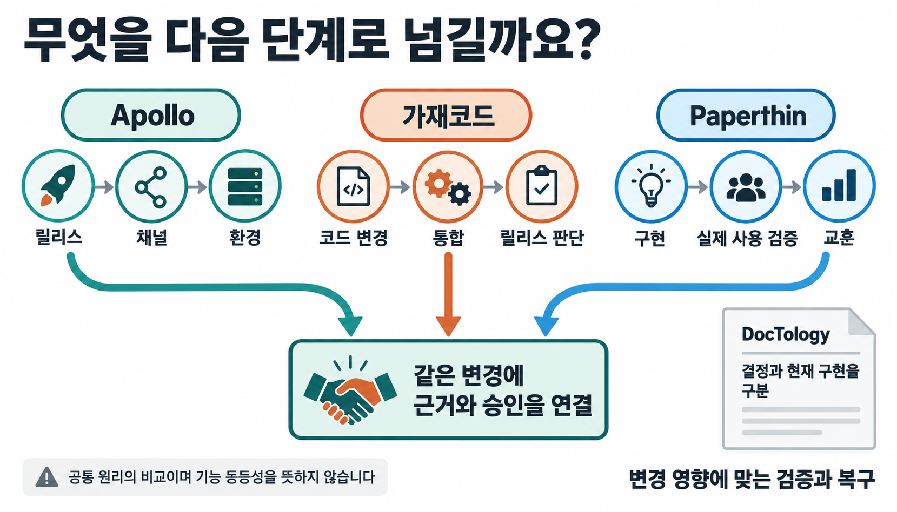

## 8. GitHub를 잘 쓰는 방식과 온톨로지가 만나는 곳

온톨로지는 다루는 대상이 무엇인지, 어떤 속성과 관계가 있는지 명시하는 모델입니다. 이 관점으로 Apollo의 운영 개념과 개발 기록을 보면 서로 흩어져 있던 항목들이 연결됩니다.

PR은 변경을 제안하는 이유를 설명하고, 커밋은 특정 구현을 가리킵니다. 테스트와 CI는 그 구현에 대해 확인한 결과를 남기고, 리뷰는 검토 판단을 기록합니다. 릴리스와 운영 기록은 실제로 무엇을 적용했는지 알려줍니다. GitHub를 잘 쓰는 개발 방식에는 이런 기록을 같은 변경에 연결해 다음 사람이 따라갈 수 있게 만드는 일이 포함된다고 생각합니다.

| 따라가려는 관계                    | 개발 기록에서 찾을 자리 |
| ---------------------------------- | ----------------------- |
| 이 변경은 어떤 문제를 해결하는가   | 이슈·PR의 문제와 이유   |
| 그 판단에 해당하는 구현은 무엇인가 | 커밋과 코드 revision    |
| 어떤 근거로 받아들였는가           | 테스트·CI·리뷰          |
| 무엇이 아직 끝나지 않았는가        | 미검증 항목·열린 질문   |
| 지금 실제로 적용돼 있는가          | 릴리스·배포·운영 상태   |

DocTology는 이 연결에서 현재 사실을 구분하는 데 도움을 주는 사례입니다. Repo Docs 계약은 현재 코드·운영 문서와 계획·검증 기록·파생 위키의 역할을 나눕니다. 바꾸기로 결정했다는 기록이 구현과 배포가 끝났다는 사실을 대신하지 않도록 합니다. [DocTology의 문서 권위 계약](https://github.com/tteggu87/DocTology/blob/main/.agents/skills/repo-docs-intelligence-bootstrap/SKILL.md)

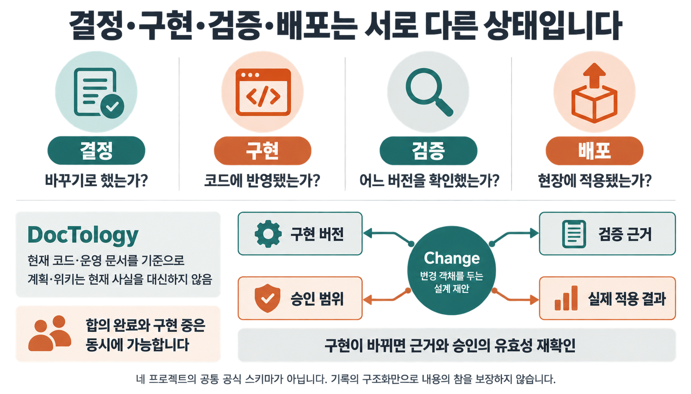

그래서 `re0-git`의 커밋 메시지가 작은 온톨로지처럼 느껴졌습니다. 문장 안에 문제, 수정한 동작, 지켜야 하는 경계가 함께 남기 때문입니다. 정확히는 **변경의 의미와 관계를 보존하려는 온톨로지적인 기록 방식**이라고 표현하는 편이 좋겠습니다. 자연어 메시지 자체가 기계적으로 검증되는 온톨로지 스키마이거나 Apollo의 배포 제어를 제공하는 것은 아닙니다.

또한 이런 관계가 중요하다는 이유만으로 그래프 데이터베이스부터 만들 필요는 없습니다. 이슈·PR·커밋·검증 결과의 링크를 정확히 남기는 것부터 시작할 수 있습니다. 별도의 `Change` 객체로 연결하는 구조는 이후에 선택할 설계이며, 네 프로젝트가 공유하는 공식 모델은 아닙니다.

## 9. 다음 변경을 넘기기 전에

Apollo를 이해하며 재미있었던 것은 거대한 배포 플랫폼의 운영 원리가 개발 기록을 읽는 눈으로도 이어졌다는 점입니다. 가재코드의 별도 `dev` 브랜치는 그 연결의 시작이었고, PR에 적힌 이유와 검증, Paperthin의 커밋 메시지 정리 방식은 그 안에 무엇을 남겨야 하는지 보여주었습니다.

여러 환경의 배포를 책임진다면 Apollo의 승격 조건·환경 제약·관찰·복구를 더 깊이 살펴볼 가치가 있습니다. 작은 저장소에서 에이전트와 일한다면 다음 PR과 커밋 하나부터 확인해도 됩니다.

변경 이유를 읽고 해당 구현을 찾을 수 있는지, 검증한 대상과 받아들이려는 대상이 같은지, 아직 모르는 것이 드러나는지 살펴보세요. 그다음에는 현재 적용 상태와 문제가 생겼을 때의 후속 조치까지 따라가면 됩니다. 다음 사람이 이 기록을 읽고 일을 이어갈 수 있다면, 코드와 함께 판단에 필요한 맥락도 전달한 것입니다.

## 함께 읽기

Apollo의 운영환경과 복구를 더 살펴보려면 [[notes/온톨로지/palantir-apollo-operating-change|팔란티어 Apollo는 운영의 변경을 어떻게 다루는가]]로, 결정과 현재 사실을 보존하는 구조는 [[notes/llm-wiki/doctology-llm-wiki-anatomy|DocTology의 LLM Wiki 구조]]로 이어집니다.

## 참고 자료

제품 기능은 Palantir 공식 문서, 개발 절차는 공개 저장소의 설명에 근거합니다. 가재코드 PR 5566번의 검증 결과는 작성자의 보고이며 별도로 재실행하지 않았습니다. Apollo와 개발 방식의 연결, 작은 온톨로지라는 표현은 이 근거를 읽고 얻은 해석입니다.

- [Apollo 개요](https://www.palantir.com/docs/apollo/core/overview) · [작동 방식](https://www.palantir.com/docs/apollo/core/how-apollo-works) · [Plan과 제약조건](https://www.palantir.com/docs/apollo/core/plans-and-constraints)
- [Product·Release](https://www.palantir.com/docs/apollo/core/products-releases-versions) · [Environment](https://www.palantir.com/docs/apollo/core/environments) · [CI 등록](https://www.palantir.com/docs/apollo/core/ci-publish-setup)
- [Release Channels](https://www.palantir.com/docs/apollo/core/release-channels) · [승격 파이프라인](https://www.palantir.com/docs/apollo/managing-release-channels/configure-promotion-pipeline) · [수동 승격](https://www.palantir.com/docs/apollo/managing-release-channels/manual-promotion) · [Recall](https://www.palantir.com/docs/apollo/recalling-releases/overview)
- [Foundry](https://www.palantir.com/docs/foundry/platform-overview/overview) · [Ontology](https://www.palantir.com/docs/foundry/ontology/overview) · [Action](https://www.palantir.com/docs/foundry/action-types/overview)
- [가재코드 PR #5566](https://github.com/Yeachan-Heo/gajae-code/pull/5566) · [기여 지침 확인 revision](https://github.com/Yeachan-Heo/gajae-code/blob/9da99cdd708ce3b97d64111d8eefc98a7e0921ee/CONTRIBUTING.md)
- [Paperthin re0-git](https://github.com/LilMGenius/paperthin/blob/6f706e30b5ec55e87598bf3b59164c9d9d96222f/skills/depth/re0-git/SKILL.md) · [re0-loop](https://github.com/LilMGenius/paperthin/blob/6f706e30b5ec55e87598bf3b59164c9d9d96222f/skills/coil/re0-loop/SKILL.md)
- [DocTology Repo Docs](https://github.com/tteggu87/DocTology/blob/main/.agents/skills/repo-docs-intelligence-bootstrap/SKILL.md)
