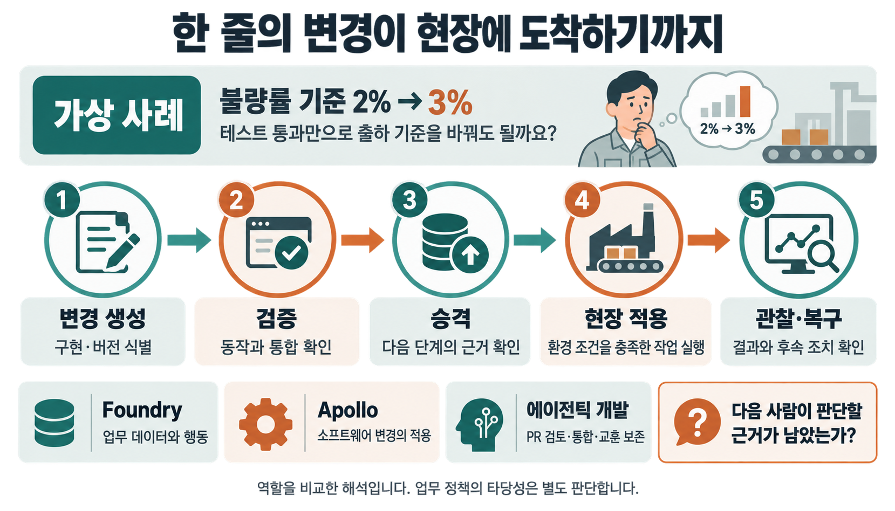
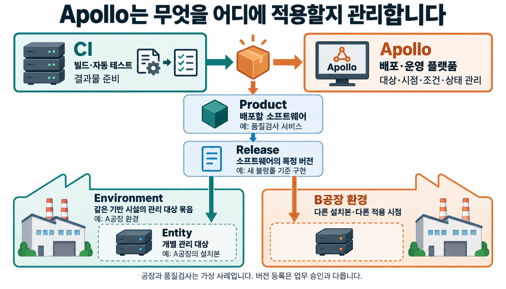
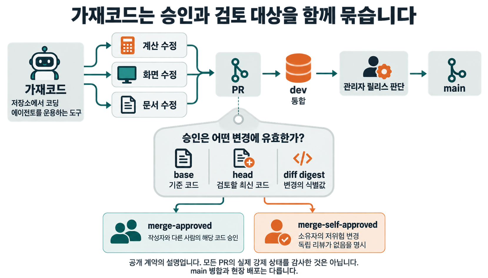
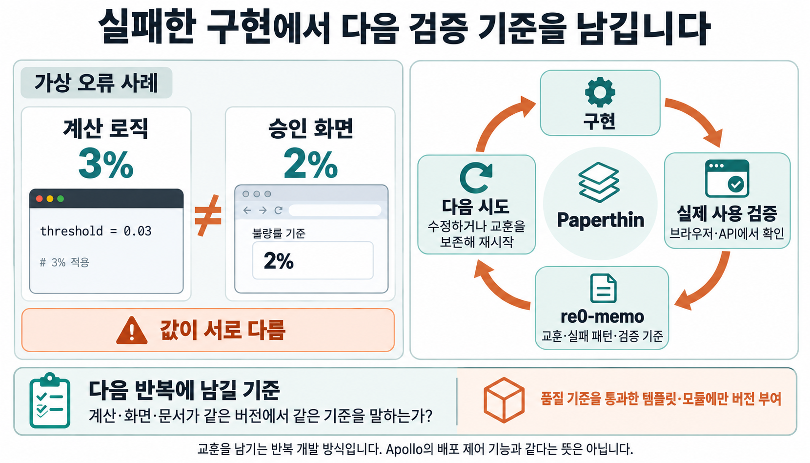
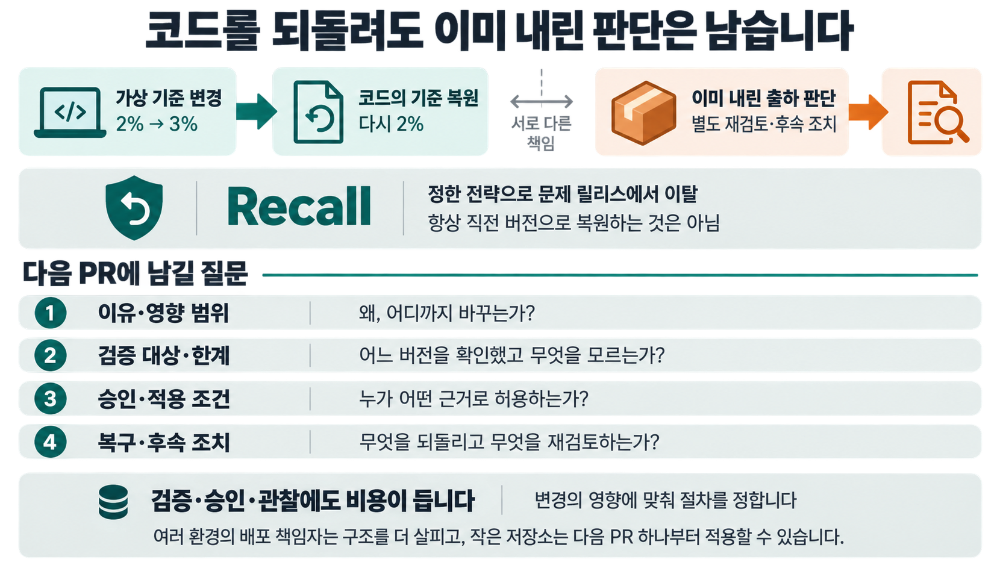

에이전트가 숫자 하나를 고쳤고 테스트도 통과했습니다. 이제 실제 출하 기준을 바꿔도 될까요?

가상의 품질검사 서비스에서 불량률 기준을 `2% → 3%`로 바꾼다고 해보겠습니다. 코드는 한 줄이지만, 그 한 줄 때문에 출하할 수 있는 제품이 달라집니다. 비교 연산이 정확하다는 증거와 새 기준을 업무에 적용해도 된다는 판단 사이에는 아직 거리가 있습니다.

**팔란티어 Apollo는 여러 실행 환경에 소프트웨어의 새 버전과 설정을 전달하고, 적용할 조건과 진행 상태를 관리하는 배포·운영 플랫폼입니다.** 변경을 만들어 놓은 뒤 어디에, 언제, 어떤 조건으로 반영할지를 다룹니다. 코딩 에이전트가 구현과 검증에 참여하는 에이전틱 개발에서도 이 질문은 익숙합니다. PR이 준비됐다는 사실과 실제 사용자에게 내보낼 준비가 끝났다는 사실은 다르기 때문입니다. [Apollo 구조 개요](https://www.palantir.com/docs/apollo/core/overview)

> [!summary] 변경이 영향력을 얻는 조건
> Foundry에서 업무 데이터를 행동으로 연결하면, 그 행동을 수행하는 소프트웨어의 변경도 관리해야 합니다. Apollo의 단계별 승격과 가재코드·Paperthin의 개발 절차는 변경을 시험하고 근거를 확인한 뒤 영향 범위를 넓힌다는 관점에서 만납니다. 닮은 것은 다음 단계로 넘기는 조건을 명시하는 방식입니다.

## 1. Apollo는 새 버전을 어느 현장에 적용할지 다룹니다

품질검사 서비스를 시험 서버 한 곳에서 실행할 때는 개발자가 직접 새 버전을 올릴 수 있습니다. 공장마다 서비스가 설치돼 있고, 어느 곳은 생산 중이며 다른 곳은 점검 중이라면 이야기가 달라집니다. 같은 버전이라도 지금 적용할 수 있는 현장은 서로 다를 수 있습니다.

Apollo에서는 배포할 소프트웨어를 Product, 그 특정 버전을 Release로 관리합니다. 실제로 설치된 개별 관리 대상은 Entity이고, 같은 기반 시설에서 실행되는 대상들을 Environment로 묶습니다. 예를 들면 ‘품질검사 서비스’가 Product, ‘새 불량률 기준을 구현한 버전’이 Release, ‘A공장에서 실행 중인 설치본’이 Entity입니다. 이 대응은 용어를 설명하기 위한 가상 사례입니다. [Product와 Release](https://www.palantir.com/docs/apollo/core/products-releases-versions), [Environment](https://www.palantir.com/docs/apollo/core/environments)

CI가 빌드와 자동 테스트로 배포할 결과물을 준비한다면, Apollo는 그 결과물을 실제 환경에 적용하는 쪽의 문제를 맡습니다. 파일을 만들었다는 사실만으로 모든 설치본이 곧바로 바뀌지는 않습니다. 대상이 구독하는 릴리스 채널, 환경 설정과 제약조건을 함께 봅니다. [Apollo의 작동 방식](https://www.palantir.com/docs/apollo/core/how-apollo-works)

점검 가능 시간을 기다리는 상태와 실행 도중 오류가 난 상태도 대응이 달라야 합니다. 이 차이를 알아야 운영자가 기다릴지, 수정할지, 회수할지를 판단할 수 있습니다.



_그림 2. Apollo는 무엇을 어디에 적용할지 관리합니다_

## 2. Foundry에서 이어지는 철학: 데이터를 읽은 뒤 현실에서 무엇을 바꿀 것인가

팔란티어 Foundry는 흩어진 데이터를 연결하고 가공해 분석과 업무 애플리케이션에 사용하는 플랫폼입니다. 그 안의 Ontology는 데이터에 실제 업무의 대상을 연결합니다. 공장, 제품, 주문 같은 객체와 그 관계를 표현하고, 객체에 수행할 수 있는 동작도 함께 다룹니다. [Foundry 개요](https://www.palantir.com/docs/foundry/platform-overview/overview), [Ontology 개요](https://www.palantir.com/docs/foundry/ontology/overview)

품질검사 사례라면 검사 결과 표를 읽는 데서 시작합니다. 그 결과를 특정 제품 묶음과 주문에 연결하면, 담당자는 ‘어느 주문의 출하가 영향을 받는가’를 물을 수 있습니다. 허용된 Action으로 출하 상태를 변경하는 업무를 구성한다면, 조회한 정보가 실제 결정으로 이어집니다. 여기서 객체·관계·Action의 지원은 제품 사실이고, 출하 업무는 설명용 설계입니다. [Action의 역할](https://www.palantir.com/docs/foundry/action-types/overview)

현실의 업무를 바꾸는 시스템에는 두 종류의 변경이 생깁니다. 오늘 어느 제품을 출하할지 결정하는 변경이 있고, 내일부터 출하 판단에 사용할 프로그램이나 설정을 바꾸는 변경이 있습니다. 앞의 변경이 정확해도 뒤의 변경을 잘못 적용하면 다음 판단부터 달라질 수 있습니다.


_그림 3. 업무의 행동과 소프트웨어 변경은 서로 다른 책임입니다._

| 같은 현장에서 묻는 질문                             | 설명의 중심                                 | 품질검사 가상 사례                                     |
| --------------------------------------------------- | ------------------------------------------- | ------------------------------------------------------ |
| 지금 무엇을 알고 어떤 행동을 할 수 있는가?          | Foundry의 데이터·Ontology·업무 애플리케이션 | 검사 결과를 제품·주문에 연결하고 허용된 출하 동작 수행 |
| 그 업무를 수행하는 소프트웨어를 어떻게 바꿀 것인가? | Apollo의 릴리스·환경·변경 제어              | 새 기준을 구현한 버전을 어떤 설치본에 적용할지 판단    |

두 제품을 이어 읽을 때 보이는 철학은 **정보나 결과물만 남기지 않고, 그것이 현실의 상태를 바꾸는 조건까지 다룬다**는 것입니다. 이는 공식 기능을 바탕으로 한 해석입니다. Foundry가 Apollo로 진화했다는 개발 연대기나, 모든 Ontology Action이 Apollo의 승인을 거친다는 실행 경로를 뜻하지는 않습니다.

불량률 기준을 바꾸는 일도 코드 수정 목록에만 남아서는 부족합니다. 어떤 업무 판단을 바꾸려는지, 누구에게 영향을 주는지, 어느 환경에 적용했는지까지 이어져야 합니다. 다만 Apollo가 `3%`라는 업무 기준의 타당성을 대신 판단하지는 않습니다.

## 3. 기본 구조: 판단하는 Hub와 실행하는 Spoke

Apollo의 구조는 변경을 조율하는 Hub와 관리 대상 환경인 Spoke에서 출발합니다. Hub는 어떤 릴리스가 있고 무엇이 보고됐는지 살펴 작업을 제안합니다. Spoke의 제어 계층은 상태를 보고하고 작업을 실행합니다. [Hub와 Spoke](https://www.palantir.com/docs/apollo/core/overview)

| 구성요소         | 맡은 역할                                  | 사례에서 확인할 것                     |
| ---------------- | ------------------------------------------ | -------------------------------------- |
| Product·Release  | 소프트웨어와 특정 버전 식별                | 새 기준이 들어간 버전은 무엇인가?      |
| Release Channel  | 사용 가능한 릴리스를 묶는 경로             | 이 설치본이 어느 채널을 구독하는가?    |
| Hub의 조율 엔진  | 릴리스·설정·보고 상태를 바탕으로 작업 제안 | 지금 어떤 변경을 제안할 수 있는가?     |
| Plan·Constraints | 실행할 작업과 그 선행조건                  | 의존성·점검 시간 등 조건을 충족했는가? |
| Spoke의 에이전트 | Plan 실행과 상태·결과 보고                 | 실제 설치본에서 무슨 일이 일어났는가?  |

Plan은 현장에서 수행할 구체적인 작업입니다. Constraints는 그 작업을 실행하기 전에 충족해야 할 조건입니다. Spoke의 에이전트가 Plan을 조회하면, 관련 조건을 통과한 작업이 전달됩니다. 실행 결과는 다시 Hub로 보고됩니다. [Plan과 제약조건](https://www.palantir.com/docs/apollo/core/plans-and-constraints)

이 에이전트는 코드를 작성하는 LLM 에이전트와 역할이 다릅니다. Apollo의 실행 에이전트는 환경의 상태를 보고하고 배포 작업을 수행합니다.

실행 중인 버전과 설정, 생존·준비 상태 같은 Reported State가 Hub로 돌아옵니다. 현재 문서는 Apollo를 단일 목표 버전으로 무조건 수렴시키는 구조로 설명하지 않습니다. 설정된 조건을 만족하는 Plan을 제안하는 구조로 설명합니다. [상태 보고와 실행](https://www.palantir.com/docs/apollo/core/how-apollo-works)


_그림 4. 중앙의 판단은 현장 보고와 함께 돌아갑니다_

## 4. 개발 후보부터 최종 승격까지: 통과해야 할 문은 두 개입니다

승격은 한 번의 승인 버튼으로 끝나는 사건처럼 보이기 쉽습니다. Apollo를 이해할 때는 두 질문을 나눠야 합니다. **다음 채널에 이 릴리스를 올려도 되는가? 그리고 이 환경에 지금 적용해도 되는가?**

### 기본 채널은 필수 승인 사다리가 아닙니다

Apollo에는 `DEV`, `RELEASE_CANDIDATE`, `RELEASE`라는 기본 채널이 있습니다. 이 이름만 보고 ‘개발 → 검증 → 운영’의 필수 승인 사다리로 읽으면 틀립니다. 기본 채널에는 버전 형식에 따라 릴리스가 자동 분류됩니다. 정식 Release 형식이면 세 기본 채널에 모두 들어가고, Release Candidate 형식이면 앞의 두 채널에 들어갑니다. 다른 버전 형식은 `DEV`에 들어갑니다. [기본 채널의 자동 분류](https://www.palantir.com/docs/apollo/core/release-channels)


_그림 5. 기본 채널은 승인 순서가 아니라 버전 분류입니다_

검증을 거쳐 순차적으로 넘길 경로는 승격 파이프라인으로 설정합니다. 공식 문서상 자동 승격 단계의 대상 채널은 기본 세 채널이 아닌 사용자 정의 채널입니다. 따라서 다음은 `TESTED`와 `PRODUCTION`이라는 사용자 정의 채널을 만든 **설명용 구성**입니다. 제품이 강제하는 채널 이름이 아닙니다. [승격 파이프라인 설정](https://www.palantir.com/docs/apollo/managing-release-channels/configure-promotion-pipeline)

```text
빌드·테스트 후 Release 등록
         ↓
DEV  ── 검증 조건 ──→  TESTED  ── 다음 조건 ──→  PRODUCTION
기본 채널             사용자 정의 채널            사용자 정의 최종 채널
                                                      ↓
                                      구독 대상의 환경별 Plan·조건 확인
                                                      ↓
                                          현장 실행 → 상태 보고·관찰
```

### 한 릴리스가 이 경로를 따라가면

1. **개발 후보를 등록합니다.** CI에서 만든 결과물과 버전 정보를 Release로 등록합니다. 등록됐다는 사실은 업무 정책의 승인이 아닙니다.
2. **다음 채널로 갈 조건을 평가합니다.** Timed 방식은 정한 시간과 라벨 조건 등을 봅니다. Canary 방식은 선택한 시험 대상을 관찰해 조건 충족 여부를 봅니다. 두 방식을 반드시 순서대로 써야 하는 것은 아닙니다.
3. **최종 채널까지 설정한 단계를 통과합니다.** 각 전이가 통과하면 대상 채널에 릴리스가 추가됩니다. 수동 검증이 필요하면 권한 있는 사용자가 수동 승격하는 경로도 있습니다.
4. **각 환경의 적용 조건을 다시 확인합니다.** 최종 채널에 들어갔어도 대상별 의존성, 변경 가능 시간과 실행 제약에 따라 적용 시점은 달라질 수 있습니다.
5. **실행 뒤 결과를 관찰합니다.** Plan의 성공 여부와 현장 상태를 확인합니다. 문제가 있는 릴리스의 Recall과 실행 실패 뒤 복구는 별도로 다룹니다.

이 흐름은 [CI에서의 릴리스 등록](https://www.palantir.com/docs/apollo/core/ci-publish-setup), [승격 설정](https://www.palantir.com/docs/apollo/managing-release-channels/configure-promotion-pipeline), [수동 승격](https://www.palantir.com/docs/apollo/managing-release-channels/manual-promotion), [작동 방식](https://www.palantir.com/docs/apollo/core/how-apollo-works)을 조합한 설명입니다.


_그림 6. 채널 승격을 마친 뒤에도 환경별 적용 조건이 남습니다._

품질검사 사례라면 시험 대상에서 새 버전이 정상 동작하는지 먼저 살피고, 조건을 만족한 버전을 더 넓은 대상이 구독하는 채널로 넘길 수 있습니다. 생산 중인 A공장은 점검 시간을 기다리고, 점검 가능한 B공장은 먼저 적용할 수도 있습니다. 둘의 버전이 잠시 다르다는 사실만으로 잘못된 배포라고 단정할 수 없습니다.

프로세스가 살아 있다는 신호와 서비스의 건강 상태(Health)는 다릅니다. 관찰 항목에도 한계가 있습니다. Health를 제공하지 않는 Entity의 승격 평가는 생존 상태와 시간에 의존하며, 그 Health 평가로 실패를 판정할 수 없습니다. 실행 중이라는 사실이 업무 결과의 정확성을 증명하지 않는다는 뜻입니다. `3%`를 실제 정책으로 써도 되는지는 여전히 별도 판단입니다. [Health가 없는 경우의 평가 한계](https://www.palantir.com/docs/apollo/managing-release-channels/configure-promotion-pipeline)


_그림 7. 승격은 어떤 근거를 보고 판단할까요?_

## 5. 가재코드의 PR에서 같은 질문을 만납니다

이제 세 에이전트가 동시에 작업한다고 가정해 보겠습니다. 하나는 불량률 계산을, 하나는 승인 화면을, 하나는 운영 문서를 고칩니다. 각각 테스트를 통과해도 세 결과물이 합쳐진 뒤 같은 기준을 설명하는지는 확인해야 합니다. 변경이 많이 만들어질수록 통합과 검증에 드는 일이 커질 수 있습니다.

[가재코드(gajae-code)](https://github.com/Yeachan-Heo/gajae-code)는 저장소나 작업 디렉터리에서 코딩 에이전트를 운용하는 개발 도구입니다. 그 공개 기여 지침은 일반 PR의 대상을 `dev`로 정하고, `main`은 관리자가 지시하는 릴리스 흐름에 남깁니다. PR에는 변경 이유와 수행한 검사를 적도록 합니다. 개발 중 변경을 모으는 곳과 릴리스를 판단하는 곳을 구분한 정책입니다. [기여 지침의 브랜치 정책](https://github.com/Yeachan-Heo/gajae-code/blob/9da99cdd708ce3b97d64111d8eefc98a7e0921ee/CONTRIBUTING.md)

```text
각 작업 브랜치 → PR → dev에 통합 → 관리자 중심 릴리스 판단 → main
```

더 눈에 띄는 부분은 리뷰를 특정 변경에 연결하는 계약입니다. 확인한 지침의 `Exact-head PR verdict gate`는 기준 코드(base), 검토할 최신 코드(head), 두 코드 사이 변경을 식별하는 값(diff digest)에 검토 결과를 묶습니다. ‘전에 승인받았다’는 기록으로 바뀐 코드를 통과시키지 않겠다는 방식입니다. `merge-approved`에는 PR 작성자와 다른 사람의 해당 head 승인 리뷰가 필요합니다. 소유자의 저위험 변경에는 독립 리뷰가 없음을 명시하는 `merge-self-approved` 경로를 따로 둡니다. [검토 대상과 승인 근거의 결합](https://github.com/Yeachan-Heo/gajae-code/blob/9da99cdd708ce3b97d64111d8eefc98a7e0921ee/CONTRIBUTING.md#exact-head-pr-verdict-gate)

문서에 적힌 정책과 실제 모든 PR에 강제되는 상태는 구분해야 합니다. 지침 자체도 브랜치 보호 설정과 워크플로 활성화 조건을 설명합니다. 여기서는 공개 계약을 읽었으며, 모든 PR의 실행 이력이나 보호 설정을 감사한 것은 아닙니다.

Apollo와의 접점은 `dev`라는 이름보다 **검증이 유효한 대상을 정하고, 통합·릴리스의 경계를 따로 둔다**는 점에 있습니다. 다만 Git 브랜치는 코드 revision을 가리키고, Apollo 환경은 실제 실행 상태와 제약을 다룹니다. `main` 병합이 현장 배포 완료를 뜻하지는 않습니다.



_그림 8. 가재코드는 승인과 검토 대상을 함께 묶습니다_

## 6. Paperthin은 다음 반복으로 무엇을 넘길지 묻습니다

계산 로직은 `3%`인데 승인 화면에는 여전히 `2%`가 보인다고 해보겠습니다. 개발자는 화면을 수정할 수 있습니다. 그런데 다음 에이전트가 같은 종류의 변경을 맡았을 때도 이 불일치를 발견할 수 있을까요?

[Paperthin](https://github.com/LilMGenius/paperthin)의 `re0-loop`는 구현과 QA, 배운 점의 정리, 다음 구현을 반복하는 스킬입니다. 실제 브라우저나 API 같은 사용 경로에서 결과를 확인하고, `re0-memo`로 교훈·실패 패턴·다음 검증 기준을 남깁니다. `re0-work`를 선택하면 그 교훈을 유지하며 다시 시작합니다. 품질 기준을 통과한 템플릿이나 모듈에만 버전을 붙이도록 설명합니다. [반복 개발 계약](https://github.com/LilMGenius/paperthin/blob/6f706e30b5ec55e87598bf3b59164c9d9d96222f/skills/coil/re0-loop/SKILL.md)

앞의 실패에서 남길 것은 ‘화면을 고쳤다’는 기록만이 아닙니다. ‘정책을 바꾸면 계산·화면·문서가 같은 revision에서 같은 기준을 말하는지 확인한다’는 다음 검증 항목도 남길 수 있습니다. 한 번의 수정으로 다음 작업의 판단 기준도 바꿀 수 있습니다.

Apollo는 어느 릴리스를 다음 채널로 넘길지 다룹니다. Paperthin은 어떤 구현과 교훈을 다음 반복에 가져갈지 다룹니다. 서로 다른 대상이지만, 만들었다는 사실만으로 다음 단계에 남길 자격을 주지 않는다는 관점으로 비교할 수 있습니다. Paperthin이 Apollo의 배포 제어 기능을 갖췄다는 뜻은 아닙니다.



_그림 9. 실패한 구현에서 다음 검증 기준을 남깁니다_


_그림 10. 각 시스템은 서로 다른 대상을 검증해 다음 단계로 넘깁니다._

| 비교 축                 | Apollo                         | 가재코드의 기여 흐름         | Paperthin의 반복                         |
| ----------------------- | ------------------------------ | ---------------------------- | ---------------------------------------- |
| 다음 단계로 넘기는 것   | 소프트웨어 릴리스              | 특정 revision의 코드 변경    | 검증된 구현과 다음에 쓸 교훈             |
| 확인하는 근거           | 승격 조건·보고 상태·환경 제약  | 테스트·리뷰·변경에 묶인 판정 | 실제 사용 경로의 확인·실패에서 얻은 기준 |
| 멈추거나 다시 보는 지점 | 승격 대기·적용 억제·Recall 등  | 병합 보류·수정·재검토        | 반복 수정 또는 교훈을 보존한 재시작      |
| 별도로 남는 책임        | 업무 정책과 외부 결과의 타당성 | 실제 운영 환경의 배포·관찰   | 운영 배포 제어와 교훈의 장기 유효성      |

개발자들이 ‘본능적으로 Apollo와 같은 지점에 도달했다’고 느낄 만한 이유는 여기에 있습니다. 결과물이 많아질 때에는 격리할 범위, 통과시킬 근거, 다음에 남길 것을 정해야 합니다. 다만 이는 공개 절차를 비교해 얻은 해석입니다. 개발자의 내적 동기나 Apollo를 참고한 계보를 확인한 것은 아닙니다. 기존 검토·릴리스 문제를 에이전트와 함께 다시 다루는 것으로 읽는 편이 적절합니다.

## 7. 승격한 뒤에도 기록이 현재 사실과 맞아야 합니다

승인을 받았어도 실제 배포가 아직 끝나지 않았다면 두 상태는 따로 남아야 합니다. [DocTology의 Repo Docs 계약](https://github.com/tteggu87/DocTology/blob/main/.agents/skills/repo-docs-intelligence-bootstrap/SKILL.md)은 결정 상태와 구현 상태를 분리하고, 파생 위키나 계획이 현재 코드·운영 문서의 사실을 대신하지 않도록 합니다. ‘바꾸기로 했다’와 ‘지금 바뀌어 있다’를 섞지 않기 위한 구분입니다.

이 비교를 개발 기록에 적용한다면, PR·테스트·승인·적용 대상을 하나의 변경 주변에 연결해 볼 수 있습니다. 어느 revision을 검증했는지, 그 승인이 어떤 환경과 범위에 유효한지, 실제 적용 결과는 무엇인지 남기는 것입니다. 이를 `Change` 객체로 표현할 수도 있지만, 네 프로젝트가 공유하는 공식 스키마가 아니라 설계 제안입니다.

기록을 구조화했다고 그 내용이 자동으로 참이 되지는 않습니다. 구현이 달라지면 검증과 승인의 유효성을 다시 확인해야 하고, 실행 결과가 달라지면 현재 상태도 고쳐야 합니다.


_그림 11. 결정·구현·검증·배포는 서로 다른 상태입니다_

## 8. 다음 PR에서는 관문보다 질문부터 늘려 보세요

단계를 추가하면 검토 대기, 테스트 유지와 관찰 비용도 생깁니다. 영향이 작고 쉽게 되돌릴 수 있는 실험에 복잡한 승인 절차를 모두 적용할 필요는 없습니다. 브랜치가 하나 늘었다는 사실보다 그 경계에서 어떤 새로운 근거를 확인하는지가 중요합니다.

되돌릴 수 있는 범위도 정해야 합니다. Apollo의 Recall은 지정한 전략에 따라 문제가 있는 릴리스에서 벗어나게 하는 기능이며, 항상 직전 버전으로 돌아가는 명령은 아닙니다. 코드를 되돌렸다고 이미 수행한 외부 업무까지 취소되는 것도 아닙니다. 가상 사례에서 기준을 `2%`로 복원하는 일과 `3%` 기준으로 이미 내린 출하 판단을 재검토하는 일은 별개입니다. [Recall의 범위](https://www.palantir.com/docs/apollo/recalling-releases/overview)

여러 환경의 배포를 책임진다면 Apollo의 채널·Plan·제약조건을 더 알아볼 가치가 있습니다. 에이전트와 작은 저장소를 운영하는 개발자라면 플랫폼 도입 전에 다음 PR 하나에 적용해 볼 수 있습니다.

- 왜 바꾸며, 어디까지 영향을 주는가?
- 어느 revision을 무엇으로 확인했고, 무엇은 아직 모르는가?
- 누가 어떤 조건에서 통합·릴리스·현장 적용을 허용하는가?
- 문제가 생기면 무엇을 되돌리고, 어떤 업무 결과는 따로 재검토하는가?



_그림 12. 코드를 되돌려도 이미 내린 판단은 남습니다_

다음 사람이 이 기록만 읽고 변경을 넘겨도 될지 판단할 수 있다면, 승격의 경계가 구체적으로 드러납니다. 에이전트에게 작업을 더 맡기기 전에 먼저 정할 것은 그 결과를 어디까지 믿고 사용할지입니다.

## 함께 읽기

실제 환경의 승격과 복구는 [[notes/온톨로지/palantir-apollo-operating-change|팔란티어 Apollo는 운영의 변경을 어떻게 다루는가]]에서, 현재 사실과 파생 기록의 구분은 [[notes/llm-wiki/doctology-llm-wiki-anatomy|DocTology의 LLM Wiki 구조]]에서 이어집니다.

## 참고 자료

2026년 9월 14일 공식 문서와 공개 저장소를 확인했습니다. 제품 사실, 저장소의 명시된 정책, 비교를 통한 해석과 가상 사례를 구분했습니다. 동일 조건의 성능·안전성 실험 결과는 아닙니다.

- [Foundry 개요](https://www.palantir.com/docs/foundry/platform-overview/overview) · [Ontology](https://www.palantir.com/docs/foundry/ontology/overview) · [Action](https://www.palantir.com/docs/foundry/action-types/overview): 데이터·업무 모델·동작의 관계.
- [Apollo 구조](https://www.palantir.com/docs/apollo/core/overview) · [작동 방식](https://www.palantir.com/docs/apollo/core/how-apollo-works) · [Plan과 제약](https://www.palantir.com/docs/apollo/core/plans-and-constraints): Hub·Spoke·실행·상태 보고.
- [Release Channels](https://www.palantir.com/docs/apollo/core/release-channels) · [승격 설정](https://www.palantir.com/docs/apollo/managing-release-channels/configure-promotion-pipeline) · [Recall](https://www.palantir.com/docs/apollo/recalling-releases/overview): 기본 채널 분류, 사용자 정의 채널 승격과 복구 범위.
- [gajae-code 기여 지침, 확인 revision](https://github.com/Yeachan-Heo/gajae-code/blob/9da99cdd708ce3b97d64111d8eefc98a7e0921ee/CONTRIBUTING.md): PR 대상, 릴리스 경계와 변경에 묶인 리뷰 계약.
- [Paperthin re0-loop, 확인 revision](https://github.com/LilMGenius/paperthin/blob/6f706e30b5ec55e87598bf3b59164c9d9d96222f/skills/coil/re0-loop/SKILL.md): 실제 사용 경로 검증과 다음 반복에 남기는 기준.
- [DocTology Repo Docs](https://github.com/tteggu87/DocTology/blob/main/.agents/skills/repo-docs-intelligence-bootstrap/SKILL.md): 문서 권위와 결정·구현 상태의 구분.
