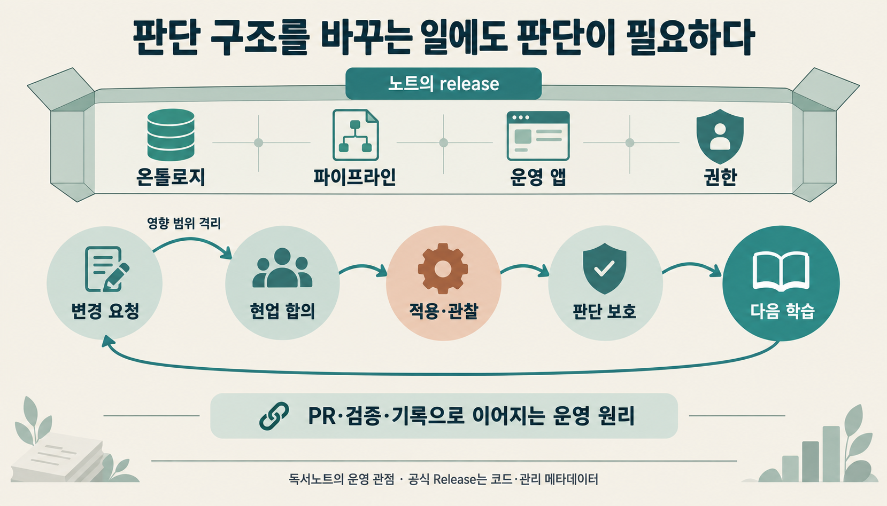
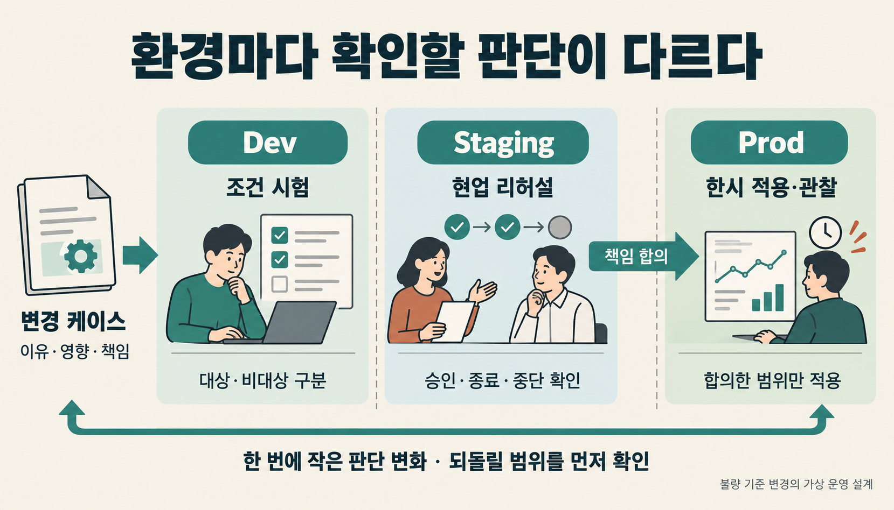
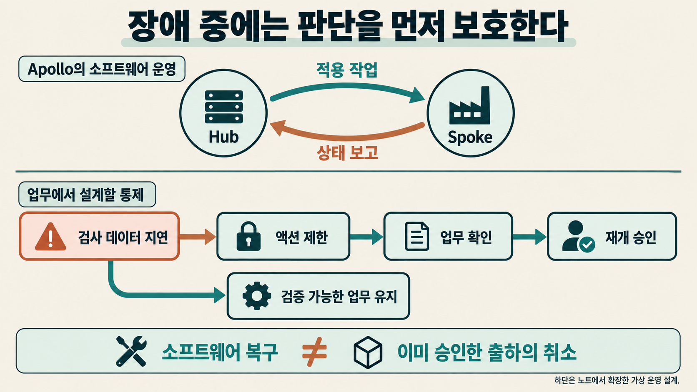
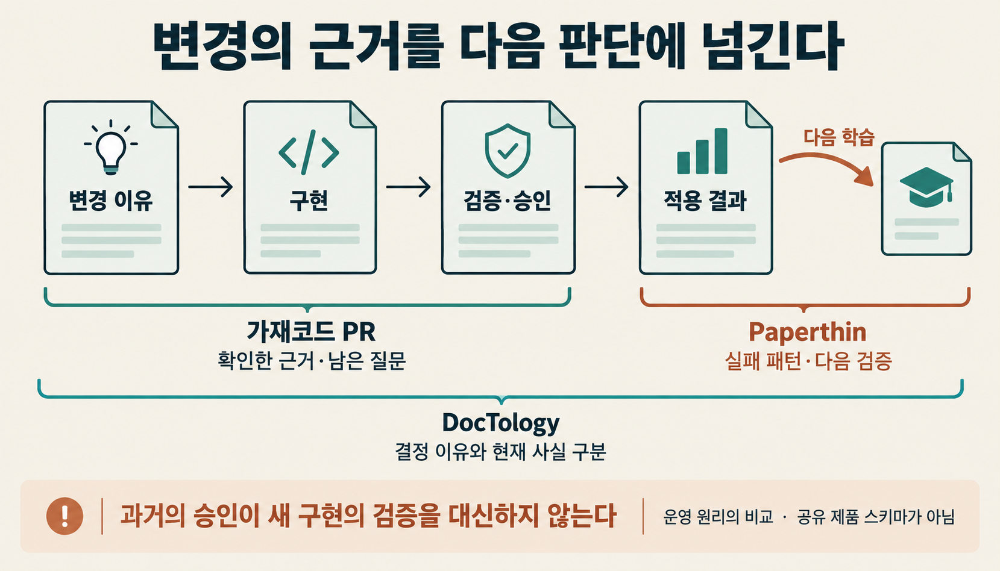

불량 기준이 너무 엄격하니 조금만 낮춰 달라는 요청이 들어왔습니다. 조건식 한 줄을 고치면 끝날까요?

기준을 바꾸면 어제 보류했던 제품이 오늘은 출하 가능해질 수 있습니다. 어느 배치에 새 기준을 적용하고, 누가 예외를 승인하며, 문제가 생기면 어떤 판단부터 멈출지까지 달라집니다. 코드는 짧아도 조직이 받아들여야 할 변화는 작지 않습니다.

**팔란티어 Apollo는 소프트웨어의 배포와 변경을 여러 운영환경에서 조율하는 플랫폼입니다.** Foundry의 판단 구조를 운영하려면 한번 만든 기준을 계속 바꾸고 보호해야 합니다.[^note13] [Apollo 공식 개요](https://www.palantir.com/docs/apollo/core/overview)

> [!summary] 판단 구조를 바꾸는 일에도 판단이 필요합니다
> 변경 이유를 기록하고, 영향 범위를 격리하며, 현업의 리허설과 합의를 거쳐 적용합니다. 적용 뒤에는 잘못된 판단의 확산을 막고 왜 그 기준을 택했는지 남깁니다. 이 운영 원리는 에이전틱 개발의 PR·검증·학습 기록에서도 다시 읽힙니다.

## 1. Apollo가 배포하는 판단 구조

Foundry는 데이터를 연결하고 가공해 분석과 업무 애플리케이션에 사용하는 플랫폼입니다. 그 안의 Ontology는 제품·배치·주문 같은 업무 대상과 속성·관계, 허용된 동작을 표현합니다. 검사 결과를 배치와 연결하면 담당자는 출하 여부를 살피고, 정해진 Action으로 업무 상태를 바꿀 수 있습니다. [Foundry 개요](https://www.palantir.com/docs/foundry/platform-overview/overview), [Ontology 개요](https://www.palantir.com/docs/foundry/ontology/overview), [Action](https://www.palantir.com/docs/foundry/action-types/overview)

운영 관점에서 **Apollo의 배포 단위인 release는 온톨로지·데이터 파이프라인·운영 앱·권한 구조를 함께 묶은 판단 구조입니다.** 무엇을 정상으로 볼지, 어떤 상태에서 액션을 열지, 누가 승인할지를 바꾸는 일이 배포에 포함됩니다. 특정 시점에 어떤 기준이 적용됐는지 다시 설명할 수 있어야 합니다.[^note13]

공식 문서의 Product Release는 코드와 관리 메타데이터를 포함한 소프트웨어 버전이라는 더 좁은 정의입니다. 이 묶음 전체가 하나의 Release로 일괄 배포·복구된다는 보장과는 구분해야 합니다. [공식 Release 정의](https://www.palantir.com/docs/apollo/core/products-releases-versions)

화장품 공장 실습에서는 변경 요청을 케이스로 검토해 특정 배치에만 한시적으로 적용되는 액션을 구현했습니다. 이 사례에 승인자·종료 조건·장애 대응을 더해 생각해 보겠습니다. 추가한 절차는 **가상 운영 설계**이며, 실제 고객의 절차나 측정된 성과는 아닙니다.[^note13]

| 판단 구조의 구성   | 기준을 바꿀 때 확인할 것                                |
| ------------------ | ------------------------------------------------------- |
| 온톨로지·상태 정의 | 어떤 배치를 예외 대상으로 보고 어떤 상태로 표시하는가   |
| 데이터 파이프라인  | 판정에 쓰는 검사 결과가 누락되거나 오래되지 않았는가    |
| 운영 앱·액션       | 담당자가 예외 적용 범위를 보고 올바른 동작을 선택하는가 |
| 권한 구조          | 누가 예외를 승인하고 누가 중단·재개를 결정하는가        |

함수에서 불량률 계산 방식을 고쳤는데 과거 케이스도 새 기준으로 해석하면, 당시 왜 출하를 승인했는지 설명하기 어려워집니다. 구현 버전뿐 아니라 기준의 적용 시점과 대상, 승인 이유를 함께 남겨야 하는 이유입니다. **온톨로지를 운영한다는 것은 조직의 판단 기준을 관리하는 일입니다.**

## 2. 변경 요청부터 하나의 케이스로 남깁니다

변경을 지나치게 막으면 현업이 엑셀과 메신저에서 별도로 판단할 수 있습니다. 시스템 안의 기준과 실제로 쓰는 기준이 갈라지는 것입니다. 요청을 받아 검토할 통로가 있어야 변화도 통제 안에 남습니다.[^note13]

불량 기준을 낮춰 달라는 요청을 받았다고 가정해 보겠습니다. 요청 케이스에는 현재 기준이 어떤 불편을 만드는지, 바꾸지 않으면 어떤 문제가 남는지부터 적습니다. 이어서 전체 제품의 기준을 바꿀 것인지, 특정 배치만 예외로 다룰 것인지 검토합니다. 예외를 허용한다면 출하 책임자와 적용 종료 조건도 정합니다.

이렇게 남긴 요청은 “안 되니 고쳐 달라”에서 “이 조건과 범위에서 바꾸자”는 제안으로 구체화됩니다. 개발자는 구현할 범위를 알고, 품질 담당자는 어떤 판단을 승인해야 하는지 알 수 있습니다. 변경 기록은 나중에 지금의 구조가 왜 생겼는지 찾는 근거가 됩니다.

여러 판단 변화를 한꺼번에 섞으면 실패 원인과 되돌릴 범위를 가리기 어려워집니다. 한 번에 하나의 판단 변화를 다루려면, 한시 예외를 추가하면서 전체 상태 체계와 권한 정책까지 함께 개편하지 않는 편이 좋습니다. 구현상 함께 바꿔야 할 요소는 묶되, 검토할 판단의 목적과 영향은 좁게 유지합니다.

## 3. Dev·Staging·Prod는 판단의 영향 범위를 나눕니다

Dev에서 예외 조건을 시험하다 틀렸다고 해서 실제 출하가 바뀌어서는 안 됩니다. Staging에서는 품질 담당자가 예외 대상과 승인 버튼을 이해하는지 살펴야 합니다. Prod에서는 그 판단이 실제 제품과 사람에게 영향을 줍니다. **격리하는 것은 서버만이 아니라 판단의 영향 범위입니다.**[^note13]

| 환경의 역할 | 이 사례에서 하는 일                                  | 다음 단계로 넘길 근거                           |
| ----------- | ---------------------------------------------------- | ----------------------------------------------- |
| Dev         | 보호된 시험 데이터로 예외 조건·상태·액션을 바꿔 본다 | 대상 배치와 비대상 배치가 의도대로 구분된다     |
| Staging     | 품질 담당자가 요청·예외 승인·종료 과정을 리허설한다  | 적용 범위가 보이고 승인·중단 책임이 명확하다    |
| Prod        | 합의한 대상과 조건에 변경을 적용한다                 | 적용 결과를 관찰하고 이상 시 통제할 준비가 있다 |

Staging에서 버튼이 눌린다는 사실만 확인하면 부족합니다. 예외 대상이 아닌 배치에서도 승인할 수 있는지, 검토자가 새 기준과 기존 기준을 혼동하지 않는지, 예외가 끝났는데 액션이 계속 열려 있지는 않은지를 살펴야 합니다. 현업 사용자의 인수 시험인 UAT는 이처럼 실제 판단 과정을 재현하는 일입니다.

Dev에서 Staging으로 넘길 때는 함께 시험할 준비가 됐는지를 묻습니다. Staging에서 Prod로 넘길 때는 **조직이 이 변경의 결과를 받아들이고 책임질 준비가 됐는지**를 묻습니다. 환경 승격에는 이런 책임의 합의가 포함됩니다. 사람이 모든 자동 배포를 건별 승인해야 한다는 제품 규칙보다, 무엇을 허용할지 사전에 정하는 운영 원리로 읽을 수 있습니다.

Staging에 어떤 데이터를 둘지와 물리적·논리적 격리 방식은 조직의 조건에 맞춰 정합니다. 운영 데이터 전체 복사나 특정 권한 배치가 모든 설치의 필수 조건인 것은 아닙니다. 재현해야 할 판단 상황과 보호해야 할 데이터를 먼저 정하면 됩니다. 느린 배포 자체가 목표인 것도 아닙니다. 위험과 되돌릴 범위에 맞는 검증이 목표입니다.

## 4. Apollo는 합의한 변경을 현장에 적용하고 결과를 받습니다

판단 기준과 승인 범위를 정한 뒤에도 소프트웨어를 현장에 적용하는 일이 남습니다. CI는 코드를 빌드하고 시험해 배포할 결과물을 준비합니다. Apollo는 등록된 릴리스와 환경별 조건을 사용해 변경을 조율합니다. [CI에서 릴리스 등록](https://www.palantir.com/docs/apollo/core/ci-publish-setup)

구성은 Hub와 Spoke로 이해할 수 있습니다. Hub는 사용 가능한 릴리스, 설정, 보고된 상태와 제약을 보고 실행 작업인 Plan을 제안합니다. 관리 대상 환경인 Spoke의 에이전트는 조건을 통과한 작업을 받아 실행하고 상태를 보고합니다. 의존성이나 변경 가능한 시간 조건을 만족하지 못하면 적용을 기다릴 수 있습니다. [작동 방식](https://www.palantir.com/docs/apollo/core/how-apollo-works), [Plan과 제약조건](https://www.palantir.com/docs/apollo/core/plans-and-constraints)

릴리스를 다음 채널로 넘기는 승격도 구성할 수 있습니다. 시간 조건을 평가하거나, 선택한 시험 대상에서 상태를 관찰하는 Canary 방식을 쓰거나, 권한 있는 사람이 수동으로 승격할 수 있습니다. 여기서 릴리스 채널은 사용할 버전을 묶는 경로입니다. 앞의 Dev·Staging·Prod라는 환경 역할과 Apollo의 기본 채널 이름은 별개입니다. [승격 파이프라인](https://www.palantir.com/docs/apollo/managing-release-channels/configure-promotion-pipeline), [수동 승격](https://www.palantir.com/docs/apollo/managing-release-channels/manual-promotion), [기본 채널](https://www.palantir.com/docs/apollo/core/release-channels)

예외 처리를 수행하는 서비스의 수정본이 시험을 통과했다고 해보겠습니다. 배포 후보로 승격해도 생산 중인 공장은 점검 시간까지 기다릴 수 있습니다. 최종 채널에 들어간 사실과 모든 현장의 적용 완료는 다릅니다. 적용한 뒤에는 실제 버전과 상태 보고를 확인합니다.

Apollo의 Health는 대상이 제공하는 건강 상태 평가 신호입니다. 개별 관리 대상인 Entity가 Health를 제공하지 않으면 해당 승격 평가는 생존 상태와 시간에 의존하며, 그 평가로는 실패를 판정할 수 없습니다. 서비스가 응답한다는 사실만으로 예외 승인 업무까지 검증됐다고 읽어서는 안 됩니다. [Health 평가의 범위](https://www.palantir.com/docs/apollo/managing-release-channels/configure-promotion-pipeline)

따라서 현업 리허설에서 확인한 조건과 배포 후 관찰할 신호를 연결하는 작업이 필요합니다. 배포 도구에 신호가 들어오기만 기다리는 것으로는 어떤 업무 오류를 놓치는지 알 수 없습니다.

## 5. 장애가 나면 판단을 먼저 보호합니다

예외 적용 뒤 검사 데이터의 갱신이 지연됐다고 가정해 보겠습니다. 화면은 열리고 승인 버튼도 보이지만, 판단에 쓰이는 값은 오래됐습니다. 이런 부분 장애에서는 정상처럼 보이는 화면 때문에 잘못된 결정을 계속할 수 있습니다. 원인을 끝까지 분석하기 전에 잘못된 판단의 확산부터 막아야 합니다.[^note13]

이 사례에서는 영향받는 배치의 자동 출하 상태 전이를 잠시 멈추고 예외 승인 액션을 제한할 수 있습니다. 조회와 검증 가능한 다른 업무는 유지합니다. 감지 시점, 통제 범위, 임시 조치와 책임자를 같은 케이스에 남기고, 데이터가 다시 들어온 뒤에도 품질 담당자가 상태를 확인하고 재개를 승인하도록 설계합니다.

이런 대응이 통제 모드입니다.[^note13] Apollo에 모든 업무를 자동 보호하는 단일 기능이 있다는 설명이 아니라, 상태 전이·액션·권한과 사람의 역할을 함께 정하는 운영 설계입니다. 무엇을 멈추고 무엇을 계속할지 미리 정해야 장애 중에도 선택할 수 있습니다.

문제 소프트웨어에 대한 대응도 필요합니다. Apollo의 Recall은 정한 전략에 따라 문제 Release에서 대상을 벗어나게 하며, 항상 직전 버전으로 돌아간다는 뜻은 아닙니다. Plan 실행이 실패하고 이전과 다른 상태가 남았다면, Apollo는 실행 전 상태로 복원하기 위한 rollback Plan을 발행합니다. [Recall](https://www.palantir.com/docs/apollo/recalling-releases/overview), [실행 실패와 복구](https://www.palantir.com/docs/apollo/core/how-apollo-works)

그러나 소프트웨어를 복구해도 이미 승인한 출하는 남을 수 있습니다. 배포 전에 “내일 이 변경을 취소한다면 무엇을 되돌리고 무엇을 따로 처리할 것인가”를 물어야 합니다. 기준·액션을 이전 상태로 돌리는 절차와 이미 실행한 업무를 재검토하는 절차는 담당자와 완료 조건이 다를 수 있습니다.

복구 뒤에는 누가 실수했는지만 묻지 않습니다. 오래된 데이터를 알아채는 조건이 없었는지, 데이터가 불확실할 때 액션이 계속 열려 있었는지 돌아봅니다. 그 결과를 다음 변경의 테스트와 리허설 조건으로 남기면 실패가 반복 개선의 근거가 됩니다.

## 6. 가재코드의 dev와 PR에서 같은 질문을 만났습니다

에이전틱 개발은 코딩 에이전트가 구현과 수정 작업을 수행하고, 사람이 요구·검증·통합을 함께 다루는 개발 방식입니다. 여러 에이전트가 코드와 화면, 문서, 의존성을 동시에 고친다면 각 작업의 테스트가 통과해도 합친 결과에는 문제가 생길 수 있습니다. 한 변경이 다른 변경의 전제를 깨는지 확인할 자리가 필요합니다.

[가재코드(gajae-code)](https://github.com/Yeachan-Heo/gajae-code)는 저장소에서 코딩 에이전트를 운용하는 개발 도구입니다. [기여 지침의 해당 revision](https://github.com/Yeachan-Heo/gajae-code/blob/9da99cdd708ce3b97d64111d8eefc98a7e0921ee/CONTRIBUTING.md)은 일반 PR을 `dev`로 보내고 `main`은 관리자가 지시하는 릴리스 흐름에 남기도록 안내합니다. 확인한 PR에는 `dev` 대상과 `main` 대상이 모두 있었습니다. 이 관찰은 해당 시점의 기록이며 모든 PR이 같은 경로를 거친다는 보장은 아닙니다.

`dev`에 변경을 모아 CI와 리뷰를 수행하고, 충돌·회귀가 드러나면 다시 수정하는 흐름은 Staging의 리허설과 이어 읽을 수 있습니다. 다만 브랜치는 코드 revision을 가리킬 뿐 실행 환경 자체는 아닙니다. 실제 사용자 경로와 통합 상태를 시험해야 그 역할을 할 수 있고, `main` 병합만으로 현장 배포가 끝나지도 않습니다.

| 변경 전에 묻는 질문              | 에이전틱 개발에서 남길 근거          |
| -------------------------------- | ------------------------------------ |
| 왜 판단 기준을 바꾸는가          | 이슈·PR의 문제와 변경 이유           |
| 어디까지 영향받는가              | 변경 범위, 의존성, 통합 후 영향      |
| 누가 어떤 상황을 확인했는가      | CI 결과, 실제 사용 검증, 리뷰와 승인 |
| 무엇이 아직 미확인인가           | 남은 E2E, 열린 질문, 적용 제한       |
| 실패하면 어떻게 다룰 것인가      | 중단·revert·재배포·후속 조치의 범위  |
| 다음에는 무엇을 다르게 할 것인가 | 회귀 테스트, 실패 기록, 인계 문서    |

같은 검사를 두 번 돌리는 것으로는 검증 단계가 깊어지지 않습니다. 개별 변경의 동작을 확인한 다음에는 함께 실행되는 상태와 실제 사용자 경로를 확인해야 합니다. 앞의 공장 사례에서 조건식 시험 다음에 품질 담당자의 승인 리허설이 필요했던 것과 같습니다.

변경을 생성하는 속도가 검토·통합 속도를 앞서는 상황이라면 병목은 무엇을 받아들일지 판단하는 쪽으로 이동할 수 있습니다. 이는 생산성을 측정한 결론이 아니라 운영상의 가설입니다. 적용 가능한 교훈은 분명합니다. 더 많은 변경을 만들기 전에, 각 단계가 추가로 확인할 근거를 정해야 합니다.

## 7. PR은 변경을 받아들일 근거를 묶습니다

`dev` 대상 [PR #5566](https://github.com/Yeachan-Heo/gajae-code/pull/5566)은 PDF의 압축 데이터를 텍스트로 읽어 검사기가 잘못된 단어를 탐지한 문제를 다룹니다. 설명에 문제, 뒤늦게 드러난 이유, 수정 방법과 검증 결과가 함께 있습니다.

| PR의 설명                | 검토자가 읽을 근거                                           |
| ------------------------ | ------------------------------------------------------------ |
| Problem                  | 어떤 실패를 해결하려는가                                     |
| Why it appeared only now | PDF 추가 당시 관련 검사가 실행되지 않아 왜 나중에 드러났는가 |
| Fix                      | 바이너리를 검사에서 제외해 원인을 어떻게 다뤘는가            |
| Verification             | 수정 뒤 통과하며 실제 텍스트 탐지도 유지되는가               |
| Red control              | 수정을 되돌리면 같은 바이너리 사례가 다시 실패하는가         |

작성자는 수정한 검사 파일만 되돌리면 같은 사례가 다시 실패한다고 보고했습니다. 테스트가 통과했다는 결과에 더해, 그 수정이 관찰된 실패를 다뤘다는 근거를 제시합니다.

`main` 대상 [PR #5556](https://github.com/Yeachan-Heo/gajae-code/pull/5556)은 여러 세션이 같은 상태 파일을 갱신할 때 잠금 경합으로 갱신이 누락되는 문제를 다룹니다. `Acceptance`에서 요구 조건·구현·로컬 테스트를 연결하고, `Needs e2e`와 `Open questions`에 실제 동시 세션으로 더 확인할 항목과 별도 문제를 남깁니다.

두 PR의 테스트 결과는 작성자의 보고이며 이 글에서 재실행한 결과는 아닙니다. 다만 무엇을 확인했고 무엇이 남았는지를 분리해 적는 방식은 검토에 재사용할 수 있습니다. 남은 E2E를 보고 적용을 보류하거나 허용 범위를 좁힐 수도 있습니다.

이런 PR을 저는 **판단 패키지**로 읽습니다. 변경 이유와 구현, 받아들일 근거와 미확인 사항을 함께 묶은 제안입니다. 필요 이유·영향·책임을 남기는 변경 케이스와 같은 역할입니다. 패키지가 있다는 사실 자체는 승인 완료를 뜻하지 않습니다. 누가 어떤 범위로 받아들였고 실제 적용은 어떻게 끝났는지까지 이어져야 합니다.

## 8. Paperthin과 DocTology는 다음 판단에 기록을 넘깁니다

공장에서 예외 기준을 되돌렸다고 해도 그 기준을 검토했던 이유까지 지울 필요는 없습니다. 다음에는 어떤 조건을 확인해야 하는지 남아야 같은 실패를 피할 기회가 생깁니다. 변경 이력이 남으면 현재 구조가 왜 이렇게 됐는지 설명할 수 있습니다.[^note13]

Paperthin은 에이전트 작업과 반복 개선을 돕는 스킬 모음입니다. [`re0-loop`](https://github.com/LilMGenius/paperthin/blob/6f706e30b5ec55e87598bf3b59164c9d9d96222f/skills/coil/re0-loop/SKILL.md)는 실제 사용 경로에서 결과를 확인하고 교훈·실패 패턴·다음 검증 기준을 남깁니다. 잘못된 구현을 버리더라도 다음 작업에 가져갈 학습은 보존할 수 있습니다.

[`re0-git`](https://github.com/LilMGenius/paperthin/blob/6f706e30b5ec55e87598bf3b59164c9d9d96222f/skills/depth/re0-git/SKILL.md)은 코드 트리를 유지하면서 커밋 메시지를 인계에 도움이 되도록 정리합니다. 앞의 검사기 사례라면 “PDF 오탐을 막기 위해 바이너리를 제외했고, 실제 텍스트 탐지는 유지했다”는 이유와 경계를 남길 수 있습니다. 이는 집필용 예시이며 실제 커밋의 인용은 아닙니다. 메시지는 검증 결과로 이어지는 단서이지 정확성의 증명서는 아닙니다.

제가 만든 DocTology의 [Repo Docs 계약](https://github.com/tteggu87/DocTology/blob/main/.agents/skills/repo-docs-intelligence-bootstrap/SKILL.md)은 결정 상태와 구현 상태, 현재 기준 자료와 파생 기록을 구분합니다. 바꾸기로 했지만 구현하지 않았을 수 있고, 과거에 검증한 구현이 지금은 달라졌을 수도 있기 때문입니다. 현재 동작은 코드·등록점·테스트에서 확인하고, 결정 이유와 과거 근거는 각자의 기록으로 따라갑니다.

공장 사례에 대입하면 당시 예외를 승인한 이유는 역사로 남기면서, 현재도 예외 액션이 열려 있는지는 현재 상태로 확인하는 것입니다. PR에서도 예전 승인이 새 수정까지 검토했다는 뜻은 아닙니다. 승인·검증을 해당 구현과 적용 범위에 연결해야 합니다.

| 비교 대상              | 다루는 변경                       | 확인·허용하는 근거            | 남길 기록과 책임                         |
| ---------------------- | --------------------------------- | ----------------------------- | ---------------------------------------- |
| Apollo                 | 환경의 소프트웨어 버전·설정       | 승격 평가·실행 제약·상태 보고 | 적용·실패·복구, 별도의 업무 후속 조치    |
| 가재코드의 GitHub 작업 | 병렬 작업에서 나온 코드 변경      | PR·CI·리뷰·통합 검증          | 변경 이유·미확인 사항·병합과 릴리스 판단 |
| Paperthin              | 반복 구현과 다음 작업에 남길 결과 | 실제 사용 검증·학습 기준      | 실패 패턴·다음 검사·커밋의 의미          |
| DocTology              | 결정·구현·문서의 현재 상태        | 정본 자료와 해당 버전의 근거  | 결정 이유·현재 사실·파생 기록의 구분     |

이 표는 서로 다른 도구를 같은 질문으로 읽은 비교입니다. 공유하는 공식 스키마나 기능의 일대일 대응, 실측 우열을 뜻하지 않습니다. 변경을 하나의 대상으로 놓고 이유·구현·증거·상태의 관계를 연결하는 방식이 온톨로지와 맞닿아 있다는 해석입니다.

별도 그래프 데이터베이스부터 만들 필요는 없습니다. 이슈와 PR, 커밋, 검증 결과와 현재 상태의 링크가 이어지면 다음 사람이 판단의 맥락을 따라갈 수 있습니다. 커밋 메시지가 작은 온톨로지처럼 느껴지는 지점도 이런 관계의 보존에 있습니다.

## 9. 개발자가 설계할 것은 변경을 받아들이는 조건입니다

Apollo와 에이전틱 개발을 이어 읽게 된 것은 변경을 다루는 방식이 닮았기 때문입니다. 판단의 영향 범위를 나누고, 실제 사용을 시험하고, 받아들일 조건을 합의한 뒤 결과와 실패를 기록합니다. 코드 생성이 빨라질수록 이 과정을 설계하는 개발자의 역할도 중요해질 수 있습니다.

그 과정에는 비용이 듭니다. 현업 담당자의 리허설 시간, 승인 책임, 관측 신호, 복구 절차와 기록을 유지해야 합니다. 영향이 작고 쉽게 되돌릴 수 있는 작업까지 같은 깊이로 심사하면 변경이 쌓이고 현업이 절차를 피해 갈 수 있습니다. 반대로 잘못된 기준이 실제 출하나 외부 업무를 바꾼다면 코드 테스트만으로 충분하지 않습니다.

여러 에이전트의 작업을 통합하거나 실제 업무 규칙을 바꾸는 사람이라면 이 구분을 작업 절차에 넣을 이유가 있습니다. 혼자 격리된 실험을 하는 단계라면 Apollo의 세부 채널 설정까지 익힐 필요는 없습니다. 변경이 영향을 미치는 범위와 되돌릴 조건부터 명확히 해도 시작할 수 있습니다.

다음 PR 하나에 변경 이유와 영향 범위를 적어 보세요. 누가 어떤 실제 사용을 확인할지, 무엇이 남으면 적용을 보류할지, 실패하면 무엇을 멈출지를 연결합니다. 적용 후에는 결과와 다음에 확인할 조건을 같은 기록에 남기면 됩니다.

## 함께 읽기

제품의 작동과 복구 경계는 [[notes/온톨로지/palantir-apollo-operating-change|34. 팔란티어 Apollo는 운영의 변경을 어떻게 다루는가]], 설치·환경별 운영은 [[notes/온톨로지/palantir-apollo-operations-guide|37. 팔란티어 Apollo를 클라우드 밖에서 운영하려면]]에서 더 살펴볼 수 있습니다. 기록 구조는 [[notes/llm-wiki/doctology-llm-wiki-anatomy|DocTology의 LLM Wiki 구조]]와 이어집니다.

## 참고 자료

가상 운영 설계, 판단 패키지와 도구 간 연결은 해석이며 생산성·안전성의 실측 결과가 아닙니다.

[^note13]: 『팔란티어 파운드리, 판단을 설계하라』 연구용 구조 노트 합본, CHAPTER 13 「아폴로와 운영 환경」, 앱 기준 p.182~. 직접 검토한 자료는 제공된 독서·연구 노트이며 책 원문 전체나 실제 운영 로그가 아닙니다. [출처와 편집 기준 기록](https://github.com/tteggu87/tteggu87.github.io/blob/main/research/agentic-development-apollo-ch13-20260915/README.md).

- [Apollo 개요](https://www.palantir.com/docs/apollo/core/overview) · [작동 방식](https://www.palantir.com/docs/apollo/core/how-apollo-works) · [Plan과 제약조건](https://www.palantir.com/docs/apollo/core/plans-and-constraints)
- [Product·Release](https://www.palantir.com/docs/apollo/core/products-releases-versions) · [CI 등록](https://www.palantir.com/docs/apollo/core/ci-publish-setup) · [Release Channels](https://www.palantir.com/docs/apollo/core/release-channels)
- [승격 파이프라인](https://www.palantir.com/docs/apollo/managing-release-channels/configure-promotion-pipeline) · [수동 승격](https://www.palantir.com/docs/apollo/managing-release-channels/manual-promotion) · [Recall](https://www.palantir.com/docs/apollo/recalling-releases/overview)
- [Foundry](https://www.palantir.com/docs/foundry/platform-overview/overview) · [Ontology](https://www.palantir.com/docs/foundry/ontology/overview) · [Action](https://www.palantir.com/docs/foundry/action-types/overview)
- [가재코드 PR #5566](https://github.com/Yeachan-Heo/gajae-code/pull/5566) · [PR #5556](https://github.com/Yeachan-Heo/gajae-code/pull/5556) · [기여 지침 확인 revision](https://github.com/Yeachan-Heo/gajae-code/blob/9da99cdd708ce3b97d64111d8eefc98a7e0921ee/CONTRIBUTING.md)
- [Paperthin re0-loop](https://github.com/LilMGenius/paperthin/blob/6f706e30b5ec55e87598bf3b59164c9d9d96222f/skills/coil/re0-loop/SKILL.md) · [re0-git](https://github.com/LilMGenius/paperthin/blob/6f706e30b5ec55e87598bf3b59164c9d9d96222f/skills/depth/re0-git/SKILL.md)
- [DocTology Repo Docs](https://github.com/tteggu87/DocTology/blob/main/.agents/skills/repo-docs-intelligence-bootstrap/SKILL.md)

## 3줄 요약

운영 관점에서 Apollo의 release는 온톨로지·파이프라인·앱·권한을 함께 다루는 판단 구조의 배포 단위입니다.

변경 케이스와 현업 리허설로 적용 범위를 합의하고, 장애 중에는 액션을 통제하며 판단을 보호합니다.

에이전틱 개발에서도 PR·검증·승인·적용 결과와 다음 학습을 연결하면 같은 운영 원리를 시작할 수 있습니다.
