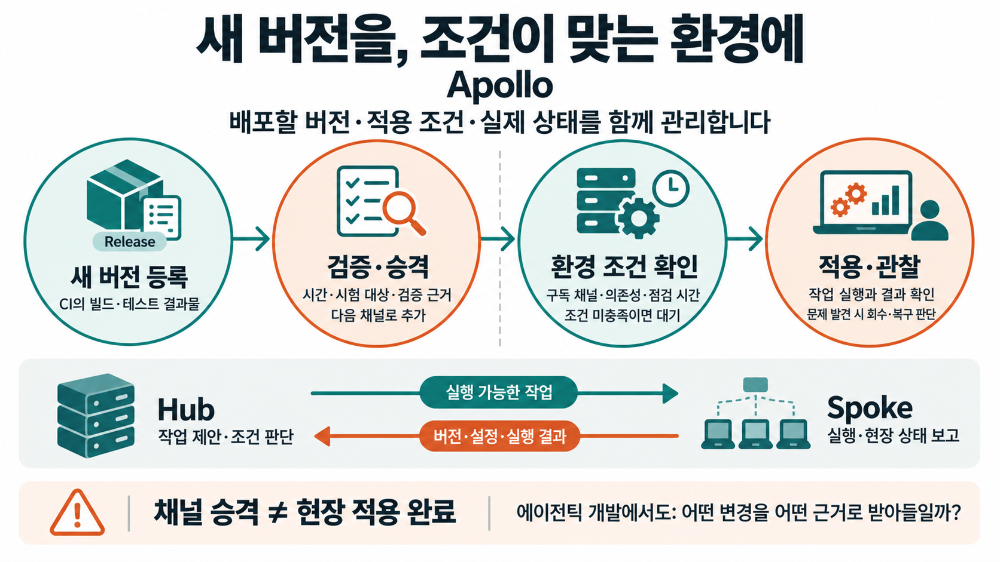
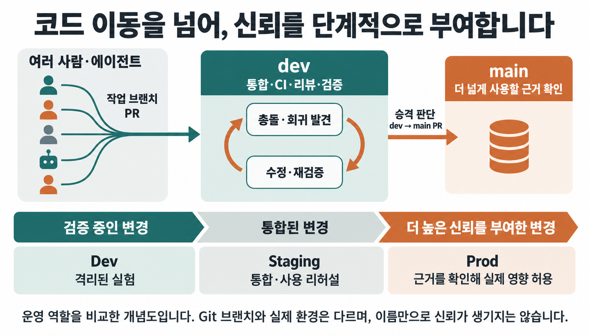
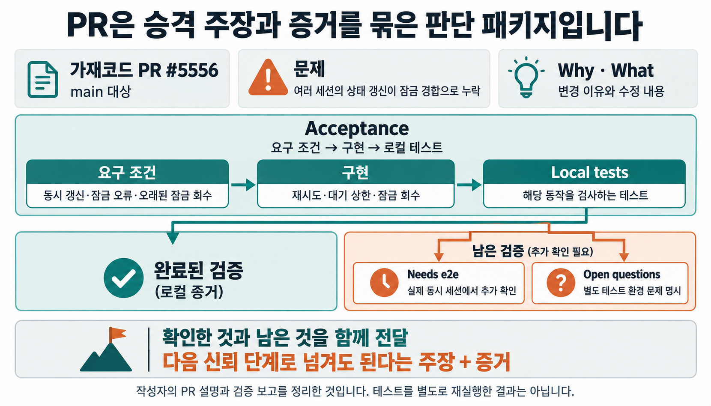
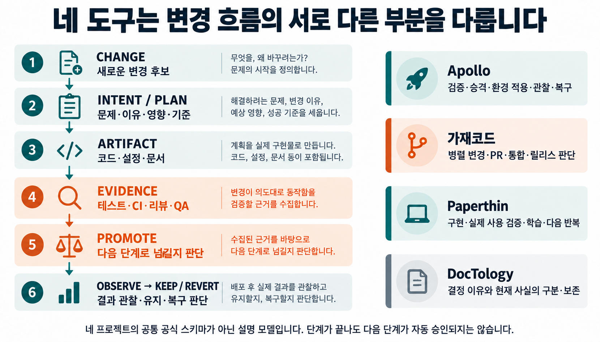

개발팀이 버그를 고쳤고 테스트도 통과했습니다. 그런데 운영팀은 왜 모든 현장에 바로 배포하지 않을까요?

여러 공장에서 같은 검사 서비스를 쓴다고 가정해 보겠습니다. 검사 결과가 누락됐는데도 정상으로 처리하는 오류를 발견해 수정했습니다. 시험 환경에서는 잘 동작합니다. 하지만 생산 중인 공장과 점검 중인 공장, 함께 쓰는 다른 서비스의 버전이 다른 공장에 모두 같은 순간 적용해도 될지는 아직 확인하지 않았습니다.

**팔란티어 Apollo는 여러 환경의 소프트웨어 버전과 설정을 관리하고, 조건이 맞는 대상에 변경을 적용하도록 조율하는 배포·운영 플랫폼입니다.** 어떤 버전이 준비됐는지, 어디에 적용할 수 있는지, 실제로 어떻게 끝났는지를 연결해 다룹니다. 빌드가 끝나도, 어디에 언제 적용할지 판단하는 일은 남습니다. [Apollo 공식 개요](https://www.palantir.com/docs/apollo/core/overview)

> [!summary] 변경의 영향력을 단계적으로 허가한다는 것
> Apollo는 변경을 시험하고, 조건을 확인해 적용하며, 결과를 관찰하고 복구합니다. 이 운영 원리는 가재코드의 `dev`·PR, Paperthin의 검증과 학습, DocTology의 현재 사실 관리에서도 다시 읽힙니다. 공통점은 브랜치나 도구의 이름보다, 판단의 영향 범위를 격리하고 증거를 쌓아 다음 신뢰 단계로 넘기는 구조에 있습니다.

## 1. Apollo가 맡는 일은 빌드 다음부터 분명해집니다

CI는 변경된 코드를 빌드하고 자동 테스트를 실행해 배포할 결과물을 준비합니다. Apollo는 CI에서 릴리스를 등록받아 관리할 수 있습니다. 이미지를 만들었다는 사실과 현장의 설치본이 바뀌었다는 사실은 서로 다릅니다. [CI에서 Apollo로 릴리스 등록](https://www.palantir.com/docs/apollo/core/ci-publish-setup)

검사 서비스의 오류가 고쳐졌다는 테스트 결과를 개발자가 제출했다고 해보겠습니다. 운영자는 여기서 몇 가지를 더 확인합니다. 해당 공장의 다른 서비스와 호환되는가? 지금 변경해도 되는 시간인가? 먼저 시험한 대상에서는 문제가 없었는가? 수정본이 잘 동작하는지와 그 공장에 지금 적용해도 되는지는 함께 확인해야 합니다.

Apollo는 배포할 소프트웨어와 설치된 대상을 구분하는 이름을 둡니다. Product는 배포할 소프트웨어, Release는 그 특정 버전입니다. 개별 관리 대상은 Entity, 같은 기반 시설에서 실행되는 대상의 묶음은 Environment입니다. [Product와 Release](https://www.palantir.com/docs/apollo/core/products-releases-versions), [Environment](https://www.palantir.com/docs/apollo/core/environments)


가상 사례에서 Product는 검사 서비스, Release는 결과 누락 오류를 고친 버전입니다. A공장에 설치된 관리 대상이 Entity이고, 그 대상이 속한 실행 환경이 Environment입니다. 이렇게 나누면 어느 버전의 문제인지와 어느 설치본의 문제인지를 구별할 수 있습니다.

## 2. Foundry의 업무를 계속 운영하려면

Foundry는 여러 곳의 데이터를 연결하고 가공해 분석과 업무 애플리케이션에 사용하는 플랫폼입니다. 그 안의 Ontology는 데이터와 실제 업무 대상을 연결합니다. 공장·제품·주문 같은 객체, 그 속성과 관계, 허용된 동작을 함께 표현합니다. [Foundry 개요](https://www.palantir.com/docs/foundry/platform-overview/overview), [Ontology 개요](https://www.palantir.com/docs/foundry/ontology/overview)

검사 결과를 제품과 주문에 연결하면 담당자는 어느 주문의 출하를 보류해야 하는지 살필 수 있습니다. 그 결과에 따라 허용된 Action으로 업무 상태를 바꾸는 애플리케이션도 구성할 수 있습니다. 화면에서 확인한 데이터를 실제 업무의 판단과 행동에 사용합니다. 이 출하 업무는 기능을 설명하기 위한 가상 설계입니다. [Action의 역할](https://www.palantir.com/docs/foundry/action-types/overview)

업무를 계속 운영하다 보면 그 판단을 수행하는 프로그램도 바뀝니다. 검사 결과 누락을 처리하는 방식을 고치거나, 새로운 설비와 연결하거나, 서비스의 버전을 올려야 합니다. 오늘 제품의 출하 상태를 변경하는 일과 내일부터 사용할 검사 소프트웨어를 변경하는 일이 같은 현장에서 함께 일어납니다.


Foundry에서 업무의 판단과 행동을 연결했다면, 그 업무를 떠받치는 소프트웨어가 바뀔 때도 무엇을 확인해야 할까요? 제가 Apollo와의 연결에서 주목한 대목입니다. 어떤 대상을 어떤 조건에서 바꾸고, 결과가 어땠는지까지 관리해야 합니다. 이는 두 제품의 역할을 바탕으로 한 해석입니다. Foundry의 모든 Action이 Apollo의 승격 절차를 거친다는 실행 구조는 아닙니다.

Apollo를 이해하려면 파일이 전달된 뒤의 현장까지 봐야 합니다. 어떤 소프트웨어가 실행되고 있는지, 무엇을 확인해야 바꿀 수 있는지, 바꾼 뒤 실제 상태는 어떤지가 이어집니다.

## 3. Hub는 판단하고 Spoke는 실행과 상태를 보고합니다

Apollo의 Hub는 변경을 조율하는 환경입니다. 관리 대상 환경인 Spoke에서는 실행 에이전트가 현장 상태를 보고하고 작업을 수행합니다. Hub 안의 조율 엔진은 사용 가능한 릴리스, 환경 설정, 보고된 상태와 제약조건을 고려해 작업을 제안합니다. [Hub와 Spoke의 구조](https://www.palantir.com/docs/apollo/core/overview)

Release Channel은 릴리스를 묶는 경로입니다. 관리 대상이 어떤 채널을 구독하는지에 따라 사용할 수 있는 릴리스가 달라집니다. 이를 품질 등급 하나로만 읽으면 안 됩니다. 기본 채널의 분류 규칙과 별도로 구성하는 승격 경로가 있으며, 다음 절에서 구분합니다. [Release Channels](https://www.palantir.com/docs/apollo/core/release-channels)

Plan은 실제로 수행할 작업이고 Constraints는 그 작업의 선행조건입니다. 새 버전을 적용하는 작업을 제안했더라도 의존성이나 변경 가능 시간 같은 조건을 충족하지 못하면 바로 실행할 수 없습니다. Spoke의 에이전트가 Plan을 조회하면 관련 조건을 통과한 작업이 전달됩니다. [Plan과 제약조건](https://www.palantir.com/docs/apollo/core/plans-and-constraints)


현장에서는 실행 중인 버전과 설정, 생존·준비 상태 등이 Reported State로 돌아옵니다. Hub는 명령을 보냈다는 기록뿐 아니라 현장이 보고한 상태를 다음 판단에 사용합니다. 현재 공식 문서는 Apollo를 하나의 고정 목표 버전으로 무조건 수렴시키는 방식이 아니라, 설정된 제약을 만족하는 Plan을 제안하는 방식으로 설명합니다. [상태 보고와 작업 실행](https://www.palantir.com/docs/apollo/core/how-apollo-works)

여기서 실행 에이전트는 코드를 작성하는 LLM 에이전트와 역할이 다릅니다. 공장 사례에서는 새 버전의 적용 작업을 수행하고 그 결과를 보고하는 쪽입니다. 운영자는 실행이 끝난 것과 조건을 기다리는 것을 구분할 수 있어야 합니다.

## 4. 수정 버전 하나가 현장에 도착하기까지

검사 서비스의 오류 수정본이 준비됐다고 해보겠습니다. 먼저 CI에서 만든 결과물과 버전 정보를 Apollo에 Release로 등록합니다. 이후 어떤 릴리스를 시험하고 어느 채널로 넘길지, 각 설치본에 언제 적용할지를 설정합니다.

이때 이름 때문에 생기기 쉬운 오해가 있습니다. Apollo의 기본 채널 `DEV`, `RELEASE_CANDIDATE`, `RELEASE`는 반드시 하나씩 통과해야 하는 승인 단계가 아닙니다. 버전 형식에 따라 자동 분류되는 채널입니다. 정식 Release 형식은 세 기본 채널에, 후보 형식은 `DEV`와 `RELEASE_CANDIDATE`에, 그 밖의 형식은 `DEV`에 들어갑니다. [기본 채널의 분류](https://www.palantir.com/docs/apollo/core/release-channels)


검증을 거쳐 다음 채널에 릴리스를 추가하는 경로는 승격 파이프라인으로 구성합니다. 공식 문서상 자동 승격 단계의 대상은 사용자 정의 채널입니다. 예를 들어 `DEV → TESTED → PRODUCTION`이라는 경로를 만들 수 있습니다. 여기서 뒤의 두 이름은 설명용 사용자 정의 채널이며, 제품이 강제하는 이름이 아닙니다. [승격 파이프라인 설정](https://www.palantir.com/docs/apollo/managing-release-channels/configure-promotion-pipeline)

승격을 평가하는 방식도 선택합니다. Timed 방식은 정한 시간과 라벨 조건 등을 평가합니다. Canary 방식은 선택한 시험 대상을 관찰해 조건을 확인합니다. 사람이 검증한 뒤 권한에 따라 수동 승격하는 경로도 있습니다. 이 세 가지를 반드시 차례로 수행하는 것은 아닙니다. [승격 조건](https://www.palantir.com/docs/apollo/managing-release-channels/configure-promotion-pipeline), [수동 승격](https://www.palantir.com/docs/apollo/managing-release-channels/manual-promotion)

가상 사례에서는 시험 환경에서 수정본을 실행하고 결과 누락이 의도대로 처리되는지 확인할 수 있습니다. 정한 조건을 통과한 릴리스를 다음 채널로 넘기고, 더 넓은 대상에서 사용할 후보로 삼습니다. 이것이 새 버전을 등록하는 일과 승격을 구분하는 이유입니다.


**최종 채널에 들어갔다고 모든 환경의 적용이 끝나는 것은 아닙니다.** 그 채널을 구독하는 설치본에도 각자의 실행 제약이 있습니다. 생산 중인 A공장은 점검 시간까지 기다리고, 조건을 만족한 B공장은 먼저 적용할 수 있습니다. 두 공장의 버전이 잠시 다르다는 사실만으로 배포 실패라고 단정할 수 없습니다.

운영자는 ‘아직 새 버전이 아니다’라는 화면에서 원인을 나눠 봐야 합니다. 릴리스가 다음 채널로 넘어가지 못했을 수도, 채널에는 들어갔지만 현장의 조건을 기다릴 수도, 실행하다 실패했을 수도 있습니다. 기다리는 곳이 다르면 확인할 근거도 달라집니다.

## 5. 적용 뒤에는 무엇을 관찰하고 어디까지 되돌릴 것인가

시험 대상이 살아 있다는 신호와 업무가 올바르게 처리된다는 증거는 다릅니다. 서비스가 응답하더라도 누락된 검사 결과를 잘못 분류할 수 있습니다. 어떤 신호를 관찰하도록 구성했는지가 검증의 범위를 결정합니다.

Health의 유무도 살펴야 합니다. Health는 대상이 제공하는 건강 상태 평가 신호입니다. 이를 제공하지 않는 Entity의 해당 승격 평가는 생존 상태와 시간에 의존합니다. 그 Health 평가로는 실패를 판정할 수 없습니다. 그러므로 통과한 상태만 보고 업무의 정확성까지 확인됐다고 읽어서는 안 됩니다. [Health 부재의 평가 한계](https://www.palantir.com/docs/apollo/managing-release-channels/configure-promotion-pipeline)


문제를 발견한 뒤에도 대응을 구분합니다. Recall은 정한 전략에 따라 문제가 있는 소프트웨어 릴리스에서 대상을 벗어나게 하는 기능입니다. 언제나 직전 버전으로 복원한다는 뜻은 아닙니다. Plan 실행이 실패했고 환경에 실행 전과 다른 상태가 남았다면, Apollo는 이전 상태로 복원하기 위한 rollback Plan을 발행합니다. [Recall](https://www.palantir.com/docs/apollo/recalling-releases/overview), [실행 실패와 복구](https://www.palantir.com/docs/apollo/core/how-apollo-works)

가령 검사 서비스의 수정본이 다른 오류를 일으켜 문제 버전에서 벗어났다고 해보겠습니다. 이미 잘못 처리한 출하 판단은 여전히 남을 수 있습니다. 프로그램의 복구와 해당 판단의 재검토는 담당자와 절차를 따로 정해야 합니다. 소프트웨어를 정상 상태로 돌렸다는 기록이 업무상의 후속 조치 완료를 대신할 수는 없습니다.


Apollo는 버전을 전달한 뒤에도 현장과 연결돼 있습니다. **어떤 변경을 어느 대상에 적용할 수 있는지 판단하고, 실제 결과를 돌려받으며, 문제가 생기면 대응할 경계를 남깁니다.** 이를 유지하려면 시험 환경, 관찰 신호, 적용 제약과 복구 절차를 운영하는 비용도 필요합니다. 환경이 적고 쉽게 되돌릴 수 있는 작업에 같은 규모의 체계를 그대로 도입할 필요는 없습니다.

## 6. Dev·Staging·Prod를 신뢰의 단계로 읽으면

같은 수정본이라도 Dev에서 실행할 때와 Prod에 적용할 때 책임져야 할 범위는 다릅니다. 여기서 Dev·Staging·Prod는 시험·리허설·실제 운영이라는 환경의 역할을 가리킵니다. 앞서 본 Apollo의 기본 릴리스 채널 `DEV`, `RELEASE_CANDIDATE`, `RELEASE`와는 다른 구분입니다.

개발 환경을 따로 두는 이유는 마음껏 실험할 수 있는 범위를 만들기 위해서입니다. 수정이 틀렸더라도 실제 출하 판단을 바로 바꾸지 않도록 합니다. Staging에서는 다른 서비스와 합친 상태로 실제 사용을 리허설합니다. Prod에서는 실제 업무가 그 결과를 사용하므로, 적용의 근거와 관찰·복구 준비가 더 중요해집니다.

| 설명용 환경 역할 | 판단이 영향을 미쳐도 되는 범위                        | 다음 단계에서 더 확인할 것                        |
| ---------------- | ----------------------------------------------------- | ------------------------------------------------- |
| Dev              | 격리된 실험 안에서 자유롭게 틀리고 고칠 수 있는 범위  | 의도한 수정이 동작하는가                          |
| Staging          | 실제 사용자에게 영향을 주기 전에 통합·리허설하는 범위 | 함께 작동하는가, 실제 사용에서 무엇이 실패하는가  |
| Prod             | 근거를 확인한 뒤 실제 업무에 영향을 허용한 범위       | 적용 후 이상을 관찰하고 멈추거나 복구할 수 있는가 |

**격리하는 것은 서버만이 아니라 판단의 영향 범위입니다.** 검사 서비스의 오류를 고쳤다고 해도, 개발 환경에서 확인한 것과 실제 공장의 업무에 적용하며 책임질 것은 다릅니다.

Dev에서 Staging으로 넘길 때는 통합해 검증할 준비가 됐는지를 묻습니다. Staging에서 Prod로 넘길 때는 실제 업무가 이 변경을 받아들여도 되는지, 이상이 생기면 어떻게 대응할지를 묻습니다. 두 판단의 무게가 다릅니다. 같은 검사를 형식적으로 두 번 실행한다고 두 단계가 생기는 것은 아닙니다.

승격을 **아직 검증 중인 변경 → 통합된 변경 → 더 높은 신뢰를 부여한 변경**으로 읽을 수 있는 이유입니다. 신뢰가 높아진다는 말은 오류가 없다는 인증이나 자동 점수를 뜻하지 않습니다. 확인한 근거에 따라 그 변경을 사용할 수 있는 범위와 조건을 넓힌다는 뜻입니다. 새로운 실패가 드러나면 그 허용을 보류하거나 거둬들일 수도 있습니다.

배포를 설계할 때 속도와 함께 되돌릴 수 있는 범위를 보는 이유도 여기에 있습니다. 서로 다른 판단 변화를 한 번에 많이 섞으면 무엇이 문제를 일으켰고 어디까지 되돌려야 하는지 가리기 어려워질 수 있습니다. Staging은 테스트 성공 도장을 모으는 곳으로 끝나지 않고, 실제 사용에서 생길 문제를 미리 찾는 리허설이 되어야 합니다. 이것은 Apollo의 승격·제약·관찰·복구 기능을 운영 원리로 읽은 해석입니다.

## 7. 가재코드의 dev에서 같은 구조를 발견했습니다

Apollo를 이해하고 나니 최근 에이전틱 개발 저장소에서 본 장면이 다르게 보였습니다. [가재코드(gajae-code)](https://github.com/Yeachan-Heo/gajae-code)는 저장소에서 코딩 에이전트를 운용하는 개발 도구입니다. 기본 브랜치는 `main`이고 별도의 `dev`가 있습니다. 확인한 시점에는 서로 다른 작업 브랜치에서 `dev`를 대상으로 한 PR들이 열려 있었고, `main` 대상 PR도 별도로 있었습니다. [dev 대상 PR 목록](https://github.com/Yeachan-Heo/gajae-code/pulls?q=is%3Apr+base%3Adev), [main 대상 PR 목록](https://github.com/Yeachan-Heo/gajae-code/pulls?q=is%3Apr+base%3Amain)

기여 지침은 일반 PR을 `dev`로 보내고, `main`은 관리자가 지시하는 릴리스 흐름에 남기도록 정합니다. 이 정책과 PR들의 검증 기록을 함께 보면, 개별 변경을 모으는 일과 릴리스 쪽에서 받아들이는 일을 나눠 생각하는 구조가 보입니다. [브랜치 정책](https://github.com/Yeachan-Heo/gajae-code/blob/9da99cdd708ce3b97d64111d8eefc98a7e0921ee/CONTRIBUTING.md)

`feature → dev → main`이라는 모양만 같았다면 익숙한 브랜치 전략과 닮았다는 이야기로 끝났을 것입니다. 제가 흥미롭게 느낀 것은 그 사이에서 검토하는 내용이었습니다. 변경의 이유를 설명하고, 합친 결과를 검사하고, 실패하면 수정한 뒤 다시 검증합니다. 그 과정을 거친 변경에 다음 단계에서 사용할 신뢰를 부여한다고 읽을 수 있습니다.

이를 운영 역할별로 대응시키면 다음과 같습니다. 표의 Dev·Staging·Prod는 앞 절의 설명용 환경 역할입니다.

| Apollo를 읽으며 얻은 운영 개념 | 에이전틱 GitHub 개발에서 대응시켜 볼 것        |
| ------------------------------ | ---------------------------------------------- |
| Dev의 격리된 실험              | 개별 개발자·에이전트의 작업 브랜치             |
| 변경 단위                      | commit·PR에 담긴 변경                          |
| 변경 이유                      | PR의 Problem·Why                               |
| Staging의 통합 리허설          | `dev`에 모인 변경의 통합 검증                  |
| 검증 근거                      | CI·테스트·에이전트 리뷰·사람 리뷰              |
| 문제 발견과 수리               | PR 수정·추가 커밋·재검증                       |
| 승인 조건                      | 리뷰와 병합 조건                               |
| Prod로의 승격 판단             | 릴리스 흐름에서 `dev → main`을 받아들이는 판단 |
| 소프트웨어 복구                | revert·이전 버전 재배포 등                     |
| 감사·추적 기록                 | PR·커밋·CI 결과·리뷰의 연결                    |

Git 브랜치는 코드 revision을 가리키고 Apollo 환경은 실제 실행 상태와 제약을 다룹니다. 그래서 이 표는 기능의 일대일 대응표가 아닙니다. 모든 PR이 이 경로를 반드시 거친다거나 `main` 병합이 현장 배포를 완료한다는 뜻도 아닙니다. 비교하는 대상은 **변경을 격리하고, 근거를 확인하며, 다음 단계의 사용을 허가하는 운영 구조**입니다.

## 8. 에이전트가 많아지면 승격 판단이 더 중요해집니다

여러 에이전트가 동시에 검사 서비스의 코드, 화면, 문서, 의존성을 고친다고 가정해 보겠습니다. 각각의 작업은 빨리 끝날 수 있습니다. 하지만 각 브랜치에서 통과한 검사가 그 변경들을 합친 상태까지 확인해 주지는 않습니다. 한 수정이 다른 수정의 전제를 깨거나, 따로는 보이지 않던 회귀가 통합 뒤 드러날 수 있습니다.

개발자는 누가 코드를 작성할지에 더해 **많이 만들어지는 변경 중 무엇을 신뢰할 수 있는 상태로 승격시킬지**를 판단해야 합니다. 구현을 만드는 시간과 비용이 줄어드는 상황에서도 검증과 통합의 책임은 남습니다. 변경 생성 속도가 검토와 통합 속도를 앞서면, 병목은 검증·선별·승격 쪽으로 이동할 수 있습니다.

이때 `dev`에서 여러 작업을 합쳐 CI와 리뷰를 수행할 수 있습니다. 충돌이나 회귀를 찾으면 에이전트가 다시 수정하고 검사합니다. 릴리스 쪽으로 넘기기 전에 함께 시험하고 고치는 자리가 생기는 셈입니다.

```text
여러 사람·에이전트의 작업 브랜치
                  ↓
                 PR
                  ↓
                 dev
          통합·CI·리뷰·검증
                  ↕
          문제 발견·수정·재검증
                  ↓
       dev → main PR과 승격 판단
                  ↓
                main
```

위 흐름은 가재코드에서 확인한 브랜치 정책과 PR 기록을 운영 개념으로 정리한 예시입니다. `main`이라는 이름이 신뢰를 만드는 것은 아닙니다. 그 단계에서 더 넓게 사용할 근거를 실제로 확인해야 더 강한 신뢰 경계라고 부를 수 있습니다.



Apollo가 여러 버전과 환경에 변경을 전달할 때도, 준비된 버전을 곧바로 모든 대상에 적용하는 것만으로는 충분하지 않습니다. 에이전틱 개발에서 변경이 빠르게 늘어날 때도 생성 직후 `main`에 넣는 흐름만으로는 통합 판단을 담기 어렵습니다. 대상의 크기는 달라도 다음과 같은 중간 상태가 필요해지는 이유가 닮았습니다.

```text
생성 → 격리 → 통합 → 검증 → 승격 → 관찰 → 문제 발생 시 복구
```

이 연결은 실제 변경량이나 생산성을 측정한 결과가 아니라, 병렬 변경이 늘어날 때 예상되는 운영 문제를 설명하는 관점입니다. 그럼에도 무엇을 시험할지, 어디에서 실패를 발견할지, 어떤 근거로 다음 단계에 넘길지는 지금의 작업에 바로 적용할 수 있는 질문입니다.

## 9. PR은 다음 신뢰 단계로 넘길 판단 패키지가 됩니다

제가 더 흥미롭게 읽은 것은 PR 안에 담긴 설명이었습니다. `dev` 대상 [PR #5566](https://github.com/Yeachan-Heo/gajae-code/pull/5566)은 PDF 안의 압축 데이터를 텍스트로 읽어 검사기가 잘못된 단어를 탐지한 문제를 다룹니다. 설명은 `Problem → Why it appeared only now → Fix → Verification`으로 이어지고, 검증 안에 `Red control`을 남깁니다.

| PR 5566번의 설명         | 다음 단계로 넘길지 판단하는 근거                                   |
| ------------------------ | ------------------------------------------------------------------ |
| Problem                  | 어떤 실패를 해결하려는가                                           |
| Why it appeared only now | PDF가 들어온 때에는 관련 검사가 실행되지 않아 왜 나중에 드러났는가 |
| Fix                      | 바이너리를 검사에서 제외해 원인을 어떻게 다뤘는가                  |
| Verification             | 수정 뒤 무엇이 통과했고 실제 텍스트 탐지는 유지되는가              |
| Red control              | 수정을 되돌리면 같은 바이너리 사례가 다시 실패하는가               |

마지막 항목에서는 ‘테스트가 통과했다’에서 한 걸음 더 나아갑니다. 작성자는 수정한 검사 파일만 되돌리면 같은 사례가 다시 실패한다고 보고했습니다. 통과 결과와 함께, 이번 수정이 관찰된 실패를 다뤘다는 근거를 제시합니다.


`main` 대상 [PR #5556](https://github.com/Yeachan-Heo/gajae-code/pull/5556)도 살펴볼 만합니다. 여러 세션이 같은 상태 파일을 갱신할 때 잠금 경합으로 상태 갱신이 누락되는 문제를 다룹니다. `Why`, `What`, `Local tests`, `Acceptance`, `Needs e2e`, `Open questions`가 함께 있습니다.

`Acceptance` 표는 요구 조건을 구현과 로컬 테스트에 대응시킵니다. 여러 작성자의 상태가 저장돼야 한다는 요구, 병렬 세션의 잠금 오류를 다루는 구현, 종료된 프로세스가 남긴 잠금을 회수하는 테스트가 서로 연결됩니다. 동시에 실제 동시 세션으로 더 확인할 항목과 기존 테스트 환경의 별도 문제를 남깁니다. 로컬 검사가 끝났다는 사실로 아직 남은 확인을 덮지 않는 구성입니다.



두 PR에는 무엇을 바꿨는지와 함께, 왜 다음 단계로 넘길 만한지가 담겨 있습니다. PR이 **이 변경을 다음 신뢰 단계로 넘겨도 된다는 주장과 그 주장을 뒷받침하는 증거를 묶은 판단 패키지**에 가까워지는 대목입니다. 이 주장은 승인 완료 선언이 아니라 검토할 제안입니다. 남은 E2E를 보고 승격을 보류하거나 허용할 범위를 제한할 수도 있습니다. ‘판단 패키지’는 저장소의 공식 용어가 아니라 이 기록 방식을 읽는 제 표현입니다.

미완료 E2E와 열린 질문도 패키지의 중요한 일부입니다. 검토자는 무엇을 믿을 수 있는지뿐 아니라 어디부터는 아직 확인하지 않았는지를 알아야 합니다. 두 PR의 검증 결과는 작성자의 보고를 읽은 것이며, 제가 테스트를 별도로 재실행하거나 전체 저장소의 승인 강제를 감사한 것은 아닙니다.

## 10. Paperthin은 구현을 버려도 학습을 남깁니다

실패한 코드를 고치거나 새로 만들었을 때, 이번에 배운 검증 기준도 다음 작업에 전달될까요? 그렇지 않으면 다른 에이전트가 같은 문제를 다시 만들 수 있습니다.

Paperthin은 에이전트 작업과 반복 개선을 돕는 스킬 모음입니다. 그중 [`re0-loop`](https://github.com/LilMGenius/paperthin/blob/6f706e30b5ec55e87598bf3b59164c9d9d96222f/skills/coil/re0-loop/SKILL.md)는 진행을 파일 수나 기능 수로 평가하지 않습니다. 실제 브라우저·API 같은 사용 경로에서 결과를 확인하고, 교훈·실패 패턴·다음 검증 기준을 남깁니다. 품질 기준을 통과한 템플릿과 재사용할 모듈, 다음 반복에서 제거된 실패 패턴을 진전으로 봅니다.

잘못된 구현을 버려도 배운 것까지 사라질 필요는 없습니다. 무엇이 실패했고 다음에는 무엇을 확인해야 하는지 남겨두면, 코드를 다시 만들 때도 그 학습을 이어갈 수 있습니다. 앞의 검사기 사례라면 바이너리에서 생긴 오탐을 막는 동시에 실제 텍스트 탐지는 계속 확인해야 한다는 기준이 그다음 작업에 남습니다.

[`re0-git`](https://github.com/LilMGenius/paperthin/blob/6f706e30b5ec55e87598bf3b59164c9d9d96222f/skills/depth/re0-git/SKILL.md)은 커밋 메시지라는 더 작은 자리에서 비슷한 문제를 다룹니다. 목표는 새 세션이 diff를 열지 않고 `git log`만 읽어도 작업을 이어갈 수 있도록, 이미 만든 커밋의 메시지를 정리하는 것입니다.

이 스킬은 설명을 무조건 늘리지 않습니다. 주변 로그와 작성자의 문체를 살피고, 오래 남길 인계 사실을 추립니다. 코드 트리는 그대로 유지하면서 메시지를 정리하며, 로그만 다시 읽었을 때 필요한 설명을 잘못 잘라냈으면 되살립니다.

앞의 검사기 변경을 설명하는 커밋 메시지를 쓴다면 다음처럼 남길 수 있습니다. 실제 PR의 커밋 메시지를 인용한 것이 아닌 **집필용 예시**입니다.

```text
바이너리 파일을 단어 검사에서 제외

- PDF 압축 데이터를 텍스트로 읽어 생긴 오탐을 제거하고 실제 텍스트 탐지는 유지한다.
```

이 문장에는 변경의 이유, 수정한 동작, 계속 지켜야 하는 경계가 함께 있습니다. 다음 에이전트가 검사 범위를 바꿀 때 과거 판단의 맥락을 찾을 단서가 됩니다. 메시지 자체가 코드의 정확성을 증명하지는 않지만, 무엇을 이해하고 다시 확인해야 하는지 이어줍니다.


Apollo의 승격이 운영에 적용할 릴리스를 다룬다면, Paperthin의 반복은 다음 구현에 남길 결과와 교훈을 다룹니다. `re0-git`은 그 결과가 왜 나왔는지 설명도 함께 넘깁니다. 무엇을 검증했고 다음 작업에는 무엇을 가져갈지 판단한다는 점에서 이어집니다.

## 11. DocTology는 결정과 현재 사실이 섞이지 않게 합니다

승격과 검증 기록도 시간이 지나면 현재 구현과 어긋날 수 있습니다. 바꾸기로 결정했지만 구현 중일 수도 있고, 한 번 검증한 코드가 후속 수정으로 달라졌을 수도 있습니다. 이전 설명을 그대로 믿으면 다음 에이전트는 시작부터 다른 상태를 전제하게 됩니다.

```text
결정했다          ≠ 구현했다
구현했다          ≠ 검증했다
검증했다          ≠ 지금도 유효하다
문서에 적혀 있다  ≠ 현재의 사실이다
```

제가 만든 DocTology의 Repo Docs 계약은 결정 상태와 구현 상태, 현재의 기준 자료와 파생 기록을 구분합니다. 왜 그렇게 결정했는지 보존하면서도, 계획이나 위키가 현재 코드의 사실을 대신하지 않도록 합니다. [문서 권위 계약](https://github.com/tteggu87/DocTology/blob/main/.agents/skills/repo-docs-intelligence-bootstrap/SKILL.md)

자료마다 설명이 다를 때는 무엇을 먼저 믿어야 할까요? 현재 동작은 코드·등록점·테스트에서, 현재 구조와 결정은 정본 문서와 채택된 ADR에서 확인합니다. 운영 계약, 계획·근거·리뷰 기록, 파생 위키와 검색 색인은 각자의 역할을 맡습니다. 아래 화살표는 작업의 실행 순서가 아니라 서로 충돌할 때 확인할 기준의 순서를 나타냅니다.

```text
현재 코드·등록점·테스트
  → 정본 문서·채택된 ADR
  → 운영 계약
  → 계획·검증 근거·리뷰
  → 파생 위키
  → 파생 검색 색인
```


같은 이유로 승인과 검증은 어떤 코드와 범위를 확인한 것인지 연결돼야 합니다. 예전 승인이 있다는 사실만으로 새 구현도 확인됐다고 추정할 수는 없습니다. DocTology는 이 구분을 다음 세션에서도 잃지 않도록 보존하는 사례로 읽힙니다.

## 12. 네 도구를 하나의 변경 흐름 위에 놓아보면

온톨로지는 다루는 대상과 그 속성·관계를 명시하는 모델입니다. 변경을 하나의 대상으로 놓으면 코드, 문서, 승인, 테스트를 서로 떨어진 파일로만 보지 않고 같은 변경을 설명하는 기록으로 연결할 수 있습니다.

```text
CHANGE          새로운 변경 후보
   ↓
INTENT / PLAN   왜 필요한가: 문제·이유·영향·기준
   ↓
ARTIFACT        구현물: 코드·설정·문서
   ↓
EVIDENCE        확인한 근거: 테스트·CI·리뷰·QA
   ↓
PROMOTE         다음 단계로 넘길지 판단
   ↓
OBSERVE         실제 결과 관찰
   ↓
KEEP / REVERT   유지하거나 복구·후속 조치 판단
```

화살표마다 확인할 조건이 있으며, 앞 단계가 끝나면 자동으로 다음 단계가 승인되는 것은 아닙니다. 문제가 생기면 수정과 재검증으로 돌아갑니다. 이 흐름은 네 프로젝트가 공유하는 공식 스키마가 아니라, 비교에서 얻은 설명 모델입니다. 여기의 `INTENT / PLAN`은 변경의 목적과 계획이라는 넓은 뜻이며, Apollo의 실행 작업인 Plan과 같은 객체를 뜻하지 않습니다.



| 같은 흐름에서 볼 역할  | 두드러지는 부분                                           |
| ---------------------- | --------------------------------------------------------- |
| Apollo                 | 검증·승격·환경 적용·관찰·복구                             |
| 가재코드의 GitHub 작업 | 다수의 병렬 변경·PR·통합·검증·릴리스 판단                 |
| Paperthin              | 의도·구현·실제 사용 검증·학습·다음 반복, 커밋의 의미 인계 |
| DocTology              | 결정 이유와 현재 사실을 구분해 다음 세션에도 보존         |

GitHub를 잘 쓰는 방식도 이 관계를 만드는 일과 맞닿아 있습니다. 이슈는 해결할 문제를, PR은 변경 이유와 받아들일 근거를, 커밋은 그 판단에 해당하는 구현을 가리킵니다. CI·리뷰·릴리스 기록은 확인한 결과와 적용 상태를 이어줍니다. **같은 변경의 의도·구현·증거·상태를 잃지 않도록 연결하는 일**입니다.

`re0-git`의 메시지가 작은 온톨로지처럼 느껴진 것도 이 때문입니다. 짧은 문장 안에 문제와 수정한 동작, 유지해야 할 경계가 함께 남습니다. 자연어 메시지 자체가 기계적으로 검증되는 온톨로지이거나 배포 제어를 제공하는 것은 아닙니다. 변경의 의미와 관계를 보존하는 온톨로지적인 기록 방식이라는 해석입니다.

별도 그래프 데이터베이스부터 만들 필요는 없습니다. PR·커밋·검증 결과·현재 상태의 링크를 정확히 유지하는 것으로도 이 관점을 시작할 수 있습니다. 다음 사람이 그 링크를 따라가며 판단할 수 있어야 기록이 제 역할을 합니다.

## 13. 에이전트 시대의 개발자는 승격 조건도 설계합니다

Apollo를 읽다가 에이전틱 개발이 떠오른 것은 많은 변경을 받아들이는 방식이 닮았기 때문입니다. 실패의 범위를 나누고, 증거를 쌓고, 더 넓은 사용을 허가하는 운영 원리가 다시 보였습니다. 같은 제품을 구현했다는 이야기는 아닙니다. **Apollo에서 보았던 운영 원리가 에이전틱 소프트웨어 개발에서도 재등장하고 있다**고 표현하는 것이 제 생각에 가깝습니다.

코드를 만드는 속도가 빨라질수록 좋은 개발자에게는 그 결과를 다루는 능력도 중요해질 수 있습니다. 어느 격리 공간에서 시험할지, 통합하면 무엇이 달라지는지, 어떤 증거를 요구할지, 언제 더 높은 신뢰 단계로 넘길지 정하는 능력입니다. 구현 능력이 사라진다는 뜻이 아니라, 빠르게 생성되는 변경을 운영하는 판단의 비중이 커질 수 있다는 뜻입니다.

다음 PR 하나에서 확인해 보세요. 변경 이유와 구현, 검증 근거를 연결하고 아직 하지 못한 확인을 남겼는지, 다음 단계에 요구할 조건이 무엇인지 물어보면 됩니다. 그다음에는 적용 결과와 복구·학습까지 이어가 보세요. 변경을 만들 수 있다는 사실과 그 변경에 실제 영향력을 허용할 수 있다는 판단 사이를 설계하는 일입니다.

## 함께 읽기

Apollo의 운영환경과 복구는 [[notes/온톨로지/palantir-apollo-operating-change|팔란티어 Apollo는 운영의 변경을 어떻게 다루는가]]에서, 결정과 현재 사실을 보존하는 구조는 [[notes/llm-wiki/doctology-llm-wiki-anatomy|DocTology의 LLM Wiki 구조]]에서 더 살펴볼 수 있습니다.

## 참고 자료

제품 기능은 Palantir 공식 문서, 브랜치·PR·스킬의 내용은 공개 저장소에 근거합니다. PR의 테스트 결과는 작성자의 보고입니다. 신뢰의 단계, 판단 패키지와 네 도구의 구조적 수렴은 이 근거와 운영 역할을 비교한 해석이며, 생산성이나 안전성의 실측 비교 결과는 아닙니다.

- [Apollo 개요](https://www.palantir.com/docs/apollo/core/overview) · [작동 방식](https://www.palantir.com/docs/apollo/core/how-apollo-works) · [Plan과 제약조건](https://www.palantir.com/docs/apollo/core/plans-and-constraints)
- [Product·Release](https://www.palantir.com/docs/apollo/core/products-releases-versions) · [Environment](https://www.palantir.com/docs/apollo/core/environments) · [CI 등록](https://www.palantir.com/docs/apollo/core/ci-publish-setup)
- [Release Channels](https://www.palantir.com/docs/apollo/core/release-channels) · [승격 파이프라인](https://www.palantir.com/docs/apollo/managing-release-channels/configure-promotion-pipeline) · [수동 승격](https://www.palantir.com/docs/apollo/managing-release-channels/manual-promotion) · [Recall](https://www.palantir.com/docs/apollo/recalling-releases/overview)
- [Foundry](https://www.palantir.com/docs/foundry/platform-overview/overview) · [Ontology](https://www.palantir.com/docs/foundry/ontology/overview) · [Action](https://www.palantir.com/docs/foundry/action-types/overview)
- [가재코드 dev 대상 PR #5566](https://github.com/Yeachan-Heo/gajae-code/pull/5566) · [main 대상 PR #5556](https://github.com/Yeachan-Heo/gajae-code/pull/5556) · [기여 지침 확인 revision](https://github.com/Yeachan-Heo/gajae-code/blob/9da99cdd708ce3b97d64111d8eefc98a7e0921ee/CONTRIBUTING.md)
- [Paperthin re0-loop](https://github.com/LilMGenius/paperthin/blob/6f706e30b5ec55e87598bf3b59164c9d9d96222f/skills/coil/re0-loop/SKILL.md) · [re0-git](https://github.com/LilMGenius/paperthin/blob/6f706e30b5ec55e87598bf3b59164c9d9d96222f/skills/depth/re0-git/SKILL.md)
- [DocTology Repo Docs](https://github.com/tteggu87/DocTology/blob/main/.agents/skills/repo-docs-intelligence-bootstrap/SKILL.md)
