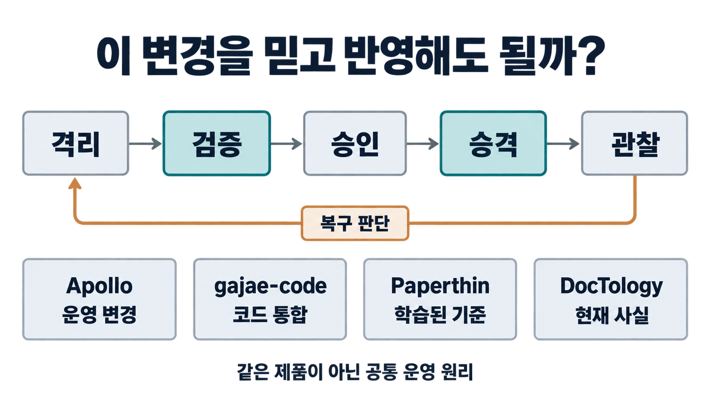
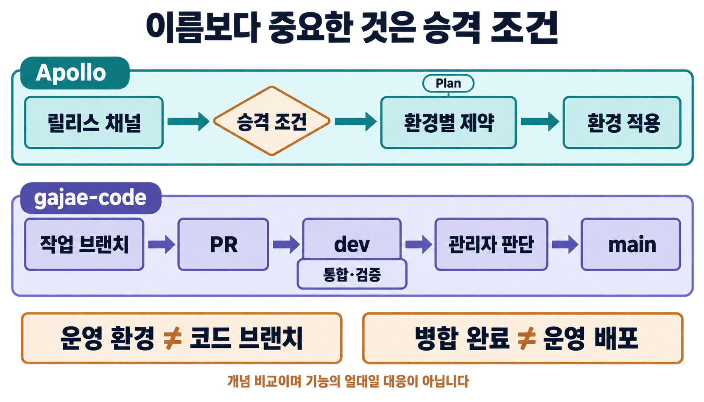
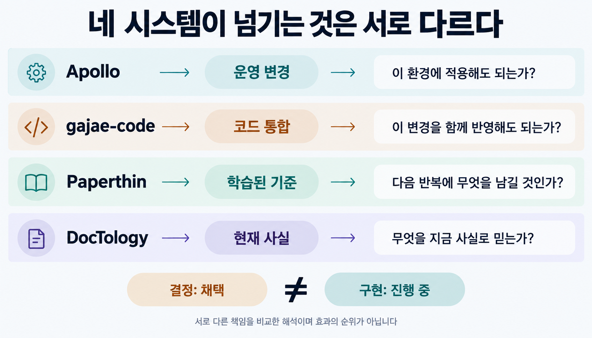
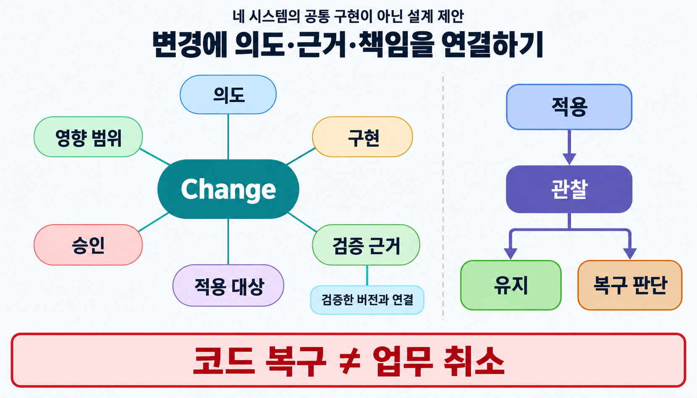

에이전트가 코드를 빨리 고칠수록, 그 변경을 믿고 반영하는 일도 빨라질까요?

가상의 품질검사 서비스에서 출하 판단에 쓰는 불량률 기준을 `2% → 3%`로 바꾼다고 해보겠습니다. 코드에서는 숫자 하나를 수정하면 끝날 수 있습니다. 하지만 업무에서는 어떤 제품을 출하할 수 있는지가 달라집니다. 테스트가 통과했다는 사실만으로 이 정책 변경까지 승인했다고 볼 수는 없습니다.

팔란티어 Apollo를 처음 읽었을 때 익숙하게 느낀 것도 이런 문제였습니다. Apollo는 여러 환경의 소프트웨어 변경을 조율하는 플랫폼입니다. 에이전틱 개발은 사람이 정한 목표에 따라 코딩 에이전트가 구현과 검증에 참여하는 개발 방식입니다. 서로 다른 영역처럼 보이지만, 변경이 실제로 영향을 미치기 전에 무엇을 확인해야 하는지라는 질문에서 만납니다. [Apollo 공식 문서](https://www.palantir.com/docs/apollo/)

> [!summary] 변경을 믿는 조건을 설계하기
> 변경을 만드는 일과 더 큰 영향력을 허용하는 일은 구분해야 합니다. Apollo, gajae-code, Paperthin, DocTology는 같은 시스템이 아니지만, 근거를 확인한 뒤 다음 단계로 넘긴다는 관점으로 함께 읽을 수 있습니다. 코드 생성이 빨라질수록 검증·통합·승격이 병목이 될 수 있다는 것이 여기서 얻은 판단입니다.

## 배포는 변경에 영향력을 허용하는 일입니다

새 버전이 있다는 이유만으로 모든 환경을 곧바로 바꾸지는 않습니다. 운영자는 해당 환경에서 다른 구성 요소와 함께 작동하는지, 변경 가능한 시간인지, 승인 조건을 충족했는지 확인해야 합니다.

Apollo는 이런 판단을 구체적인 제어 단위로 다룹니다. Release Channel은 릴리스를 묶고, 승격 파이프라인은 다음 채널로 옮길 조건을 정합니다. 실제 환경에 적용할 작업은 Plan으로 만들며, 관련 제약조건을 충족해야 실행 에이전트에 전달합니다. 채널에 들어가는 것과 특정 환경에서 실행되는 것도 별개의 판단입니다. [Release Channels](https://www.palantir.com/docs/apollo/core/release-channels), [Plans and Constraints](https://www.palantir.com/docs/apollo/core/plans-and-constraints)

익숙한 개발·검증·운영 구분을 빌리면 이 원리를 다음처럼 읽을 수 있습니다.

| 설명용 단계 | 허용하는 일                     | 다음 단계로 가기 전에 묻는 것             |
| ----------- | ------------------------------- | ----------------------------------------- |
| Dev         | 작은 범위에서 실험하고 실패하기 | 변경의 의도와 구현을 설명할 수 있는가?    |
| Staging     | 다른 변경과 통합해 검증하기     | 실제 적용을 판단할 만큼 근거가 모였는가?  |
| Prod        | 실제 사용자와 업무에 적용하기   | 적용 후 이상을 관찰하고 대응할 수 있는가? |

이 표는 신뢰 경계를 설명하기 위한 해석입니다. Apollo가 환경을 반드시 이 세 이름으로 나누도록 강제한다는 뜻은 아닙니다. 공식 기본 릴리스 채널은 `DEV`, `RELEASE_CANDIDATE`, `RELEASE`이며, 사용자 정의 채널도 지원합니다. 환경과 채널을 같은 개념으로 읽어서도 안 됩니다. [기본 채널과 승격](https://www.palantir.com/docs/apollo/core/release-channels)

앞의 가상 사례로 돌아가면, 숫자를 바꾼 버전의 존재와 그 버전을 출하 판단에 사용해도 된다는 허가는 다른 상태입니다. 환경을 나누는 이유도 서버 수를 늘리기 위해서라기보다, 실패가 미칠 범위와 다음 판단의 근거를 구분하기 위해서라고 볼 수 있습니다.

## 여러 에이전트의 변경은 어디에서 만날까요?

여러 에이전트가 각자 브랜치에서 작업한다고 가정해 보겠습니다. 한 에이전트는 품질 기준을 수정하고, 다른 에이전트는 승인 화면을 바꾸고, 또 다른 에이전트는 관련 문서를 고칩니다. 각각의 작업이 그럴듯해도 서로 합쳤을 때 맞는지는 별도로 확인해야 합니다.

이런 상황에서는 코드를 작성할 사람을 찾는 일뿐 아니라, 무엇을 함께 반영해도 되는지 판단하는 일이 중요해집니다. 코드 생성 비용이 낮아질수록 검증과 통합에 드는 비용이 상대적으로 커질 수 있습니다. 모든 팀에서 이미 병목이 이동했다는 실측 결과가 아니라, 병렬 변경이 늘어날 때 예상할 수 있는 운영상의 문제입니다.

[gajae-code](https://github.com/Yeachan-Heo/gajae-code)의 개발 흐름을 보면서 Apollo가 다시 떠오른 이유도 여기에 있습니다. 공개 기여 지침은 일반 PR의 대상을 `dev`로 정하고, `main`은 관리자가 지시하는 릴리스 흐름에 남겨 둡니다. 변경 내용과 이유, 수행한 테스트도 PR에 기록하도록 요구합니다. 브랜치 이름을 보고 추측한 관행이 아니라 저장소가 명시한 정책입니다. [CONTRIBUTING.md](https://github.com/Yeachan-Heo/gajae-code/blob/main/CONTRIBUTING.md)

```text
여러 사람과 에이전트
        ↓
개별 작업 브랜치 → PR → dev에서 통합·검증
                              ↓
                       수정과 재검증
                              ↓
                    관리자의 릴리스 판단
                              ↓
                            main
```

이 흐름도는 기여와 릴리스의 경계를 줄여 그린 것입니다. 모든 PR이 동일한 검사를 받거나, `main`에 병합되는 즉시 운영 배포가 끝난다는 뜻은 아닙니다.

PR도 diff만 담는 상자보다 넓게 볼 수 있습니다. 왜 바꿨는지, 어디에 영향을 주는지, 어떤 확인을 마쳤고 무엇이 남았는지를 함께 읽으면 **이 변경을 다음 단계로 넘겨도 된다는 주장과 그 근거**가 됩니다. 이 표현은 저장소의 공식 용어가 아니라 제가 그 운영 방식을 읽는 관점입니다.

## 닮은 것은 브랜치 이름보다 승격 조건입니다



_화살표는 공통 원리를 비교하기 위한 것입니다. 두 시스템 사이의 실제 연동이나 완전한 기능 대응을 뜻하지 않습니다._

| 비교할 질문                      | Apollo에서 보는 대상                | 에이전틱 GitHub 개발에서 보는 대상     |
| -------------------------------- | ----------------------------------- | -------------------------------------- |
| 무엇을 바꾸는가?                 | 릴리스, 설정, 환경에 적용할 Plan    | commit과 PR에 담긴 코드·설정·문서      |
| 무엇을 확인하는가?               | 채널 승격 조건과 환경별 실행 제약   | 테스트, CI, 리뷰, 수용 기준            |
| 어디에 영향력을 허용하는가?      | 해당 릴리스를 적용할 운영 환경      | 통합 브랜치, 릴리스 브랜치 또는 릴리스 |
| 어떤 기록을 남기는가?            | Plan 상태와 변경·승격 기록          | PR, commit, CI, 리뷰 기록              |
| 문제가 생기면 어떻게 대응하는가? | 적용 억제, Recall, 조건에 맞는 복구 | 병합 보류, revert, 이전 버전 재배포 등 |

Apollo 쪽의 구체적인 동작은 [Plan과 제약조건](https://www.palantir.com/docs/apollo/core/plans-and-constraints), [변경 요청](https://www.palantir.com/docs/apollo/managing-changes/change-requests), [Release 회수](https://www.palantir.com/docs/apollo/recalling-releases/overview)에 근거합니다. GitHub 쪽은 gajae-code의 명시된 정책과 일반적인 개발 절차를 비교한 것이며, 개별 기능의 동등성을 검증한 표는 아닙니다.

> [!important] 코드 브랜치는 운영 환경이 아닙니다
> Git 브랜치는 코드 revision을 가리킵니다. 실제 환경의 상태, 의존성, 적용 제약, 이미 수행된 업무까지 표현하지는 않습니다. 따라서 `dev → main`을 `Staging → Prod`와 동일시하거나, CI 통과를 운영 안전의 증명으로 읽으면 비교 범위를 벗어납니다.

오래된 브랜치 전략에 새로운 이름을 붙이는 것이 목적은 아닙니다. 단계가 하나 더 있다는 사실보다, 각 단계에서 요구하는 증거가 실제로 달라지는지가 중요합니다. `dev`와 `main`을 나눠 놓고 같은 검사를 형식적으로 반복한다면, 이름만으로 신뢰가 높아지지는 않습니다.

## 숫자 하나의 변경에도 의도와 책임이 따라붙습니다

불량률 기준을 `2% → 3%`로 바꾸는 가상 사례에서 Git diff는 구현 내용을 알려 줍니다. 그러나 정책을 바꾸는 이유, 적용할 제품 범위, 승인할 사람, 되돌릴 조건은 diff만으로 알기 어렵습니다.

테스트도 질문별로 나눠 봐야 합니다. 경계값 테스트는 코드가 정해진 비교 연산을 수행하는지 확인합니다. 과거 데이터에 새 기준을 적용하는 검토는 판단 결과가 얼마나 달라지는지 살피는 데 쓸 수 있습니다. 그래도 새 기준이 업무상 적절한지는 그 정책을 책임지는 사람이 별도로 판단해야 합니다. 이들은 서로 대신할 수 있는 증거가 아닙니다.

변경을 검토할 때 필요한 최소 정보는 다음처럼 묶을 수 있습니다.

```text
의도        왜 기준을 바꾸는가?
영향 범위   어떤 제품·서비스·문서에 적용되는가?
구현물      어느 commit·설정·문서가 바뀌었는가?
검증 근거   무엇을 확인했고 무엇은 확인하지 못했는가?
승인 책임   누가 어떤 조건에서 적용을 허용하는가?
복구 계획   어디에서 멈추고 어떤 상태로 돌아가는가?
```

이렇게 묶으면 코드가 변경의 구현물이라는 사실이 분명해집니다. 관리 대상에는 구현 외에도 의도, 영향, 근거와 상태가 들어갑니다. 좋은 PR이 수정 목록을 넘어 이유와 검증 범위까지 설명하는 것도 이 관점에서 이해할 수 있습니다.

## Paperthin은 코드보다 배운 기준을 다음 반복에 남깁니다

[Paperthin](https://github.com/LilMGenius/paperthin)은 에이전트가 활용하는 개발 패턴과 스킬 모음입니다. 그중 `re0-loop`는 `build → QA → re0-memo → re0-work`라는 반복을 제시합니다. `re0-memo`는 한 번의 작업에서 배운 점과 안티패턴을 남기고, `re0-work`는 재사용할 가치가 확인된 교훈을 지키면서 다시 시작하는 역할을 맡습니다. README가 요약한 이 흐름을 실제 스킬에서는 목표와 게이트를 정하고, 화면이나 API 등 실제 사용 경로에서 확인하는 절차로 구체화합니다. 테스트 결과는 그 확인을 뒷받침하는 근거로 다룹니다. [Paperthin의 반복 스킬](https://github.com/LilMGenius/paperthin/blob/main/skills/coil/re0-loop/SKILL.md)

이 방식에서는 코드를 많이 보존했다는 사실만으로 진전을 판단하기 어렵습니다. 구현을 버리더라도 다음 시도에서 같은 실패를 피할 기준이 남았는지를 봅니다.

앞의 사례에서 비교 연산 테스트는 통과했지만 승인 화면에 예전 기준이 표시됐다고 가정해 보겠습니다. 구현을 고치는 것과 함께, 다음 반복에서는 코드와 사용자 화면이 같은 정책을 설명하는지 확인하는 항목을 남길 수 있습니다. 실패한 구현 전체보다 그 실패가 드러낸 검증 기준이 재사용할 가치가 있습니다.

Apollo가 운영 환경에 적용할 변경을 다룬다면, Paperthin의 이 반복은 **다음 구현에서도 사용할 판단 기준을 남기는 과정**으로 읽힙니다. 이를 학습된 판단의 승격이라고 부를 수 있겠습니다. 다만 이는 두 시스템을 연결한 해석이지, Paperthin이 Apollo와 같은 배포 제어를 제공하거나 효과가 동일하게 측정됐다는 주장은 아닙니다.

## DocTology는 결정과 현재 사실을 분리합니다

제가 만든 [DocTology](https://github.com/tteggu87/DocTology)에서도 비슷한 문제를 다른 방향에서 다뤘습니다. 특히 Repo Docs 프로필은 현재 코드, 공식 문서, 결정 기록, 구현 계획, 검증 근거와 파생 위키의 역할을 나눕니다. 위키나 계획이 현재 구현의 사실을 대신하지 않도록 권위의 순서를 정합니다. [Repo Docs의 문서 권위 계약](https://github.com/tteggu87/DocTology/blob/main/.agents/skills/repo-docs-intelligence-bootstrap/SKILL.md)

여기에는 놓치기 쉬운 구분이 있습니다.

```text
결정했다       ≠ 구현했다
구현했다       ≠ 검증했다
검증했다       ≠ 지금도 유효하다
문서에 적혀 있다 ≠ 현재의 사실이다
```

예를 들어 불량률 기준을 바꾸기로 합의했지만 아직 구현 중이라면 다음 두 상태는 모순이 아닙니다.

```yaml
decision_status: accepted
implementation_status: in_progress
```

이 코드는 결정과 구현의 두 상태를 설명하기 위한 예시입니다. Repo Docs 계약은 결정 상태와 구현 상태를 분리하고, 한쪽 상태로 다른 쪽을 추정하지 않도록 합니다. 방향을 채택했다는 기록을 읽고 이미 배포된 기능이라고 판단하면 안 됩니다. [결정과 구현 상태의 분리](https://github.com/tteggu87/DocTology/blob/main/.agents/skills/repo-docs-intelligence-bootstrap/SKILL.md)

검증 기록도 시간이 지나면 대상과 어긋날 수 있습니다. 어느 revision과 설정을 확인한 결과인지 연결하지 않으면, 예전 테스트를 새 구현의 근거로 오해할 수 있습니다. 다음 사람이나 에이전트가 무엇을 현재 사실로 믿어야 하는지 잃지 않게 하는 것이 이 구분의 가치입니다.

다만 상태값과 링크를 검사한다고 문장의 의미적 정확성까지 자동으로 증명되지는 않습니다. DocTology도 구조·절차 검사와 의미 판단의 책임을 구분하며, 중요한 주장은 원문과 현재 기준 문서를 다시 확인하도록 설명합니다. [검증 게이트의 범위](https://github.com/tteggu87/DocTology#게이트가-보장하는-것)



_네 시스템을 같은 제품군으로 평가한 순위표가 아닙니다. 무엇을 다음 단계로 넘기며 어떤 혼동을 막으려 하는지를 나란히 놓았습니다._

## 변경을 하나의 객체로 연결해 볼 수 있습니다

이제 PR, 테스트, 승인과 문서를 하나의 변경에 연결해 보겠습니다. 온톨로지 관점에서는 변경을 하나의 객체로 두고, 누가 제안했는지와 무엇을 바꾸는지, 어떤 근거와 승인에 연결되는지를 명시할 수 있습니다.

```text
Change
 ├─ proposed_by      제안자
 ├─ reason           변경 이유
 ├─ affected_scope   영향 범위
 ├─ implementation   구현물과 revision
 ├─ evidence         검증 근거
 ├─ reviewer         검토자
 ├─ approval         승인과 조건
 ├─ environment      적용 대상
 ├─ status           현재 상태
 ├─ supersedes       대체하는 변경
 └─ rollback_target  복구할 대상
```

이 구조는 네 프로젝트가 공통으로 구현한 스키마가 아니라, 비교에서 도출한 설계 제안입니다. PR과 테스트가 흩어진 기록으로만 남지 않고 같은 변경을 설명하도록 연결하는 데 목적이 있습니다.

상태의 흐름도 개념적으로는 다음처럼 표현할 수 있습니다.

```text
proposed
   ↓
implemented
   ↓
integrated
   ↓
verified
   ↓
approved
   ↓
promoted
   ↓
observed → 유지 또는 복구 판단
```

여기서 화살표는 앞 단계가 끝나면 자동으로 다음 단계가 된다는 뜻이 아닙니다. 어떤 전이는 테스트가, 어떤 전이는 권한 있는 사람의 승인이, 어떤 전이는 적용 대상의 상태 확인이 필요합니다. 실제 구현에서는 결정·구현·검증·배포 상태를 따로 관리하고, 보류·기각·재검증처럼 뒤로 돌아가는 경로도 표현해야 합니다.



불량률 기준 변경에 이 구조를 적용한다면 승인 문서만 찾는 데서 끝나지 않습니다. 그 승인이 어떤 구현과 제품 범위에 유효한지, 검증한 대상이 실제 배포 대상과 같은지까지 따라갈 수 있어야 합니다. 수정 후에도 옛 승인이 그대로 유효한 것으로 남는다면, 객체를 만들었어도 통제의 빈틈은 남습니다.

## 게이트를 늘린다고 안전이 자동으로 생기지는 않습니다

단계를 추가하면 검토 대기와 통합 비용도 늘어납니다. 테스트를 유지하고, 승인 근거를 갱신하고, 실제 상태를 관찰하는 사람이 필요합니다. 영향이 작고 쉽게 되돌릴 수 있는 실험에 복잡한 승인 체계를 그대로 적용하면 오히려 작업을 지연시킬 수 있습니다.

그래서 출발점은 브랜치 수나 문서 수를 늘리는 일이 아닙니다. 변경의 영향에 비례해 필요한 증거를 정하고, 그 증거가 확인하지 못하는 것을 남기는 일입니다. 자동 검사가 기술적 조건만 확인한다면 업무 정책의 타당성은 별도의 판단으로 남아 있어야 합니다.

복구 역시 구분해야 합니다. Apollo의 Recall은 지정한 전략에 따라 문제가 있는 릴리스에서 벗어나게 하는 기능이지 언제나 직전 버전으로 돌아가는 명령은 아닙니다. Git의 revert로 코드를 되돌렸다고 이미 출하된 제품이나 외부 시스템에 전달한 결정까지 취소되는 것도 아닙니다. [Recall의 동작 범위](https://www.palantir.com/docs/apollo/recalling-releases/overview)

앞의 가상 사례에서도 기준을 다시 `2%`로 복원하는 일과, 변경된 기준으로 이미 내린 출하 판단을 재검토하는 일은 별개입니다. 배포를 되돌릴 대상뿐 아니라 업무상의 후속 조치를 누가 맡을지도 정해야 합니다.

## 다음 PR에는 무엇을 남길까요?

Apollo를 읽다가 에이전틱 개발 저장소가 떠오른 이유는 같은 기능을 발견해서가 아닙니다. 변경이 많아져 아무것이나 곧바로 반영할 수 없을 때, 격리하고 검증한 뒤 영향력을 넓히는 운영 방식이 필요해진다는 점이 닮아 있었습니다.

좋은 개발자의 역할에도 이 판단이 더해질 수 있습니다. 구현을 잘하는 능력과 함께, 실험이 안전하게 실패할 범위를 정하고 자동 검증과 사람의 판단을 어디에서 나눌지 설계하는 능력입니다. 병목이 언제나 생성에서 승격으로 옮겨간다고 단정할 수는 없지만, 병렬 변경을 운영하는 팀이라면 확인할 가치가 있는 관점입니다.

거대한 온톨로지나 새로운 배포 플랫폼부터 만들 필요는 없습니다. 다음 PR 하나에 변경 이유와 영향 범위, 검증한 revision, 아직 확인하지 못한 것, 승인 조건과 복구 대상을 함께 남겨 보세요. 그 기록만으로 다음 사람이 **이 변경은 언제 더 큰 영향력을 가져도 되는가**에 답할 수 있는지 확인하면 됩니다.

## 함께 읽기

실제 환경에서 승격과 복구를 어떻게 다루는지는 [[notes/온톨로지/palantir-apollo-operating-change|팔란티어 Apollo는 운영의 변경을 어떻게 다루는가]]로 이어집니다. 문서의 현재 사실과 파생 지식을 구분하는 구조는 [[notes/llm-wiki/doctology-llm-wiki-anatomy|DocTology의 LLM Wiki 구조]]에서 더 살펴볼 수 있습니다.

## 참고 자료

공개 문서와 저장소는 2026년 9월 14일 확인했습니다. 프로젝트의 설명과 명시된 정책을 비교했으며, 동일 조건의 성능·안전성 실험이나 모든 실제 PR의 운영 이력을 감사한 결과는 아닙니다.

- [Palantir Apollo Documentation](https://www.palantir.com/docs/apollo/): 릴리스 채널, Plan, 제약조건, 변경 요청과 Recall의 공식 설명.
- [gajae-code](https://github.com/Yeachan-Heo/gajae-code) · [기여 지침](https://github.com/Yeachan-Heo/gajae-code/blob/main/CONTRIBUTING.md): `dev` 대상 PR과 관리자 중심 `main` 릴리스 정책, 변경 이유와 검증 기록.
- [Paperthin](https://github.com/LilMGenius/paperthin): `re0-loop`, `re0-memo`, `re0-work`의 역할과 반복 개발 패턴.
- [DocTology](https://github.com/tteggu87/DocTology) · [Repo Docs 스킬 계약](https://github.com/tteggu87/DocTology/blob/main/.agents/skills/repo-docs-intelligence-bootstrap/SKILL.md): 현재 사실의 권위, 결정·구현 상태와 검증의 범위.
