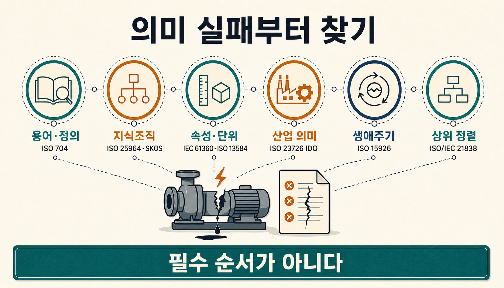
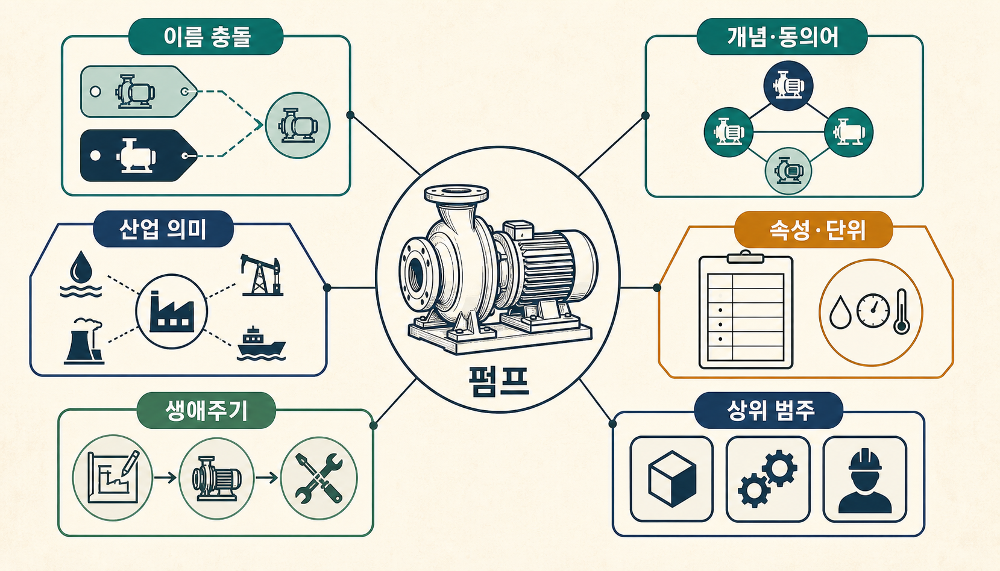
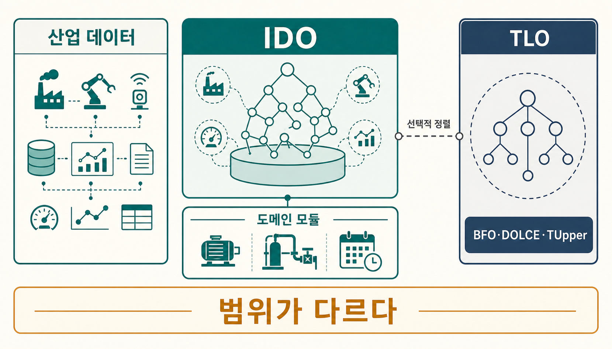
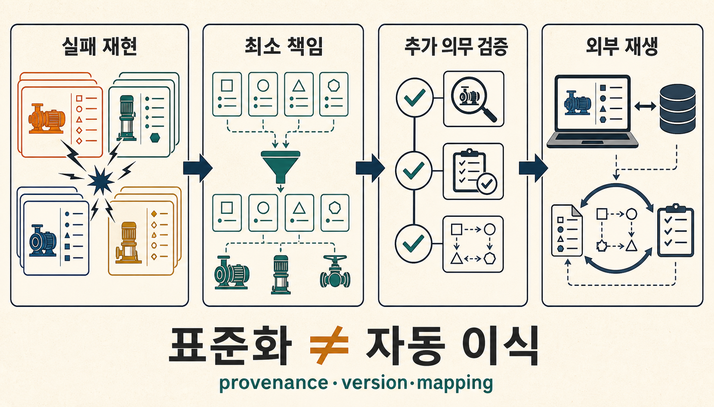

플랫폼에서 설비 데이터를 꺼내 새 시스템에 합쳤다고 가정해 보겠습니다. 공급사 카탈로그, 설비 관리, 정비, 공정 데이터 플랫폼의 파일은 모두 들어왔습니다. 그런데 새 화면에는 같은 펌프가 서로 다른 두 자산으로 나타납니다.

한 시스템은 `Pump`, 다른 시스템은 `Pumping Equipment`라고 부릅니다. `rated flow = 120`이라는 값은 옮겨졌지만 어느 단위와 값 영역을 따라야 하는지 분명하지 않습니다. 정비 시스템의 `Inspection`은 점검 작업인데, 다른 시스템에서는 점검 결과 문서를 뜻합니다. 설치·운전·정비 이력도 같은 장비를 따라 이어지지 않습니다.

파일 이동은 성공했지만 업무는 재현되지 않습니다. 자산은 중복되고, 수치는 비교할 수 없으며, 작업과 문서가 뒤섞이고, 다음 정비가 어느 이력에서 이어져야 하는지도 알 수 없습니다. [[notes/온톨로지/palantir-platform-exit-readiness|30번 글]]에서 분리했던 `파일 export`와 `실제 업무 이전`의 경계가 이번에는 **의미가 옮겨지지 않는 문제**로 드러난 것입니다.

이때 팀은 “온톨로지 표준을 쓰자”고 말합니다. 검색하면 용어, 속성 사전, 산업 의미 모델, 생애주기 통합, 상위 정렬을 다루는 ISO·IEC·W3C 문서가 한꺼번에 나옵니다. 하지만 문서 이름부터 고르면 방금 실패한 네 가지 문제를 한 덩어리로 취급하게 됩니다. 이 문서들은 같은 문제를 놓고 경쟁하는 제품 목록이 아니라 서로 다른 의미 실패를 맡는 책임들입니다.

> [!summary] 표준 이름보다 먼저 실패한 의미 계약을 찾습니다
> **산업 온톨로지 표준은 초급에서 고급으로 올라가는 한 줄짜리 기술 스택이 아니라 서로 다른 상호운용 실패를 맡는 책임 지도에 가깝습니다.** 용어가 깨졌다면 용어를, 속성과 단위가 깨졌다면 사전을, 여러 도메인의 상위 범주가 반복 충돌할 때만 top-level ontology 정렬을 검토하는 식으로 필요한 최소 책임부터 고르는 편이 안전합니다.

## 표준을 펼치기 전에 펌프 하나로 네 번 묻습니다

먼저 실제 데이터와 업무 질문 하나를 고정합니다.

```text
"대표 펌프의 정격 유량과 현재 설치 위치를
공급사 카탈로그와 정비 시스템에서 같은 의미로 읽을 수 있는가?"
```

이 질문이 실패했다는 말만으로는 부족합니다. 결과를 더 구체적으로 적어야 합니다. `Pump`와 `Pumping Equipment`가 서로 다른 자산으로 등록됐는지, 단위가 불분명해 정격 유량을 비교하지 못하는지, 점검 작업과 점검 문서를 같은 종류로 처리했는지, 설치·운전·정비 이력이 중간에서 끊겼는지 확인합니다.



```text
이름이 다름
≠ property 정의가 다름
≠ lifecycle 모델이 다름
≠ upper category가 충돌함
```

**어디서 의미가 깨졌습니까?** 이름 충돌인지, property·unit 충돌인지, object와 process의 구분 실패인지, 장기 이력 연결 실패인지 결과부터 나눕니다. `데이터가 안 맞는다`처럼 뭉뚱그리면 어떤 표준을 붙여도 효과를 검증할 수 없습니다.

그다음에는 **가장 얇은 기준선으로 어디까지 고칠 수 있는지** 봅니다. 이름과 동의어 문제라면 용어집이나 가벼운 vocabulary가 먼저일 수 있습니다. Property와 단위 문제라면 명시적인 property registry가 필요합니다. 한 시스템의 JSON Schema나 관계형 모델로 충분히 닫히는 문제에 native graph와 top-level ontology까지 한꺼번에 더할 이유는 없습니다.

여기까지 고쳤는데도 실패가 남는다면 질문이 바뀝니다. **더 강한 책임은 무엇을 새로 해결합니까?** 산업 데이터 foundation이나 상위 정렬 계층을 추가했다면 표준을 더 많이 썼다는 사실이 아니라 중복 mapping이 재사용되는지, 이전에 충돌하던 상위 category를 일관되게 판정하는지, cross-domain competency query가 통과하는지, 변경 영향을 더 잘 찾는지를 봅니다. 이번 연구에서는 동일 industrial corpus로 비용·정확도 비교 실험을 실행하지 않았으므로 개선 수치를 주장하지 않습니다.

마지막 검사는 도입이 아니라 이탈입니다. **밖으로 옮겨도 같은 업무가 재생됩니까?** 선택한 term·property·mapping을 다른 실행 환경으로 옮긴 뒤 같은 질문을 다시 던집니다. 파일이 열리는지만 보지 않고 같은 펌프, 같은 수치, 같은 작업과 같은 이력을 복원하는지 확인합니다. 이 단계가 30번 글의 exit readiness를 의미 계층에서 이어 받습니다.

이 네 질문을 통과한 뒤에야 표준 이름을 펼칩니다. 이름과 동의어만 맞추면 되는 조직에 top-level ontology까지 도입하는 것은 과할 수 있습니다. 반대로 여러 팀이 `Process`, `Role`, `Quality`, `Information`을 서로 다르게 모델링해 mapping을 매번 다시 만든다면 단순 용어집만으로는 부족합니다.

## 그제야 표준 책임 지도를 펼칩니다

| 실제로 깨진 것                        | 먼저 볼 책임             | 대표 표준·규격           |
| ------------------------------------- | ------------------------ | ------------------------ |
| 개념·용어·정의                        | terminology              | ISO 704                  |
| 시소러스·concept scheme·mapping       | knowledge organization   | ISO 25964 + W3C SKOS     |
| property·단위·값 영역·parts family    | property dictionary      | IEC 61360 + ISO 13584-42 |
| 여러 산업 시스템의 공통 의미 기반     | industrial-data ontology | ISO 23726 IDO 평가       |
| 프로세스 플랜트의 장기 생애주기 통합  | lifecycle integration    | ISO 15926 family         |
| 여러 domain ontology의 상위 범주 충돌 | top-level alignment      | ISO/IEC 21838 + 후보 TLO |

이 표는 ISO가 규정한 성숙도 사다리도, 아래에서 위로 반드시 import해야 하는 설치 순서도 아닙니다. 한 프로젝트는 ISO 704와 SKOS만으로 문제를 닫을 수 있고, 프로세스 산업에서는 ISO 15926 계열이 중심이 될 수 있습니다.

[ISO/IEC 21838-1](https://www.iso.org/standard/71954.html)은 domain-neutral top-level ontology의 요구조건을 다루고, [ISO 15926-1](https://www.iso.org/standard/29556.html)은 process plant의 생애주기 정보 통합을 다룹니다. 둘 다 `ontology`라는 단어 근처에 있지만 맡은 일이 다릅니다.

그래서 표준의 높이를 묻기 전에 실패의 종류부터 나눠야 합니다. **어느 표준이 더 강한가가 아니라, 지금 무엇이 깨졌는가?** [[notes/온톨로지/ontology-vs-json-rules|6번 글]]에서 다룬 것처럼 다음 층은 관계 재사용·변경 영향·감사 비용이 추가 복잡성을 정당화할 때 올라가면 됩니다.

## 이름을 맞추면 끝날 것 같았습니다

첫 번째 충돌은 가장 눈에 잘 보입니다. `pump`, `펌프`, `양수기`, `Pumping Equipment`가 섞여 있습니다.

[ISO 704:2022](https://www.iso.org/standard/79077.html)는 terminology work의 원칙과 방법을 다룹니다. object, concept, definition, designation을 구분하고 term과 definition을 어떻게 관리할지 정리합니다. ISO 704를 쓴다고 RDF나 OWL ontology가 만들어지는 것은 아닙니다. 여기서 얻는 것은 **같은 개념을 같은 개념으로 부르기 위한 책임**입니다.

그래서 문자열부터 합치면 위험합니다. 실제 의미 범위가 다른 `Pump`와 `Pumping Equipment`를 같은 label로 정규화하면 검색은 편해져도 충돌은 감춰집니다.

개념이 정리된 뒤에는 vocabulary 사이의 관계가 남습니다. [ISO 25964-2](https://www.iso.org/standard/53658.html)는 서로 다른 thesaurus와 vocabulary 사이의 interoperability와 mapping을 다룹니다. [W3C SKOS](https://www.w3.org/TR/skos-reference/)는 `Concept`, `ConceptScheme`, `prefLabel`, `altLabel`, `broader`, `narrower`, `related`와 mapping property를 RDF/Web에서 표현합니다.

```turtle
@prefix ex: <https://example.org/concept/> .
@prefix skos: <http://www.w3.org/2004/02/skos/core#> .

ex:pump
  a skos:Concept ;
  skos:prefLabel "펌프"@ko ;
  skos:prefLabel "pump"@en ;
  skos:altLabel "양수기"@ko .
```

이 정도로 문제가 닫힌다면 SKOS vocabulary만으로도 충분할 수 있습니다. 물리적 객체와 정비 과정의 관계까지 강한 공리로 정의할 필요가 없다면 full domain ontology는 아직 필요하지 않습니다.

2026년 8월 30일 현재 [ISO 25964-1 Edition 2](https://www.iso.org/standard/86713.html)는 FDIS 단계입니다. 이 조사에서는 새 edition의 유료 전문 전체를 확보하지 않았으므로 새 규범 조항을 추정하지 않고 **revision이 진행 중이라는 사실**까지만 사용합니다.

그런데 이름을 모두 `펌프`로 맞춘 뒤에도 데이터는 다시 어긋납니다.

## 같은 이름인데 숫자의 뜻이 다릅니다

```text
rated flow = <value>
unit = ?
```

quantity, 단위, 허용 value domain, 적용 class가 다르면 같은 property 이름을 써도 두 값은 그대로 비교할 수 없습니다.

[IEC 61360-1](https://webstore.iec.ch/en/publication/28560)은 property와 associated attribute, technical concept class, data representation 원칙을 다룹니다. [ISO 13584-42](https://www.iso.org/standard/43423.html)는 supplier-independent parts family와 characterization property 구조에 무게를 둡니다.

```text
Pump
├─ rated flow
│  ├─ definition
│  ├─ quantity / unit
│  └─ value domain
└─ nominal pressure
   ├─ definition
   ├─ quantity / unit
   └─ value domain
```

[IEC 61360-7:2024](https://webstore.iec.ch/en/publication/72956)는 cross-domain generic classes와 properties를 제공합니다. 하지만 `cross-domain`이라는 표현만 보고 top-level ontology와 같은 역할로 읽으면 안 됩니다.

```text
cross-domain property dictionary
≠ domain-neutral top-level ontology
```

여기서 패턴이 드러납니다. 이름 문제를 해결했다고 property 문제가 해결되지는 않습니다. property를 정리했다고 여러 산업 시스템의 상위 의미 모델까지 자동으로 생기지도 않습니다.

## 같은 `upper ontology`라는 말이 다른 층을 가리킵니다

ISO/TC 184/SC 4의 ISO 23726 Ontology-based interoperability 계열은 Industrial Data Ontology(IDO)를 foundation으로 둡니다. [ISO/FDIS 23726-3](https://www.iso.org/standard/87560.html)은 IDO를 산업 데이터와 정보, vocabulary, asset model, reference data library에 사용할 OWL ontology로 설명합니다.

2026년 8월 30일 현재 Part 3 IDO는 **FDIS**이고 Parts 1·2·100은 개발 중입니다. 완성된 published stack처럼 다뤄서는 안 됩니다.

반면 ISO/IEC 21838은 domain-neutral top-level ontology를 다룹니다. Part 1은 요구조건이고 구체적인 표준 TLO로 [BFO](https://www.iso.org/standard/74572.html), [DOLCE](https://www.iso.org/standard/78927.html), [TUpper](https://www.iso.org/standard/78928.html)이 있습니다.



```text
IDO의 industrial-data-domain foundation
≠ ISO/IEC 21838의 domain-neutral TLO

ISO/IEC 21838-1
≠ BFO 자체

표준 TLO
≠ BFO 하나뿐
```

이 조사에서는 IDO와 BFO·DOLCE·TUpper 사이의 formal mapping을 구현하거나 reasoner로 검증하지 않았습니다. 어느 쪽이 더 낫다거나 완전히 호환된다고 말하지 않습니다.

TLO의 가치는 `가장 높은 단계`라서 생기지 않습니다. 같은 펌프를 다루는 설비 ontology, 정비 ontology, 조직 ontology가 `Object`, `Process`, `Role`, `Quality`, `Information`을 서로 다르게 해석해 point-to-point mapping을 계속 다시 만들 때 상위 정렬의 재사용 가치가 커집니다. 반대로 한 팀이 관리하는 단일 domain이고 cross-domain query가 거의 없다면 아직 필요하지 않을 수 있습니다.

```text
단일 domain ontology
+ 같은 팀이 관리
+ cross-domain query가 거의 없음
+ 상위 category 충돌이 반복되지 않음

→ JSON / DB schema / SKOS / domain model 기준선을 먼저 유지
```

이 판단은 ISO/IEC 21838의 공식 도입 절차가 아니라 프로젝트의 조건부 권고입니다. BFO·DOLCE·TUpper 생태계를 처음부터 핵심 commitment로 쓰는 프로젝트라면 초기 alignment가 합리적일 수도 있습니다.

## 오래된 표준이라는 인상도 판단을 흐립니다

[ISO 15926-1](https://www.iso.org/standard/29556.html)의 중심 범위는 process plant lifecycle information integration입니다. 처음의 펌프에서 설치·운전·정비 이력을 장기간 이어야 하는 문제가 핵심이라면 이 책임이 가까워집니다. 일반 기업 ontology의 보편 baseline이라기보다 프로세스 산업에서 engineering·construction·operation·maintenance 정보를 장기간 공유하는 문제에 맞춰 읽어야 합니다.

그리고 이 표준군은 끝난 legacy도 아닙니다. [ISO 15926-100:2026 Vocabulary](https://www.iso.org/standard/89678.html)는 2026년 6월 출판됐고, [ISO/AWI 15926-2 Edition 2](https://www.iso.org/standard/93280.html)는 새 data-model 작업으로 진행 중입니다. [ISO/TS 15926-4:2024](https://www.iso.org/standard/81270.html)는 current core reference data이며 revision 흐름이 있고, [ISO/AWI 15926-200](https://www.iso.org/standard/93512.html)은 RDFS implementation을 다루는 개발 중 작업입니다.

질문은 `오래됐는가`가 아닙니다. **내 문제가 process-plant lifecycle integration인가**입니다.

여기까지 각 표준의 책임을 나눴다면 처음에 남겨 둔 마지막 질문으로 돌아가야 합니다. **표준으로 정리한 의미가 조직 밖에서도 같은 업무로 재생되는가?**

## 표준을 썼는데도 의미는 남겨질 수 있습니다

[[notes/온톨로지/palantir-platform-exit-readiness|30번 글]]에서는 파일 export와 실제 업무 이전을 분리했습니다. 산업 온톨로지 표준도 같은 경계를 갖습니다.

```text
standard identifier 사용
≠ 의미가 자동으로 portable

RDF / OWL 사용
≠ 다른 runtime에서 같은 업무 재현

standard ontology 사용
≠ local extension과 mapping debt가 사라짐
```

표준을 사용해도 조직에는 profile, extension, mapping, version, provenance, validation, ownership이 남습니다. [ISO/IEC 21838-1](https://www.iso.org/standard/71954.html)의 공개 범위만으로 local profile·mapping·version·promotion 운영이 자동으로 정해지지는 않습니다.



```text
1. concept URI·label·definition을 export
2. property ID·unit·value domain을 export
3. domain class·relation과 local extension을 export
4. upper alignment module을 별도로 export
5. 외부 환경에서 competency query를 replay
6. SHACL·reasoner 결과와 mapping 이력을 대조
```

이 절차는 ISO가 요구하는 단일 공식 conformance test가 아니라 연구 자료와 기존 exit-readiness 문제를 연결해 만든 **프로젝트 설계 제안**입니다. source나 mapping revision이 바뀌면 [[notes/llm-wiki/llm-wiki-stale-propagation|stale propagation]]처럼 downstream dependency도 추적해야 합니다.

표준이 더 필요한지 판단하는 기준도 결국 같은 곳으로 돌아옵니다. 한 팀이 관리하고 이름·동의어·간단한 property table이면 충분하며 cross-domain query와 반복 mapping이 거의 없다면 JSON Schema, relational model, SKOS vocabulary가 더 얇은 기준선일 수 있습니다. 반대로 공급사마다 property 식별자·단위·값 영역이 다르고, 여러 산업 애플리케이션이 asset·process semantics를 공유해야 하거나, process plant lifecycle integration이나 반복되는 상위 category mapping이 문제라면 더 강한 책임을 검토할 이유가 생깁니다.

## 결국 표준의 수가 아니라 실패의 수를 셉니다

처음의 펌프로 돌아가겠습니다.

이름이 깨졌다면 용어와 vocabulary를 고칩니다. 숫자의 의미가 깨졌다면 property·unit·value domain 계약을 고칩니다. 여러 산업 시스템이 같은 의미 기반을 공유해야 한다면 IDO 같은 industrial-data ontology를 평가합니다. process plant lifecycle integration이 문제라면 ISO 15926의 범위를 봅니다. 여러 domain ontology가 상위 category를 반복해서 다르게 해석할 때 TLO 정렬을 검토합니다.

표준을 덜 쓰는 것이 목표도, 많이 쓰는 것이 목표도 아닙니다. **실패한 책임만 형식화하고, 다음 층은 이전 층에서 풀리지 않은 문제가 실제로 남았을 때만 추가합니다.**

마지막에는 같은 질문을 외부 환경에서 다시 던져 봅니다. 이 표준과 mapping을 옮겨도 대표 펌프의 정격 유량과 설치 위치를 같은 의미로 읽을 수 있는가? 그 질문까지 통과해야 표준 목록이 실제 상호운용 설계가 됩니다.

## 함께 읽기

- [[notes/온톨로지/palantir-platform-exit-readiness|30. 인공지능 플랫폼에서 실제로 빠져나올 수 있는가]]
- [[notes/온톨로지/ontology-vs-json-rules|6. 온톨로지는 언제 JSON 규칙보다 나아지는가]]
- [[notes/온톨로지/path-predictability-semantic-authority|26. 경로 예측 가능성과 의미 권위]]
- [[notes/온톨로지/opencrab-foundry-ontology-reinterpretation|27. 같은 온톨로지, 다른 책임]]

## 참고 자료

- ISO, [ISO 704:2022 — Terminology work — Principles and methods](https://www.iso.org/standard/79077.html)
- ISO, [ISO/FDIS 25964-1 — Thesauri for information retrieval, management and use](https://www.iso.org/standard/86713.html)
- ISO, [ISO 25964-2:2013 — Interoperability with other vocabularies](https://www.iso.org/standard/53658.html)
- W3C, [SKOS Simple Knowledge Organization System Reference](https://www.w3.org/TR/skos-reference/)
- IEC, [IEC 61360-1:2017 — Definitions, principles and methods](https://webstore.iec.ch/en/publication/28560)
- IEC, [IEC 61360-7:2024 — Data dictionary of cross-domain concepts](https://webstore.iec.ch/en/publication/72956)
- ISO, [ISO 13584-42:2010 — Methodology for structuring parts families](https://www.iso.org/standard/43423.html)
- ISO/IEC, [ISO/IEC 21838-1:2021 — Top-level ontologies — Requirements](https://www.iso.org/standard/71954.html)
- ISO/IEC, [ISO/IEC 21838-2:2021 — BFO](https://www.iso.org/standard/74572.html)
- ISO/IEC, [ISO/IEC 21838-3:2023 — DOLCE](https://www.iso.org/standard/78927.html)
- ISO/IEC, [ISO/IEC 21838-4:2023 — TUpper](https://www.iso.org/standard/78928.html)
- ISO, [ISO/FDIS 23726-3 — Industrial Data Ontology](https://www.iso.org/standard/87560.html)
- ISO, [ISO/CD 23726-100 — Schedule data ontology](https://www.iso.org/standard/90856.html)
- ISO, [ISO 15926-1:2004 — Overview and fundamental principles](https://www.iso.org/standard/29556.html)
- ISO, [ISO 15926-100:2026 — Vocabulary](https://www.iso.org/standard/89678.html)
- ISO, [ISO/AWI 15926-2 — Data model, Edition 2](https://www.iso.org/standard/93280.html)
- ISO, [ISO/TS 15926-4:2024 — Core reference data](https://www.iso.org/standard/81270.html)
- ISO, [ISO/AWI 15926-200 — RDF(S) implementation of the data model](https://www.iso.org/standard/93512.html)
