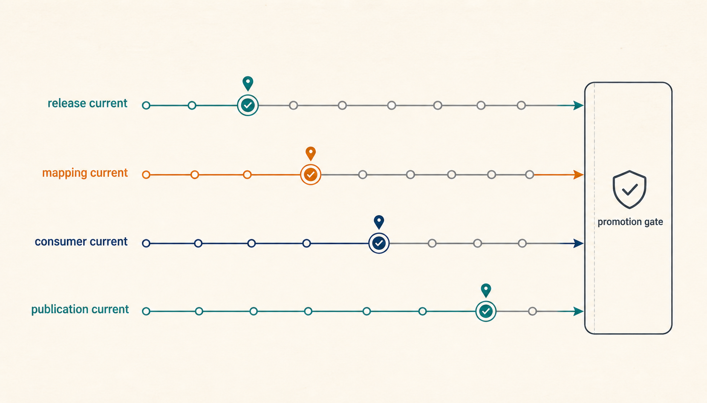
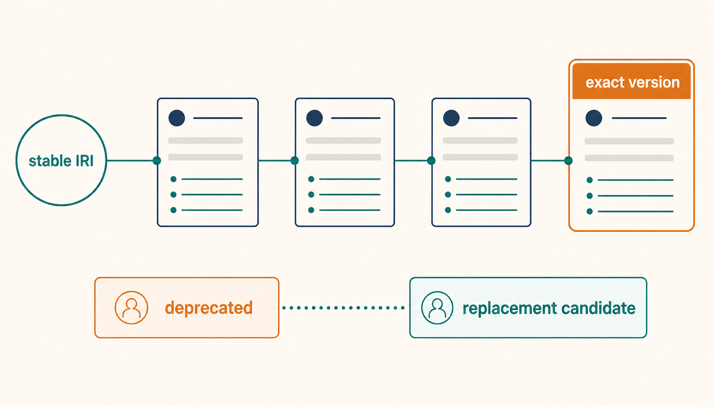
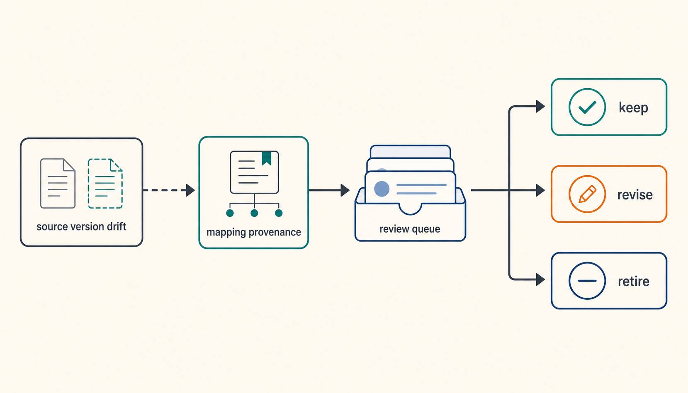
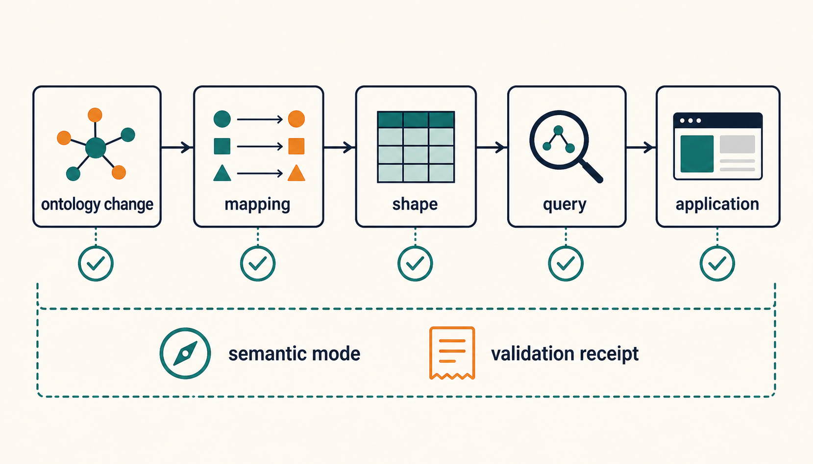

온톨로지 파일을 새 버전으로 교체했는데도 오래된 의미가 시스템에 남아 있다면, 무엇을 아직 갱신하지 않은 걸까요? 가정해 보겠습니다. 설비 온톨로지의 새 release가 나왔고 예전 property IRI 하나가 deprecated됐습니다. 현재 온톨로지 주소는 새 release를 가리키지만, 외부 vocabulary와의 mapping은 이전 release를 전제로 만들었고 SHACL shape와 조회 쿼리도 예전 term을 참조합니다.

파일만 보면 업데이트는 끝났습니다. 소비하는 시스템까지 보면 아직 끝나지 않았습니다.

> [!summary] `current`는 하나의 시각이 아니라 세 개의 시계로 봅니다
> **온톨로지 release, mapping 검토, downstream consumer migration은 서로 다른 속도로 진행됩니다.** stable IRI가 새 release를 가리킨다는 사실만으로 mapping과 application까지 현재 상태가 되지는 않으므로, registry는 이 세 수명주기와 promotion 판단을 따로 기록하는 편이 안전합니다.

## 표준을 골랐다고 운영 계약까지 정해지는 것은 아닙니다

[[notes/온톨로지/industrial-ontology-standards-responsibility-map|31번 글]]에서는 ISO 704, SKOS, IEC 61360, ISO 23726 IDO, ISO 15926, ISO/IEC 21838을 한 줄짜리 성숙도 사다리가 아니라 서로 다른 의미 실패를 맡는 책임 지도로 나눴습니다. 필요한 표준을 고른 뒤에도 남는 문제가 있습니다.

표준이나 ontology family는 무엇을 표현할지 알려 줄 수 있지만, 조직이 다음 release를 언제 current로 바꿀지까지 자동으로 결정해 주지는 않습니다. term을 없앨지 남길지, replacement를 자동 적용할지, mapping을 언제 다시 검토할지, SHACL 결과를 어떤 graph와 inference 조건에서 재현할지도 운영 계약으로 남습니다.

그래서 version 관리의 질문은 `v1에서 v2로 올렸는가`보다 더 길어집니다.

```text
새 ontology release가 나왔는가?
→ current pointer를 옮겨도 되는가?
→ deprecated term의 소비자는 무엇인가?
→ mapping set은 어느 source version을 전제로 했는가?
→ shape·query·ETL·application은 migration됐는가?
→ 검증 결과는 정확히 어느 revision을 확인했는가?
```

이 질문을 한 줄의 `version = 2`로 압축하면 변경이 어디까지 끝났는지 다시 설명하기 어렵습니다.

## 첫 번째 시계는 ontology release입니다

[OWL 2 Structural Specification](https://www.w3.org/TR/owl-syntax/)은 ontology IRI와 version IRI를 구분합니다. stable ontology identity와 특정 release를 가리키는 exact identity를 나눌 수 있다는 뜻입니다. OBO Foundry의 [Versioning 원칙](https://obofoundry.org/principles/fp-004-versioning.html)과 [ID Policy](https://obofoundry.org/id-policy.html)도 version-specific release와 안정적인 접근 경로를 분리해 운영하는 구체적인 사례를 제공합니다.

```text
stable ontology IRI
https://example.org/equipment

exact version IRI
https://example.org/equipment/releases/2026-08-30
```

두 주소는 같은 역할을 하지 않습니다. stable IRI는 최신 소비를 위한 현재 진입점이 될 수 있고, exact version IRI는 과거 계산이나 감사 결과를 재현할 때 필요합니다.



중요한 규칙은 **current가 움직여도 과거 release의 의미를 바꾸지 않는 것**입니다. 같은 version IRI가 어느 날 다른 내용을 반환하면 과거 검증 결과와 캐시, 재현 가능한 분석이 모두 흔들립니다.

반대로 stable IRI를 영원히 한 파일에 고정할 필요도 없습니다. current pointer와 immutable release를 분리하면 최신 소비와 역사적 pinning을 동시에 지원할 수 있습니다. 다만 persistent IRI의 실제 접근성은 hosting과 redirect 운영에 달려 있습니다. 식별자 설계만으로 URL 가용성이 보장되지는 않습니다.

## deprecated는 삭제가 아니고 replacement는 migration 명령도 아닙니다

OWL 2의 `owl:deprecated`는 entity가 deprecated됐음을 표시할 수 있습니다. 여기서 가장 위험한 구현은 `deprecated = 삭제`로 읽는 것입니다.

기존 consumer가 예전 IRI를 저장하고 있다면 term을 사라지게 만드는 순간 failure mode가 단순해지지 않습니다. 오히려 무엇이 같은 의미인지 판단할 자료가 줄어듭니다. OBO Foundry의 [Term Stability 원칙](https://obofoundry.org/principles/fp-019-term-stability.html)은 obsolete term의 identity를 보존하고 replacement나 consider 정보를 별도로 다루는 실제 운영 사례를 보여 줍니다.

```text
deprecated term
→ historical identity 보존
→ replacement / consider metadata
→ 영향 범위 확인
→ migration candidate
```

여기서 `replacement`도 자동 rewrite 명령으로 읽지 않는 편이 안전합니다. 하나의 exact successor가 있으면 검토할 migration candidate는 만들 수 있습니다. 후보가 여러 개이거나 `consider`만 있거나 successor가 없다면 의미를 추측해 자동 치환하기 어렵습니다.

가상의 설비 사례로 돌아가 보겠습니다. `RatedFlow`가 `RatedFlowRate`로 대체됐다고 하더라도 downstream query가 두 term을 같은 조건으로 사용해도 되는지는 별도 문제입니다. property의 domain, unit, value restriction이나 query의 의도가 함께 바뀌었다면 IRI 치환만으로 migration이 끝나지 않습니다.

## 두 번째 시계는 mapping set입니다

온톨로지 A와 B를 연결하는 mapping도 ontology file의 부속 문자열로만 다루기 어렵습니다. [SSSOM 1.0](https://mapping-commons.github.io/sssom/1.0/)은 MappingSet에 version을 둘 수 있고, subject와 object source ontology의 version, mapping tool과 tool version, mapping date와 publication date 같은 provenance를 표현합니다.

이 구조가 중요한 이유는 단순합니다.

```text
ontology A v1 ↔ ontology B v4
        ↓
mapping set M v3
```

이후 ontology A가 v2가 됐다고 가정해 보겠습니다.

```text
ontology A v2
ontology B v4
mapping set M v3  ← A v1을 전제로 만들었음
```

mapping file 자체가 바뀌지 않았더라도 **그 mapping이 기대한 source revision은 달라졌습니다.** 이때 선택지는 `그대로 current`와 `즉시 폐기` 둘뿐이 아닙니다. source-version drift를 review trigger로 만들고 keep, revise, retire 가운데 무엇이 맞는지 다시 확인할 수 있습니다.



여기서도 provenance와 correctness를 구분해야 합니다. 어떤 source와 tool로 mapping을 만들었는지 완벽하게 기록했다고 해서 correspondence가 의미적으로 올바르다는 뜻은 아닙니다. source version이 바뀌었다고 모든 mapping이 틀렸다는 뜻도 아닙니다.

즉 mapping에는 적어도 두 질문이 따로 있습니다.

```text
이 mapping은 어디서 왔는가?
≠
이 mapping은 지금도 유효한가?
```

SSSOM metadata는 첫 질문을 정교하게 기록하는 데 도움이 됩니다. 두 번째 질문은 실제 source 변화와 domain 의미, validation 결과를 다시 봐야 합니다.

## source version이 바뀌었다고 모든 mapping을 다시 계산할 필요는 없습니다

source-version drift를 review trigger로 두더라도 모든 mapping을 처음부터 다시 맞추는 것이 유일한 방법은 아닙니다. Pietranik과 Kozierkiewicz의 peer-reviewed 연구는 ontology change log와 change significance를 이용해 alignment revalidation 시점과 affected mapping 범위를 선택하는 framework를 제안합니다. ([Applied Intelligence 논문](https://doi.org/10.1007/s10489-023-04545-0))

다만 이 연구는 OAEI Conference ontology에 semi-random change를 적용했고 새로운 reference alignment가 없어 Precision·Recall·F1이 아니라 저자들이 정의한 taxonomic quality measures를 사용했습니다. 따라서 특정 threshold나 incremental 방법을 보편적인 정답으로 가져오면 안 됩니다.

```text
source-version drift
→ revalidation trigger
→ change delta와 impact로 review 범위 결정 가능
≠ every mapping full rematch
≠ incremental correctness proof
```

운영 사례도 같은 분리를 보여 줍니다. [Monarch Mapping Registry](https://monarchinitiative.org/registries/monarch_mapping_registry)는 SSSOM mapping collection을 별도 registry로 운영하고, [Mondo Ingest workflow](https://monarch-initiative.github.io/mondo-ingest/developer/workflows/)는 source에서 deprecated됐지만 기존 xref가 남은 term을 별도 review report로 계산합니다. 아직 mapping되지 않은 term도 조건을 통과한 경우에만 migratable candidate로 분류합니다. 이 사례는 biomedical curation에 한정되며 산업 온톨로지의 보편 알고리즘이 아닙니다.

OxO2도 provenance와 logical soundness를 한 상태로 합치지 않습니다. ([arXiv preprint](https://arxiv.org/abs/2506.04286)) 따라서 mapping lifecycle은 `provenance → review queue → logical/semantic validation → source-version freshness → consumer migration`처럼 나눠 보는 편이 안전합니다.

## 세 번째 시계는 consumer migration입니다

온톨로지 term은 ontology 안에서만 소비되지 않습니다. 실제 시스템에서는 다음처럼 이어질 수 있습니다.

```text
ontology term
→ mapping
→ SHACL shape
→ SPARQL query
→ ETL / ingest rule
→ application / agent
```

upstream term 하나가 바뀌었을 때 downstream을 전부 다시 검사할지, 영향을 받는 consumer만 고를지는 registry가 dependency를 얼마나 알고 있는지에 달려 있습니다. 이번 연구의 합성 fixture는 reverse dependency registry로 term 변경의 downstream 범위를 계산하는 contract를 포함합니다.

다만 **impact set을 계산했다는 사실과 dependency가 완전하다는 사실은 다릅니다.** 코드 밖의 수동 mapping, 문서에만 적힌 규칙, 외부 서비스가 숨겨진 consumer라면 누락될 수 있습니다.

실제 ontology reuse에서 remote change가 발생한다는 근거도 있습니다. Pernisch, Dobriy, Polleres의 2025 WWW Companion 연구는 759개 open biomedical ontology를 분석해 ontology reuse 46.65%, impacting changes 33.38%, impacting term reuse 7.59%를 보고했습니다. ([논문 정보](https://research.vu.nl/en/publications/the-massive-problem-of-remote-changes-in-ontology-reuse/))

> [!note] 이 수치는 산업 온톨로지의 일반 실패율이 아닙니다
> 해당 값은 저자들이 정의한 open biomedical ontology corpus와 분석 조건에 묶여 있습니다. 여기서는 **remote ontology change가 실제 reuse graph에서 관찰되는 문제**라는 존재 근거로만 사용합니다.

Industrial Ontologies Foundry의 [공식 release history](https://github.com/iofoundry/ontology/releases)에서도 IRI 구조 변경, term의 module 이동과 deprecation, migration 지원이 release 책임으로 나타납니다. 한 ecosystem의 사례이므로 모든 산업 온톨로지가 같은 절차를 따라야 한다는 뜻은 아닙니다.

## 세 시계를 한 번에 current로 만들지 않습니다

이제 처음의 상황을 다시 보면 `current`라는 단어가 세 번 등장합니다.

| 시계               | current라고 부르기 전에 확인할 것                            | 다음 시계까지 보장하지 않는 것           |
| ------------------ | ------------------------------------------------------------ | ---------------------------------------- |
| ontology release   | stable IRI가 어떤 exact version을 가리키는가                 | mapping이 새 source version에서도 유효함 |
| mapping review     | mapping set이 어느 source version을 전제로 했고 재검토됐는가 | 모든 consumer가 migration됨              |
| consumer migration | shape·query·ETL·app이 새 의미 계약으로 검증됐는가            | 다음 release의 안전성                    |

이 구조에서는 release가 먼저 움직이고 mapping이 뒤따를 수도 있습니다. 위험도가 높은 시스템이라면 mapping과 필수 consumer가 검증될 때까지 stable current pointer 이동을 늦출 수도 있습니다. 어떤 순서를 요구할지는 조직 정책과 consumer 위험에 따라 달라집니다.

따라서 `세 시계가 항상 동시에 끝나야 한다`는 규칙도 만들지 않습니다. 중요한 것은 **어느 시계가 어디까지 진행됐는지 숨기지 않는 것**입니다.

## promotion은 네 번째 파일이 아니라 별도 판단입니다

registry가 가진 상태를 기록하는 것과 새 release를 current로 승격하는 것은 다른 작업입니다. [ISO 19135:2026](https://www.iso.org/standard/87753.html)은 geographic information register의 capability와 register establishment·management·operation·publication·use를 통제하는 governance requirement를 다룹니다. ontology-specific `versionIRI`나 deprecation semantics를 정의하는 표준은 아니지만, **register content와 governance, implementation을 서로 다른 책임으로 보게 하는 일반 틀**을 제공합니다.

[ISO/TC 211의 공식 ontology repository](https://github.com/ISO-TC211/ontologies)는 Pull Request를 change proposal 표면으로 사용하고, Group for Ontology Maintenance의 검토와 structured manifest 기반 validation·publication 준비를 문서화합니다. 저장소 README가 2026년 3월 기준 governance procedure를 개발 중이라고 적고 있으므로, 2026년 8월에 모두 최종화됐다고 추정하지는 않습니다.

이 사례에서 가져올 수 있는 운영 경계는 다음 정도입니다.

```text
proposal accepted
≠ validation passed
≠ publication completed
≠ downstream migration completed
```

promotion receipt에는 최소한 `내가 무엇을 current라고 바꾸려 했는가`를 다시 확인할 정보가 있어야 합니다.

```yaml
promotion:
  expected_current_version: ...
  candidate_version: ...
  validation_result: ...
  required_mapping_reviews: ...
  required_consumer_checks: ...
  promoted_at: ...
```

이 schema는 W3C·ISO·OBO·SSSOM의 공식 통합 규격이 아니라 여러 책임을 겹치지 않게 묶은 프로젝트 설계 제안입니다.

## planned, catalogued, published도 다른 상태입니다

release calendar에 날짜가 적혀 있거나 catalogue에 resource family가 보인다고 current artifact가 실제 production에 존재한다고 단정하기도 어렵습니다.

2026년 8월 30일 확인한 [ISO/TC 211 Semantic Web 공개 페이지](https://def.isotc211.org/)는 ontology IRI pattern을 proposed 상태로 설명하고 production ontology가 아직 없다고 표시하면서 complete ontology set의 예상 시점으로 May 2026 문구를 함께 남겨 두고 있습니다. 이 오래된 target 문구만으로 일정 실패의 원인을 추정할 수는 없습니다. 다만 **계획된 날짜와 관찰 가능한 공개 상태가 서로 다른 필드여야 한다**는 점은 보여 줍니다.

동시에 [ISO/TC 211 Registries](https://registry.isotc211.org/) catalogue는 Ontologies 항목을 공식 registry 목록에 노출합니다. Catalogue inclusion과 individual ontology의 production publication status를 같은 boolean으로 합치면 두 표면의 차이를 잃습니다.

```text
planned_release_target
catalogue_registration
observed_publication_status
artifact_available

→ 각각 기록
```

[OGC RAINBOW](https://www.ogc.org/research/ogc-rainbow/)처럼 persistent semantic resource를 publish하는 표면도 governance authority와는 별도 책임으로 두는 편이 명확합니다.

## validation PASS도 어떤 semantics에서 나온 결과인지 남겨야 합니다

[W3C SHACL](https://www.w3.org/TR/shacl/)은 RDF graph를 shape에 대해 검증하는 표준입니다. 하지만 `SHACL PASS`라는 문자열만 저장하면 나중에 정확히 무엇을 검증했는지 부족할 수 있습니다.

Robaldo와 Batsakis의 2026년 Time Ontology 연구는 필요한 inference를 먼저 materialize하지 않으면 SHACL shape만으로 일부 constraint를 충분히 확인하기 어려운 사례를 분석합니다. ([DOI](https://doi.org/10.1177/22104968261440710)) 이어 Oudshoorn, Ortiz, Šimkus는 OWL의 open-world inference와 SHACL의 closed-world validation 사이의 semantic gap을 형식화하고 ontology-aware validation semantics와 rewriting을 연구했습니다. ([Artificial Intelligence 2026](https://doi.org/10.1016/j.artint.2026.104483))

또 Ahmetaj 등의 ISWC 2025 연구는 현재 SHACL을 만족하는 graph가 계획된 update 뒤에도 만족하는지를 변경 적용 전에 static validation 문제로 분석합니다. ([논문](https://doi.org/10.1007/978-3-032-09527-5_8)) 2026년 Oudshoorn, Gorczyca, Arndt는 제한된 OWL EL^- fragment에서 ontology semantics를 SHACL constraints로 rewrite해 standard SHACL Core validator를 사용하는 접근을 제시했습니다. ([extended version](https://arxiv.org/abs/2608.14104))

이 결과들은 arbitrary OWL·SHACL 조합의 보편 recipe가 아닙니다. 각 논문의 ontology fragment와 update assumptions에 묶여 있습니다. 재사용할 수 있는 경계는 `PASS`에 입력 revision뿐 아니라 **semantic mode와 실행 identity**를 결속해야 한다는 점입니다.

```yaml
validation:
  data_graph_revision: ...
  ontology_revision: ...
  ontology_fragment: ...
  shape_revision: ...
  semantic_mode: materialize_then_validate | rewritten_shapes | validator_entailment
  rewriter_or_reasoner_version: ...
  validator_version: ...
  shacl_report: ...
  competency_query_result: ...
  application_result: ...
```

계획된 update에는 change-scoped/static preflight가 후보가 될 수 있지만, 이것도 consumer migration 완료를 대신하지 않습니다.

```text
SHACL PASS
≠ validation semantics fully specified
≠ downstream migration complete
```

## 합성 fixture 12/12는 무엇을 확인했나

프로젝트 연구에서는 제안한 lifecycle contract를 작은 deterministic fixture로 실행했고 12개 조건이 모두 PASS했습니다. 확인한 범위에는 current pointer와 immutable release 분리, same-version content immutability, historical pinning, ambiguous deprecation의 review 전환, compatibility declaration만으로 promotion 금지, mixed same-series version 차단, reverse dependency impact 계산이 포함됩니다.

이 결과의 주장 상한은 좁습니다.

```text
12/12 PASS
= 작성한 합성 조건에서 제안한 분기가 재현됨

12/12 PASS
≠ 실제 ontology migration correctness
≠ production dependency completeness
≠ 비용·장애율 개선
≠ 자동 semantic replacement 안전성
```

실제 publication-grade 성능을 말하려면 ontology→mapping→shape→query→application의 gold dependency set을 만들고 affected-consumer precision·recall, migration 후 query·application regression, mapping keep/revise/retire 판정을 측정해야 합니다. 이번 실행에서는 그 실험을 하지 않았습니다.



## 최소 registry는 네 원장을 분리하면 시작할 수 있습니다

모든 조직이 거대한 ontology management platform부터 만들 필요는 없습니다. 작은 registry라도 다음 네 원장을 분리하면 상태를 설명하기 쉬워집니다.

```yaml
ontology_registry:
  releases:
    stable_ontology_iri: ...
    current_version_iri: ...
    version_history: ...

  terms:
    iri: ...
    status: active | deprecated
    replaced_by: ...
    consider: ...

  mappings:
    mapping_set_version: ...
    subject_source_version: ...
    object_source_version: ...
    review_status: ...

  consumers:
    consumer_id: ...
    consumed_term_or_mapping: ...
    consumed_version: ...
    validation_receipt: ...
```

여기에 promotion policy를 별도로 둡니다. 각 조직은 어떤 consumer를 `required`로 볼지, breaking change에 어떤 review window를 둘지, 자동 migration을 어디까지 허용할지 정할 수 있습니다.

이 구분은 단순해 보이지만 의미가 큽니다. `ontology v2 release 완료`와 `migration 완료`를 같은 상태로 쓰지 않게 해 줍니다.

## 작은 vocabulary라면 더 얇게 시작해도 됩니다

정교한 registry가 항상 이득인 것은 아닙니다. 한 팀이 작은 vocabulary를 관리하고, consumer가 몇 개 안 되며, mapping이 없고, 변경 때 전체 회귀 검사를 돌리는 비용이 낮다면 file-level version과 changelog, deprecated alias만으로 충분할 수 있습니다.

registry가 값을 하는 조건은 보통 다음과 같습니다.

- 여러 팀이나 외부 시스템이 exact ontology version을 다르게 소비합니다.
- deprecated term과 mapping을 바로 삭제할 수 없습니다.
- source ontology 변화가 shape·query·application에 영향을 줍니다.
- 과거 결과를 동일 version과 validation 조건으로 다시 재현해야 합니다.
- current promotion 전에 사람 검토와 검증 결과를 결속해야 합니다.

이 조건이 거의 없다면 lifecycle metadata가 오히려 운영 부담이 될 수 있습니다. [[notes/온톨로지/ontology-vs-json-rules|온톨로지 도입 경계]]와 마찬가지로, 먼저 반복되는 실패를 재현한 뒤 그 실패를 줄이는 책임만 추가하는 편이 낫습니다.

## 다음 release 전에 세 줄을 적어 보면 됩니다

새 registry를 도입하기 전에 현재 ontology의 다음 release 하나를 놓고 세 줄만 적어 보십시오.

```text
release clock
= stable IRI가 어떤 exact version을 가리키는가

mapping clock
= 어떤 mapping set이 어느 source version을 전제로 하는가

consumer clock
= 어떤 shape·query·application이 어느 version을 검증했는가
```

그리고 current pointer를 옮기는 정책이 이 세 줄 가운데 무엇을 필수로 요구하는지 표시합니다. 그 표에서 `unknown`이 반복되는 곳이 registry가 먼저 기록해야 할 책임입니다.

온톨로지 변경의 어려움은 새 파일을 만드는 데 있지 않습니다. **새 release가 나왔다는 사실과, 그 의미를 소비하는 mapping과 시스템이 새 상태로 이동했다는 사실을 구분하는 데 있습니다.** 세 시계를 따로 기록하면 무엇이 아직 낡았는지 설명할 수 있고, 그때부터 migration을 추측이 아니라 검토 가능한 작업으로 바꿀 수 있습니다.

## 함께 읽기

- [[notes/온톨로지/industrial-ontology-standards-responsibility-map|31. 온톨로지 표준은 왜 이렇게 많은가]]
- [[notes/온톨로지/palantir-platform-exit-readiness|30. 인공지능 플랫폼에서 실제로 빠져나올 수 있는가]]
- [[notes/llm-wiki/llm-wiki-stale-propagation|4. 원문이 바뀌면 LLM Wiki의 어떤 페이지를 다시 믿을 수 있는가]]
- [[notes/온톨로지/ontology-vs-json-rules|6. 온톨로지는 언제 JSON 규칙보다 나아지는가]]

## 참고 자료

- W3C, [OWL 2 Web Ontology Language Structural Specification and Functional-Style Syntax](https://www.w3.org/TR/owl-syntax/)
- OBO Foundry, [Principle 4 — Versioning](https://obofoundry.org/principles/fp-004-versioning.html)
- OBO Foundry, [Principle 19 — Stability of Term Meaning](https://obofoundry.org/principles/fp-019-term-stability.html)
- OBO Foundry, [ID Policy](https://obofoundry.org/id-policy.html)
- OBO Foundry, [Principle 13 — Notification of Changes](https://obofoundry.org/principles/fp-013-notification.html)
- W3C, [Data Catalog Vocabulary Version 3](https://www.w3.org/TR/vocab-dcat-3/)
- W3C, [PROV-O](https://www.w3.org/TR/prov-o/)
- W3C, [Shapes Constraint Language](https://www.w3.org/TR/shacl/)
- Pernisch, Dobriy, Polleres, [The Massive Problem of Remote Changes in Ontology Reuse](https://research.vu.nl/en/publications/the-massive-problem-of-remote-changes-in-ontology-reuse/)
- Industrial Ontologies Foundry, [Ontology releases](https://github.com/iofoundry/ontology/releases)
- ISO, [ISO 19135:2026 — Geographic information — Registration and register governance](https://www.iso.org/standard/87753.html)
- ISO/TC 211, [Official ontology repository](https://github.com/ISO-TC211/ontologies)
- ISO/TC 211, [AG 6 Group for Ontology Maintenance](https://committee.iso.org/sites/tc211/home/about/advisory-groups.html)
- ISO/TC 211, [Semantic Web publication surface](https://def.isotc211.org/)
- ISO/TC 211, [Registries](https://registry.isotc211.org/)
- OGC, [RAINBOW](https://www.ogc.org/research/ogc-rainbow/)
- Mapping Commons / SSSOM Core Team, [SSSOM 1.0](https://mapping-commons.github.io/sssom/1.0/)
- Robaldo, Batsakis, [On the Interplay Between Validation and Inference in Shapes Constraint Language](https://doi.org/10.1177/22104968261440710)
- Pietranik, Kozierkiewicz, [Methods of managing the evolution of ontologies and their alignments](https://doi.org/10.1007/s10489-023-04545-0)
- Monarch Initiative, [Monarch Mapping Registry](https://monarchinitiative.org/registries/monarch_mapping_registry)
- Mondo, [Ingest workflows](https://monarch-initiative.github.io/mondo-ingest/developer/workflows/)
- Oudshoorn, Ortiz, Šimkus, [SHACL validation in the presence of ontologies](https://doi.org/10.1016/j.artint.2026.104483)
- Ahmetaj et al., [SHACL Validation under Graph Updates](https://doi.org/10.1007/978-3-032-09527-5_8)
- Oudshoorn, Gorczyca, Arndt, [Rewrite Once, Validate Anywhere](https://arxiv.org/abs/2608.14104)
