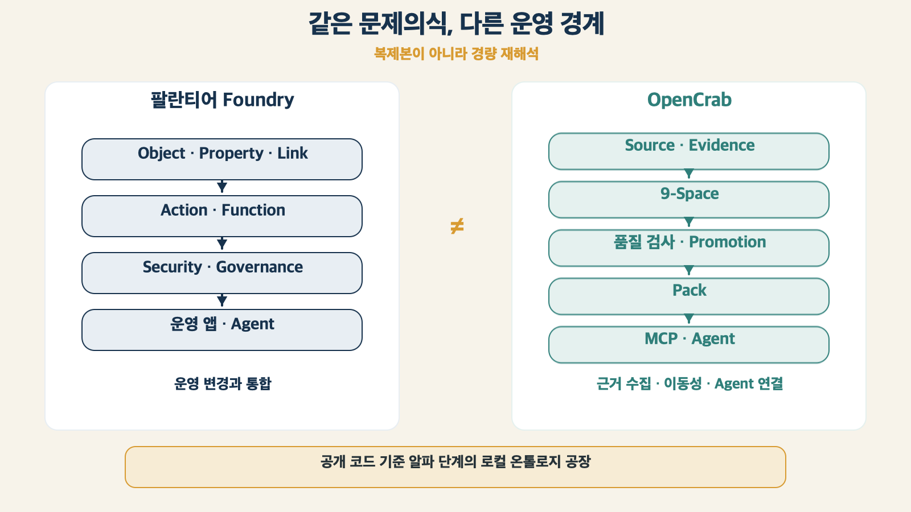
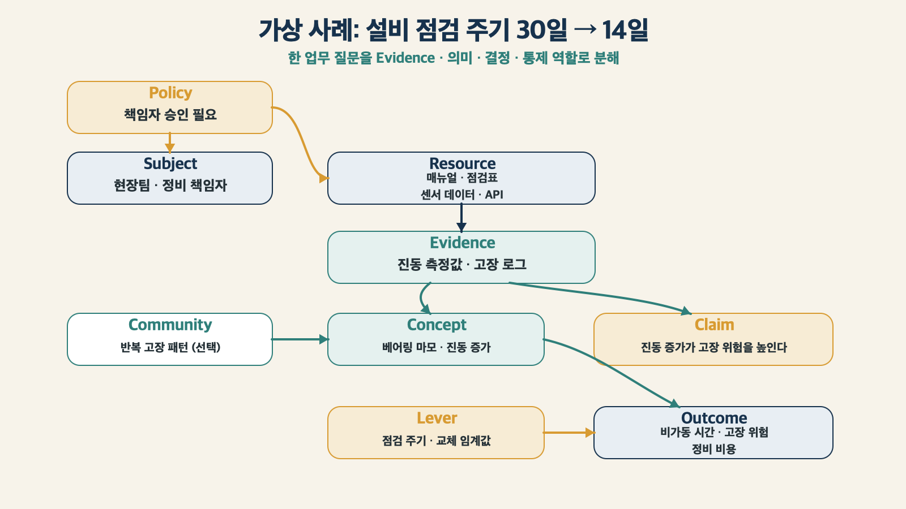
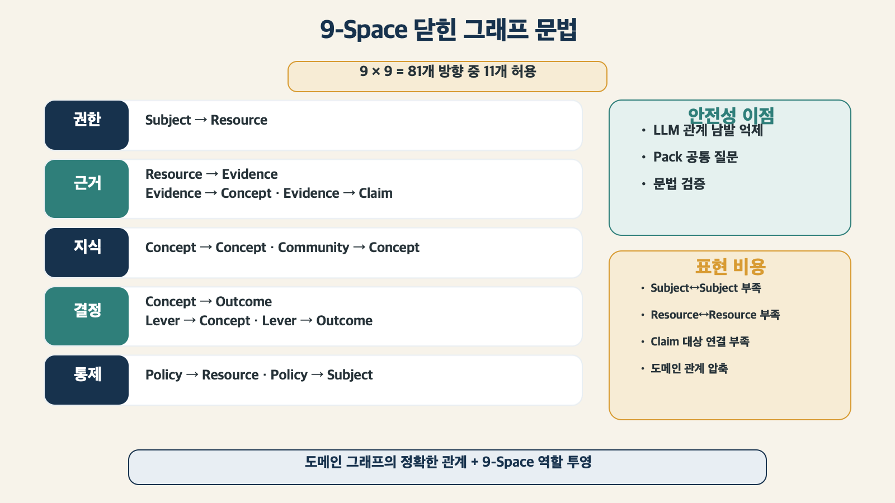
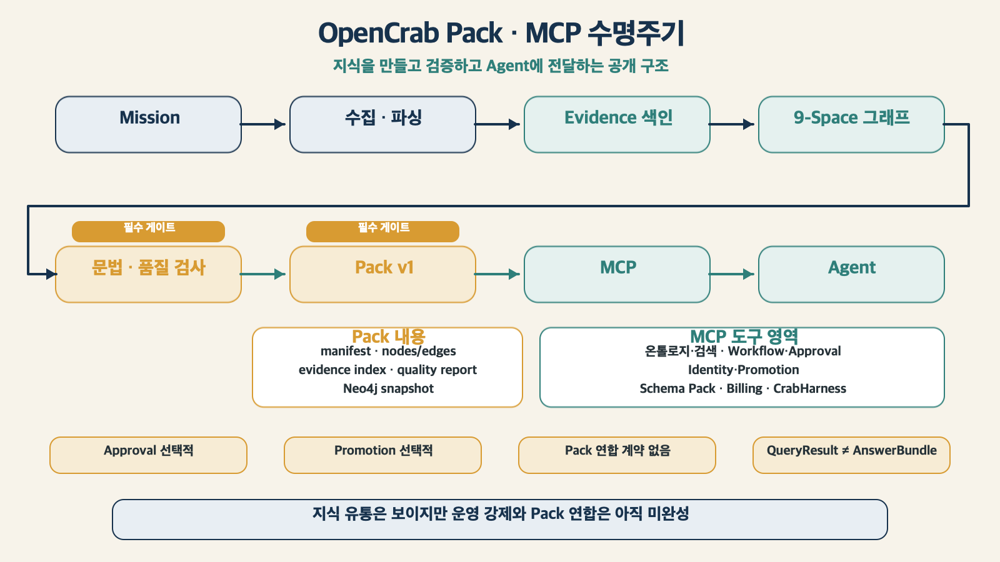

설비 점검 주기를 30일에서 14일로 줄여야 하는지 묻는 순간, 필요한 것은 문서 검색 하나가 아닙니다. 어떤 설비에서 문제가 생겼는지, 어떤 기록이 위험 증가를 보여 주는지, 누가 변경을 승인할 수 있는지, 실제 시스템의 주기를 어떻게 바꿀지까지 이어져야 합니다.

> [!summary] 먼저 결론
> OpenCrab은 팔란티어 Foundry를 작게 복제한 프로젝트가 아닙니다. Foundry가 조직의 실제 객체와 업무 변경을 온톨로지 안에서 운영한다면, OpenCrab은 문서와 로그에서 **근거·주장·결과·조절점·정책**을 뽑아 Agent가 읽을 수 있는 그래프로 만들고, 이를 Pack과 MCP로 옮기는 쪽에 무게를 둡니다. 둘은 같은 문제의식을 공유하지만 강한 지점이 다릅니다.

## ‘작은 Foundry’라고 부르면 중요한 차이를 놓칩니다

팔란티어는 Ontology를 데이터 위에 붙이는 분류표로만 설명하지 않습니다. 공식 문서에서 Ontology는 현실의 개체와 사건을 `Object`, 속성을 `Property`, 개체 사이의 관계를 `Link`로 표현합니다. 여기에 조직의 변경과 의사결정을 담당하는 `Action type`과 `Function`, 접근 제어와 거버넌스를 결합합니다. ([Palantir Ontology overview](https://www.palantir.com/docs/foundry/ontology/overview/), [Core concepts](https://www.palantir.com/docs/foundry/ontology/core-concepts/))

이 구조의 목표는 지식을 잘 설명하는 데서 끝나지 않습니다. 현업 사용자가 같은 객체를 보고, 같은 규칙으로 변경을 요청하고, 같은 권한 검사를 거쳐 실제 업무 상태를 바꾸도록 만드는 데 있습니다.

```text
현실의 설비와 작업
→ Object · Property · Link
→ Action · Function
→ Security · Governance
→ 운영 애플리케이션과 Agent
```

OpenCrab의 출발점은 다릅니다. 공개 저장소는 자신을 LocalCrab 온톨로지 공장과 OpenCrab 호스팅 생태계를 연결하는 통합 저장소로 설명합니다. 로컬 엔진은 문서·크롤링 자료·OCR 결과를 모으고, Evidence를 색인하고, 그래프를 검증해 OpenCrab Pack을 만드는 역할을 맡습니다. ([OpenCrab README](https://github.com/AlexAI-MCP/OpenCrab/tree/d34352cec9d99c755c1e891f811911461a460280))

```text
문서와 로그
→ Evidence 수집
→ 9-Space 그래프
→ 품질 검사와 승격
→ OpenCrab Pack
→ MCP로 Agent에 제공
```

둘 다 “데이터를 사람이 의사결정할 수 있는 의미 구조로 바꾼다”는 방향을 봅니다. 그러나 Foundry는 **운영 객체와 변경의 일관성**에 강하고, OpenCrab은 **비정형 자료를 근거가 있는 지식 제품으로 가공하고 옮기는 과정**에 더 관심을 둡니다.

> [!important] 비교할 때 지켜야 할 경계
> Foundry는 전사 운영 플랫폼이고 OpenCrab은 공개 코드 기준으로 알파 단계의 로컬 온톨로지 공장입니다. OpenCrab을 Foundry의 대체품으로 평가하기보다, Foundry가 제기한 운영 온톨로지 문제를 로컬 Agent 환경에서 어떻게 다시 나눴는지 보는 편이 정확합니다.

## 같은 설비 문제를 두 시스템은 어떻게 바라볼까요

가정해 보겠습니다. 한 공장의 베어링 진동이 계속 커지고 있습니다. 현장팀은 점검 주기를 30일에서 14일로 줄이려 합니다. 변경하려면 정비 책임자의 승인이 필요하고, 변경 뒤에는 고장률과 비가동 시간을 추적해야 합니다.

### Foundry에서는 운영 객체와 변경 계약을 먼저 세웁니다

Foundry식 모델은 다음에 가깝습니다.

```text
Object
- Equipment
- InspectionPlan
- VibrationReading
- WorkOrder
- FailureEvent

Link
- Equipment has InspectionPlan
- VibrationReading observedOn Equipment
- WorkOrder targets Equipment

Action
- ChangeInspectionInterval
- CreateEmergencyWorkOrder

Function
- CalculateFailureRisk

Security
- MaintenanceManager만 점검 주기를 변경
```

`ChangeInspectionInterval`은 단순한 버튼 이름이 아닙니다. Action type은 어떤 객체·속성·링크를 한 번에 바꿀지, 어떤 입력을 받을지, 누가 실행할 수 있는지, 제출 조건과 부수 효과가 무엇인지 정의합니다. 제출되면 변경이 Ontology에 반영되고 여러 애플리케이션에서 같은 규칙을 재사용할 수 있습니다. ([Palantir Action types](https://www.palantir.com/docs/foundry/action-types/overview/), [Getting started with actions](https://www.palantir.com/docs/foundry/action-types/getting-started/))

### OpenCrab에서는 자료를 판단 가능한 의미 역할로 나눕니다

OpenCrab의 9-Space로 같은 장면을 읽으면 다음처럼 바뀝니다.

| Space     | 설비 사례에서 찾는 것         | 예시                                  |
| --------- | ----------------------------- | ------------------------------------- |
| Subject   | 행동·소유·승인 주체           | 현장팀, 정비 책임자, Agent            |
| Resource  | 읽거나 수정하거나 실행할 대상 | 설비 매뉴얼, 점검표, 센서 데이터, API |
| Evidence  | 직접 관찰하거나 인용한 근거   | 진동 측정값, 고장 로그, 보고서 문장   |
| Concept   | 설명할 개체·상태·메커니즘     | 베어링 마모, 진동 증가                |
| Claim     | Evidence에서 도출한 주장      | “진동 증가가 고장 위험을 높인다”      |
| Community | 함께 묶이는 사건·개념군       | 반복 고장 패턴 묶음                   |
| Outcome   | 관리하려는 결과와 위험        | 비가동 시간, 고장 위험, 정비 비용     |
| Lever     | 사람이 조절할 수 있는 값      | 점검 주기, 교체 임계값                |
| Policy    | 권한·금지·승인 조건           | 주기 변경은 책임자 승인 필요          |



이 구조가 주는 변화는 분명합니다. 문서에서 `베어링`, `진동`, `점검`이라는 단어를 찾는 데서 멈추지 않고 다음 질문을 한 그래프 안에서 이어 볼 수 있습니다.

- 어떤 Evidence가 고장 위험 Claim을 지지합니까?
- 위험과 비가동 시간에 영향을 주는 Lever는 무엇입니까?
- 누가 점검 주기를 바꿀 수 있습니까?
- 어떤 Policy가 승인을 요구합니까?

이 지점에서 OpenCrab은 일반적인 GraphRAG보다 의사결정에 가까워집니다. 다만 그래프가 실제 설비 관리 시스템의 값을 자동으로 바꾸는 것은 아닙니다. 의미를 읽고 판단 재료를 준비하는 일과 실제 운영 변경은 구분해야 합니다.

## 9-Space는 경량 상위 온톨로지이면서 닫힌 그래프 문법입니다

9-Space는 세 묶음으로 보면 기억하기 쉽습니다.

```text
행동의 세계
Subject · Resource

지식의 세계
Evidence · Concept · Claim · Community

결정과 통제의 세계
Outcome · Lever · Policy
```

전통적인 상위 온톨로지는 객체·사건·시간·공간처럼 세계의 일반 존재 범주를 정의하는 경우가 많습니다. OpenCrab은 여기에 지식의 상태와 운영 역할을 함께 넣었습니다. 그래서 “경량 어퍼 온톨로지”라고 부를 수는 있지만, **Agent가 자료를 읽고 판단하고 행동할 때 필요한 역할 문법**이라고 설명하는 편이 더 정확합니다.

### 모든 Space가 서로 연결되는 것은 아닙니다

현재 공개 문법은 9개 Space 사이의 모든 조합을 허용하지 않습니다. 가능한 81개 방향 조합 중 11개만 열어 두고, 그 안에서 38개의 관계 이름을 사용합니다. ([`manifest.py`](https://github.com/AlexAI-MCP/OpenCrab/blob/d34352cec9d99c755c1e891f811911461a460280/opencrab/grammar/manifest.py))

| From → To           | 허용 관계의 예                                              |
| ------------------- | ----------------------------------------------------------- |
| Subject → Resource  | owns, manages, can_view, can_edit, can_execute, can_approve |
| Resource → Evidence | contains, derived_from, logged_as                           |
| Evidence → Concept  | mentions, describes, exemplifies                            |
| Evidence → Claim    | supports, contradicts, timestamps                           |
| Concept → Concept   | related_to, subclass_of, part_of, influences, depends_on    |
| Concept → Outcome   | contributes_to, constrains, predicts, degrades              |
| Lever → Outcome     | raises, lowers, stabilizes, optimizes                       |
| Lever → Concept     | affects                                                     |
| Community → Concept | clusters, summarizes                                        |
| Policy → Resource   | protects, classifies, restricts                             |
| Policy → Subject    | permits, denies, requires_approval                          |



닫힌 문법은 LLM이 임의의 관계를 남발하지 못하게 합니다. `Subject → mentions → Resource`처럼 의미가 맞지 않는 연결은 저장 전에 거절할 수 있습니다. 서로 다른 Pack도 같은 기본 문법을 사용하므로 Agent가 공통된 질문을 던지기 쉬워집니다.

그 대가도 있습니다.

- `User → member_of → Team` 같은 Subject 간 조직 관계를 직접 표현하기 어렵습니다.
- `Project → contains → Document` 같은 Resource 간 구조가 막힙니다.
- Claim이 어떤 Concept나 Outcome에 관한 주장인지 직접 잇는 관계가 부족합니다.
- 의료의 `CONTRAINDICATED_WITH`, 건설의 `PROHIBITED_BY`처럼 도메인 고유 관계가 `related_to`나 `restricts`로 압축될 수 있습니다.

따라서 9-Space를 도메인 언어의 대체재로 사용하면 정보가 줄어듭니다. 더 나은 방법은 두 층을 함께 유지하는 것입니다.

```text
도메인 그래프
Bearing -[REQUIRES_INSPECTION]-> InspectionProcedure

9-Space 역할 투영
Concept · Resource · Policy · Outcome
```

도메인 그래프는 현업의 정확한 의미를 보존하고, 9-Space는 질문 계획·근거 검사·Pack 호환을 위한 공통 렌즈로 쓰는 방식입니다.

## Lever는 Foundry Action이 아닙니다

사용자 입장에서 가장 헷갈리기 쉬운 부분입니다.

```text
Lever
= 무엇을 바꿀 수 있는가

Action
= 누가 어떤 조건과 입력으로 실제 변경을 실행하는가
```

설비 사례에서 `점검 주기`는 Lever입니다. 30일을 14일로 조절할 수 있는 값이기 때문입니다. 하지만 이것만으로 실제 시스템이 바뀌지는 않습니다.

Foundry의 Action에 가까운 OpenCrab 구성은 하나가 아니라 묶음입니다.

```text
Lever
+ Action Schema
+ Workflow
+ Approval
+ ReBAC
+ Impact
+ Receipt와 Action Log
```

OpenCrab 공개 코드에는 YAML Action schema, workflow 상태, 승인 큐, 관계 기반 접근 제어와 실행 영수증이 있습니다. MCP 도구에도 `workflow_create_run`, `workflow_advance`, `approval_request`, `ontology_rebac_check`, `ontology_impact`가 노출됩니다. ([`tools.py`](https://github.com/AlexAI-MCP/OpenCrab/blob/d34352cec9d99c755c1e891f811911461a460280/opencrab/mcp/tools.py))

구조만 보면 Foundry의 실행 계층에서 영감을 받은 해석이 가능합니다. 그러나 공개 구현에서는 이 부품들이 하나의 강제 경로로 묶여 있지 않습니다.

- Action schema가 없어도 실행을 허용하는 경로가 있습니다.
- Workflow는 허용된 상태 이름을 검사하지만 엄격한 전이표를 강제하지 않습니다.
- Approval 요청이 존재해도 모든 쓰기 도구가 승인 완료 여부를 확인하지는 않습니다.
- Lever simulation은 그래프 관계와 입력 크기를 조합한 휴리스틱이며 인과 추정 모델이 아닙니다.

그래서 OpenCrab의 실행 구조는 **운영 Action의 골격**으로 보는 편이 맞습니다. Foundry처럼 변경의 유일한 트랜잭션 경계가 되었다고 보기는 이릅니다.

## Pack은 지식을 옮기는 방법이지만, 세 가지 Pack을 구분해야 합니다

OpenCrab에서 `Pack`은 문맥에 따라 다른 뜻으로 사용됩니다.

| 이름             | 역할                                                       |
| ---------------- | ---------------------------------------------------------- |
| Schema Pack      | 특정 도메인의 Node type schema를 설치하는 어휘 확장        |
| PromotionPackage | 한 Mission이 수집·검증한 Node와 Edge 후보 묶음             |
| OpenCrab Pack v1 | Graph·Evidence·품질 보고서·Neo4j 검증 결과를 담은 배포 ZIP |

이 가운데 OpenCrab의 제품 철학을 가장 잘 보여 주는 것은 Pack v1입니다. 공개 명세는 다음 파일을 하나의 배포 계약으로 묶습니다. ([OpenCrab Pack v1](https://github.com/AlexAI-MCP/OpenCrab/blob/d34352cec9d99c755c1e891f811911461a460280/docs/opencrab-pack-v1.md))

```text
manifest.json
graph/nodes.jsonl
graph/edges.jsonl
evidence/index.jsonl
quality/report.json
neo4j/import.cypher
neo4j/opencrab_ingest.jsonl
sample_queries.json
community_reports.json
```

이 ZIP은 그래프 백업이 아닙니다. “어떤 자료로 만들었고, 어느 문법 버전을 사용했고, 어떤 품질 검사를 통과했는가”를 함께 전달하는 지식 제품입니다.

### Pack 간 연계는 ‘배포’와 ‘의미 결합’을 나눠 봐야 합니다

여러 Pack을 같은 생태계에 설치하고 Agent가 함께 검색하게 만드는 **배포 연계**는 OpenCrab이 분명히 염두에 둔 방향입니다. 공통 9-Space와 Pack 형식, MCP가 있기 때문에 법규 Pack과 설비 Pack을 같은 Agent가 읽는 그림을 만들 수 있습니다.

하지만 공개 Pack v1 명세에는 아직 다음과 같은 의미 결합 계약이 없습니다.

```text
dependencies
imports · exports
namespace
required_packs
cross_pack_links
conflict_resolution
canonical_entity_mapping
```

따라서 현재 Pack은 조합 가능한 지식 묶음이지만, 패키지 관리자의 의존성 그래프처럼 서로의 버전과 충돌을 해결하는 모듈 시스템은 아닙니다.

가령 두 Pack이 같은 설비를 서로 다른 ID로 저장하거나, 점검 주기에 대해 상반된 Claim을 제공한다면 다음을 별도로 해결해야 합니다.

- 어떤 ID가 같은 현실 객체를 가리키는가?
- 어느 Pack과 revision을 우선할 것인가?
- 두 Claim의 Evidence는 서로 독립적인가?
- 더 강한 Policy가 다른 Pack의 Action을 제한하는가?

OpenCrab에는 alias와 duplicate candidate를 관리하는 Identity 계층이 있지만, 검색과 Pack federation 전체에 자동 적용되는 수준은 아닙니다. **Pack 유통 구조는 보이지만 Pack 연합 의미론은 아직 비어 있다**고 정리할 수 있습니다.

## MCP는 OpenCrab의 가장 실용적인 선택입니다

MCP는 Agent가 저장소 내부 구조를 몰라도 의미 있는 도구를 호출하게 합니다. OpenCrab의 로컬 stdio 서버는 `initialize`, `tools/list`, `tools/call`을 처리하고, 도구 이름·입력 schema·실제 함수를 하나의 registry에 모읍니다. ([`server.py`](https://github.com/AlexAI-MCP/OpenCrab/blob/d34352cec9d99c755c1e891f811911461a460280/opencrab/mcp/server.py))

Agent 입장에서는 다음 차이가 큽니다.

```text
저장소 직접 접근
Neo4j · Chroma · SQLite · JSON API를 각각 학습

MCP 접근
ontology_query · ontology_add_node · ontology_impact처럼
의미가 붙은 작업만 호출
```

### 먼저 알아야 할 핵심 도구 10개

| 도구                      | 하는 일                                    |
| ------------------------- | ------------------------------------------ |
| `ontology_manifest`       | 현재 9-Space와 허용 관계를 조회            |
| `ontology_ingest`         | 원문을 Vector·Document 저장소에 넣음       |
| `ontology_extract`        | LLM으로 원문에서 Node·Edge 후보를 추출     |
| `ontology_add_node`       | 문법 검사를 거쳐 Node를 기록               |
| `ontology_add_edge`       | Space 방향과 Relation을 검사해 Edge를 기록 |
| `ontology_query`          | Vector·BM25·Graph를 결합해 검색            |
| `query_bm25`              | 정확한 용어 중심의 키워드 검색             |
| `ontology_rebac_check`    | Subject의 Resource 권한을 검사             |
| `ontology_impact`         | Node 변경의 I1~I7 영향 범위를 탐색         |
| `ontology_lever_simulate` | Lever와 연결된 Outcome 변화 방향을 탐색    |

전체 30개 도구는 다음 영역으로 나뉩니다.

```text
온톨로지·검색 10
Workflow·Approval 3
Identity·Canonicalization 7
Promotion 4
Schema Pack 3
Billing 2
CrabHarness 연결 1
```



MCP의 가치는 모델을 바꿔도 같은 도구 계약을 유지할 수 있다는 데 있습니다. Claude, Codex와 로컬 LLM이 같은 `ontology_query`를 호출할 수 있습니다. 저장 방식이 바뀌어도 Agent에게 노출되는 의미 도구를 유지할 수 있습니다.

다만 “MCP가 있다”와 “모든 변경이 하나의 안전한 명령 경계를 통과한다”는 다른 말입니다. CLI, REST API, stdio MCP와 다른 실행 표면이 동일한 내부 Command Service를 사용해야 문법·권한·승인·Evidence 검사를 한곳에서 강제할 수 있습니다. OpenCrab은 그 방향을 보여 주지만 공개 코드의 모든 경로가 완전히 합쳐진 상태는 아닙니다.

## Foundry와 OpenCrab을 같은 기준으로 비교하면

| 비교 축   | 팔란티어 Foundry                           | OpenCrab 공개 구조                       |
| --------- | ------------------------------------------ | ---------------------------------------- |
| 시작점    | 조직의 운영 데이터와 실제 업무 객체        | 문서·로그·크롤링 자료와 Evidence         |
| 의미 모델 | Object·Property·Link                       | 9-Space Node·Edge와 도메인 schema        |
| 행동      | Action type·Function으로 운영 변경         | Lever·Action schema·Workflow·MCP 도구    |
| 권한      | Ontology resource와 데이터에 통합된 보안   | ReBAC·Policy·Approval의 경량 구성        |
| 검색·분석 | Object set, 애플리케이션, AIP 분석과 Agent | Vector·BM25·Graph 확장과 RRF             |
| 배포      | Foundry DevOps와 Marketplace 제품          | Evidence와 품질을 담은 Pack ZIP          |
| 강한 지점 | 트랜잭션·업무 규칙·전사 운영 통합          | 로컬성·이동성·근거 수집·Agent 연결       |
| 현재 한계 | 높은 플랫폼·모델링·운영 비용               | 강제 게이트·Pack 연합·형식 보장이 미완성 |

팔란티어 공식 문서는 Ontology가 기업의 복잡하고 연결된 의사결정을 표현하며 사람과 AI Agent가 운영 흐름에서 협업하도록 설계됐다고 설명합니다. ([The Ontology system](https://www.palantir.com/docs/foundry/architecture-center/ontology-system/)) OpenCrab도 Outcome·Lever·Policy와 MCP를 통해 같은 방향을 바라봅니다.

차이는 “운영을 어디까지 책임지는가”에 있습니다.

```text
Foundry
의미 모델 + 실행 계약 + 권한 + 실제 데이터 변경

OpenCrab
자료 수집 + 의미 그래프 + 검색 + Pack + Agent 도구
```

OpenCrab이 Foundry에서 받은 영감을 한 문장으로 정리하면 다음과 같습니다.

> **온톨로지는 데이터 설명서가 아니라 Agent와 사람이 판단하고 행동할 때 공유하는 의미 계층이어야 한다.**

그리고 OpenCrab은 이 문제를 전사 플랫폼이 아니라 로컬 공장·Pack·MCP라는 더 작은 부품으로 다시 나눴습니다.

## OpenCrab이 잘 잡은 부분과 아직 남은 부분

### 잘 잡은 부분

**Evidence와 Claim을 분리했습니다.** 원문 관찰과 모델의 해석을 같은 사실로 취급하지 않는 출발점입니다.

**Outcome과 Lever를 넣었습니다.** 그래프를 “무엇과 관련 있는가”에서 “어떤 결과를 무엇으로 바꿀 수 있는가”까지 확장합니다.

**Pack을 품질 계약으로 봅니다.** Graph뿐 아니라 Evidence index, hash와 검증 결과를 함께 옮기려 합니다.

**MCP를 도구 표면으로 선택했습니다.** 모델과 저장소를 분리해 여러 Agent가 같은 의미 작업을 호출할 수 있습니다.

**로컬 실행을 우선합니다.** SQLite, JSON과 Chroma를 사용해 관리형 Graph 플랫폼 없이도 실험을 시작할 수 있습니다.

### 아직 남은 부분

**9-Space가 질문 계획으로 완전히 작동하지 않습니다.** 현재 검색은 관계형 단어를 감지해 후보 수와 Graph 깊이를 늘리지만, 질문마다 필수 Space와 경로를 선언하는 QueryPlan까지 만들지는 않습니다.

**검색 결과가 AnswerBundle로 묶이지 않습니다.** Claim·Evidence·Policy·Outcome·충돌·누락을 하나의 검증 단위로 반환하기보다 관련 Node 목록을 돌려줍니다.

**Policy 표현과 권한 집행이 완전히 같은 계층은 아닙니다.** 그래프에 적힌 Policy 관계가 모든 ReBAC 결정과 쓰기 작업을 자동으로 지배하지는 않습니다.

**Promotion과 Approval은 선택적 프로토콜에 가깝습니다.** 후보·검증·승격 상태가 있지만 모든 운영 쓰기가 그 순서를 반드시 거치지는 않습니다.

**Pack 연합 계약이 없습니다.** 여러 Pack의 ID·revision·Claim 충돌과 의존성을 다루는 공개 규격이 더 필요합니다.

**형식 Reasoner가 아닙니다.** HybridQuery와 Impact·Lever 기능은 관련 경로와 영향 후보를 찾는 데 유용하지만 논리적 필연성이나 인과 효과를 증명하지 않습니다.

## 이 스터디에서는 무엇을 비교해 보면 좋을까요

OpenCrab을 소개할 때 전체 기능을 한 번에 외우기보다, 하나의 업무 장면을 두 방식으로 모델링해 보는 편이 좋습니다.

설비 점검 주기 사례로 다음 순서만 따라가도 차이가 드러납니다.

1. Foundry식으로 `Object·Link·Action·Function·Security`를 적습니다.
2. 같은 자료를 OpenCrab의 `Evidence·Claim·Outcome·Lever·Policy`로 나눕니다.
3. 실제 현업 관계와 9-Space 공통 관계가 어디서 겹치고 어디서 손실되는지 표시합니다.
4. Lever를 바꿀 때 필요한 Action schema, 승인, 권한과 영수증을 적습니다.
5. 결과를 Pack으로 옮길 때 필요한 Evidence와 품질 검사를 확인합니다.
6. 여러 Pack을 함께 쓸 때 ID와 Claim 충돌을 어떻게 처리할지 질문합니다.

이 비교의 목적은 어느 쪽이 더 낫다고 고르는 것이 아닙니다. **어떤 보장을 플랫폼이 맡고, 어떤 판단을 Agent와 운영자가 맡는지**를 분명하게 보는 데 있습니다.

## 어디에 쓰면 맞고, 어디에서는 멈춰야 할까요

OpenCrab은 다음 조건에서 매력적입니다.

- 팔란티어 없이 운영 온톨로지의 사고방식을 작게 실험하고 싶을 때
- 사내 문서와 로그를 Evidence 중심 GraphRAG로 만들고 싶을 때
- 지식을 LLM 모델과 분리해 Pack으로 버전 관리하고 싶을 때
- Claude·Codex·로컬 LLM에 같은 MCP 도구를 제공하고 싶을 때
- 완벽한 형식 모델을 만들기 전에 질문과 근거 중심으로 시작하고 싶을 때

반대로 다음 요구가 강하면 OpenCrab만으로는 부족합니다.

- 변경이 반드시 하나의 트랜잭션과 권한 경계를 통과해야 할 때
- 법률·의료 판정에 형식 일관성과 결정론적 규칙이 필요할 때
- 여러 Pack의 의존성·충돌·전역 ID를 자동으로 관리해야 할 때
- Lever 변경의 인과 효과를 수치로 검증해야 할 때
- 모든 답변 Claim이 정확한 원문 구간과 자동으로 결합돼야 할 때

작은 실험의 기준도 여기서 나옵니다. 먼저 문서 검색이 어려운 업무 하나를 고르고, `Evidence → Claim → Outcome → Lever → Policy` 경로가 실제 판단을 더 잘 설명하는지 확인하면 됩니다. 그다음에만 Pack과 MCP를 붙여도 늦지 않습니다.

## 최종 판단

OpenCrab은 팔란티어 Foundry를 오픈소스로 복제한 시스템이 아닙니다. Foundry가 보여 준 더 중요한 생각, 즉 **온톨로지가 데이터와 실제 의사결정·행동을 연결해야 한다는 생각**을 가져와 다른 환경에 맞게 재구성한 프로젝트입니다.

그 재구성의 중심에는 세 가지가 있습니다.

```text
9-Space
→ Agent가 자료를 읽는 공통 의미 역할

Pack
→ Evidence와 품질을 함께 옮기는 지식 제품

MCP
→ 여러 모델이 같은 지식을 조회·조작하는 도구 계약
```

현재 OpenCrab이 가장 잘하는 일은 전사 운영 시스템을 대체하는 것이 아닙니다. 문서와 로그에서 판단 가능한 그래프를 만들고, 그 지식을 모델 밖에 보관하며, Agent가 읽을 수 있는 형태로 배포하는 일입니다.

팔란티어 온톨로지를 막 배우기 시작했다면 OpenCrab을 이렇게 읽어 보시면 좋습니다.

> **Foundry는 운영 온톨로지가 어디까지 갈 수 있는지를 보여 주고, OpenCrab은 그 생각을 개인과 작은 팀이 어떤 최소 부품으로 실험할 수 있는지를 보여 줍니다.**

## 함께 읽기

- [[notes/온톨로지/opencrab-ontology-build-architecture|8. OpenCrab 온톨로지 빌드는 무엇을 만드는가]]
- [[notes/온톨로지/ontology-context-compiler-opencrab|9. LLM 시대, 온톨로지는 문맥 컴파일러로 이동하는가]]
- [[notes/온톨로지/ontology-expertise-pack|10. 온톨로지 Expertise Pack 설계]]
- [[notes/온톨로지/kg-guided-llm-planning|11. 지식그래프가 LLM의 계획을 어떻게 돕는가]]

## 참고 자료

- Palantir, [Ontology overview](https://www.palantir.com/docs/foundry/ontology/overview/)
- Palantir, [Ontology core concepts](https://www.palantir.com/docs/foundry/ontology/core-concepts/)
- Palantir, [The Ontology system](https://www.palantir.com/docs/foundry/architecture-center/ontology-system/)
- Palantir, [Action types overview](https://www.palantir.com/docs/foundry/action-types/overview/)
- Palantir, [Action types getting started](https://www.palantir.com/docs/foundry/action-types/getting-started/)
- Palantir, [AIP features](https://www.palantir.com/docs/foundry/aip/aip-features/)
- OpenCrab, [공개 통합 저장소](https://github.com/AlexAI-MCP/OpenCrab/tree/d34352cec9d99c755c1e891f811911461a460280)
- OpenCrab, [9-Space grammar manifest](https://github.com/AlexAI-MCP/OpenCrab/blob/d34352cec9d99c755c1e891f811911461a460280/opencrab/grammar/manifest.py)
- OpenCrab, [MCP tool registry](https://github.com/AlexAI-MCP/OpenCrab/blob/d34352cec9d99c755c1e891f811911461a460280/opencrab/mcp/tools.py)
- OpenCrab, [OpenCrab Pack v1](https://github.com/AlexAI-MCP/OpenCrab/blob/d34352cec9d99c755c1e891f811911461a460280/docs/opencrab-pack-v1.md)
