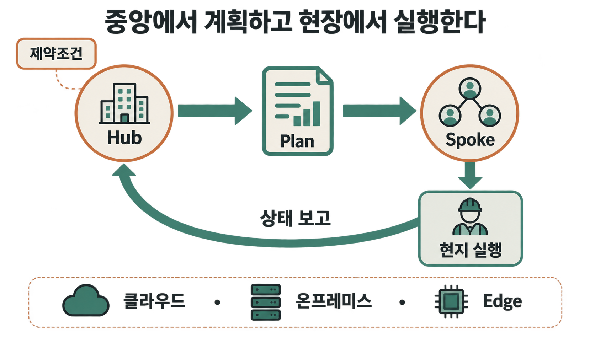
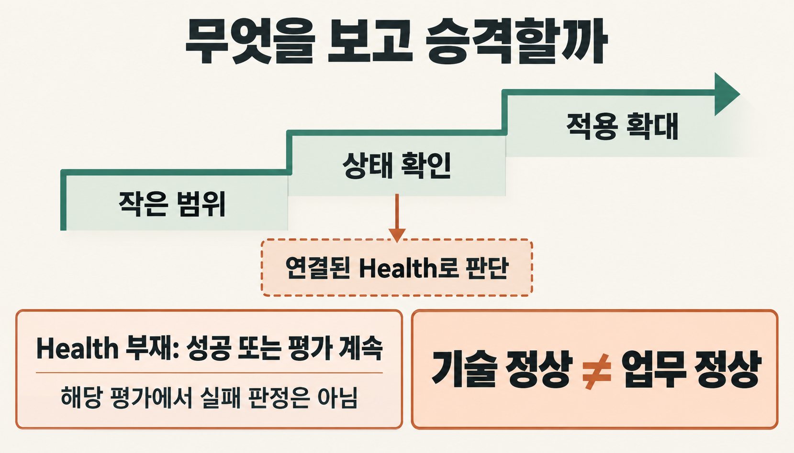
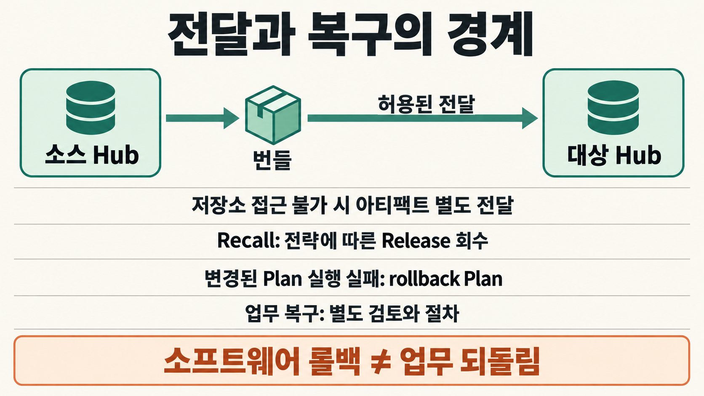

버그를 고치고 테스트도 통과했는데, 운영팀은 왜 배포를 미룰까요? 공장과 물류센터, 현장 장비가 실제 업무를 처리하는 시스템이라면 코드가 정상적으로 실행된다는 확인만으로는 부족합니다. 새 버전 하나가 생산과 출하, 승인 절차에 영향을 줄 수 있기 때문입니다.

개발팀이 변경을 완성한 뒤에도 운영팀에는 결정할 일이 남습니다. 어느 환경부터 적용할지, 무엇을 관측하며 범위를 넓힐지, 문제가 생기면 어디에서 멈출지를 정해야 합니다. 팔란티어 Apollo는 여러 운영환경의 소프트웨어 변경을 조율하는 플랫폼입니다. 그 작동 방식을 따라가다 보면 배포가 끝난 뒤에도 남는 질문을 만나게 됩니다. **소프트웨어를 되돌리면, 이미 일어난 업무도 원래대로 돌아갈까요?** [공식 개요](https://www.palantir.com/docs/apollo/core/overview)

> [!summary] 변경을 운영한다는 것
> Apollo는 환경별 계획과 단계적 승격으로 소프트웨어 변경을 조율합니다. Health 기반 승격은 제공된 신호의 범위 안에서 평가하며, 소프트웨어 롤백 이후에도 별도의 업무 복구가 필요할 수 있습니다.

## 코드는 하나인데, 도착해야 할 세계는 여러 개다

가상의 제조 공장에서 품질검사 결과를 받아 출하 가능 여부를 판단하는 서비스를 운영한다고 해보겠습니다. 어느 날 검사 결과가 아직 들어오지 않은 생산 배치를 정상으로 처리하는 오류가 발견됐습니다. 개발팀은 결과가 누락되면 사람이 확인하는 `검토 대기` 상태로 보내도록 코드를 고쳤고, 테스트도 마쳤습니다. 실제 고객의 사건이나 실험 결과가 아니라, 배포 과정의 판단을 살펴보기 위한 상황입니다.

수정은 끝났지만 운영팀이 바로 배포하지 않는 데에는 이유가 있습니다. 이 서비스가 한 장소에서만 돌아가는 것이 아니기 때문입니다. 퍼블릭 클라우드와 내부 데이터센터뿐 아니라 현장 가까이의 Edge 환경에도 설치돼 있고, 그중에는 연결이 불안정하거나 외부망과 분리된 곳도 있다고 가정해 보겠습니다. 같은 코드라도 각 환경에서 받아들일 수 있는 변경의 조건은 달라집니다.

이제 운영팀은 버전의 완성 여부에 더해 지금 이 환경에 적용해도 되는지를 판단해야 합니다. Apollo는 이러한 환경별 소프트웨어 전달과 변경을 다룹니다. 다만 여기서 말하는 Product Release는 코드와 관리 메타데이터를 가리키며, Foundry의 모든 리소스를 하나의 원자적 묶음으로 배포한다는 뜻은 아닙니다. [Products, releases, and versions](https://www.palantir.com/docs/apollo/core/products-releases-versions)

## 중앙에서 계획하고, 실행은 현장에서 한다

여러 환경을 함께 관리하려면 중앙의 계획과 현장의 실행을 연결해야 합니다. Apollo에서는 Hub가 환경 설정과 보고된 상태를 살펴보고, 제약조건을 충족하는 실행 계획인 Plan을 발행합니다. 관리 대상 환경인 Spoke에서는 에이전트가 Plan을 받아 현지에서 실행하고 결과와 현재 상태를 Hub에 돌려줍니다. [작동 구조](https://www.palantir.com/docs/apollo/core/how-apollo-works), [Plan과 제약조건](https://www.palantir.com/docs/apollo/core/plans-and-constraints)

흐름을 줄이면 Hub가 계획을 발행하고, Spoke에서 실행한 뒤, 상태 보고를 다시 중앙의 조율에 사용하는 순환입니다. 계획을 내려보내는 일만큼 실행 후 상태를 돌려받는 일이 중요합니다. 중앙에서 정한 변경이 실제 환경에서 어떻게 끝났는지 확인해야 다음 변경도 판단할 수 있기 때문입니다.

품질검사 서비스의 새 버전도 이 구조 안에서는 모든 서버에 같은 명령을 한꺼번에 보내는 작업으로만 설명할 수 없습니다. 중앙은 각 환경의 조건에 맞춰 변경을 조율하고, 실제 실행은 현장에서 이뤄집니다. 그렇다면 다음으로 정할 것은 적용 범위입니다. 준비된 버전을 모든 환경에 동시에 보내는 것이 좋을까요, 아니면 일부에서 먼저 확인하는 것이 좋을까요?

## 모든 곳을 한 번에 바꾸는 것이 정말 빠른 길일까?

한꺼번에 적용하면 빨리 끝날 수 있지만, 잘못된 변경의 영향도 한꺼번에 퍼질 수 있습니다. 앞의 가상 사례에서는 누락된 검사 결과를 놓치지 않으려던 수정이 정상 배치까지 지나치게 많이 보류하게 만들 수도 있습니다. 서비스 자체는 실행되더라도 기존 업무 절차와 맞지 않거나 다른 서비스와 예상하지 못한 문제가 생길 여지가 있습니다.

Apollo의 Release Channel과 promotion pipeline은 시간이나 상태 조건에 따라 릴리스의 승격을 관리합니다. 카나리 방식에서는 선택한 시험 환경에서 조건을 평가하고 다음 채널로 넘길지를 정합니다. 작은 범위에서 상태를 확인한 뒤 적용 범위를 넓히는 흐름을 구성할 수 있습니다. [승격 파이프라인 설정](https://www.palantir.com/docs/apollo/managing-release-channels/configure-promotion-pipeline)

운영팀은 이 과정에서 어디까지 먼저 적용할지, 어떤 조건이면 확대하고 어떤 상태에서는 멈출지를 정합니다. 다만 범위를 작게 나눴다는 사실만으로 변경이 안전해지지는 않습니다. 다음 단계로 넘어갈 근거가 무엇인지까지 살펴봐야 합니다.

## 그런데 무엇을 보고 “괜찮다”고 판단할까?

프로세스가 살아 있고 요청에 응답하며 준비 상태도 정상이라면, 서비스가 작동하고 있다는 중요한 단서를 얻습니다. 그러나 그 단서가 업무 결과의 올바름까지 보장하지는 않습니다. 품질검사 서비스의 CPU 사용량과 API 응답은 정상인데 검토 대기 배치가 쌓여 현장 업무가 막히는 상황을 떠올려 보면 차이가 분명해집니다. **서비스가 살아 있다는 것과 업무가 제대로 돌아간다는 것은 다른 판단입니다.**

Apollo의 Health 기반 승격도 제공된 신호에 따라 평가합니다. 공식 문서에 따르면 Health를 제공하지 않는 대상은 liveness와 시간만으로 승격을 평가합니다. 이때 해당 평가는 성공하거나 평가를 계속할 수 있지만 실패로 판정되지는 않습니다. 이는 그 승격 평가의 한계에 관한 설명이지, 모든 장애 감지가 사라진다는 뜻은 아닙니다. [Health 기반 승격 조건](https://www.palantir.com/docs/apollo/managing-release-channels/configure-promotion-pipeline)

따라서 운영팀은 정상 신호의 존재뿐 아니라 그 신호가 무엇을 확인하는지도 살펴야 합니다. 프로세스의 생존 여부를 확인하는 신호를 품질 판정의 정확성까지 검증한 결과로 읽어서는 안 됩니다. 자동화가 어떤 정보를 받아 어떤 조건을 평가하는지 알아야, 아직 확인하지 못한 업무 위험도 남겨둘 수 있습니다.

## 인터넷이 없는 곳에는 어떻게 배포할까?

관측할 신호와 적용 조건을 정했더라도, 변경을 대상 환경에 전달하는 문제가 남습니다. 특히 보안 때문에 외부 네트워크와 분리된 곳이라면 중앙에서 배포를 시작한다고 곧바로 현장까지 업데이트되지는 않습니다. 연결된 환경에서 사용하던 전달 경로를 그대로 전제할 수 없기 때문입니다.

Apollo는 이런 상황에 export/import 흐름을 제공합니다. 소스 Hub에서 필요한 정보를 번들로 준비하고, 조직이 허용한 방식으로 옮긴 뒤 대상 Hub에서 가져옵니다. 소스 Hub가 아티팩트 저장소에 접근하지 못한다면 실제 아티팩트를 전달하는 책임도 별도로 다뤄야 합니다. 배포 관리 기능이 물리적인 통신 경로나 반입 절차까지 만들어 주는 것은 아닙니다. [Export/import](https://www.palantir.com/docs/apollo/export-import/overview)

이 차이를 이해하려면 운영환경을 생애주기, 실행 위치, 연결 상태로 나눠 생각하면 편합니다. 개발·검증·운영 중 어느 단계인지는 생애주기의 문제이고, 클라우드·온프레미스·Edge 중 어디에 있는지는 실행 위치의 문제입니다. 상시 연결인지 간헐적 연결인지, 망이 분리돼 있는지는 또 다른 조건입니다. 세 가지는 설명을 위한 틀이며 Apollo의 공식 분류 체계는 아닙니다.

예를 들어 내부 데이터센터에 있는 운영 시스템이라도 중앙과의 연결 조건은 따로 확인해야 합니다. 환경을 온프레미스라고 부르는 것만으로 전달 방식이나 검증 조건이 정해지지는 않습니다. 어디에서 실행되는지와 어떻게 연결되는지를 구분해야 해당 환경에 맞는 변경 계획을 세울 수 있습니다.

## 그리고 결국 문제가 생겼다

이제 품질검사 서비스의 새 버전을 일부 환경에 적용했다고 가정해 보겠습니다. 서비스는 요청에 정상적으로 응답했지만, 시간이 지나면서 현업 담당자가 정상 배치까지 지나치게 많이 검토 대기로 넘어가는 현상을 발견했습니다. 운영팀은 적용 확대를 계속할지, 멈추고 문제의 릴리스를 회수할지 결정해야 합니다.

이때 Recall과 rollback을 구분할 필요가 있습니다. Recall은 정해진 전략에 따라 문제가 있는 Release에서 관리 대상을 벗어나게 하는 흐름으로, 항상 직전 버전으로 돌아간다는 뜻은 아닙니다. 반면 Plan 실행이 실패하고 환경에 실행 전과 다른 상태가 남았다면, Apollo는 이전 상태를 복원하기 위한 rollback Plan을 발행합니다. 업무상의 이상을 발견하는 것과 Plan 실행 자체가 실패하는 것도 같은 사건은 아닙니다. [Release 회수](https://www.palantir.com/docs/apollo/recalling-releases/overview), [Plan 실행과 복구](https://www.palantir.com/docs/apollo/core/how-apollo-works)

운영자는 이런 변경을 조직의 통제 아래 다뤄야 하며, Apollo의 [변경 관리](https://www.palantir.com/docs/apollo/managing-changes/overview)도 그 책임과 연결됩니다. 하지만 적절한 소프트웨어 상태로 복구했다는 사실만으로 모든 문제가 끝났다고 볼 수는 없습니다. 변경된 서비스가 이미 수행한 업무는 별도로 남을 수 있기 때문입니다.

## 롤백했다고 현실까지 되돌아가는 것은 아니다

앞에서는 너무 많은 배치를 보류하는 오류를 살펴봤습니다. 이번에는 반대로, 새 버전이 검토해야 할 배치를 출하 가능하다고 잘못 판단한 경우를 가정해 보겠습니다. 그 결과가 이미 다른 시스템으로 전달된 뒤 소프트웨어를 이전 버전으로 복구했다면, 앞서 내려진 출하 결정도 자동으로 취소될까요?

이미 사람이 승인을 마쳤거나 설비가 움직였고, 물건이 다음 공정으로 넘어갔을 수도 있습니다. 이런 업무 결과는 소프트웨어 버전을 바꾼다고 함께 사라지지 않습니다. **소프트웨어 롤백과 이미 수행한 업무의 취소는 별개입니다.** Software Rollback ≠ Business Reversal이라는 대조는 바로 이 차이를 가리킵니다.

앞의 가상 사례에서는 복구하는 동안 출하 판단을 잠시 중지하거나 승인된 별도 검토 절차가 필요할 수 있습니다. 무엇을 보류하고 누가 다시 확인할지는 해당 업무에 맞춰 정해야 합니다. 소프트웨어를 안전한 상태로 돌리는 절차와 업무를 안전한 상태로 만드는 절차를 구분해야 복구가 어디까지 끝났는지도 알 수 있습니다.

## 변경을 운영하려면 무엇을 정해야 할까

품질검사 서비스의 변경을 따라오면 운영팀이 정해야 할 항목들이 서로 연결됩니다. 처음 적용할 환경과 범위를 고르는 일은 관측할 신호를 정하는 일과 이어지고, 중단 조건은 복구 책임과 맞물립니다. 한 항목이 비어 있으면 새 버전을 전달하는 데 성공하더라도 다음 판단에서 막힐 수 있습니다.

Apollo는 환경별 계획과 승격, 상태 보고, 회수와 복구를 소프트웨어 변경 과정에 연결합니다. 그렇다고 신호 설계와 현장 전달, 업무 복구 절차를 준비하는 비용까지 없어지지는 않습니다. 자동화가 맡는 범위와 조직이 직접 판단할 범위를 구분한 상태에서 운영해야 합니다.

## 좋은 운영 시스템은 변화를 막지 않는다

업무 규칙과 데이터 구조, AI 모델과 보안 정책은 운영 중에도 바뀝니다. 변경을 피하는 것만으로 안정성을 유지하기 어려운 이유입니다. 중요한 것은 변경을 반복하면서도 그 범위를 조절하고, 이상을 확인했을 때 멈추거나 복구할 수 있는지입니다.

다음 배포를 앞두고 있다면 버전의 준비 여부에 더해 처음 적용할 범위, 확대를 판단할 신호, 중단 뒤의 복구 책임을 함께 확인해 보세요. 어느 하나라도 답하기 어렵다면 아직 준비해야 할 운영 조건이 남아 있는 셈입니다. Apollo를 이해하는 출발점도 새 버전을 얼마나 빨리 보내느냐보다, 그 변경을 어디까지 받아들여도 되는지 판단하는 데 있습니다.

## 관련 글

[[notes/온톨로지/palantir-foundry-aip-operational-loop|팔란티어 Foundry와 AIP의 운영 루프]]
