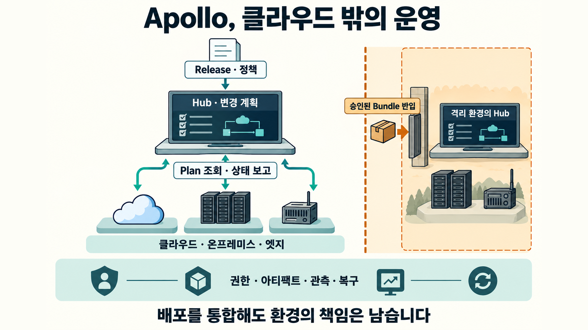
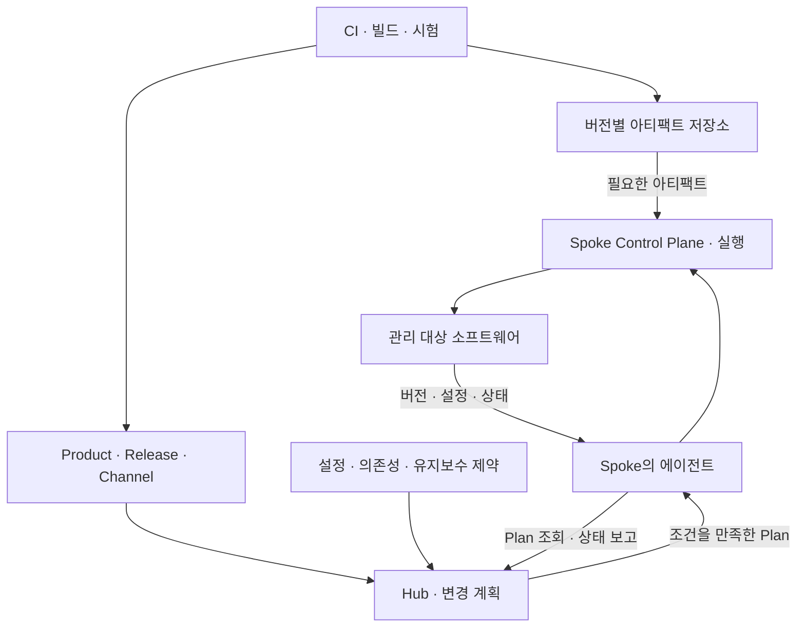
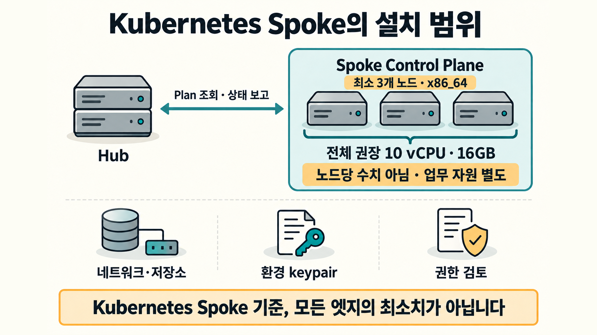
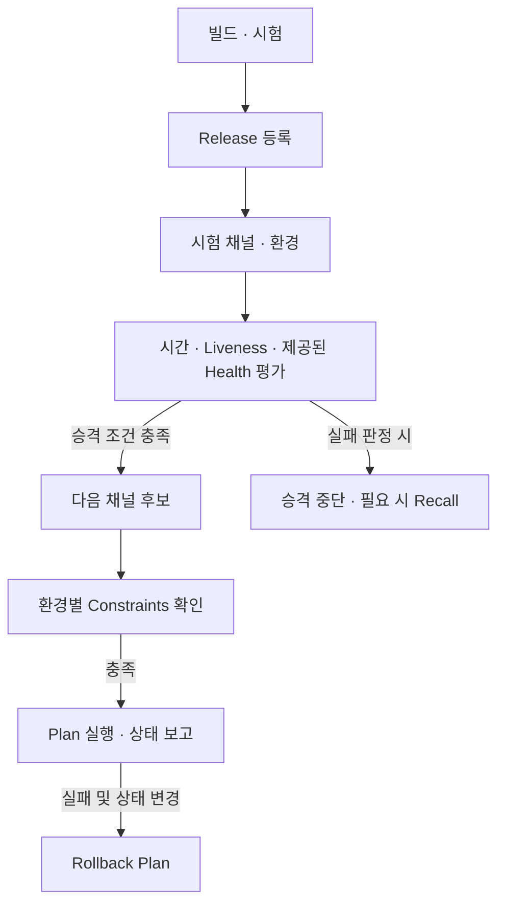
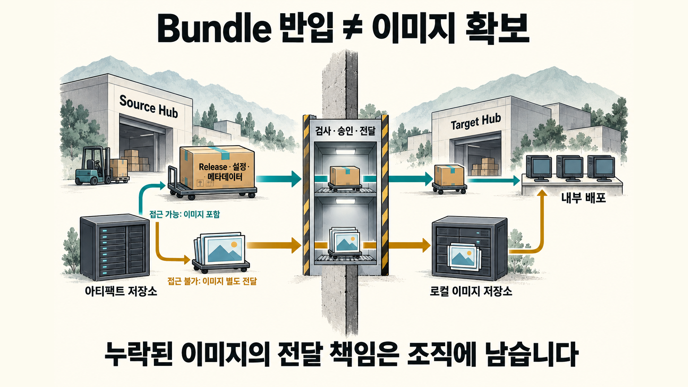
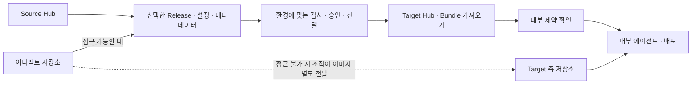
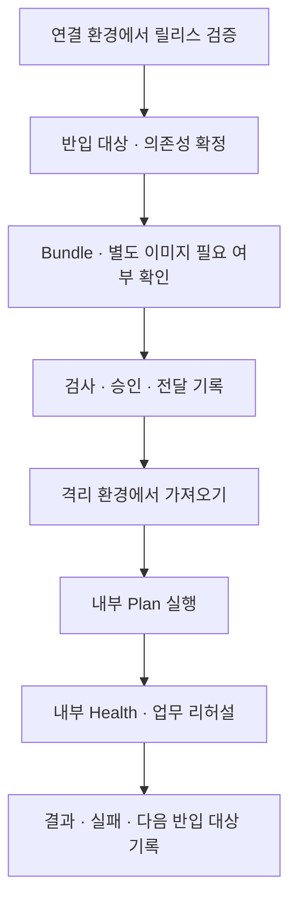
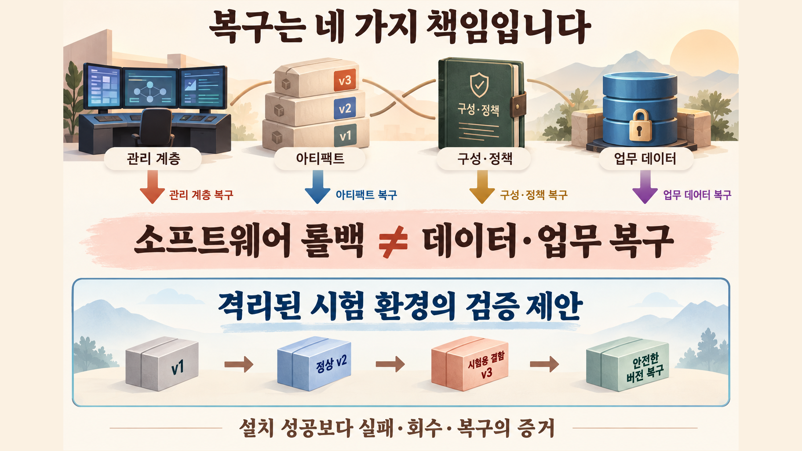

클라우드에서 정상 배포된 보안 패치를 공장 서버와 인터넷이 끊긴 업무망에도 같은 방식으로 적용할 수 있을까요? 본사 서비스, 고객 데이터센터의 설치본, 간헐적으로 연결되는 현장 장비가 같은 프로그램을 사용한다고 가정해 보겠습니다. 프로그램을 빌드하는 일은 한 번이어도, 전달 경로와 승인 절차, 장애를 확인하는 방법은 환경마다 달라집니다.

**Palantir Apollo는 이렇게 흩어진 소프트웨어의 배포와 변경을 조정하는 플랫폼입니다.** 데이터를 분석하거나 업무 결정을 내리는 도구라기보다, 어느 환경에서 어떤 소프트웨어 변경을 실행할 수 있는지 판단하고 현지 실행 결과를 다시 받는 운영 계층에 가깝습니다. 중앙의 Hub가 계획을 만들고, 관리 대상 환경인 Spoke의 에이전트가 이를 가져와 실행합니다.[^overview]

설치 자동화만으로 현장 운영이 끝나지는 않습니다. 통신이 끊긴 장비에 무엇을 전달할지, 새 버전이 잘못됐을 때 어디까지 되돌릴지, 데이터와 업무 결과는 누가 복구할지도 정해야 합니다. **Apollo의 도입 가치는 배포 명령을 줄이는 데서 끝나지 않고, 서로 다른 환경에서도 반복 가능한 변경 절차를 유지할 수 있는지에 달려 있습니다.** 이는 제품 구조에서 도출한 운영 판단이며 비용 절감이 실측됐다는 뜻은 아닙니다.

> [!summary] 배포를 통합해도 환경의 책임은 남습니다
> Apollo의 현행 구조는 Hub·Spoke·에이전트와 조건을 만족한 Plan으로 이해하는 편이 정확합니다. 클라우드 밖에서는 설치 자원, 권한, 아티팩트 반입과 관측을 별도로 준비해야 하며, 소프트웨어 롤백과 데이터·업무 복구도 나눠 검증해야 합니다.

## 소프트웨어를 만드는 일과 전달하는 일

CI가 소스코드를 빌드하고 시험해 버전이 붙은 결과물을 만든다면, Apollo는 그 이후의 배포와 운영을 맡습니다. Product는 배포할 소프트웨어를, Release는 코드와 메타데이터가 결합된 버전을 나타냅니다. 공개 문서에는 Helm chart 기반 배포와 아티팩트를 다루는 개념이 설명돼 있습니다. Apollo를 소스 관리나 CI 전체의 대체품으로 이해하면 역할이 불필요하게 커집니다.[^products]

| 질문                              | 구분해서 볼 답                                                                                                                         |
| --------------------------------- | -------------------------------------------------------------------------------------------------------------------------------------- |
| Apollo가 Kubernetes인가요?        | Kubernetes 자체가 아니라 관리 환경의 소프트웨어 변경을 조정하는 플랫폼입니다. Kubernetes 기반 Spoke를 구성하는 문서가 별도로 있습니다. |
| 기존 CI를 없애야 하나요?          | CI와 소프트웨어 전달은 다른 단계입니다. 기존 빌드·테스트 결과물을 Release로 연결하는 방법부터 확인합니다.                              |
| 모든 환경이 항상 같은 버전인가요? | 아닙니다. 채널, 의존성, 유지보수 시간과 다른 제약에 따라 실행 가능한 변경이 달라집니다.                                                |
| 망이 끊겨도 즉시 업데이트되나요?  | 아닙니다. 단절된 Hub에는 승인된 전달 경로로 Bundle과 필요한 이미지를 반입해야 합니다.                                                  |
| 장애가 나면 전부 원상복구되나요?  | Release 회수, 소프트웨어 상태 복구, 데이터·외부 업무 효과의 복구는 서로 다릅니다.                                                      |

표의 제품 역할은 공식 개념 문서를 바탕으로 정리했으며, 데이터·업무 책임 분리는 운영 설계상의 구분입니다.[^overview][^products][^how][^export]

단일 클러스터에 몇 개의 애플리케이션을 배포하는 팀이라면 기존 전달 도구만으로 충분할 수 있습니다. 고객망마다 별도 작업표와 설치 절차를 유지하는 조직에서는 같은 소프트웨어를 여러 환경에 전달하면서 변경 조건을 일관되게 유지하는 문제가 더 커집니다. 도구의 개수보다 이 운영 차이가 도입 검토의 출발점입니다.

공장 품질 검사 서비스의 보안 패치를 전달하는 **가상 상황**을 따라가 보겠습니다. CI가 수정 코드를 빌드·시험해 `v2`를 만들면 이를 Release로 등록하고, 제한된 시험 환경에서 관찰 시간과 제공된 Health 신호로 다음 단계에 보낼지 평가합니다. 승격 조건을 충족하더라도 연결된 공장에서는 유지보수 시간·의존성 등 허용된 변경 조건을 만족해야 Plan을 실행합니다. 외부망과 단절된 사업장에는 검사·승인을 거친 Bundle을 반입해 내부 Hub에서 가져옵니다. 필요한 이미지가 Bundle에 포함되지 않았다면 승인된 경로로 이미지를 별도 전달하고, 내부에서도 변경 조건을 확인합니다. 이는 전달 절차를 설명하는 예시이며, 실제 시험 결과나 비용 절감, 즉시 업데이트를 뜻하지 않습니다.[^products][^promotion][^plans][^export]

## 현재 구조는 Hub와 Spoke에서 출발합니다

Hub는 Product catalog와 환경의 보고 상태를 참고해 변경을 계획합니다. Spoke는 실제 소프트웨어가 관리되는 환경이며, 에이전트가 Hub를 조회해 Plan을 가져오고 결과를 보고합니다. Plan은 버전 업그레이드나 설정 변경 같은 작업 단위입니다. 실행에 필요한 Constraints가 만족되어야 전달됩니다.[^overview][^plans]

**이를 ‘Git에 적은 단 하나의 목표 버전으로 모든 환경을 수렴시킨다’고 단순화하면 현행 설명과 어긋납니다.** 공식 문서는 특정한 하나의 target state를 두는 방식과 Apollo를 구별합니다. 추적하는 Product와 Release Channel, 적용 가능한 설정과 제약을 함께 고려해 실행할 Plan을 결정합니다.[^how]

개념 관계를 단순화한 설명용 도식입니다. 실제 네트워크 접속 목록이나 전체 내부 서비스 구성을 대신하지 않습니다.

| 계층                    | 현재 공개 문서에서 확인되는 역할                   | 혼동하지 않을 점                                        |
| ----------------------- | -------------------------------------------------- | ------------------------------------------------------- |
| Hub                     | 카탈로그와 보고 상태를 바탕으로 Plan을 평가합니다. | 데이터 분석·업무 승인 전체의 책임자가 아닙니다.         |
| Spoke                   | 관리 대상 소프트웨어가 있는 환경입니다.            | 실행 위치와 개발·운영 단계를 같은 축으로 섞지 않습니다. |
| 에이전트                | Plan을 조회하고 실행 결과를 보고합니다.            | 모든 장비·OS가 지원된다는 뜻은 아닙니다.                |
| Spoke Control Plane     | 대상 환경에서 소프트웨어 생애주기를 관리합니다.    | 구성요소 공개와 내부 HA 보장 공개는 다릅니다.           |
| Product·Release·Channel | 소프트웨어와 버전, 배포 후보 집합을 표현합니다.    | 채널 추적과 하나의 버전 고정은 다릅니다.                |
| Plan·Constraints        | 변경 작업과 실행 조건을 표현합니다.                | 조건에 막힌 대기를 곧바로 장애로 판단하지 않습니다.     |

역할은 공식 Overview, Products 및 Plans 문서에서 확인할 수 있습니다.[^overview][^products][^plans]

과거 설계를 설명하는 자료의 **Skylab, deployment agent, Service Layout Specification(SLS)**은 역사적 맥락으로 구분해야 합니다. 출처 절에 안내한 보존 보고서는 이 명칭으로 환경별 관리자와 서비스 패키징을 설명하지만, 이를 현행 외부 고객용 모듈·SDK·패키지 형식으로 그대로 치환할 근거는 확보하지 못했습니다. 역사적 도식과 설명은 연구 자료에 보존하고, 현재 설치 판단은 현행 문서를 기준으로 삼는 편이 안전합니다.

## 환경을 나눌 때는 연결 조건을 먼저 봅니다

본사 클라우드와 공장 서버가 모두 안정적으로 Hub와 통신할 수 있다면 전달 경로의 일부를 공통으로 설계할 수 있습니다. 반대로 같은 데이터센터 안에서도 한 구역이 완전히 단절됐다면 다른 반입·운영 절차가 필요합니다. Apollo의 Export and Import는 원본 Hub와 연결할 수 없는 환경에 다른 Hub를 두고 정보를 전달하는 모델을 설명합니다.[^export]

| 환경              | 먼저 설계할 대상                        | 남는 운영 책임                                   |
| ----------------- | --------------------------------------- | ------------------------------------------------ |
| 퍼블릭 클라우드   | Hub 연결, 이미지 저장소, 배포 채널      | IAM, 지역·데이터 경계, 비용과 서비스 가용성      |
| 멀티클라우드      | 환경별 연결과 공통 Release 관리         | 사업자별 네트워크·스토리지·컴퓨팅 차이           |
| 연결형 온프레미스 | 고객망의 제한 연결, 인증서와 저장소     | 하드웨어 수명, 방화벽·DNS·프록시, 현장 대응      |
| 정부·기밀 환경    | 승인 경계에 맞는 관리·전달 경로         | 해당 offering과 환경의 보안 심사·변경 승인       |
| 간헐 연결 엣지    | 단절·재접속, 로컬 관측, 대상 적합성     | 장비 자원, 대역폭, 물리 보안, 현장 교체          |
| 완전 에어갭       | Source Hub에서 Target Hub로 Bundle 반입 | 검사·승인·매체 관리, 이미지 누락 여부, 내부 검증 |

이 표는 공식 지원 구성표가 아니라 도입 검토용 운영 분류입니다. 표에 등장한 모든 장비가 같은 에이전트로 지원된다고 가정하지 않습니다. ‘멀티클라우드 지원’과 ‘모든 클라우드의 모든 관리형 서비스가 동일하게 지원됨’도 다른 주장입니다. 사업자 이름만으로 네트워크, 저장소, Kubernetes 배포판과 버전의 호환성을 판단할 수는 없습니다.

온프레미스에서도 소프트웨어 버전 관리는 통합할 수 있지만 전원·디스크 교체와 내부 DNS 장애까지 사라지지는 않습니다. 엣지에서는 중앙이 마지막으로 받은 상태가 지금 현장의 상태인지도 확인해야 합니다. 배포 도구의 문제와 인프라·연결의 문제를 나눌 수 있어야 잘못된 재시도를 줄일 수 있습니다.

## Kubernetes Spoke의 설치 조건은 공개되어 있습니다

Apollo의 공개 정보가 제품 소개에만 머문다는 설명은 수정할 필요가 있습니다. **2026년 9월 11일 확인한 공식 문서에는 Kubernetes Spoke의 준비 조건과 Spoke Control Plane 구성, 인증·권한 문서가 있습니다.** 준비 조건이 공개됐다는 것과 계정이나 환경별 설정 없이 누구나 설치할 수 있다는 것은 다릅니다.[^prereq][^spoke][^authn][^authz]

| 항목            | 공식 문서의 조건                                                      | 적용 범위와 확인할 점                                   |
| --------------- | --------------------------------------------------------------------- | ------------------------------------------------------- |
| Kubernetes      | CNCF 인증 배포판, 커뮤니티에서 지원되는 버전                          | 고정된 버전 번호를 임의로 적지 않습니다.                |
| 노드 수         | 최소 3개 compute node                                                 | 단일 소형 엣지 장비에 대입할 조건이 아닙니다.           |
| 자원            | Spoke Control Plane 전체에 총 10 vCPU·16GB 메모리 권장                | 노드당 최소치나 전체 workload 필요 자원이 아닙니다.     |
| 아키텍처        | x86_64 노드                                                           | ARM 지원을 이 문서에서 추론하지 않습니다.               |
| 초기 접근       | 같은 Environment 안의 인스턴스에 초기 설치용 root 접근                | 설치 이후 권한 모델과 구분합니다.                       |
| 연결·저장소     | 노드 간 통신, control plane과 compute 간 통신, 기본 StorageClass와 PV | 데이터 백업은 별도 설계가 필요합니다.                   |
| Hub 신뢰        | egress IP 허용 목록, 환경 keypair와 구성                              | 주소·인증서·프록시 정책을 환경별로 확인합니다.          |
| Kubernetes 권한 | Helm 생애주기 관리를 위한 wildcard RBAC 요구                          | 권한 범위·운영 주체·감사 방법을 보안 검토에 포함합니다. |

수치는 문서가 설명하는 **Kubernetes Spoke Control Plane**에 한정됩니다. workload의 replica 수, 데이터 처리량, 이미지 캐시와 로그 저장량에 따라 전체 자원은 달라집니다.[^prereq]

공개 구성에는 Helm chart 생애주기를 관리하는 `helm-chart-operator`, 인증 정보를 중개하는 `apollo-auth-broker`, Kubernetes 관측 상태를 Apollo 모델로 변환하고 건강도 정보를 수집하는 `expected-state-k8s` 등이 있습니다. `helm-chart-operator`는 다른 Spoke 서비스보다 먼저 설치되는 구성요소로 설명됩니다.[^spoke]

선택적 이미지 레지스트리 재작성 기능은 Kubernetes admission webhook을 사용합니다. 문서의 **TCP 9111**은 이 webhook에 대한 API server와 서비스 간 연결 조건입니다. ‘Apollo는 9111 포트만 열면 된다’는 전체 방화벽 규칙이 아닙니다. 실제 사용 기능에 맞는 연결 목록을 받아 검토해야 합니다.[^spoke]

설치 검토에서는 ‘어느 구성요소의 자원인가’, ‘누가 어떤 권한으로 운영하는가’, ‘장애가 나면 고객과 공급자가 각각 무엇을 복구하는가’를 나눠 답하는 것이 중요합니다.

## 안전한 업데이트는 빌드 다음부터 시작됩니다

새 Release가 만들어졌다고 모든 환경이 곧바로 바뀌지는 않습니다. 버전과 설정, 의존성과 다른 제약을 함께 고려합니다. 실행 결과가 다시 보고되어 이후 판단의 입력이 되므로, 배포가 멈췄을 때는 실패인지 실행 조건을 기다리는 것인지 먼저 구분합니다.[^plans]

| 단계             | 주된 입력·작업                         | 확인할 책임                         |
| ---------------- | -------------------------------------- | ----------------------------------- |
| 소스·빌드        | 소스 변경, 빌드, 단위·통합 시험        | 개발팀과 CI 운영팀                  |
| 아티팩트·Release | 버전별 이미지·패키지, 메타데이터       | 출처 추적, 저장소 접근, 재현 가능성 |
| 채널·설정        | 배포 후보, 환경 설정, 의존성           | 제품·환경 담당자의 변경 정책        |
| Plan 평가        | 실행 가능한 변경과 제약 확인           | 유지보수 시간, 의존성, 억제 상태    |
| 현지 실행        | 에이전트와 Spoke의 작업 수행           | 연결, 자원, 실행 결과               |
| 승격 평가        | 시간, liveness, 제공된 Health          | 무엇을 정상으로 볼지 정하는 기준    |
| 회수·복구        | 확산 차단과 문제 Release에서 이탈·복원 | 안전한 대체 버전, 데이터·업무 보정  |

제품 동작은 공식 Product·Plan·승격·회수 문서에 근거합니다. 담당자 배정은 조직이 결정할 운영 제안입니다.[^products][^plans][^promotion][^recall]

Canary는 제한된 시험 환경에서 새 버전을 먼저 관찰하는 방식이고, soak time은 다음 단계 전 관찰 시간을 두는 생각으로 이해할 수 있습니다. 현재 Apollo는 시간과 시험 환경, 건강도 조건을 사용하는 승격 구성을 설명합니다. 단, **Entity가 Health를 제공하지 않으면 해당 승격 평가는 liveness와 시간에 의존하며, 그 평가에서 성공 또는 평가 중 상태는 가능해도 실패 판정은 할 수 없습니다.** 모든 Plan 실패나 장애 감지가 없어지는 뜻은 아닙니다.[^promotion]

앞서 가정한 공장 품질 검사 서비스의 프로세스가 살아 있어도 불량을 잘못 통과시킬 수 있습니다. 응답 오류율·지연 같은 기술 신호와 업무적으로 잘못된 판정·누락은 구분해야 합니다. 어떤 신호를 제공할지는 애플리케이션과 운영팀이 설계할 문제입니다. Health 표시가 녹색이라는 이유만으로 업무 적합성까지 입증되지는 않습니다.

Blue/green이나 rolling 방식도 새 인스턴스를 띄울 여유 자원과 replica, 요청 처리 방식, DB 스키마의 호환성이 필요합니다. ‘무중단 업그레이드를 조정할 수 있음’과 ‘모든 애플리케이션이 반드시 무중단임’을 구분해야 합니다. 이 조건은 특정 도구의 버튼보다 애플리케이션의 업그레이드 설계에 달려 있습니다.

### Recall과 rollback은 다른 조치입니다

Recall은 문제 Release의 추가 사용을 막고, 이미 실행 중인 곳에서 어떻게 이탈할지 정하는 행위입니다. 반드시 직전 버전으로 돌아가는 것과 같지 않습니다. 결함이 있는 구버전보다 수정된 버전으로 이동하는 편이 적절할 수도 있습니다.[^recall]

공식 동작 설명에서 Plan이 실패하고 소프트웨어 상태가 변경됐다면 이전 상태를 복원하기 위한 rollback Plan이 만들어집니다. 실패 뒤 자동으로 적용된 suppression과 사람이 만든 suppression도 같은 의미가 아닙니다. 자동 suppression 아래의 복구 예외를 수동 중단 우회 권한으로 해석하면 안 됩니다.[^how][^plans]

소프트웨어 상태가 복원돼도 이미 발송된 메시지나 외부 시스템의 작업, DB migration 결과까지 취소됐다는 뜻은 아닙니다. 잘못된 품질 판정으로 출하 지시가 나갔다면 출하 보류·재검사·기록 정정은 별도의 업무 복구입니다.

## 에어갭에서는 Bundle이 경계를 넘습니다

단절된 환경에서 중요한 질문은 ‘인터넷 없이 중앙에서 실시간 명령을 어떻게 보내는가’가 아닙니다. **어떤 변경 정보를 승인된 경로로 반입하고, 내부 Hub가 무엇을 실행하는가**입니다. 공식 문서는 Source Hub, Target Hub, Export Pipeline, Bundle을 구분합니다.[^export]

Source Hub가 아티팩트 저장소에 접근할 수 있으면 필요한 이미지를 Bundle에 포함할 수 있습니다. 접근할 수 없으면 **메타데이터만 묶일 수 있고, 이미지를 Target Hub 쪽 저장소로 전달하는 일은 조직의 책임**으로 남습니다. ‘Bundle 파일을 반입했다’와 ‘필요한 바이너리를 모두 확보했다’를 동일하게 취급하면 안 됩니다.[^export]

이 기능 위에 조직의 반입 정책을 얹어야 합니다. 악성코드 검사, 서명·출처 확인, 승인과 매체 통제, 로컬 저장소·관측 시스템, 보안 패치를 반입하는 최대 지연을 함께 정하는 방식입니다. 안전한 운영을 위한 검토 제안이지 Apollo 기본 설정이 모두 자동으로 수행한다는 주장은 아닙니다.

마지막 도식은 공식 반입 경로에 보안·운영 검증을 더한 제안입니다. Apollo는 에어갭의 제약을 없애기보다 그 안에서 반복 가능한 전달을 구성합니다. 승인 대기와 현장 반입 시간까지 없어질 것으로 기대하면 도입 뒤 일정이 어긋날 수 있습니다.

## 보안은 로그인보다 변경 권한에서 갈립니다

현재 공개 인증 문서는 **SAML federation과 표준 메타데이터 교환**을 설명합니다. 자체 SAML 연동 대신 Palantir Auth를 사용하는 선택지도 언급합니다. 권한 문서는 Team에 역할을 부여하고, 자원 유형 전체 또는 특정 Product·Environment·Release Channel에 범위를 좁히는 RBAC를 설명합니다.[^authn][^authz]

‘SSO와 RBAC가 전혀 공개되지 않았다’는 설명은 정확하지 않습니다. 그렇다고 SAML 지원만으로 모든 OIDC 조합, 에이전트 인증 프로토콜, 키 회전과 API token 수명까지 확정할 수도 없습니다. 사람의 로그인과 CI·에이전트·서비스의 신뢰 관계는 따로 검토해야 합니다.

| 보안 영역        | 공개 기능에서 출발할 점        | 조직이 확인할 질문                                |
| ---------------- | ------------------------------ | ------------------------------------------------- |
| 사람의 인증      | SAML federation, Palantir Auth | IdP·MFA·비상 계정·계정 회수 절차는 무엇인가요?    |
| 자원별 권한      | Team·역할·자원 범위의 RBAC     | Release 작성, 채널 승격, 환경 변경을 누가 하나요? |
| 변경 승인        | 운영자 수동 변경의 승인 흐름   | 승인·실행 분리와 긴급 변경을 어떻게 기록하나요?   |
| 환경 신뢰        | keypair와 Hub 연결 조건        | 인증서·키 발급·회전·폐기는 누가 맡나요?           |
| Kubernetes 권한  | 설치 문서의 wildcard RBAC      | 권한 범위와 소유자를 검토했나요?                  |
| 에어갭 공급망    | Bundle과 이미지 전달           | 누가 승인한 무엇을 반입했는지 추적되나요?         |
| 로그·데이터 경계 | 관측 신호와 운영 기록          | 민감 데이터의 분류·마스킹·보존 기준이 있나요?     |

제품 기능은 인증·권한·변경·설치·반입 문서에 근거하며 오른쪽은 운영 설계 질문입니다.[^authn][^authz][^changes][^prereq][^export]

회사 차원의 인증 목록이나 다른 cloud offering의 승인을 자신의 온프레미스 설치에 자동 적용해서는 안 됩니다. 계약 대상 제품, 호스팅 형태, 지역, 인증 경계와 고객 책임을 해당 보안 자료로 확인해야 합니다. 원문의 인증·조달 사례를 Apollo 개별 설치의 보증으로 확대하지 않는 이유입니다.

## 장애 대응은 보고 상태와 Plan부터 확인합니다

배포가 진행되지 않을 때 서버 로그만 보면 원인을 놓칠 수 있습니다. 배포 가능한 Release가 없는지, 의존성·유지보수 제약에 막혔는지, 에이전트가 연결되지 않는지, 실행된 Plan이 실패했는지는 다른 문제입니다. 공식 문서는 Plan 상태와 작업 이력, 가능한 경우 실패 원인 정보를 확인하는 경로를 제공합니다.[^plans]

| 확인 순서        | 질문                                     | 구분하려는 문제              |
| ---------------- | ---------------------------------------- | ---------------------------- |
| 채널·설정·제약   | 어떤 변경이 허용되며 무엇이 막고 있나요? | 정책에 따른 대기와 실행 실패 |
| Reported State   | 마지막 보고 버전·설정·상태는 무엇인가요? | 현재 상태와 오래된 관측      |
| Plan             | 계획이 발행됐고 에이전트가 받았나요?     | Hub 판단과 전달·연결         |
| 아티팩트         | 필요한 이미지와 패키지가 현지에 있나요?  | 저장소 접근과 반입 누락      |
| 의존성·migration | 버전 제약이나 데이터 변경 장벽이 있나요? | 안전장치와 애플리케이션 설계 |
| Health·승격      | 실패 신호를 실제로 제공하나요?           | 정상과 관측 부재             |
| 로그·추적        | 서비스 내부에서 어떤 일이 일어났나요?    | 애플리케이션 원인            |
| Recall·복구      | 확산을 멈추고 어디로 이동할까요?         | 회수와 안전한 대체 상태      |

공식 상태·Plan 모델을 바탕으로 재구성한 운영 제안입니다.[^how][^plans] 단절 환경에서는 중앙에서 보이는 시점과 현장 상태가 다를 수 있으므로 내부 관측과 반입·실행 기록을 함께 남깁니다.

과거 운영 자료의 대규모 로그량이나 주간 업데이트 횟수는 배경이 될 수 있지만, 공급자 내부 fleet의 역사적 수치를 현재 고객의 처리량·SLA로 바꿔 읽을 수는 없습니다. 대상 수, Release 빈도, 연결 상태와 관측 보존량을 고정해 별도로 측정해야 합니다.

## 복원력은 네 가지 복구로 나눠야 합니다

소프트웨어를 다시 배포하는 일과 데이터를 복구하는 일은 다릅니다. workload가 여러 replica로 실행되는 것과 Apollo 관리 계층 자체의 재해복구도 별개입니다. 공개된 Spoke 구성만으로 Hub의 전체 HA topology, 지역 장애 전환 방식, 계약 RPO·RTO를 임의로 특정하지 않습니다.

| 복구 대상       | 다시 확보해야 할 것              | 검증 질문                                          |
| --------------- | -------------------------------- | -------------------------------------------------- |
| 관리 계층       | Hub·Spoke 관리 기능과 신뢰 관계  | 관리 서비스 장애를 누가 어떤 순서로 복구하나요?    |
| 아티팩트        | 승인된 Release 이미지와 의존성   | 원본 저장소가 없어도 필요한 버전을 받을 수 있나요? |
| 구성·정책       | 버전별 설정, 채널·승인·권한 이력 | 과거의 안전한 구성을 재현할 수 있나요?             |
| workload 데이터 | DB·객체 저장소·업무 기록         | 데이터 손실 허용량과 복구 시점은 무엇인가요?       |

네 구분은 운영 설계 권고이며 공식 DR 등급이 아닙니다. **RPO는 허용할 데이터 손실 범위, RTO는 목표 복구 시간**입니다. 네 대상에 같은 숫자를 기계적으로 쓰지 말고 실제 복구 시험과 계약으로 각각 확인해야 합니다.

DB 스키마가 이전 버전과 호환되지 않으면 바이너리만 내리는 방식으로 복구되지 않을 수 있습니다. 쓰기 중단, migration의 전진 복구, 백업 복원, 외부 업무 보정 중 무엇이 필요한지 결정해야 합니다. Apollo를 백업 제품처럼 설명하면 이 책임을 놓치게 됩니다.

## 비용은 없어진 작업과 새로 생긴 작업을 함께 셉니다

검토한 공개 자료만으로 표준 사용자당·노드당 가격이나 모든 지원 등급의 응답시간을 확정하지 못했습니다. 이것이 ‘어떠한 공개 가격도 존재하지 않는다’는 전수 조사 결론은 아닙니다. 대상 환경과 지원 범위의 견적, 운영 책임과 격리망 조건을 확인할 필요가 있다는 뜻입니다.

총소유비용(TCO)을 비교할 때는 라이선스와 함께 수동 배포, 고객별 분기, 현장 출장과 장애 대응 비용이 얼마나 바뀌는지 봅니다. 중앙 정책 관리, 운영 권한 심사, 관측 신호 구현과 저장소 유지에는 새 비용이 들 수 있습니다. 아래는 측정된 순위가 아니라 비용을 빠뜨리지 않기 위한 질문표입니다.

| 비용 범주 | 연결형 클라우드      | 온프레미스            | 엣지                | 에어갭              |
| --------- | -------------------- | --------------------- | ------------------- | ------------------- |
| 계약·지원 | 관리 범위와 SLA      | 인프라 책임 경계      | 장비·사이트 범위    | 격리망 지원 조건    |
| 인프라    | 자원·저장소·네트워크 | 하드웨어와 운영 인력  | 현장 장비·예비품    | 내부 관리·저장소    |
| 전달      | 자동화와 이미지 전송 | 제한 연결·프록시      | 재접속·대역폭       | 검사·승인·반입      |
| 보안·관측 | 권한·로그·감사       | 고객망·인증서         | 물리 보안·로컬 관측 | 반입 이력·내부 관측 |
| 변경·복구 | 실패 감지·복구       | 고객별 일정·현장 대응 | 오프라인 장비 복구  | 재반입·업무 보정    |

원문의 ‘높음·중간’ 표는 환경별 비용 압력을 설명하는 정성적 판단입니다. 구매 비교에 쓰려면 기간과 대상 수, 인건비, 장애 비용과 연결 조건을 채워야 합니다. 근거 없이 ‘가장 저렴하다’거나 ‘모든 환경에서 동일한 자동화 효과가 난다’는 결론으로 바꿀 수 없습니다.

지원 계약에는 중대 장애 대응 시간, 운영 시간대, 보안 사고 통보, 고객 인프라와 공급자의 책임, 에어갭 패치 전달 주기와 지원 종료 뒤의 이관 조건을 확인합니다. 회사 전체의 대형 조달 계약을 Apollo 전용 가격표로 환산하는 방식은 피해야 합니다.

## 공개 사례는 방향과 성과를 나눠 읽습니다

Accenture는 **2026년 6월 4일** Apollo와의 협력 확대를 발표했습니다. 취약점 탐지·우선순위화와 배포·업데이트를 연결하고 Apollo가 클라우드·온프레미스·에어갭의 애플리케이션과 컨테이너 변경을 실행하는 역할을 설명합니다. 이는 협력사가 발표한 방향이지 독립적인 장기 ROI나 모든 고객의 장애 감소를 입증한 자료는 아닙니다.[^accenture]

Palantir은 **2024년 10월 2일** 공식 발표 채널에서 Edgescale AI와의 Live Edge를 소개했습니다. 여기서 VCE는 **Virtual Connected Edge**이며 클라우드 밖 물리 시스템으로 소프트웨어와 AI를 연결하려는 협력입니다. 원문의 ‘Virtual Compute Environment’와 구분해야 합니다. 특정 장비 지원이나 현재 제공 범위를 발표 하나로 확정하지는 않습니다.[^edgescale]

원문의 Security Forge 세부 시연, 과거 주간 업데이트 횟수와 로그 규모, 개별 정부 조달 사례는 연구 자료에 보존했습니다. 이번에 다시 확보한 1차 자료의 범위를 넘는 수치와 시연 결과를 새로운 제품 성능 보증으로 승격하지 않았습니다. 발표, 실제 사용, 독립적인 효과 검증은 서로 다른 증거 수준입니다.

## 도입 검증은 작은 실패를 끝까지 다뤄보는 일입니다

처음부터 복잡한 stateful workload와 에어갭을 함께 옮기면 문제 원인을 분리하기 어렵습니다. 작은 stateless 서비스를 대상으로 `v1 → 정상 v2 → 결함을 넣은 시험용 v3 → 안전한 버전 복구`를 확인하는 방법이 출발점이 될 수 있습니다. **격리된 시험 환경에서 수행할 검증 제안**이며 실제 운영 환경에 결함을 주입하라는 뜻은 아닙니다.

| 검증 항목 | 남겨야 할 증거                                        |
| --------- | ----------------------------------------------------- |
| 환경·연결 | 환경 목록, 항상 연결·간헐 연결·단절 여부, 승인된 경로 |
| 아티팩트  | Release·이미지 식별자, 저장 위치, 출처와 의존성       |
| 설정·제약 | 추적 채널, 버전별 설정, 의존성, 유지보수 조건         |
| 승격      | 시험 환경, 관찰 시간, 제공 Health와 실패 조건         |
| 실패 대응 | Plan 실패, suppression, Recall·대체 버전 선택 이유    |
| 권한·승인 | 작성자·승인자·실행자의 역할과 감사 기록               |
| 단절·복귀 | 마지막 보고 상태, 재연결 뒤 실제 동작과 예외          |
| 에어갭    | Bundle 내용, 별도 이미지, 승인·검사·실행 기록         |
| 복구      | 관리·아티팩트·구성·데이터별 책임과 시험 결과          |
| 비용·지원 | 같은 대상·기간의 운영 노력, 견적과 책임 경계          |

설치 완료 화면보다 중요한 것은 결함이 있는 시험 Release가 다른 환경으로 확산되지 않았다는 기록입니다. Health가 없거나 오래된 상태를 정상으로 오해하지 않았는지, 이미지가 빠진 Bundle에서 원인을 설명할 수 있는지, DB 변경 때문에 되돌리기가 불가능한 상황을 미리 구분했는지도 봐야 합니다.

작은 서비스의 배포·관찰·실패·복구를 검증한 다음 stateful workload, 연결형 온프레미스, 간헐 연결 엣지, 에어갭으로 넓힐 수 있습니다. 정해진 제품 도입 표준이 아니라 원인을 분리하기 위한 제안입니다. 조직의 위험에 맞춰 순서는 바꿀 수 있지만 증거가 없는 단계를 통과로 표시해서는 안 됩니다.

| 항목                                   | 현재 판단                                            |
| -------------------------------------- | ---------------------------------------------------- |
| Hub·Spoke·에이전트·Plan·Constraints    | 공개 공식 문서로 확인했습니다.                       |
| Kubernetes Spoke 조건과 일부 구성요소  | 공개돼 있으며 해당 모델의 범위 안에서 적용합니다.    |
| SAML 인증과 자원별 RBAC                | 공개 공식 문서로 확인했습니다.                       |
| 단절 환경 Export·Import                | Bundle과 별도 이미지 전달 조건을 확인했습니다.       |
| 모든 OS·장비·클라우드 서비스 지원 행렬 | 이번 검증에서 완전한 매트릭스를 확보하지 못했습니다. |
| 전체 연결·인증서·에이전트 신뢰 사양    | 실제 배포 구성에 대한 별도 확인이 필요합니다.        |
| Hub 전체 HA와 계약 RPO·RTO             | 공개 문서 일부에서 임의로 추론하지 않습니다.         |
| 표준 가격·지원 SLA·고객별 ROI          | 견적·계약과 동일 조건 측정이 필요합니다.             |

현재 확인된 항목의 근거는 아래 공식 문서이며 확인일은 2026년 9월 11일입니다. 실제 도입 시점에는 문서와 계약을 다시 확인해야 합니다.

같은 소프트웨어를 서로 다른 보안 경계와 연결 조건 안에 전달해야 한다면 Apollo의 공통 변경 모델을 검토할 이유가 있습니다. 하나의 안정된 환경에서 기존 절차로 충분하다면 추가 플랫폼의 비용과 권한·운영 복잡성을 정당화할 이유부터 찾아야 합니다. 첫 행동은 모든 시스템을 옮기는 것이 아니라 **한 서비스를 정해 전달, 관측, 실패와 복구의 증거를 남기는 것**입니다.

## 함께 읽기

[[notes/온톨로지/palantir-apollo-operating-change|34. 팔란티어 Apollo는 운영의 변경을 어떻게 다루는가]]에서는 소프트웨어 변경과 업무 변화의 책임을 비교할 수 있습니다. 업무 플랫폼의 맥락은 [[notes/온톨로지/palantir-foundry-aip-operational-loop|Foundry·AIP 운영 루프]], 이관 책임은 [[notes/온톨로지/palantir-platform-exit-readiness|플랫폼에서 빠져나올 수 있는가]]와 이어집니다.

## 출처

이 글의 바탕이 된 Apollo 운영 보고서는 별도로 보존하고, 공개 제품 문서로 확인한 내용과 미확인 주장을 구분해 재구성했습니다. 본문의 ‘원문’은 그 보존 보고서를 뜻합니다. 원본과 출처별 판단은 [연구 자료와 검증 원장](https://github.com/tteggu87/tteggu87.github.io/tree/main/research/palantir-apollo-operations-20260911)에, 다시 활용할 운영 분석과 도입 검증 절차는 [위키 색인](https://github.com/tteggu87/tteggu87.github.io/blob/main/wiki/_meta/index.md)에 정리했습니다.

[^overview]: Palantir, [Apollo Overview](https://www.palantir.com/docs/apollo/core/overview), Hub·Spoke와 기술 개요. 2026-09-11 확인.

[^how]: Palantir, [How Apollo works](https://www.palantir.com/docs/apollo/core/how-apollo-works), 보고 상태·Plan 선택·실행과 실패 뒤 복구. 2026-09-11 확인.

[^products]: Palantir, [Products, Releases, and Versions](https://www.palantir.com/docs/apollo/core/products-releases-versions), Product·Release·배포 산출물 구분. 2026-09-11 확인.

[^plans]: Palantir, [Plans and Constraints](https://www.palantir.com/docs/apollo/core/plans-and-constraints), 생애주기·제약·실패·suppression. 2026-09-11 확인.

[^prereq]: Palantir, [Spoke Environment prerequisites](https://www.palantir.com/docs/apollo/managing-environments/spoke-environment-prerequisites), Kubernetes Spoke의 노드·권장 자원·접근·연결·권한 조건. 2026-09-11 확인.

[^spoke]: Palantir, [Spoke Control Plane](https://www.palantir.com/docs/apollo/core/spoke-control-plane), 구성요소와 선택적 admission webhook. 2026-09-11 확인.

[^authn]: Palantir, [Authentication](https://www.palantir.com/docs/apollo/core/authentication), SAML federation과 Palantir Auth. 2026-09-11 확인.

[^authz]: Palantir, [Authorization via roles](https://www.palantir.com/docs/apollo/core/authorization), Team·역할·자원별 권한. 2026-09-11 확인.

[^promotion]: Palantir, [Configure a Release promotion pipeline](https://www.palantir.com/docs/apollo/managing-release-channels/configure-promotion-pipeline), 시간·canary·Health와 미제공 시 평가 제한. 2026-09-11 확인.

[^recall]: Palantir, [Recalling Releases — Overview](https://www.palantir.com/docs/apollo/recalling-releases/overview), 회수와 roll-off. 2026-09-11 확인.

[^export]: Palantir, [Export and Import](https://www.palantir.com/docs/apollo/export-import/overview), Hub 간 Bundle, 저장소 접근이 없을 때 별도 이미지 전달 책임. 2026-09-11 확인.

[^changes]: Palantir, [Managing Changes — Overview](https://www.palantir.com/docs/apollo/managing-changes/overview), 운영자 수동 변경과 승인. 2026-09-11 확인.

[^accenture]: Accenture, [Accenture and Palantir Transform Cybersecurity with Apollo](https://newsroom.accenture.com/blogs/2026/accenture-and-palantir-transform-cybersecurity-with-apollo), 2026-06-04. 협력사 발표이며 독립 효과 평가가 아닙니다. 2026-09-11 확인.

[^edgescale]: Palantir Technologies, [Live Edge 공식 발표](https://www.linkedin.com/posts/palantir-technologies_palantir-activity-7247199838541352961-RVeJ), 2024-10-02. VCE는 Virtual Connected Edge로 표기돼 있습니다. 2026-09-11 확인.

## 3줄 요약

Apollo는 서로 다른 환경의 소프트웨어 변경을 Hub·Spoke·Plan과 제약으로 조정하는 플랫폼입니다.  
Kubernetes Spoke 조건과 SAML·RBAC는 공개돼 있지만 전체 지원 범위·복구 보장·가격은 실제 구성과 계약으로 확인해야 합니다.  
한 서비스의 안전한 배포·실패·복구부터 검증하고 에어갭 반입과 데이터·업무 복구 책임을 별도로 남기는 데서 시작합니다.
