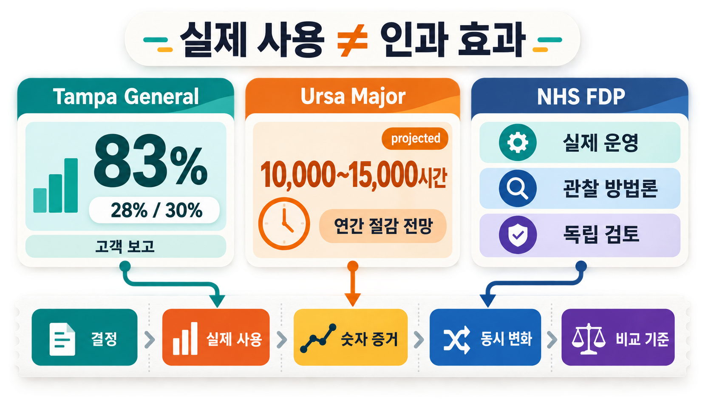
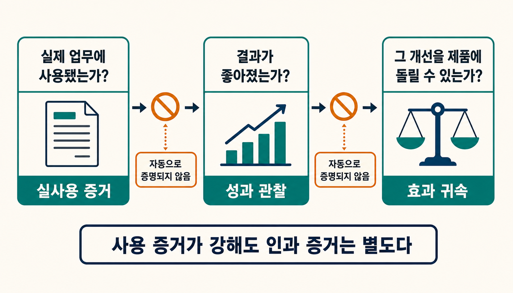
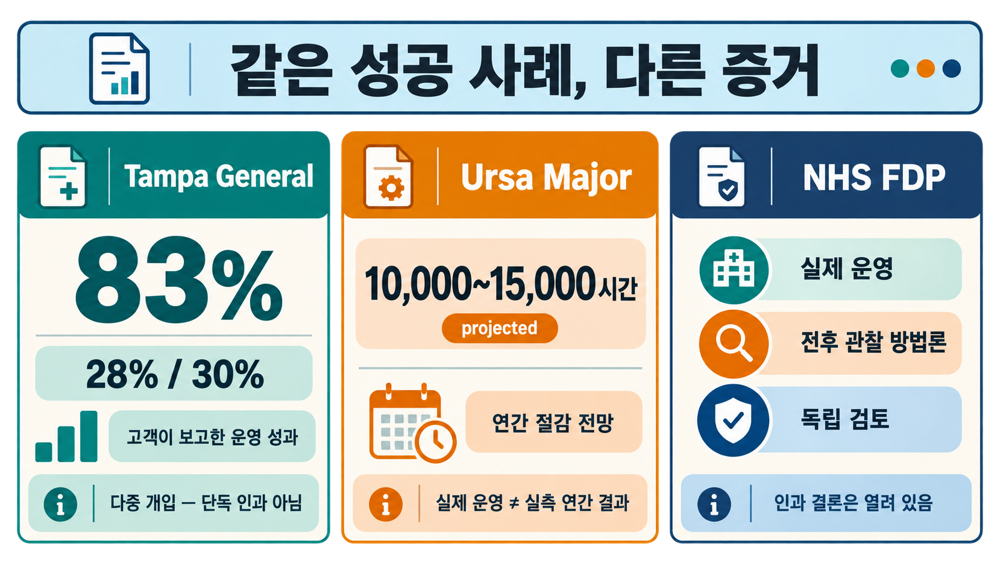
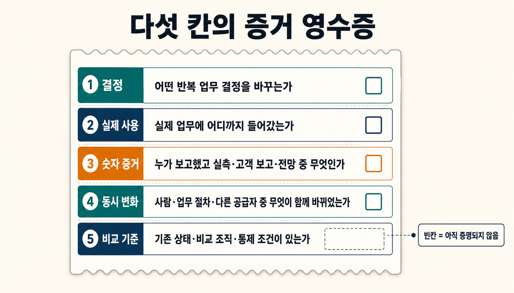

83% 감소와 연간 10,000~15,000시간 절감. 둘 다 팔란티어 고객 사례에 등장하는 숫자입니다. 그런데 같은 의미의 성과는 아닙니다.

Tampa General Hospital은 환자 배치 관리 시간이 83% 줄었다고 **보고**했습니다. Ursa Major는 엔지니어링 시간을 연간 10,000~15,000시간 절감할 것으로 **전망**했습니다. NHS의 Federated Data Platform은 실제 운영 지표를 공개하지만, NHS 자체 방법론은 전후 변화만으로 원인과 결과를 단정할 수 없다고 명시합니다. ([Tampa General Hospital](https://www.tgh.org/news/tgh-press-releases/2024/june/tgh-selects-palantir-ai-software-connected-care-coordination), [Ursa Major](https://ursamajor.com/media/blog/how-ursa-major-and-palantir-are-solving-manufacturing-challenges-at-hypersonic-speeds/), [NHS England methodology](https://www.england.nhs.uk/digitaltechnology/nhs-federated-data-platform/impact/fdp-uptake-and-benefits/methodology-uptake-and-benefits-information/))

여기서 먼저 결론을 내릴 수 있습니다.

**팔란티어가 실제 업무에 쓰이고 있다는 증거는 꽤 강합니다. 하지만 공개된 개선이 팔란티어 때문에 발생했다고 말할 수 있는 인과 증거는 훨씬 부족합니다.**

> [!summary] 먼저 결론
> 고객 사례를 읽을 때는 `도입됐다 → 사용됐다 → 성과가 났다 → 팔란티어가 원인이다`를 한 문장으로 이어서는 안 됩니다. **실제 사용, 관찰된 결과, 그 결과를 제품에 돌릴 수 있는 근거**를 따로 확인해야 합니다.

## 실제 사용과 제품 효과는 서로 다른 주장입니다

고객 사례를 읽을 때는 세 질문부터 분리하는 편이 낫습니다.

| 질문                                 | 확인하려는 것                                                             |
| ------------------------------------ | ------------------------------------------------------------------------- |
| 실제 업무에 사용됐는가?              | 발표나 시험을 넘어 현장의 반복 업무에 들어갔는가                          |
| 결과가 좋아졌는가?                   | 시간, 비용, 품질, 처리량 같은 변화가 관찰됐는가                           |
| 그 개선을 팔란티어에 돌릴 수 있는가? | 동시에 바뀐 다른 요인과 비교 기준을 고려해 제품의 기여를 구분할 수 있는가 |



첫 번째 질문에 답하는 자료와 세 번째 질문에 답하는 자료는 종류가 다릅니다.

팔란티어의 공식 use-case 문서도 기술 기능부터 시작하지 않습니다. 먼저 특정 사용자가 내려야 할 **운영 결정과 측정할 결과**를 정하고, 필요한 데이터를 연결한 뒤 업무 객체와 과정을 모델링하고 실제 사용자의 조치까지 이어가는 흐름을 설명합니다. ([Delivering a use case](https://www.palantir.com/docs/foundry/getting-started/delivering-a-use-case), [Use case lifecycle](https://www.palantir.com/docs/foundry/use-case-life-cycle/overview))

그래서 고객 사례에서도 “AI를 썼다”보다 먼저 봐야 할 것은 **무슨 업무 결정이 실제로 바뀌었는가**입니다.

Tampa General에서는 환자 배치와 병상 흐름이, Ursa Major에서는 설계 변경과 생산 작업이, NHS에서는 대기 목록·수술실·퇴원 같은 운영 결정이 대상입니다.

그다음부터 증거의 종류가 갈립니다.

## Tampa General의 83%는 강한 숫자지만, 팔란티어 단독 효과는 아닙니다

Tampa General Hospital은 2024년 팔란티어와의 확대 협력을 발표하면서, 2021년 하나의 Foundry 적용 업무(use case)에서 시작해 12개 이상의 적용 업무로 확장했다고 설명했습니다. 이후 AIP도 환자 자격·우선순위 판단, 인력 배치, 환자 일정, 수익 관리 등의 업무 흐름에 추가됐습니다.

이 발표에는 눈에 띄는 수치가 있습니다.

환자 배치 관리 시간 83% 감소, PACU hold 28% 감소, 패혈증 평균 재원일 30% 감소입니다. ([Tampa General Hospital, 2024](https://www.tgh.org/news/tgh-press-releases/2024/june/tgh-selects-palantir-ai-software-connected-care-coordination))

이 자료에서 비교적 강하게 말할 수 있는 것은 **팔란티어가 병원 운영의 실제 업무에 깊게 들어갔다는 점**입니다.

하지만 83%라는 숫자를 곧바로 “팔란티어가 환자 배치 시간을 83% 줄였다”고 옮겨 적으면 문제가 생깁니다.

Tampa General의 Care Coordination Center는 팔란티어 하나만으로 운영되는 프로그램이 아닙니다. 공개 자료에는 GE Healthcare를 포함한 다른 기술과 임상 프로세스, 병원 내부의 운영 변화가 함께 등장합니다. ([TGH Care Coordination Center](https://www.tgh.org/about-tgh/care-coordination-center))

따라서 더 정확한 문장은 다음과 같습니다.

**Tampa General이 팔란티어를 포함한 운영 변화 과정에서 환자 배치 관리 시간 83% 감소 등의 지표 개선을 보고했다.**

차이는 작아 보이지만 중요합니다.

앞 문장은 제품의 인과 효과를 주장합니다. 뒤 문장은 고객이 실제로 관찰하고 보고한 범위까지만 말합니다.

## Ursa Major의 10,000~15,000시간은 아직 실측 결과가 아니라 전망입니다

Ursa Major 사례는 다른 이유로 흥미롭습니다.

Ursa Major는 Ontology와 AIP를 활용한 제조 실행 시스템을 실제 추진체 생산 프로그램에 운영하고 있다고 설명합니다. 엔지니어링 도면과 PDF에서 디지털 업무 흐름을 만들고, 생산·품질·공급망 정보를 연결하는 구체적인 사용 장면도 공개했습니다. ([Ursa Major, 2025](https://ursamajor.com/media/blog/how-ursa-major-and-palantir-are-solving-manufacturing-challenges-at-hypersonic-speeds/))

즉, “실제 업무에 쓰이고 있는가?”라는 질문에는 상당히 구체적인 답이 있습니다.

문제는 효과 숫자의 시제입니다.

같은 글에는 몇 달간 배포한 도구가 연간 10,000~15,000시간의 엔지니어링 시간을 절약할 것으로 **projected**, 즉 전망된다고 적혀 있습니다.

이 문장은 “1년 동안 실제로 15,000시간이 절감됐다”는 뜻이 아닙니다.

실제 운영과 기대 효과를 한 문장으로 합치면,

> 실제 생산에 사용 중이며 연간 15,000시간을 절감했다.

처럼 읽히기 쉽습니다.

하지만 현재 공개 자료가 말하는 범위는 다릅니다.

> 실제 생산 업무에 사용 중이며, 연간 10,000~15,000시간의 절감 효과를 전망하고 있다.

제품 사용의 구체성은 높게 평가하면서도, 전망치를 실측값으로 바꾸지 않는 것이 중요합니다.

## NHS는 실제 사용과 인과 불확실성을 동시에 보여 줍니다

NHS Federated Data Platform 사례는 숫자가 가장 화려해서 중요한 것이 아닙니다.

오히려 **긍정적인 운영 지표와 그 지표의 한계를 함께 확인할 수 있어서** 중요합니다.

NHS FDP는 Trust와 Integrated Care Board가 각자의 인스턴스와 데이터 관리 책임을 갖고 대기 목록, 퇴원, 수술실, 암 진료 같은 업무를 운영하도록 설계돼 있습니다. NHS Digital은 2024년부터 서비스가 실제 운영 중이라고 설명하며 사용이 의무는 아니라고 명시합니다. ([NHS Federated Data Platform](https://digital.nhs.uk/services/federated-data-platform))

여기까지는 실제 사용에 대한 근거입니다.

그런데 NHS가 공개한 효과 측정 방법론을 보면 중요한 제한이 붙습니다.

주요 지표는 전후 비교이며, 다른 변수를 충분히 통제하지 못했기 때문에 **원인과 결과를 단정할 수 없다는 것**입니다. ([NHS methodology](https://www.england.nhs.uk/digitaltechnology/nhs-federated-data-platform/impact/fdp-uptake-and-benefits/methodology-uptake-and-benefits-information/))

독립 자료도 함께 존재합니다.

2026년 Health Foundation 분석은 OPTICA를 사용하는 Trust에서 비교 대상보다 측정 가능한 퇴원 성과 개선을 찾지 못했다고 보고했습니다. Office for Statistics Regulation 역시 이 분석과 NHS의 성과 지표 제시 방식, 인과 해석의 한계를 함께 검토했습니다. ([Health Foundation analysis via OSR](https://osr.statisticsauthority.gov.uk/correspondence/jennifer-dixon-to-ed-humpherson-health-foundation-analysis-of-the-impact-of-the-optimised-patient-tracking-and-intelligent-choices-application/), [OSR statement](https://osr.statisticsauthority.gov.uk/news/nhs-england-federated-data-platform-fdp-presentation-and-communication-of-information-and-performance-metrics/))

이 결과를 “FDP는 효과가 없다”는 결론으로 바꾸는 것도 지나칩니다.

확인할 수 있는 것은 더 좁습니다.

**FDP는 실제 대규모 운영에 들어갔지만, 공개된 전후 변화만으로 FDP가 개선의 원인이었다고 결론 내리기는 어렵습니다. 일부 도구에 대해서는 긍정적인 효과 해석과 맞지 않는 독립 분석도 존재합니다.**

이렇게 쓰면 긍정 자료와 반대 자료를 동시에 보존할 수 있습니다.



세 사례를 나란히 놓으면 차이가 분명해집니다.

**Tampa General은 고객이 보고한 운영 성과이고, Ursa Major는 실제 사용 위에 붙은 미래 전망이며, NHS는 실제 운영과 공개 방법론·독립 검토가 함께 존재하는 사례입니다.**

숫자의 크기보다 먼저 봐야 할 것은 숫자의 종류입니다.

## SOMPO·Panasonic·Airbus도 같은 경계에서 읽을 수 있습니다

나머지 사례는 같은 원리를 반복해서 보여 줍니다.

| 사례             | 공개 자료에서 확인할 수 있는 것                                                                                       | 아직 분리하기 어려운 것                                                  |
| ---------------- | --------------------------------------------------------------------------------------------------------------------- | ------------------------------------------------------------------------ |
| SOMPO Japan      | Foundry를 기업 화재보험 인수 업무의 주요 시스템으로 사용하며 여러 해의 연차보고서에서 데이터 기반 업무 변화를 설명    | 가격 조정, 상품·인수 절차 개편과 팔란티어의 순수한 기여도                |
| Panasonic Energy | 공장 센서와 분산 데이터를 연결하고 여러 운영 업무에 Foundry를 적용했으며 폐기·스크랩 감소와 가동률 개선을 고객이 보고 | 공개된 비교 기준·산정 방식이 제한돼 Foundry만의 효과 크기                |
| Airbus Skywise   | 2017년부터 항공 운영 데이터를 연결해 예측 정비와 신뢰성 업무에 사용                                                   | 고객 증언의 숫자를 일반적인 고객 효과나 현재 AIP 효과로 확대 해석하는 것 |

SOMPO의 2022·2023 연차보고서는 Foundry가 실제 보험 인수 업무에 쓰이고 있음을 반복해서 보여 줍니다. 그러나 같은 기간 가격 정책과 상품, 인수 절차도 함께 바뀌었습니다. 오래 사용했다는 사실만으로 소프트웨어 한 요소의 기여도가 자동으로 분리되는 것은 아닙니다. ([SOMPO 2022](https://www2.sompo-hd.com/en/ir/data/annual/online2022/cycle-new/), [SOMPO 2023](https://www2.sompo-hd.com/en/ir/data/annual/online2023/resilience/))

Panasonic Energy도 공장 센서와 데이터를 Foundry로 연결하고 수작업 중심 업무를 여러 운영 시스템으로 바꿨다고 발표했습니다. 폐기와 자재 스크랩 감소, 생산 라인 가동률 증가도 보고했습니다. 하지만 공개된 기존 상태와 산정 방식, 비교 대상은 제한적입니다. ([Panasonic Energy, 2023](https://na.panasonic.com/news/palantir-and-panasonic-energy-of-north-america-sign-multi-year-agreement))

Airbus의 Skywise는 시간 경계를 볼 때 특히 중요합니다. Skywise는 2017년부터 Palantir과 함께 구축돼 항공기 운항·정비·부품·센서 데이터를 연결해 왔습니다. ([Airbus, 2017](https://www.airbus.com/en/newsroom/press-releases/2017-06-airbus-launches-skywise-aviations-open-data-platform), [Skywise Core](https://www.skywise.com/en/digital-platform/skywise-core))

따라서 Skywise와 Panasonic 같은 장기 사례에서 나온 성과를 그대로 현재 AIP의 효과로 옮기면 또 하나의 오류가 생깁니다.

**팔란티어의 효과와 AIP의 추가 효과 역시 같은 주장이 아닙니다.**

AIP 이전부터 존재하던 Foundry 기반 업무와, AIP가 추가된 뒤 새로 달라진 부분을 구분해야 합니다.

## 고객 사례는 점수보다 다섯 칸의 영수증으로 읽는 편이 낫습니다

연구 과정에서는 실제 사용 수준과 효과 증거 수준을 여러 단계로 나눠 기록했습니다. 검토한 핵심 사례 가운데 통제군, 준실험, 무작위화처럼 제품 기여도를 강하게 식별하는 공개 평가는 확인하지 못했습니다.

하지만 독자가 고객 사례 하나를 볼 때마다 복잡한 등급표를 외울 필요는 없습니다.

다섯 칸이면 충분합니다.

```yaml
case_evidence_receipt:
  decision: 어떤 반복 업무 결정을 바꾸는가
  actual_use: 실제 업무에 어디까지 들어갔는가
  number_evidence: 숫자는 누가 보고했고, 실측·고객 보고·전망 중 무엇인가
  other_changes: 사람·업무 절차·다른 공급자 가운데 동시에 바뀐 것은 무엇인가
  comparison: 기존 상태·비교 조직·통제 조건이 있는가
```



예를 들어 Tampa General 사례를 이 형식으로 적으면 다음과 같습니다.

```yaml
case: Tampa General Hospital

decision:
  환자 배치·병상 흐름·care coordination을 어떻게 조정할 것인가

actual_use:
  2021년 Foundry 도입
  하나의 적용 업무에서 12개 이상으로 확장
  이후 AIP를 care coordination 업무에 추가

number_evidence:
  보고 주체: Tampa General Hospital
  환자 배치 관리 시간 83% 감소
  PACU hold 28% 감소
  sepsis 평균 재원일 30% 감소
  유형: 고객이 보고한 운영 결과

other_changes:
  GE Healthcare
  임상·운영 프로세스 변화
  병원 내부 시스템과 규칙

comparison:
  공개된 통제군과 팔란티어 단독 효과 산정 방식은 확인하기 어려움
```

숫자 하나만 읽을 때보다 훨씬 많은 것이 보입니다.

83%라는 숫자는 사라지지 않습니다. 다만 그 숫자가 답할 수 있는 질문의 범위가 정해집니다.

좋은 증거 영수증은 모든 칸이 채워진 문서가 아닙니다.

**모르는 칸을 모른다고 남길 수 있는 문서**입니다.

빈칸은 제품이 실패했다는 뜻도 아니고 효과가 없다는 뜻도 아닙니다. 아직 공개된 근거로는 답할 수 없다는 뜻입니다.

## 고객 사례에서 먼저 버려야 할 다섯 개의 등식

결국 고객 사례를 과장 없이 읽는 방법은 복잡하지 않습니다.

다음 다섯 개를 같은 뜻으로 취급하지 않으면 됩니다.

```text
도입 발표 = 실제 사용
실제 사용 = 정량 효과
전후 변화 = 제품 단독 인과
고객 보고 = 독립 검증
AIP 이전 Foundry 성과 = AIP의 추가 효과
```

반대 방향의 오류도 피해야 합니다.

고객 사례가 공급자나 고객의 홍보 자료에 실렸다는 이유만으로 전부 버리면 중요한 정보를 잃습니다.

고객 자료는 **어떤 조직이, 어떤 데이터를 연결하고, 어떤 사람이, 어떤 업무에서 제품을 실제로 쓰는지** 파악하는 데 매우 유용합니다.

다만 고객 자료가 답하지 못하는 질문까지 대신 답하게 해서는 안 됩니다.

## 최종 판단

여섯 사례를 함께 보면 Palantir Foundry와 AIP가 실제 현장에서 어떻게 쓰이는지는 꽤 구체적으로 보입니다.

병원의 환자 배치, 보험사의 인수 판단, 제조 현장의 품질과 생산 관리, 항공사의 정비처럼 반복되는 운영 결정을 정하고, 여러 시스템의 데이터를 연결하고, 업무 객체와 현재 상태를 맞춘 뒤 현장 사용자의 실제 조치까지 이어가는 패턴입니다.

그 점에서 팔란티어를 단순한 기업용 챗봇으로 설명하는 것은 실제 사용 방식과 거리가 있습니다.

하지만 여기서 한 문장을 더 붙여야 합니다.

**실제 업무에 깊게 들어갔다는 사실과, 관찰된 개선을 팔란티어의 인과 효과로 증명했다는 사실은 다릅니다.**

Tampa General의 83%는 고객이 보고한 강한 운영 지표입니다. Ursa Major의 10,000~15,000시간은 실제 사용 위에 붙은 전망치입니다. NHS는 대규모 실제 운영과 함께 인과 해석의 한계와 독립적인 반대 결과까지 확인할 수 있습니다.

따라서 새 AI 플랫폼이나 Agent 제품의 성공 사례를 볼 때 가장 먼저 볼 것은 가장 큰 숫자가 아닙니다.

**그 숫자를 누가 말했는지, 이미 발생한 결과인지 미래 전망인지, 동시에 무엇이 바뀌었는지, 무엇과 비교했는지**를 먼저 봐야 합니다.

이 다섯 칸이 비어 있다면 숫자가 아무리 커도 아직 강한 구매 근거라고 말하기 어렵습니다.

반대로 숫자가 작아도 이 칸들이 분명하다면, 그 사례는 다음 검증을 설계할 수 있는 훨씬 좋은 출발점이 됩니다.

## 함께 읽기

- [[notes/온톨로지/palantir-foundry-aip-operational-loop|28. 팔란티어 AIP는 왜 기업용 챗봇이 아닌가]]
- [[notes/온톨로지/opencrab-foundry-ontology-reinterpretation|27. OpenCrab은 팔란티어 Foundry의 온톨로지를 어떻게 다시 풀었나]]
- [[notes/온톨로지/agent-evaluation-evidence-ladder|24. 합성 검사를 통과한 에이전트는 왜 아직 검증되지 않았는가]]

## 참고 자료

- Palantir, [Delivering a use case](https://www.palantir.com/docs/foundry/getting-started/delivering-a-use-case)
- Palantir, [Use case lifecycle overview](https://www.palantir.com/docs/foundry/use-case-life-cycle/overview)
- Panasonic North America, [Palantir and Panasonic Energy of North America sign multi-year agreement](https://na.panasonic.com/news/palantir-and-panasonic-energy-of-north-america-sign-multi-year-agreement)
- Tampa General Hospital, [TGH Selects Palantir AI Software for Connected Care Coordination](https://www.tgh.org/news/tgh-press-releases/2024/june/tgh-selects-palantir-ai-software-connected-care-coordination)
- Tampa General Hospital, [TGH Care Coordination Center](https://www.tgh.org/about-tgh/care-coordination-center)
- SOMPO Holdings, [Value Creation Cycle — Advancement and automation of underwriting operations](https://www2.sompo-hd.com/en/ir/data/annual/online2022/cycle-new/)
- SOMPO Holdings, [Further Strengthening Resilience](https://www2.sompo-hd.com/en/ir/data/annual/online2023/resilience/)
- Ursa Major, [How Ursa Major and Palantir are Solving Manufacturing Challenges at Hypersonic Speeds](https://ursamajor.com/media/blog/how-ursa-major-and-palantir-are-solving-manufacturing-challenges-at-hypersonic-speeds/)
- NHS England Digital, [Federated Data Platform](https://digital.nhs.uk/services/federated-data-platform)
- NHS England, [Methods for the published uptake and benefits information](https://www.england.nhs.uk/digitaltechnology/nhs-federated-data-platform/impact/fdp-uptake-and-benefits/methodology-uptake-and-benefits-information/)
- The Health Foundation / Office for Statistics Regulation, [Health Foundation analysis of the impact of OPTICA](https://osr.statisticsauthority.gov.uk/correspondence/jennifer-dixon-to-ed-humpherson-health-foundation-analysis-of-the-impact-of-the-optimised-patient-tracking-and-intelligent-choices-application/)
- Office for Statistics Regulation, [FDP presentation and communication of information and performance metrics](https://osr.statisticsauthority.gov.uk/news/nhs-england-federated-data-platform-fdp-presentation-and-communication-of-information-and-performance-metrics/)
- Airbus, [Airbus launches Skywise — aviation’s open data platform](https://www.airbus.com/en/newsroom/press-releases/2017-06-airbus-launches-skywise-aviations-open-data-platform)
- Airbus, [Skywise Core](https://www.skywise.com/en/digital-platform/skywise-core)
