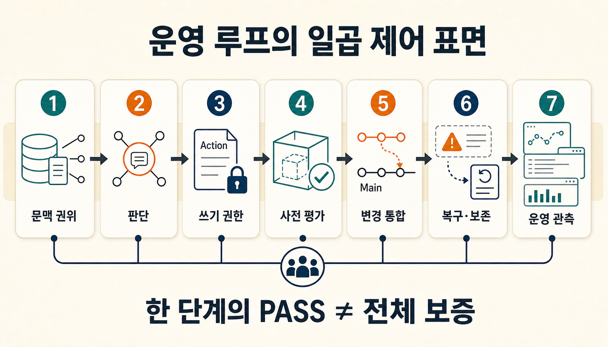
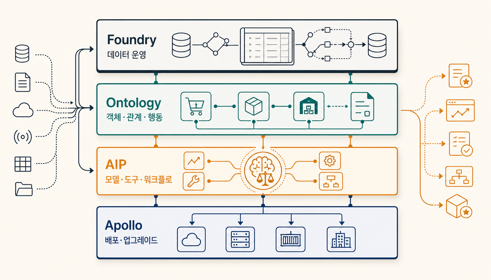
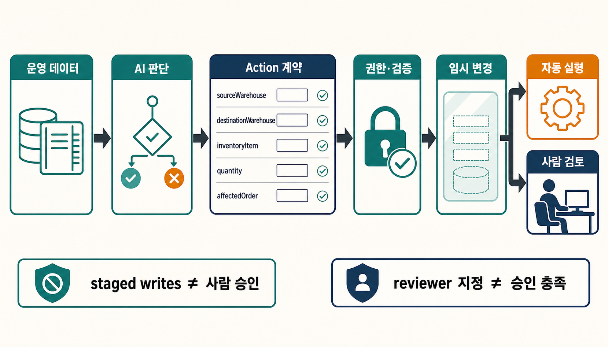
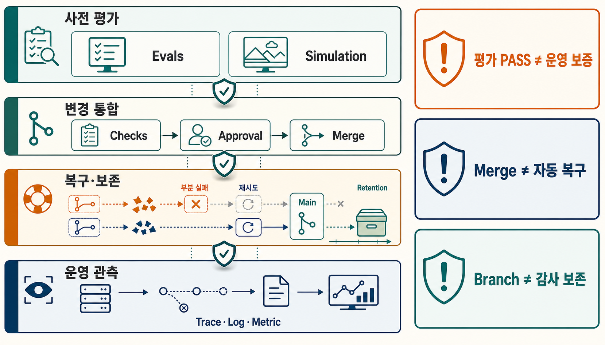

기업용 챗봇이 “재고 부족 때문에 배송이 늦어질 수 있습니다”라고 답하는 일과, 다른 창고의 재고를 실제로 재배정하는 일 사이에는 큰 간격이 있습니다. 두 번째 작업은 답변 품질만으로 끝나지 않습니다. 어느 데이터가 현재 상태인지, 어떤 주문과 재고가 연결되는지, 누가 변경을 승인할 수 있는지, 실패하면 무엇을 되돌릴지까지 정해야 합니다.

가정해 보겠습니다. 한 운영 Agent가 배송 지연 위험을 발견해 다른 창고의 재고를 옮기고 고객에게 약속한 배송일을 바꾸려 합니다. 문서를 잘 찾는 것만으로는 부족합니다. Agent가 읽는 주문·재고·배송 객체가 운영 시스템의 현재 상태와 연결돼야 하고, 허용된 변경만 실행하며, 배포 전 시험과 사람 검토를 거친 뒤, 실제 결과를 다시 관측할 수 있어야 합니다.

> [!summary] 먼저 결론
> Palantir AIP의 차이는 챗봇 화면보다 **Foundry의 데이터 운영 기반과 Ontology의 업무 계약을 AI 판단과 제한된 Action에 연결하는 방식**에 있습니다. AIP Evals, Ontology simulation, Global Branching, 복구·보존과 observability는 이 흐름의 서로 다른 제어 지점이며, 어느 하나의 PASS도 전체 운영 안전성을 대신하지 않습니다.

## 챗봇이 답하는 순간과 업무가 바뀌는 순간

문서 검색형 챗봇은 질문과 관련된 자료를 찾아 설명하는 데 강합니다. 읽기 전용 업무라면 이것으로 충분할 수 있습니다. 사내 규정, 제품 설명, 과거 보고서를 찾아 답하는 작업에 모든 조직이 복잡한 업무 객체와 변경 수명주기를 도입할 이유는 없습니다.

하지만 Agent가 주문 상태, 재고 수량, 정비 일정이나 접근 권한을 바꾸기 시작하면 질문이 달라집니다.

```text
무엇을 읽었는가?
→ 어떤 업무 객체로 이해했는가?
→ 어떤 변경을 제안했는가?
→ 누가 그 변경을 허용했는가?
→ 배포 전에 무엇을 시험했는가?
→ 무엇이 실제로 반영됐는가?
→ 실패 뒤 무엇을 복구했는가?
→ 운영 중 어떤 결과와 로그를 남겼는가?
```

각 질문에 답하는 지점을 여기서는 **제어 표면(control surface)**으로 묶어 보겠습니다. 기능 목록이 아니라 특정 단계에서 무엇을 허용하고, 검토하고, 거절하고, 복구하고, 관측할지 정하는 경계입니다. 이 표현은 Palantir의 공식 제품명이 아니라 여러 기능의 책임을 읽기 위한 분석 틀입니다.

## Foundry·Ontology·AIP·Apollo를 먼저 나눠 봅니다

Palantir의 공식 아키텍처는 [Foundry를 데이터 운영 플랫폼, AIP를 생성형 AI 플랫폼, Apollo를 지속 배포 플랫폼](https://www.palantir.com/docs/foundry/architecture-center/platforms)으로 구분합니다. 세 플랫폼은 함께 동작하므로 완전히 분리된 상자로 볼 수는 없지만, 책임을 추적하려면 이름을 나눠 읽는 편이 좋습니다.

**Foundry**는 기업 데이터를 연결하고 변환하며, 계보와 접근 경계를 관리하는 기반입니다. [Data integration 문서](https://www.palantir.com/docs/foundry/data-integration/overview)는 데이터와 변환 과정을 운영 가능한 형태로 연결하는 범위를 설명합니다. AI가 답을 만들기 전에 어떤 데이터가 어디서 왔고 어떻게 바뀌었는지 관리하는 층입니다.

**Foundry Ontology**는 데이터를 업무의 언어로 바꿉니다. [Ontology system](https://www.palantir.com/docs/foundry/architecture-center/ontology-system)은 object·property·link 같은 의미 요소와 action·function·security 같은 실행 요소를 함께 설명합니다. 데이터베이스의 행을 그대로 보여 주는 데서 그치지 않고, 조직이 다루는 주문·고객·설비·계약이 무엇이며 서로 어떤 관계인지, 어떤 동작을 허용할지 표현합니다.

**AIP**는 모델과 Agent가 이 문맥을 사용하도록 하는 개발·실행 표면입니다. [AIP architecture](https://www.palantir.com/docs/foundry/architecture-center/aip-architecture)는 model connectivity, Ontology context, Agent·automation, 평가와 관측 도구를 하나의 구조에서 설명합니다.

**Apollo**는 Foundry와 AIP 서비스를 배포하고 업그레이드하는 기반입니다. Apollo의 배포 성능이나 인프라 운영은 이번 비교 범위가 아니지만, AI 기능을 운영 환경에 전달하는 책임이 별도로 존재한다는 점은 구분할 필요가 있습니다.



| 층       | 주된 질문                                             | 주문 지연 가상 사례                                                 |
| -------- | ----------------------------------------------------- | ------------------------------------------------------------------- |
| Foundry  | 현재 운영 데이터는 무엇이며 어디서 왔는가             | 주문·재고·배송·창고 데이터를 연결하고 변환 이력을 추적합니다.       |
| Ontology | 조직은 그 데이터를 어떤 객체·관계·행동으로 이해하는가 | 주문, 재고 품목, 창고, 배송을 객체로 묶고 가능한 변경을 정의합니다. |
| AIP      | 모델과 Agent는 어떤 문맥과 도구로 판단하는가          | 지연 위험을 설명하고 재고 재배정 후보를 만듭니다.                   |
| Apollo   | 기능과 서비스는 어떻게 배포·운영되는가                | 승인된 애플리케이션과 서비스 revision을 환경에 전달합니다.          |

이 표는 제품 우열이나 물리적인 시스템 경계를 뜻하지 않습니다. 같은 기능이 여러 층에 걸칠 수 있습니다. 목적은 문제가 생겼을 때 데이터, 의미 모델, Agent 판단, 쓰기 권한과 배포 중 어디를 확인할지 분리하는 것입니다.

## Ontology는 데이터의 명사와 업무의 동사를 묶습니다

Ontology를 지식그래프나 검색용 메타데이터로만 보면 Palantir 구조의 절반만 보게 됩니다. [Ontology overview](https://www.palantir.com/docs/foundry/ontology/overview)는 objects·properties·links뿐 아니라 actions와 functions를 함께 둡니다.

가상의 주문 지연 장면을 Ontology로 적으면 다음처럼 볼 수 있습니다.

```text
Object
- Order
- InventoryItem
- Warehouse
- Shipment

Link
- Order requires InventoryItem
- InventoryItem storedAt Warehouse
- Shipment fulfills Order

Function
- EstimateDelayRisk
- FindEligibleInventory

Action
- ReallocateInventory
- ChangeDeliveryPromise

Security
- 누가 어느 창고의 재고를 조회할 수 있는가
- 누가 재고 재배정과 약속일 변경을 승인할 수 있는가
```

Object와 Link는 “무엇이 존재하고 어떻게 연결되는가”를 표현합니다. Function은 그 상태에서 계산할 값을 정의하고, Action은 실제로 바꿀 수 있는 업무 단위를 만듭니다. Security는 조회와 변경 권한의 경계를 붙입니다.

이 구조의 가치는 모델이 `재고를 옮기자`라는 자유 문장을 냈다는 사실이 아닙니다. 그 제안을 조직이 이미 정의한 `ReallocateInventory` 같은 업무 동작에 맞출 수 있다는 데 있습니다. 반대로 Object와 Action 모델이 잘못돼 있다면 오류도 구조적으로 반복됩니다. Ontology가 있다는 이유만으로 조직의 의미와 업무 규칙이 자동으로 정확해지지는 않습니다.

## AIP는 문서 검색보다 넓은 판단 표면입니다

2026년 4월 Palantir은 AIP Agent Studio를 **AIP Chatbot Studio**로 바꿨습니다. 기존 API나 과거 자료에는 Agent 명칭이 남을 수 있습니다. 현재 이름만 보면 AIP 전체가 챗봇 제작 도구처럼 보이지만, 실제 책임 범위는 더 넓습니다. ([2026년 4월 발표](https://www.palantir.com/docs/foundry/announcements/2026-04))

[AIP Chatbot Studio](https://www.palantir.com/docs/foundry/chatbot-studio/overview)는 LLM에 Ontology, 문서와 custom tool을 결합해 대화형 read/write workflow를 구성하는 표면입니다. 사용자는 질문하고 결과를 검토하며 필요한 동작을 이어 갈 수 있습니다.

[AIP Logic](https://www.palantir.com/docs/foundry/logic/overview)은 LLM이 포함된 function과 business logic을 만들고, 테스트·평가·모니터링하며 Ontology edit나 automation에 연결하는 표면입니다. 대화 UI가 없어도 반복 실행되는 판단 함수를 만들 수 있습니다.

둘의 차이를 “챗봇과 Agent 중 어느 쪽이 더 고급인가”로 읽을 필요는 없습니다. Chatbot Studio는 사람과 상호작용하는 작업 공간에 가깝고, Logic은 재사용 가능한 판단 함수와 실행 흐름에 가깝습니다. 중요한 질문은 인터페이스 이름보다 모델이 어떤 문맥을 받고 어떤 도구와 변경 권한을 사용하는가입니다.

## 판단을 행동으로 옮길 때는 쓰기 계약이 필요합니다

가상의 Agent가 배송 지연을 설명하는 데서 멈추지 않고 재고를 옮기려면 실제 쓰기 권한이 필요합니다. 이때 [Ontology Action](https://www.palantir.com/docs/foundry/action-types/overview)은 object property·link 변경과 side effect를 사전에 정의한 transaction으로 묶습니다.

```text
자유로운 요청
"배송이 늦을 것 같으니 알아서 재고를 옮겨줘"

구조화된 Action
ReallocateInventory(
  sourceWarehouse,
  destinationWarehouse,
  inventoryItem,
  quantity,
  affectedOrder
)
```

Action type에는 어떤 입력을 받을지, 어떤 객체와 관계를 바꿀지, 어떤 검증과 권한을 적용할지 넣을 수 있습니다. 모델은 모든 write endpoint를 자유롭게 고르는 대신 허용된 업무 동작 가운데 하나를 사용합니다.

이것도 안전 보증은 아닙니다. Action schema가 너무 넓거나 입력 검증이 약하면 위험한 변경을 구조화된 형식으로 실행할 뿐입니다. 올바른 Action을 선택했는지, 현재 사용자가 실행할 수 있는지, 사람이 승인해야 하는지는 별도로 판단해야 합니다.

### Staged writes는 검토 가능한 임시 상태입니다

[AIP Logic staged writes](https://www.palantir.com/docs/foundry/logic/staged-writes)는 Ontology edit를 실행 중 임시로 모은 뒤 적용할 수 있게 합니다. 2026년 8월 29일 현재 공식 문서에서 **Beta**로 표시되며, enrollment와 기능 상태가 달라질 수 있습니다.

[Automate와의 연결](https://www.palantir.com/docs/foundry/logic/aip-logic-integration-automate)을 이용하면 staged-write Logic을 Action type으로 감싸고, action proposal의 사람 검토, retry와 fallback 같은 경로를 구성할 수 있습니다. 하지만 `구성할 수 있다`와 `모든 변경이 반드시 그렇게 처리된다`는 다른 문장입니다.

```text
staged writes 사용
≠ 사람 승인 강제

action proposal 생성 가능
≠ 모든 workflow가 proposal 모드

reviewer 지정
≠ 승인 정책 충족
≠ merge 권한 보유
```



주문 지연 사례에서는 Agent가 `ReallocateInventory` Action을 제안하고, 권한과 입력 범위를 검사한 뒤, 필요한 경우 운영 책임자가 proposal을 승인하는 흐름을 만들 수 있습니다. 이때 사람이 화면을 한 번 봤다는 사실보다 **어떤 정책에서 누구의 승인이 몇 개 필요한지**가 더 중요한 기록입니다.

## 평가·변경 통합·운영 관측은 서로 다른 증거입니다

Agent workflow를 만들었다면 배포 전에 시험해야 합니다. 그러나 시험을 통과했다는 사실이 실제 운영 결과를 보장하지는 않습니다. Palantir의 여러 기능은 이 문제의 서로 다른 부분을 담당합니다.

**AIP Evals**는 test case와 evaluator를 정의하고 model·prompt·Logic revision을 비교하며 여러 실행의 변동을 볼 수 있게 합니다. ([AIP Evals](https://www.palantir.com/docs/foundry/aip-evals/overview))

**Ontology simulation**은 Ontology edit가 포함된 Logic을 평가할 때 실제 Ontology 상태와 분리해 시험하는 표면입니다. ([Evaluate Ontology edits](https://www.palantir.com/docs/foundry/aip-evals/ontology-edits))

**Global Branching**은 Ontology, AIP Logic, Workshop, Pipeline Builder 같은 여러 resource 변경을 Main과 분리된 branch에서 함께 시험하고 proposal·merge하는 표면입니다. 2026년 5월 일반 제공 상태로 전환됐습니다. ([2026년 5월 발표](https://www.palantir.com/docs/foundry/announcements/2026-05))

**Observability**는 배포된 workflow의 execution history, metrics, trace, log, token usage와 performance signal을 관측합니다. ([Ontology and AIP observability](https://www.palantir.com/docs/foundry/aip-observability/overview))

각 표면이 답하는 질문은 다릅니다.

| 제어 표면              | 직접 확인하는 것                                    | 그 결과만으로 확인할 수 없는 것   |
| ---------------------- | --------------------------------------------------- | --------------------------------- |
| AIP Evals              | 정의한 test·evaluator에서의 결과와 revision 차이    | 실제 업무 환경 전체의 안전성·성과 |
| Ontology simulation    | 평가 중 Ontology edit의 격리된 결과                 | production 권한과 모든 부수 효과  |
| Branch checks·approval | conflict, required approval, rebase와 proposal 상태 | AI 판단의 의미적 정확성           |
| Branch merge           | 승인된 변경의 Main 통합 결과                        | 원자적 전체 적용과 자동 rollback  |
| Observability          | 배포 후 실행·오류·성능·trace                        | 배포 전 test가 충분했다는 증거    |

[NIST AI RMF의 Measure 기능](https://airc.nist.gov/airmf-resources/airmf/5-sec-core/)과 [배포된 AI monitoring 보고서](https://www.nist.gov/publications/challenges-monitoring-deployed-ai-systems-center-ai-standards-and-innovation)도 배포 전 평가와 운영 중 측정을 분리합니다. 이 자료는 Palantir 기능의 성능을 검증하지 않습니다. **출시 전 PASS를 배포 후 신뢰성으로 바꾸지 말아야 한다는 일반 경계**를 보강합니다.

## Global Branching의 merge는 rollback 계약이 아닙니다

Global Branching을 쓰면 여러 resource 변경을 하나의 branch에서 검토할 수 있습니다. [Core concepts](https://www.palantir.com/docs/foundry/global-branching/core-concepts)는 proposal check가 conflict, required approval과 rebase readiness를 확인하는 흐름을 설명합니다.

하지만 merge 도중 일부 resource만 Main에 반영되고 나머지는 실패할 수 있습니다. 현재 공식 문서는 이런 **partial merge failure**를 자동으로 되돌리는 기능이 없으며, 원인을 해결한 뒤 merge를 다시 시도해야 한다고 설명합니다.

```text
proposal checks PASS
≠ 의미적으로 올바른 변경
≠ 원자적인 다중 resource merge
≠ 자동 rollback
```

branch 수명주기도 감사 증거 보존과 같지 않습니다. [2026년 6월 lifecycle 발표](https://www.palantir.com/docs/foundry/announcements/2026-06)에 따르면 branch는 active·inactive·merged·archived 상태를 가지며, inactive·archived branch의 Ontology resource는 de-index될 수 있고 branch-only data는 retention 설정에 따라 삭제될 수 있습니다.

```text
변경을 branch에서 격리함
≠ 장기 감사 archive
≠ rollback snapshot
```

[Resource protection과 approval policy](https://www.palantir.com/docs/foundry/global-branching/resource-protection-and-approval-policies)는 eligible reviewer, required approval count, contributor approval 허용 여부를 구성할 수 있다고 설명합니다. reviewer가 화면에 배정됐다는 사실, 정책상 승인이 충족됐다는 사실, 실제 merge 권한이 있다는 사실은 하나의 `human reviewed` 상태로 합치면 안 됩니다.

여기서 권한을 한 번 더 나눠야 합니다. [Branch security](https://www.palantir.com/docs/foundry/global-branching/branch-security)는 branch role이 branch 관리 동작을 통제할 뿐 resource edit permission을 주지는 않는다고 설명합니다. Proposal을 볼 수 있는 사용자는 resource-level approval과 checks가 충족되고 `Do not merge`가 없으면 merge를 실행할 수 있으며, merge 실행자가 해당 resource의 edit permission을 직접 갖지 않을 수도 있습니다. 즉 변경 내용을 작성하는 권한과 이미 작성·승인된 변경을 Main에 적용하는 권한은 분리될 수 있습니다.

[NIST SP 800-53 Rev. 5의 CM-3·AU-9·AU-11](https://pages.nist.gov/oscal-tools/demos/csx/baseline-reviewer/)도 변경 검토·승인, 승인된 변경 구현, 변경 기록 보존, 감사 정보 보호와 장기 retrieval을 별도 책임으로 둡니다. 이는 Palantir이 해당 통제를 충족한다는 인증이 아닙니다. 변경 승인과 복구·감사 증거 보존을 한 상태로 압축하지 않는 일반 설계 원칙을 대조하는 근거입니다.



이 경계를 자체 Agent 플랫폼에 옮기면 기록도 나눌 수 있습니다.

```text
approval receipt
= 어떤 정책과 reviewer 조건이 충족됐는가

merge/recovery receipt
= 무엇이 반영됐고 무엇이 실패·재시도·복구됐는가

evidence-retention receipt
= 어떤 증거를 어디에 얼마나 보존하고 다시 읽을 수 있는가
```

세 receipt는 Palantir의 공식 schema가 아니라 이 글의 설계 제안입니다. 단일 resource의 저위험 변경이라면 기존 change ticket과 audit log로 충분할 수 있습니다. 별도 기록 계층을 추가하면 운영 비용만 늘어날 수도 있습니다.

## 관측 가능성이 커지면 정보 노출 표면도 커집니다

문제를 추적하려면 prompt, completion, 객체 속성, 사용자 입력과 실행 trace가 필요할 수 있습니다. 동시에 이런 로그는 민감 정보를 담을 수 있습니다.

[AIP observability log permission 문서](https://www.palantir.com/docs/foundry/aip-observability/log-permissioning)는 log marking이 workflow가 접근한 모든 source data에서 자동으로 파생되지 않는다고 설명합니다. 관리자는 workflow가 접촉할 수 있는 최대 민감도에 맞춰 별도로 설정해야 합니다.

```text
세밀한 data permission
≠ 자동으로 세밀한 telemetry permission
```

주문 데이터의 object permission을 정확히 구성해도 trace에 주문 속성이나 사용자 입력이 남는다면 로그 조회 권한과 보존 정책을 다시 설계해야 합니다. 관측 가능성과 정보 최소화는 자동으로 같은 방향으로 움직이지 않습니다.

## 외부 Agent를 연결하면 도구 권한과 전송 권한을 함께 봐야 합니다

[Ontology MCP](https://www.palantir.com/docs/foundry/ontology-mcp/overview)는 Developer Console application이 허용한 object type, action type과 query function을 외부 Agent에 도구로 노출합니다. 이때 application restriction은 Agent가 볼 수 있는 업무 도구의 범위를 제한합니다.

그러나 tool 목록을 제한했다고 전송 계층의 인증, 토큰 경계와 외부 model provider로 보낼 수 있는 데이터 정책까지 해결되는 것은 아닙니다. [2026년 7월 MCP specification release](https://blog.modelcontextprotocol.io/posts/2026-07-28/)가 authorization hardening을 강화한 이유도 transport authorization이 독립된 보안 문제이기 때문입니다.

```text
허용된 Ontology tool 목록
≠ MCP transport 인증 완료
≠ 외부 model로 전송 가능한 데이터 승인
≠ 사용자의 개별 Action 승인
```

Palantir 문서도 외부 LLM과 Ontology MCP를 사용하면 Palantir 환경의 데이터가 외부 client로 제공될 수 있으므로 조직 정책을 확인해야 한다고 경고합니다. 연결 성공을 데이터 공개 승인으로 해석하면 안 됩니다.

## 일곱 제어 표면으로 읽으면 설계 책임이 보입니다

Palantir AIP·Foundry를 하나의 운영 AI 루프로 읽을 때는 자동으로 되먹임 화살표를 그리기보다 다음 일곱 표면을 분리하는 편이 정확합니다.

| 제어 표면    | Palantir에서 관찰되는 구성                      | 설계자가 답할 질문                                |
| ------------ | ----------------------------------------------- | ------------------------------------------------- |
| 문맥 권위    | Foundry data operations·Ontology                | Agent가 읽는 현재 상태와 출처는 무엇인가          |
| 판단 표면    | Chatbot Studio·AIP Logic·model·tool             | 어떤 입력과 도구로 결정을 만드는가                |
| 쓰기 권한    | Action type·validation·permission·staged writes | 무엇을 어떤 단위로 바꿀 수 있는가                 |
| 배포 전 증거 | AIP Evals·Ontology simulation·branch checks     | 어떤 test와 evaluator를 통과해야 하는가           |
| 변경 통합    | approval policy·rebase·proposal·merge           | 누가 작성·승인·merge하고 무엇이 Main에 반영됐는가 |
| 복구·보존    | partial merge 처리·rebuild·retention            | 실패 뒤 무엇을 복구하고 어떤 증거를 남기는가      |
| 배포 후 증거 | observability·운영 결과·사람 검토               | 실제 환경에서 어떤 결과와 이상을 관측하는가       |

이 표면들을 한 플랫폼에서 연결할 수 있다는 점이 AIP를 문서 검색형 챗봇보다 넓게 보게 만드는 이유입니다. 실제 feedback loop는 observability 신호가 evaluator 수정, Action 제한, Ontology 갱신이나 rollback으로 이어질 때 닫힙니다. 그 연결에는 정책과 책임 주체가 필요합니다. 제품 기능의 존재만으로 자동 완성되지는 않습니다.

## 모든 조직에 이 구조가 필요한 것은 아닙니다

읽기 전용 Q&A, 제한된 문서 검색, 낮은 위험의 요약 업무라면 Chatbot이나 RAG point solution이 더 단순합니다. Ontology object와 Action, branch·approval·recovery까지 모델링하면 초기 비용과 운영 책임이 늘어납니다.

이 구조는 다음 질문이 반복될 때 검토할 가치가 있습니다.

- 같은 고객·주문·설비가 여러 데이터와 애플리케이션에서 다른 이름으로 나타납니까?
- Agent가 답변을 넘어 실제 운영 상태를 바꿔야 합니까?
- 변경 단위와 입력·검증·권한을 업무 계약으로 제한해야 합니까?
- 배포 전 평가와 branch 검토, 배포 후 관측을 연결해야 합니까?
- 부분 적용 실패를 추적하고 복구 상태를 재구성해야 합니까?
- 규제나 사고 대응을 위해 승인·변경·증거 보존을 나중에 다시 읽어야 합니까?

이 질문 대부분이 아니라면 더 얇은 구성이 적합할 수 있습니다. 데이터 platform, semantic model, tool gateway, workflow engine, eval harness와 observability를 서로 다른 제품으로 조합하는 방법도 있습니다. 이번 조사에는 Palantir 통합 구성이 비용·개발 속도·안전성에서 더 낫다는 동일 조건 비교가 없습니다.

## 자체 Agent 플랫폼에 적용하는 가장 작은 방법

Palantir을 그대로 도입할지 결정하기 전에 현재 시스템의 책임 지도를 한 장으로 적어볼 수 있습니다.

```text
1. Context authority
   어떤 데이터와 revision이 현재 상태인가?

2. Decision surface
   모델은 어떤 문맥·도구·제약으로 판단하는가?

3. Write authority
   허용된 Action과 parameter 범위는 무엇인가?

4. Pre-deployment evidence
   어떤 test·simulation·negative case를 통과해야 하는가?

5. Change integration
   누가 승인하고 무엇이 실제로 반영됐는가?

6. Recovery and retention
   부분 실패를 어떻게 복구하고 증거를 얼마나 보존하는가?

7. Post-deployment evidence
   실제 결과·오류·비용·권한 노출을 어떻게 관측하는가?
```

그다음 각 줄 사이에 `PASS가 다음 줄을 자동 보장하는가?`라고 물어보면 됩니다. 대부분의 답은 아니오입니다. 그 틈이 별도 검증, 승인, receipt나 rollback이 필요한 자리입니다.

## 최종 판단

Palantir AIP를 기업용 챗봇이라고만 부르면 데이터에서 행동으로 넘어가는 책임이 사라집니다. Foundry는 데이터의 출처·변환·접근 경계를 운영하고, Ontology는 주문·재고·설비 같은 업무 객체와 Action·Function·Security를 묶습니다. AIP는 모델과 Agent가 그 문맥과 도구를 사용해 판단하도록 하며, Action type과 staged writes·Automate는 변경 단위를 제한하고 검토할 수 있는 경로를 제공합니다.

그 뒤에도 평가와 운영은 끝나지 않습니다. AIP Evals와 Ontology simulation은 배포 전 증거를 만들고, Global Branching은 여러 resource의 변경을 검토·통합하며, observability는 실제 실행을 관측합니다. 그러나 Evals PASS는 production 보증이 아니고, proposal 승인은 원자적 merge나 자동 rollback이 아니며, 변경 작성 권한과 승인된 변경의 merge 실행 권한도 같다고 볼 수 없습니다. branch 보존 역시 장기 감사 archive가 아닙니다. 로그와 외부 MCP에는 데이터 권한과 다른 노출 경계도 생깁니다.

따라서 AIP·Foundry의 특징은 LLM 하나의 능력보다 **문맥 권위, 판단, 쓰기, 평가, 변경 통합, 복구·보존과 관측을 연결할 수 있는 구조**에서 찾는 편이 정확합니다. 그 구조가 실제로 안전하고 유용한 운영 루프가 되는지는 조직이 정의한 object model, Action schema, permission, evaluator, approval policy, recovery 절차와 운영 증거로 다시 확인해야 합니다. 첫 단계는 제품 목록을 고르는 일이 아니라, 현재 Agent 시스템의 일곱 제어 표면과 그 사이의 보증되지 않은 틈을 적어보는 것입니다.

## 함께 읽기

- [[notes/온톨로지/opencrab-foundry-ontology-reinterpretation|27. OpenCrab은 팔란티어 Foundry의 온톨로지를 어떻게 다시 풀었나]]
- [[notes/온톨로지/ontology-in-the-agentic-era|2. LLM 에이전트 시대, 온톨로지는 실행의 의미 계층으로 확장될 수 있다]]
- [[notes/온톨로지/ontology-judge-loop-agent-validation|3. 온톨로지 기반 Judge Loop와 에이전트 검증 설계]]
- [[notes/온톨로지/authorization-aware-rag-graph-boundary|17. 관련도는 권한이 아니다]]
- [[notes/온톨로지/agent-evaluation-evidence-ladder|24. 에이전트 평가는 무엇을 증명하는가]]

## 참고 자료

- Palantir, [Integrated platforms: AIP, Foundry, and Apollo](https://www.palantir.com/docs/foundry/architecture-center/platforms)
- Palantir, [Data integration overview](https://www.palantir.com/docs/foundry/data-integration/overview)
- Palantir, [The Ontology system](https://www.palantir.com/docs/foundry/architecture-center/ontology-system)
- Palantir, [Ontology overview](https://www.palantir.com/docs/foundry/ontology/overview)
- Palantir, [AIP architecture overview](https://www.palantir.com/docs/foundry/architecture-center/aip-architecture)
- Palantir, [AIP Chatbot Studio](https://www.palantir.com/docs/foundry/chatbot-studio/overview)
- Palantir, [AIP Logic](https://www.palantir.com/docs/foundry/logic/overview)
- Palantir, [Action types](https://www.palantir.com/docs/foundry/action-types/overview)
- Palantir, [AIP Logic staged writes](https://www.palantir.com/docs/foundry/logic/staged-writes)
- Palantir, [AIP Logic integration with Automate](https://www.palantir.com/docs/foundry/logic/aip-logic-integration-automate)
- Palantir, [AIP Evals](https://www.palantir.com/docs/foundry/aip-evals/overview)
- Palantir, [Evaluate Ontology edits](https://www.palantir.com/docs/foundry/aip-evals/ontology-edits)
- Palantir, [Global Branching core concepts](https://www.palantir.com/docs/foundry/global-branching/core-concepts)
- Palantir, [Resource protection and approval policies](https://www.palantir.com/docs/foundry/global-branching/resource-protection-and-approval-policies)
- Palantir, [Global Branching branch security](https://www.palantir.com/docs/foundry/global-branching/branch-security)
- Palantir, [Ontology and AIP observability](https://www.palantir.com/docs/foundry/aip-observability/overview)
- Palantir, [Observability log permissions](https://www.palantir.com/docs/foundry/aip-observability/log-permissioning)
- Palantir, [Ontology MCP](https://www.palantir.com/docs/foundry/ontology-mcp/overview)
- NIST, [AI RMF Core — Measure](https://airc.nist.gov/airmf-resources/airmf/5-sec-core/)
- NIST, [Challenges to the monitoring of deployed AI systems](https://www.nist.gov/publications/challenges-monitoring-deployed-ai-systems-center-ai-standards-and-innovation)
- NIST, [SP 800-53 Rev. 5 control catalog](https://pages.nist.gov/oscal-tools/demos/csx/baseline-reviewer/)
- Model Context Protocol, [The 2026-07-28 Specification](https://blog.modelcontextprotocol.io/posts/2026-07-28/)
